# 2022年山西省公务员录用考试《行测》题（网友回忆版）

> 资料分析 · 15 题 · 山西 2022

## 材料 1

        2020年末，全国共有艺术表演团体17581个，从业人员43.69万人，其中各级文化和旅游部门所属艺术表演团体2060个，从业人员10.75万人。2020年，全国文化和旅游部门所属艺术表演团体共组织政府采购公益演出13.38万场，比上年下降14.9%；观众0.86亿人次，下降27.9%。

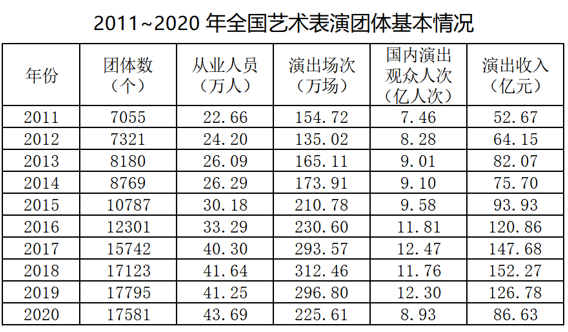

### 第 1 题　qid 5102147 · 平均数

2011~2020年期间，全国艺术表演团体演出收入的年平均值：

- **A**. 大于100亿元　✅
- **B**. 等于100亿元
- **C**. 小于100亿元
- **D**. 无法算出

**答案**：A

**官方解析**

根据题干“2011~2020年······的年平均值”，可判定本题为现期平均数问题。定位表格材料可得：2011~2020年全国艺术表演团体演出收入分别为52.67亿元、64.15亿元、82.07亿元、75.70亿元、93.93亿元、120.86亿元、147.68亿元、152.27亿元、126.78亿元、86.63亿元。根据选项的范围设置，利用“削峰填谷”，以100为基准，分别作差为：-47.33、-35.85、-17.93、-24.3、-6.07、20.86、47.68、52.27、26.78、-13.37，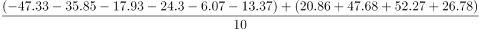，即所求年平均值大于100亿元。

故正确答案为A。

---

### 第 2 题　qid 5102149 · 增长

2011~2020年中，全国艺术团体数同比增量超过2000个的年份有：

- **A**. 1个
- **B**. 2个　✅
- **C**. 3个
- **D**. 4个

**答案**：B

**官方解析**

根据题干“2011~2020年中······同比增量超过2000个······”，可判定本题为增长量计算问题。定位表格材料可得：2011~2020年各年的全国艺术团体数依次为：7055个、7321个、8180个、8769个、10787个、12301个、15742个、17123个、17795个和17581个。根据公式：增长量=现期量-基期量，可得2012~2020年各年全国艺术团体数的同比增量，情况如下：
2012年的同比增量=7321-7055=266个&lt;2000个；
2013年的同比增量=8180-7321=859个&lt;2000个；
2014年的同比增量=8769-8180=589个&lt;2000个；
2015年的同比增量=10787-8769=2018个&gt;2000个；
2016年的同比增量=12301-10787=1514个&lt;2000个；
2017年的同比增量=15742-12301=3441个&gt;2000个；
2018年的同比增量=17123-15742=1381个&lt;2000个；
2019年的同比增量=17795-17123=672个&lt;2000个；
2020年的同比增量=17581-17795=-214个&lt;2000个。
则2011~2020年中，全国艺术团体数同比增量超过2000个的年份有2015年和2017年，共2个。
故正确答案为B。
【备注】根据历年真题教研，本题问法也应计算2011年的增量。但由于题目数据不支持推出2011年增量，本题从2012年增量开始分析。

---

### 第 3 题　qid 5102151 · 比重

2020年，在全国艺术表演团体中，各级文化和旅游部门所属艺术表演团体从业人员占比约为：

- **A**. 11.7%
- **B**. 24.6%　✅
- **C**. 27.4%
- **D**. 31.7%

**答案**：B

**官方解析**

根据题干“2020年，······占比约为”，可判定本题为现期比重问题。定位文字材料可得：2020年末，全国共有艺术表演团体从业人员43.69万人，其中各级文化和旅游部门所属艺术表演团体从业人员10.75万人。则2020年，在全国艺术表演团体中，各级文化和旅游部门所属艺术表演团体从业人员占比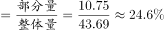。

故正确答案为B。

---

### 第 4 题　qid 5102156 · 综合

以下折线图中，能准确反映2011~2020年国内演出观众人次变化的是：

- **A**. A
- **B**. B
- **C**. C　✅
- **D**. D

**答案**：C

**官方解析**

定位表格材料可得：2011年、2012年、2013年、2014年、2015年、2016年、2017年、2018年、2019年、2020年国内演出观众人次分别为：7.46亿人次、8.28亿人次、9.01亿人次、9.10亿人次、9.58亿人次、11.81亿人次、12.47亿人次、11.76亿人次、12.30亿人次、8.93亿人次，人次变化趋势为开始缓慢升高，排除B、D两项；最后下降，排除A项。
故正确答案为C。

---

### 第 5 题　qid 5102157 · 综合

不能够从上述资料中推出的是：

- **A**. 2015年，全国艺术表演团体平均演出收入不足100万元
- **B**. 2018年，全国艺术表演团体演出收入同比增速快于2016年　✅
- **C**. 2019年，全国文化和旅游部门所属艺术表演团体组织的政府采购公益演出中，观众超过1亿人次
- **D**. 2020年，全国艺术表演团体演出场次与国内演出观众人次均同比下降

**答案**：B

**官方解析**

A项：定位表格材料可得，2015年全国艺术表演团体演出收入为93.93亿元，表演团体数为10787个。则2015年全国艺术表演团体平均演出收入为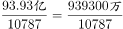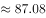万元＜100万元，正确。

B项：定位表格材料可得，2018年全国艺术表演团体演出收入为152.27亿元，2017年为147.68亿元，故2018年全国艺术表演团体演出收入同比增速为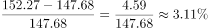；2016年全国艺术表演团体演出收入为120.86亿元，2015年为93.93亿元，故2016年全国艺术表演团体演出收入同比增速为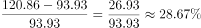。因此2018年全国艺术表演团体演出收入同比增速低于2016年，而非快于2016年，错误。

C项：定位文字材料可得，2020年，全国文化和旅游部门所属艺术表演团体组织政府采购公益演出观众0.86亿人次，下降27.9%。则2019年观众人次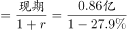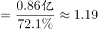亿人次＞1亿人次，正确。

D项：定位表格材料可得，2020年全国艺术表演团体演出场次225.61万场＜2019年演出场次296.80万场；2020年国内演出观众人次8.93亿人次＜2019年观众人次12.30亿人次。因此2020年全国艺术表演团体演出场次与国内演出观众人次均同比下降，正确。

本题为选非题，故正确答案为B。

---

## 材料 2

### 第 6 题　qid 5102166 · 增长

假设2021年居民医保基金收入同比增速与2020年相同，那么，2021年居民医保基金收入约为：

- **A**. 9598亿元
- **B**. 9689亿元　✅
- **C**. 9727亿元
- **D**. 9873亿元

**答案**：B

**官方解析**

根据题干“假设2021年······同比增速与2020年相同······2021年······约为”，结合材料时间为2012-2020年，可判定本题为现期计算问题。定位统计表可得：2019年居民医保基金支出和结余率分别为8191亿元和4.5%，2020年基金收入为9115亿元。根据结余率，则有，解得2019年居民医保基金收入亿元（也可结合本篇材料第3题得出此数据）。根据公式：增长率、现期量=基期量×（1+增长率）。则2021年居民医保基金收入亿元，与B项最接近。

故正确答案为B。

---

### 第 7 题　qid 5102167 · 综合

2019年，职工医保参保人数共：

- **A**. 30322万人
- **B**. 31681万人
- **C**. 32924万人　✅
- **D**. 34455万人

**答案**：C

**官方解析**

定位统计图可知，2019年在职职工医保参保人数为24224万人，退休职工医保参保人数为8700万人，则2019年职工医保参保人数为在职职工医保参保人数与退休职工医保参保人数之和：24224+8700=32924万人。
故正确答案为C。

---

### 第 8 题　qid 5102170 · 综合

表中（？）处应填入的数字是：

- **A**. 7822
- **B**. 8559
- **C**. 8577　✅
- **D**. 8898

**答案**：C

**官方解析**

表中“？”为2019年基金收入，结合材料给出2019年基金支出以及结余率，可判定本题为现期比重问题。定位统计表，2019年基金支出为8191亿元，结余率为4.5%。根据公式结余率，将数据代入公式可得，则基金收入，与C项最接近。

故正确答案为C。

---

### 第 9 题　qid 5102172 · 增长

下列年份中，在职职工参保人数同比增速大小排序错误的是：

- **A**. 2017年＞2016年
- **B**. 2018年＞2017年
- **C**. 2019年＞2018年　✅
- **D**. 2020年＞2019年

**答案**：C

**官方解析**

根据题干“······同比增速大小排序”，可判定本题为一般增长率问题。定位统计图可得2016-2020年在职职工参保人数，根据公式，增长率，代入公式可得2016-2020年在职职工参保人数同比增速分别为：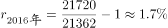，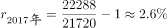，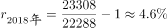，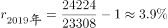，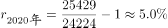。因此，2019年同比增速小于2018年同比增速，C项排序错误。

本题为选非题，故正确答案为C。

---

### 第 10 题　qid 5102175 · 增长

能够从上述资料中推出的有：
①2017年职工医保在职退休比高于2016年
②2020年居民医保参保人数比上年略有增加
③2012—2020年间，职工医保参保人数持续增加
④2012—2020年间，居民医保基金支出增长金额最快的是2017年

- **A**. 1
- **B**. 2　✅
- **C**. 3
- **D**. 4

**答案**：B

**官方解析**

①：定位统计图可得：2017年职工医保在职退休比相较于2016年有所下降，故2017年退休比＜2016年退休比，错误；

②：材料所给数据均为职工医保参保人数，未出现居民医保参保人数相关数据，故无法推出，错误；

③：定位统计图可得：在职职工参保人数和退休职工参保人数2012年-2020年每年均在增加，故职工医保参保总人数也持续增加，正确；

④：定位统计表可得2012-2020年的数据，根据公式：增长率，

2013年，；

2014年，；

2015年，；

2016年，；

2017年，；

2018年，；

2019年，；

2020年，基金支出较上年下降，增长率&lt;0。故2017年增速最快，正确；

综上所述，只有③④正确，共2项。

故正确答案为B。

【备注】根据历年真题教研，对于④的问法，如果材料有2011年数据，需要计算2012年的增速，但如果材料没有2011年的数据，则不用计算。因此判定④正确。

---

## 材料 3

        近年来，我国新能源汽车销量及保有量快速提升，充电基础设施布局也日渐完善。2021年新能源汽车销量达352.1万辆，同比增长157.51%；截至2021年，我国新能源汽车保有量达784万辆，同比增长59.25%。

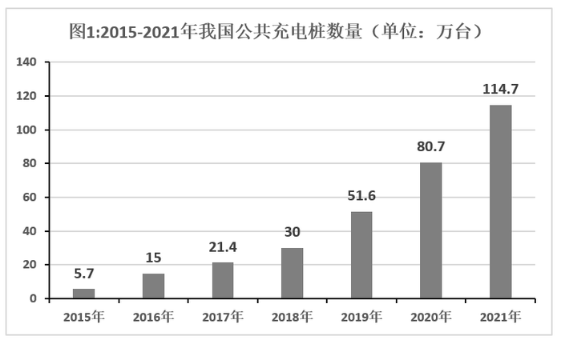

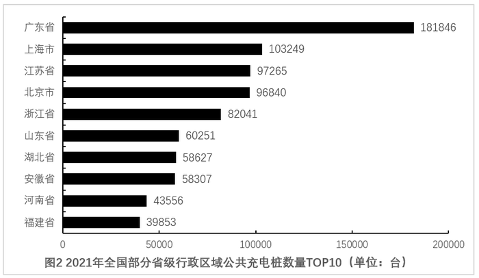

### 第 11 题　qid 5102148 · 增长

2016—2021年我国公共充电桩数量年均增长量约为：

- **A**. 15.57万台
- **B**. 17.35万台
- **C**. 18.17万台
- **D**. 19.94万台　✅

**答案**：D

**官方解析**

根据题干“2016—2021年······年均增长量约”，可判定本题为年均增长量问题。定位图1可得，2016年我国公共充电桩数量为15万台，2021年我国公共充电桩数量为114.7万台，根据年均增长量公式：年均增长量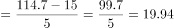万台。

故正确答案为D。

---

### 第 12 题　qid 5102150 · 比重

2021年北京市、上海市、广东省公共充电桩数量之和占全国公共充电桩总数的比重约为：

- **A**. 28.7%
- **B**. 33.3%　✅
- **C**. 39.8%
- **D**. 46.7%

**答案**：B

**官方解析**

根据题干“2021年······占······的比重约为”，可判定本题为现期比重问题。定位图1可得：2021年我国公共充电桩数量为114.7万台；定位图2可得：2021年广东省、上海市、北京市公共充电桩数量依次为181846台、103249台、96840台。根据公式：比重，则2021年北京市、上海市、广东省公共充电桩数量之和占全国公共充电桩总数的比重为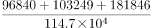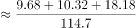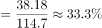。

故正确答案为B。

---

### 第 13 题　qid 5102152 · 增长

2016—2021年我国公共充电桩数量同比增速未超过50%的年份有：

- **A**. 1个
- **B**. 2个
- **C**. 3个　✅
- **D**. 4个

**答案**：C

**官方解析**

根据题干“······同比增速未超过50%······”，可判定本题为一般增长率问题。定位图1可知2015—2021年我国公共充电桩数量。根据公式：增长率，同比增速未超过50%，即现期量1.5基期量。

2016年：15＞5.7×1.5=8.55，不满足；

2017年：21.4＜15×1.5=22.5，满足；

2018年：30＜21.4×1.5=32.1，满足；

2019年：51.6＞30×1.5=45，不满足；

2020年：80.7＞51.6×1.5=77.4，不满足；

2021年：114.7＜80.7×1.5=121.05，满足。

因此2016—2021年我国公共充电桩数量同比增速未超过50%的年份有3个。

故正确答案为C。

---

### 第 14 题　qid 5102153 · 增长

2016—2021年我国公共充电桩数量同比增速最大的年份是：

- **A**. 2016年　✅
- **B**. 2019年
- **C**. 2020年
- **D**. 2021年

**答案**：A

**官方解析**

根据题干“2016-2021年······同比增速最大的年份是”，可判定本题为一般增长率比较问题。定位统计图1可知2015—2021年我国公共充电桩数量。根据公式：增长率，可得我国公共充电桩数量同比增速分别为：

2016年，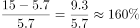；

2019年，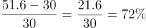；

2020年，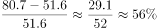；

2021年，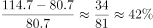。

则2016—2021年我国公共充电桩数量同比增速最大的年份是2016年。

故正确答案为A。

---

### 第 15 题　qid 5102154 · 综合

下列选项能够从上述资料中推出的是：

- **A**. 2022年我国公共充电桩数量超过180万台
- **B**. 2021年我国公共充电桩数量超过5万台的省级行政区域有7个
- **C**. 2016—2021年我国公共充电桩数量同比增速最小的年份是2017年
- **D**. 2021年我国省级行政区域公共充电桩数量前5名之和占全国总数的比重约为48.9%　✅

**答案**：D

**官方解析**

A项：材料中没有给出2022年我国公共充电桩数量的相关数据，因此无法计算，不能推出，错误；

B项：定位图2可得，2021年我国公共充电桩数量超过5万台的省级行政区域有8个，分别是广东省、上海市、江苏省、北京市、浙江省、山东省、湖北省、安徽省，并非7个，错误；

C项：定位图1可得，2017年我国公共充电桩数量同比增速为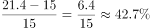，2018年我国公共充电桩数量同比增速为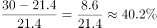，2017年我国公共充电桩数量同比增速高于2018年，并非最小，错误；

D项：定位图1、2可得，2021年我国公共充电桩数量为114.7万台，2021年我国省级行政区域公共充电桩数量前5名之和为181846+103249+97265+96840+82041182000+103000+97000+97000+82000=561000=56.1万台，占全国总数的比重为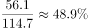，正确。

故正确答案为D。

---
