# 2022年广东省公务员录用考试《行测》题（乡镇卷）（网友回忆版）

> 资料分析 · 15 题 · 广东 2022

## 材料 1

        基层群众性自治组织是我国在城市和农村按居民的居住地区建立起来的居民委员会或村民委员会，是城市居民或农村村民自我管理、自我教育、自我服务的组织。

        截止2020年底，全国基层群众性自治组织共计61.5万个，同比减少4.35%。其中，村委会50.2万个，占基层群众性自治组织的81.63%，村民小组376.1万个，村委会成员207.3万人；居委会11.3万个，占基层群众性自治组织的18.37%，居民小组123.6万个，居委会成员61.6万人。2016-2020年，我国村（居）委会完成选举数分别为9.7万个、18.2万个、27.6万个、8.8万个、6.1万个，其中，2020年村（居）委会登记选民数为1.1亿人，参与投票人数为0.65亿人。

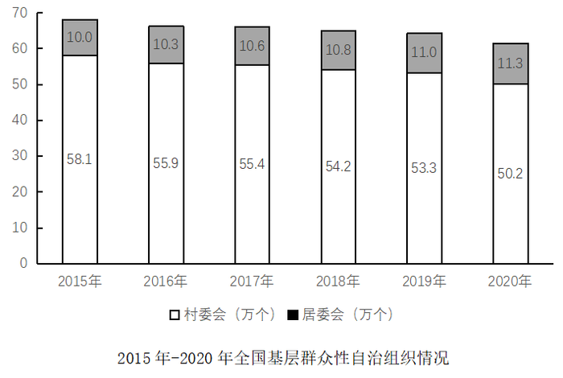

### 第 1 题　qid 4673210 · 综合

2020年，全国基层群众性自治组织较上年减少（    ）万个。

- **A**. 1.4
- **B**. 2.8　✅
- **C**. 4.2
- **D**. 5.6

**答案**：B

**官方解析**

根据题干“2020年······较上年减少（    ）万个”，可判定本题为增长量计算问题。定位统计图可知：2020年村委会有50.2万个，居委会有11.3万个，2019年村委会有53.3万个，居委会有11万个。根据公式：增长量=现期量-基期量，则2020年全国基层群众性自治组织较上年的增长量=（50.2+11.3）-（53.3+11）=61.5-64.3=-2.8万个，即减少2.8万个。
故正确答案为B。

---

### 第 2 题　qid 4673211 · 比重

相较2019年，2020年村委会占基层群众性自治组织的比重（    ）。

- **A**. 降低了约1.26个百分点　✅
- **B**. 提高了约1.26个百分点
- **C**. 降低了约12.6个百分点
- **D**. 提高了约12.6个百分点

**答案**：A

**官方解析**

根据题干“相较2019年，2020年······占·······的比重”，结合选项为降低/提高+百分点，可判定本题为两期比重问题。定位文字材料第二段可得：截止2020年底，村委会占基层群众性自治组织的81.63%；定位统计图可得：2019年村委会53.3万个，居委会11.0万个。则2019年村委会占基层群众性自治组织的比重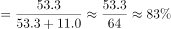。所求比重差=81.63%-83.0%=-1.37%，即降低了约1.37个百分点，与A项最接近。

故正确答案为A。

---

### 第 3 题　qid 4673212 · 增长

以下年份中，我国村(居)委会完成选举数同比增幅最大的是（    ）。

- **A**. 2017年　✅
- **B**. 2018年
- **C**. 2019年
- **D**. 2020年

**答案**：A

**官方解析**

根据题干“以下年份中，······同比增幅最大的是”，可判定本题为一般增长率问题。定位文字材料第二段可知，2016-2020年，我国村(居)委会完成选举数分别为9.7万个、18.2万个、27.6万个、8.8万个、6.1万个。2019年和2020年我国村(居)委会完成选举数较上年均同比减少，即增长率均小于0，2017年同比增幅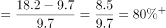，2018年同比增幅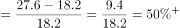，则2017年同比增幅最大。

故正确答案为A。

---

### 第 4 题　qid 4673213 · 平均数

2020年，平均每个村委会下辖的村民小组约（    ）个。

- **A**. 3.5
- **B**. 5.5
- **C**. 7.5　✅
- **D**. 9.5

**答案**：C

**官方解析**

根据题干“2020年，平均每个······约······”，可判定本题为现期平均数问题。定位文字材料第二段可得：截止2020年底，全国村委会50.2万个；村民小组376.1万个。则2020年平均每个村委会下辖的村民小组数量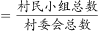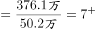个。

故正确答案为C。

---

### 第 5 题　qid 4673214 · 综合

根据所给材料，下列说法最准确的是：

- **A**. 2020年，村民小组数量是居民小组数量的5倍
- **B**. 2020年，平均每个村委会的成员数量超过4人　✅
- **C**. 2020年，超过60%的登记选民参与了投票
- **D**. 2015-2020年，村委会数量与居委会数量的变化趋势一致

**答案**：B

**官方解析**

A项：定位文字材料可知：截止2020年底，共有村民小组376.1万个，居民小组123.6万个。则村民小组数量是居民小组数量的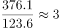倍，错误；

B项：定位文字材料可知：截止2020年底，共有村委会50.2万个，村委会成员207.3万人。根据公式：平均数，可得2020年，平均每个村委会的成员数量为：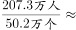4.1人＞4人，正确；

C项：定位文字材料可知：2020年村（居）委会登记选民数为1.1亿人，参与投票人数为0.65亿人。根据公式：比重，可得2020年参与投票人数占登记选民的比重为：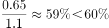，错误；

D项：定位图形材料可知，2015-2020年村委会数量呈整体下降趋势，居委会数量呈整体上升趋势，二者变化趋势并非一致，错误。

故正确答案为B。

---

## 材料 2

        增加森林面积、提高森林质量、提升生态系统碳汇增量，将为我国实现碳达峰、碳中和目标、维护全球生态安全做出巨大贡献。1973年，我国开展了第一次森林资源清查。目前已完成第9次森林资源清查，我国森林面积和森林蓄积量连续30年保持“双增长”。“十三五”时期，我国累计造林5.45亿亩，森林覆盖率达到23.04%，森林蓄积量为175.6亿立方米，森林面积达到2.2亿公顷（1公顷为15亩）。湿地保护率达到52%，治理沙化土地1.5亿亩。

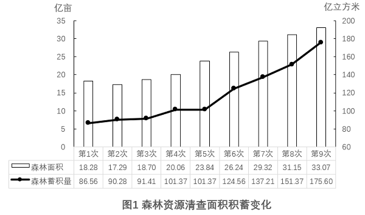

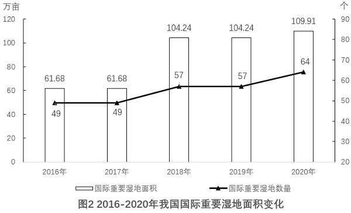

### 第 6 题　qid 4673140 · 平均数

“十三五”期间，我国平均每公顷森林蓄积量达到（    ）立方米。

- **A**. 5.3
- **B**. 32.2
- **C**. 79.8　✅
- **D**. 98.6

**答案**：C

**官方解析**

根据题干“‘十三五’期间······平均每公顷森林蓄积量······立方米”，可判定本题为现期平均数问题。定位文字材料可得：“十三五”时期······森林蓄积量为175.6亿立方米，森林面积达到2.2亿公顷（1公顷为15亩）。所求平均数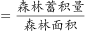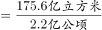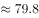立方米/公顷。

故正确答案为C。

---

### 第 7 题　qid 4673142 · 增长

相比第1次森林资源清查，第9次森林资源清查时，我国森林覆盖率提高了约（    ）个百分点。（本材料中森林覆盖率为森林面积占国土面积的百分比）

- **A**. 10　✅
- **B**. 15
- **C**. 20
- **D**. 25

**答案**：A

**官方解析**

根据题干“······我国森林覆盖率提高了约······”，结合森林覆盖率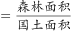，可判定本题为两期比重问题。定位文字材料和图1可得，“十三五”时期我国森林覆盖率达到23.04%，森林面积达到2.2亿公顷（1公顷为15亩）；第1次森林资源清查时，我国森林面积为18.28亿亩，第9次森林资源清查时，我国森林面积为33.07亿亩。

方法一：根据森林覆盖率，则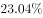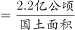，国土面积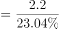 亿公顷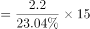亿亩。根据公式：比重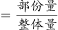，则所求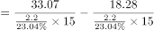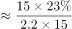，即提高了约10个百分点。

方法二：根据材料可知“十三五“时期即是第9次森林资源清查时期，故第9次资源清查时森林覆盖率为23.04%；根据森林覆盖率，则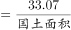，国土面积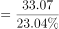亿亩；根据公式：比重，则第1次森林资源清查时，我国森林覆盖率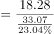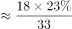，故所求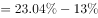，即提高了约10个百分点。

故正确答案为A。

---

### 第 8 题　qid 4673145 · 增长

2016-2018年，我国国际重要湿地面积的年均增长率约为（    ）。

- **A**. 25%
- **B**. 30%　✅
- **C**. 35%
- **D**. 40%

**答案**：B

**官方解析**

根据题干“2016-2018年······年均增长率约为”，可判定本题为年均增长率问题。定位图2可得：2016年与2018年我国国际重要湿地面积分别为61.68万亩、104.24万亩。根据年均增长率公式：（n为年份差），则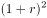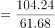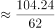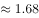，解得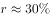。

故正确答案为B。

---

### 第 9 题　qid 4673161 · 增长

以下选项中，最准确地反映了2017-2020年我国国际重要湿地面积、数量同比增速变化情况的是（    ）。

- **A**. 
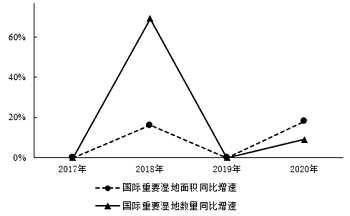

- **B**. 
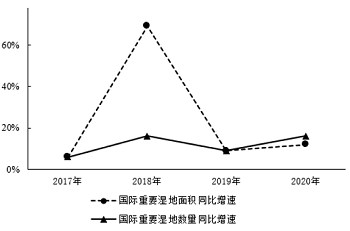

- **C**. 
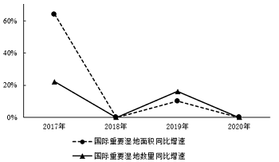

- **D**. 
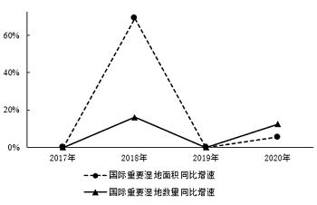
　✅

**答案**：D

**官方解析**

根据题干“2017-2020年······同比增速变化情况的是”，可判定本题为一般增长率问题。定位图2可得2016-2020年我国国际重要湿地面积和湿地数量。2017我国国际重要湿地面积与2016年相同，即同比增速为0，排除B、C两项；根据公式：增长率，则2018年我国国际重要湿地面积同比增速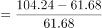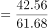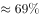，排除A项。

故正确答案为D。

---

### 第 10 题　qid 4673164 · 综合

根据以上资料，下列说法不准确的是（    ）。

- **A**. 我国森林蓄积量较前一次森林资源清查增幅最大的是第6次森林资源清查
- **B**. 第5次至第9次森林资源清查，我国森林面积和森林蓄积量的变化趋势一致
- **C**. 2016-2020年，我国平均每年增加国际重要湿地超过3个
- **D**. 2017-2020年，我国平均每个国际重要湿地面积同比增幅最大的年份是2020年　✅

**答案**：D

**官方解析**

A项：定位统计图1，可知我国第1次至第9次森林资源清查中的森林蓄积量，根据公式：增长率=，第6次森林资源清查中我国森林蓄积量增幅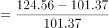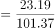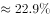；第2次：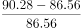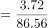；第3次：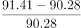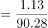；第4次：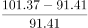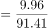；第5次：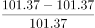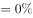；第7次：；第8次：；第9次：，故我国森林蓄积量较前一次森林资源清查增幅最大的是第6次森林资源清查，正确；

B项：定位统计图1，观察发现第5次至第9次森林资源清查，我国森林面积和森林蓄积量均保持增长，变化趋势一致，正确；

C项：定位统计图2，可知2016年和2020年我国国际重要湿地数量分别为49个和64个。根据公式：年均增长量，则2016-2020年我国平均每年增加国际重要湿地数量个个，正确；

D项：定位统计图2，可知2016-2020年我国国际重要湿地面积分别为61.68万亩、61.68万亩、104.24万亩、104.24万亩、109.91万亩，2016-2020年我国国际重要湿地数量分别为49个、49个、57个、57个、64个。其中2017年和2019年较上年数据均未发生变化，同比增幅为0，只需比较2018年和2020年即可。根据公式：增长率，可得2018年我国平均每个国际重要湿地面积同比增幅，2020年同比增幅，则2020年我国平均每个国际重要湿地面积同比增幅并非最大，错误。

本题为选非题，故正确答案为D。

---

## 材料 3

        近年来，全国基层卫生服务能力稳步提升，居民健康水平进一步提高。2020年，我国农村乡镇卫生院卫生人员数达148.1万人，比上年增加3.6万人，社区卫生人员数达52.1万人，比上年增加3.3万人。

### 第 11 题　qid 4673205 · 增长

2020年，全国农村乡镇卫生院中，卫生人员数同比增长约：

- **A**. 1.4%
- **B**. 2.5%　✅
- **C**. 3.6%
- **D**. 4.7%

**答案**：B

**官方解析**

根据题干“2020年······同比增长约”，结合选项为百分数，可判定本题为一般增长率计算问题。定位文字材料可得：2020年全国农村乡镇卫生院卫生人员数比上年增加3.6万人；定位表1可得：2019年全国农村乡镇卫生院卫生人员数为144.5万人。根据公式：增长率，可得所求增长率，与B项最接近。

故正确答案为B。

---

### 第 12 题　qid 4673206 · 平均数

2020年，全国社区卫生服务中心平均每名医师全年担负诊疗人次比全国农村乡镇卫生院的约多（    ）人次。

- **A**. 1576
- **B**. 1976　✅
- **C**. 2376
- **D**. 2776

**答案**：B

**官方解析**

定位统计表1、2可知：2020年全国农村乡镇卫生院平均每名医师日均担负诊疗人次为8.5，全国社区卫生服务中心平均每名医师日均担负诊疗人次为13.9。2020年为闰年，所以全年为366天。2020年，全国社区卫生服务中心平均每名医师全年担负诊疗人次比全国农村乡镇卫生院的约多人次。

故正确答案为B。

---

### 第 13 题　qid 4673207 · 平均数

2020年，平均每个乡镇床位数约为每个街道床位数的（    ）倍。

- **A**. 0.5
- **B**. 2　✅
- **C**. 3
- **D**. 4

**答案**：B

**官方解析**

根据题干“2020年······约为······的（    ）倍”，可判定本题为现期倍数问题。定位表1可得：2020年乡镇床位数为139.0万张，乡镇数为3.00万个；定位表2可得：2020年街道床位数为22.6万张，街道数为8773个。则2020年，平均每个乡镇床位数为每个街道床位数的倍，与B项最接近。

故正确答案为B。

---

### 第 14 题　qid 4673208 · 比重

2020年，全国农村乡镇卫生院卫生人员中，执业（助理）医师占比约为（    ）。

- **A**. 25%
- **B**. 30%
- **C**. 35%　✅
- **D**. 40%

**答案**：C

**官方解析**

根据题干“2020年······中······占比约为”，结合材料给出的2020年数据，可以判定本题为现期比重问题。定位表1可得，2020年，全国农村乡镇卫生院卫生人员数为148.1万人，其中执业（助理）医师人员数为52.0万人。根据比重，故所求比重为。

故正确答案为C。

---

### 第 15 题　qid 4673209 · 综合

根据所给材料，下列说法最不准确的是：

- **A**. 与2019年相比，2020年全国乡镇卫生院卫生技术人员和社区卫生服务中心卫生技术人员均有所增加
- **B**. 2020年，平均每个街道社区卫生服务中心数与2019年基本持平
- **C**. 2019-2020年，全国乡镇卫生院年平均入院人数是全国社区服务中心的十倍以上
- **D**. 2019年，全国农村人口约为8亿　✅

**答案**：D

**官方解析**

A项：定位表1可得，2019年、2020年全国农村乡镇卫生院卫生技术人员分别为123.2、126.7万人；定位表2可得，2019年、2020年全国社区卫生服务中心卫生技术人员分别为41.5、44.4万人，2020年两者均比2019年有所增加，正确；

B项：定位表2可得，2019年、2020年街道数分别为8515、8773个，社区卫生服务中心数分别为9561、9826个，则2019年平均每个街道社区卫生服务中心数个，2020年平均每个街道社区卫生服务中心数个，两者基本持平，正确；

C项：定位表1可得，2019年、2020年全国农村乡镇卫生院入院人数分别为3909、3383万人；定位表2可得，2019年、2020年全国社区服务中心入院人数分别为339.5、292.7万人，则2019-2020年，全国乡镇卫生院年平均入院人数万人，全国社区服务中心年平均入院人数万人，前者是后者的倍，正确；

D项：定位表1可得，2019年全国农村乡镇卫生院床位数为137.0万张，每千农村人口乡镇卫生院床位为1.48张，则2019年农村人口数 千人亿人，错误。

本题为选非题，故正确答案为D。

---
