# 2022年广东省公务员录用考试《行测》题（县级卷）（网友回忆版）

> 资料分析 · 15 题 · 广东 2022

## 材料 1

        2020年，全国职工基本医疗保险（以下简称职工医保）参保人数持续增加，基金收支规模基本稳定。参加职工医保34455万人，比上年同比增加1530万人。其中在职职工25429万人，比上年增长5.0%；退休职工9026万人，比上年增长3.7%。企业、机关事业、灵活就业等其他人员三类参保人员（包括在职职工和退休人员）分别为23317万人、6387万人、4751万人，分别比上年增加1050万人、155万人、325万人。

        受新冠肺炎疫情影响，2020年2-7月全国多地实施阶段性减半征收职工医保单位缴费，累计减征约1649亿元，全年职工医保基金（含生育保险）收入15732亿元，比上年减少0.7%；支出12867亿元，比上年增长1.6%。2020年，职工医保统筹基金（含生育保险）收入9145亿元，比上年减少8.6%；支出7931亿元，比上年减少0.1%；当期结存1214亿元，累计结存15327亿元。

        2020年，职工医保个人账户收入6587亿元，比上年增长12.8%；支出4936亿元，比上年增长4.5%；当期结存1650亿元，累计结存10096亿元。

        2020年就诊量同比有所减少。参加职工医保人员享受待遇17.9亿人次，比上年减少15.6%。职工医保参保人员住院率15.9%，比上年下降2.8个百分点。其中：在职职工住院率为8.6%，比上年下降1.5个百分点；退休职工住院率为36.0%，比上年下降6.5个百分点。

### 第 1 题　qid 4673117 · 增长

2020年，全国参加职工医保人数同比增长约（    ）。

- **A**. 4.6%　✅
- **B**. 5.4%
- **C**. 6.2%
- **D**. 7.1%

**答案**：A

**官方解析**

根据题干“2020年······同比增长约······”，结合选项为百分数，可判定本题为一般增长率问题。定位文字材料第一段可得：“（2020年）参加职工医保34455万人，比上年同比增加1530万人。”根据公式：增长率，则2020年，全国参加职工医保人数同比增速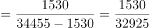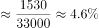。

故正确答案为A。

---

### 第 2 题　qid 4673119 · 比重

2020年，灵活就业等其他人员参保人数占职工医保参保总人数的比例约为（    ）。

- **A**. 12.9%
- **B**. 13.8%　✅
- **C**. 15.2%
- **D**. 16.1%

**答案**：B

**官方解析**

根据题干“2020年······占······的比例约为”，结合材料时间为2020年，可判定本题为现期比重问题。定位文字材料第一段可得：“2020年······参加职工医保34455万人······企业、机关事业、灵活就业等其他人员三类参保人员（包括在职职工和退休人员）分别为23317万人、6387万人、4751万人。”根据公式：比重，可得灵活就业等其他人员参保人数占职工医保参保总人数的比例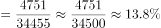。

故正确答案为B。

---

### 第 3 题　qid 4673121 · 增长

若2-7月未实施阶段性减半征收职工医保单位缴费，则2020年职工医保基金总收入（含生育保险）同比增长（    ）。

- **A**. 4%
- **B**. 7%
- **C**. 10%　✅
- **D**. 13%

**答案**：C

**官方解析**

根据题干“······2020年······同比增长”，结合选项为百分数，可判定本题为一般增长率问题。定位文字材料第二段：“2020年2-7月全国多地实施阶段性减半征收职工医保单位缴费，累计减征约1649亿元，全年职工医保基金（含生育保险）收入15732亿元，比上年减少0.7%。”根据公式：基期量，可得2019年职工医保基金（含生育保险）收入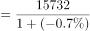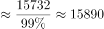亿元；若2-7月未实施阶段性减半征收职工医保单位缴费，则2020年职工医保基金（含生育保险）收入=15732+1649=17381亿元；又根据公式：增长率，可得2020年职工医保基金总收入（含生育保险）同比增长率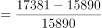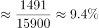，与C项最接近。

故正确答案为C。

---

### 第 4 题　qid 4673123 · 增长

2020年，下列指标的同比增长率从高到低排列正确的是（    ）。

- **A**. 职工医保基金（含生育保险）收入>职工医保个人账户收入>职工医保统筹基金（含生育保险）收入
- **B**. 职工医保个人账户支出>职工医保个人账户收入>职工医保统筹基金（含生育保险）收入
- **C**. 职工医保个人账户收入>职工医保基金（含生育保险）收入>职工医保基金（含生育保险）支出
- **D**. 职工医保基金（含生育保险）支出>职工医保统筹基金（含生育保险）支出>职工医保基金（含生育保险）收入　✅

**答案**：D

**官方解析**

定位材料第二、第三段可得：（2020）全年职工医保基金（含生育保险）收入······比上年减少0.7%；支出······比上年增长1.6%。2020年，职工医保统筹基金（含生育保险）······支出······比上年减少0.1%。2020年，职工医保个人账户收入······比上年增长12.8%；支出······比上年增长4.5%。各项指标的同比增长率验证如下：
A项，职工医保基金（含生育保险）收入（-0.7%）&lt;职工医保个人账户收入（12.8%），错误；
B项，职工医保个人账户支出（4.5%）&lt;职工医保个人账户收入（12.8%），错误；
C项，职工医保基金（含生育保险）收入（-0.7%）&lt;职工医保基金（含生育保险）支出（1.6%），错误；
D项，职工医保基金（含生育保险）支出（1.6%）&gt;职工医保统筹基金（含生育保险）支出（-0.1%）&gt;职工医保基金（含生育保险）收入（-0.7%），正确。
故正确答案为D。

---

### 第 5 题　qid 4673124 · 综合

根据以上资料，下列说法不准确的是（    ）。

- **A**. 2020年，职工医保参保人员人均享受待遇约5次
- **B**. 2019年，在职职工住院率约为退休职工住院率的四分之一
- **C**. 2020年，三类职工医保参保人员中，灵活就业等其他人员参保人数同比增速最快
- **D**. 若职工医保个人账户收入和支出的年同比增幅保持不变，则2021年个人账户当期结存不足2000亿元　✅

**答案**：D

**官方解析**

A项：定位文字材料第一段可得，2020年全国参加职工医保34455万人，定位文字材料第四段可得，2020年参加职工医保人员享受待遇17.9亿人次，则人均享受待遇次数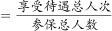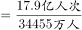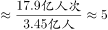次。正确；

B项：定位文字材料第四段可得，2020年在职职工住院率为8.6%，比上年下降1.5个百分点；退休职工住院率为36.0%，比上年下降6.5个百分点。则2019年在职职工住院率为8.6%+1.5%=10.1%，退休职工住院率为36%+6.5%=42.5%，在职职工住院率约为退休职工住院率的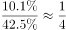。正确；

C项：定位文字材料第一段可得，2020年企业、机关事业、灵活就业等其他人员三类参保人员（包括在职职工和退休人员）分别为23317万人、6387万人、4751万人，分别比上年增加1050万人、155万人、325万人。根据增长率。则三类参保人员参保人数同比增速分别为：企业：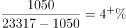；机关事业：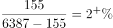；灵活就业等其他人员：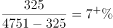，可得灵活就业等其他人员参保人数同比增速最快。正确；

D项：定位文字材料第三段可得，2020年职工医保个人账户收入6587亿元，比上年增长12.8%；支出4936亿元，比上年增长4.5%；当期结存1650亿元。根据公式：现期量=基期量×（1+增长率），则2021年个人账户当期结存=2021年个人账户收入-2021年个人账户支出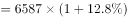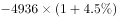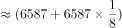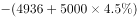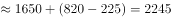亿元，超过2000亿元。错误。

本题为选非题，故正确答案为D。

---

## 材料 2

        增加森林面积、提高森林质量、提升生态系统碳汇增量，将为我国实现碳达峰、碳中和目标、维护全球生态安全做出巨大贡献。1973年，我国开展了第一次森林资源清查。目前已完成第9次森林资源清查，我国森林面积和森林蓄积量连续30年保持“双增长”。“十三五”时期，我国累计造林5.45亿亩，森林覆盖率达到23.04%，森林蓄积量为175.6亿立方米，森林面积达到2.2亿公顷（1公顷为15亩）。湿地保护率达到52%，治理沙化土地1.5亿亩。

### 第 6 题　qid 4673140 · 平均数

“十三五”期间，我国平均每公顷森林蓄积量达到（    ）立方米。

- **A**. 5.3
- **B**. 32.2
- **C**. 79.8　✅
- **D**. 98.6

**答案**：C

**官方解析**

根据题干“‘十三五’期间······平均每公顷森林蓄积量······立方米”，可判定本题为现期平均数问题。定位文字材料可得：“十三五”时期······森林蓄积量为175.6亿立方米，森林面积达到2.2亿公顷（1公顷为15亩）。所求平均数立方米/公顷。

故正确答案为C。

---

### 第 7 题　qid 4673142 · 增长

相比第1次森林资源清查，第9次森林资源清查时，我国森林覆盖率提高了约（    ）个百分点。（本材料中森林覆盖率为森林面积占国土面积的百分比）

- **A**. 10　✅
- **B**. 15
- **C**. 20
- **D**. 25

**答案**：A

**官方解析**

根据题干“······我国森林覆盖率提高了约······”，结合森林覆盖率，可判定本题为两期比重问题。定位文字材料和图1可得，“十三五”时期我国森林覆盖率达到23.04%，森林面积达到2.2亿公顷（1公顷为15亩）；第1次森林资源清查时，我国森林面积为18.28亿亩，第9次森林资源清查时，我国森林面积为33.07亿亩。

方法一：根据森林覆盖率，则，国土面积 亿公顷亿亩。根据公式：比重，则所求，即提高了约10个百分点。

方法二：根据材料可知“十三五“时期即是第9次森林资源清查时期，故第9次资源清查时森林覆盖率为23.04%；根据森林覆盖率，则，国土面积亿亩；根据公式：比重，则第1次森林资源清查时，我国森林覆盖率，故所求，即提高了约10个百分点。

故正确答案为A。

---

### 第 8 题　qid 4673145 · 增长

2016-2018年，我国国际重要湿地面积的年均增长率约为（    ）。

- **A**. 25%
- **B**. 30%　✅
- **C**. 35%
- **D**. 40%

**答案**：B

**官方解析**

根据题干“2016-2018年······年均增长率约为”，可判定本题为年均增长率问题。定位图2可得：2016年与2018年我国国际重要湿地面积分别为61.68万亩、104.24万亩。根据年均增长率公式：（n为年份差），则，解得。

故正确答案为B。

---

### 第 9 题　qid 4673161 · 增长

以下选项中，最准确地反映了2017-2020年我国国际重要湿地面积、数量同比增速变化情况的是（    ）。

- **A**. 

- **B**. 

- **C**. 

- **D**. 

　✅

**答案**：D

**官方解析**

根据题干“2017-2020年······同比增速变化情况的是”，可判定本题为一般增长率问题。定位图2可得2016-2020年我国国际重要湿地面积和湿地数量。2017我国国际重要湿地面积与2016年相同，即同比增速为0，排除B、C两项；根据公式：增长率，则2018年我国国际重要湿地面积同比增速，排除A项。

故正确答案为D。

---

### 第 10 题　qid 4673164 · 综合

根据以上资料，下列说法不准确的是（    ）。

- **A**. 我国森林蓄积量较前一次森林资源清查增幅最大的是第6次森林资源清查
- **B**. 第5次至第9次森林资源清查，我国森林面积和森林蓄积量的变化趋势一致
- **C**. 2016-2020年，我国平均每年增加国际重要湿地超过3个
- **D**. 2017-2020年，我国平均每个国际重要湿地面积同比增幅最大的年份是2020年　✅

**答案**：D

**官方解析**

A项：定位统计图1，可知我国第1次至第9次森林资源清查中的森林蓄积量，根据公式：增长率=，第6次森林资源清查中我国森林蓄积量增幅；第2次：；第3次：；第4次：；第5次：；第7次：；第8次：；第9次：，故我国森林蓄积量较前一次森林资源清查增幅最大的是第6次森林资源清查，正确；

B项：定位统计图1，观察发现第5次至第9次森林资源清查，我国森林面积和森林蓄积量均保持增长，变化趋势一致，正确；

C项：定位统计图2，可知2016年和2020年我国国际重要湿地数量分别为49个和64个。根据公式：年均增长量，则2016-2020年我国平均每年增加国际重要湿地数量个个，正确；

D项：定位统计图2，可知2016-2020年我国国际重要湿地面积分别为61.68万亩、61.68万亩、104.24万亩、104.24万亩、109.91万亩，2016-2020年我国国际重要湿地数量分别为49个、49个、57个、57个、64个。其中2017年和2019年较上年数据均未发生变化，同比增幅为0，只需比较2018年和2020年即可。根据公式：增长率，可得2018年我国平均每个国际重要湿地面积同比增幅，2020年同比增幅，则2020年我国平均每个国际重要湿地面积同比增幅并非最大，错误。

本题为选非题，故正确答案为D。

---

## 材料 3

        2020年，受新冠肺炎疫情影响，我国民航全行业完成旅客运输量41777.82万人次，比上年下降36.7%。国内航线完成旅客运输量40821.30万人次，比上年下降30.3%，其中港澳台航线完成旅客运输量96.13万人次，比上年下降91.3%，国际航线完成旅客运输量956.51万人次，比上年下降87.1%。尽管如此，我国国内航空运输市场在全球范围内恢复最快、运行最好。

        2020年，全行业运输航空公司完成运输飞行时长876.22万小时，比上年下降28.8%。国内航线完成运输飞行时长788.22万小时，比上年下降20.5%，其中港澳台航线完成运输飞行时长3.55万小时，比上年下降82.3%，国际航线完成运输飞行时长87.99万小时，比上年下降63.3%。

        2020年，全行业运输航空公司完成运输起飞371.09万架次，比上年下降25.3%。国内航线完成运输起飞357.29万架次，比上年下降20.2%，其中港澳台航线完成运输起飞1.65万架次，比上年下降80.3%，国际航线完成运输起飞13.79万架次，比上年下降71.8%。

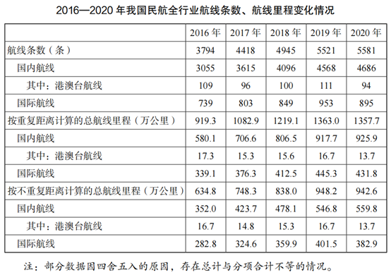

### 第 11 题　qid 4673139 · 比重

相比2019年，2020年我国民航全行业完成旅客运输中，国内航线完成旅客运输总量占比约（    ）。

- **A**. 降低了9%
- **B**. 降低了15%
- **C**. 提高了9%　✅
- **D**. 提高了15%

**答案**：C

**官方解析**

根据题干“相比2019年，2020年······中······占比约”，结合选项为提高了/降低了+%，可判定本题为两期比重计算问题。定位文字材料第一段可得：2020年，我国民航全行业完成旅客运输量41777.82万人次（B），比上年下降36.7%（b）。国内航线完成旅客运输量40821.30万人次（A），比上年下降30.3%（a）。根据公式：两期比重差，可得2020年国内航线完成旅客运输总量占比与2019年的差值为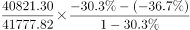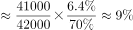，即约提高了9%。

故正确答案为C。

备注：比重自身为率，一般只讨论比重变化的差值。本题严谨表示应为两期比重变化了几个百分点。

---

### 第 12 题　qid 4673143 · 平均数

2019年，平均每架次完成运输飞行时长最长的是（    ）。

- **A**. 国内航线
- **B**. 港澳台航线
- **C**. 国际航线　✅
- **D**. 全行业运输航空公司

**答案**：C

**官方解析**

根据题干“2019年，平均每······最长的是”，结合材料时间为2020年，可判定本题为基期平均数问题。定位文字材料第二段可得：2020年，全行业运输航空公司完成运输飞行时长876.22万小时（），比上年下降28.8%（）。国内航线完成运输飞行时长788.22万小时（），比上年下降20.5%（），其中港澳台航线完成运输飞行时长3.55万小时（），比上年下降82.3%（），国际航线完成运输飞行时长87.99万小时（），比上年下降63.3%（）。

定位文字材料第三段可得：2020年，全行业运输航空公司完成运输起飞371.09万架次（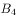），比上年下降25.3%（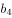）。国内航线完成运输起飞357.29万架次（），比上年下降20.2%（），其中港澳台航线完成运输起飞1.65万架次（），比上年下降80.3%（），国际航线完成运输起飞13.79万架次（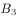），比上年下降71.8%（）。

根据公式：基期平均数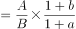，可得2019年平均每架次完成运输飞行时长分别为：国内航线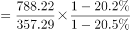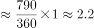小时/架次，港澳台航线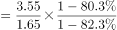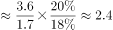小时/架次，国际航线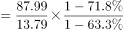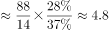小时/架次，全行业运输航空公司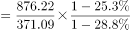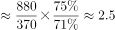小时/架次，比较可得，国际航线平均每架次完成运输飞行时长最长。

故正确答案为C。

---

### 第 13 题　qid 4673147 · 综合

2016-2020年，国内航线条数比国际航线条数多4倍以上的年份有（    ）。

- **A**. 1　✅
- **B**. 2
- **C**. 3
- **D**. 5

**答案**：A

**官方解析**

根据题干“2016-2020年······比······多4倍以上的年份有”，可判定本题为现期倍数问题。定位统计表可得：2016-2020年我国国内航线条数分别为3055条、3615条、4096条、4568条、4686条；2016-2020年国际航线条数分别为739条、803条、849条、953条、895条。则2016-2020年国内航线条数比国际航线条数分别多：

2016年：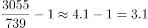倍；

2017年：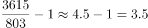倍；

2018年：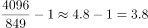倍；

2019年：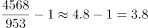倍；

2020年：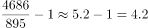倍。

综上，国内航线条数比国际航线条数多4倍以上的年份只有2020年。

故正确答案为A。

---

### 第 14 题　qid 4673149 · 增长

按不重复距离计算，以下年份中，国际航线里程同比增速最快的是（    ）。

- **A**. 2017年　✅
- **B**. 2018年
- **C**. 2019年
- **D**. 2020年

**答案**：A

**官方解析**

根据题干“······同比增速最快的是······”，可判定本题为一般增长率问题。定位统计表可得：按不重复距离计算，2016-2020年国际航线的里程分别为282.8万公里、324.6万公里、359.9万公里、401.5万公里、382.9万公里。根据公式：增长率，可得各个年份按不重复距离计算的国际航线里程同比增速分别为：

2017年：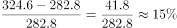；

2018年：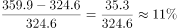；

2019年：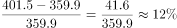；

2020年：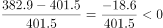，

比较可得，国际航线里程同比增速最快的是2017年。

故正确答案为A。

---

### 第 15 题　qid 4673154 · 综合

根据以上资料，下列说法准确的是（    ）。

- **A**. 2019年，国内航线运输飞行时长占全行业运输航空公司运输飞行时长的9成以上
- **B**. 相比2019年，2020年我国国内航线、港澳台航线、国际航线平均每条航线完成旅客运输量均有下降　✅
- **C**. 2016-2020年，按重复距离计算的总航线里程公里数年均增长不到100万
- **D**. 2019年，全行业运输航空公司完成运输起飞不到400万架次

**答案**：B

**官方解析**

A项：定位文字材料第二段可得，2020年，全行业运输航空公司完成运输飞行时长876.22万小时（B），比上年下降28.8%（b）。国内航线完成运输飞行时长788.22万小时（A），比上年下降20.5%（a）。根据公式：基期比重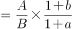，则2019年，国内航线运输飞行时长占全行业运输航空公司运输飞行时长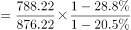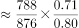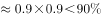，错误；

B项：定位文字材料第一段可得，2020年，国内航线完成旅客运输量40821.30万人次，比上年下降30.3%（），其中港澳台航线完成旅客运输量96.13万人次，比上年下降91.3%（），国际航线完成旅客运输量956.51万人次，比上年下降87.1%（）。定位统计表可得，2019年、2020年国内航线条数分别为4568条、4686条；港澳台航线条数分别为111条、94条；国际航线条数分别为953条、895条。根据公式：增长率，则2020年国内航线条数的同比增长率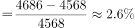（）；2020年港澳台航线条数的同比增长率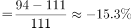（）；2020年国际航线条数的同比增长率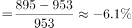（）。根据平均每条航线完成旅客运输量，结合两期平均数比较理论，当a＜b时，平均数下降，观察数据发现，（-30.3%）＜（2.6%）；（-91.3%）＜（-15.3%）； （-87.1%）＜（-6.1%）。则相比2019年，2020年我国国内航线、港澳台航线、国际航线平均每条航线完成旅客运输量均有下降，正确；

C项：定位统计表可得，2016年、2020年按重复距离计算的总航线里程公里数分别为919.3万公里、1357.7万公里。根据公式：年均增长量，则2016-2020年，按重复距离计算的总航线里程公里数年均增长量万公里万公里，错误；

D项：定位文字材料第三段可得，2020年，全行业运输航空公司完成运输起飞371.09万架次，比上年下降25.3%。根据公式：基期量，则2019年，全行业运输航空公司完成运输起飞万架次，超过400万架次，错误。

故正确答案为B。

---
