# 2022年广西区考公务员录用考试《行测》题（网友回忆版）

> 资料分析 · 15 题 · 广西 2022

## 材料 1

### 第 1 题　qid 5101668 · 增长

2011～2020年，全国城市建成区绿化覆盖率同比上升的年份有几个？

- **A**. 7
- **B**. 8
- **C**. 9　✅
- **D**. 10

**答案**：C

**官方解析**

定位统计图可知，2011~2020年全国城市建成区绿化覆盖率同比上升的有2011年（39.22%）、2012年（39.59%）、2013年（39.70%）、2014年（40.22%）、2016年（40.30%）、2017年（40.91%）、2018年（41.11%）、2019年（41.51%）、2020年（42.06%），共9年。
故正确答案为C。

---

### 第 2 题　qid 5101669 · 综合

以下年份中全国城市建成区绿化覆盖率与建成区绿地率数值相差最大的是：

- **A**. 2017年
- **B**. 2018年
- **C**. 2019年　✅
- **D**. 2020年

**答案**：C

**官方解析**

定位统计图可得，各年份全国城市建成区绿化覆盖率与建成区绿地率的差值分别为：
2017年=40.91%-37.11%=3.80%；
2018年=41.11%-37.34%=3.77%；
2019年=41.51%-37.63%=3.88%；
2020年=42.06%-38.24%=3.82%。
综上，数值相差最大的为2019年。
故正确答案为C。

---

### 第 3 题　qid 5101671 · 增长

表中全国城市建成区绿地率首次超过35%的年份，当年人均公园绿地面积同比约上升了：

- **A**. 4%
- **B**. 6%　✅
- **C**. 8%
- **D**. 10%

**答案**：B

**官方解析**

根据题干“表中全国城市建成区绿地率首次超过35%的年份，当年······同比约上升了”，结合选项均为百分数，可判定本题为一般增长率问题。定位统计图可得：表中全国城市建成区绿地率首次超过35%的年份为2011年。2011年全国人均公园绿地面积为11.80平方米，2010年为11.18平方米。根据公式：增长率，故所求为。

故正确答案为B。

---

### 第 4 题　qid 5101672 · 增长

以下折线图反映了哪一时间段内全国城市人均公园绿地面积同比增量的变化趋势？

- **A**. 2011～2014年
- **B**. 2013～2016年
- **C**. 2015～2018年
- **D**. 2017～2020年　✅

**答案**：D

**官方解析**

根据题干“······同比增量的变化趋势”，可判定本题为增长量计算问题。定位统计图可得：2010-2020年全国城市人均公园绿地面积依次为11.18平方米、11.80平方米、12.26平方米、12.64平方米、13.08平方米、13.35平方米、13.70平方米、14.01平方米、14.11平方米、14.36平方米、14.78平方米。根据公式：增长量=现期量-基期量。则2011-2020年全国城市人均公园绿地面积同比增量分别为：
2011年=11.80-11.18=0.62平方米；
2012年=12.26-11.80=0.46平方米；
2013年=12.64-12.26=0.38平方米；
2014年=13.08-12.64=0.44平方米；
2015年=13.35-13.08=0.27平方米；
2016年=13.70-13.35=0.35平方米；
2017年=14.01-13.70=0.31平方米；
2018年=14.11-14.01=0.10平方米；
2019年=14.36-14.11=0.25平方米；
2020年=14.78-14.36=0.42平方米。
比较可知，满足题干折线图先下降再上升变化趋势的为2017～2020年，对应D项。
故正确答案为D。

---

### 第 5 题　qid 5101673 · 综合

关于全国城市绿化状况，能够从上述资料中推出的是:

- **A**. 2014年，城市建成区绿化覆盖区域面积是未覆盖区域面积的1.5倍以上
- **B**. 以2009年为基期计算，2009～2020年城市建成区绿地率年均上升0.4个百分点以上
- **C**. 如城市总人口保持不变，则2020年城市公园绿地面积比2009年增长了50%以上
- **D**. 如按全国城市平均数计算，2020年一个800万人口的城市拥有公园绿地超过100平方千米　✅

**答案**：D

**官方解析**

A项：定位统计图可知：2014年全国城市建成区绿化覆盖率为40.22%。则2014年全国城市建成区绿化未覆盖率为1-40.22%=59.78%，所求为，错误；

B项：定位统计图可知：2009年和2020年全国城市建成区绿地率分别为34.17%和38.24%。根据公式：年均增长量，所求为，即年均上升了不到0.4个百分点，错误；

C项：定位统计图可知：2009年和2020年全国城市人均公园绿地面积分别为10.66平方米和14.78平方米。根据公式：城市公园绿地面积=城市人口×城市人均公园绿地面积，由于城市总人口保持不变，则所求增长率为，错误；

D项：定位统计图可知：2020年全国城市人均公园绿地面积为14.78平方米。根据公式：城市公园绿地面积=城市人口×城市人均公园绿地面积，则所求为800×14.78=11824万平方米=118.24平方千米&gt;100平方千米，正确。

故正确答案为D。

---

## 材料 2

### 第 6 题　qid 5101650 · 综合

若垃圾无害化处理率=无害化处理量÷总清运量×100%，那么2020年全国城市生活垃圾无害化处理率约比2011年高：

- **A**. 10%
- **B**. 15%
- **C**. 20%　✅
- **D**. 25%

**答案**：C

**官方解析**

根据题干“······2020年全国城市生活垃圾无害化处理率约比2011年高”，结合垃圾无害化处理率（即无害化处理量占总清运量的比重），可判定本题为两期比重问题。定位统计表可知：2020年、2011年全国城市生活垃圾无害化处理量分别为23452万吨、13090万吨；2020年、2011年总清运量分别为23512万吨、16395万吨。根据公式：比重，则2020年全国城市生活垃圾无害化处理率比2011年高。

故正确答案为C。

---

### 第 7 题　qid 5101653 · 综合

2016~2020年间，全国城市生活垃圾总清运量约比2011~2015年间高多少亿吨？

- **A**. 2
- **B**. 2.5　✅
- **C**. 3
- **D**. 3.5

**答案**：B

**官方解析**

定位统计表可得2011~2020年间各年全国城市生活垃圾总清运量。则2016~2020年间全国城市生活垃圾总清运量比2011~2015年间高：（20362+21521+22802+24206+23512）-（16395+17081+17239+17860+19142）（20400+21500+22800+24200+23500）-（16400+17100+17200+17900+19100）=24700万吨=2.47亿吨，与B项最接近。

故正确答案为B。

---

### 第 8 题　qid 5101655 · 增长

2012~2020年间，全国城市生活垃圾无害化处理量同比增长超过1200万吨的年份有几个？

- **A**. 4
- **B**. 5
- **C**. 6　✅
- **D**. 7

**答案**：C

**官方解析**

根据题干“······同比增长超过1200万吨······”，可判定本题为增长量计算问题。定位表格最后一列，结合公式：增长量=现期量-基期量，可得2012~2020年全国城市生活垃圾无害化处理量的同比增长量分别为：

2012年：14490-13090=1400万吨&gt;1200万吨；

2013年：万吨&lt;1200万吨；

2014年：16394-15394=1000万吨&lt;1200万吨；

2015年：万吨&gt;1200万吨；

2016年：万吨&gt;1200万吨；

2017年：万吨&gt;1200万吨；

2018年：万吨&gt;1200万吨；

2019年：万吨&gt;1200万吨；

2020年：23452-24013&lt;1200万吨。

综上可得，2012~2020年间，全国城市生活垃圾无害化处理量同比增长超过1200万吨的年份有6个。

故正确答案为C。

---

### 第 9 题　qid 5101656 · 平均数

2020年，全国平均每座无害化处理场的无害化处理能力约为多少？

- **A**. 27万吨/年　✅
- **B**. 41万吨/年
- **C**. 58万吨/年
- **D**. 79万吨/年

**答案**：A

**官方解析**

根据题干“2020年······平均每座······”，可判定本题为现期平均数问题。定位统计表可得：2020年，全国无害化处理场为1287座，无害化处理能力为96.35万吨/日。故2020年，全国平均每座无害化处理场的无害化处理能力万吨/年，与A项最接近。

故正确答案为A。

---

### 第 10 题　qid 5101658 · 综合

关于全国城市生活垃圾清运和无害化处理状况，能够从上述资料中推出的是：

- **A**. 2016年，总清运量同比增速快于上年水平
- **B**. 2020年，无害化处理场数量比2011年翻了一番
- **C**. 2018~2020年，每年的无害化处理能力同比增速都超过10%　✅
- **D**. 2017年总清运量与无害化处理量均超过2016年1500万吨以上

**答案**：C

**官方解析**

A项：定位统计表可知2014~2016年全国城市生活垃圾总清运量的数据，根据公式：增长率，可得2016年总清运量同比增速为，2015年总清运量同比增速为，故2016年，总清运量同比增速低于上年水平，错误；

B项：定位统计表可得：2011年、2020年全国城市生活垃圾无害化处理场数量分别为677座、1287座。由于，故2020年，无害化处理场数量并未比2011年翻一番，错误；

C项：定位统计表可知2017~2020年全国城市生活垃圾无害化处理能力的数据，根据公式：增长率，可得2018年无害化处理能力同比增速为，2019年无害化处理能力同比增速为，2020年无害化处理能力同比增速为，故2018~2020年，每年的无害化处理能力同比增速都超过10%，正确；

D项：定位统计表可知2016年、2017年全国城市生活垃圾总清运量与无害化处理量的数据，根据公式：增长量=现期量-基期量，可得2017年总清运量超过2016年：万吨&lt;1500万吨，2017年无害化处理量超过2016年：万吨&lt;1500万吨，故2017年总清运量与无害化处理量均未超过2016年1500万吨以上，错误。

故正确答案为C。

---

## 材料 3

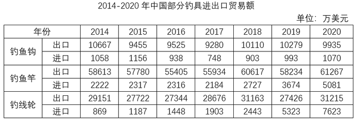

### 第 11 题　qid 5102400 · 增长

2020年中国钓鱼钩、竿、轮进出口贸易总额同比：

- **A**. 增长了不到5%
- **B**. 增长了5%以上　✅
- **C**. 减少了不到5%
- **D**. 减少了5%以上

**答案**：B

**官方解析**

根据题干“2020年······同比”，结合选项为“增长/减少+%”，可判定本题为一般增长率问题。定位统计表可得2019年、2020年中国钓鱼钩、竿、轮的进口贸易额和出口贸易额。则2019年中国钓鱼钩、竿、轮进出口贸易总额为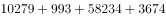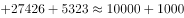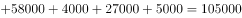万美元，2020年为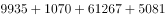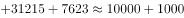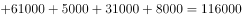万美元。根据公式：增长率，则2020年中国钓鱼钩、竿、轮进出口贸易总额同比增长率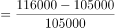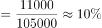，属于B项范围。

故正确答案为B。

---

### 第 12 题　qid 5102401 · 综合

2014-2020年，中国钓鱼竿进口总额约为：

- **A**. 1.5亿美元
- **B**. 1.7亿美元
- **C**. 1.9亿美元
- **D**. 2.1亿美元　✅

**答案**：D

**官方解析**

定位统计表可得2014-2020年每一年我国钓鱼竿的进口额。则2014-2020年，中国钓鱼竿进口总额为2222+2317+2316+2184+2727+3674+50812200+2300+2300+2200+2700+3700+5100=20500万美元亿美元。

故正确答案为D。

---

### 第 13 题　qid 5102402 · 增长

2015-2020年，中国钓鱼钩进、出口额均同比增长的年份有几个？

- **A**. 2　✅
- **B**. 3
- **C**. 4
- **D**. 5

**答案**：A

**官方解析**

定位统计表可得：2014-2020年，中国钓鱼钩进口额依次为1058万美元、1156万美元、938万美元、748万美元、903万美元、993万美元、1070万美元；出口额依次为10667万美元、9455万美元、9525万美元、9280万美元、10110万美元、10279万美元、9935万美元。比较可知，2015-2020年中国钓鱼钩进口额同比增长的年份有2015年、2018年、2019年、2020年；出口额同比增长的年份有2016年、2018年、2019年。则2015-2020年，中国钓鱼钩进、出口额均同比增长的年份有2018年、2019年，共2个。
故正确答案为A。

---

### 第 14 题　qid 5102404 · 增长

以下折线图反映了2018-2020年中国哪项钓具贸易额同比增量的变化趋势？

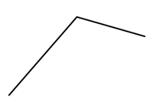

- **A**. 钓鱼竿进口额
- **B**. 钓鱼竿出口额
- **C**. 钓线轮进口额　✅
- **D**. 钓线轮出口额

**答案**：C

**官方解析**

根据题干“以下折线图反映了······同比增量的变化趋势”，可判定本题为增长量比较问题。定位统计表可知钓鱼竿和钓线轮2017年-2020年每年的进出口贸易额。根据公式：增长量=现期量-基期量，可得各选项2018-2020年每年的同比增量：
A项：2018年，2727-2184=543万美元；2019年，3674-2727=947万美元；2020年，5081-3674=1407万美元。即2018-2020年钓鱼竿进口额同比增量的变化趋势为逐渐递增，不符合折线图趋势，排除。
B项：2018年，60617-55934=4683万美元；2019年，58234-60617=-2383万美元；2020年，61267-58234=3033万美元。即2018-2020年钓鱼竿出口额同比增量的变化趋势为先降低再增加，不符合折线图趋势，排除。
C项：2018年，2443-1903=540万美元；2019年，5323-2443=2880万美元；2020年，7623-5323=2300万美元。即2018-2020年钓线轮进口额同比增量的变化趋势为先增加再降低，符合折线图趋势，当选。
D项：2018年，31163-28676=2487万美元；2019年，27426-31163=-3737万美元；2020年，31215-27426=3789万美元。即2018-2020年钓线轮出口额同比增量的变化趋势为先降低再增加，不符合折线图趋势，排除。
故正确答案为C。

---

### 第 15 题　qid 5102405 · 综合

关于中国部分钓具进出口贸易状况，能从上述资料中推出的是：

- **A**. 2017-2020年，进口额年均同比增速钓鱼竿快于钓线轮
- **B**. 2014-2020年，每年钓鱼钩进出口总额都超过1亿美元　✅
- **C**. 2017-2020年，每年出口额钓线轮都超过钓鱼竿的一半
- **D**. 2014-2020年，钓鱼钩和钓鱼竿进口额最低的年份不同

**答案**：B

**官方解析**

A项：定位统计表，可知2017年钓鱼竿、钓线轮的进口额分别为2184万美元、1903万美元；2020年中国钓鱼竿、钓线轮的进口额分别为5081万美元、7623万美元。根据年均增长率公式：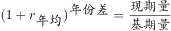，当年份差相同时，越大，年均同比增速越大。则钓鱼竿：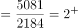；钓线轮：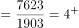，故2017-2020年进口额年均同比增速钓鱼竿慢于钓线轮，错误；

B项：定位统计表，可知2014-2020年每年钓鱼钩进口额与出口额数据。故2014-2020年钓鱼钩进出口总额分别为：2014年，10667万美元+1058万美元＞1.1亿美元；2015年，9455万美元+1156万美元＞1.0亿美元；2016年：9525万美元+938万美元＞1.0亿美元；2017年：9280万美元+748万美元＞1.0亿美元；2018年：10110万美元+903万美元＞1.1亿美元；2019年：10279万美元+993万美元＞1.1亿美元；2020年：9935万美元+1070万美元＞1.1亿美元，正确；

C项：定位统计表，可知2017-2020年每年钓线轮、钓鱼竿的出口额。2019年钓线轮出口额（27426万美元）＜钓鱼竿出口额的一半（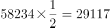万美元），错误；

D项：定位统计表，可知2014-2020年钓鱼钩进口额最低的年份为2017年（748万美元），钓鱼竿进口额最低的年份也为2017年（2184万美元），错误。

故正确答案为B。

---
