# 2022年江苏省公务员录用考试《行测》题（B类）（网友回忆版）

> 资料分析 · 20 题 · 江苏 2022

## 材料 1

        2021年1—7月，某市累计客运量97638万人，同比增长40.8%。其中，公共汽电车客运量37465万人、增长33.4%；轨道交通客运量55863万人，增长46.7%；出租车客运量4175万人、增长36.5%；轮渡客运量135万人、增长42.1%。2021年1—6月，出租车客运量分别为576万人、472万人、659万人、666万人、651万人和630万人。

### 第 1 题　qid 4651656 · 平均数

2021年一季度，该市公共汽电车月平均客运量是：

- **A**. 5223万人　✅
- **B**. 5568万人
- **C**. 5612万人
- **D**. 5911万人

**答案**：A

**官方解析**

根据题干“2021年一季度······月平均······”，结合材料时间为2021年，可判定本题为现期平均数问题。定位统计图可得，2021年1—3月该市公共汽电车客运量分别为5782万人、4564万人、5324万人。则2021年一季度该市公共汽电车月平均客运量万人。

故正确答案为A。

---

### 第 2 题　qid 4651658 · 增长

2021年1—7月，该市客运量增速最大的客运方式是：

- **A**. 公共汽电车
- **B**. 轨道交通　✅
- **C**. 出租车
- **D**. 轮渡

**答案**：B

**官方解析**

定位文字材料可知：2021年1—7月公共汽电车客运量增长33.4%，轨道交通客运量增长46.7%，出租车客运量增长36.5%，轮渡客运量增长42.1%。其中轨道交通客运量增速最大。
故正确答案为B。

---

### 第 3 题　qid 4651659 · 比重

2021年上半年，该市轨道交通客运量占全市客运量比重最大的月份是：

- **A**. 3月　✅
- **B**. 4月
- **C**. 5月
- **D**. 6月

**答案**：A

**官方解析**

根据题干“2021年上半年······占······比重最大的月份是”，可判定本题为现期比重问题。定位文字材料可得：2021年1—6月，出租车客运量分别为576万人、472万人、659万人、666万人、651万人和630万人。定位统计图可知，2021年1-6月某市轨道交通与公共汽电车客运量。全市客运量=公共汽电车客运量+轨道交通客运量+出租车客运量+轮渡客运量。根据公式：比重，即，由于轮渡客运量和其他客运量相比起来非常小，可忽略。要想比较的大小，可以直接比较的大小。代入数据可知，3月：；4月：；5月：；6月：。比较可知，2021年上半年，该市轨道交通客运量占全市客运量比重最大的月份是3月。

故正确答案为A。

---

### 第 4 题　qid 4651660 · 综合

2021年二季度，该市出租车客运量比一季度多：

- **A**. 12.4%
- **B**. 14.1%　✅
- **C**. 16.8%
- **D**. 17.2%

**答案**：B

**官方解析**

根据题干“2021年二季度······比一季度多”，结合选项带百分号，可判定本题为一般增长率计算问题。定位文字材料可得：2021年1—6月，出租车客运量分别为576万人、472万人、659万人、666万人、651万人和630万人。根据公式：增长率，则2021年二季度，该市出租车客运量较一季度的增长率为，与B项最接近。

故正确答案为B。

---

### 第 5 题　qid 4651661 · 综合

能够从上述资料中推出的是：

- **A**. 2021年6月，该市公共汽电车客运量环比下降超过5.0%
- **B**. 2021年7月，该市轨道交通客运量同比增速高于46.7%
- **C**. 2020年1—7月，该市公共汽电车客运量不足25000万人
- **D**. 2021年6月，该市轨道交通客运量比公共汽电车多2000万人以上　✅

**答案**：D

**官方解析**

A项：定位统计图可得：2021年6月，该市公共汽电车客运量为5491万人，5月为5665万人。根据公式：增长率，则2021年6月，该市公共汽电车客运量环比增速为，即环比下降不到5.0%，错误；

B项：定位文字材料第一段可得：2021年1—7月，某市······轨道交通客运量55863万人，增长46.7%；定位统计图可得：2021年1—6月轨道交通客运量分别为7729万人、5534万人、9023万人、9194万人、8819万人、8357万人，同比增速分别为9.9%、70.7%、96.0%、85.0%、71.7%、60.3%。根据混合增长率口诀“混合居中不正中，距离与量成反比（常用现期量代替基期量计算）” ，2~6月中6月的同比增速最低（60.3%），则2~6月的同比增速必然大于60.3%；再考虑1月与2~6月增速混合计算1-6月混合增长率，可列式：，算出；最后根据1—6月同比增速（）高于1—7月同比增速（46.7%），可判定7月同比增速应小于1—7月同比增速（46.7%），错误；

C项：定位文字材料第一段可得：2021年1—7月，某市······公共汽电车客运量37465万人、增长33.4%。根据公式：基期量，2020年1—7月，该市公共汽电车客运量为万人，超过25000万人，错误；

D项：定位统计图可得：2021年6月，该市轨道交通客运量为8357万人，公共汽电车客运量为5491万人。8357-5491=2866万人，多2000万人以上，正确。

故正确答案为D。

---

## 材料 2

        2020年江苏省实现以新产业、新业态、新模式为主要内容的“三新”经济增加值25177亿元，比上年增长5.6%，比全省地区生产总值的增速快1.5个百分点，占全省地区生产总值的比重为24.5%。全省战略性新兴产业产值增长11.0%，快于规模以上工业5.5个百分点。其中新能源汽车、数字创意、新能源和高端装备制造业的产值增速分别为21.0%、19.8%、15.6%和15.5%。高技术制造业增加值增长10.3%，占规模以上工业的比重为23.5%，提高1.7个百分点。高技术服务业营业收入增长14.1%，占规模以上服务业的比重为37.9%，提高2.4个百分点。全省碳纤维增强复合材料、新能源汽车、城市轨道车辆、集成电路、太阳能电池等新产品的产量分别增长48.9%、42.0%、24.5%、22.3%和16.5%。全省现代设施农业占地面积100.5万公顷，其中属于战略性新兴产业的中药材种植业种植面积1.8万公顷，实现产值32亿元，产值增长138.1%。全省网上零售额10602亿元，增长10.0%。其中，实物商品网上零售额增长13.9%，增速比上年快5.2个百分点，占社会消费品零售总额37086亿元的比重为24.9%，提高2.7个百分点。

### 第 6 题　qid 4651464 · 增长

2020年江苏数字创意产业产值增速比规模以上工业产值增速快：

- **A**. 5.5个百分点
- **B**. 10.1个百分点
- **C**. 14.3个百分点　✅
- **D**. 15.5个百分点

**答案**：C

**官方解析**

定位文字材料“2020年······全省战略性新兴产业产值增长11.0%，快于规模以上工业5.5个百分点。其中······数字创意······产值增速为19.8%”。则2020年规模以上工业产值增速为11.0%-5.5%=5.5%，所求差值为19.8%-5.5%=14.3%，即2020年江苏数字创意产业产值增速比规模以上工业产值增速快14.3个百分点。
故正确答案为C。

---

### 第 7 题　qid 4651465 · 平均数

2020年江苏中药材种植业平均每公顷产值为：

- **A**. 14.4万元
- **B**. 15.4万元
- **C**. 16.3万元
- **D**. 17.8万元　✅

**答案**：D

**官方解析**

根据题干“2020年江苏中药材种植业平均每公顷产值为”，结合材料时间为2020年，可判定本题为现期平均数计算问题。定位文字材料可知，2020年，属于战略性新兴产业的中药材种植业种植面积1.8万公顷，实现产值32亿元，根据平均每公顷产值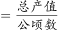，可得2020年江苏中药材种植业平均每公顷产值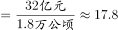万元。

故正确答案为D。

---

### 第 8 题　qid 4651467 · 比重

2019年江苏“三新”经济增加值占全省地区生产总值的比重是：

- **A**. 20.5%
- **B**. 24.2%　✅
- **C**. 27.1%
- **D**. 30.0%

**答案**：B

**官方解析**

根据题干“2019年······占······的比重是”，结合材料时间为2020年，可判定本题为基期比重计算问题。定位文字材料可得：2020年江苏省实现以新产业、新业态、新模式为主要内容的“三新”经济增加值25177亿元，比上年增长5.6%，比全省地区生产总值的增速快1.5个百分点，占全省地区生产总值的比重为24.5%。根据公式：基期比重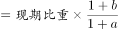，可得2019年江苏“三新”经济增加值占全省地区生产总值的比重为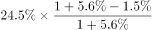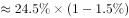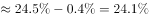，与B项最接近。

故正确答案为B。

---

### 第 9 题　qid 4651486 · 综合

下列可以作为计算2019年江苏非实物商品网上零售额的算式是：

- **A**. 
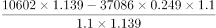
　✅
- **B**. 
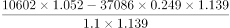

- **C**. 
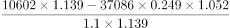

- **D**. 
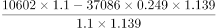

**答案**：A

**官方解析**

根据题干“······2019年江苏非实物商品网上零售额······”，结合材料时间为2020年，可判定本题为基期计算问题。定位文字材料可知，2020年全省网上零售额10602亿元，增长10.0%。其中，实物商品网上零售额增长13.9%，占社会消费品零售总额37086亿元的比重为24.9%。根据公式：，可得2019年全省网上零售额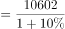；根据公式：部分=整体×比重，可得2020年实物商品网上零售额=37086×24.9%，则2019年实物商品网上零售额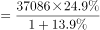。非实物商品网上零售额=全省网上零售额-实物商品网上零售额，因此2019年江苏非实物商品网上零售额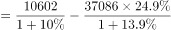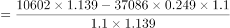，与A项对应。

故正确答案为A。

---

### 第 10 题　qid 4651488 · 综合

能够从上述资料中推出的是：

- **A**. 2020年江苏省地区生产总值超过10万亿元　✅
- **B**. 2020年江苏非实物商品网上零售额增速高于13.9%
- **C**. 2020年江苏高技术服务业营业收入增长速度慢于规模以上服务业
- **D**. 2020年江苏新能源汽车、集成电路和太阳能电池产量的平均增长速度是26.9%

**答案**：A

**官方解析**

A项：定位文字材料可知：2020年江苏省实现以新产业、新业态、新模式为主要内容的“三新”经济增加值25177亿元，占全省地区生产总值的比重为24.5%。根据公式：，可得2020年江苏省地区生产总值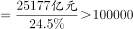亿元，即2020年江苏省地区生产总值超过10万亿元，正确；

B项：定位文字材料可知：2020年全省网上零售额增长10.0%。其中，实物商品网上零售额增长13.9%。根据混合增长率口诀“混合后居中”可得，2020年江苏非实物商品网上零售额增速小于全省网上零售额增速，即小于10.0%，错误；

C项：定位文字材料可知：2020年高技术服务业营业收入增长14.1%，占规模以上服务业的比重为37.9%，提高2.4个百分点。根据两期比重比较结论，部分增长率＞整体增长率时，比重上升。2020年高技术服务业营业收入占规模以上服务业的比重高于上年，则2020年高技术服务业营业收入增长速度快于规模以上服务业，错误；

D项：定位材料查找可知，材料只给出2020年江苏新能源汽车、集成电路和太阳能电池的增速，并未给出三者的产量，故无法计算平均增长速度，错误。

故正确答案为A。

---

## 材料 3

        2021年上半年，我国进口集成电路3123亿块，同比增长28.4%；进口额1979亿美元，增长28.3%。出口集成电路1514亿块，增长34.5%；出口额664亿美元、增长32.0%。

### 第 11 题　qid 4651692 · 增长

2021年上半年，我国集成电路进口量的环比增速是：

- **A**. 1.8%
- **B**. 2.1%
- **C**. 3.5%　✅
- **D**. 4.6%

**答案**：C

**官方解析**

根据题干“2021年上半年······环比增速是”，结合选项是百分数，可判定本题为一般增长率问题。定位文字材料第一段可得：2021年上半年，我国进口集成电路3123亿块；定位统计图可得：2020年7—12月我国进口集成电路量分别为469亿块、443亿块、537亿块、485亿块、528亿块、555亿块。则2020年下半年，我国进口集成电路亿块；根据公式：增长率，代入数据，可得2021年上半年，我国集成电路进口量的环比增速，与C项最接近。

故正确答案为C。

---

### 第 12 题　qid 4651693 · 综合

“十三五”时期，我国集成电路出口额的年均增量是：

- **A**. 79亿美元
- **B**. 95亿美元　✅
- **C**. 111亿美元
- **D**. 139亿美元

**答案**：B

**官方解析**

根据题干“‘十三五’时期······的年均增量是”，可判定本题为年均增长量问题。定位统计表可得：2015年我国集成电路出口额为691亿美元，2020年我国集成电路出口额为1166亿美元。根据公式：年均增长量，“十三五”时期是2016年-2020年，其中现期是2020年，基期是2015年，故题干所求亿美元。

故正确答案为B。

---

### 第 13 题　qid 4651694 · 平均数

“十三五”时期，我国集成电路进口量、进口额、出口量、出口额中，年平均增长速度最快和最慢的分别是：

- **A**. 进口量、出口量　✅
- **B**. 进口量、进口额
- **C**. 进口额、出口量
- **D**. 进口额、进口量

**答案**：A

**官方解析**

根据题干“‘十三五”时期’······年平均增长速度最快和最慢的分别是”，可判定本题为年均增长率问题。定位统计表可得：2015年我国集成电路进口量、出口量、进口额、出口额分别为3140亿块、1827亿块、2299亿美元、691亿美元；2020年我国集成电路进口量、出口量、进口额、出口额分别为5449亿块、2698亿块、3500亿美元、1166亿美元。根据年均增长率公式：，当年份差n相同时，直接比较即可。进口量：；出口量：；进口额：；出口额：。比较可知，年平均增长速度最快和最慢的分别是进口量、出口量。

故正确答案为A。

---

### 第 14 题　qid 4651695 · 综合

2020年3-12月，我国集成电路进、出口量相差最大的月份是：

- **A**. 7月
- **B**. 9月
- **C**. 11月　✅
- **D**. 12月

**答案**：C

**官方解析**

定位统计图，可知2020年7月、9月、11月、12月，我国集成电路出口量分别为238亿块、272亿块、255亿块、289亿块；进口量分别为469亿块、537亿块、528亿块、555亿块。
7月集成电路进出口量差值为：469-238=231亿块；
9月集成电路进出口量差值为：537-272=265亿块；
11月集成电路进出口量差值为：528-255=273亿块；
12月集成电路进出口量差值为：555-289=266亿块；
故2020年3-12月，我国集成电路进、出口量相差最大的月份是11月。
故正确答案为C。

---

### 第 15 题　qid 4651696 · 综合

能够从上述资料中推出的是：

- **A**. “十三五”时期，我国集成电路出口额增量逐年增大
- **B**. 2020年各月，我国集成电路进、出口量呈相同的变动走势
- **C**. 2021年上半年，我国集成电路出口平均价格同比有所提高
- **D**. 2020年下半年，我国集成电路进口量环比增速最快的月份是9月　✅

**答案**：D

**官方解析**

A项：定位表格材料，2015-2020年我国集成电路出口额分别为691亿美元、610亿美元、669亿美元、846亿美元、1016亿美元、1166亿美元。根据公式：增长量=现期量-基期量，2016年增长量=610-691=-81亿美元，2017年增长量=669-610=59亿美元，2018年增长量=846-669=177亿美元，2019年增长量=1016-846=170亿美元。2019年集成电路出口额增量低于2018年，并非逐年增大，错误；

B项：定位图形材料，2020年4月、5月集成电路进口量分别为444亿块、406亿块；2020年4月、5月集成电路出口量分别为198亿块、207亿块。进口量5月比4月下降，出口量5月比4月上升，变化趋势不同，错误；

C项：定位文字材料，2021年上半年，我国出口集成电路1514亿块，同比增长34.5%（b）；出口额664亿美元，同比增长32.0%（a）。出口平均价格，根据两期平均数比较理论，当a＞b时，平均数提高，反之则下降。32.0%（a）＜34.5%（b），平均数下降，即出口平均价格同比有所下降，错误；

D项：定位图形材料，2020年6-12月集成电路进口量分别为421亿块、469亿块、443亿块、537亿块、485亿块、528亿块、555亿块。根据公式：增长率，8月和10月环比下降，排除；7月环比增速，9月环比增速，11月环比增速，12月环比增速，可知9月环比增速最大，正确。

故正确答案为D。

---

## 材料 4

        2021年1-7月，我国原油产量11561万吨，同比增长2.4%，比2019年同期增长3.9%。其中，7月我国原油产量1686万吨，增长2.5%，比2019年同期增长3.1%。1-7月我国进口原油30193万吨，下降5.6%。其中，7月进口原油4124万吨，下降19.6%。

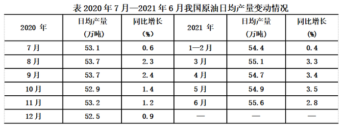

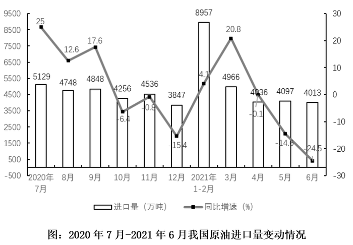

### 第 16 题　qid 4651470 · 综合

2020年6月，我国原油日均产量是：

- **A**. 52.8万吨
- **B**. 53.2万吨
- **C**. 54.1万吨　✅
- **D**. 55.5万吨

**答案**：C

**官方解析**

根据题干“2020年6月······日均产量是”，结合材料时间为2021年，可判定本题为基期计算问题。定位表格材料可得：2021年6月我国原油日均产量为55.6万吨，同比增长2.8%。根据公式：基期量，可得2020年6月，我国原油日均产量为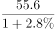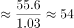万吨，最接近C项。

故正确答案为C。

---

### 第 17 题　qid 4651472 · 增长

2020年7月-2021年6月，我国原油季度产量同比增速超过2.5%的季度个数是：

- **A**. 0
- **B**. 1　✅
- **C**. 2
- **D**. 3

**答案**：B

**官方解析**

根据题干“······我国原油季度产量同比增速······”，且材料给出各月份我国原油日均产量的同比增速，可判定本题为混合增长率问题。定位表格材料可得：2020年7月-2021年6月，我国原油日均产量的同比增速分别为：0.6%（2020年7月）、2.3%（2020年8月）、2.4%（2020年9月）、1.4%（2020年10月）、1.2%（2020年11月）、0.9%（2020年12月）、0.4%（2021年1-2月）、3.3%（2021年3月）、3.4%（2021年4月）、3.5%（2021年5月）、2.8%（2021年6月）。

根据混合增长率口诀“混合后居中”可得：

0.6%＜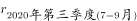＜2.4%，不超过2.5%，排除；

0.9%＜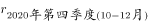＜1.4%，不超过2.5%，排除；

2.8%＜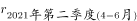＜3.5%，超过2.5%，满足。

根据“偏向基期量大的”可得：由于1-2月天数＞3月天数，则1-2月原油产量＞3月原油产量，混合增速会偏向1-2月的0.4%，即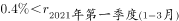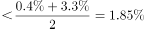，不超过2.5%，排除。

故2020年7月-2021年6月，仅有1个季度（2021年第二季度）我国原油季度产量同比增速超过2.5%。

故正确答案为B。

【备注的备注】2021年2月有28天，2020年2月有29天，因此2月月均增速≠日均增速，但很接近，不影响后续计算，误差可忽略。

---

### 第 18 题　qid 4651475 · 综合

2021年上半年，我国原油进口量比生产量多：

- **A**. 1.6倍　✅
- **B**. 1.8倍
- **C**. 2.6倍
- **D**. 2.9倍

**答案**：A

**官方解析**

根据题干“2021年上半年，······比······多”，结合选项为几倍，且与材料时间一致，可判定本题为现期倍数计算问题。定位文字材料可得：2021年1-7月，我国原油产量11561万吨······其中，7月我国原油产量1686万吨。1-7月我国进口原油30193万吨······其中，7月进口原油4124万吨。则2021年上半年原油进口量=30193-4124=26069万吨；原油生产量=11561-1686=9875万吨，故所求倍数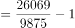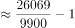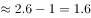倍。

故正确答案为A。

---

### 第 19 题　qid 4651477 · 增长

2020年1-7月，我国原油产量的同比增速是：

- **A**. 1.46%　✅
- **B**. 1.90%
- **C**. 2.36%
- **D**. 3.15%

**答案**：A

**官方解析**

根据题干“2020年1-7月······同比增速是”，结合材料给出2021年1-7月我国原油产量的同比增速以及相对于2019年同期的增速，可判定本题为间隔增长率问题。定位文字材料可得：2021年1-7月，我国原油产量同比增长2.4%（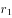），比2019年同期增长3.9%（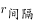）。根据公式：，代入数据可得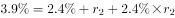，整理可得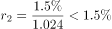，即2020年1-7月我国原油产量的同比增速不到1.5%，结合选项，只有A项符合。

故正确答案为A。

---

### 第 20 题　qid 4651479 · 综合

能够从上述资料中推出的是：

- **A**. 2021年1-7月，我国原油月产量最多的是7月
- **B**. 2021年二季度，我国原油进口量同比下降13.1%
- **C**. 2021年上半年，我国原油生产量环比有所增加　✅
- **D**. 2021年7月，我国原油生产量与进口量的差距较上半年的月平均差距有所扩大

**答案**：C

**官方解析**

A项：定位统计表可知，2021年1-2月我国原油日均产量为54.4万吨。但无法推出1月和2月每个月各自的日均产量是多少，也就无法推出1月和2月的月产量，故无法推出2021年1-7月，我国原油月产量最多的是7月。错误；

B项：定位柱状图可知，2021年4月我国原油进口量为4036万吨，同比增长-0.1%；5月进口量为4097万吨，同比增长-14.6%；6月进口量为4013万吨，同比增长-24.5%。则2021年二季度我国原油进口量为4036+4097+4013=12146万吨。根据基期量，则2020年4月我国原油进口量为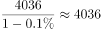万吨；5月进口量为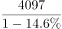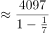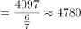万吨；6月进口量为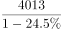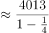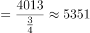万吨。则2020年二季度我国原油进口量为4036+4780+5351=14167万吨。根据增长率，则2021年二季度，我国原油进口量同比增速为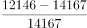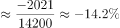，下降率不是13.1%。错误；

C项：定位文字材料可知，2021年1-7月，我国原油产量11561万吨；其中，7月我国原油产量1686万吨。则2021年上半年我国原油产量为：11561-1686=9875万吨；定位统计表可知，2020年7月至2020年12月我国原油的日均产量，则2020年下半年我国原油产量为：53.1×31+53.7×31+53.7×30+52.9×31+53.2×30+52.5×31=（53.1+53.7+53.7+52.9+53.2+52.5）×30+53.1+53.7+52.9+52.5=9573+212.2=9785.2万吨。因为9875&gt;9785.2，所以2021年上半年，我国原油生产量环比有所增加。正确；

D项：定位文字材料可知，2021年1-7月，我国原油产量11561万吨。其中，7月我国原油产量1686万吨。1-7月我国进口原油30193万吨。其中，7月进口原油4124万吨，则2021年7月，我国原油生产量与进口量的差距为4124-1686=2438万吨；2021年上半年，我国原油产量为11561-1686=9875万吨，进口原油30193-4124=26069万吨，则2021年上半年，我国原油生产量与进口量的月平均差距为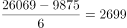万吨。因此2021年7月，我国原油生产量与进口量的差距（2438万吨）较上半年的月平均差距（2699万吨）有所缩小。错误。

故正确答案为C。

---
