# 2022年江苏省公务员录用考试《行测》题（C类）（网友回忆版）

> 资料分析 · 20 题 · 江苏 2022

## 材料 1

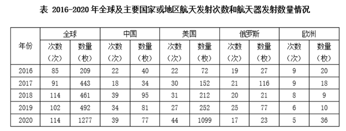

### 第 1 题　qid 4651485 · 比重

“十三五”时期，我国航天发射次数占全球的比重为：

- **A**. 15%
- **B**. 20%
- **C**. 25%
- **D**. 30%　✅

**答案**：D

**官方解析**

根据题干“‘十三五’时期······比重为”，结合材料时间为2016—2020年，可判定本题为现期比重问题。定位表格材料，可知“十三五”时期我国及全球的航天发射次数。根据公式：比重，可得“十三五”时期，我国航天发射次数占全球的比重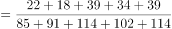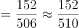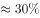。

故正确答案为D。

---

### 第 2 题　qid 4651487 · 增长

下列国家或地区中，2017—2020年发射数量年均增速为负的是：

- **A**. 中国
- **B**. 美国
- **C**. 俄罗斯　✅
- **D**. 欧洲

**答案**：C

**官方解析**

根据题干“······2017—2020年发射数量年均增速······”，可判定本题为年均增长率问题。定位表格材料，可知2016年、2020年中国、美国、俄罗斯、欧洲的航天器发射数量。根据年均增长率公式：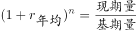，可得年均增速为负即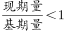，故现期量＜基期量。观察发现只有俄罗斯满足该要求。

因此2017—2020年发射数量年均增速为负的是俄罗斯。

故正确答案为C。

---

### 第 3 题　qid 4651489 · 综合

2016—2020年全球主要国家或地区单次发射航天器的最大数量：

- **A**. 大于24枚　✅
- **B**. 大于16枚且不大于24枚
- **C**. 小于11枚
- **D**. 不小于11枚且不大于16枚

**答案**：A

**官方解析**

根据题干“2016—2020年······单次发射航天器······”，可判定本题为现期平均数问题。定位表格材料，可知2016—2020年中国、美国、俄罗斯、欧洲航天发射次数和航天器发射数量。根据公式：单次发射航天器数量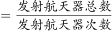，可知2020年美国单次发射航天器的数量最大。代入计算可得：2020年美国单次发射航天器数量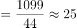枚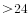枚。

故正确答案为A。

---

### 第 4 题　qid 4651518 · 比重

下列饼图中，能正确反映对应年份中国、美国、俄罗斯及其他国家和地区航天器发射数量占比关系的是：

- **A**. 
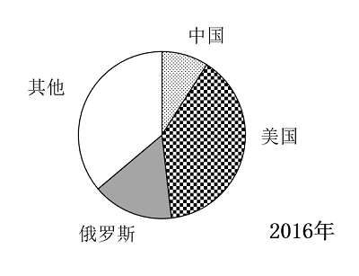

- **B**. 
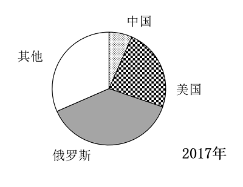

- **C**. 
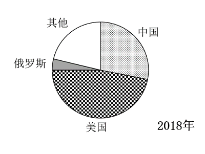

- **D**. 
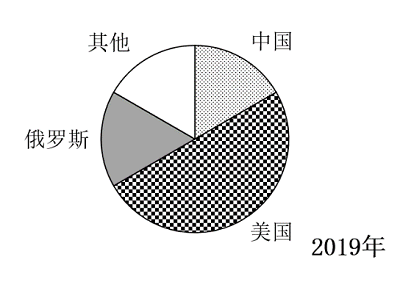
　✅

**答案**：D

**官方解析**

根据题干“······占比关系的是”，结合材料给出相应年份数据，可判定本题为现期比重问题。定位统计表材料，可知2016-2019年全球、中国、美国、俄罗斯航天器发射数量。结合选项，各年份情况如下：

2016年：中国航天器发射数量大于俄罗斯，A项不符合，排除；

2017年：美国航天器发射数量大于俄罗斯，B项不符合，排除；

2018年：中国航天器发射数量占比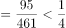，C项不符合，排除。

故正确答案为D。

---

### 第 5 题　qid 4651522 · 综合

不能从上述资料中推出的是：

- **A**. 2017—2020年全球航天器发射数量增速最慢的年份是2018年
- **B**. 2017—2020年俄罗斯与美国发射航天器的数量差距逐年增大　✅
- **C**. 2016—2020年中国单次发射航天器的平均数量大于2枚
- **D**. 2019年全球主要国家或地区中发射航天器数量增速最快的是俄罗斯

**答案**：B

**官方解析**

A项：定位统计表，可知2016—2020年全球航天器发射数量。根据公式：增长率，可得2017—2020年全球航天器发射数量的增速分别为：2017年，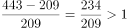；2018年，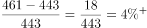；2019年，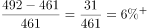；2020年，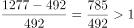。则增速最慢的是2018年，正确；

B项：定位统计表，可知2016—2020年俄罗斯与美国航天器发射数量。2016年两国航天器发射数量的差距为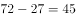枚，2017年为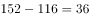枚，则2017年的差距小于2016年，故差距并非逐年增大，错误；

C项：定位统计表，可知2016—2020年中国航天发射次数和航天器发射数量。2016—2020年，中国航天发射总次数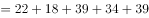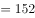次，航天器发射总数量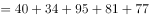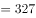枚，则2016—2020年中国单次发射航天器的平均数量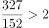枚，正确；

D项：定位统计表，可知2018年、2019年全球主要国家或地区发射航天器的数量。根据公式：增长率，可得2019年中国、美国、俄罗斯、欧洲发射航天器数量的增长率分别为：中国，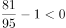；美国，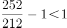；俄罗斯，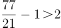；欧洲，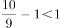。则2019年发射航天器数量增速最快的是俄罗斯，正确。

本题为选非题，故正确答案为B。

---

## 材料 2

        2021年1—7月，某市累计客运量97638万人，同比增长40.8%。其中，公共汽电车客运量37465万人、增长33.4%；轨道交通客运量55863万人，增长46.7%；出租车客运量4175万人、增长36.5%；轮渡客运量135万人、增长42.1%。2021年1—6月，出租车客运量分别为576万人、472万人、659万人、666万人、651万人和630万人。

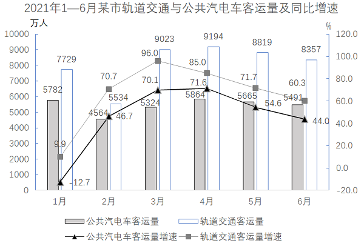

### 第 6 题　qid 4651656 · 平均数

2021年一季度，该市公共汽电车月平均客运量是：

- **A**. 5223万人　✅
- **B**. 5568万人
- **C**. 5612万人
- **D**. 5911万人

**答案**：A

**官方解析**

根据题干“2021年一季度······月平均······”，结合材料时间为2021年，可判定本题为现期平均数问题。定位统计图可得，2021年1—3月该市公共汽电车客运量分别为5782万人、4564万人、5324万人。则2021年一季度该市公共汽电车月平均客运量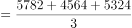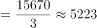万人。

故正确答案为A。

---

### 第 7 题　qid 4651658 · 增长

2021年1—7月，该市客运量增速最大的客运方式是：

- **A**. 公共汽电车
- **B**. 轨道交通　✅
- **C**. 出租车
- **D**. 轮渡

**答案**：B

**官方解析**

定位文字材料可知：2021年1—7月公共汽电车客运量增长33.4%，轨道交通客运量增长46.7%，出租车客运量增长36.5%，轮渡客运量增长42.1%。其中轨道交通客运量增速最大。
故正确答案为B。

---

### 第 8 题　qid 4651659 · 比重

2021年上半年，该市轨道交通客运量占全市客运量比重最大的月份是：

- **A**. 3月　✅
- **B**. 4月
- **C**. 5月
- **D**. 6月

**答案**：A

**官方解析**

根据题干“2021年上半年······占······比重最大的月份是”，可判定本题为现期比重问题。定位文字材料可得：2021年1—6月，出租车客运量分别为576万人、472万人、659万人、666万人、651万人和630万人。定位统计图可知，2021年1-6月某市轨道交通与公共汽电车客运量。全市客运量=公共汽电车客运量+轨道交通客运量+出租车客运量+轮渡客运量。根据公式：比重，即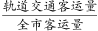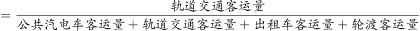，由于轮渡客运量和其他客运量相比起来非常小，可忽略。要想比较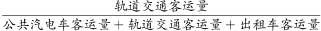的大小，可以直接比较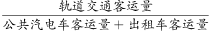的大小。代入数据可知，3月：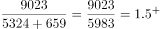；4月：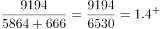；5月：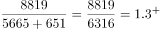；6月：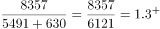。比较可知，2021年上半年，该市轨道交通客运量占全市客运量比重最大的月份是3月。

故正确答案为A。

---

### 第 9 题　qid 4651660 · 综合

2021年二季度，该市出租车客运量比一季度多：

- **A**. 12.4%
- **B**. 14.1%　✅
- **C**. 16.8%
- **D**. 17.2%

**答案**：B

**官方解析**

根据题干“2021年二季度······比一季度多”，结合选项带百分号，可判定本题为一般增长率计算问题。定位文字材料可得：2021年1—6月，出租车客运量分别为576万人、472万人、659万人、666万人、651万人和630万人。根据公式：增长率，则2021年二季度，该市出租车客运量较一季度的增长率为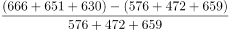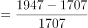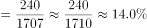，与B项最接近。

故正确答案为B。

---

### 第 10 题　qid 4651661 · 综合

能够从上述资料中推出的是：

- **A**. 2021年6月，该市公共汽电车客运量环比下降超过5.0%
- **B**. 2021年7月，该市轨道交通客运量同比增速高于46.7%
- **C**. 2020年1—7月，该市公共汽电车客运量不足25000万人
- **D**. 2021年6月，该市轨道交通客运量比公共汽电车多2000万人以上　✅

**答案**：D

**官方解析**

A项：定位统计图可得：2021年6月，该市公共汽电车客运量为5491万人，5月为5665万人。根据公式：增长率，则2021年6月，该市公共汽电车客运量环比增速为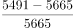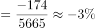，即环比下降不到5.0%，错误；

B项：定位文字材料第一段可得：2021年1—7月，某市······轨道交通客运量55863万人，增长46.7%；定位统计图可得：2021年1—6月轨道交通客运量分别为7729万人、5534万人、9023万人、9194万人、8819万人、8357万人，同比增速分别为9.9%、70.7%、96.0%、85.0%、71.7%、60.3%。根据混合增长率口诀“混合居中不正中，距离与量成反比（常用现期量代替基期量计算）” ，2~6月中6月的同比增速最低（60.3%），则2~6月的同比增速必然大于60.3%；再考虑1月与2~6月增速混合计算1-6月混合增长率，可列式：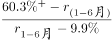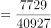，算出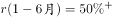；最后根据1—6月同比增速（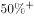）高于1—7月同比增速（46.7%），可判定7月同比增速应小于1—7月同比增速（46.7%），错误；

C项：定位文字材料第一段可得：2021年1—7月，某市······公共汽电车客运量37465万人、增长33.4%。根据公式：基期量，2020年1—7月，该市公共汽电车客运量为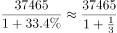万人，超过25000万人，错误；

D项：定位统计图可得：2021年6月，该市轨道交通客运量为8357万人，公共汽电车客运量为5491万人。8357-5491=2866万人，多2000万人以上，正确。

故正确答案为D。

---

## 材料 3

### 第 11 题　qid 4651483 · 综合

“十三五”时期，我国住房公积金实缴余额年均增量为：

- **A**. 0.39万亿元
- **B**. 0.43万亿元
- **C**. 0.54万亿元
- **D**. 0.65万亿元　✅

**答案**：D

**官方解析**

根据题干“‘十三五时期’······年均增量为”可判定本题为年均增长量问题。定位统计表可得：2020年我国住房公积金实缴余额为7.30万亿元；2015年我国住房公积金实缴余额为4.07万亿元。根据公式：年均增长量，则“十三五”时期，我国住房公积金实缴余额年均增量万亿元。

故正确答案为D。

---

### 第 12 题　qid 4651484 · 平均数

2020年我国实缴职工的人均实缴住房公积金为：

- **A**. 1.50万元
- **B**. 1.61万元
- **C**. 1.71万元　✅
- **D**. 1.87万元

**答案**：C

**官方解析**

根据题干“2020年······人均······为”，结合材料时间为2020年，可判定本题为现期平均数问题。定位统计表可得：2020年我国住房公积金实缴额为2.62万亿元；定位统计图可得：2020年我国住房公积金实缴职工人数为1.53亿人。则2020年我国实缴职工的人均实缴住房公积金万元。

故正确答案为C。

---

### 第 13 题　qid 4651491 · 增长

设2020年我国住房公积金实缴额、实缴余额、实缴职工人数、实缴单位数的增速分别为、、、，则下列关系正确的是：

- **A**. 

　✅
- **B**. 

- **C**. 

- **D**. 

**答案**：A

**官方解析**

根据题干“······2020年······增速······则下列关系正确的是”，可判定本题为一般增长率问题。定位统计表和统计图，可得2020年我国住房公积金实缴额、实缴余额、实缴职工人数、实缴单位数分别为2.62万亿元、7.30万亿元、1.53亿人、365万个；2019年我国住房公积金实缴额、实缴余额、实缴职工人数、实缴单位数分别为2.37万亿元、6.54万亿元、1.49亿人、322万个。根据公式：增长率，可得、、、，即。

故正确答案为A。

---

### 第 14 题　qid 4651493 · 增长

2016-2020年我国住房公积金实缴职工人数年增长超过4%的年份个数是：

- **A**. 2
- **B**. 3　✅
- **C**. 4
- **D**. 5

**答案**：B

**官方解析**

根据题干“2016-2020年······增长超过4%······”，可判定本题为一般增长率问题。定位统计图可得：2015-2020年我国住房公积金实缴职工人数分别为1.24亿人、1.31亿人、1.37亿人、1.44亿人、1.49亿人、1.53亿人。根据公式：增长率，可得2016-2020年我国住房公积金实缴职工人数的年增长率分别为：

2016年：，满足；

2017年：，满足；

2018年：，满足；

2019年：，不满足；

2020年：，不满足。

综上，2016-2020年我国住房公积金实缴职工人数年增长超过4%的年份有2016年、2017年、2018年，共计3年。

故正确答案为B。

---

### 第 15 题　qid 4651494 · 综合

能够从上述资料中推出的是：

- **A**. 2020年我国住房公积金实缴余额小于2019年
- **B**. 2019年我国住房公积金实缴单位数增速大于2018年
- **C**. 2020年我国住房公积金实缴单位的平均人数不足40人
- **D**. 2016-2020年我国住房公积金实缴额年增量均超过2000亿元　✅

**答案**：D

**官方解析**

A项：定位统计表可得，2020年我国住房公积金实缴余额为7.30万亿元；2019年我国住房公积金实缴余额为6.54万亿元，2020年&gt;2019年，错误；

B项：定位统计图可得，2017-2019年，我国住房公积金实缴单位数分别为262万个、292万个、322万个，根据增长率可得：2019年我国住房公积金实缴单位数增长率，2018年我国住房公积金实缴单位数增长率，2019年&lt;2018年，错误；

C项：定位统计图可得，2020年我国住房公积金实缴单位数为365万个，实缴职工人数为1.53亿人，则2020年我国住房公积金实缴单位的平均人数人人，错误；

D项：定位统计表可得，2015-2020年我国住房公积金实缴额分别为1.45万亿元、1.66万亿元、1.87万亿元、2.11万亿元、2.37万亿元、2.62万亿元，根据公式：增长量=现期量-基期量，则2016-2020年我国住房公积金实缴额年增量分别为：2016年=1.66-1.45=0.21万亿元&gt;2000亿元、2017年=1.87-1.66=0.21万亿元&gt;2000亿元、2018年=2.11-1.87=0.24万亿元&gt;2000亿元、2019年=2.37-2.11=0.26万亿元&gt;2000亿元、2020年=2.62-2.37=0.25万亿元&gt;2000亿元，均超过2000亿元，正确。

故正确答案为D。

---

## 材料 4

        2021年上半年，我国进口集成电路3123亿块，同比增长28.4%；进口额1979亿美元，增长28.3%。出口集成电路1514亿块，增长34.5%；出口额664亿美元、增长32.0%。

### 第 16 题　qid 4651692 · 增长

2021年上半年，我国集成电路进口量的环比增速是：

- **A**. 1.8%
- **B**. 2.1%
- **C**. 3.5%　✅
- **D**. 4.6%

**答案**：C

**官方解析**

根据题干“2021年上半年······环比增速是”，结合选项是百分数，可判定本题为一般增长率问题。定位文字材料第一段可得：2021年上半年，我国进口集成电路3123亿块；定位统计图可得：2020年7—12月我国进口集成电路量分别为469亿块、443亿块、537亿块、485亿块、528亿块、555亿块。则2020年下半年，我国进口集成电路亿块；根据公式：增长率，代入数据，可得2021年上半年，我国集成电路进口量的环比增速，与C项最接近。

故正确答案为C。

---

### 第 17 题　qid 4651693 · 综合

“十三五”时期，我国集成电路出口额的年均增量是：

- **A**. 79亿美元
- **B**. 95亿美元　✅
- **C**. 111亿美元
- **D**. 139亿美元

**答案**：B

**官方解析**

根据题干“‘十三五’时期······的年均增量是”，可判定本题为年均增长量问题。定位统计表可得：2015年我国集成电路出口额为691亿美元，2020年我国集成电路出口额为1166亿美元。根据公式：年均增长量，“十三五”时期是2016年-2020年，其中现期是2020年，基期是2015年，故题干所求亿美元。

故正确答案为B。

---

### 第 18 题　qid 4651694 · 平均数

“十三五”时期，我国集成电路进口量、进口额、出口量、出口额中，年平均增长速度最快和最慢的分别是：

- **A**. 进口量、出口量　✅
- **B**. 进口量、进口额
- **C**. 进口额、出口量
- **D**. 进口额、进口量

**答案**：A

**官方解析**

根据题干“‘十三五”时期’······年平均增长速度最快和最慢的分别是”，可判定本题为年均增长率问题。定位统计表可得：2015年我国集成电路进口量、出口量、进口额、出口额分别为3140亿块、1827亿块、2299亿美元、691亿美元；2020年我国集成电路进口量、出口量、进口额、出口额分别为5449亿块、2698亿块、3500亿美元、1166亿美元。根据年均增长率公式：，当年份差n相同时，直接比较即可。进口量：；出口量：；进口额：；出口额：。比较可知，年平均增长速度最快和最慢的分别是进口量、出口量。

故正确答案为A。

---

### 第 19 题　qid 4651695 · 综合

2020年3-12月，我国集成电路进、出口量相差最大的月份是：

- **A**. 7月
- **B**. 9月
- **C**. 11月　✅
- **D**. 12月

**答案**：C

**官方解析**

定位统计图，可知2020年7月、9月、11月、12月，我国集成电路出口量分别为238亿块、272亿块、255亿块、289亿块；进口量分别为469亿块、537亿块、528亿块、555亿块。
7月集成电路进出口量差值为：469-238=231亿块；
9月集成电路进出口量差值为：537-272=265亿块；
11月集成电路进出口量差值为：528-255=273亿块；
12月集成电路进出口量差值为：555-289=266亿块；
故2020年3-12月，我国集成电路进、出口量相差最大的月份是11月。
故正确答案为C。

---

### 第 20 题　qid 4651696 · 综合

能够从上述资料中推出的是：

- **A**. “十三五”时期，我国集成电路出口额增量逐年增大
- **B**. 2020年各月，我国集成电路进、出口量呈相同的变动走势
- **C**. 2021年上半年，我国集成电路出口平均价格同比有所提高
- **D**. 2020年下半年，我国集成电路进口量环比增速最快的月份是9月　✅

**答案**：D

**官方解析**

A项：定位表格材料，2015-2020年我国集成电路出口额分别为691亿美元、610亿美元、669亿美元、846亿美元、1016亿美元、1166亿美元。根据公式：增长量=现期量-基期量，2016年增长量=610-691=-81亿美元，2017年增长量=669-610=59亿美元，2018年增长量=846-669=177亿美元，2019年增长量=1016-846=170亿美元。2019年集成电路出口额增量低于2018年，并非逐年增大，错误；

B项：定位图形材料，2020年4月、5月集成电路进口量分别为444亿块、406亿块；2020年4月、5月集成电路出口量分别为198亿块、207亿块。进口量5月比4月下降，出口量5月比4月上升，变化趋势不同，错误；

C项：定位文字材料，2021年上半年，我国出口集成电路1514亿块，同比增长34.5%（b）；出口额664亿美元，同比增长32.0%（a）。出口平均价格，根据两期平均数比较理论，当a＞b时，平均数提高，反之则下降。32.0%（a）＜34.5%（b），平均数下降，即出口平均价格同比有所下降，错误；

D项：定位图形材料，2020年6-12月集成电路进口量分别为421亿块、469亿块、443亿块、537亿块、485亿块、528亿块、555亿块。根据公式：增长率，8月和10月环比下降，排除；7月环比增速，9月环比增速，11月环比增速，12月环比增速，可知9月环比增速最大，正确。

故正确答案为D。

---
