# 2022年海南省公务员录用考试《行测》题（网友回忆版）

> 资料分析 · 16 题 · 海南 2022

## 材料 1

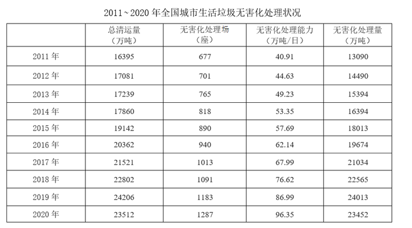

### 第 1 题　qid 5101650 · 综合

若垃圾无害化处理率=无害化处理量÷总清运量×100%，那么2020年全国城市生活垃圾无害化处理率约比2011年高：

- **A**. 10%
- **B**. 15%
- **C**. 20%　✅
- **D**. 25%

**答案**：C

**官方解析**

根据题干“······2020年全国城市生活垃圾无害化处理率约比2011年高”，结合垃圾无害化处理率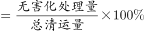（即无害化处理量占总清运量的比重），可判定本题为两期比重问题。定位统计表可知：2020年、2011年全国城市生活垃圾无害化处理量分别为23452万吨、13090万吨；2020年、2011年总清运量分别为23512万吨、16395万吨。根据公式：比重，则2020年全国城市生活垃圾无害化处理率比2011年高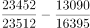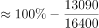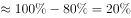。

故正确答案为C。

---

### 第 2 题　qid 5101653 · 综合

2016~2020年间，全国城市生活垃圾总清运量约比2011~2015年间高多少亿吨？

- **A**. 2
- **B**. 2.5　✅
- **C**. 3
- **D**. 3.5

**答案**：B

**官方解析**

定位统计表可得2011~2020年间各年全国城市生活垃圾总清运量。则2016~2020年间全国城市生活垃圾总清运量比2011~2015年间高：（20362+21521+22802+24206+23512）-（16395+17081+17239+17860+19142）（20400+21500+22800+24200+23500）-（16400+17100+17200+17900+19100）=24700万吨=2.47亿吨，与B项最接近。

故正确答案为B。

---

### 第 3 题　qid 5101655 · 增长

2012~2020年间，全国城市生活垃圾无害化处理量同比增长超过1200万吨的年份有几个？

- **A**. 4
- **B**. 5
- **C**. 6　✅
- **D**. 7

**答案**：C

**官方解析**

根据题干“······同比增长超过1200万吨······”，可判定本题为增长量计算问题。定位表格最后一列，结合公式：增长量=现期量-基期量，可得2012~2020年全国城市生活垃圾无害化处理量的同比增长量分别为：

2012年：14490-13090=1400万吨&gt;1200万吨；

2013年：万吨&lt;1200万吨；

2014年：16394-15394=1000万吨&lt;1200万吨；

2015年：万吨&gt;1200万吨；

2016年：万吨&gt;1200万吨；

2017年：万吨&gt;1200万吨；

2018年：万吨&gt;1200万吨；

2019年：万吨&gt;1200万吨；

2020年：23452-24013&lt;1200万吨。

综上可得，2012~2020年间，全国城市生活垃圾无害化处理量同比增长超过1200万吨的年份有6个。

故正确答案为C。

---

### 第 4 题　qid 5101656 · 平均数

2020年，全国平均每座无害化处理场的无害化处理能力约为多少？

- **A**. 27万吨/年　✅
- **B**. 41万吨/年
- **C**. 58万吨/年
- **D**. 79万吨/年

**答案**：A

**官方解析**

根据题干“2020年······平均每座······”，可判定本题为现期平均数问题。定位统计表可得：2020年，全国无害化处理场为1287座，无害化处理能力为96.35万吨/日。故2020年，全国平均每座无害化处理场的无害化处理能力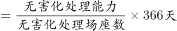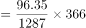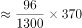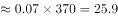万吨/年，与A项最接近。

故正确答案为A。

---

### 第 5 题　qid 5101658 · 综合

关于全国城市生活垃圾清运和无害化处理状况，能够从上述资料中推出的是：

- **A**. 2016年，总清运量同比增速快于上年水平
- **B**. 2020年，无害化处理场数量比2011年翻了一番
- **C**. 2018~2020年，每年的无害化处理能力同比增速都超过10%　✅
- **D**. 2017年总清运量与无害化处理量均超过2016年1500万吨以上

**答案**：C

**官方解析**

A项：定位统计表可知2014~2016年全国城市生活垃圾总清运量的数据，根据公式：增长率，可得2016年总清运量同比增速为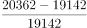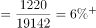，2015年总清运量同比增速为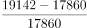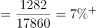，故2016年，总清运量同比增速低于上年水平，错误；

B项：定位统计表可得：2011年、2020年全国城市生活垃圾无害化处理场数量分别为677座、1287座。由于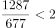，故2020年，无害化处理场数量并未比2011年翻一番，错误；

C项：定位统计表可知2017~2020年全国城市生活垃圾无害化处理能力的数据，根据公式：增长率，可得2018年无害化处理能力同比增速为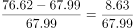，2019年无害化处理能力同比增速为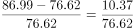，2020年无害化处理能力同比增速为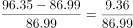，故2018~2020年，每年的无害化处理能力同比增速都超过10%，正确；

D项：定位统计表可知2016年、2017年全国城市生活垃圾总清运量与无害化处理量的数据，根据公式：增长量=现期量-基期量，可得2017年总清运量超过2016年：万吨&lt;1500万吨，2017年无害化处理量超过2016年：万吨&lt;1500万吨，故2017年总清运量与无害化处理量均未超过2016年1500万吨以上，错误。

故正确答案为C。

---

## 材料 2

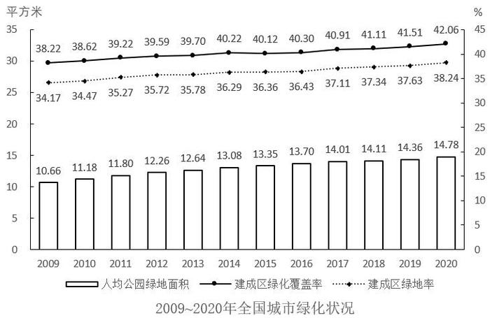

### 第 6 题　qid 5101668 · 增长

2011～2020年，全国城市建成区绿化覆盖率同比上升的年份有几个？

- **A**. 7
- **B**. 8
- **C**. 9　✅
- **D**. 10

**答案**：C

**官方解析**

定位统计图可知，2011~2020年全国城市建成区绿化覆盖率同比上升的有2011年（39.22%）、2012年（39.59%）、2013年（39.70%）、2014年（40.22%）、2016年（40.30%）、2017年（40.91%）、2018年（41.11%）、2019年（41.51%）、2020年（42.06%），共9年。
故正确答案为C。

---

### 第 7 题　qid 5101669 · 综合

以下年份中全国城市建成区绿化覆盖率与建成区绿地率数值相差最大的是：

- **A**. 2017年
- **B**. 2018年
- **C**. 2019年　✅
- **D**. 2020年

**答案**：C

**官方解析**

定位统计图可得，各年份全国城市建成区绿化覆盖率与建成区绿地率的差值分别为：
2017年=40.91%-37.11%=3.80%；
2018年=41.11%-37.34%=3.77%；
2019年=41.51%-37.63%=3.88%；
2020年=42.06%-38.24%=3.82%。
综上，数值相差最大的为2019年。
故正确答案为C。

---

### 第 8 题　qid 5101671 · 增长

表中全国城市建成区绿地率首次超过35%的年份，当年人均公园绿地面积同比约上升了：

- **A**. 4%
- **B**. 6%　✅
- **C**. 8%
- **D**. 10%

**答案**：B

**官方解析**

根据题干“表中全国城市建成区绿地率首次超过35%的年份，当年······同比约上升了”，结合选项均为百分数，可判定本题为一般增长率问题。定位统计图可得：表中全国城市建成区绿地率首次超过35%的年份为2011年。2011年全国人均公园绿地面积为11.80平方米，2010年为11.18平方米。根据公式：增长率，故所求为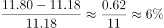。

故正确答案为B。

---

### 第 9 题　qid 5101672 · 增长

以下折线图反映了哪一时间段内全国城市人均公园绿地面积同比增量的变化趋势？

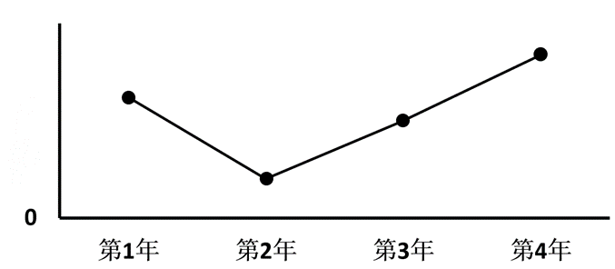

- **A**. 2011～2014年
- **B**. 2013～2016年
- **C**. 2015～2018年
- **D**. 2017～2020年　✅

**答案**：D

**官方解析**

根据题干“······同比增量的变化趋势”，可判定本题为增长量计算问题。定位统计图可得：2010-2020年全国城市人均公园绿地面积依次为11.18平方米、11.80平方米、12.26平方米、12.64平方米、13.08平方米、13.35平方米、13.70平方米、14.01平方米、14.11平方米、14.36平方米、14.78平方米。根据公式：增长量=现期量-基期量。则2011-2020年全国城市人均公园绿地面积同比增量分别为：
2011年=11.80-11.18=0.62平方米；
2012年=12.26-11.80=0.46平方米；
2013年=12.64-12.26=0.38平方米；
2014年=13.08-12.64=0.44平方米；
2015年=13.35-13.08=0.27平方米；
2016年=13.70-13.35=0.35平方米；
2017年=14.01-13.70=0.31平方米；
2018年=14.11-14.01=0.10平方米；
2019年=14.36-14.11=0.25平方米；
2020年=14.78-14.36=0.42平方米。
比较可知，满足题干折线图先下降再上升变化趋势的为2017～2020年，对应D项。
故正确答案为D。

---

### 第 10 题　qid 5101673 · 综合

关于全国城市绿化状况，能够从上述资料中推出的是:

- **A**. 2014年，城市建成区绿化覆盖区域面积是未覆盖区域面积的1.5倍以上
- **B**. 以2009年为基期计算，2009～2020年城市建成区绿地率年均上升0.4个百分点以上
- **C**. 如城市总人口保持不变，则2020年城市公园绿地面积比2009年增长了50%以上
- **D**. 如按全国城市平均数计算，2020年一个800万人口的城市拥有公园绿地超过100平方千米　✅

**答案**：D

**官方解析**

A项：定位统计图可知：2014年全国城市建成区绿化覆盖率为40.22%。则2014年全国城市建成区绿化未覆盖率为1-40.22%=59.78%，所求为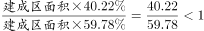，错误；

B项：定位统计图可知：2009年和2020年全国城市建成区绿地率分别为34.17%和38.24%。根据公式：年均增长量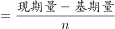，所求为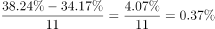，即年均上升了不到0.4个百分点，错误；

C项：定位统计图可知：2009年和2020年全国城市人均公园绿地面积分别为10.66平方米和14.78平方米。根据公式：城市公园绿地面积=城市人口×城市人均公园绿地面积，由于城市总人口保持不变，则所求增长率为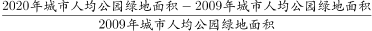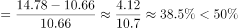，错误；

D项：定位统计图可知：2020年全国城市人均公园绿地面积为14.78平方米。根据公式：城市公园绿地面积=城市人口×城市人均公园绿地面积，则所求为800×14.78=11824万平方米=118.24平方千米&gt;100平方千米，正确。

故正确答案为D。

---

## 材料 3

        2021年全国共有138个国家级区域性良种繁育基地，其中山东、黑龙江分别有16和12个基地，云南、湖北均以10个居于其后，2021年全国通过国审的水稻品种有677个，其中湖南有169个；玉米通过国审的919个品种中，134个来自北京，其后是吉林99个、河南95个；与水稻、玉米相比，大豆种源高度依赖进口，2021年仅有86个国审品种，其中黑龙江18个、山东14个；棉花39个国审品种中，最多的是新疆，有12个，其次为河南，有6个。

        2021年，我国农作物自主选育品种面积占比超95%，水稻、小麦两大口粮作物品种100%自给。大豆种子对外依赖度高达86%，胡萝卜、茄子、菠菜、洋葱、高端品种番茄及甜菜等种子的进口依赖度超过90%。

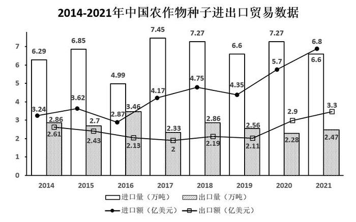

### 第 11 题　qid 5101661 · 综合

2014-2021年间，我国农作物种子进出口贸易逆差超2亿美元的年份有几个？

- **A**. 3
- **B**. 4
- **C**. 5　✅
- **D**. 6

**答案**：C

**官方解析**

定位统计图可得：2014-2021年中国农作物种子进口额分别为3.24亿美元、3.62亿美元、2.87亿美元、4.17亿美元、4.75亿美元、4.35亿美元、5.7亿美元、6.8亿美元；出口额分别为2.61亿美元、2.43亿美元、2.13亿美元、2亿美元、2.19亿美元、2.11亿美元、2.9亿美元、3.3亿美元。则2014-2021年间，我国农作物种子进出口贸易逆差分别为：
2014年：3.24-2.61=0.63亿美元；
2015年：3.62-2.43=1.19亿美元；
2016年：2.87-2.13=0.74亿美元；
2017年：4.17-2=2.17亿美元；
2018年：4.75-2.19=2.56亿美元；
2019年：4.35-2.11=2.24亿美元；
2020年：5.7-2.9=2.8亿美元；
2021年：6.8-3.3=3.5亿美元。
因此，2014-2021年间，我国农作物种子进出口贸易逆差超2亿美元的年份有2017年、2018年、2019年、2020年、2021年，共5个。
故正确答案为C。

---

### 第 12 题　qid 5101663 · 增长

2014-2021年间，我国农作物种子贸易进出口总量同比增长的年份有几个？

- **A**. 4　✅
- **B**. 5
- **C**. 6
- **D**. 7

**答案**：A

**官方解析**

根据题干“2014-2021年间······同比增长的年份有几个”，可判定本题为增长量计算问题。定位统计图可得，2014-2021年我国各年农作物种子贸易的进口量与出口量。则2014-2021年我国农作物种子贸易进出口总量分别为：
2014年，6.29+2.86=9.15万吨；
2015年，6.85+2.7=9.55万吨；
2016年，4.99+3.46=8.45万吨；
2017年，7.45+2.33=9.78万吨；
2018年，7.27+2.86=10.13万吨；
2019年，6.6+2.56=9.16万吨；
2020年，7.27+2.28=9.55万吨；
2021年，6.6+2.47=9.07万吨。
根据公式：增长量=现期量-基期量，若我国农作物种子贸易进出口总量实现同比增长，则需增长量＞0，即现期量-基期量＞0，故直接找出现期量大于基期量的年份即可。由此可知，2014-2021年间，我国农作物种子贸易进出口总量大于上年的有：2015年（9.55万吨）＞2014年（9.15万吨）；2017年（9.78万吨）＞2016年（8.45万吨）；2018年（10.13万吨）＞2017年（9.78万吨）；2020年（9.55万吨）＞2019年（9.16万吨），共4个年份。
故正确答案为A。

---

### 第 13 题　qid 5101665 · 增长

如按2021年我国农作物种子出口量同比增速推算，2022年我国农作物种子出口量约为多少万吨？

- **A**. 2.58
- **B**. 2.68　✅
- **C**. 2.78
- **D**. 2.88

**答案**：B

**官方解析**

根据题干“如按2021年······同比增速推算，2022年······出口量约为多少万吨”，结合材料时间为2021年，可判定本题为现期计算问题。定位统计图可知：2021年与2020年中国农作物种子出口量分别为2.47万吨、2.28万吨，根据公式：增长率，可得2021年中国农作物种子出口量同比增速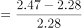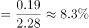。根据公式：现期量=基期量×（1+增长率），可得2022年中国农作物种子出口量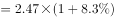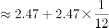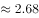万吨。

故正确答案为B。

---

### 第 14 题　qid 5101667 · 比重

2021年，我国农作物种子出口额占进出口总额的比重较上年（    ）。

- **A**. 增加了2个百分点以上
- **B**. 减少了2个百分点以上
- **C**. 增加了不到2个百分点
- **D**. 减少了不到2个百分点　✅

**答案**：D

**官方解析**

根据题干“2021年······占······比重较上年”，结合选项为增加/减少+百分点，可判定本题为两期比重计算问题。定位统计图可得：2021年和2020年我国农作物种子出口额分别为3.3亿美元和2.9亿美元，进口额分别为6.8亿美元和5.7亿美元。根据公式：比重，可得2021年农作物种子出口额占进出口总额的比重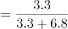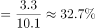；2020年比重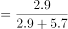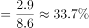，则所求=32.7%-33.7%=-1%，即减少了不到2个百分点。

故正确答案为D。

---

### 第 15 题　qid 5101670 · 综合

不能从上述资料推出的是（    ）。

- **A**. 2021年我国大豆种子自给率不足15%
- **B**. 2021年棉花国审品种中新疆占比最大
- **C**. 2021年我国自主甜菜种子占国内市场份额低于10%
- **D**. 2021年玉米通过国审品种最多，国内玉米需求已能自给　✅

**答案**：D

**官方解析**

A项：定位文字材料第二段可知，2021年我国······大豆种子对外依赖度高达86%，则2021年我国大豆种子的自给率应为1-86%=14%＜15%，正确；
B项：定位文字材料第一段可知，（2021年）棉花国审品种中最多的是新疆，有12个，其次为河南，有6个。因此新疆占比最大，正确；
C项：定位文字材料第二段可知，2021年我国······胡萝卜、茄子、菠菜、洋葱、高端品种番茄及甜菜等种子的进口依赖度超过90%，则2021年我国甜菜种子的自给率应＜1-90%=10%，故我国自主甜菜种子占国内市场份额低于10%，正确；
D项：定位文字资料第一段可知，2021年全国通过国审的玉米品种有919个，但并未说明已经列出了所有种子通过国审的品种的数量，故无法确定玉米通过国审的品种是否最多；定位文字资料第二段可知，水稻、小麦两大口粮作物品种100%自给，并没有提到玉米，因此不能确定国内玉米需求是否已能自给。综上，D项表述不能从资料中推出，错误。
本题为选非题，故正确答案为D。

---

### 第 16 题　qid 5102410 · 增长

企业引入投资人甲注入资金5000万元，投资完成后原企业董事长所持有的股份从60%下降到40%。又过了一段时间后董事长将自己所持股份的一半卖给投资人乙，同时投资人乙为企业注入资金1.2亿元，此时董事长所持有的股份下降到15%。问此时投资人甲如果卖出所持股份，能获利多少亿元？

- **A**. 0.9
- **B**. 0.8
- **C**. 0.7　✅
- **D**. 0.6

**答案**：C

**官方解析**

设投资人甲注入资金后的企业总资金为100x万，则现在董事长持有40x万，由题意可知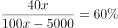，解得x=150万，则企业现在总资金为100×150万=15000万元=1.5亿元，董事长持有40×150=6000万元=0.6亿元。一段时间后，设该企业股份变为之前的n倍，则企业总资金变为1.5n亿元，董事长的一半股份为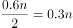亿元，可得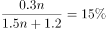，解得n=2.4。故投资人甲卖出所持股份能获利5000×2.4-5000=7000万元=0.7亿元。

故正确答案为C。

---
