# 2022年深圳市考公务员录用考试《行测》试题（网友回忆版）

> 资料分析 · 15 题 · 深圳市考 2022

## 材料 1

        H市统计公报显示，2019年末全市各级各类学校总数达2642所，比上年增加91所；毕业生51.49万人，招生63.97万人，在校学生232.24万人，分别增长2.9%、0.5%和5.1%。年末全市有幼儿园1836所，增加65所；在园幼儿54.50万人，增长4.0%；有小学340所，减少4所；在校学生106.90万人，增长4.0%。普通中学417所，增加27所；在校学生47.74万人，增长6.6%。普通高等学校13所，与上年持平，在校学生数增长9.0%。全年全市普通高等学校本专科招生3.00万人，在校生9.22万人，毕业生2.13万人；普通高等学校研究生教育招生0.81万人，在校生2.10万人，毕业生0.47万人。

        2019年末，全市各类专业技术人员183.50万人，比上年增长10.1%，其中具有中级及以上技术职称的专业技术人员54.69万人，增长7.4%。年末全市各级创新载体2258个，其中，国家级重点实验室、工程实验室和技术中心等创新载体116个，部级创新载体604个，市级创新载体1537个。全年专利申请量与授权量分别为26.15万件和16.66万件，分别增长14.4%和18.8%。其中，发明专利申请量与授权量分别为8.29万件和2.61万件，分别增长18.4%和22.3%；PCT国际专利申请量1.75万件，减少3.4%。

### 第 1 题　qid 4651877 · 增长

2019年末，H市各级各类学校中，学校数量同比增加最快的是（    ）。

- **A**. 幼儿园
- **B**. 小学
- **C**. 普通中学　✅
- **D**. 普通高等学校

**答案**：C

**官方解析**

根据题干“······同比增加最快的是”，可判定本题为一般增长率问题。定位文字材料第一段可得：2019年末全市有幼儿园1836所，增加65所；有小学340所，减少4所；普通中学417所，增加27所；普通高等学校13所，与上年持平。观察数据发现，小学学校的增长量为负数，则增长率为负值；普通高等学校数量与上年持平，即增长率为0，结合其他类学校增长量都为正增长，排除B、D两项。根据公式：增长率，可得2019年末，H市幼儿园和普通中学学校数量增长率分别为：幼儿园：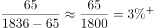；普通中学：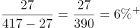。

综上所述，2019年末，H市各级各类学校中，学校数量同比增加最快的是普通中学。

故正确答案为C。

---

### 第 2 题　qid 4651879 · 增长

若全市每所幼儿园平均在园幼儿数保持2019年同比增量不变，则到（    ），幼儿园平均在园幼儿数可超过300名。

- **A**. 2020年
- **B**. 2021年
- **C**. 2022年
- **D**. 2023年　✅

**答案**：D

**官方解析**

根据题干“······保持······同比增量不变，则到（    ）······可超过300名”，可判定本题为现期追赶问题。定位文字材料第一段可得：2019年末全市有幼儿园1836所，增加65所；在园幼儿54.50万人，增长4.0%，则2019年全市每所幼儿园平均在园幼儿数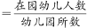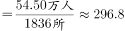人/所。根据公式：基期量，则2018年全市在园幼儿为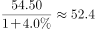万人；根据公式：基期量＝现期量-增长量，则2018年全市有幼儿园1836-65＝1771所。故2018年全市每所幼儿园平均在园幼儿数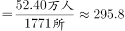人/所。则2019年全市每所幼儿园平均在园幼儿数同比增量为296.8-295.8＝1人/所。根据公式：现期量＝基期量＋增长量×n，则296.8＋1×n＞300，解得n＞3，则n至少为4，故需要到2019＋4＝2023年，幼儿园平均在园幼儿数可超过300名。

故正确答案为D。

---

### 第 3 题　qid 4651881 · 增长

2019年末，H市普通高等学校研究生在校生数同比增长（    ）。

- **A**. 7.6%
- **B**. 19.3%　✅
- **C**. 26.1%
- **D**. 无法判断

**答案**：B

**官方解析**

根据题干“2019年末，·······同比增长”，结合选项为百分数，可判定本题为一般增长率问题。定位文字材料第一段可得：2019年全年普通高等学校研究生教育招生0.81万人，在校生2.10万人，毕业生0.47万人。根据公式：今年在校人数=去年在校人数-毕业人数+招生人数，可得：今年在校人数-去年在校人数=招生人数-毕业人数=今年在校人数同比增长量=2019年招生人数-2019年毕业人数=0.81万-0.47万=0.34万人。根据公式：增长率，可得：2019年末，H市普通高等学校研究生在校生数同比增长率为：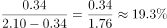。

故正确答案为B。

---

### 第 4 题　qid 4651883 · 综合

关于H市2019年专利申请量与授权量，下列说法不正确的是（    ）。

- **A**. 发明专利在全年专利申请量与授权量中的占比均同比上升
- **B**. 发明专利申请量同比增速较PCT国际专利申请量同比增速高21.8%　✅
- **C**. 全年专利申请量同比增量大于全年专利授权量同比增量
- **D**. PCT国际专利申请量同比减少约0.06万件

**答案**：B

**官方解析**

A项：定位文字材料第二段，可知2019年全年专利申请量与授权量······分别增长14.4%（）和18.8%（）。其中，发明专利申请量与授权量······分别增长18.4%（）和22.3%（）。根据两期比重比较结论：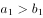，则发明专利在全年专利申请量中的占比同比上升；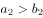，则发明专利在全年专利授权量中的占比同比上升。故发明专利在全年专利申请量与授权量中的占比均同比上升，正确；

B项：定位文字材料第二段，可知2019年全年发明专利申请量增长18.4%，PCT国际专利申请量减少3.4%，则发明专利申请量同比增速较PCT国际专利申请量同比增速高18.4%-（-3.4%）=21.8个百分点，而不是21.8%，错误；

C项：定位文字材料第二段，可知2019年全年专利申请量与授权量分别为26.15万件和16.66万件，分别增长14.4%和18.8%。根据公式：增长量，可得：全年专利申请量同比增量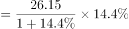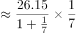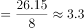万件，全年专利授权量同比增量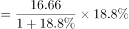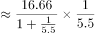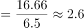万件，故全年专利申请量同比增量大于全年专利授权量同比增量，正确；

D项：定位文字材料第二段，可知PCT国际专利申请量1.75万件，减少3.4%。根据公式：增长量，可得：PCT国际专利申请量同比增量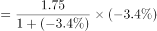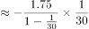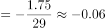万件，即减少约0.06万件，正确。

本题为选非题，故正确答案为B。

---

### 第 5 题　qid 4651885 · 综合

根据上文，下列说法不正确的是（    ）。

- **A**. 2018年末，H市小学在校学生数在各级各类学校在校学生总数中占比不足一半
- **B**. 2018年末，H市各类专业技术人员中，具有中级及以上技术职称的人员占比不足三成　✅
- **C**. 2019年末，H市普通高等学校毕业生中，本专科毕业生数占比超过八成
- **D**. 2019年末，H市部级及以上创新载体在全市各级创新载体中占比超过三成

**答案**：B

**官方解析**

A项：定位文字材料第一段可知，2019年末全市各级各类学校在校学生232.24万人，增长5.1%，小学在校学生106.90万人，增长4.0%。根据基期比重，可得所求比重为：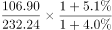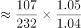，正确；

B项：定位文字材料第二段可知，2019年末全市各类专业技术人员183.50万人，比上年增长10.1%，其中具有中级及以上技术职称的专业技术人员54.69万人，增长7.4%。根据基期比重，可得所求比重为：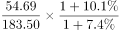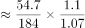，错误；

C项：定位文字材料第一段可知，2019年全年全市普通高等学校本专科毕业生2.13万人，普通高等学校研究生教育毕业生0.47万人。根据比重，可得所求比重为：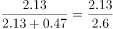，正确；

D项：定位文字材料第二段可知，2019年末全市各级创新载体2258个，其中，国家级重点实验室、工程实验室和技术中心等创新载体116个，部级创新载体604个。根据比重，可得所求比重为：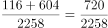，正确。

本题为选非题，故正确答案为B。

---

## 材料 2

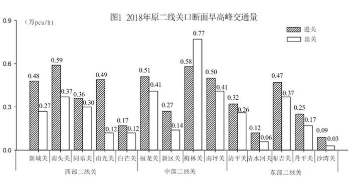

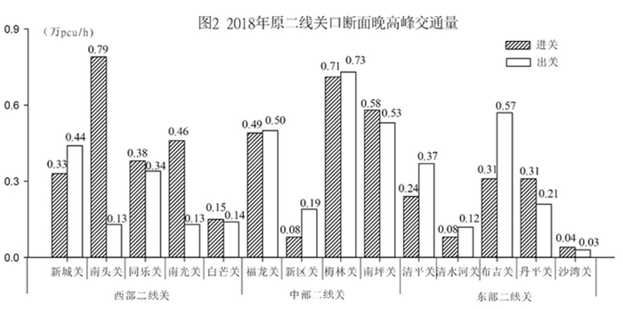

### 第 6 题　qid 4651853 · 综合

交通潮汐现象是指早晨进城方向交通流量大，而晚上出城方向交通流量大的现象。以下关口断面交通潮汐现象最明显的是：

- **A**. 布吉关　✅
- **B**. 清平关
- **C**. 南头关
- **D**. 福龙关

**答案**：A

**官方解析**

定位图1可得：布吉关、清平关、南头关、福龙关早晨进城方向交通流量（早高峰进关交通量）分别为0.47、0.32、0.59、0.51万pcu/h；定位图2可得：布吉关、清平关、南头关、福龙关晚上出城方向交通流量（晚高峰出关交通量）分别为0.57、0.37、0.13、0.50万pcu/h。则布吉关、清平关、南头关、福龙关断面交通潮汐现象分别为0.47+0.57=1.04万pcu/h、0.32+0.37=0.69万pcu/h、0.59+0.13=0.72万pcu/h、0.51+0.50=1.01万pcu/h，比较可知，布吉关断面交通潮汐现象最明显。
故正确答案为A。

---

### 第 7 题　qid 4651855 · 综合

西部二线关中，断面早晚高峰进关交通量之和位列第三位的关口是：

- **A**. 南头关
- **B**. 南光关
- **C**. 同乐关
- **D**. 新城关　✅

**答案**：D

**官方解析**

定位图1可得：新城关、南头关、同乐关、南光关、白芒关早高峰进关交通量分别为0.48、0.59、0.36、0.49、0.17万pcu/h；定位图2可得：新城关、南头关、同乐关、南光关、白芒关晚高峰进关交通量分别为0.33、0.79、0.38、0.46、0.15万pcu/h。则新城关、南头关、同乐关、南光关、白芒关断面早晚高峰进关交通量之和分别为0.48+0.33=0.81万pcu/h、0.59+0.79=1.38万pcu/h、0.36+0.38=0.74万pcu/h、0.49+0.46=0.95万pcu/h、0.17+0.15=0.32万pcu/h。比较可知，断面早晚高峰进关交通量之和为南头关＞南光关＞新城关＞同乐关＞白芒关，则新城关位列第三位。
故正确答案为D。

---

### 第 8 题　qid 4651858 · 综合

与东部二线关口相比，中部二线关口断面早高峰进关交通量之和大（    ）。

- **A**. 48.8%　✅
- **B**. 67.8%
- **C**. 1.61万pcu/h
- **D**. 0.54万pcu/h

**答案**：A

**官方解析**

根据题干“与东部二线关口相比，中部二线关口·······大”，可判定本题为一般增长率问题。定位图1可得：2018年中部二线各关口断面早高峰进关交通量分别为0.51、0.27、0.58、0.50万pcu/h；东部二线各关口断面早高峰进关交通量分别为0.32、0.12、0.47、0.25、0.09万pcu/h。则中部二线关口断面早高峰进关交通量之和为0.51+0.27+0.58+0.50=1.86万pcu/h；东部二线关口之和为0.32+0.12+0.47+0.25+0.09=1.25万pcu/h，故所求差值为1.86-1.25=0.61万pcu/h，排除C、D两项。根据公式：增长率，可得中部比东部大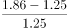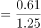，排除B项。

故正确答案为A。

---

### 第 9 题　qid 4651859 · 综合

若城市道路的设计通行能力为1500pcu/h，则晚高峰进出关交通量均超设计值的关口有（    ）个。

- **A**. 7
- **B**. 8　✅
- **C**. 9
- **D**. 10

**答案**：B

**官方解析**

定位图2可得：2018年原二线关口断面晚高峰进出关交通量，由题干可知城市道路的设计通行能力为1500pcu/h=0.15万pcu/h，比较可得进出关交通量均超过0.15万pcu/h的有：新城关（0.33、0.44万pcu/h）、同乐关（0.38、0.34万pcu/h）、福龙关（0.49、0.50万pcu/h）、梅林关（0.71、0.73万pcu/h）、南坪关（0.58、0.53万pcu/h）、清平关（0.24、0.37万pcu/h）、布吉关（0.31、0.57万pcu/h）、丹平关（0.31、0.21万pcu/h），共8个关口。
故正确答案为B。

---

### 第 10 题　qid 4651861 · 综合

根据上图，下列说法正确的有（    ）个。
（1）原二线关口中，梅林关断面早晚高峰出关交通量均最大；
（2）东部二线关口的断面早高峰进关交通量均大于出关交通量；
（3）西部二线关口断面早高峰出关交通量之和与晚高峰相等。

- **A**. 0
- **B**. 1
- **C**. 2
- **D**. 3　✅

**答案**：D

**官方解析**

（1）定位图1、图2可知，原二线各关口断面早晚高峰的出关交通量。观察可知，原二线关口中，早晚高峰出关交通量最大的均是梅林关断面，交通量分别为0.77万pcu/h、0.73万pcu/h，正确；
（2）定位图1可知东部二线各关口断面早高峰的进关与出关交通量。观察可知，东部二线5个关口的断面早高峰进关交通量均大于出关交通量，正确；
（3）定位图1、图2可知西部二线各关口断面早晚高峰的出关交通量，则西部二线关口断面早高峰出关交通量之和＝0.27＋0.37＋0.30＋0.12＋0.12＝1.18万pcu/h，晚高峰出关交通量之和＝0.44＋0.13＋0.34＋0.13＋0.14＝1.18万pcu/h，故早高峰出关交通量之和与晚高峰相等，正确。
综上，说法正确的有3个。
故正确答案为D。

---

## 材料 3

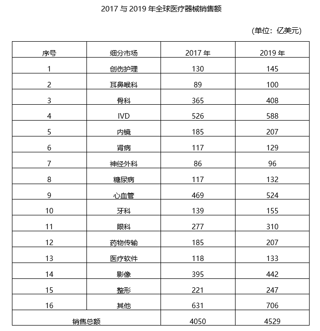

### 第 11 题　qid 4651813 · 增长

若2017年全球医疗器械销售总额同比提高4.6%，IVD医疗器械销售额在全球医疗器械销售总额中占比同比提高3个百分点，则2016年IVD医疗器械的销售额约为（    ）亿美元。

- **A**. 354
- **B**. 387　✅
- **C**. 407
- **D**. 421

**答案**：B

**官方解析**

根据题干“······则2016年······的销售额约为······亿美元”，结合材料时间为2017年，可判定本题为基期计算问题。定位表格材料可知，2017年全球医疗器械销售总额为4050亿美元，IVD医疗器械销售额为526亿元。2017年全球医疗器械销售总额同比提高4.6%，根据基期量，则2016年全球医疗器械销售总额为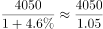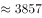亿美元。2017年IVD医疗器械销售额在全球医疗器械销售总额中占比为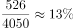，同比提高3个百分点，则2016年IVD医疗器械销售额在全球医疗器械销售总额中占比为13%-3%=10%。根据部分量=整体量×比重，则2016年IVD医疗器械的销售额约为3857×10%=385.7亿美元，与B项最接近。

故正确答案为B。

---

### 第 12 题　qid 4651816 · 比重

2017年，除其他类外，在全球医疗器械销售总额中占比超过5%的细分市场有（    ）个。

- **A**. 4
- **B**. 5
- **C**. 6　✅
- **D**. 7

**答案**：C

**官方解析**

定位表格材料可知，2017年全球医疗器械销售总额为4050亿美元，则其5%为4050×5%=202.5亿美元。通过查找统计表发现，2017年，除其他类外，在全球医疗器械销售总额中占比超过5%的细分市场有：骨科、IVD、心血管、眼科、影像、整形，共6个。
故正确答案为C。

---

### 第 13 题　qid 4651818 · 综合

2019年，除其他类外，排名前五的细分市场销售额之和约占全球医疗器械销售总额的：

- **A**. 35.5%
- **B**. 40.0%
- **C**. 45.6%
- **D**. 50.2%　✅

**答案**：D

**官方解析**

根据题干“2019年······占······”，结合材料给出了2019年的数据，可以判定本题为现期比重问题。定位表格材料可得，2019年除其他类外，排名前五的细分市场其销售额分别为IVD588亿美元，心血管524亿美元，影像442亿美元，骨科408亿美元，眼科310亿美元，全球医疗器械销售总额为4529亿美元。根据比重，故所求为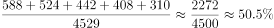，与D项最接近。

故正确答案为D。

---

### 第 14 题　qid 4651819 · 增长

与2017年相比，除其他类外，2019年全球医疗器械销售额增幅最小的细分市场是：

- **A**. 肾病　✅
- **B**. 心血管
- **C**. 骨科
- **D**. 医疗软件

**答案**：A

**官方解析**

根据题干“与2017年相比······2019年······增幅最小······”，可判定本题为一般增长率问题。定位表格材料可得，2017年与2019年全球医疗器械各细分市场销售额。根据公式：增长率，则肾病医疗器械销售额的增长率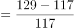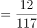，心血管医疗器械销售额的增长率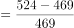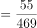，骨科医疗器械销售额的增长率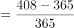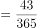，医疗软件销售额的增长率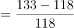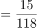，故选项中，增幅最小的是肾病医疗器械销售额。

故正确答案为A。

---

### 第 15 题　qid 4651821 · 综合

根据上表，下列说法正确的是：

- **A**. 2017—2019年，全球医疗器械销售总额年均增长率大于6%
- **B**. 2019年，牙科医疗器械销售额在全球医疗器械销售总额中的占比较耳鼻喉科高2.1个百分点
- **C**. 与2017年相比，2019年糖尿病医疗器械销售额在全球医疗器械销售总额中的占比有所上升　✅
- **D**. 与2017年相比，2019年医疗器械销售额增长超过50亿美元的细分市场有4个

**答案**：C

**官方解析**

A项：定位表格材料可得，2017年全球医疗器械销售总额为4050亿美元，按照年均增长率为6%测算，2019年全球医疗器械销售总额应为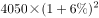亿美元，超过实际数值4529亿美元，则年均增长率应小于6%，错误；

B项：定位表格材料可得，2019年牙科、耳鼻喉科医疗器械销售额分别为155亿美元、100亿美元，2019年全球医疗器械销售总额为4529亿美元，比重差为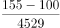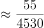，即前者比后者高不到2个百分点，错误；

C项：定位表格材料可得，2017年糖尿病医疗器械销售额和当年全球医疗器械销售总额分别为117亿美元、4050亿美元，占比为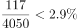；2019年糖尿病医疗器械销售额和当年全球医疗器械销售总额分别为132亿美元、4529亿美元，占比为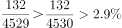，占比有所上升，正确；

D项：定位表格材料可得，与2017年相比，2019年医疗器械销售额增长超过50亿美元的细分市场分别为：IVD（588-526=62亿美元）、心血管（524-469=55亿美元）、其他（706-631=75亿美元），共有3个，错误。

（注：因其他类无法确定细分市场具体数量，因而无法判定增长超过50亿美元的细分市场数量，学员也可根据此点排除D项。）

故正确答案为C。

---
