# 2022年湖北省选调生招录考试综合知识和行政职业能力测验试卷（网友回忆版）

> 资料分析 · 11 题 · 湖北 2022

## 材料 1

### 第 1 题　qid 4808271 · 平均数

2021年12月货邮运输量比前11个月平均数约高百分之几？

- **A**. 4.5
- **B**. 5.5
- **C**. 6.5　✅
- **D**. 7.5

**答案**：C

**官方解析**

根据题干“······比······约高百分之几”，判定本题为一般增长率问题。定位表格材料可得：2021年，全年累计货邮运输量为731.8万吨，12月货邮运输量为64.6万吨。则前11个月货邮运输量的平均数万吨，根据公式：增长率，可得所求增长率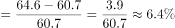，与C项最接近。

故正确答案为C。

---

### 第 2 题　qid 4808276 · 比重

以下哪个项目2020年12月占全年比例最低？

- **A**. 运输总周转量国际航线
- **B**. 旅客运输量国际航线　✅
- **C**. 货邮运输量国内航线
- **D**. 旅客周转量港澳台航线

**答案**：B

**官方解析**

根据题干“······2020年12月占全年比例最低”，结合材料时间为2021年，可判定本题为基期比重问题。定位表格材料可得各项目2021年12月和全年的运输值及增长率。根据公式：基期比重，可得2020年12月运输总周转量国际航线占全年比例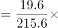；旅客运输量国际航线占全年比例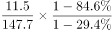；货邮运输量国内航线占全年比例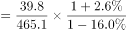；旅客周转量港澳台航线占全年比例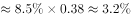。比较可得，2020年12月旅客运输量国际航线占全年比例最低。

故正确答案为B。

---

### 第 3 题　qid 4808281 · 比重

旅客吞吐量、货邮吞吐量、起降架次分东部、中部、西部、东北地区共12项中，2021年12月数据占全年累计的比例超过的有多少个？

- **A**. 4　✅
- **B**. 5
- **C**. 6
- **D**. 7

**答案**：A

**官方解析**

根据题干“······2021年12月数据占全年累计的比例······”，可判定本题为现期比重问题。定位表格材料可得2021年12月及全年各地区的旅客吞吐量、货邮吞吐量、起降架次的完成数据。根据公式：比重，则12月数据占全年数据的比例大于，即12月数据×12＞全年数据。代入数据验证可得：旅客吞吐量东部地区为2762.5×12=33150＜44274.4；中部地区为；西部地区为；东北地区为321.5×12=3858＜5462.0。货邮吞吐量东部地区为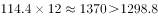；中部地区为；西部地区为；东北地区为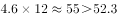。起降架次东部地区为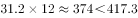；中部地区为12.0×12=144＜152.9；西部地区为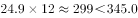；东北地区为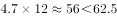。综上，只有四个地区的货邮吞吐量的2021年12月数据占全年累计数据的比例超过。

故正确答案为A。

---

### 第 4 题　qid 4808286 · 比重

起降架次当年累计数东部地区占比，2021年比2020年：

- **A**. 低1个多点　✅
- **B**. 低3个多点
- **C**. 高1个多点
- **D**. 高3个多点

**答案**：A

**官方解析**

根据题干“······占比，2021年比2020年”，结合选项“低/高几个多点”，判定本题为两期比重问题。定位表格材料可得：2021年累计中国民航起降架次为977.7万架次（B），同比增长8.0%（b），其中累计东部地区起降架次为417.3万架次（A），同比增长4.2%（a）。根据公式：两期比重差，则所求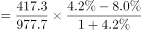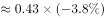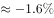，即低1个多点。

故正确答案为A。

---

### 第 5 题　qid 4808291 · 综合

从上述资料中能够推出的是：

- **A**. 2021年12月的货邮吞吐量低于2021年全年平均数
- **B**. 港澳台航线旅客运输量2021年每个月比上年同月均有正增长
- **C**. 2021年国际航线旅客周转量比上年降低了不超过300亿人公里
- **D**. 2021年12月，西部地区旅客吞吐量、货邮吞吐量在全国占比低于起降架次在全国占比　✅

**答案**：D

**官方解析**

A项：定位表格材料可得：2021年12月中国民航货邮吞吐量为156.9万吨，全年累计货邮吞吐量为1782.5万吨。则2021年全年货邮吞吐量平均数，即12月货邮吞吐量高于全年平均数，错误；

B项：定位表格材料可得：2021年12月港澳台航线旅客运输量同比增长56.4%，全年同比下降38.4%。全年旅客运输量=1-11月旅客运输量+12月旅客运输量，根据混合增长率口诀“混合居中不正中”，可知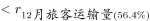，即1-11月旅客运输量同比下降，故其中一定有月份同比为负增长，错误；

C项：定位表格材料可得：2021年国际航线旅客周转量为90.6亿人公里，同比下降79.5%。根据公式：增长量，可得所求亿人公里，即下降超过300亿人公里，错误；

D项：定位表格材料可得：2021年12月全国旅客吞吐量、货邮吞吐量和起降架次分别为5590.3万人次、156.9万吨和72.8万架次；西部地区分别为1776.1万人次、23.4万吨和24.9万架次。则2021年12月西部地区旅客吞吐量在全国占比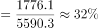；货邮吞吐量占比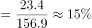；起降架次占比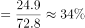，比较可得，起降架次占比最高，正确。

故正确答案为D。

---

## 材料 2

        2021年上半年，湖北省规模以上信息传输、软件和信息技术服务业（以下简称“规上信息软件业”）保持较快增长，推动全省规上服务业稳步发展。

        2021年上半年，湖北省676家规上信息软件业企业中营业收入前20的企业共实现营业收入355.46亿元，同比增长8.3%，拉动规上服务业营业收入增长1.1个百分点。

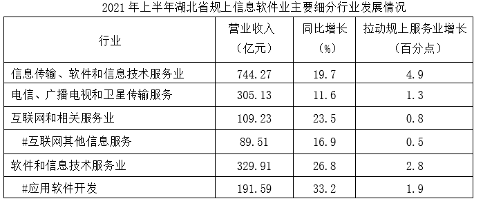

### 第 6 题　qid 4808340 · 平均数

2021年上半年湖北省规上信息软件业中营业收入前20的企业，平均每家每月营业收入约为多少亿元？

- **A**. 1.18
- **B**. 2.25
- **C**. 2.32
- **D**. 2.96　✅

**答案**：D

**官方解析**

根据题干“2021年上半年······平均每家每月营业收入约为多少亿元”，结合材料时间为2021年上半年，可判定本题为现期平均数问题。定位文字材料第二段：2021年上半年，湖北省676家规上信息软件业企业中营业收入前20的企业共实现营业收入355.46亿元。则所求亿元。

故正确答案为D。

---

### 第 7 题　qid 4808342 · 比重

2020年上半年湖北省规上信息软件业主要细分行业营业收入中，应用软件开发占软件和信息技术服务业的比例比互联网其他信息服务占互联网和相关服务业的比例约低多少个百分点？

- **A**. 17
- **B**. 26
- **C**. 31　✅
- **D**. 45

**答案**：C

**官方解析**

根据题干“2020年上半年······比例比······低多少个百分点”，结合材料时间为2021年上半年，可判定本题为基期比重问题。定位表格材料：2021年上半年互联网和相关服务业、互联网其他信息服务营业收入分别为109.23亿元、89.51亿元，同比增速分别为23.5%、16.9%；软件和信息技术服务业、应用软件开发营业收入分别为329.91亿元、191.59亿元，同比增速分别为26.8%、33.2%。根据基期比重公式：，则2020年上半年所求比重差值，与C项最接近。

故正确答案为C。

---

### 第 8 题　qid 4808344 · 比重

2021年上半年，湖北、河南、安徽、江西四省规上信息软件业营业收入占规上服务业比重由高到低的排名与拉动规上服务业增长由高到低的排名相同的有几个省份？

- **A**. 1　✅
- **B**. 2
- **C**. 3
- **D**. 4

**答案**：A

**官方解析**

定位表格材料可得，四省规上信息软件业营业收入占规上服务业比重分别为：湖北20.6%、河南17.4%、安徽25.7%、江西23%，拉动规上服务业增长分别为：湖北4.9%、河南3.4%、安徽4.5%、江西3.7%。比重排名由高到低分别为：安徽＞江西＞湖北＞河南，拉动增长排名由高到低分别为：湖北＞安徽＞江西＞河南，排名相同的有1个省份，河南均为第四名。
故正确答案为A。

---

### 第 9 题　qid 4808347 · 综合

以下四组地区中，哪组2021年上半年规上服务业营业收入之差最小？

- **A**. 北京和上海
- **B**. 浙江和广东
- **C**. 河南和江西
- **D**. 湖北和安徽　✅

**答案**：D

**官方解析**

根据题干“······2021年上半年规上服务业营业收入······”，结合材料时间是2021年上半年，同时给出了各地区营业收入及其占规上服务业比重，可判定本题为现期比重问题。定位统计表2可知各地区2021年上半年营业收入及其占规上服务业比重，根据公式：整体，可知各选项分别为：

A项，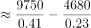亿元；

B项，亿元；

C项，亿元；

D项，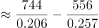亿元。

故正确答案为D。

---

### 第 10 题　qid 4808350 · 综合

下列说法不正确的是：

- **A**. 2021年上半年，北京规上服务业营业收入占全国的比例比上海多5%以内
- **B**. 2020年上半年，江苏、湖北、河南、安徽、江西五省规上信息软件业企业营业收入之和比上海低　✅
- **C**. 2021年上半年湖北比河南规上信息软件业营业收入多，规上服务业营业收入少
- **D**. 2020年上半年湖北省规上信息软件业企业中营业收入前20的企业总营业收入，与2021年上半年湖北省规上信息软件业中软件和信息技术服务业营业收入的差在5亿元以内

**答案**：B

**官方解析**

A项：定位统计表2可知，全国的营业收入为39271.6亿元，占规上服务业营业收入比重为29%；北京的营业收入为9751.1亿元，占规上服务业营业收入比重为41%；上海的营业收入为4678.99亿元，占规上服务业营业收入比重为23%。根据公式：整体，可知全国的规上服务业营业收入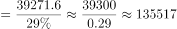亿元；北京的规上服务业营业收入比上海多亿元，则其占比较上海高约，正确；

B项：定位统计表2可知，各省2021年上半年规上信息软件业企业营业收入及其同比增长率，根据公式：基期量，可以分别得到各省2020年上半年规上信息软件业企业营业收入如下：上海亿元、江苏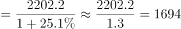亿元、湖北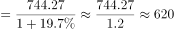亿元、河南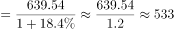亿元、安徽亿元、江西亿元。1694+620+533+463+344=3654&gt;3599，即2020年上半年，江苏、湖北、河南、安徽、江西五省规上信息软件业企业营业收入之和高于上海，错误；

C项：定位统计表2可知，湖北2021年上半年规上信息软件业企业营业收入744.27亿元，占规上服务业营业收入比重为20.6%；河南2021年上半年规上信息软件业企业营业收入639.54亿元，占规上服务业营业收入比重为17.4%，则2021年上半年湖北比河南规上信息软件业营业收入多。根据公式：整体，可知2021年上半年湖北规上服务业营业收入与河南相比，则2021年上半年湖北比河南规上服务业营业收入少，正确；

D项：定位文字资料可知，2021年上半年湖北省规上信息软件业企业中营业收入前20的企业营业收入为355.46亿元，同比增长8.3%；定位统计表1可知，2021年上半年湖北省规上信息软件业中软件和信息技术服务业营业收入为329.91亿元。根据公式：基期量，可知2020年上半年湖北省规上信息软件业企业中营业收入前20的企业营业收入亿元，与2021年上半年湖北省规上信息软件业中软件和信息技术服务业营业收入的差在5亿元以内，正确。

本题为选非题，故正确答案为B。

---

### 第 11 题　qid 4808272 · 增长

去年某厂的电解镍出厂价格为15万元/吨。今年年初镍矿价格暴涨，因此该厂将电解镍的产能扩大了25%。假设今年和去年生产的产品都全部售出，利润率与出厂价格之比为常数，该厂为实现今年电解镍利润同比翻一番，请问今年该厂电解镍出厂价格为多少万元/吨？

- **A**. 

- **B**. 

- **C**. 
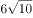
　✅
- **D**. 
20

**答案**：C

**官方解析**

设今年该厂电解镍出厂价格为x万元/吨，赋值去年产能为4，则今年产能为5，赋值去年总利润为20，则今年应实现的总利润为20×2=40。根据公式：利润率，可知去年利润率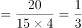，今年利润率。根据“利润率与出厂价格之比为常数”，可列等式：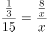，整理为：，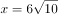，即今年该厂电解镍出厂价格为万元/吨。

故正确答案为C。

备注：本题出厂价格默认为成本价格，如将出厂价格当成销售价格则没有正确答案。

---
