# 2022年重庆市选调优秀大学生到基层工作考试《行测》题

> 资料分析 · 10 题 · 选调 2022

## 材料 1

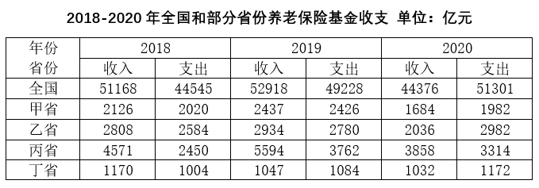

### 第 1 题　qid 4924266 · 综合

2020年养老保险基金收支有结余的是：

- **A**. 甲省
- **B**. 乙省
- **C**. 丙省　✅
- **D**. 丁省

**答案**：C

**官方解析**

定位统计表可知2020年甲省、乙省、丙省、丁省的养老保险基金收支数据。根据：结余即收入大于支出，仅丙省养老保险基金收入（3858亿元）＞支出（3314亿元），有结余。
故正确答案为C。

---

### 第 2 题　qid 4924270 · 增长

与2018年比较，2019年全国养老保险基金收入增速区间是：

- **A**. 2%-3%
- **B**. 3%-4%　✅
- **C**. 4%-5%
- **D**. 5%-6%

**答案**：B

**官方解析**

根据题干“与2018年比较，2019年······增速区间是”，可判定本题为一般增长率问题。定位统计表可得：2018年、2019年全国养老保险基金收入分别为51168亿元、52918亿元。根据公式：增长率，则所求增长率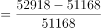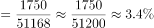，在B项区间内。

故正确答案为B。

---

### 第 3 题　qid 4924273 · 增长

与2018年比较，2019年养老保险基金收入增速低于全国水平的是：

- **A**. 甲省和乙省
- **B**. 乙省和丁省
- **C**. 乙省和丙省
- **D**. 丁省　✅

**答案**：D

**官方解析**

根据题干“与2018年比较，2019年······增速······”，可判定本题为一般增长率问题。定位统计表可知2018年、2019年四个省份的养老保险基金收入数据。结合上题可知，2019年全国养老保险基金收入增速约为3.4%，根据公式：增长率，则与2018年比较，2019年的增长率分别为：甲省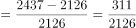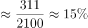；乙省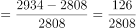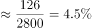；丙省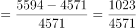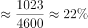；丁省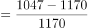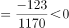。比较可知，增速低于全国的只有丁省。

故正确答案为D。

---

### 第 4 题　qid 4924287 · 综合

4个省份2018-2020年养老保险基金的结余额趋势是：

- **A**. 
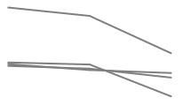
　✅
- **B**. 

- **C**. 

- **D**. 

**答案**：A

**官方解析**

定位表格可得2018-2020年4个省份养老保险基金的收入与支出。根据公式：结余额=收入-支出，甲省与乙省2019年收入均大于支出，则2019年结余额均大于0，而2020年收入均小于支出，则2020年结余额小于0，则2019年结余额＞2020年结余额；丙省：2019年结余额（5594-3762=1832亿元）&gt;2020年结余额（3858-3314=544亿元）；丁省：2019年结余额（1047-1084=-37亿元）&gt;2020年结余额（1032-1172=-140亿元），因此4个省份结余额2019-2020年趋势均是下降的，符合的只有A项。
故正确答案为A。

---

### 第 5 题　qid 4924292 · 综合

下列选项中，关于养老保险基金的说法正确的是：

- **A**. 全国的基金收入在2018-2020年期间逐年增加
- **B**. 4个省份基金收支的结余在2018-2020年期间逐年增加
- **C**. 丙省的基金收入超出其它三省的原因是该省的缴费率高于其它三省
- **D**. 2020年资料中养老保险基金收支有缺口的省份较前两年均有所增加　✅

**答案**：D

**官方解析**

A项：定位表格可得，2019年全国养老保险基金收入（52918亿元）＞2020年全国养老保险基金收入（44376亿元），并非逐年增加，错误；
B项：定位表格可得，甲省2019年养老保险基金收支结余=2437-2426＞0，2020年收支结余=1684-1982＜0，故2020年收支结余＜2019年收支结余，结余较上年下降，并非逐年增加，错误；
C项：材料未给出丙省的基金收入超出其它三省的原因，且未提及缴费率，故无法判断，错误；
D项：养老保险基金收支缺口指基金收入＜基金支出。定位表格可得：2018年收支有缺口的省份为0个；2019年收支有缺口的省份为丁省（收入1047亿元＜支出1084亿元），共1个；2020年收支有缺口的省份为甲省（收入1684亿元＜支出1982亿元）、乙省（收入2036亿元＜支出2982亿元）、丁省（收入1032亿元＜支出1172亿元），共3个，故2020年养老保险基金收支有缺口的省份较前两年均有所增加，正确。
故正确答案为D。

---

## 材料 2

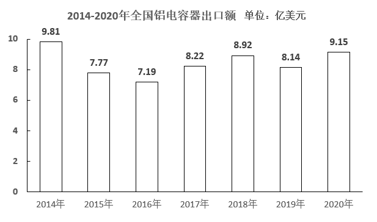

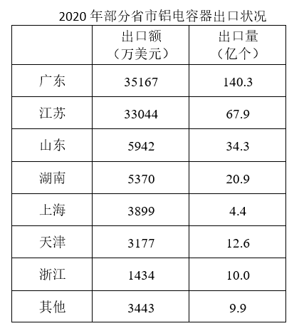

### 第 6 题　qid 4924293 · 增长

2018-2020年，全国铝电容器出口额约比2015-2017年增长了：

- **A**. 7%
- **B**. 10%
- **C**. 13%　✅
- **D**. 16%

**答案**：C

**官方解析**

根据题干“······约比······增长了”，结合选项为百分数，可判定本题为一般增长率问题。定位柱状图可知2014-2020年全国铝电容器出口额。则2015-2017年全国铝电容器出口额为7.77+7.19+8.22=23.18亿美元，2018-2020年全国铝电容器出口额为8.92+8.14+9.15=26.21亿美元。根据公式：增长率，则2018-2020年，全国铝电容器出口额比2015-2017年增长了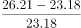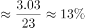。

故正确答案为C。

---

### 第 7 题　qid 4924299 · 增长

2015-2020年六年间，全国铝电容器出口额同比增幅超过10%的年份比同比降幅超过10%的年份：

- **A**. 多1个　✅
- **B**. 多2个
- **C**. 少1个
- **D**. 少2个

**答案**：A

**官方解析**

根据题干“······同比增幅超过10%······同比降幅超过10%······”，可判定本题为一般增长率问题。定位柱形图可知2014-2020年全国铝电容器出口额。根据公式：增长率，则2015-2020年六年间，全国铝电容器出口额的同比增长率分别为：

2015年，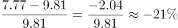；

2016年，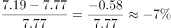；

2017年，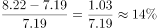；

2018年，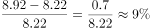；

2019年，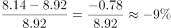；

2020年，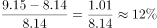。

综上可知，2015-2020年六年间，全国铝电容器出口额同比增幅超过10%的年份有2017年、2020年，共2个；同比降幅超过10%的年份只有2015年1个。则同比增幅超过10%的年份（2个）比同比降幅超过10%的年份（1个）多1个。

故正确答案为A。

---

### 第 8 题　qid 4924301 · 综合

2020年，广东和江苏铝电容器出口额约占全国同类产品出口总额的：

- **A**. 60%
- **B**. 65%
- **C**. 70%
- **D**. 75%　✅

**答案**：D

**官方解析**

根据题干“2020年······占······”，可判定本题为现期比重问题。定位柱形图可得：2020年，全国铝电容器出口额为9.15亿美元；定位表格可得：2020年，广东和江苏铝电容器出口额分别为35167万美元、33044万美元。根据公式：比重，则所求比重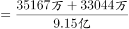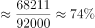，与D项最接近。

故正确答案为D。

---

### 第 9 题　qid 4924302 · 综合

把江苏、浙江、上海三省市按2020年铝电容器出口单价从高到低排列正确的是：

- **A**. 上海，江苏，浙江　✅
- **B**. 江苏，浙江，上海
- **C**. 上海，浙江，江苏
- **D**. 浙江，江苏，上海

**答案**：A

**官方解析**

根据题干“······2020年······出口单价······”，可判定本题为现期平均数问题。定位表格可得：2020年，江苏铝电容器出口额为33044万美元，出口量为67.9亿个；浙江铝电容器出口额为1434万美元，出口量为10.0亿个；上海铝电容器出口额为3899万美元，出口量为4.4亿个。根据公式：出口单价=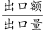，则这三个省市出口单价分别为：江苏，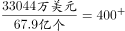美元/万个；浙江，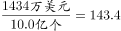美元/万个；上海，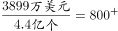美元/万个。比较可知，三个省市出口单价从高到低排序应为：上海，江苏，浙江。

故正确答案为A。

---

### 第 10 题　qid 4924304 · 综合

关于全国铝电容器出口状况，能够从上述资料中推出的是：

- **A**. 2014-2020年，出口总额超过60亿美元
- **B**. 2016-2020年期间出口额最高的年份是2020年　✅
- **C**. 2020年，广东省出口量占全国出口总量的一半以上
- **D**. 2020年，全国有5个省市出口额超过全国出口总额的5%

**答案**：B

**官方解析**

A项：定位柱形图可知2014-2020年各年全国铝电容器出口额。则2014-2020年全国铝电容器出口总额=9.81+7.77+7.19+8.22+8.92+8.14+9.15=59.2亿美元＜60亿美元，错误；

B项：定位柱形图可知2016-2020年各年全国铝电容器出口额。观察可知，出口额最高的年份是2020年（9.15亿美元），正确；

C项：定位表格可知2020年广东省及部分省市铝电容器的出口量，则广东省出口量占全国总出口量的比重为：，错误。

D项：定位柱形图和表格可知，全国出口总额的5%为：9.15亿美元×5%=4575万美元，材料中已给出的省市高于4575万美元的有广东、江苏、山东、湖南共4个；材料中“其他”省市之和为3443万美元，故不会再有超过4575万美元的省市。错误。

故正确答案为B。

---
