# 2022年青海省公务员录用考试《行测》题（网友回忆版）

> 资料分析 · 10 题 · 青海 2022

## 材料 1

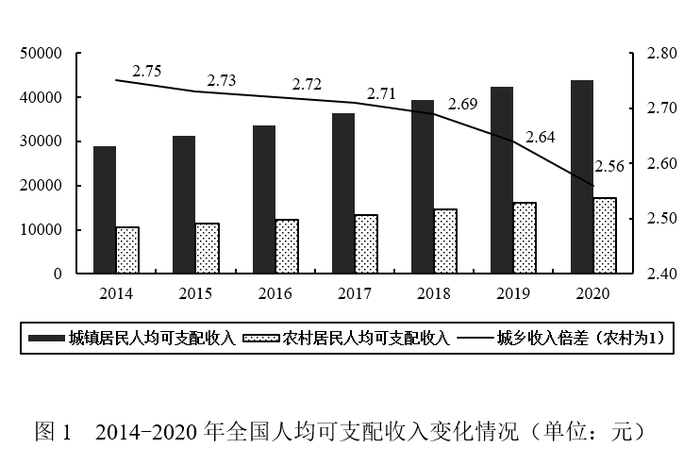

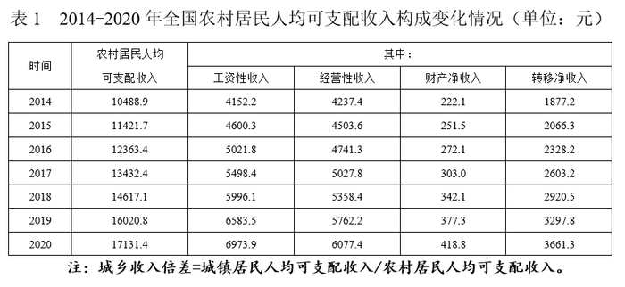

### 第 1 题　qid 4817973 · 平均数

2020年全国城乡居民人均可支配收入差额约为：

- **A**. 19251元
- **B**. 26725元　✅
- **C**. 39273元
- **D**. 43856元

**答案**：B

**官方解析**

定位统计图可知：2020年全国城乡收入倍差为2.56；定位统计表可知：2020年全国农村居民人均可支配收入为17131.4元，根据：城乡收入倍差=城镇居民人均可支配收入÷农村居民人均可支配收入，则2020年全国城镇居民人均可支配收入=2020年城乡收入倍差×2020年农村居民人均可支配收入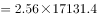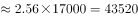元，则2020年全国城乡居民人均可支配收入差额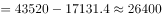元，与B项最接近。

故正确答案为B。

---

### 第 2 题　qid 2578842 · 增长

2020年全国城镇居民人均可支配收入增长率为：

- **A**. 3.69%　✅
- **B**. 6.93%
- **C**. 8.62%
- **D**. 10.74%

**答案**：A

**官方解析**

根据题干“2020年······增长率为”，可判定本题为一般增长率问题。定位表1可得：2019年和2020年全国农村居民人均可支配收入分别为16020.8元、17131.4元；定位图1可得：2019年和2020年城乡收入倍差分别为2.64、2.56。

方法一：根据公式：城乡收入倍差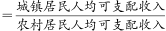，则2019年和2020年全国城镇居民人均可支配收入分别为（16020.8×2.64）元、（17131.4×2.56）元。根据公式：增长率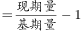，则2020年全国城镇居民人均可支配收入增长率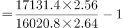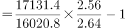，结合选项只有A项满足。 

方法二：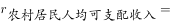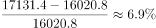，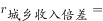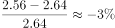。根据公式：城镇居民人均可支配收入=农村居民人均可支配收入×城乡收入倍差，增长率关系为：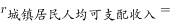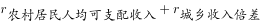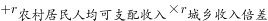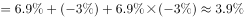，结合选项只有A项满足。

故正确答案为A。

---

### 第 3 题　qid 2578841 · 平均数

2017-2020年全国农村人均可支配收入增长最慢的年份是：

- **A**. 2017
- **B**. 2018
- **C**. 2019
- **D**. 2020　✅

**答案**：D

**官方解析**

根据题干“2017-2020年······增长最慢的年份是”，可判定本题为一般增长率比较问题。定位表1可得：2016-2020年全国农村居民人均可支配收入分别为12363.4元、13432.4元、14617.1元、16020.8元、17131.4元。根据公式：增长率，可得2017-2020年全国农村人均可支配收入同比增速分别为：

2017年：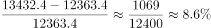；

2018年：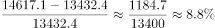；

2019年：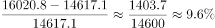；

2020年：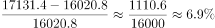。

则2017-2020年全国农村人均可支配收入增长最慢的年份是2020年。

故正确答案为D。

---

### 第 4 题　qid 2578840 · 综合

与2019年相比，2020年城镇居民与农村居民的可支配收入差额：

- **A**. 上升了450.9元　✅
- **B**. 下降了450.9元
- **C**. 上升了610.1元
- **D**. 下降了610.1元

**答案**：A

**官方解析**

根据题干“与2019年相比，2020年······”，结合选项为上升/下降+具体单位，可判定本题为增长量计算问题。定位统计图可得：2019年全国城乡收入倍差为2.64；定位统计表可得：2019年全国农村居民人均可支配收入为16020.8元。根据：城乡收入倍差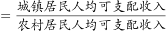，可得：城镇居民人均可支配收入=城乡收入倍差×农村居民人均可支配收入，则2019年城乡居民人均可支配收入差额=2.64×16020.8-16020.8=（2.64-1）×16020.8≈1.64×16000=26240元。根据本篇第1题可得：2020年城乡居民人均可支配收入差额为26725元。则与2019年相比，2020年城乡居民人均可支配收入差额上升了26725-26240=485元，与A项最接近。

故正确答案为A。

备注：本题题干“可支配收入”默认为“人均可支配收入”，否则无法计算。

---

### 第 5 题　qid 2578839 · 综合

根据以上材料可以推出的是：

- **A**. 2020年全国居民人均可支配收入约为30493.9元
- **B**. 2015-2020年农村居民人均可支配收入增速持续上升
- **C**. 2014-2020年工资性收入占农村居民可支配收入的比重始终最高
- **D**. 2014年农民经营性收入小于同时期城镇居民可支配收入的20%　✅

**答案**：D

**官方解析**

A项：定位统计图及统计表，可得2020年农村居民及城镇居民人均可支配收入，并未给出农村和城镇居民人数，故无法推出全国居民人均可支配收入，错误； 

B项：定位统计表，可得2014-2020年农村居民人均可支配收入分别为10488.9元、11421.7元、12363.4元、13432.4元、14617.1元、16020.8元、17131.4元。根据公式：增长率，则2015-2020年农村居民人均可支配收入增速分别为：2015年，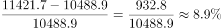；2016年，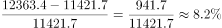。可得2016年增速＜2015年增速，非持续上升，错误；

C项：定位统计表，可得2014-2020年农村居民人均可支配收入及工资性收入的数据。根据比重公式可知，因每年整体量不变，故直接比较每年部分量大小即可。由2014年工资性收入（4152.2元）＜2014年经营性收入（4237.4元），可得2014年工资性收入占农村居民人均可支配收入的比重不是最高，错误；

D项：定位统计表，可得2014年农村居民人均可支配收入为10488.9元；农民经营性收入为4237.4元。定位统计图，2014年城乡收入倍差为2.75。根据城乡收入倍差，可知2014年城镇居民人均可支配收入为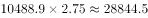元，故2014年农民经营性收入（4237.4元）＜28844.5×20%=5768.9元，正确。

故正确答案为D。

---

## 材料 2

        2020年全国人口共141178万人，比2010年增长了约5.38%。从地区分布上看，2020年东部地区人口占39.93%，中部地区占25.83%，西部地区占27.12%，东北地区占6.98%。与2010年相比，东部地区人口所占比重上升2.15个百分点，中部地区下降0.79个百分点，西部地区上升0.22个百分点，东北地区下降1.20个百分点。

        从性别构成上看，2020年男性人口为72334万人，女性人口为68844万人。从年龄构成上看，2020年0-14岁人口为25338万人，15-59岁人口为89438万人，60岁及以上人口为26402万人（其中，65岁及以上人口为19064万人）。从城乡分布上看，2020年居住在城镇的人口为90199万人，居住在乡村的人口为50979万人，与2010年相比，城镇人口增加23642万人，乡村人口减少16436万人。从民族构成上看，2020年汉族人口为128631万人，各少数民族人口为12547万人，与2010年相比，汉族人口增长4.93%，各少数民族人口增长10.26%，少数民族人口比重上升0.40个百分点。

### 第 6 题　qid 4818011 · 增长

2020年全国人口比2010年全国人口增加的数量位于以下哪个区间：

- **A**. 5000万人-6000万人
- **B**. 6000万人-7000万人
- **C**. 7000万人-8000万人　✅
- **D**. 8000万人-9000万人

**答案**：C

**官方解析**

根据题干“2020年······比2010年······增加的数量······”，可判定本题为增长量计算问题。

方法一：定位文字材料第一段可得：2020年全国人口共141178万人，比2010年增长了约5.38%。根据公式：增长量，则2020年全国人口比2010年全国人口增加的数量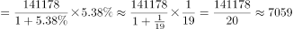万人，在7000万人-8000万人区间。

方法二：定位文字第二段可知：（2020年）与2010年相比，城镇人口增加23642万人，乡村人口减少16436万人。因为全国人口数=城镇人口数+乡村人口数，则2020年全国人口比2010年全国人口增加的数量=城镇人口增加数量-乡村人口减少数量=23642-16436=7206万人，在7000万人-8000万人区间。

故正确答案为C。

---

### 第 7 题　qid 4818013 · 综合

2020年，中部地区人口比西部地区人口少：

- **A**. 约1721万人
- **B**. 约1821万人　✅
- **C**. 约1921万人
- **D**. 约2021万人

**答案**：B

**官方解析**

根据题干“2020年，中部地区人口比西部地区人口少”，结合材料中给出2020年中部地区和西部地区的人口占比，可判定本题为现期比重问题。定位材料第一段可得：2020年全国人口共141178万人······中部地区占25.83%，西部地区占27.12%。根据公式：部分量=整体量×比重，则2020年中部地区人口比西部地区人口少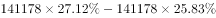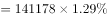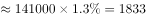万人，与B项最接近。

故正确答案为B。

---

### 第 8 题　qid 4818014 · 综合

2010年，东部地区人口是东北地区人口的：

- **A**. 约4.6倍　✅
- **B**. 约5.7倍
- **C**. 约6.5倍
- **D**. 约7.3倍

**答案**：A

**官方解析**

根据题干“2010年······是······的”，选项是约多少倍，且材料时间为2020年，可判定本题为基期倍数问题。定位文字材料第一段可得：2020年东部地区人口占39.93%，东北地区占6.98%；与2010年相比，东部地区人口所占比重上升2.15个百分点，东北地区下降1.20个百分点。则2010年，东部地区人口占总人口的比重为39.93%-2.15%=37.78%，东北地区人口占总人口的比重为6.98%+1.2%=8.18%，题目所求倍数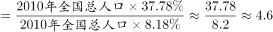。

故正确答案为A。

---

### 第 9 题　qid 4818016 · 比重

2020年，65岁及以上人口占比与60-64岁人口占比相差：

- **A**. 约6.3%
- **B**. 约7.3%
- **C**. 约8.3%　✅
- **D**. 约9.3%

**答案**：C

**官方解析**

根据题干“2020年······占比与······占比相差”，结合材料时间为2020年，可判定本题为现期比重问题。定位文字材料第一段可得：2020年全国人口共141178万人。定位文字材料第二段可得：2020年60岁及以上人口为26402万人，其中，65岁及以上人口为19064万人。则2020年60-64岁人口为26402-19064=7338万人，根据公式：比重，则所求比重差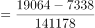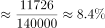，与C项最接近。

故正确答案为C。

---

### 第 10 题　qid 4818017 · 综合

能够从上述资料推出的是：

- **A**. 2010年，全国人口超过13.5亿人
- **B**. 2010年，我国西部地区各少数民族人口不超过5000万人
- **C**. 2020年，我国80%以上人口都在60岁以下（不含60岁）　✅
- **D**. 2020年，男性人口占比超过女性人口占比3个百分点以上

**答案**：C

**官方解析**

A项：方法一：定位文字材料第一段可得：2020年全国人口共141178万人，比2010年增长了约5.38%。根据公式：基期量，可得2010年全国人口为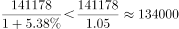万人=13.4亿人&lt;13.5亿人，错误；

方法二：定位文字材料第一段可得：2020年全国人口共141178万人；定位文字材料第二段可得：从城乡分布上看······与2010年相比，城镇人口增加23642万人，乡村人口减少16436万人。根据公式：基期量=现期量-增长量，可得2010年全国人口=141178-（23642-16436）=141178-7206=133972万人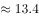亿人&lt;13.5亿人，错误；

B项：文字材料第二段只给出了2020年全国各少数民族人口的数据，未给出西部地区各少数民族人口的相关数据，因此该项无法推出，错误；

C项：定位文字材料第一段可得：2020年全国人口共141178万人；定位文字材料第二段可得：2020年60岁及以上人口为26402万人。则2020年60岁以下（不含60岁）人口为141178-26402=114776万人，占全国人口的比重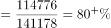，正确；

D项：定位文字材料第一段可得：2020年全国人口共141178万人；定位文字材料第二段可得：2020年男性人口为72334万人，女性人口为68844万人。则2020年，男性人口占比比女性人口多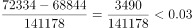，即男性人口占比超过女性人口占比不足3个百分点，错误。

故正确答案为C。

---
