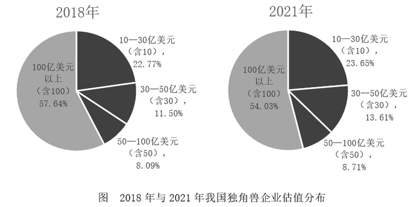
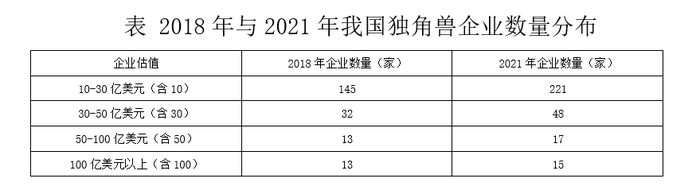
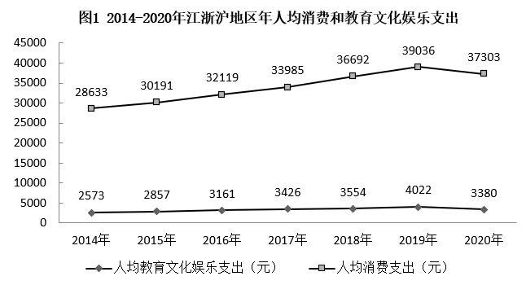
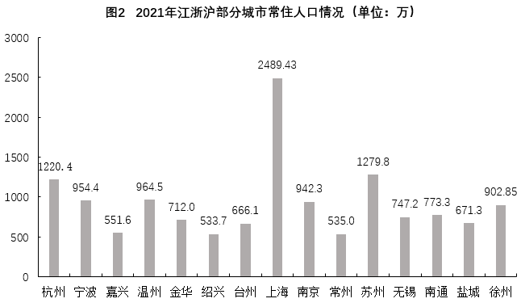
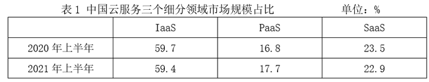
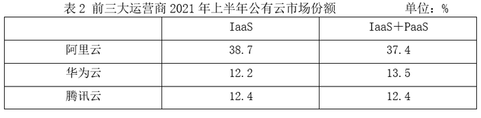

# 2023年上海市公务员录用考试《行测》题（A类）（网友回忆版）

> 资料分析 · 4 题 · 上海 2023

## 材料 1

        独角兽公司是投资界术语，一般指成立不超过10年，估值超过10亿美元，少部分估值超过100亿美元的企业，其不仅是优质和市场潜力无限的绩优股，而且商业模式很难被复制。

### 第 1 题　qid 5423841 · 比重

行业集中度，是指某行业的相关市场内前N家最大的企业（头部企业）所占市场份额（产值、产量、销售额、销售量、职工人数、资产总额等）的总和，是对整个行业的市场结构集中程度的测量指标，用来衡量企业的数目和相对规模的差异，是市场势力的重要量化指标。如果将独角兽企业视为一个行业，而头部企业均选取13家，与2018年相比，2021年的行业集中度        。

- **A**. 提高
- **B**. 不变
- **C**. 降低
- **D**. 条件不足，无法判断　✅

**答案**：D

**官方解析**

根据题干“与2018年相比，2021年的行业集中度······”，结合题干中对于行业集中度的诠释（头部企业占市场份额的总和），可判定本题为两期比重问题。材料并未给出市场份额相关数据，故无法比较2021年行业集中度相比于2018年的变化，即条件不足，无法判断。
故正确答案为D。

---

## 材料 2

### 第 2 题　qid 5423821 · 平均数

根据2020年江浙沪地区年人均支出情况，可估算2021年江苏省南通市的消费市场规模和教育文化娱乐市场规模分别约为        亿元和        亿元。

- **A**. 2787，253
- **B**. 2885，261　✅
- **C**. 2656，241
- **D**. 2324，251

**答案**：B

**官方解析**

根据题干“根据2020年······人均支出情况，可估算2021年······消费市场规模和教育文化娱乐市场规模······约为······亿元”，结合材料给出2020年江浙沪地区年人均消费和教育文化娱乐支出情况以及2021年南通市常住人口情况，可判定本题为现期平均数问题。定位图1可得：2020年江浙沪地区年人均消费支出为37303元，年人均教育文化娱乐支出为3380元；定位图2可得：2021年南通市常住人口为773.3万人。根据2020年江浙沪地区年人均支出情况，可估算2021年江苏省南通市的消费市场规模=年人均消费支出×常住人口数=37303×773.3万＞3.7万×770万=2849亿元，只有B项符合。
故正确答案为B。

---

### 第 3 题　qid 5423840 · 增长

与2015年相比，2020年江浙沪地区年人均教育文化娱乐支出增量        年人均消费支出增量，年人均教育文化娱乐支出增长率        年人均消费支出增长率。

- **A**. 高于，高于
- **B**. 高于，低于
- **C**. 低于，高于
- **D**. 低于，低于　✅

**答案**：D

**官方解析**

根据题干“与2015年相比，2020年······增量······，······增长率······”，结合选项为高于/低于，可判定本题为增长量比较问题和一般增长率问题。定位图1可得：2015年、2020年江浙沪地区年人均教育文化娱乐支出分别为2857元、3380元，2015年、2020年江浙沪地区年人均消费支出分别为30191元、37303元。根据公式：增长量=现期量-基期量，可得与2015年相比，2020年江浙沪地区年人均教育文化娱乐支出增量=3380-2857=523元，年人均消费支出增量=37303-30191=7112元，前者低于后者，排除A、B两项；根据公式：增长率，可得与2015年相比，2020年江浙沪地区年人均教育文化娱乐支出增长率，年人均消费支出增长率，前者低于后者，D项当选。

故正确答案为D。

---

## 材料 3

        2022年2月，“东数西算”工程正式全面启动。云计算在“东数西算”产业链中游占据重要位置。2020年上半年和2021年上半年，中国整体云服务市场规模分别为1171亿元和1620亿元，其三个细分领域市场IaaS（基础设施即服务）、PaaS（平台即服务）和SaaS（软件即服务）的规模如下表1。

        在中国整体云服务市场中，2020年上半年和2021年上半年，公有云市场规模分别为830亿元和1235亿元。在公有云市场份额方面，阿里云、华为云、腾讯云位列2021年上半年中国IaaS公有云市场和中国IaaS+PaaS公有云市场前三名，具体占比如下表2。

### 第 4 题　qid 5423866 · 增长

2021年上半年同比增长率最大的是                    市场。

- **A**. IaaS
- **B**. PaaS　✅
- **C**. SaaS
- **D**. 资料不足，无法判断

**答案**：B

**官方解析**

根据题干“2021年上半年同比增长率最大······”，结合材料给出2020年上半年和2021年上半年各个领域市场规模占比，可判定本题为两期比重问题。定位表1可得，2020年上半年和2021年上半年IaaS的市场规模占比分别为59.7%、59.4%，PaaS的市场规模占比分别为16.8%、17.7%，SaaS的市场规模占比分别为23.5%、22.9%。根据两期比重逆运用结论：比重上升，则部分增长率＞整体增长率；比重下降，则部分增长率＜整体增长率。观察发现，IaaS、SaaS的比重下降，则两者同比增长率均小于中国整体云服务市场规模的同比增长率；PaaS的比重上升，则其同比增长率大于中国整体云服务市场规模的同比增长率。综上，PaaS的同比增长率最大。
故正确答案为B。

---
