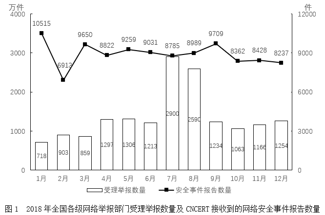
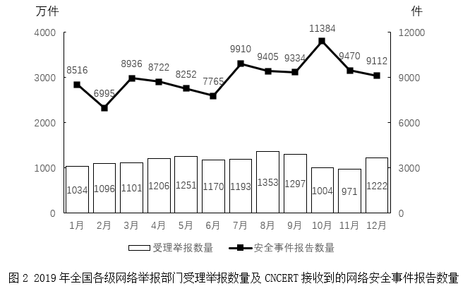

# 2023年北京市公务员录用考试《行测》题（网友回忆版）

> 资料分析 · 2 题 · 北京 2023

## 材料 1

        2019年全国各级网络举报部门共受理举报13899万件，较2018年下降15.8%。CNCERT接收到网络安全事件报告107801件，较2018年增长1.0%。

### 第 1 题　qid 5483992 · 增长

2019年第四季度，全国各级网络举报部门受理举报数量比上年同期：

- **A**. 少不到500万件　✅
- **B**. 少500万件以上
- **C**. 多不到500万件
- **D**. 多500万件以上

**答案**：A

**官方解析**

根据题干“2019年第四季度······比上年同期”，结合选项为“多/少＋具体单位”，可判定本题为增长量计算问题。定位图1可得：2018年10月、11月、12月，全国各级网络举报部门受理举报数量分别为1063万件、1166万件、1254万件；定位图2可得：2019年10月、11月、12月，全国各级网络举报部门受理举报数量分别为1004万件、971万件、1222万件。根据公式：增长量＝现期量-基期量，可得（1004＋971＋1222）-（1063＋1166＋1254）＝3197-3483＝-286万件，则2019年第四季度，全国各级网络举报部门受理举报数量比上年同期少286万件，在A项范围内。
故正确答案为A。

---

### 第 2 题　qid 5483995 · 综合

2018年CNCERT接收到的网络安全事件报告数量最少的季度是：

- **A**. 第一季度
- **B**. 第二季度
- **C**. 第三季度
- **D**. 第四季度　✅

**答案**：D

**官方解析**

定位图1可知2018年各月CNCERT接收到的网络安全事件报告数量。2018年各季度报告数量分别为：

第一季度，件；

第二季度，件；

第三季度，件；

第四季度，件。

比较可知，2018年CNCERT接收到的网络安全事件报告数量最少的季度是第四季度。

故正确答案为D。

---
