# 2023年吉林省公务员录用考试《行测》题（网友回忆版）

> 资料分析 · 10 题 · 吉林 2023

## 材料 1

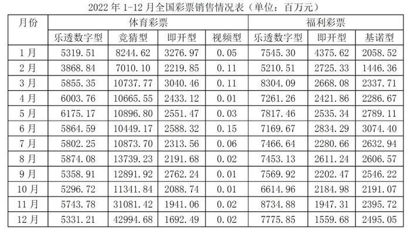

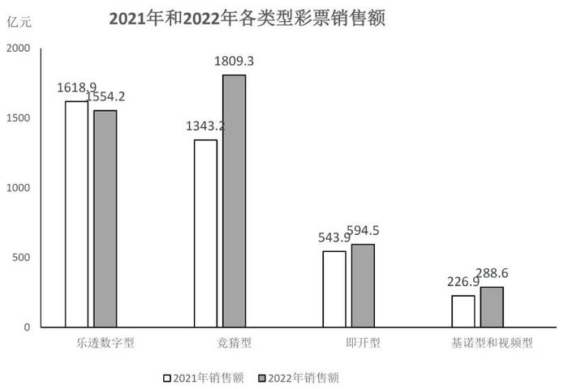

### 第 1 题　qid 5509647 · 综合

2022年，乐透数字型彩票月销售额最大的月份出现在（    ）。

- **A**. 第一季度
- **B**. 第二季度
- **C**. 第三季度
- **D**. 第四季度　✅

**答案**：D

**官方解析**

定位表格材料可得：乐透数字型彩票销售额分为体彩和福彩两类。故本题需要比较其体彩+福彩销售额最大的月份是哪个。根据表格，二月明显小，排除。体彩类的其他月份乐透数字型销售额保留到百位分别在5300-6200之间，最大差距为900；而福彩类乐透数字型销售额保留到百位在6600-8700之间。为简化运算，福彩类只需考虑7800-8700之间月份即可（7800以下无论多大，加体彩类都不能比8700所对应月份的总销售额大），故只需要粗略比较3月，5月，11月，12月。其中：3月约为5900+8300=14200；5月约为6200+7800=14000；11月约为5700+8700=14400，明显大于前两者，而11月、12月均属于第四季度，无需比较。
故正确答案为D。

---

### 第 2 题　qid 5509648 · 增长

2022年，竞猜型彩票销售额同比增长（    ）。

- **A**. -34.7%
- **B**. -25.7%
- **C**. 25.7%
- **D**. 34.7%　✅

**答案**：D

**官方解析**

根据题干“······同比增长”，结合选项是百分数，可判定本题为一般增长率问题。定位柱状图可得：2022年竞猜型彩票销售额为1809.3亿元，2021年竞猜型彩票销售额为1343.2亿元。故2022年竞猜型彩票销售额的同比增长率，只有D项符合。

故正确答案为D。

---

### 第 3 题　qid 5509650 · 比重

下面饼图反映了2022年某月乐透数字型、竞猜型、即开型、基诺型和视频型彩票销售额的比重关系，此饼图对应的月份为（    ）。

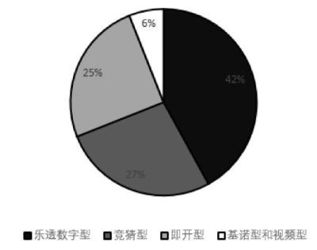

- **A**. 1月　✅
- **B**. 8月
- **C**. 11月
- **D**. 12月

**答案**：A

**官方解析**

根据题干“下面饼图反映了2022年某月······比重关系······”，可判定本题为现期比重问题。定位表格材料可知1月、8月、11月、12月各类型彩票的销售数据。根据公式：比重，

则2022年1月基诺型和视频型彩票销售额的比重为；

8月基诺型和视频型彩票销售额的比重为；

11月基诺型和视频型彩票销售额的比重为；

12月基诺型和视频型彩票销售额的比重为。观察计算结果可知，1月基诺型和视频型彩票销售额的比重（6.7%）最接近题干所给比重（6%）。

故正确答案为A。

---

### 第 4 题　qid 5509651 · 增长

下列折线图中，能准确反映2022年第四季度竞猜型彩票月销售额的环比增长率变化趋势的是（    ）。

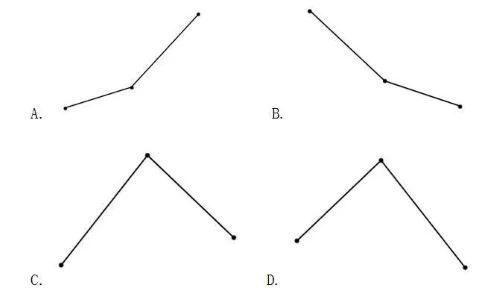

- **A**. A
- **B**. B
- **C**. C　✅
- **D**. D

**答案**：C

**官方解析**

根据题干“······2022年第四季度······环比增长率变化趋势······”，可判定本题为一般增长率问题。定位表格可得：2022年竞猜型彩票9-12月销售额分别为12891.92百万元、11341.84百万元、31081.42百万元、42994.68百万元。根据公式：增长率，则2022年第四季度竞猜型彩票月销售额的环比增长率分别为：10月，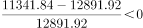；11月，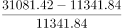；12月，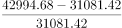。只有C项符合。

故正确答案为C。

---

### 第 5 题　qid 5509652 · 综合

下列不能从上述资料中推出的是（    ）。

- **A**. 2022年下半年，每月的体育彩票销售额均大于福利彩票销售额
- **B**. 2022年，基诺型和视频型彩票销售额占彩票销售额的比重较上一年低　✅
- **C**. 2022年，竞猜型彩票的月销售额高于年内月平均销售额的月份只有2个
- **D**. 2022年，全国彩票销售总额同比增加500亿元以上

**答案**：B

**官方解析**

A项：定位表格可知：2022年7月-12月每月体育彩票中乐透数字型、竞猜型、即开型、视频型彩票的销售额，福利彩票中乐透数字型、即开型、基诺型彩票销售额。可得：

7月：体育彩票销售额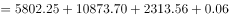百万元，福利彩票销售额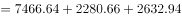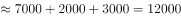百万元，体育彩票销售额&gt;福利彩票销售额；

8月：体育彩票销售额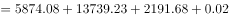百万元，福利彩票销售额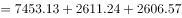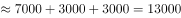百万元，体育彩票销售额&gt;福利彩票销售额；

9月：体育彩票销售额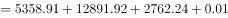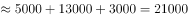百万元，福利彩票销售额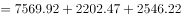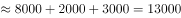百万元，体育彩票销售额&gt;福利彩票销售额；

10月：体育彩票销售额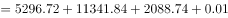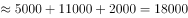百万元，福利彩票销售额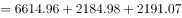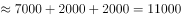百万元，体育彩票销售额&gt;福利彩票销售额；

11月：体育彩票销售额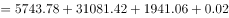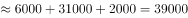百万元，福利彩票销售额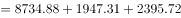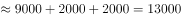百万元，体育彩票销售额&gt;福利彩票销售额；

12月：体育彩票销售额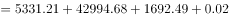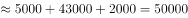百万元，福利彩票销售额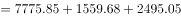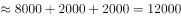百万元，体育彩票销售额&gt;福利彩票销售额。所以2022年下半年，每月的体育彩票销售额均大于福利彩票销售额，正确；

B项：定位统计图可知：2021年、2022年乐透数字型、竞猜型、即开型、基诺型和视频型各类型彩票销售额。根据公式：比重，可得2021年基诺型和视频型彩票销售额占彩票销售额的比重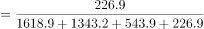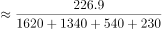，2022年基诺型和视频型彩票销售额占彩票销售额的比重，6.8%&gt;6.1%，即比重较上一年有所上升，错误；

C项：定位统计图可知：2022年竞猜型彩票销售额为1809.3亿元。所以2022年内竞猜型彩票月平均销售额亿元=15100百万元。定位表格可知：2022年1-12月各月竞猜型彩票销售额，其中月销售额高于年内月平均销售额的月份只有11月（31081.42百万元）、12月（42994.68百万元），共2个，正确；

D项：定位统计图可知：2021年、2022年乐透数字型、竞猜型、即开型、基诺型和视频型各类型彩票销售额。所以2021年全国彩票销售总额=1618.9+1343.2+543.9+226.9=3732.9亿元，2022年全国彩票销售总额=1554.2+1809.3+594.5+288.6=4246.6亿元，题干所求=4246.6-3732.9=513.7亿元&gt;500亿元，正确。

本题为选非题，故正确答案为B。

---

## 材料 2

        2022年，规模以上工业企业实现营业收入137.91万亿元，同比增长5.9％；发生营业成本116.84万亿元，同比增长7.1％；营业收入利润率为6.09％，同比下降0.64个百分点。

        2022年，规模以上工业企业中，分行业看：采矿业实现利润总额15573.6亿元，同比增长48.6％；制造业实现利润总额64150.2亿元，同比下降13.4％；电力、热力、燃气及水生产和供应业实现利润总额4314.7亿元，同比增长41.8％。

        2022年，在41个工业大类行业中，利润总额由高到低的前十个行业的利润情况如下：煤炭开采和洗选业实现利润总额10202亿元，同比增长44.3％；计算机、通信和其他电子设备制造业实现利润总额7389.5亿元，同比下降13.1％；化学原料和化学制品制造业实现利润总额7302.6亿元，同比下降8.7％；电气机械和器材制造业实现利润总额5915.6亿元，同比增长31.2％；汽车制造业实现利润总额5319.6亿元，同比增长0.6％；非金属矿物制品业实现利润总额4759亿元，同比下降15.5％；医药制造业实现利润总额4288.7亿元，同比下降31.8％；石油和天然气开采业实现利润总额3545亿元，同比增长109.8％；通用设备制造业实现利润总额3250.3亿元，同比增长0.4％；电力、热力生产和供应业实现利润总额3154亿元，同比增长86.3％。

### 第 6 题　qid 5509635 · 综合

2022年，规模以上工业企业利润总额约为（    ）。

- **A**. 8.0万亿元
- **B**. 8.4万亿元　✅
- **C**. 9.3万亿元
- **D**. 12.2万亿元

**答案**：B

**官方解析**

根据题干“2022年······利润总额约为”，结合文字材料第一段可知规模以上工业企业实现营业收入和营业收入利润率，可判定本题为现期比重问题。定位文字材料第一段可得：2022年，规模以上工业企业实现营业收入137.91万亿元······营业收入利润率为6.09％。根据公式：利润率，则2022年规模以上工业企业利润总额为万亿元。

故正确答案为B。

---

### 第 7 题　qid 5509636 · 增长

2022年，规模以上工业企业利润总额由高到低的前十个行业中，同比增长率最高的行业是（    ）。

- **A**. 煤炭开采和洗选业
- **B**. 石油和天然气开采业　✅
- **C**. 医药制造业
- **D**. 电力、热力生产和供应业

**答案**：B

**官方解析**

定位文字材料第三段可知，2022年规模以上工业企业利润总额由高到低的前十个行业中，煤炭开采和洗选业同比增长44.3％，石油和天然气开采业同比增长109.8％，医药制造业同比下降31.8％，电力、热力生产和供应业同比增长86.3％，故同比增长率最高的行业是石油和天然气开采业。
故正确答案为B。

---

### 第 8 题　qid 5509637 · 综合

2021年，石油和天然气开采业利润总额占采矿业利润总额的（    ）。

- **A**. 不足10%
- **B**. 10%-20%之间　✅
- **C**. 20%-30%之间
- **D**. 30%以上

**答案**：B

**官方解析**

根据题干“2021年······占······的”，结合材料时间为2022年，可判定本题为基期比重问题。定位文字材料第二段可得：2022年，采矿业实现利润总额15573.6亿元，同比增长48.6％。定位文字材料第三段可得：2022年，石油和天然气开采业实现利润总额3545亿元，同比增长109.8％。根据公式：基期比重，可得：2021年，石油和天然气开采业利润总额占采矿业利润总额的比重，在10%-20%之间。

故正确答案为B。

---

### 第 9 题　qid 5509638 · 综合

下面柱状图中，甲、乙、丙依次代表（    ）。

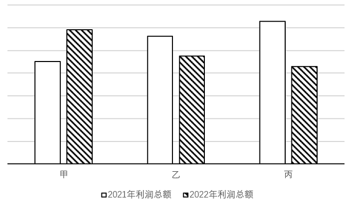

- **A**. 电气机械和器材制造业、非金属矿物制品业、医药制造业　✅
- **B**. 化学原料和化学制品制造业、电气机械和器材制造业、汽车制造业
- **C**. 汽车制造业、电气机械和器材制造业、化学原料和化学制品制造业
- **D**. 医药制造业、非金属矿物制品业、电气机械和器材制造业

**答案**：A

**官方解析**

根据题干“下面柱状图中，甲、乙、丙依次代表”，且柱状图中出现2021年，结合材料时间为2022年，可判定本题为基期计算问题。定位文字材料第三段可得：2022年，选项中各行业利润总额及同比增长率。结合选项依次验证：

A项：2022年，电气机械和器材制造业实现利润总额5915.6亿元，同比增长31.2％；非金属矿物制品业实现利润总额4759亿元，同比下降15.5％；医药制造业实现利润总额4288.7亿元，同比下降31.8％。2022年利润总额依次降低，符合柱状图（斜纹）。根据公式：基期量，则2021年，电气机械和器材制造业实现利润总额亿元；非金属矿物制品业实现利润总额亿元；医药制造业实现利润总额亿元。2021年利润总额依次增加，符合柱状图（白色），当选；

B项：2022年，化学原料和化学制品制造业实现利润总额7302.6亿元，同比下降8.7％；电气机械和器材制造业实现利润总额5915.6亿元，同比增长31.2％；汽车制造业实现利润总额5319.6亿元，同比增长0.6％。根据公式：基期量，则2021年，化学原料和化学制品制造业实现利润总额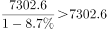亿元，不符合甲，排除；

C项：2022年，汽车制造业实现利润总额5319.6亿元；电气机械和器材制造业实现利润总额5915.6亿元；化学原料和化学制品制造业实现利润总额7302.6亿元。2022年利润总额依次增加，不符合柱状图（斜纹），排除；

D项：2022年，医药制造业实现利润总额4288.7亿元；非金属矿物制品业实现利润总额4759亿元；电气机械和器材制造业实现利润总额5915.6亿元。2022年利润总额依次增加，不符合柱状图（斜纹），排除。

故正确答案为A。

---

### 第 10 题　qid 5509639 · 综合

下列不能从上述资料中推出的是（    ）。

- **A**. 2022年，规模以上工业企业利润总额低于2021年
- **B**. 2021年，规模以上工业企业每百元营业收入中的成本低于70元　✅
- **C**. 2021年，电力、热力、燃气及水生产和供应业利润总额超过3000亿元
- **D**. 2022年，在41个工业大类行业中，利润总额由高到低的前十个行业中有6个行业呈正增长

**答案**：B

**官方解析**

A项：定位文字材料第一段可得：2022年，规模以上工业企业实现营业收入137.91万亿元，同比增长5.9％；营业收入利润率为6.09％，同比下降0.64个百分点。根据公式：利润=收入×利润率，则2022年规模以上工业企业利润总额为万亿元；同时根据公式：基期量，则2021年规模以上工业企业利润总额为万亿元。比较可知，2022年，规模以上工业企业利润总额低于2021年，正确；

B项：定位文字材料第一段可得：2022年，规模以上工业企业实现营业收入137.91万亿元（B），同比增长5.9％（b）；发生营业成本116.84万亿元（A），同比增长7.1％（a）。根据公式：基期平均数，则2021年，规模以上工业企业每百元营业收入中的成本为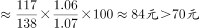，错误；

C项：定位文字材料第二段可得：2022年，规模以上工业企业中，电力、热力、燃气及水生产和供应业实现利润总额4314.7亿元，同比增长41.8％。根据公式：基期量，则2021年，电力、热力、燃气及水生产和供应业利润总额为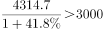亿元，正确；

D项：定位文字材料第三段可知，2022年，在41个工业大类行业中，利润总额由高到低的前十个行业中，增长率为正的行业有：煤炭开采和洗选业（44.3%）、电气机械和器材制造业（31.2%）、汽车制造业（0.6%）、石油和天然气开采业（109.8%）、通用设备制造业（0.4%）、电力、热力生产和供应业（86.3%），共6个行业，正确。

本题为选非题，故正确答案为B。

---
