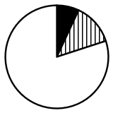
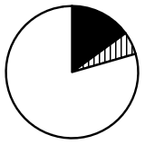
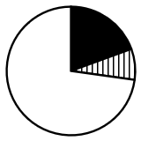
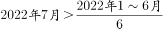
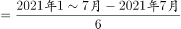

# 2023年四川省公务员录用考试《行测》试题（网友回忆版）

> 资料分析 · 15 题 · 四川 2023

## 材料 1

        2020年，全国软件和信息技术服务业累计完成业务收入81658亿元，同比增长13.3%。实现利润总额10676亿元，同比增长7.8%；人均实现业务收入115.8万元，同比增长8.6%。

        分领域看，2020年，软件产品实现收入22758亿元，同比增长10.1%；其中，工业软件产品实现收入1974亿元，增长11.2%。信息技术服务实现收入49868亿元，比上年同期增加6579亿元；其中，电子商务平台技术服务收入9095亿元，同比增长10.5%；云服务、大数据服务共实现收入4116亿元，同比增长11.1%。信息安全产品和服务实现收入1540亿元，同比增长10.0%，增速较上年回落2.4个百分点。嵌入式系统软件实现收入7492亿元，比上年同期增加803亿元，增速较上年提高4.2个百分点。

### 第 1 题　qid 5509780 · 增长

2020年，我国软件和信息技术服务业营业利润率（利润总额/业务收入）比上年：

- **A**. 上升了2个百分点以上
- **B**. 下降了2个百分点以上
- **C**. 上升了不到2个百分点
- **D**. 下降了不到2个百分点　✅

**答案**：D

**官方解析**

根据题干“2020年，······营业利润率（利润总额/业务收入）比上年”，结合选项为上升/下降+百分点，可判定本题为两期比重问题。定位文字材料第一段可得：2020年，全国软件和信息技术服务业累计完成业务收入81658亿元（B），同比增长13.3%（b）。实现利润总额10676亿元（A），同比增长7.8%（a）。根据两期比重结论可得，当a&lt;b时，比重下降，排除A、C两项。根据两期比重公式：，则所求为，即下降了不到2个百分点。

故正确答案为D。

---

### 第 2 题　qid 5509781 · 增长

2014~2020年，我国软件和信息技术服务业完成业务收入同比增速超过15%的年份有几个？

- **A**. 2
- **B**. 3　✅
- **C**. 4
- **D**. 5

**答案**：B

**官方解析**

根据题干“2014~2020年······同比增速······”，可判定本题为一般增长率问题。定位统计图可知2013~2020年我国软件和信息技术服务业完成业务收入额。根据公式：一般增长率，则2014~2020年我国软件和信息技术服务业完成业务收入同比增速分别为：

2014年，；

2015年，；

2016年，；

2017年，；

2018年，；

2019年，；

2020年，。

因此，同比增速超过15%的年份有2014年、2015年、2019年，共3个。

故正确答案为B。

---

### 第 3 题　qid 5509782 · 增长

在软件和信息技术服务业4大领域中，2020年收入同比增速最快的是：

- **A**. 软件产品
- **B**. 信息技术服务　✅
- **C**. 信息安全产品和服务
- **D**. 嵌入式系统软件

**答案**：B

**官方解析**

根据题干“······2020年收入同比增速最快的是”，可判定本题为一般增长率问题。定位文字材料第二段可得：2020年，软件产品实现收入同比增长10.1%；信息技术服务实现收入49868亿元，比上年同期增加6579亿元；信息安全产品和服务实现收入同比增长10.0%；嵌入式系统软件实现收入7492亿元，比上年同期增加803亿元。根据公式：增长率，可得2020年信息技术服务实现收入同比增速；嵌入式系统软件实现收入同比增速。比较可知，2020年信息技术服务实现收入同比增速最快。

故正确答案为B。

---

### 第 4 题　qid 5509785 · 比重

以下饼图中，最能准确反映2020年信息技术服务实现收入中，电子商务平台技术服务收入（黑色）、云服务、大数据服务收入（竖线）和其他收入（白色）占比关系的是：

- **A**. 

- **B**. 

- **C**. 

- **D**. 

　✅

**答案**：D

**官方解析**

根据题干“······最能准确反映2020年信息技术服务实现收入中······占比关系的是”，可判定本题为现期比重问题。定位文字材料第二段可得：（2020年）信息技术服务实现收入49868亿元。其中，电子商务平台技术服务收入9095亿元；云服务、大数据服务共实现收入4116亿元。则电子商务平台技术服务收入是云服务、大数据服务共实现收入的倍，即图中黑色部分所占面积应为竖线部分所占面积的2倍多，排除A、B两项；又因为电子商务平台技术服务收入和云服务、大数据服务共实现收入占信息技术服务实现收入的比重为，即图中黑色部分和竖线部分所占面积应大于全圆的，只有D项符合。

故正确答案为D。

---

### 第 5 题　qid 5509786 · 增长

以下折线图反映了哪一时间段内，全国软件和信息技术服务业完成业务收入同比增量的变化趋势？

- **A**. 2014-2017年
- **B**. 2015-2018年
- **C**. 2016-2019年　✅
- **D**. 2017-2020年

**答案**：C

**官方解析**

根据题干“以下折线图反映了哪一时间段内······同比增量的变化趋势”，可判定本题为增长量比较问题。定位统计图可得：2013~2020年全国软件和信息技术服务业完成业务收入分别为30587亿元、37026亿元、42848亿元、48232亿元、55103亿元、61909亿元、72072亿元、81658亿元。根据公式：增长量=现期量-基期量，则2014~2020年全国软件和信息技术服务业完成业务收入的同比增量分别为：

2014年，37026-30587=亿元；

2015年，42848-37026=亿元；

2016年，48232-42848=亿元；

2017年，55103-48232=6871亿元；

2018年，61909-55103=6806亿元；

2019年，72072-61909=亿元；

2020年，81658-72072=亿元。

综上可知，满足题干折线图变化趋势的为2016-2019年。

故正确答案为C。

---

## 材料 2

### 第 6 题　qid 5509527 · 综合

2018-2021年，我国母婴商品消费规模最大的年份是：

- **A**. 2018年
- **B**. 2019年
- **C**. 2020年
- **D**. 2021年　✅

**答案**：D

**官方解析**

定位图1可知：2018-2021年，我国母婴商品消费规模分别为26593亿元、29919亿元、31231亿元、34591亿元，故消费规模最大的年份是2021年。
故正确答案为D。

---

### 第 7 题　qid 5509531 · 增长

2018-2021年，我国母婴商品消费规模增长率的变动趋势是：

- **A**. 

- **B**. 

- **C**. 

　✅
- **D**. 

**答案**：C

**官方解析**

根据题干“2018-2021年······增长率的变动趋势”，可判定本题为一般增长率的比较问题。定位图1可知：2017-2021年我国母婴商品消费规模分别为23613亿元、26593亿元、29919亿元、31231亿元、34591亿元，根据公式：增长率，则各年增长率分别为：

2018年：；

2019年：；

2020年：；

2021年：。

图像对应到第三个点应为最低点，只有C项符合。

故正确答案为C。

---

### 第 8 题　qid 5509533 · 增长

根据上述资料，在母婴商品消费规模增速最小的年份，其增速最小的原因最可能是：

- **A**. 当年0-14岁人口数较之其他年份最少
- **B**. 当年0-14岁人口数占总人口比重最小
- **C**. 当年人均可支配收入水平下降
- **D**. 当年人均可支配收入增速下降　✅

**答案**：D

**官方解析**

根据题干“······增速最小的年份”，可判定本题为一般增长率问题。需先通过增长率比较，找出我国母婴商品消费规模增速最小的年份，再验证选项。

定位图1可知：2016-2021年各年我国母婴商品消费规模分别为21015亿元、23613亿元、26593亿元、29919亿元、31231亿元、34591亿元。根据公式：增长率，可得2017-2021年各年我国母婴商品消费规模的同比增速，如下：

2017年：增速为；

2018年：增速为；

2019年：增速为；

2020年：增速为；

2021年：增速为。

则2017-2021年，我国母婴商品消费规模增速最小的年份为2020年。

再验证选项，如下：

A项：定位图2可知：2020年0-14岁人口数为25277万人，不符合“较之其他年份最少”，错误；

B项：定位图2可知：2020年0-14岁人口数占总人口比重为17.9%，不符合“比重最小”，错误；

C项：定位图3可知：2020年人均可支配收入为32189元，不符合“水平下降”。错误；

D项：定位图3可知：2019年人均可支配收入增速为，2020年增速为，2020年人均可支配收入增速符合“下降”，正确。

故正确答案为D。

---

### 第 9 题　qid 5509536 · 综合

2021年，我国消费最多的母婴商品金额约为：

- **A**. 9638亿元
- **B**. 8994亿元　✅
- **C**. 7852亿元
- **D**. 4186亿元

**答案**：B

**官方解析**

根据题干“2021年，我国消费最多的母婴商品金额······”，结合表1中各类母婴商品消费所占比重，可判定本题为现期比重问题。定位图1、表1可得：2021年，中国母婴商品消费规模为34591亿元，其中“服装鞋帽”类商品消费占比最大，为26.0%，因此，2021年我国消费最多的母婴商品金额约为亿元。

故正确答案为B。

---

### 第 10 题　qid 5509538 · 增长

比较2018年-2021年我国母婴商品消费额与居民人均可支配收入的年增长率，下列说法错误的有几项？
①母婴商品消费额的年增长率均超过居民人均可支配收入的年增长率
②母婴商品消费额的年增长率均低于居民人均可支配收入的年增长率
③母婴商品消费额的年增长率与居民人均可支配收入的年增长率大体一致
④母婴商品消费额的年增长率与居民人均可支配收入的年增长率趋势相反

- **A**. 1
- **B**. 2
- **C**. 3
- **D**. 4　✅

**答案**：D

**官方解析**

根据图1可知，2018年母婴商品消费额的年增长率，2019年母婴商品消费额的年增长率，2020年母婴商品消费额的年增长率，2021年母婴商品消费额的年增长率；根据图3可知，2018年居民人均可支配收入的年增长率，2019年居民人均可支配收入的年增长率，2020年居民人均可支配收入的年增长率，2021年居民人均可支配收入的年增长率。

①2020年母婴商品消费额的年增长率低于居民人均可支配收入的年增长率，错误；

②2018年、2019年、2021年母婴商品消费额的年增长率均高于居民人均可支配收入的年增长率，错误；

③2018年母婴商品消费额的年增长率和居民人均可支配收入的年增长率分别为12.6%和8.7%，不符合大体一致，错误；

④2018-2021年母婴商品消费额的年增长率分别为12.6%、12.5%、4.4%、10.8%，居民人均可支配收入的年增长率分别为8.7%、8.9%、4.7%、9.1%，其中2019-2021年趋势均为先降后升，并非题干所说趋势相反，错误。

因此①②③④说法均错误，

故正确答案为D。

---

## 材料 3

        国家能源局发布2022年1～7月，全国规模以上工业发电4.77万亿千瓦时，同比增长1.4%，增速比上半年加快0.7个百分点。7月份，全国发电量8059亿千瓦时，同比增长4.5%，增速比上月加快3.0个百分点。分品种看，7月份火电由降转增，同比增长5.3%；由于来水偏枯，水电同比增长2.4%，增速比上月放缓26.6个百分点；风电同比增长5.7%，增速比上月放缓11.0个百分点；核电同比下降3.3%，降幅比上月收窄5.7个百分点；太阳能发电同比增长13.0%，增速比上月加快3.1个百分点。

        国家能源局发布2022年1～7月，全社会用电量累计49303亿千瓦时，同比增长3.4%。分产业看，第一产业用电量634亿千瓦时，同比增长11.1%；第二产业用电量32552亿千瓦时，同比增长1.1%；第三产业用电量8531亿千瓦时，同比增长4.6%；城乡居民生活用电量7586亿千瓦时，同比增长12.5%。7月份，全社会用电量8324亿千瓦时，同比增长6.3%。分产业看，第一产业用电量121亿千瓦时，同比增长14.3%；第二产业用电量5132亿千瓦时，同比下降0.1%；第三产业用电量1591亿千瓦时，同比增长11.5%；城乡居民生活用电量1480亿千瓦时，同比增长26.8%。

### 第 11 题　qid 5509769 · 综合

2021年7月份，全国发电量大约是多少亿千瓦时？

- **A**. 6570
- **B**. 6920
- **C**. 7712　✅
- **D**. 7800

**答案**：C

**官方解析**

根据题干“2021年7月份，全国发电量大约是多少亿千瓦时”，结合材料时间为2022年7月份，可判定本题为基期计算问题。定位文字材料第一段可得：（2022年）7月份，全国发电量8059亿千瓦时，同比增长4.5%。根据公式：基期量，则所求为亿千瓦时，与C项最接近。

故正确答案为C。

---

### 第 12 题　qid 5509770 · 综合

2022年1-7月份，全国城乡居民生活用电量比2021年1-7月份约多：

- **A**. 672亿千瓦时
- **B**. 843亿千瓦时　✅
- **C**. 925亿千瓦时
- **D**. 1020亿千瓦时

**答案**：B

**官方解析**

根据题干“2022年1-7月份······比2021年1-7月份约多”，结合选项有具体单位，可判定本题为增长量计算问题。定位文字材料第二段可得：国家能源局发布2022年1～7月······城乡居民生活用电量7586亿千瓦时，同比增长12.5%。根据公式：增长量，则题干所求亿千瓦时。

故正确答案为B。

---

### 第 13 题　qid 5509772 · 比重

2021年7月份，全社会用电量中第三产业用电量的占比与城乡居民生活用电量的占比相较约：

- **A**. 高3.3%　✅
- **B**. 低3.8%
- **C**. 高9.8%
- **D**. 低10.3%

**答案**：A

**官方解析**

根据题干“2021年7月份······占比与······占比相较约”，结合材料时间为2022年7月份，可判定本题为基期比重问题。定位文字材料第二段可得：2022年7月份，全社会用电量8324亿千瓦时，同比增长6.3%；第三产业用电量1591亿千瓦时，同比增长11.5%；城乡居民生活用电量1480亿千瓦时，同比增长26.8%。根据公式：基期比重，则2021年7月份，全社会用电量中第三产业用电量的占比与城乡居民生活用电量的占比相差，即约高3.3%。

故正确答案为A。

---

### 第 14 题　qid 5509773 · 综合

2021年1-6月全社会用电量累计约多少亿千瓦时？

- **A**. 38258
- **B**. 39851　✅
- **C**. 40472
- **D**. 41279

**答案**：B

**官方解析**

根据题干“2021年1-6月全社会用电量累计约多少亿千瓦时”，结合材料时间为2022年1-7月和2022年7月，可判定本题为基期和差问题。定位文字材料第二段可得：2022年1～7月，全社会用电量累计49303亿千瓦时，同比增长3.4%；7月份，全社会用电量8324亿千瓦时，同比增长6.3%。根据公式：基期量，可得所求亿千瓦时，最接近B项。

故正确答案为B。

---

### 第 15 题　qid 5509777 · 综合

能够从上述资料中推出的是：

- **A**. 2022年7月全国太阳能发电增长量最大
- **B**. 2022年6月全国核电发电量比5月份高
- **C**. 2022年7月第二产业用电量高于上半年第二产业平均用电量　✅
- **D**. 2021年7月第一产业用电量低于2021年上半年第一产业平均用电量

**答案**：C

**官方解析**

A项：定位文字材料第一段可得：材料只给出各品种发电量同比增速，无法求出增长量，故无法得出太阳能发电增长量最大，错误；

B项：定位文字材料第一段可得：2022年7月，核电同比下降3.3%，降幅比上月收窄5.7个百分点。即只能求出2022年6月全国核电发电量同比增速，无法求出2022年6月和5月的全国核电发电量，错误；

C项：定位文字材料第二段可得：2022年1～7月，第二产业用电量32552亿千瓦时；7月份，第二产业用电量5132亿千瓦时。要求，即要求7×2022年7月＞2022年1～7月，代入数据，则有5132×7＞32552，正确；

D项：定位文字材料第二段可得：2022年1～7月，第一产业用电量634亿千瓦时，同比增长11.1%；7月份，第一产业用电量121亿千瓦时，同比增长14.3%。要求，即要求7×2021年7月＜2021年1～7月。根据公式：基期量，则2021年7月第一产业用电量亿千瓦时；2021年1～7月第一产业用电量亿千瓦时，则，即2021年7月第一产业用电量高于2021年上半年第一产业平均用电量，错误。

故正确答案为C。

---
