# 2023年国家公务员录用考试《行测》题（副省级网友回忆版）

> 资料分析 · 21 题 · 国考 2023

## 材料 1

        截至2021年底，我国固定互联网宽带接入用户数比上年底净增5224万户。其中，100Mbps及以上接入速率的用户比上年底净增6385万户。

        按接入方式划分，固定互联网宽带接入用户可分为xDSL用户、光纤用户和其他用户；按接入速率划分，固定互联网宽带接入用户可分为100Mbps速率以上用户和其他用户。

### 第 1 题　qid 5445929 · 增长

2021年1~2月，我国固定互联网宽带接入用户数月均约增加多少万户？

- **A**. 867
- **B**. 629
- **C**. 434　✅
- **D**. 315

**答案**：C

**官方解析**

根据题干“2021年1~2月······月均约增加······万户”，可判定本题为年均增长量问题。定位文字材料第一段可得：截至2021年底，我国固定互联网宽带接入用户数比上年底净增5224万户；定位统计表可得：2021年2月末我国固定互联网宽带接入用户数为49222万户，12月末为53579万户。根据公式：基期量=现期量-增长量，可得2020年12月末我国固定互联网宽带接入用户数为53579-5224=48355万户。根据公式：年均增长量，则2021年1~2月，我国固定互联网宽带接入用户数月均增加万户。

故正确答案为C。

---

### 第 2 题　qid 5445931 · 综合

2021年下半年，我国固定互联网宽带接入用户中，光纤用户数增量超过500万户的月份有几个？

- **A**. 2　✅
- **B**. 3
- **C**. 4
- **D**. 5

**答案**：A

**官方解析**

根据题干“······光纤用户数增量超过500万户的月份有几个”，可判定本题为增长量计算问题。定位表格材料可知2021年6-12月光纤用户数量。根据公式：增长量=现期量-基期量，可知2021年7月光纤用户数增量为48416-47968万户，8月增长量为48921-48416万户，9月增长量为49643-48921万户，10月增长量为50077-49643万户，11月增长量为50466-50077万户，12月增长量为50551-50466万户。故2021年下半年，我国固定互联网宽带接入用户中，光纤用户数增量超过500万户的月份有8月、9月，共2个月份。

故正确答案为A。

---

### 第 3 题　qid 5445932 · 比重

2021年年末，我国固定互联网宽带接入用户中100Mbps速率以上用户占比比上年末：

- **A**. 上升了不到1个百分点
- **B**. 上升了1个百分点以上　✅
- **C**. 下降了不到1个百分点
- **D**. 下降了1个百分点以上

**答案**：B

**官方解析**

根据题干“2021年年末······中······占比比上年末”，结合选项为上升/下降+百分点，可判定本题为两期比重问题。定位文字材料第一段可得：截至2021年底，我国固定互联网宽带接入用户数比上年底净增5224万户。其中，100Mbps及以上接入速率的用户比上年底净增6385万户；定位表格材料可得：2021年12月末我国固定互联网宽带接入用户数53579万户，其中，100Mbps速率以上接入用户49848万户。根据公式：比重，基期量=现期量-增长量，所求比重差，即约上升了3个百分点，在B项范围内。

故正确答案为B。

---

### 第 4 题　qid 5445933 · 综合

2021年末，我国固定互联网宽带接入用户中，使用xDSL和光纤以外接入方式的用户数量比上半年末：

- **A**. 增加了不到200万户　✅
- **B**. 增加了200万户以上
- **C**. 减少了不到200万户
- **D**. 减少了200万户以上

**答案**：A

**官方解析**

根据题干“2021年末······比上半年末”，结合选项为增加/减少+具体单位，可判定本题为增长量计算问题。定位表格材料可得，2021年末我国固定互联网宽带接入用户数53579万户，其中xDSL用户283万户、光纤用户50551万户；2021年上半年末（6月末）固定互联网宽带接入用户数50961万户，其中xDSL用户290万户、光纤用户47968万户。则2021年末使用xDSL和光纤以外接入方式的用户数量比上半年末增加：（53579-283-50551）-（50961-290-47968）=（53579-50961）+（290-283）-（50551-47968）=2618+7-2583=42万户，即增加了不到200万户。
故正确答案为A。

---

### 第 5 题　qid 5445935 · 综合

以下折线图反映了2021年哪一时间段内，我国固定互联网宽带100Mbps速率以上用户数环比增量的变化趋势？

- **A**. 3~6月
- **B**. 5~8月
- **C**. 7~10月　✅
- **D**. 9~12月

**答案**：C

**官方解析**

根据题干“······环比增量的变化趋势”，可判定本题为增长量比较问题。定位表格材料可知2021年2-12月各月末我国固定互联网宽带100Mbps速率以上用户数。根据公式：增长量=现期量-基期量，可得2021年各时间段内各月的环比增量：
A项：3月，45072-44516＝556万户；4月，45517-45072＝445万户。4月环比增量（445万户）＜3月环比增量（556万户），不符合折线图先增加的变化趋势，排除；
B项：5月，46104-45517＝587万户；6月，46649-46104＝545万户。6月环比增量（545万户）＜5月环比增量（587万户），不符合折线图先增加的变化趋势，排除；
C项：7月，47173-46649＝524万户；8月，47710-47173＝537万户；9月，48450-47710＝740万户；10月，49026-48450＝576万户。则2021年7～10月，我国固定互联网宽带100Mbps速率以上用户数各月环比增量的变化趋势为先增加再降低，符合折线图变化趋势，当选；
D项：由C项可知10月环比增量（576万户）＜9月环比增量（740万户），不符合折线图先增加的变化趋势，排除。
故正确答案为C。

---

## 材料 2

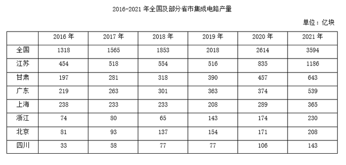

### 第 6 题　qid 5445740 · 综合

2021年，表中所列省市集成电路产量约占全国总产量的：

- **A**. 80%
- **B**. 84%
- **C**. 88%
- **D**. 92%　✅

**答案**：D

**官方解析**

根据题干“2021年······占······”，可判定本题为现期比重问题。定位统计表可知2021年表中所列省市及全国集成电路产量。根据公式：比重，可知所求比重。

故正确答案为D。

---

### 第 7 题　qid 5445742 · 增长

2017~2021年间，全国集成电路产量同比增速超过20%的年份有几个？

- **A**. 1
- **B**. 2　✅
- **C**. 3
- **D**. 4

**答案**：B

**官方解析**

根据题干“2017~2021年间······同比增速······”，可判定本题为一般增长率计算问题。定位统计表可知2016~2021年每年的全国集成电路产量。根据公式：一般增长率，则2017~2021年全国集成电路产量同比增速分别为：

2017年，；

2018年，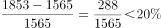；

2019年，；

2020年，；

2021年，。

综上，同比增速超过20%的年份有2020年、2021年，共2个。

故正确答案为B。

---

### 第 8 题　qid 5445743 · 增长

表中所列7个省市中，2019年集成电路产量同比增速超过2%的省市比上年：

- **A**. 少1个　✅
- **B**. 少2个
- **C**. 多1个
- **D**. 多2个

**答案**：A

**官方解析**

根据题干“······2019年······同比增速······”，可判定本题为一般增长率问题。定位统计表可知2017~2019年每年各省市集成电路产量数据。根据公式：增长率，可得：

（1）2018年各省市集成电路产量增长率分别为：

江苏；甘肃；广东；上海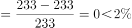；浙江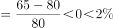；北京；四川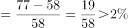。综上，2018年表中所列7个省市中集成电路产量同比增速超过2%的省市有5个。

（2）2019年各省市集成电路产量增长率分别为：

江苏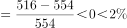；甘肃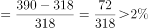；广东；上海；浙江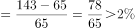；北京；四川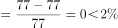。综上，2019年表中所列7个省市中集成电路产量同比增速超过2%的省市有4个。

则表中所列7个省市中，2019年集成电路产量同比增速超过2%的省市（4个）比上年（5个）少1个。

故正确答案为A。

---

### 第 9 题　qid 5445745 · 增长

将①甘肃、②广东、③上海和④浙江按2016~2021年集成电路产量年均增速（以2016年为基期计算）从高到低排列，以下正确的是：

- **A**. ④①②③
- **B**. ④①③②
- **C**. ①④②③　✅
- **D**. ①④③②

**答案**：C

**官方解析**

根据题干“······按2016~2021年······年均增速（以2016年为基期计算）从高到低排列······”，可判定本题为年均增长率问题。定位统计表可知2016年和2021年甘肃、广东、上海、浙江的集成电路产量。根据年均增长率公式：（n为年份差），当年份差n相同时，直接根据的值即可比较年均增长率的大小。计算各省份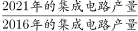可得：①甘肃；②广东；③上海；④浙江，则年均增速从高到低排列为：①④②③。

故正确答案为C。

---

### 第 10 题　qid 5445750 · 增长

以下折线图中，最能准确反映2017~2021年间北京市集成电路产量同比增量变化趋势的是：

- **A**. 

　✅
- **B**. 

- **C**. 

- **D**. 

**答案**：A

**官方解析**

根据题干“······2017~2021年间北京市集成电路产量同比增量变化趋势的是”，可判定本题为增长量比较问题。定位统计表可得：2016~2021年北京市集成电路产量分别为81亿块、93亿块、137亿块、154亿块、171亿块、208亿块。根据公式：增长量=现期量-基期量，则2017年同比增量为93-81=12亿块，2018年为137-93=44亿块，2019年为154-137=17亿块，2020年为171-154=17亿块，2021年为208-171=37亿块。可知2019年与2020年同比增量相等，即折线图中第三和第四个点高度一致，只有A项符合。
故正确答案为A。

---

## 材料 3

        超级计算，也被称为高性能计算。从算力资源的需求看，高性能计算可以分为尖端超算、通用超算、业务超算和人工智能超算四大类。

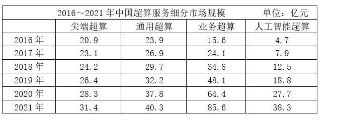

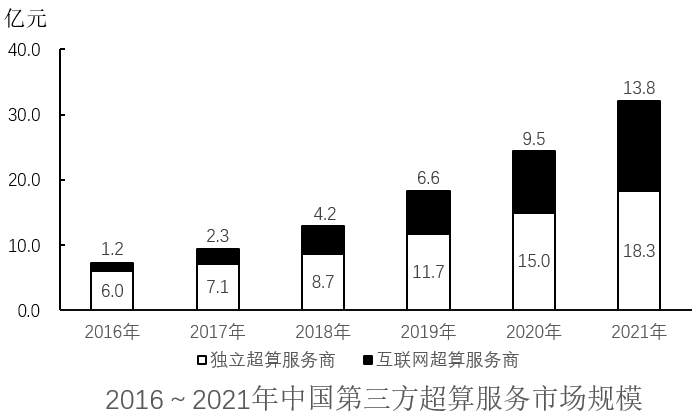

### 第 11 题　qid 5445847 · 综合

2020～2021年，中国超算服务市场累计规模约为多少亿元？

- **A**. 328
- **B**. 354　✅
- **C**. 371
- **D**. 396

**答案**：B

**官方解析**

定位统计表可得2020年中国尖端超算、通用超算、业务超算和人工智能超算服务市场规模分别为28.3亿元、37.8亿元、64.4亿元、27.7亿元；2021年这四类超算服务市场规模分别为31.4亿元、40.3亿元、85.6亿元、38.3亿元。则2020～2021年，中国超算服务市场累计规模=28.3+37.8+64.4+27.7+31.4+40.3+85.6+38.3亿元。

故正确答案为B。

---

### 第 12 题　qid 5445850 · 增长

2018年，中国超算服务4类细分市场中，同比增速最快和最慢的市场当年市场规模同比增速相差约多少个百分点？

- **A**. 41
- **B**. 47
- **C**. 53　✅
- **D**. 59

**答案**：C

**官方解析**

根据题干“2018年······同比增速······百分点”，可判定本题为一般增长率问题。定位统计表可得2017、2018年中国超算服务4类细分市场的市场规模。根据公式：增长率，可知2018年，中国超算服务4类细分市场的市场规模同比增速分别为：

尖端超算：；

通用超算：；

业务超算：；

人工智能超算：。

则增速最快的市场为人工智能超算，最慢的市场为尖端超算，所求=58%-5%=53%，即相差约53个百分点。

故正确答案为C。

---

### 第 13 题　qid 5445849 · 综合

2019年，中国第三方超算服务市场规模约占同年超算服务总体市场规模的：

- **A**. 15%　✅
- **B**. 18%
- **C**. 21%
- **D**. 24%

**答案**：A

**官方解析**

根据题干“2019年······占同年······”，结合材料时间为2019年，可判定本题为现期比重问题。定位统计表可得2019年中国尖端超算、通用超算、业务超算和人工智能超算的市场规模；定位统计图可得2019年中国第三方独立超算服务商和互联网超算服务商的市场规模。则所求比重，与A项最接近。

故正确答案为A。

---

### 第 14 题　qid 5445851 · 增长

如保持2021年同比增量不变，则到哪一年第三方互联网超算服务商提供的服务市场规模将第一次超过第三方独立超算服务商？

- **A**. 2025年
- **B**. 2026年　✅
- **C**. 2027年
- **D**. 2028年

**答案**：B

**官方解析**

根据题干“如保持2021年同比增量不变，则到哪一年······将第一次超过······”，可判定本题为现期追赶问题。定位统计图可知2020年、2021年中国第三方独立超算和互联网超算服务商市场规模。根据公式：增长量=现期量-基期量，则2021年第三方互联网超算服务商市场规模同比增量=13.8-9.5=4.3亿元，2021年第三方独立超算服务商市场规模同比增量=18.3-15.0=3.3亿元。根据公式：现期量=基期量+n×增长量，可列式：13.8+n×4.3＞18.3+n×3.3，解得n＞4.5，则n至少为5，即到2026年第三方互联网超算服务商提供的服务市场规模将第一次超过第三方独立超算服务商。
故正确答案为B。

---

### 第 15 题　qid 5445854 · 综合

能够从上述资料中推出的是：

- **A**. 2016～2020年，通用超算服务市场累计规模超过160亿元
- **B**. 2016～2017年，业务超算服务市场累计规模比人工智能超算服务高30多亿元
- **C**. 2018～2021年，第三方独立超算服务市场规模同比增量逐年递增
- **D**. 2017～2020年，第三方互联网超算服务市场规模同比增速逐年递减　✅

**答案**：D

**官方解析**

A项：定位统计表可得2016~2020年通用超算服务市场规模分别为23.9亿元、26.9亿元、29.7亿元、32.2亿元、37.8亿元。则所求=23.9+26.9+29.7+32.2+37.8亿元＜160亿元，错误；

B项：定位统计表可得2016~2017年业务超算服务市场规模分别为15.6亿元、24.1亿元，人工智能超算服务市场规模分别为4.7亿元、7.9亿元。则所求=（15.6+24.1）-（4.7+7.9）=39.7-12.6=27.1亿元＜30亿元，错误；

C项：定位统计图可得2017~2021年中国第三方独立超算服务市场规模。根据公式：增长量=现期量-基期量，则2018年同比增量=8.7-7.1=1.6亿元；2019年同比增量=11.7-8.7=3.0亿元；2020年同比增量=15.0-11.7=3.3亿元；2021年同比增量=18.3-15.0=3.3亿元。因2021年同比增量与2020年相等，则非逐年递增，错误；

D项：定位统计图可得2016~2020年中国第三方互联网超算服务市场规模。根据公式：增长率，则2017年同比增速；2018年同比增速；2019年同比增速；2020年同比增速。则2017~2020年中国第三方互联网超算服务市场规模同比增速逐年递减，正确。

故正确答案为D。

---

## 材料 4

        2021年，全国纺织品服装出口3155亿美元，同比增长8.4%。其中，纺织品出口1452.2亿美元，同比下降5.6%，较2019年增长22.0%；服装出口1702.8亿美元，同比增长24.0%，较2019年增长16.0%。其中，针织服装及衣着附件出口864.8亿美元，同比增长39.0%；梭织服装及衣着附件出口701.2亿美元，同比增长12.6%。

        2021年，中国对美国、东盟、欧盟和日本的纺织品服装出口合计1724.9亿美元。其中，对美国出口额为563.5亿美元，同比增长4.0%；向东盟十国出口纺织品服装491.2亿美元，同比增长24.9%；对欧盟27国出口纺织品服装469.9亿美元，同比下降11.1%；对日本出口纺织品服装200.3亿美元，同比下降7.2%。

        2021年，中国向全球出口纺织纱线138亿美元，出口织物667亿美元，分别同比增长41.5%和34.3%。纺织制品当中，防疫类口罩出口额为129.5亿美元，出口金额、数量同比分别下降76.0%和13.0%。除防疫类口罩外，其他纺织制品出口额为517.2亿美元，同比增长27.5%。

        2021年，中国向“一带一路”沿线国家出口纺织品服装1137.9亿美元，同比增长24.5%，较2019年增长17.3%；同时，中国自“一带一路”沿线国家进口纺织品服装131.6亿美元，同比增长24.5%。

### 第 16 题　qid 5445733 · 综合

2020年，全国服装出口额比2019年：

- **A**. 增长了10%以上
- **B**. 下降了10%以上
- **C**. 增长了不到10%
- **D**. 下降了不到10%　✅

**答案**：D

**官方解析**

根据题干“2020年······比2019年”，结合选项为增长/下降+百分数，且材料给出2021年全国服装出口额的同比增速以及相对于2019年的增速，可判定本题为间隔增长率问题。定位文字材料第一段可得：2021年，全国服装出口1702.8亿美元，同比增长24.0%（），较2019年增长16.0%（）。根据公式：，代入数据则有，解得，即下降了不到10%。

故正确答案为D。

---

### 第 17 题　qid 5445736 · 综合

2021年，全国针织、梭织服装及衣着附件总出口额约占纺织品服装出口总额的：

- **A**. 55%
- **B**. 50%　✅
- **C**. 45%
- **D**. 40%

**答案**：B

**官方解析**

根据题干“2021年，全国······约占······的”，结合材料时间为2021年，可判定本题为现期比重问题。定位文字材料第一段可得：2021年，全国纺织品服装出口3155亿美元······其中，针织服装及衣着附件出口864.8亿美元······梭织服装及衣着附件出口701.2亿美元。根据公式：比重，可得所求比重。

故正确答案为B。

---

### 第 18 题　qid 5445738 · 增长

将①美国、②东盟十国、③欧盟27国和④日本按2021年自中国进口纺织品服装金额同比增量从高到低排列，以下正确的是：

- **A**. ①②③④
- **B**. ①②④③
- **C**. ②①③④
- **D**. ②①④③　✅

**答案**：D

**官方解析**

根据题干“······同比增量从高到低······”，可判定本题为增长量比较问题。定位文字材料第二段可得：2021年······对美国出口额为563.5亿美元，同比增长4.0%；向东盟十国出口纺织品服装491.2亿美元，同比增长24.9%；对欧盟27国出口纺织品服装469.9亿美元，同比下降11.1%；对日本出口纺织品服装200.3亿美元，同比下降7.2%。根据公式：增长量，则2021年题干中四个国家自中国进口（即中国对四个国家出口）纺织品服装金额同比增量分别为：①美国：亿美元；②东盟十国：亿美元；③欧盟27国：亿美元；④日本：亿美元。则按同比增量从高到低排列为：②东盟十国（亿美元）、①美国（亿美元）、④日本（亿美元）、③欧盟27国（亿美元）。

故正确答案为D。

---

### 第 19 题　qid 5445741 · 比重

2020年中国出口的纺织制品总额中，防疫类口罩出口额占比约为：

- **A**. 57%　✅
- **B**. 72%
- **C**. 33%
- **D**. 45%

**答案**：A

**官方解析**

根据题干“2020年······占比······”，结合材料时间为2021年，可判定本题为基期比重问题。定位文字材料第三段可知：2021年······纺织制品当中，防疫类口罩出口额为129.5亿美元，出口金额同比下降76.0%。除防疫类口罩外，其他纺织制品出口额为517.2亿美元，同比增长27.5%。根据公式：基期量，可得2020年防疫类口罩出口额亿美元；2020年其他纺织制品出口额亿美元。根据公式：比重，可得所求。

故正确答案为A。

---

### 第 20 题　qid 5445744 · 综合

2020年，中国对“一带一路”沿线国家纺织品服装贸易顺差额约为多少亿美元？

- **A**. 1129
- **B**. 1253
- **C**. 808　✅
- **D**. 1006

**答案**：C

**官方解析**

根据题干“2020年······贸易顺差额约为多少亿美元”，结合材料时间为2021年，且贸易顺差额=出口额-进口额，可判定本题为基期和差问题。定位文字材料最后一段可得：2021年，中国向“一带一路”沿线国家出口纺织品服装1137.9亿美元，同比增长24.5%；同时，中国自“一带一路”沿线国家进口纺织品服装131.6亿美元，同比增长24.5%。根据公式：基期量，可得所求亿美元，与C项最接近。

故正确答案为C。

---

### 第 21 题　qid 5445878 · 倍数

甲、乙二人合伙成立公司，约定每年利润的60%留作公司发展用途，40%按二人投资比例分配。已知公司成立第三年的利润比第二年高300万元，是第一年利润的3倍；甲第二年分配的金额是第三年的一半，且比第一年多20万元。问乙的投资额占比为多少？

- **A**. 40%
- **B**. 50%　✅
- **C**. 60%
- **D**. 75%

**答案**：B

**官方解析**

设该公司第一年的利润为x万元，根据题意可得，第三年的利润为3x万元，第二年的利润为（3x-300）万元。已知每年二人将利润的40%按投资比例分配，且甲第二年分配的金额是第三年的一半，设甲的投资额占比为y，可列方程：，解得x=200。则第一年的利润为200万元，第二年的利润为3×200-300=300万元。又因甲第二年分配的金额比第一年多20万元，可列方程：300×40%×y=200×40%×y+20，解得y=50%，故甲的投资额占比为50%，则乙的投资额占比为1-50%=50%。

故正确答案为B。

---
