# 2023年国家公务员录用考试《行测》题（地市级网友回忆版）

> 资料分析 · 21 题 · 国考 2023

## 材料 1

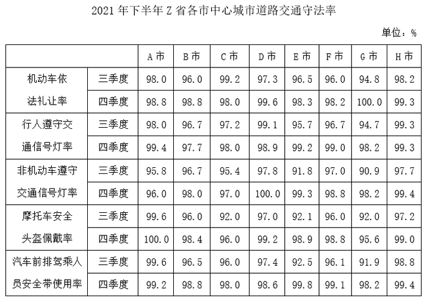

### 第 1 题　qid 5445749 · 综合

2021年四季度，Z省有几个市的中心城市道路机动车依法礼让率高于上季度水平？

- **A**. 5
- **B**. 6
- **C**. 7　✅
- **D**. 8

**答案**：C

**官方解析**

定位表格材料可得：2021年四季度Z省各市中心城市道路机动车依法礼让率高于上季度水平的有A市（98.8%＞98.0%）、B市（98.8%＞96.0%）、D市（99.6%＞97.3%）、E市（98.3%＞96.5%）、F市（98.2%＞96.0%）、G市（100.0%＞94.8%）、H市（99.3%＞98.2%），共7个。
故正确答案为C。

---

### 第 2 题　qid 5445756 · 增长

2021年三季度Z省中心城市道路非机动车遵守交通信号灯率最低的城市，其四季度中心城市道路非机动车遵守交通信号灯率比上季度增长了：

- **A**. 4~6个百分点之间
- **B**. 超过6个百分点　✅
- **C**. 不到2个百分点
- **D**. 2~4个百分点之间

**答案**：B

**官方解析**

定位表格材料可得：2021年三季度Z省中心城市道路非机动车遵守交通信号灯率最低的城市是G市（90.9%）。2021年四季度以及三季度G市中心城市道路非机动车遵守交通信号灯率分别为98.2%、90.9%。则2021年四季度G市中心城市道路非机动车遵守交通信号灯率比上季度增长了98.2%-90.9%=7.3%，即增长了7.3个百分点，在B项范围内。
故正确答案为B。

---

### 第 3 题　qid 5445759 · 平均数

如用求各市算术平均值的方式计算全省数值，则2021年四季度Z省中心城市道路汽车前排驾乘人员安全带使用率比上季度：

- **A**. 下降了不到2个百分点
- **B**. 下降了2个百分点以上
- **C**. 提升了不到2个百分点
- **D**. 提升了2个百分点以上　✅

**答案**：D

**官方解析**

根据题干“如用求各市算术平均值的方式计算全省数值，则2021年四季度······比上季度”，结合选项为下降/提升+百分点，可判定本题为平均数的增长量问题。定位表格材料可得：2021年四季度Z省各市中心城市道路汽车前排驾乘人员安全带使用率分别为99.2%、98.8%、98.0%、98.6%、99.8%、99.1%、98.2%、99.4%，2021年三季度分别为99.6%、96.5%、96.0%、97.4%、92.5%、96.1%、91.9%、98.8%。则所求，即约比上季度提升了2个百分点以上。

故正确答案为D。

---

### 第 4 题　qid 5445766 · 综合

如单纯从统计数据判断，则2021年四季度B市在提升中心城市道路交通守法率方面，工作相比三季度最有成效的是：

- **A**. 机动车依法礼让　✅
- **B**. 行人、非机动车遵守交通信号灯
- **C**. 摩托车驾乘人员佩戴安全头盔
- **D**. 汽车前排驾乘人员使用安全带

**答案**：A

**官方解析**

定位表格材料可得2021年三季度、四季度B市在选项四个方面的城市道路交通守法率，具体情况为：

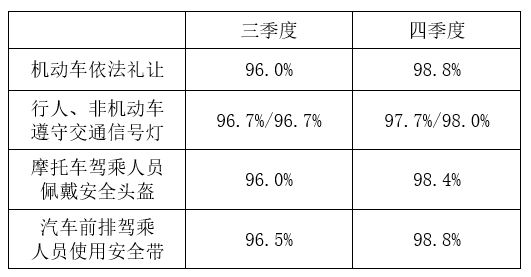

对比可得，B市2021年三季度的机动车依法礼让率最低（96.0%），而四季度最高（98.8%），差值最大，即工作相比三季度最有成效。

故正确答案为A。

---

### 第 5 题　qid 5445771 · 综合

以下条形图反映了2021年四季度Z省哪个城市中心城市道路交通守法率五项指标之间的大小关系？

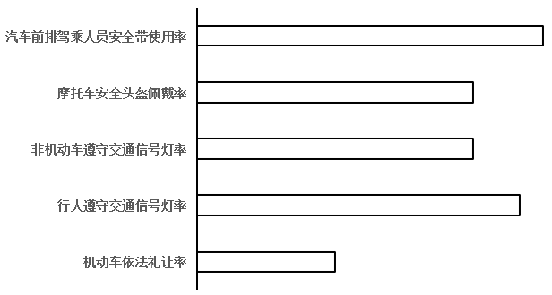

- **A**. E市
- **B**. F市　✅
- **C**. G市
- **D**. H市

**答案**：B

**官方解析**

定位表格材料可得2021年四季度E市、F市、G市、H市中心城市道路交通五项指标的守法率。逐一分析选项：
A项：2021年四季度E市中心城市道路交通机动车依法礼让率、行人遵守交通信号灯率、非机动车遵守交通信号灯率、摩托车安全头盔佩戴率、汽车前排驾乘人员安全带使用率五项指标的守法率依次为98.3%、99.2%、99.3%、98.9%、99.8%。即排名第2的指标为非机动车遵守交通信号灯率（99.3%），不符合条形图五项指标之间的大小关系，排除；
B项：2021年四季度F市中心城市道路交通机动车依法礼让率、行人遵守交通信号灯率、非机动车遵守交通信号灯率、摩托车安全头盔佩戴率、汽车前排驾乘人员安全带使用率五项指标的守法率依次为98.2%、99.0%、98.8%、98.8%、99.1%。即符合条形图五项指标之间的大小关系，正确；
C项：2021年四季度G市中心城市道路交通机动车依法礼让率、行人遵守交通信号灯率、非机动车遵守交通信号灯率、摩托车安全头盔佩戴率、汽车前排驾乘人员安全带使用率五项指标的守法率依次为100.0%、98.2%、98.2%、95.6%、98.2%。即排名第1的指标为机动车依法礼让率（100.0%），不符合条形图五项指标之间的大小关系，排除；
D项：2021年四季度H市中心城市道路交通机动车依法礼让率、行人遵守交通信号灯率、非机动车遵守交通信号灯率、摩托车安全头盔佩戴率、汽车前排驾乘人员安全带使用率五项指标的守法率依次为99.3%、99.3%、99.4%、99.0%、99.4%。即并列排名第1的指标为非机动车遵守交通信号灯率和汽车前排驾乘人员安全带使用率（99.4%），不符合条形图五项指标之间的大小关系，排除。
故正确答案为B。

---

## 材料 2

        超级计算，也被称为高性能计算。从算力资源的需求看，高性能计算可以分为尖端超算、通用超算、业务超算和人工智能超算四大类。

### 第 6 题　qid 5445847 · 综合

2020～2021年，中国超算服务市场累计规模约为多少亿元？

- **A**. 328
- **B**. 354　✅
- **C**. 371
- **D**. 396

**答案**：B

**官方解析**

定位统计表可得2020年中国尖端超算、通用超算、业务超算和人工智能超算服务市场规模分别为28.3亿元、37.8亿元、64.4亿元、27.7亿元；2021年这四类超算服务市场规模分别为31.4亿元、40.3亿元、85.6亿元、38.3亿元。则2020～2021年，中国超算服务市场累计规模=28.3+37.8+64.4+27.7+31.4+40.3+85.6+38.3亿元。

故正确答案为B。

---

### 第 7 题　qid 5445849 · 综合

2019年，中国第三方超算服务市场规模约占同年超算服务总体市场规模的：

- **A**. 15%　✅
- **B**. 18%
- **C**. 21%
- **D**. 24%

**答案**：A

**官方解析**

根据题干“2019年······占同年······”，结合材料时间为2019年，可判定本题为现期比重问题。定位统计表可得2019年中国尖端超算、通用超算、业务超算和人工智能超算的市场规模；定位统计图可得2019年中国第三方独立超算服务商和互联网超算服务商的市场规模。则所求比重，与A项最接近。

故正确答案为A。

---

### 第 8 题　qid 5445850 · 增长

2018年，中国超算服务4类细分市场中，同比增速最快和最慢的市场当年市场规模同比增速相差约多少个百分点？

- **A**. 41
- **B**. 47
- **C**. 53　✅
- **D**. 59

**答案**：C

**官方解析**

根据题干“2018年······同比增速······百分点”，可判定本题为一般增长率问题。定位统计表可得2017、2018年中国超算服务4类细分市场的市场规模。根据公式：增长率，可知2018年，中国超算服务4类细分市场的市场规模同比增速分别为：

尖端超算：；

通用超算：；

业务超算：；

人工智能超算：。

则增速最快的市场为人工智能超算，最慢的市场为尖端超算，所求=58%-5%=53%，即相差约53个百分点。

故正确答案为C。

---

### 第 9 题　qid 5445851 · 增长

如保持2021年同比增量不变，则到哪一年第三方互联网超算服务商提供的服务市场规模将第一次超过第三方独立超算服务商？

- **A**. 2025年
- **B**. 2026年　✅
- **C**. 2027年
- **D**. 2028年

**答案**：B

**官方解析**

根据题干“如保持2021年同比增量不变，则到哪一年······将第一次超过······”，可判定本题为现期追赶问题。定位统计图可知2020年、2021年中国第三方独立超算和互联网超算服务商市场规模。根据公式：增长量=现期量-基期量，则2021年第三方互联网超算服务商市场规模同比增量=13.8-9.5=4.3亿元，2021年第三方独立超算服务商市场规模同比增量=18.3-15.0=3.3亿元。根据公式：现期量=基期量+n×增长量，可列式：13.8+n×4.3＞18.3+n×3.3，解得n＞4.5，则n至少为5，即到2026年第三方互联网超算服务商提供的服务市场规模将第一次超过第三方独立超算服务商。
故正确答案为B。

---

### 第 10 题　qid 5445854 · 综合

能够从上述资料中推出的是：

- **A**. 2016～2020年，通用超算服务市场累计规模超过160亿元
- **B**. 2016～2017年，业务超算服务市场累计规模比人工智能超算服务高30多亿元
- **C**. 2018～2021年，第三方独立超算服务市场规模同比增量逐年递增
- **D**. 2017～2020年，第三方互联网超算服务市场规模同比增速逐年递减　✅

**答案**：D

**官方解析**

A项：定位统计表可得2016~2020年通用超算服务市场规模分别为23.9亿元、26.9亿元、29.7亿元、32.2亿元、37.8亿元。则所求=23.9+26.9+29.7+32.2+37.8亿元＜160亿元，错误；

B项：定位统计表可得2016~2017年业务超算服务市场规模分别为15.6亿元、24.1亿元，人工智能超算服务市场规模分别为4.7亿元、7.9亿元。则所求=（15.6+24.1）-（4.7+7.9）=39.7-12.6=27.1亿元＜30亿元，错误；

C项：定位统计图可得2017~2021年中国第三方独立超算服务市场规模。根据公式：增长量=现期量-基期量，则2018年同比增量=8.7-7.1=1.6亿元；2019年同比增量=11.7-8.7=3.0亿元；2020年同比增量=15.0-11.7=3.3亿元；2021年同比增量=18.3-15.0=3.3亿元。因2021年同比增量与2020年相等，则非逐年递增，错误；

D项：定位统计图可得2016~2020年中国第三方互联网超算服务市场规模。根据公式：增长率，则2017年同比增速；2018年同比增速；2019年同比增速；2020年同比增速。则2017~2020年中国第三方互联网超算服务市场规模同比增速逐年递减，正确。

故正确答案为D。

---

## 材料 3

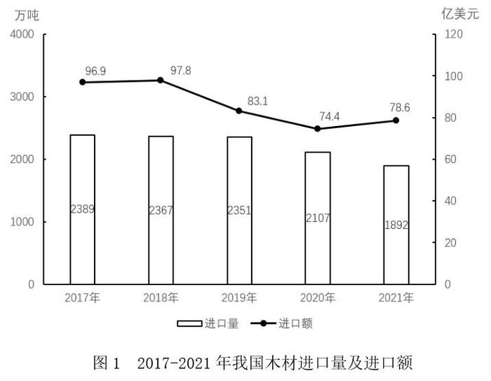

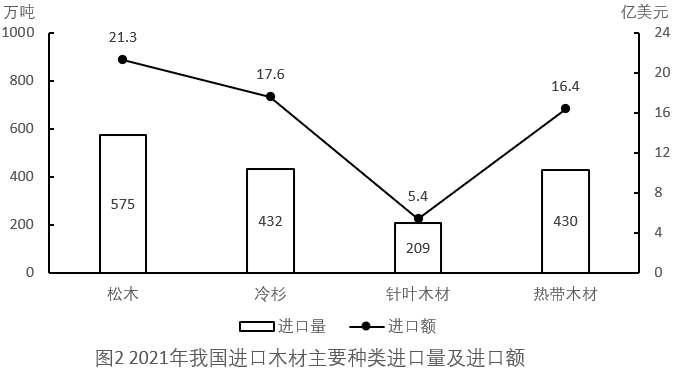

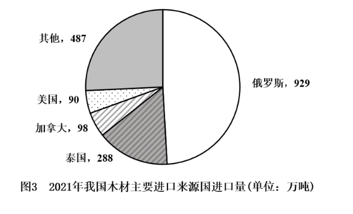

### 第 11 题　qid 5445747 · 综合

2017-2021年，我国总计进口了约多少亿吨木材？

- **A**. 1.4
- **B**. 1.3
- **C**. 1.2
- **D**. 1.1　✅

**答案**：D

**官方解析**

定位图1可知2017-2021年我国每年木材进口量。故2017-2021年，我国总计进口木材量万吨亿吨，与D项最接近。

故正确答案为D。

---

### 第 12 题　qid 5445748 · 平均数

2017-2021年，我国木材进口平均单价高于400美元/吨的年份有几个？

- **A**. 4
- **B**. 3　✅
- **C**. 2
- **D**. 1

**答案**：B

**官方解析**

根据题干“2017-2021年······平均单价高于400美元/吨的年份有几个”，可判定本题为现期平均数问题。定位图1可知2017-2021年我国每年木材进口量及进口额。根据公式：进口平均单价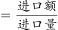，则2017-2021年我国木材进口平均单价分别为：2017年，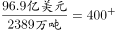美元/吨；2018年，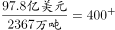美元/吨；2019年，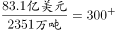美元/吨；2020年，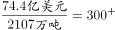美元/吨；2021年，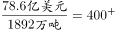美元/吨。因此，平均单价高于400美元/吨的年份有2017年、2018年、2021年，共3个。

故正确答案为B。

---

### 第 13 题　qid 5445751 · 综合

2021年，松木、冷杉和针叶木材进口量之和占当年我国木材进口总量的：

- **A**. 不到60%
- **B**. 60%~65%之间　✅
- **C**. 65%~70%之间
- **D**. 70%以上

**答案**：B

**官方解析**

根据题干“2021年······占当年······的”，结合材料给出2021年相关数据，可判定本题为现期比重问题。定位图1可得：2021年，我国木材进口量为1892万吨。定位图2可得：2021年，我国松木、冷杉、针叶木材进口量分别为575万吨、432万吨、209万吨。根据公式：比重，则松木、冷杉和针叶木材进口量之和占当年我国木材进口总量的比重，在B项范围内。

故正确答案为B。

---

### 第 14 题　qid 5445753 · 比重

2021年，自俄罗斯进口的木材占当年木材进口总量的比重约比美国高多少个百分点？

- **A**. 44　✅
- **B**. 50
- **C**. 32
- **D**. 38

**答案**：A

**官方解析**

根据题干“2021年······的比重约比······高多少个百分点”，可判定本题为现期比重问题。定位图1可得：2021年我国木材进口量为1892万吨；定位图3可得：2021年我国自俄罗斯和美国进口木材量分别为929万吨和90万吨。根据公式：比重，故所求为。

故正确答案为A。

---

### 第 15 题　qid 5445763 · 增长

以下折线图中，最能准确反映2018-2021年我国木材进口额同比增量变化趋势的是：

- **A**. 

- **B**. 

- **C**. 

　✅
- **D**. 
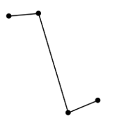

**答案**：C

**官方解析**

根据题干“······2018-2021年······同比增量变化趋势”，可判定本题为增长量比较问题。定位图1可得，2017-2021年，我国木材进口额分别为96.9亿美元、97.8亿美元、83.1亿美元、74.4亿美元、78.6亿美元。根据公式：增长量=现期量-基期量，则2018-2021年我国木材进口额同比增量分别为：
2018年，97.8-96.9=0.9亿美元；
2019年，83.1-97.8=-14.7亿美元；
2020年，74.4-83.1=-8.7亿美元；
2021年，78.6-74.4=4.2亿美元。
综上可知，同比增量呈先下降后上升的趋势，且2019年同比增量最低，2021年同比增量最高，与C项变化趋势一致。
故正确答案为C。

---

## 材料 4

        2021年H省商品、服务类电子商务交易额为11526.13亿元，比上年同期增长21.8%，高于全国增速2.3个百分点。H省跨境电商进出口交易额为2018.3亿元，其中，出口1475.5亿元，同比增长15.7%；进口542.8亿元，同比增长16.0%。H省网上零售额为2948.2亿元，同比增长12.5%，其中，实物商品网上零售额为2426.4亿元，同比增长10.1%。

        从交易对象看，2021年H省商品类电子商务交易额为8896.60亿元，同比增长16.6%；服务类电子商务交易额为2629.53亿元，同比增长43.5%。从交易主体看，2021年H省对单位电子商务交易额为7254.75亿元，同比增长19.8%，占商品、服务类电子商务交易额比重为62.9%；对个人电子商务交易额为4271.38亿元，同比增长25.4%。

        2021年H省共有电子商务平台87个，在本省电商平台上实现交易金额为5354.93亿元，同比增长41.0%，收取的平台交易服务费为3.17亿元，同比增长49.5%。从地区分布来看，2021年本地电子商务平台拥有量最多的为Z市，有44个平台，实现交易金额4239.04亿元。

### 第 16 题　qid 5445860 · 增长

2021年，全国商品、服务类电子商务交易额同比增长了：

- **A**. 17.2%
- **B**. 19.5%　✅
- **C**. 21.8%
- **D**. 24.1%

**答案**：B

**官方解析**

根据题干“2021年······同比增长了”，结合选项为百分数，可判定本题为一般增长率问题。定位文字材料第一段可得：2021年H省商品、服务类电子商务交易额为11526.13亿元，比上年同期增长21.8%，高于全国增速2.3个百分点。则2021年，全国商品、服务类电子商务交易额同比增长了21.8%-2.3%=19.5%。
故正确答案为B。

---

### 第 17 题　qid 5445861 · 比重

2021年，H省实物商品网上零售额占网上零售额的比重比上年同期：

- **A**. 下降了不到3个百分点　✅
- **B**. 下降了3个百分点以上
- **C**. 上升了不到3个百分点
- **D**. 上升了3个百分点以上

**答案**：A

**官方解析**

根据题干“2021年······占······比重比上年同期”，结合选项为“下降/上升+百分点”，可判定本题为两期比重问题。定位文字材料第一段可得：2021年，H省网上零售额为2948.2亿元（B），同比增长12.5%（b），其中，实物商品网上零售额为2426.4亿元（A），同比增长10.1%（a）。根据公式：两期比重，可得所求，即比重比上年同期下降了不到3个百分点。

故正确答案为A。

---

### 第 18 题　qid 5445864 · 比重

以下饼图中，最能准确反映2021年H省商品类（白色）和服务类（黑色）电子商务交易额占商品、服务类电子商务交易额比重关系的是：

- **A**. 
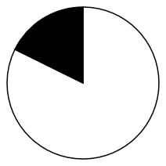

- **B**. 
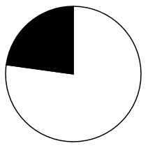
　✅
- **C**. 

- **D**. 
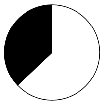

**答案**：B

**官方解析**

根据题干“以下饼图中，最能准确反映2021年H省······占······比重关系的是”，可判定本题为现期比重问题。定位文字材料第一、二段可得：2021年H省商品、服务类电子商务交易额为11526.13亿元······商品类电子商务交易额为8896.60亿元，服务类电子商务交易额为2629.53亿元。服务类电子商务交易额占比为，占比略小于25%，即在饼图中黑色部分应略小于圆的，排除A、C、D三项，B项当选。

故正确答案为B。

---

### 第 19 题　qid 5445865 · 平均数

2021年，H省除Z市外其他地区的电子商务平台平均每个平台实现的交易金额约为多少亿元？

- **A**. 5
- **B**. 12
- **C**. 26　✅
- **D**. 62

**答案**：C

**官方解析**

根据题干“2021年······平均每个······交易金额约为多少亿元”，可判定本题为现期平均数问题。定位文字材料第三段可得，2021年H省共有电子商务平台87个，在本省电商平台上实现交易金额为5354.93亿元······2021年本地电子商务平台拥有量最多的为Z市，有44个平台，实现交易金额4239.04亿元。故2021年H省除Z市外其他地区的电子商务平台平均每个平台实现的交易金额亿元。

故正确答案为C。

---

### 第 20 题　qid 5445866 · 综合

关于H省电子商务交易，能够从上述资料中推出的是：

- **A**. 2021年，跨境电商进出口交易额同比增长16%以上
- **B**. 2021年，网上零售额占商品、服务类电子商务交易额的比重高于上年水平
- **C**. 2020年，对个人电子商务交易额占商品、服务类电子商务交易额的38%以上
- **D**. 2020年，省内电子商务平台收取的平台交易服务费超过2亿元　✅

**答案**：D

**官方解析**

A项：定位材料第一段可得：（2021年）H省跨境电商进出口交易额为2018.3亿元，其中，出口1475.5亿元，同比增长15.7%；进口542.8亿元，同比增长16.0%。进出口交易额=出口额+进口额，根据混合增长率口诀“混合后居中”可知，2021年跨境电商进出口交易额的同比增速在15.7%~16.0%之间，错误；

B项：定位材料第一段可得：2021年H省商品、服务类电子商务交易额为11526.13亿元，比上年同期增长21.8%（b）······H省网上零售额为2948.2亿元，同比增长12.5%（a）。根据两期比重比较结论：当部分增长率（a）＜整体增长率（b）时，比重下降。12.5%＜21.8%，即2021年网上零售额占商品、服务类电子商务交易额的比重低于上年水平，错误；

C项：定位材料第一段可得：2021年H省商品、服务类电子商务交易额为11526.13亿元（B），比上年同期增长21.8%（b）；定位材料第二段可得：（2021年H省）对个人电子商务交易额为4271.38亿元（A），同比增长25.4%（a）。根据公式：基期比重，则2020年占比为，2020年对个人电子商务交易额占商品、服务类电子商务交易额的比重不足38%，错误；

D项：定位材料第三段可得：（2021年H省）在本省电商平台上······收取的平台交易服务费为3.17亿元，同比增长49.5%。根据公式：基期量，则2020年省内电子商务平台收取的平台交易服务费为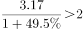亿元，正确。

故正确答案为D。

---

### 第 21 题　qid 5445878 · 倍数

甲、乙二人合伙成立公司，约定每年利润的60%留作公司发展用途，40%按二人投资比例分配。已知公司成立第三年的利润比第二年高300万元，是第一年利润的3倍；甲第二年分配的金额是第三年的一半，且比第一年多20万元。问乙的投资额占比为多少？

- **A**. 40%
- **B**. 50%　✅
- **C**. 60%
- **D**. 75%

**答案**：B

**官方解析**

设该公司第一年的利润为x万元，根据题意可得，第三年的利润为3x万元，第二年的利润为（3x-300）万元。已知每年二人将利润的40%按投资比例分配，且甲第二年分配的金额是第三年的一半，设甲的投资额占比为y，可列方程：，解得x=200。则第一年的利润为200万元，第二年的利润为3×200-300=300万元。又因甲第二年分配的金额比第一年多20万元，可列方程：300×40%×y=200×40%×y+20，解得y=50%，故甲的投资额占比为50%，则乙的投资额占比为1-50%=50%。

故正确答案为B。

---
