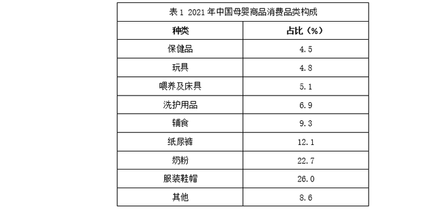
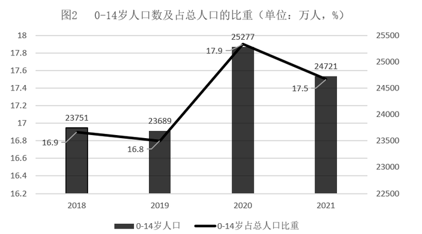
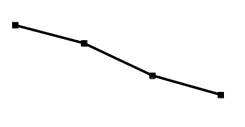
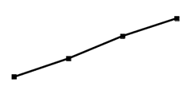
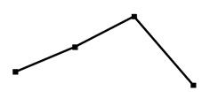

# 2023年宁夏公务员录用考试《行测》题（网友回忆版）

> 资料分析 · 15 题 · 宁夏 2023

## 材料 1

        2022年1~7月，全国规模以上工业发电4.77万亿千瓦时，同比增长1.4%，增速比上半年加快0.7个百分点。7月份，全国发电量8059亿千瓦时，同比增长4.5%，增速比上月加快3.0个百分点。分品种看，7月份火电由降转增，同比增长5.3%；由于来水偏枯，水电同比增长2.4%，增速比上月放缓26.6个百分点；风电同比增长5.7%，增速比上月放缓11.0个百分点；核电同比下降3.3%，降幅比上月收窄5.7个百分点；太阳能发电同比增长13.0%，增速比上月加快3.1个百分点。

        2022年1~7月，全社会用电量累计49303亿千瓦时，同比增长3.4%。分产业看，第一产业用电量634亿千瓦时，同比增长11.1%；第二产业用电量32552亿千瓦时，同比增长1.1%；第三产业用电量8531亿千瓦时，同比增长4.6%；城乡居民生活用电量7586亿千瓦时，同比增长12.5%。7月份，全社会用电量8324亿千瓦时，同比增长6.3%。分产业看，第一产业用电量121亿千瓦时，同比增长14.3%；第二产业用电量5132亿千瓦时，同比下降0.1%；第三产业用电量1591亿千瓦时，同比增长11.5%；城乡居民生活用电量1480亿千瓦时，同比增长26.8%。

### 第 1 题　qid 5509475 · 综合

2021年7月份，全国发电量大约是多少亿千瓦时？

- **A**. 6570
- **B**. 6920
- **C**. 7712　✅
- **D**. 7800

**答案**：C

**官方解析**

根据题干“2021年7月份，全国发电量大约是多少亿千瓦时”，结合材料时间为2022年，可判定本题为基期计算问题。定位文字材料第一段可知：2022年7月份，全国发电量8059亿千瓦时，同比增长4.5%。根据公式：基期量，则2021年7月份，全国发电量亿千瓦时。

故正确答案为C。

---

### 第 2 题　qid 5509485 · 综合

2022年1~7月份，全国城乡居民生活用电量比2021年1~7月份约多：

- **A**. 672亿千瓦时
- **B**. 843亿千瓦时　✅
- **C**. 925亿千瓦时
- **D**. 1020亿千瓦时

**答案**：B

**官方解析**

根据题干“2022年1~7月份，······比2021年1~7月份约多”，结合选项有具体单位，可判定本题为增长量计算问题。定位文字材料第二段可知：2022年1~7月，城乡居民生活用电量7586亿千瓦时，同比增长12.5%。根据公式：增长量，则2022年1~7月份，全国城乡居民生活用电量同比增长亿千瓦时，与B项最接近。

故正确答案为B。

---

### 第 3 题　qid 5509487 · 比重

2021年7月份，全社会用电量中第三产业用电量的占比与城乡居民生活用电量的占比相较约：

- **A**. 高3.3%　✅
- **B**. 低3.8%
- **C**. 高9.8%
- **D**. 低10.3%

**答案**：A

**官方解析**

根据题干“2021年7月份······占比······”，结合材料时间为2022年，可判定本题为基期比重问题。定位文字材料第二段可知：“（2022年）7月份，全社会用电量8324亿千瓦时，同比增长6.3%。分产业看，······第三产业用电量1591亿千瓦时，同比增长11.5%；城乡居民生活用电量1480亿千瓦时，同比增长26.8%”。根据公式：基期比重，故所求，即约高3.3%。 

故正确答案为A。

---

### 第 4 题　qid 5509491 · 综合

2021年1~6月全社会用电量累计约多少亿千瓦时？

- **A**. 38258
- **B**. 39851　✅
- **C**. 40472
- **D**. 41279

**答案**：B

**官方解析**

根据题干“2021年1~6月······”，结合材料时间为2022年1~7月和2022年7月，可判定本题为基期和差问题。定位文字材料第二段可得：2022年1~7月，全社会用电量累计49303亿千瓦时（A），同比增长3.4%（a）；7月份，全社会用电量8324亿千瓦时（B），同比增长6.3%（b）。根据公式：基期和差，则2021年1~6月全社会用电量累计为亿千瓦时。

故正确答案为B。

---

### 第 5 题　qid 5509495 · 综合

能够从上述资料中推出的是：

- **A**. 2022年7月全国太阳能发电增长量最大
- **B**. 2022年6月全国核电发电量比5月份高
- **C**. 2022年7月第二产业用电量高于上半年第二产业月均用电量　✅
- **D**. 2021年7月第一产业用电量低于2021年上半年第一产业月均用电量

**答案**：C

**官方解析**

A项：定位文字材料第一段可得，2022年7月份，太阳能发电同比增长13.0%，增速比上月加快3.1个百分点。并未给全国太阳能发电的其他数据，无法计算增长量，不能进行比较，错误；

B项：定位文字材料第一段可得，2022年7月份，核电同比下降3.3%，降幅比上月收窄5.7个百分点，根据百分点运算技巧，只能求得2022年6月的同比增长率而非环比增长率，无法判别2022年6月和5月全国核电发电量的大小关系，错误；

C项：根据题意，，推导可得7×7月&gt;1~7月。定位文字材料第二段可得，2022年1~7月，第二产业用电量32552亿千瓦时；7月份，第二产业用电量5132亿千瓦时。代入数据验证，2022年7月第二产业用电量×7=5132×7&gt;5100×7=35700亿千瓦时&gt;32552亿千瓦时（2022年1~7月第二产业用电量），满足“7×7月&gt;1~7月”，正确；

D项：根据题意，，推导可得7×7月&lt;1~7月。定位文字材料第二段可得，2022年1~7月，第一产业用电量634亿千瓦时，同比增长11.1%；7月份，第一产业用电量121亿千瓦时，同比增长14.3%。根据公式：基期量，则2021年7月第一产业用电量亿千瓦时，2021年1~7月第一产业用电量亿千瓦时。代入数据验证，2021年7月第一产业用电量×7=106×7=742亿千瓦时&gt;571亿千瓦时（2021年1~7月第一产业用电量），不满足“7×7月&lt;1~7月”，错误。

故正确答案为C。

---

## 材料 2

### 第 6 题　qid 5509527 · 综合

2018-2021年，我国母婴商品消费规模最大的年份是：

- **A**. 2018年
- **B**. 2019年
- **C**. 2020年
- **D**. 2021年　✅

**答案**：D

**官方解析**

定位图1可知：2018-2021年，我国母婴商品消费规模分别为26593亿元、29919亿元、31231亿元、34591亿元，故消费规模最大的年份是2021年。
故正确答案为D。

---

### 第 7 题　qid 5509531 · 增长

2018-2021年，我国母婴商品消费规模增长率的变动趋势是：

- **A**. 

- **B**. 

- **C**. 

　✅
- **D**. 

**答案**：C

**官方解析**

根据题干“2018-2021年······增长率的变动趋势”，可判定本题为一般增长率的比较问题。定位图1可知：2017-2021年我国母婴商品消费规模分别为23613亿元、26593亿元、29919亿元、31231亿元、34591亿元，根据公式：增长率，则各年增长率分别为：

2018年：；

2019年：；

2020年：；

2021年：。

图像对应到第三个点应为最低点，只有C项符合。

故正确答案为C。

---

### 第 8 题　qid 5509533 · 增长

根据上述资料，在母婴商品消费规模增速最小的年份，其增速最小的原因最可能是：

- **A**. 当年0-14岁人口数较之其他年份最少
- **B**. 当年0-14岁人口数占总人口比重最小
- **C**. 当年人均可支配收入水平下降
- **D**. 当年人均可支配收入增速下降　✅

**答案**：D

**官方解析**

根据题干“······增速最小的年份”，可判定本题为一般增长率问题。需先通过增长率比较，找出我国母婴商品消费规模增速最小的年份，再验证选项。

定位图1可知：2016-2021年各年我国母婴商品消费规模分别为21015亿元、23613亿元、26593亿元、29919亿元、31231亿元、34591亿元。根据公式：增长率，可得2017-2021年各年我国母婴商品消费规模的同比增速，如下：

2017年：增速为；

2018年：增速为；

2019年：增速为；

2020年：增速为；

2021年：增速为。

则2017-2021年，我国母婴商品消费规模增速最小的年份为2020年。

再验证选项，如下：

A项：定位图2可知：2020年0-14岁人口数为25277万人，不符合“较之其他年份最少”，错误；

B项：定位图2可知：2020年0-14岁人口数占总人口比重为17.9%，不符合“比重最小”，错误；

C项：定位图3可知：2020年人均可支配收入为32189元，不符合“水平下降”。错误；

D项：定位图3可知：2019年人均可支配收入增速为，2020年增速为，2020年人均可支配收入增速符合“下降”，正确。

故正确答案为D。

---

### 第 9 题　qid 5509536 · 综合

2021年，我国消费最多的母婴商品金额约为：

- **A**. 9638亿元
- **B**. 8994亿元　✅
- **C**. 7852亿元
- **D**. 4186亿元

**答案**：B

**官方解析**

根据题干“2021年，我国消费最多的母婴商品金额······”，结合表1中各类母婴商品消费所占比重，可判定本题为现期比重问题。定位图1、表1可得：2021年，中国母婴商品消费规模为34591亿元，其中“服装鞋帽”类商品消费占比最大，为26.0%，因此，2021年我国消费最多的母婴商品金额约为亿元。

故正确答案为B。

---

### 第 10 题　qid 5509538 · 增长

比较2018年-2021年我国母婴商品消费额与居民人均可支配收入的年增长率，下列说法错误的有几项？
①母婴商品消费额的年增长率均超过居民人均可支配收入的年增长率
②母婴商品消费额的年增长率均低于居民人均可支配收入的年增长率
③母婴商品消费额的年增长率与居民人均可支配收入的年增长率大体一致
④母婴商品消费额的年增长率与居民人均可支配收入的年增长率趋势相反

- **A**. 1
- **B**. 2
- **C**. 3
- **D**. 4　✅

**答案**：D

**官方解析**

根据图1可知，2018年母婴商品消费额的年增长率，2019年母婴商品消费额的年增长率，2020年母婴商品消费额的年增长率，2021年母婴商品消费额的年增长率；根据图3可知，2018年居民人均可支配收入的年增长率，2019年居民人均可支配收入的年增长率，2020年居民人均可支配收入的年增长率，2021年居民人均可支配收入的年增长率。

①2020年母婴商品消费额的年增长率低于居民人均可支配收入的年增长率，错误；

②2018年、2019年、2021年母婴商品消费额的年增长率均高于居民人均可支配收入的年增长率，错误；

③2018年母婴商品消费额的年增长率和居民人均可支配收入的年增长率分别为12.6%和8.7%，不符合大体一致，错误；

④2018-2021年母婴商品消费额的年增长率分别为12.6%、12.5%、4.4%、10.8%，居民人均可支配收入的年增长率分别为8.7%、8.9%、4.7%、9.1%，其中2019-2021年趋势均为先降后升，并非题干所说趋势相反，错误。

因此①②③④说法均错误，

故正确答案为D。

---

## 材料 3

        制造业采购经理人指数PMI由5个分类指数加权计算而成，5个分类指数及其权数是依据其对经济的先行影响程度确定的。具体包括：新订单指数，权数为30%；生产指数，权数为25%；从业人员指数，权数为20%；供应商配送时间指数，权数为15%；原材料库存指数，权数为10%。其中，供应商配送时间指数为逆指数，在合成制造业PMI指数时进行反向运算，即100%减供应商配送时间指数。

        2022年8月份，制造业PMI指数为49.4%，低于PMI指数临界点（50%），比上月上升0.4个百分点，制造业景气水平有所回升。下面给出2021年8月至2022年8月制造业PMI指数走势图及相关分类指数数据。

### 第 11 题　qid 5509468 · 综合

2022年1~8月，PMI指数和新订单指数均在临界点之上的月份有几个？

- **A**. 1
- **B**. 2　✅
- **C**. 3
- **D**. 4

**答案**：B

**官方解析**

定位文字材料第二段可得：指数临界点为50%。定位表格材料第二列和第四列可知，2022年1~8月，PMI指数在临界点（50%）之上的月份有1月、2月、6月，新订单指数在临界点（50%）之上的月份有2月、6月，则PMI指数和新订单指数均在临界点（50%）之上的月份有2个（2月和6月）。
故正确答案为B。

---

### 第 12 题　qid 5509471 · 综合

2022年8月，哪个分类指数对PMI指数较上月上升的贡献最大？

- **A**. 生产
- **B**. 新订单　✅
- **C**. 从业人员
- **D**. 供应商配送时间

**答案**：B

**官方解析**

根据题干“······对······上升的贡献最大”，可知本题比较增长贡献率的大小，可判定本题为现期比重问题。根据公式：增长贡献率，因为整体的增长量相同，所以只需要比较部分增长量的大小即可。

定位文字材料第一段可得“生产指数，权数为25%”，定位表格材料可得：2022年7月生产指数为49.8%，2022年8月生产指数为49.8%，故生产指数的增长量为25%×（49.8%-49.8%）=0；

定位文字材料第一段可得“新订单指数，权数为30%”，定位表格材料可得：2022年7月新订单指数为48.5%，2022年8月新订单指数为49.2%，故新订单指数的增长量为30%×（49.2%-48.5%）=0.3×0.7%=0.21%；

定位文字材料第一段可得“从业人员指数，权数为20%”，定位表格材料可得：2022年7月从业人员指数为48.6%，2022年8月从业人员指数为48.9%，故从业人员指数增长量为20%×（48.9%-48.6%）=0.2×0.3%=0.06%；

定位文字材料第一段可得“供应商配送时间指数，权数为15%；供应商配送时间指数为逆指数，在合成制造业PMI指数时进行反向运算，即100%减供应商配送时间指数”，定位表格材料可得：2022年7月供应商配送时间指数为50.1%，2022年8月供应商配送时间指数为49.5%，故供应商配送时间指数增长量为15%×[（100%-49.5%）-（100%-50.1%）]=0.15×0.6%=0.09%。

故正确答案为B。

---

### 第 13 题　qid 5509472 · 增长

2022年1~8月，供应商配送时间指数最小的那个月，与去年同期相比下降了23.4%，则去年同期供应商配送时间指数大约是：

- **A**. 37%
- **B**. 48.6%　✅
- **C**. 49.6%
- **D**. 51%

**答案**：B

**官方解析**

根据题干“······去年同期供应商配送时间指数大约是”，可判定本题为基期计算问题。定位表格材料可得：2022年1～8月，供应商配送时间指数最小的月份为4月，指数为37.2%。根据公式：，可得所求量为。

故正确答案为B。

---

### 第 14 题　qid 5509476 · 增长

如果某月PMI指数为49%，而下个月新订单指数增加了1个百分点，供应商配送时间指数增加了3个百分点，其他分类指数不变，则下个月PMI指数：

- **A**. 增加0.15个百分点
- **B**. 增加0.75个百分点
- **C**. 减少0.15个百分点　✅
- **D**. 减少0.75个百分点

**答案**：C

**官方解析**

根据选项“增长/减少······个百分点”，可判定本题为增长量计算问题。（指数的单位为百分数，百分数的差用百分点来表示，故指数的增长量的单位为百分点）。定位文字材料第一段可得：新订单指数，权数为30%；供应商配送时间指数，权数为15%；供应商配送时间指数为逆指数，在合成制造业PMI指数时进行反向运算，即100%减供应商配送时间指数。因此，新订单指数增加1个百分点，使PMI指数增加1%×30%=0.3%；供应商配送时间指数增加了3个百分点，使PMI指数增加-3%×15%=-0.45%。所以，PMI指数变化为0.3%+（-0.45%）=-0.15%，即下个月PMI指数减少0.15个百分点。
故正确答案为C。

---

### 第 15 题　qid 5509478 · 综合

不能从上述资料中推出的是：

- **A**. 构成PMI指数的5个分类指数低于临界点，则PMI指数低于临界点　✅
- **B**. 2022年8月原材料库存指数为48.0%，比上个月上升0.1个百分点
- **C**. 2022年8月从业人员指数为48.9%，比上个月上升0.3个百分点，说明用工景气度略有回升
- **D**. 2022年8月供应商配送时间指数为49.5%，比上个月下降0.6个百分点，说明供应商配送时间较上月略有缩短

**答案**：A

**官方解析**

A项：根据文字材料第一段可知PMI计算中5个分类指数的权数，假设新订单、生产、从业人员、原材料库存指数均为49.9%，供应商配送时间指数为1%，根据“供应商配送时间指数为逆指数，在合成制造业PMI指数时进行反向运算，即100%减供应商配送时间指数”可得这种假设情况下PMI=49.9%×30%+49.9%×25%+49.9%×20%+（100%-1%）×15%+49.9%×10%=57.265%，大于PMI指数临界点（50%），存在反例，错误。
B项：定位表格材料可知，2022年8月原材料库存指数为48.0%，7月指数为47.9%，8月比上个月上升48.0%-47.9%=0.1个百分点，正确。
C项：定位表格材料可知，2022年8月从业人员指数为48.9%，7月指数为48.6%，8月比上个月上升48.9%-48.6%=0.3个百分点；结合文字材料第二段可知，指数上升代表景气水平回升，因此用工景气度略有回升，正确。
D项：定位表格材料可知，2022年8月供应商配送时间指数为49.5%，7月指数为50.1%，8月比上个月下降50.1%-49.5%=0.6个百分点，但根据材料无法得知指数升降与供应商配送时间长短的关系，因此无法推出，错误。
（注释：根据材料数据，只知道供应商配送时间指数的变化，以及如何运用供应商配送时间指数计算PMI。所以仅仅结合材料，无法得出供应商配送时间指数与配送时间的直接关系。）
本题为选非题，故正确答案为AD。

---
