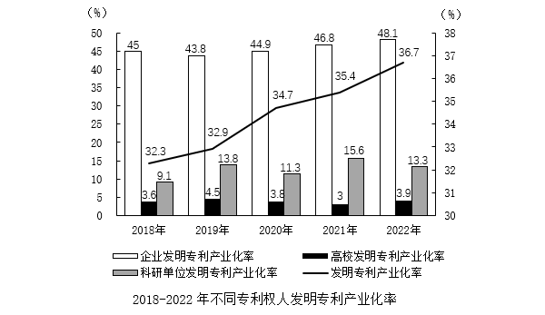
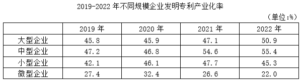
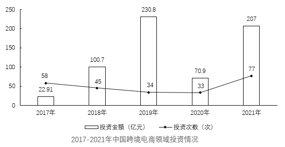
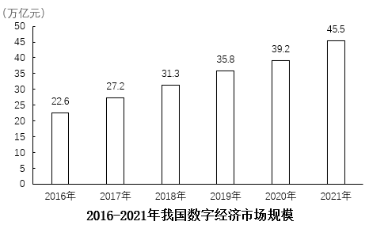

# 2023年山东省公务员录用考试《行测》试题（网友回忆版）

> 资料分析 · 15 题 · 山东 2023

## 材料 1

        2022年，我国发明专利产业化率（专利产业化率是指用于生产出产品并投放市场的专利占全部有效专利的比例）为36.7%，较上年提高1.3个百分点；实用新型专利产业化率为44.9%，较上年降低1.3个百分点；外观设计专利产业化率为58.7%，较上年提高6.4个百分点。

### 第 1 题　qid 5510330 · 增长

2019-2022年，我国发明专利产业化率同比增幅最大的年份是：

- **A**. 2019年
- **B**. 2020年　✅
- **C**. 2021年
- **D**. 2022年

**答案**：B

**官方解析**

根据题干“2019-2022年······同比增幅最大的年份是”，可判定本题为一般增长率问题。定位统计图可得2018-2022年我国发明专利产业化率。根据公式：增长率，则2019-2022年我国发明专利产业化率的同比增幅分别为：2019年：；2020年：；2021年：；2022年：。故2020年的同比增幅最大。

故正确答案为B。

---

### 第 2 题　qid 5510333 · 综合

2021年，外观设计专利产业化率比实用新型专利产业化率高：

- **A**. 6.1个百分点　✅
- **B**. 8.7个百分点
- **C**. 18.9个百分点
- **D**. 21.5个百分点

**答案**：A

**官方解析**

定位文字材料可得：2022年，实用新型专利产业化率为44.9%，较上年降低1.3个百分点；外观设计专利产业化率为58.7%，较上年提高6.4个百分点。则2021年外观设计专利产业化率为58.7%-6.4%=52.3%，实用新型专利产业化率为44.9%+1.3%=46.2%，则2021年，外观设计专利产业化率比实用新型专利产业化率高52.3%-46.2%=6.1%，即高6.1个百分点。
故正确答案为A。

---

### 第 3 题　qid 5510336 · 增长

2019-2022年，企业发明专利产业化率同比增速超过2.7%的有：

- **A**. 1年
- **B**. 2年　✅
- **C**. 3年
- **D**. 4年

**答案**：B

**官方解析**

根据题干“2019-2022年······同比增速超过2.7%的有”，可判定本题为一般增长率问题。定位统计图可得：2018-2022年每年我国企业发明专利产业化率分别为45%、43.8%、44.9%、46.8%和48.1%。根据公式：增长率，则2019-2022年我国企业发明专利产业化率同比增速分别为：2019年：，不符合；2020年：，不符合；2021年：，符合；2022年：，符合。故企业发明专利产业化率同比增速超过2.7%的有2021年和2022年，共2年。

故正确答案为B。

---

### 第 4 题　qid 5510341 · 增长

2021年，不同规模企业发明专利产业化率同比增速最快的是：

- **A**. 大型企业
- **B**. 中型企业　✅
- **C**. 小型企业
- **D**. 微型企业

**答案**：B

**官方解析**

根据题干“······同比增速最快的是”，可判定本题为一般增长率问题。定位表格可知2020年、2021年不同规模企业发明专利产业化率，根据公式：增长率，可得2021年，不同规模企业发明专利产业化率同比增速分别为：大型企业；中型企业；小型企业；微型企业，所以同比增速最快的是中型企业。

故正确答案为B。

---

### 第 5 题　qid 5510342 · 综合

能够从上述资料中推出的是：

- **A**. 2018-2022年，企业发明专利产业化率与高校差距最大的年份是2020年
- **B**. 2019-2022年，科研单位发明专利产业化率同比增幅最大的年份是2021年
- **C**. 2019-2022年，企业发明专利产业化率波动性最大的是小型企业
- **D**. 2020-2022年，大型企业和小型企业发明专利产业化率同比增速差距最大的年份是2022年　✅

**答案**：D

**官方解析**

A项：定位统计图可知：2018-2022年企业发明专利产业化率和高校发明专利产业化率，2020年企业发明专利产业化率与高校的差距=44.9%-3.8%=41.1%，2022年企业发明专利产业化率与高校的差距=48.1%-3.9%=44.2%，故2018-2022年，企业发明专利产业化率与高校差距最大的年份不是2020年，错误；

B项：定位统计图可知：2018-2022年科研单位发明专利产业化率，根据公式：增长率，可得2019年科研单位发明专利产业化率同比增幅，2021年科研单位发明专利产业化率同比增幅，故2019-2022年，科研单位发明专利产业化率同比增幅最大的年份不是2021年，错误；

C项：统计中一般用方差来描述数据的波动性。定位表格可知：2019年-2022年不同规模企业发明专利产业化率，则2019-2022年小型企业发明专利产业化率平均数为，所以其方差为；2019-2022年中型企业发明专利产业化率平均数为，所以其方差为，则小型企业发明专利产业化率的方差比中型企业小，即其波动性更小，错误；

D项：定位表格可知：2019-2022年大型企业和小型企业发明专利产业化率，根据公式：增长率，可得2020-2022年大型企业和小型企业发明专利产业化率同比增速差距依次为：

2020年：大型企业同比增速，小型企业同比增速，差距=9.5%-0.2%=9.3%；

2021年：大型企业同比增速，小型企业同比增速，差距=3.5%-2.6%=0.9%；

2022年：大型企业同比增速，小型企业同比增速，差距=8.1%-（-5%）=13.1%。

比较可知，2020-2022年，大型企业和小型企业发明专利产业化率同比增速差距最大的年份是2022年，正确。

故正确答案为D。

---

## 材料 2

        2021年，中国跨境电商交易规模达14.2万亿元，占我国货物进出口总额的比例为36.3%。其中出口跨境电商交易规模11万亿元，同比增速13.4%；进口跨境电商交易规模3.2万亿元，同比增速14.3%。2017-2022年第一季度，中国跨境电商领域共发生262次投资，投资总金额654.91亿元。

### 第 6 题　qid 5510329 · 综合

2021年，我国全年的货物进出口总额约为多少万亿元？

- **A**. 36
- **B**. 39　✅
- **C**. 42
- **D**. 45

**答案**：B

**官方解析**

根据题干“2021年，我国全年的货物进出口总额约为多少万亿元”，结合材料给出了2021年中国跨境电商交易规模及占我国货物进出口总额的比重，可判定本题为现期比重问题。定位文字材料可得：2021年，中国跨境电商交易规模达14.2万亿元，占我国货物进出口总额的比例为36.3%。根据公式：整体，可得2021年我国全年的货物进出口总额为万亿元。

故正确答案为B。

---

### 第 7 题　qid 5510332 · 比重

2020年，我国出口跨境电商交易规模占跨境电商交易总规模的比重是：

- **A**. 77.6%　✅
- **B**. 88.2%
- **C**. 22.4%
- **D**. 11.8%

**答案**：A

**官方解析**

根据题干“2020年······占······的比重是”，结合材料时间为2021年，可判定本题为基期比重问题。定位文字材料可得：2021年，我国出口跨境电商交易规模11万亿元，同比增速13.4%；进口跨境电商交易规模3.2万亿元，同比增速14.3%。根据公式：基期量，则2020年我国出口跨境电商交易规模为万亿元，进口跨境电商交易规模为万亿元。根据公式：比重，则题干所求为。

故正确答案为A。

---

### 第 8 题　qid 5510334 · 增长

2021年，我国跨境电商交易规模同比增长：

- **A**. 12.8%
- **B**. 13.4%
- **C**. 13.6%　✅
- **D**. 14.3%

**答案**：C

**官方解析**

方法一：根据题干“2021年······同比增长”，结合选项为百分数，可判定本题为一般增长率问题。定位文字材料可得：2021年，中国跨境电商交易规模达14.2万亿元；根据本篇材料第2题可得：2020年，中国出口跨境电商交易规模为9.7万亿元，进口跨境电商交易规模为2.8万亿元。则2020年，我国跨境电商交易规模为9.7+2.8=12.5万亿元，根据公式：增长率，可得所求为。

方法二：根据题干“2021年，我国跨境电商交易规模同比增长”，结合选项为百分数，且材料给出了2021年中国进、出口跨境电商交易规模及同比增速，可判定本题为混合增长率问题。定位文字材料可得：2021年，中国跨境电商交易规模达14.2万亿元。其中出口跨境电商交易规模11万亿元，同比增速13.4%；进口跨境电商交易规模3.2万亿元，同比增速14.3%。根据混合增长率口诀“混合后居中”，可得2021年我国跨境电商交易规模同比增速在13.4%~14.3%之间，只有C项满足。

故正确答案为C。

---

### 第 9 题　qid 5510337 · 平均数

2017-2021年，每年平均单次投资金额高于2017-2022年第一季度投资总金额与投资次数之比的年份是：

- **A**. 2018年和2019年
- **B**. 2018年和2020年
- **C**. 2019年和2020年
- **D**. 2019年和2021年　✅

**答案**：D

**官方解析**

根据题干“······每年平均单次······高于······与······之比的年份是”，可判定本题为比值比较问题。定位文字材料可得：2017-2022年第一季度，中国跨境电商领域共发生262次投资，投资总金额654.91亿元。定位统计图可得2017-2021年，每年的我国跨境电商领域投资金额与投资次数。根据公式：平均单次投资金额，则2018-2021年，我国跨境电商领域每年平均单次投资金额分别是：

2018年：亿元/次；

2019年：亿元/次；

2020年：亿元/次；

2021年：亿元/次。

而2017-2022年第一季度投资总金额与投资次数之比为亿元/次，故符合题干要求的年份是2019年和2021年。

故正确答案为D。

---

### 第 10 题　qid 5510340 · 综合

能够从上述资料中推出的是：

- **A**. 2021年，中国跨境电商出口增速快于进口
- **B**. 2017-2021年，我国跨境电商领域投资次数呈持续下滑态势
- **C**. 2021年，我国跨境电商交易额约占当年我国货物进出口总额的一半
- **D**. 中国跨境电商领域2020年投资金额不及2019年投资金额的三分之一　✅

**答案**：D

**官方解析**

A项：定位文字材料可得：2021年，中国出口跨境电商交易规模11万亿元，同比增速13.4%；进口跨境电商交易规模3.2万亿元，同比增速14.3%。出口增速（13.4%）慢于进口增速（14.3%），错误；

B项：定位统计图可得：2017-2021年，我国跨境电商领域投资次数分别是：58、45、34、33和77，2021年投资次数大于2020年，并非呈持续下滑态势，错误；

C项：定位文字材料可得：2021年，中国跨境电商交易规模达14.2万亿元，占我国货物进出口总额的比例为36.3%。并非一半（50%），错误；

D项：定位统计图可得：2019年和2020年中国跨境电商领域投资金额分别为230.8亿元和70.9亿元，70.9亿元亿元，正确。

故正确答案为D。

---

## 材料 3

        2021年全球47个国家数字经济市场规模达到38.1万亿美元，同比增长15.6%，高于GDP增速2.5个百分点，占GDP比重为45.0%，同比提升1个百分点。数字产业化规模为5.7万亿美元；产业数字化规模为32.4万亿美元，占数字经济比重为85%，占GDP比重较上年提升1个百分点，约为38.2%。

        2021年我国数字经济市场规模达45.5万亿元，同比增长16.2%，高于GDP增速3.4个百分点，占GDP比重达到39.8%。数字产业化规模为8.35万亿元，同比增长11.9%，占GDP比重为7.3%。产业数字化规模达到37.2万亿元，同比增长17.2%，占GDP比重为32.5%。

### 第 11 题　qid 5510335 · 平均数

已知2021年全年人民币平均汇率约为1美元兑6.5元人民币，则2021年我国数字经济市场规模占全球47国的比重是：

- **A**. 16.8%
- **B**. 17.5%
- **C**. 18.4%　✅
- **D**. 21.6%

**答案**：C

**官方解析**

根据题干“······2021年······占······的比重是”，结合材料时间为2021年，可判定本题为现期比重问题。定位文字材料第一段可得：在2021年全球47个国家数字经济市场规模达到38.1万亿美元；定位文字材料第二段可得：2021年我国数字经济市场规模达45.5万亿元。结合题干“已知2021年全年人民币平均汇率约为1美元兑6.5元人民币”，根据公式：比重，则所求。

故正确答案为C。

---

### 第 12 题　qid 5510339 · 增长

2018-2021年，我国数字经济市场规模同比增速最快的是：

- **A**. 2018年
- **B**. 2019年
- **C**. 2020年
- **D**. 2021年　✅

**答案**：D

**官方解析**

根据题干“2018-2021年······同比增速最快的是”，可判定本题为一般增长率问题。定位文字材料第二段可得2021年我国数字经济市场规模同比增长16.2%，定位统计图可知2017-2020年我国数字经济市场规模。根据公式：增长率，则2018-2020年，我国数字经济市场规模同比增速分别为：2018年：；2019年：；2020年：；综上可知，2018-2021年，我国数字经济市场规模同比增速最快的是2021年（16.2%）。

故正确答案为D。

---

### 第 13 题　qid 5510343 · 比重

2021年，全球47国数字产业化规模、产业数字化规模占GDP比重的差值约：

- **A**. 10%~15%
- **B**. 16%~21%
- **C**. 22%~27%
- **D**. 28%~33%　✅

**答案**：D

**官方解析**

根据题干“2021年，······占······比重的差值约”，可判定本题为现期比重问题。定位文字材料第一段可知：2021年全球47个国家数字经济市场规模达到38.1万亿美元，占GDP比重为45.0%，数字产业化规模为5.7万亿美元；产业数字化规模为32.4万亿美元，占GDP比重约为38.2%。

方法一：根据公式：整体，则2021年，全球47国GDP万亿美元。根据公式：比重，则2021年，全球47国数字产业化规模、产业数字化规模占GDP比重的差值，在D项范围内。

方法二：根据5.7+32.4=38.1可知，数字经济市场规模=数字产业化规模+产业数字化规模，则数字经济市场规模占GDP比重=数字产业化规模占GDP比重+产业数字化规模占GDP比重，故数字产业化规模占GDP比重=45%-38.2%=6.8%，那么，所求的比重差值=38.2%-6.8%=31.4%，在D项范围内。

故正确答案为D。

---

### 第 14 题　qid 5510344 · 比重

2021年，我国产业数字化规模占数字经济市场规模的比重比2020年提升了：

- **A**. 0.6个百分点
- **B**. 0.7个百分点　✅
- **C**. 0.8个百分点
- **D**. 0.9个百分点

**答案**：B

**官方解析**

根据题干“2021年······占······的比重比2020年提升了”，结合选项为“百分点”，可判定本题为两期比重问题。定位文字材料第二段可得：2021年我国数字经济市场规模达45.5万亿元（B），同比增长16.2%（b）；产业数字化规模达到37.2万亿元（A），同比增长17.2%（a）。根据公式：两期比重差，则所求比重差，即提升了约0.7个百分点。

故正确答案为B。

---

### 第 15 题　qid 5510345 · 综合

能够从上述资料中推出的是：

- **A**. 2020年，全球47国数字经济市场规模占GDP的比重比我国高6.5个百分点
- **B**. 2021年，全球47国数字产业化规模占数字经济市场规模的比重高于我国
- **C**. 2021年，我国GDP同比增速比全球47国高0.3个百分点
- **D**. 2021年，我国产业数字化规模占GDP的比重与2020年相差1.2个百分点　✅

**答案**：D

**官方解析**

A项：定位文字材料第一段可得：2021年全球47个国家数字经济市场规模达到38.1万亿美元，占GDP比重为45.0%，同比提升1个百分点。则2020年，全球47国数字经济市场规模占GDP的比重为45.0%-1%=44%；定位文字材料第二段可得：2021年我国数字经济市场规模达45.5万亿元，同比增长16.2%（a），高于GDP增速3.4个百分点，占GDP比重达到39.8%（）。则2021年我国GDP同比增速为16.2%-3.4%=12.8%（b）。根据公式：基期比重，则2020年我国数字经济市场规模占GDP的比重为，44%-38.8%=5.2%，即前者比后者高5.2个百分点，错误；

B项：定位文字材料第一段可得：2021年全球47个国家数字经济市场规模达到38.1万亿美元，数字产业化规模为5.7万亿美元。根据公式：比重，则2021年，全球47国数字产业化规模占数字经济市场规模的比重为；定位文字材料第二段可得：2021年我国数字经济市场规模达45.5万亿元，数字产业化规模为8.35万亿元。则2021年，我国数字产业化规模占数字经济市场规模的比重为，15%&lt;18%，即前者低于后者，错误；

C项：定位文字材料第一段可得：2021年全球47个国家数字经济市场规模达到38.1万亿美元，同比增长15.6%，高于GDP增速2.5个百分点。则2021年，全球47国GDP同比增速为15.6%-2.5%=13.1%；根据本题A项可得：2021年，我国GDP同比增速为12.8%，12.8%-13.1%=-0.3%，即2021年，我国GDP同比增速比全球47国低0.3个百分点，错误；

D项：定位文字材料第二段可得：2021年我国产业数字化规模达到37.2万亿元（A），同比增长17.2%（a），占GDP比重为32.5%（）。根据本题A项可得：2021年，我国GDP同比增速为12.8%（b）。根据公式：两期比重差，则2021年，我国产业数字化规模占GDP的比重与2020年相差，即相差1.2个百分点，正确。

故正确答案为D。

---
