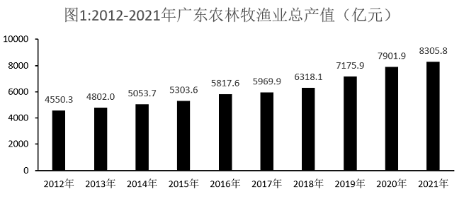
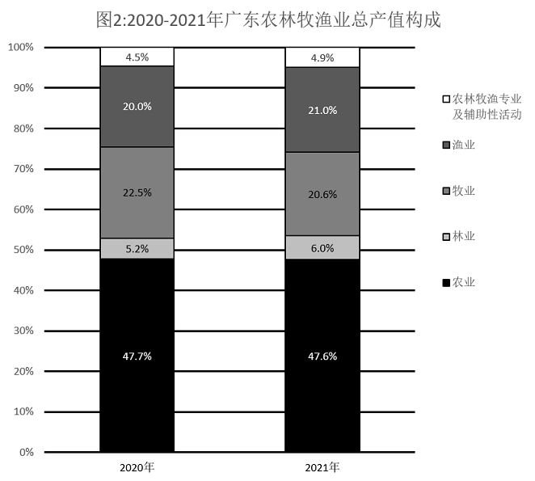
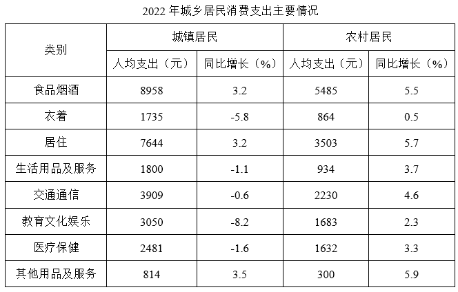
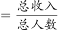
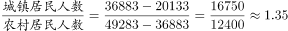
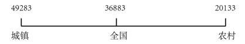

# 2023年广东省公务员录用考试《行测》题（乡镇卷）（网友回忆版）

> 资料分析 · 15 题 · 广东 2023

## 材料 1

### 第 1 题　qid 5514921 · 综合

（      ）广东农林牧渔业总产值首次突破了5000亿元。

- **A**. 2014年　✅
- **B**. 2015年
- **C**. 2017年
- **D**. 2018年

**答案**：A

**官方解析**

定位图1可得：2013年广东农林牧渔业总产值为4802.0亿元，2014年为5053.7亿元。则2014年广东农林牧渔业总产值首次突破了5000亿元。
故正确答案为A。

---

### 第 2 题　qid 5514929 · 综合

2021年广东农林牧渔业总产值约为9年前的（    ）倍。

- **A**. 1.2
- **B**. 1.4
- **C**. 1.6
- **D**. 1.8　✅

**答案**：D

**官方解析**

根据题干“2021年······约为9年前的······倍”，结合9年前为2021-9=2012年，可判定本题为现期倍数问题。定位图1可得：2012年广东农林牧渔业总产值为4550.3亿元，2021年为8305.8亿元。则题干所求倍数。

故正确答案为D。

---

### 第 3 题　qid 5514931 · 增长

2017-2021年间，广东农林牧渔业总产值年均增加约（    ）亿元。

- **A**. 415
- **B**. 467
- **C**. 584　✅
- **D**. 779

**答案**：C

**官方解析**

根据题干“2017-2021年间，广东农林牧渔业总产值年均增加······亿元”，可判定本题为年均增长量问题。定位图1可得：2017、2021年广东农林牧渔业总产值分别为5969.9亿元、8305.8亿元。根据公式：年均增长量，则所求亿元。

故正确答案为C。

---

### 第 4 题　qid 5514933 · 增长

2021年广东林业产值同比增长率（    ）。

- **A**. 小于5%
- **B**. 在5%-10%之间
- **C**. 在10%-15%之间
- **D**. 大于15%　✅

**答案**：D

**官方解析**

根据题干“2021年广东林业产值同比增长率”，可判定本题为一般增长率问题。定位图1可得：2020、2021年广东农林牧渔业总产值分别为7901.9亿元、8305.8亿元。定位图2可得：2020、2021年广东林业产值占比分别为5.2%、6.0%。根据公式：部分=整体×比重，可知2020年广东林业产值亿元，2021年广东林业产值亿元。根据公式：增长率，则所求，在D项范围内。

故正确答案为D。

---

### 第 5 题　qid 5514932 · 综合

根据资料，下列说法正确的是（    ）。

- **A**. 2016-2021年间，广东农林牧渔业总产值年均增长率约为20%
- **B**. 2020年和2021年，广东农林牧渔专业及辅助性活动产值均高于300亿元　✅
- **C**. 与2020年相比，2021年广东农业各类产业的产值均有所增加
- **D**. 与2020年相比，2021年广东农业、林业和渔业产值在农业总产值中的比重均有所增加

**答案**：B

**官方解析**

A项：定位图1可得，2016年与2021年广东农林牧渔业总产值分别为5817.6亿元和8305.8亿元。根据公式：，可得，错误；

B项：定位图1可得，2020年与2021年广东农林牧渔业总产值分别为7901.9亿元和8305.8亿元；定位图2可得，2020年和2021年，广东农林牧渔专业及辅助性活动产值在农林牧渔业总产值中的比重分别为4.5%和4.9%。根据公式：部分=整体×比重，则2020年广东农林牧渔专业及辅助性活动产值亿元，2021年该产值亿元，均高于300亿元，正确；

C项：定位图1可得，2020年与2021年广东农林牧渔业总产值分别为7901.9亿元和8305.8亿元；定位图2可得，2020年和2021年，广东牧业产值在农林牧渔业总产值中的比重分别为22.5%和20.6%。根据公式：部分=整体×比重，则2020年广东牧业产值亿元；2021年该产值亿元，即与2020年相比，2021年该产值有所减少，错误；

D项：定位图2可得，2020年广东农业、林业和渔业产值在农林牧渔业总产值中的比重分别为47.7%、5.2%和20.0%；2021年这三类产业产值在农林牧渔业总产值中的比重分别为47.6%、6.0%和21.0%。比较可知，与2020年相比，2021年广东农业产值在农业总产值中的比重有所减少，错误。

故正确答案为B。

---

## 材料 2

        2021年，广东省财政科学技术支出为982.76亿元，占当年全省财政一般公共预算支出的比重为5.4%。其中，省本级财政科学技术支出为102.05亿元，占省本级财政一般公共预算支出的比重为6.6%，同比增加0.84个百分点。珠江三角洲核心区财政科学技术支出845.09亿元，同比增长2.6%。

### 第 6 题　qid 5514955 · 增长

2021年，广东省财政科学技术支出比上年提高了（    ）亿元。

- **A**. 7.03
- **B**. 17.03
- **C**. 27.03　✅
- **D**. 37.03

**答案**：C

**官方解析**

根据题干“2021年······比上年提高了······亿元”，可判定本题为增长量计算问题。定位表1可得：2020、2021年广东省财政科学技术支出分别为955.73亿元、982.76亿元。根据公式：增长量=现期量-基期量，则所求=982.76-955.73=27.03亿元。
故正确答案为C。

---

### 第 7 题　qid 5510304 · 增长

2021年，以下经济区域财政科学技术支出同比增长率最高的是（    ）。

- **A**. 珠江三角洲核心区
- **B**. 沿海经济带东翼地区　✅
- **C**. 沿海经济带西翼地区
- **D**. 北部生态发展区

**答案**：B

**官方解析**

根据题干“2021年······同比增长率最高的是”，可判定本题为一般增长率问题。定位文字材料，可知2021年广东省珠江三角洲核心区财政科学技术支出同比增长2.6%；定位表1，可知2020年、2021年广东省沿海经济带东翼地区、沿海经济带西翼地区和北部生态发展区的财政科学技术支出情况。则2021年广东省各经济区域财政科学技术支出：珠江三角洲核心区同比增长率=2.6%；根据公式：增长率，沿海经济带东翼地区同比增长率，沿海经济带西翼地区同比增长率，北部生态发展区同比增长率。比较可知，同比增长率最高的是沿海经济带东翼地区。

故正确答案为B。

---

### 第 8 题　qid 5514959 · 综合

2020年广东省省本级财政科学技术支出（    ）。

- **A**. 在60-80亿元之间
- **B**. 在80-100亿元之间　✅
- **C**. 在100-120亿元之间
- **D**. 超过120亿元

**答案**：B

**官方解析**

定位文字资料可知：2021年广东省省本级财政科学技术支出为102.05亿元；定位统计表1可知：2021年广东省各经济区域财政科学技术支出情况。由2021年数据可知，全省财政科学技术支出=各经济区域财政科学技术支出+省本级财政科学技术支出。定位统计表1可知：2020年，广东省全省财政科学技术支出为955.73亿元，各经济区域财政科学技术支出分别为823.41亿元、12.98亿元、8.69亿元、26.69亿元。则2020年广东省省本级财政科学技术支出=955.73-823.41-12.98-8.69-26.69=83.96，在B项范围内。
故正确答案为B。

---

### 第 9 题　qid 5510306 · 增长

2021年，以下分类科目财政科学技术支出同比增加值最多的是（    ）。

- **A**. 基础研究
- **B**. 技术研究与开发
- **C**. 科技条件与服务
- **D**. 科技重大项目　✅

**答案**：D

**官方解析**

根据题干“2021年······同比增加值最多的是”，可判定本题为增长量比较问题。定位统计表2可得2021年和2020年各分类科目财政科学技术支出情况。根据公式：增长量=现期量-基期量，则2021年以下四类科目财政科学技术支出的同比增加值分别为：基础研究：124.75-116.01=8.74亿元；技术研究与开发：184.08-233.79=-49.71亿元；科技条件与服务：54.56-44.55=10.01亿元；科技重大项目：71.21-58.20=13.01亿元。比较可知，同比增加值最多的是科技重大项目。
故正确答案为D。

---

### 第 10 题　qid 5514964 · 综合

根据资料，下列说法有误的是（    ）。

- **A**. 2021年，广东省财政一般公共预算支出超过了2万亿元　✅
- **B**. 2021年，广东省省本级财政一般公共预算支出超过了1000亿元
- **C**. 2020年和2021年，其他科学技术支出在广东省财政科学技术支出中的比重均未超过一半
- **D**. 与2020年相比，2021年科学技术普及支出在广东省财政科学技术支出中的比重略有增加

**答案**：A

**官方解析**

A项：定位文字资料可知，2021年，广东省财政科学技术支出为982.76亿元，占当年全省财政一般公共预算支出的比重为5.4%。根据公式：整体，可得2021年，广东省财政一般公共预算支出，错误；

B项：定位文字资料可知，2021年，省本级财政科学技术支出为102.05亿元，占省本级财政一般公共预算支出的比重为6.6%。根据公式：整体，可得2021年，广东省省本级财政一般公共预算支出，正确；

C项：定位统计表1可知，2020年和2021年广东省财政科学技术支出分别为955.73亿元、982.76亿元；定位统计图2可知，2020年和2021年广东省其他科学技术支出分别为406.92亿元、468.42亿元。根据公式：比重，可得2020年其他科学技术支出在广东省财政科学技术支出中的比重；2021年其他科学技术支出在广东省财政科学技术支出中的比重，比重均小于50%，正确；

D项：定位统计表1可知，2020年和2021年广东省财政科学技术支出分别为955.73亿元、982.76亿元；定位统计图2可知，2020年和2021年广东省科学技术普及支出分别为9.20亿元、13.06亿元。根据公式：比重，可得2020年和2021年科学技术普及支出在广东省财政科学技术支出中的比重分别为、。，即与2020年相比，2021年科学技术普及支出在广东省财政科学技术支出中的比重略有增加，正确。

本题为选非题，故正确答案为A。

---

## 材料 3

        2022年，全国居民人均可支配收入36883元，比上年增长（以下如无特别说明，均为同比名义增长）5.0%。分城乡看，城镇居民人均可支配收入49283元，增长3.9%；农村居民人均可支配收入20133元，增长6.3%。

        2022年，全国居民人均消费支出24538元，比上年增长1.8%。分城乡看，城镇居民人均消费支出30391元，增长0.3%；农村居民人均消费支出16632元，增长4.5%。

### 第 11 题　qid 5514954 · 平均数

2021年，全国居民人均可支配收入约为（    ）万元。

- **A**. 3.33
- **B**. 3.42
- **C**. 3.51　✅
- **D**. 3.60

**答案**：C

**官方解析**

根据题干“2021年，全国居民人均可支配收入约为······”，结合材料时间为2022年，可判定本题为基期计算问题。定位文字材料第一段可得，2022年，全国居民人均可支配收入36883元，比上年增长5.0%。根据公式：基期量，可得2021年全国居民人均可支配收入为。

故正确答案为C。

---

### 第 12 题　qid 5514956 · 平均数

2022年，城镇居民人均可支配收入较消费支出多（    ）元。

- **A**. 3501
- **B**. 7906
- **C**. 12545
- **D**. 18892　✅

**答案**：D

**官方解析**

定位文字材料第一段可得，2022年······城镇居民人均可支配收入49283元；定位文字材料第二段可得，2022年······城镇居民人均消费支出30391元。故2022年城镇居民人均可支配收入较消费支出多49283-30391=18892元。
故正确答案为D。

---

### 第 13 题　qid 5514960 · 增长

2022年，表中所呈现的农村居民消费支出的类别中，同比增加超过120元的有（    ）项。

- **A**. 1
- **B**. 2　✅
- **C**. 3
- **D**. 4

**答案**：B

**官方解析**

根据题干“······同比增加超过120元······”，可判定本题为增长量比较问题。定位统计表可得2022年农村居民各类别的消费支出和同比增速。根据公式：增长量，可得食品烟酒同比增量元；衣着同比增量元；居住同比增量元；生活用品及服务同比增量元；交通通信同比增量元；教育文化娱乐同比增量元；医疗保健同比增量元；其他用品及服务同比增量元。比较可知，食品烟酒类、居住类的农村居民消费支出同比增加超过120元，共2项。

故正确答案为B。

---

### 第 14 题　qid 5514966 · 综合

2022年，我国城镇居民与农村居民人数之比最接近（    ）。

- **A**. 2：3
- **B**. 3：2
- **C**. 3：4
- **D**. 4：3　✅

**答案**：D

**官方解析**

根据题干“······城镇居民与农村居民人数之比······”，可判定本题为比值计算问题。定位文字材料第一段可得，2022年，全国居民人均可支配收入36883元，城镇居民人均可支配收入49283元；农村居民人均可支配收入20133元。因为城镇人数+农村人数=全国人数，且人均可支配收入，故可利用混合比例求解。根据线段法：距离与量（人数）成反比，可得，与4：3最接近。

故正确答案为D。

---

### 第 15 题　qid 5514968 · 综合

根据资料，下列说法正确的是（    ）。

- **A**. 2022年，农村居民人均可支配收入较去年增加上千元　✅
- **B**. 2021年，全国居民人均消费支出首次超过了2.4万元
- **C**. 与2021年相比，2022年城镇居民在衣着上的消费支出减少最多
- **D**. 2021年，无论在城镇还是农村，居民消费支出的重点都是食品烟酒支出和医疗保健支出

**答案**：A

**官方解析**

A项：定位文字材料第一段可得，2022年农村居民人均可支配收入20133元，增长6.3%。则农村居民人均可支配收入同比增量元元，正确；

B项：定位文字材料第二段可得，2022年，全国居民人均消费支出24538元，比上年增长1.8%。则2021年全国居民人均消费支出元，但材料未给出2020年相关数据，无法推出在2021年是否“首次”超过了2.4万元，错误；

C项：定位统计表可得，2022年城镇居民各类型消费支出及同比增速，其中衣着人均支出为1735元，同比增速为-5.8%；教育文化娱乐人均支出为3050元，同比增速为-8.2%。根据增长量比较口诀“大大则大”，可得教育文化娱乐人均支出的现期量和降幅均大于衣着，故前者减少量大于后者，错误；

D项：定位统计表可得，2022年城镇居民各类型消费支出及同比增速，其中居住人均支出为7644元，同比增速为3.2%；医疗保健人均支出为2481元，同比增速为-1.6%。根据公式：基期量，可得2021年居住人均支出元，医疗保健人均支出元，2021年居住人均支出大于医疗保健人均支出，故城镇居民消费支出的重点不包含医疗保健支出，错误。

故正确答案为A。

---
