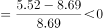
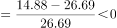
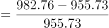
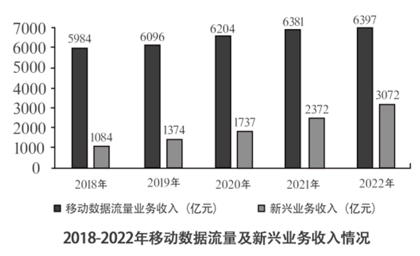
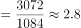
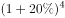
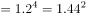
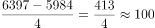
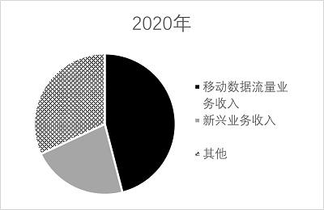
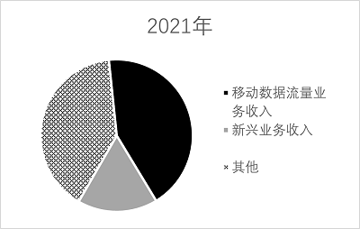

# 2023年广东省公务员录用考试《行测》题（县级卷）（网友回忆版）

> 资料分析 · 15 题 · 广东 2023

## 材料 1

        2021年，广东省财政科学技术支出为982.76亿元，占当年全省财政一般公共预算支出的比重为5.4%。其中，省本级财政科学技术支出为102.05亿元，占省本级财政一般公共预算支出的比重为6.6%，同比增加0.84个百分点。珠江三角洲核心区财政科学技术支出845.09亿元，同比增长2.6%。

### 第 1 题　qid 5510303 · 综合

2020年，广东省省本级财政科学技术支出为（    ）亿元。

- **A**. 83.96　✅
- **B**. 102.64
- **C**. 122.32
- **D**. 132.67

**答案**：A

**官方解析**

定位表1，可知2020年广东省各经济区域财政科学技术支出情况。根据省本级=全省-珠江三角洲核心区-沿海经济带东翼地区-沿海经济带西翼地区-北部生态发展区，可得：2020年广东省省本级财政科学技术支出=955.73-823.41-12.98-8.69-26.69=83.96亿元。
故正确答案为A。
注：根据文字和表1材料中2021年的财政科学技术支出数据，可推算出省本级（102.05）=全省（982.76）-珠江三角洲核心区（845.09）-沿海经济带东翼地区（15.22）-沿海经济带西翼地区（5.52）-北部生态发展区（14.88）。

---

### 第 2 题　qid 5510304 · 增长

2021年，以下经济区域财政科学技术支出同比增长率最高的是（    ）。

- **A**. 珠江三角洲核心区
- **B**. 沿海经济带东翼地区　✅
- **C**. 沿海经济带西翼地区
- **D**. 北部生态发展区

**答案**：B

**官方解析**

根据题干“2021年······同比增长率最高的是”，可判定本题为一般增长率问题。定位文字材料，可知2021年广东省珠江三角洲核心区财政科学技术支出同比增长2.6%；定位表1，可知2020年、2021年广东省沿海经济带东翼地区、沿海经济带西翼地区和北部生态发展区的财政科学技术支出情况。则2021年广东省各经济区域财政科学技术支出：珠江三角洲核心区同比增长率=2.6%；根据公式：增长率，沿海经济带东翼地区同比增长率，沿海经济带西翼地区同比增长率，北部生态发展区同比增长率。比较可知，同比增长率最高的是沿海经济带东翼地区。

故正确答案为B。

---

### 第 3 题　qid 5510305 · 比重

2021年，广东省省本级财政一般公共预算支出在全省财政一般公共预算支出中的比重（    ）。

- **A**. 小于5%
- **B**. 在5%~10%之间　✅
- **C**. 在10%~15%之间
- **D**. 大于15%

**答案**：B

**官方解析**

根据题干“2021年······在······中的比重······”，可判定本题为现期比重问题。定位文字材料，可知2021年广东省财政科学技术支出为982.76亿元，占当年全省财政一般公共预算支出的比重为5.4%；省本级财政科学技术支出为102.05亿元，占省本级财政一般公共预算支出的比重为6.6%。根据公式：整体，则2021年广东省全省财政一般公共预算支出，2021年广东省省本级财政一般公共预算支出。根据公式：比重，则所求比重，在B项范围内。

故正确答案为B。

---

### 第 4 题　qid 5510306 · 增长

2021年，以下分类科目财政科学技术支出同比增加值最多的是（    ）。

- **A**. 基础研究
- **B**. 技术研究与开发
- **C**. 科技条件与服务
- **D**. 科技重大项目　✅

**答案**：D

**官方解析**

根据题干“2021年······同比增加值最多的是”，可判定本题为增长量比较问题。定位统计表2可得2021年和2020年各分类科目财政科学技术支出情况。根据公式：增长量=现期量-基期量，则2021年以下四类科目财政科学技术支出的同比增加值分别为：基础研究：124.75-116.01=8.74亿元；技术研究与开发：184.08-233.79=-49.71亿元；科技条件与服务：54.56-44.55=10.01亿元；科技重大项目：71.21-58.20=13.01亿元。比较可知，同比增加值最多的是科技重大项目。
故正确答案为D。

---

### 第 5 题　qid 5510307 · 综合

根据资料，以下关于广东省财政支出的说法正确的是（    ）。

- **A**. 2020年和2021年，全省财政一般公共预算支出均小于2万亿元
- **B**. 2020年，全省省本级财政科学技术支出占省本级财政一般公共预算支出的比重为7.44%
- **C**. 与2020年相比，2021年珠江三角洲核心区财政科学技术支出在全省财政科学技术支出中的比重略有下降　✅
- **D**. 与2020年相比，2021年在全省财政科学技术支出中比重有所增加的分类科目有7个

**答案**：C

**官方解析**

A项：材料中未给出2020年全省财政一般公共预算支出的相关数据，无法推出2020年全省财政一般公共预算支出是否小于2万亿元，错误；

B项：定位文字材料可得，（2021年）省本级财政科学技术支出为102.05亿元，占省本级财政一般公共预算支出的比重为6.6%，同比增加0.84个百分点。则2020年省本级财政科学技术支出占省本级财政一般公共预算支出的比重为6.6%-0.84%=5.76%，非7.44%，错误；

C项：定位文字材料可得，（2021年）珠江三角洲核心区财政科学技术支出同比增长2.6%（a）。定位统计表1可得，2020年、2021年全省财政科学技术支出分别为955.73亿元、982.76亿元。根据公式：增长率，则2021年全省财政科学技术支出同比增速（b）。结合两期比重比较结论，当部分增长率（a）＜整体增长率（b）时，则比重下降，2.6%（a）＜2.8%（b），正确；

D项：定位统计表1、表2可得2020年、2021年全省财政科学技术支出和各分类科目财政科学技术支出。根据本题C项可确定全省财政科学技术支出同比增速（b）=2.8%。观察表2可知，2021年财政科学技术支出同比实现正增长的科目有：基础研究（124.75亿元＞116.01亿元）、科技条件与服务（54.56亿元＞44.55亿元）、科学技术普及（13.06亿元＞9.20亿元）、科技交流与合作（4.48亿元＞4.25亿元）、科技重大项目（71.21亿元＞58.20亿元）、其他科学技术支出（468.42＞406.92），即各分类科目同比增速（a）＞0的科目只有6个，由此可知同比增速超过全省财政科学技术支出增速（2.8%）的科目不超过6个。根据“两期比重比较结论”可知，当部分增长率（a）＞整体增长率（b）时，则比重上升，即在全省财政科学技术支出中比重有所增加的分类科目不超过6个，错误。

故正确答案为C。

---

## 材料 2

        2022年，全国居民人均可支配收入36883元，比上年增长（以下如无特别说明，均为同比名义增长）5.0%。分城乡看，城镇居民人均可支配收入49283元，增长3.9%；农村居民人均可支配收入20133元，增长6.3%。

        按收入来源分，2022年，全国居民人均工资性收入20590元，增长4.9%；人均经营性收入6175元，增长4.8%；人均财产净收入3227元，增长4.9%；人均转移净收入6892元，增长5.5%。

        2022年，全国居民人均消费支出24538元，比上年增长1.8%。分城乡看，城镇居民人均消费支出30391元，增长0.3%；农村居民人均消费支出16632元，增长4.5%。

### 第 6 题　qid 5510308 · 平均数

2022年，农村居民人均可支配收入中，所占比例明显高于城镇居民的是（    ）。

- **A**. 工资性收入
- **B**. 经营净收入　✅
- **C**. 财产净收入
- **D**. 转移净收入

**答案**：B

**官方解析**

根据题干“2022年······所占比例明显高于······”，可判定本题为现期比重问题。定位文字材料第一段可得：2022年，城镇居民人均可支配收入49283元；农村居民人均可支配收入20133元。定位统计图可得：2022年城镇居民与农村居民的工资性收入、经营净收入、财产净收入及转移净收入情况。

方法一：根据公式：比重。

A项：城镇居民工资性收入比重、农村居民工资性收入比重，城镇＞农村，不符合；

B项：城镇居民经营净收入比重、农村居民经营净收入比重，34.6%-11.3%=23.3%，即农村居民经营净收入比重高于城镇23.3个百分点；

C项：城镇居民财产净收入比重、农村居民财产净收入比重，城镇＞农村，不符合；

D项：城镇居民转移净收入比重、农村居民转移净收入比重，20.9%-18.0%=2.9%，即农村居民转移净收入比重高于城镇2.9个百分点。

比较可知，农村居民人均可支配收入中，所占比例明显高于城镇居民的是经营净收入。

方法二：根据公式：比重。

人均可支配收入：农村居民20133元＜城镇居民49283元；部分收入中只有居民经营净收入：农村居民6972元＞城镇居民5584元。结合分数比较技巧：分子大分母小，则分数必然大。因此农村居民人均可支配收入中，所占比例明显高于城镇居民的是经营净收入。

故正确答案为B。

---

### 第 7 题　qid 5510309 · 平均数

2022年，除其他用品及服务外，我国城乡居民人均消费支出最少的类别是（    ）。

- **A**. 衣着　✅
- **B**. 生活用品及服务
- **C**. 教育文化娱乐
- **D**. 医疗保健

**答案**：A

**官方解析**

根据题干“2022年······城乡居民人均消费支出”，可判定本题为现期平均数问题。定位统计表可得2022年各类城乡居民人均消费支出情况。根据城乡居民人均消费支出，由于城镇居民人数和农村居民人数均为定值，且在2022年各类城乡居民消费支出中，除其他用品及服务外，衣着的城镇居民人均消费支出（1735元）和农村居民人均消费支出（864元），都是人均消费支出中最少的类别。分析可得：除其他用品及服务外，我国城乡居民人均消费支出最少的类别是衣着。

故正确答案为A。

---

### 第 8 题　qid 5510310 · 平均数

2022年，全国居民人均收支盈余比上一年（    ）。（注：收支盈余=收入-消费支出）

- **A**. 增加了约5%
- **B**. 减少了约5%
- **C**. 增加了约12%　✅
- **D**. 减少了约12%

**答案**：C

**官方解析**

方法一：根据题干“2022年······比上一年”，结合选项为“增加了/减少了+百分数”，可判定本题为一般增长率问题。定位文字材料第一、三段可得：2022年，全国居民人均可支配收入36883元，比上年增长5.0%；2022年，全国居民人均消费支出24538元，比上年增长1.8%。根据 “收支盈余=收入-消费支出”，可得2022年全国居民人均收支盈余=36883-24538=12345元。根据公式：基期量，可得2021年全国居民人均收支盈余元。根据公式：增长率，则题干所求。

方法二：根据题干“2022年······比上一年”，结合选项为“增加了/减少了+百分数”，且收入=收支盈余+消费支出，即收支盈余与消费支出是收入的两个部分，可判定本题为混合增长率问题。根据混合增长率口诀“混合后居中”，可知，即，只有C项满足。

故正确答案为C。

---

### 第 9 题　qid 5510311 · 综合

2022年，我国城镇居民与农村居民人数之比最接近（    ）。

- **A**. 2：3
- **B**. 3：2
- **C**. 3：4
- **D**. 4：3　✅

**答案**：D

**官方解析**

根据题干“2022年，我国城镇居民与农村居民人数之比最接近”，可判定本题为比值计算问题。定位文字材料第一段可得：2022年，全国居民人均可支配收入36883元······城镇居民人均可支配收入49283元······农村居民人均可支配收入20133元。根据人均可支配收入，可利用混合平均数解题。根据线段法：“距离与量成反比”，可得2022年，我国城镇居民人数：农村居民人数=（36883-20133）：（49283-36883）=16750：12400。

故正确答案为D。

---

### 第 10 题　qid 5510312 · 综合

根据资料，下列说法正确的是（    ）。

- **A**. 2022年，全国居民人均工资性收入增长主要由农村居民贡献
- **B**. 2021年，与城镇居民相比，农村居民的人均可支配收入中用于消费支出的比例更大　✅
- **C**. 与2021年相比，2022年城镇居民在居住上的消费支出增加值最大
- **D**. 2021年，无论在城镇还是农村，居民消费支出的重点都是食品烟酒和交通通信支出

**答案**：B

**官方解析**

A项：材料没有给出2022年全国城镇居民、农村居民人均工资性收入同比增长的相关数据，故无法判断2022年全国居民人均工资性收入增长是否主要由农村居民贡献，错误；

B项：定位文字材料第一段，2022年城镇居民人均可支配收入49283元（），增长3.9%（）；农村居民人均可支配收入20133元（），增长6.3%（）。定位文字材料第三段，城镇居民人均消费支出30391元（），增长0.3%（）；农村居民人均消费支出16632元（），增长4.5%（）。根据公式：基期比重，则2021年城镇居民人均消费支出占人均可支配收入的比重，农村居民人均消费支出占人均可支配收入的比重，后者更大，即2021年农村居民的人均可支配收入中用于消费支出的比例更大，正确；

C项：定位统计表，2022年城镇居民人均居住支出7644元，同比增长3.2%；食品烟酒人均支出8958元，同比增长3.2%。二者增长率相同，而食品烟酒人均支出大于居住，根据增长量比较口诀“大大则大”可知，食品烟酒人均支出同比增量大于居住，则城镇居民在居住上的消费支出增加值非最大，错误；

D项：定位统计表，2022年城镇居民人均居住支出7644元，同比增长3.2%，城镇居民交通通信人均支出3909元，同比下降0.6%。根据公式：基期量，则2021年城镇居民人均居住支出（元）大于交通通信人均支出（元），则城镇居民的消费支出的重点不是交通通信支出，错误。

故正确答案为B。

---

## 材料 3

        五年来，我国积极推进网络强国和数字中国建设，着力深化数字经济与实体经济融合，为打造数字经济新优势、增强经济发展新动能提供有力支撑。2022年，我国电信业务收入累计完成1.58万亿元，比上年增长8%，较2018年增长超2800亿元。

        2022年移动数据流量业务收入6397亿元，比上年增长0.3%，在电信业务收入中占比约为40.5%。数据中心、云计算、大数据、物联网等新兴业务快速发展，对我国电信业务拉动作用持续增强。2022年新兴业务收入达3072亿元，在电信业务收入中占比由上年的16.1%提升至19.4%。其中，数据中心、云计算、大数据、物联网业务比上年分别增长11.5%、118.2%、58%和24.7%。

### 第 11 题　qid 5510313 · 综合

2022年我国电信业务收入约为2018年的（    ）倍。

- **A**. 1.1
- **B**. 1.2　✅
- **C**. 1.3
- **D**. 1.4

**答案**：B

**官方解析**

根据题干“2022年······为2018年的（    ）倍”，可判定本题为现期倍数问题。定位文字材料第一段可得：2022年，我国电信业务收入累计完成1.58万亿元，较2018年增长超2800亿元。可知，2022年电信业务收入较2018年的增长量在2800~2900亿元之间。根据公式：基期量=现期量-增长量，则题干所求在倍与倍之间，保留小数点后一位，约为1.2倍。

故正确答案为B。

考场思维：由于分母1.3和1.29很接近，1.58除以这两个数的商应差别很小，考场上可直接近似用1.58÷1.3得出答案。

---

### 第 12 题　qid 5510314 · 比重

与2021年相比，2022年我国移动数据流量业务收入在电信业务收入中的占比（    ）。

- **A**. 增加了约3个百分点
- **B**. 减少了约3个百分点　✅
- **C**. 增加了约13个百分点
- **D**. 减少了约13个百分点

**答案**：B

**官方解析**

根据题干“与2021年相比，2022年······占比”，结合选项为“增加/减少了约+百分点”，可判定本题为两期比重问题。定位文字材料第一、二段可得：2022年，我国电信业务收入累计完成1.58万亿元，比上年增长8%（b）；移动数据流量业务收入6397亿元，比上年增长0.3%（a），在电信业务收入中占比约为40.5%。根据两期比重结论：部分增长率（0.3%）＜总体增长率（8%），则比重下降，排除A、C两项；根据公式：两期比重差，故所求，即减少了约3个百分点。

故正确答案为B。

---

### 第 13 题　qid 5510315 · 增长

2021-2022年间，我国新兴业务收入增加值约占我国电信业务收入增加值的（    ）。

- **A**. 30%
- **B**. 40%
- **C**. 50%
- **D**. 60%　✅

**答案**：D

**官方解析**

根据题干“2021-2022年间······占······”，可判定本题为现期比重问题。定位文字材料第一段可知：2022年，我国电信业务收入累计完成1.58万亿元，比上年增长8%。定位图形材料2可知：2021年、2022年我国新兴业务收入分别为2372亿元、3072亿元。根据公式：增长量=现期量-基期量，可得2021-2022年间我国电信业务收入增加值亿元，我国新兴业务收入增加值=3072-2372=700亿元。根据公式：比重，故所求，与D项最接近。

故正确答案为D。

---

### 第 14 题　qid 5510316 · 综合

根据资料，下列说法正确的是（    ）。

- **A**. 2018-2022年间，我国新兴业务收入年均增长超20%　✅
- **B**. 2018-2022年间，我国电信业务收入同比增长率始终高于1%
- **C**. 2018-2022年间，我国移动数据流量业务收入年均增加约1000亿元
- **D**. 与2021年相比，2022年我国云计算和大数据业务收入同比增长88.1%

**答案**：A

**官方解析**

A项：定位图形材料2，2018年、2022年我国新兴业务收入分别为1084亿元、3072亿元。根据年均增长率公式： （n为年份差），年份差n=4，故，若r=20%，则&lt;2.8，故2018-2022年间，我国新兴业务收入年均增长超20%，正确；

B项：定位图形材料1可知2018-2022年我国电信业务收入同比增长率。其中2019年我国电信业务收入同比增长率为0.5%，小于1%，错误；

C项：定位图形材料2，2018年、2022年我国移动数据流量业务收入分别为5984亿元、6397亿元。根据公式：年均增长量，故所求=亿元，错误；

D项：定位文字材料第二段，数据中心、云计算、大数据、物联网业务比上年分别增长11.5%、118.2%、58%和24.7%。只给出各自的增长率，并未给出具体的业务收入，故无法推出，错误。

故正确答案为A。

---

### 第 15 题　qid 5510317 · 比重

以下最有可能准确反映该年度各类业务在电信业务收入中占比的是（    ）。

- **A**. 

- **B**. 

- **C**. 

　✅
- **D**. 

**答案**：C

**官方解析**

根据题干“······占比······”，结合材料给出各年份相应数据，可判定本题为现期比重问题。

D项：定位文字材料第二段可得，2022年移动数据流量业务收入6397亿元，比上年增长0.3%，在电信业务收入中占比约为40.5%。观察选项发现，该占比略大于50%，排除；

B项：定位图形材料2可得，2020年我国移动数据流量业务收入为6204亿元，新兴业务收入1737亿元。倍，观察选项发现，该倍数不足3倍，排除；

A项：定位文字材料第一段可得，2022年我国电信业务收入累计完成1.58万亿元，较2018年增长超2800亿元。定位图形材料1可得，2019年我国电信业务收入同比增长0.5%。定位图形材料2可得，2019年我国移动数据流量业务收入为6096亿元，新兴业务收入1374亿元。根据公式：现期量=基期量×（1+增长率），可得2019年我国电信业务收入亿元，2019年移动数据流量业务收入和新兴业务收入占电信业务收入的比重，观察选项发现，该占比小于50%，排除。

故正确答案为C。

---
