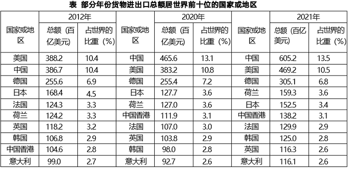

# 2023年江苏省公务员录用考试《行测》题（A类）（网友回忆版）

> 资料分析 · 20 题 · 江苏 2023

## 材料 1

        2021年，我国国内生产总值114.4万亿元，占世界经济总值的比重达18.5%，比2012年提高了7.2个百分点。2013-2021年，我国国内生产总值年均增长6.6%；一般公共预算收入年均增长5.8%；制造业增加值年均增长6.4%，其中规模以上高技术制造业、装备制造业增加值年均分别增长11.6%、9.2%，分别快于规模以上工业增加值4.8个百分点、2.4个百分点，服务业增加值年均增长7.4%。

        2021年，我国移动互联网接入流量2216亿GB，是2012年的252倍；互联网上网人数10.3亿人，比2012年增长83.0%。2021年末，累计建成并开通5G基站142.5万个，5G基站总量占全球的60.0%以上。

        2021年，全国地级及以上城市平均空气质量优良天数占比为87.5%，比2015年提高6.3个百分点，PM2.5年均浓度为30毫克/立方米，比2015年下降34.8%；地表水考核断面中，水质优良（Ⅰ~Ⅲ类）断面占比为84.9%，比2012年提高23.2个百分点。2021年末，城市污水、生活垃圾无害化处理率分别为97.5%、99.9%，比2012年末分别提高10.2个百分点、15.1个百分点。

### 第 1 题　qid 5699147 · 综合

2012年末，全国城市污水处理率为（    ）。

- **A**. 82.4%
- **B**. 84.8%
- **C**. 87.3%　✅
- **D**. 89.7%

**答案**：C

**官方解析**

定位文字材料第三段可得：2021年末全国城市污水处理率为97.5%，比2012年末提高10.2个百分点。则2012年末全国城市污水处理率=97.5%-10.2%=87.3%。
故正确答案为C。

---

### 第 2 题　qid 5699148 · 比重

下列各项中，2021年其增加值占我国国内生产总值的比重比2012年下降的是（    ）。

- **A**. 制造业　✅
- **B**. 规模以上装备制造业
- **C**. 服务业
- **D**. 规模以上高技术制造业

**答案**：A

**官方解析**

根据题干“······2021年······占······的比重比2012年下降的是”，可判定本题为两期比重问题。定位文字材料第一段可得：2013-2021年，我国国内生产总值年均增长6.6%，制造业增加值年均增长6.4%，其中规模以上高技术制造业、装备制造业增加值年均分别增长11.6%、9.2%，服务业增加值年均增长7.4%。根据两期比重比较结论“当部分增长率&lt;整体增长率时，比重下降”，结合年均增长率公式“”及一般增长率公式“”可知，当n一定，越大，r越大，则，可用代替r进行两期比重比较，因制造业增加值年均增长率（6.4%）&lt;国内生产总值年均增长率（6.6%），则2021年增加值占我国国内生产总值的比重比2012年下降的是制造业。

故正确答案为A。

---

### 第 3 题　qid 5699149 · 综合

2015年全国地级及以上城市PM2.5年均浓度为（    ）。

- **A**. 38毫克/立方米
- **B**. 42毫克/立方米
- **C**. 46毫克/立方米　✅
- **D**. 49毫克/立方米

**答案**：C

**官方解析**

根据题干“2015年······年均浓度为”，结合材料时间为2021年，可判定本题为基期计算问题。定位文字材料第三段可得：2021年，全国地级及以上城市PM2.5年均浓度为30毫克/立方米，比2015年下降34.8%。根据公式：基期量，则题干所求毫克/立方米。

故正确答案为C。

---

### 第 4 题　qid 5699152 · 平均数

2021年我国互联网上网者人均移动互联网接入流量是2012年的（    ）。

- **A**. 105倍
- **B**. 114倍
- **C**. 126倍
- **D**. 138倍　✅

**答案**：D

**官方解析**

根据题干“2021年······是2012年的”，结合选项为倍数及材料时间为2021年，可判定本题为基期倍数问题。定位文字材料第二段可得：2021年，我国移动互联网接入流量2216亿GB，是2012年的252倍；互联网上网人数10.3亿人，比2012年增长83.0%。根据公式：基期量，上网者人均移动接入流量，则题干所求倍数倍。

故正确答案为D。

---

### 第 5 题　qid 5699153 · 综合

能够从上述资料中推出的是（    ）。

- **A**. 2021年全国一般公共预算收入同比增长5.8%
- **B**. 2021年末全球5G基站总量超过250万个
- **C**. 2012年我国国内生产总值占世界经济总量的比重为11.3%　✅
- **D**. 2015年全国地表水考核断面中，水质优良（Ⅰ~Ⅲ类）断面占比为61.6%

**答案**：C

**官方解析**

A项：定位文字材料第一段可得，2013-2021年我国一般公共预算收入年均增长5.8%。仅给出了2013-2021年我国一般公共预算收入年均增速，无法推出2021年全国一般公共预算收入同比增速，错误；

B项：定位文字材料第二段可得，2021年末我国累计建成并开通5G基站142.5万个，5G基站总量占全球的60.0%以上。根据公式：比重，则2021年末全球5G基站总量万个，即不到250万个，错误；

C项：定位文字材料第一段可得，2021年我国国内生产总值占世界经济总值的比重达18.5%，比2012年提高了7.2个百分点。则2012年我国国内生产总值占世界经济总量的比重=18.5%-7.2%=11.3%，正确；

D项：定位文字材料第三段可得，2021年全国地表水考核断面中，水质优良（Ⅰ~Ⅲ类）断面占比为84.9%，比2012年提高23.2个百分点。因所求比重时间为2015年，故无法推出，错误。

故正确答案为C。

---

## 材料 2

        2021年，我国制作综艺益智类电视节目时长30.0万小时，比上年下降12.2%；播出综艺益智类电视节目时长109.5万小时，下降5.5%。制作广播剧类节目时长22.4万小时，比上年增长2.4%，播出广播剧类节目时长97.8万小时，增长0.4%。

### 第 6 题　qid 5699218 · 增长

2017-2021年我国播出影视剧类电视节目时长增加最多的年份是（    ）。

- **A**. 2017年　✅
- **B**. 2018年
- **C**. 2019年
- **D**. 2021年

**答案**：A

**官方解析**

根据题干“2017-2021年······增加最多······”，可以判定本题为增长量比较问题。定位统计表可得：2016-2021年，我国播出影视剧类电视节目时长分别为：765.2万小时、798.8万小时、822.1万小时、848.5万小时、873.1万小时、884.3万小时。根据公式：增长量=现期量-基期量，可得选项中各年份我国播出影视剧类电视节目时长的增长量分别为：

2017年：万小时；

2018年：万小时；

2019年：万小时；

2021年：万小时；

则增长最多的年份是2017年。

故正确答案为A。

---

### 第 7 题　qid 5699220 · 平均数

2017-2021年我国播出综艺益智类广播节目时长年平均减少（    ）。

- **A**. 5.7万小时
- **B**. 6.2万小时
- **C**. 6.8万小时　✅
- **D**. 7.8万小时

**答案**：C

**官方解析**

根据题干“2017-2021年······年平均减少”，结合选项带单位，可判定本题为年均增长量问题。定位统计表可得：2016年我国播出综艺益智类广播节目时长为388.3万小时，2021年为354.3万小时。根据公式：年均增长量，可得所求万小时，即减少6.8万小时。

故正确答案为C。

---

### 第 8 题　qid 5699222 · 增长

下列各项中，2021年同比增速最小的是（    ）。

- **A**. 制作综艺益智类电视节目时长
- **B**. 制作影视剧类电视节目时长　✅
- **C**. 播出综艺益智类电视节目时长
- **D**. 播出综艺益智类广播节目时长

**答案**：B

**官方解析**

根据题干“······2021年同比增速最小的是······”，可以判定本题为一般增长率问题。定位统计表可得：2020年，制作影视剧类电视节目时长为9.5万小时，播出综艺益智类广播节目时长为364.2万小时；2021年，制作影视剧类电视节目时长为7.5万小时，播出综艺益智类广播节目时长为354.3万小时；定位文字材料可得：2021年，我国制作综艺益智类电视节目时长比上年下降12.2%；播出综艺益智类电视节目时长下降5.5%。即制作综艺益智类电视节目时长的同比增速为-12.2%，播出综艺益智类电视节目时长的同比增速为-5.5%。根据公式：增长率，可知2021年，制作影视剧类电视节目时长的同比增速；播出综艺益智类广播节目时长的同比增速。比较可得，制作影视剧类电视节目时长的同比增速（-21.1%）最小，对应B项。

故正确答案为B。

---

### 第 9 题　qid 5699224 · 综合

2021年我国综艺益智类广播节目制作时长比“十三五”时期年均制作时长少（    ）。

- **A**. 5.5%　✅
- **B**. 6.9%
- **C**. 7.3%
- **D**. 8.0%

**答案**：A

**官方解析**

根据题干“2021年······比······少”，结合选项为百分数，可以判定本题为一般增长率问题。定位统计表可得：2016-2021年，我国综艺益智类广播节目制作时长分别为210.4万小时、210.6万小时、208.0万小时、199.5万小时、197.8万小时、193.9万小时。则“十三五”时期，我国综艺益智类广播节目年均制作时长万小时。根据公式：增长率，可得所求，即少5.4%，与A项最接近。

故正确答案为A。

---

### 第 10 题　qid 5699226 · 综合

能够从上述资料中推出的是（    ）。

- **A**. 2016-2021年我国播出影视剧类电视节目时长逐年增加
- **B**. 2021年我国播出当年制作综艺益智类电视节目时长为30.0万小时
- **C**. 2021年我国制作综艺益智类广播节目时长是制作影视剧类电视节目时长的25.9倍　✅
- **D**. “十三五”时期，我国制作综艺益智类广播节目时长与制作影视剧类节目时长之差逐年增大

**答案**：C

**官方解析**

A项：定位统计表可知，2016-2021年我国播出影视剧类电视节目的时长，但材料当中没有给出2015年的数据，因此无法确定2016年的时长是否增加，故无法推出，错误；

B项：定位文字材料可知，2021年，我国制作综艺益智类电视节目时长为30.0万小时，但当年制作的电视节目并非一定在当年播放，故无法推出，错误；

C项：定位统计表可知，2021年我国制作综艺益智类广播节目时长为193.9万小时，制作影视剧类电视节目时长为7.5万小时。则所求倍数倍，正确；

D项：定位统计表可知，“十三五”时期，我国制作综艺益智类广播节目时长与制作影视剧类节目时长。可知2016年二者之差为210.4-11.9=198.5万小时；2017年为210.6-15.3=195.3万小时，则2017年二者之差低于2016年，并非逐年增大，错误。

故正确答案为C。

---

## 材料 3

        2021年和2022年某市统计局通过两次调查，分别获取了该市1181位和1107位60岁以上老年人使用智能手机的有关情况。其中，2022年受访者中，年龄在61~70岁的占71.2%，71~80岁的占24.2%，81岁及以上的占4.6%。

### 第 11 题　qid 5699205 · 综合

2021年受访者中，使用智能手机没有困难的有（    ）。

- **A**. 393人
- **B**. 401人
- **C**. 419人
- **D**. 428人　✅

**答案**：D

**官方解析**

根据题干“2021年受访者中，使用智能手机没有困难的有”，结合材料给出2021年使用智能手机没有困难受访者的占比，可判定本题为现期比重问题。定位文字材料可得：2021年，该市统计局获取了该市1181位60岁以上老年人使用智能手机的有关情况。定位图1可得：2021年受访者中，使用智能手机没有困难的占36.2%。根据公式：部分=整体×比重，则所求人，与D项最接近。

故正确答案为D。

---

### 第 12 题　qid 5699208 · 综合

2022年71~80岁的受访者使用“线上支付”功能的人数有可能介于（    ）。

- **A**. 11~15
- **B**. 17~21
- **C**. 23~28
- **D**. 30~39　✅

**答案**：D

**官方解析**

根据题干“2022年71~80岁的受访者使用‘线上支付’功能的人数······”，结合材料给出2022年受访者中年龄在71~80岁以及使用“线上支付”功能人数的占比，可判定本题为现期比重问题。定位文字材料可得：2022年，该市统计局获取了1107位60岁以上老年人使用智能手机的有关情况，年龄在71~80岁的占24.2%。定位表格材料可得：2022年，受访者使用“线上支付”功能的占78.5%。因为24.2%+78.5%=102.7%＞100%，故71~80岁的受访者和使用“线上支付”功能的受访者一定有交集，则2022年71~80岁的受访者使用“线上支付”功能的人数至少有人，仅D项满足。

故正确答案为D。

---

### 第 13 题　qid 5699210 · 比重

表中所列智能手机的12个功能项中，2022年受访者中使用人数多于2021年的功能项数占比为（    ）。

- **A**. 41.7%
- **B**. 50.0%　✅
- **C**. 58.3%
- **D**. 75.0%

**答案**：B

**官方解析**

根据题干“······，2022年······占比为”，可判定本题为现期比重问题。定位文字材料可得：2021年、2022年分别获取了1181位和1107位60岁以上老年人使用智能手机的有关情况。定位表格材料可知，2021年、2022年受访者智能手机功能使用的占比情况。根据公式：部分=整体×比重，可得各项功能的使用人数=受访人数×各项功能使用人数占比，即所求需满足：1107×2022年各项功能使用人数占比&gt;1181×2021年各项功能使用人数占比，整理可得，则表中所列智能手机12个功能项2022年与2021年占比的比值分别为：

电话短信，，不满足；

社交聊天，，不满足；

线上支付，，满足；

新闻资讯，，满足；

网购，，不满足；

出行，，不满足；

挂号就医，，满足；

照相修图，，满足；

视听娱乐，，不满足；

投资理财，，不满足；

游戏，，满足；

其他，，满足。

比较可知，表中所列智能手机的12个功能项中，有6项功能满足2022年受访者中使用人数多于2021年，占比。

故正确答案为B。

---

### 第 14 题　qid 5699211 · 平均数

图2所列的14个改进需求项目中，2022年受访者的人均需求（    ）。

- **A**. 不足2项
- **B**. 不少于2项但不足3项
- **C**. 不少于4项　✅
- **D**. 不少于3项但不足4项

**答案**：C

**官方解析**

根据题干“······2022年······人均需求”，结合材料时间为2022年，可判定本题为现期平均数问题。定位图2可知2022年受访者对智能手机各项适老化改进需求的占比情况。根据公式：人均需求项数、部分=整体×比重，则所求项，在C项范围内。

故正确答案为C。

---

### 第 15 题　qid 5699213 · 综合

能够从上述资料中推出的是（    ）。

- **A**. 2022年受访者中，有“简化页面布局”需求的也有“增大音量”需求
- **B**. 2022年受访者中，有“放大字体”但没有“放大图标”需求的不少于230人　✅
- **C**. 2022年受访者中，使用智能手机没有困难的比重下降是因为广告弹窗多
- **D**. 除“线上支付”外，2022年调查中比上年提升百分点最多的智能手机使用功能是“挂号就医”

**答案**：B

**官方解析**

A项，定位图2可得：2022年，有简化页面布局、增大音量需求的受访者的占比分别为31.5%、31.3%。因为31.5%+31.3%=62.8%&lt;100%，即有简化页面布局需求的受访者不一定有增大音量需求，错误；

B项，定位文字材料可得：2022年，该市统计局获取了1107位60岁以上老年人使用智能手机的有关情况。定位图2可得：2022年，有放大字体、放大图标需求的受访者的占比分别为55.6%、33.9%。假设有放大图标需求的受访者均有放大字体需求，此时有“放大字体”但没有“放大图标”需求的人最少，即同时有两类需求的占比为33.9%，有放大字体需求但没有放大图标需求的占比为55.6%-33.9%=21.7%。根据公式：部分=整体×比重，可得2022年受访者中，有“放大字体”但没有“放大图标”需求的人数至少为人人，正确；

C项，整篇材料中均未给出2022年受访者中，使用智能手机没有困难比重下降的原因，故无法判断，错误；

D项，定位表格材料可得：2021、2022年受访者使用智能手机挂号就医功能的占比分别为55.4%、63.4%；照相修图功能的占比分别为41.9%、50.7%。故2022年调查中挂号就医功能比上年提升63.4%-55.4%=8%，即8个百分点；照相修图功能比上年提升50.7%-41.9%=8.8%，即8.8个百分点。则除“线上支付”外，2022年调查中比上年提升百分点最多的智能手机使用功能并非是“挂号就医”，错误。

故正确答案为B。

---

## 材料 4

        2021年，我国对外贸易总额为6.9万亿美元，比上年增长30.2%，比2012年多2.5万亿美元，连续两年成为世界第一大贸易国。其中，服务贸易总额82.1百亿美元，占世界的比重升至7.2%，较2012年提高1.8个百分点。实际使用外商直接投资，由2012年的11.3百亿美元增加到2021年的17.4百亿美元，年均增长4.8%。

### 第 16 题　qid 5746641 · 综合

2020年我国对外贸易总额是：

- **A**. 5.8万亿美元
- **B**. 5.3万亿美元　✅
- **C**. 4.9万亿美元
- **D**. 4.6万亿美元

**答案**：B

**官方解析**

根据题干“2020年我国对外贸易总额是”，结合材料时间为2021年，可判定本题为基期计算问题。定位文字材料可得：2021年，我国对外贸易总额为6.9万亿美元，比上年增长30.2%。根据公式：，则2020年我国对外贸易总额为万亿美元。

故正确答案为B。

---

### 第 17 题　qid 5746645 · 增长

表中所列的国家或地区中，2021年货物进出口总额增速最小的国家或地区是：

- **A**. 英国　✅
- **B**. 德国
- **C**. 日本
- **D**. 意大利

**答案**：A

**官方解析**

根据题干“······增速最小的国家或地区是”，可判定本题为一般增长率问题。定位表格可得：2020年与2021年英国、德国、日本、意大利的货物进出口总额。根据公式：增长率，则选项中所示国家和地区中，2021年货物进出口总额同比增速分别为：

英国：；

德国：；

日本：；

意大利：。

综上可得，表中所列的国家或地区中2021年货物进出口总额增速最小的国家或地区是英国。

故正确答案为A。

---

### 第 18 题　qid 5746648 · 比重

2012年我国服务贸易总额占世界的比重为：

- **A**. 7.2%
- **B**. 6.8%
- **C**. 6.3%
- **D**. 5.4%　✅

**答案**：D

**官方解析**

根据题干“2012年······占······的比重为”，结合材料时间为2021年，可判定本题为基期比重问题。定位文字材料可得：2021年，我国服务贸易总额82.1百亿美元，占世界的比重升至7.2%，较2012年提高1.8个百分点。则2012年我国服务贸易总额占世界的比重为7.2%-1.8%=5.4%。
故正确答案为D。

---

### 第 19 题　qid 5746650 · 增长

表中所列的国家或地区中，2021年货物进出口总额较2012年增加的国家或地区有：

- **A**. 6个
- **B**. 7个
- **C**. 8个　✅
- **D**. 9个

**答案**：C

**官方解析**

定位表格可知2012年、2021年表中所列的国家或地区货物进出口总额。比较可得，2021年货物进出口总额较2012年增加的国家或地区有：中国（605.2百亿美元&gt;386.7百亿美元）、美国（469.2百亿美元&gt;388.2百亿美元）、德国（305.1百亿美元&gt;255.6百亿美元）、荷兰（159.3百亿美元&gt;124.2百亿美元）、中国香港（138.2百亿美元&gt;104.6百亿美元）、法国（129.9百亿美元&gt;124.3百亿美元）、韩国（125.0百亿美元&gt;106.8百亿美元）、意大利（116.1百亿美元&gt;99.0百亿美元），共8个。
故正确答案为C。

---

### 第 20 题　qid 5746653 · 综合

从上述资料中不能推出的是：

- **A**. 2021年中国香港货物进出口总额比2012年多33.6百亿美元
- **B**. 2021年中国货物进出口总额比上年增加139.6百亿美元
- **C**. 2021年我国实际使用外商直接投资比2012年多7.0百亿美元以上　✅
- **D**. 表中所列国家或地区中，2012、2020和2021年货物进出口总额位次不变的有2个

**答案**：C

**官方解析**

A项：定位表格可得：2021年中国香港货物进出口总额为138.2百亿美元，2012年为104.6百亿美元。138.2-104.6=33.6百亿美元，即2021年中国香港货物进出口总额比2012年多33.6百亿美元，正确；
B项：定位表格可得：2021年中国货物进出口总额为605.2百亿美元，2020年为465.6百亿美元。605.2-465.6=139.6百亿美元，即2021年中国货物进出口总额比上年增加139.6百亿美元，正确；
C项：定位文字材料可得：（我国）实际使用外商直接投资，由2012年的11.3百亿美元增加到2021年的17.4百亿美元。17.4-11.3=6.1百亿美元，即2021年我国实际使用外商直接投资比2012年多不到7.0百亿美元，错误；
D项：定位表格可知，2012、2020和2021年表中货物进出口总额位次不变的国家（地区）有德国、意大利，共2个，正确。
本题为选非题，故正确答案为C。

---
