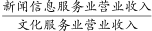
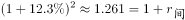
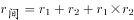
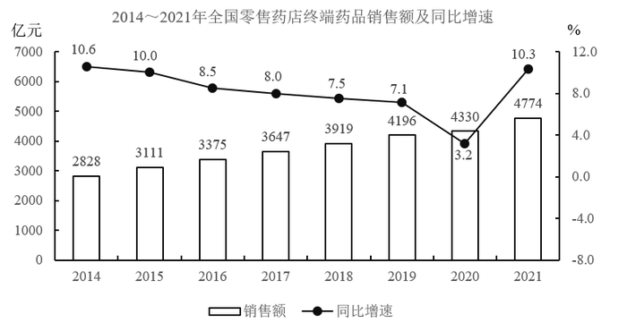
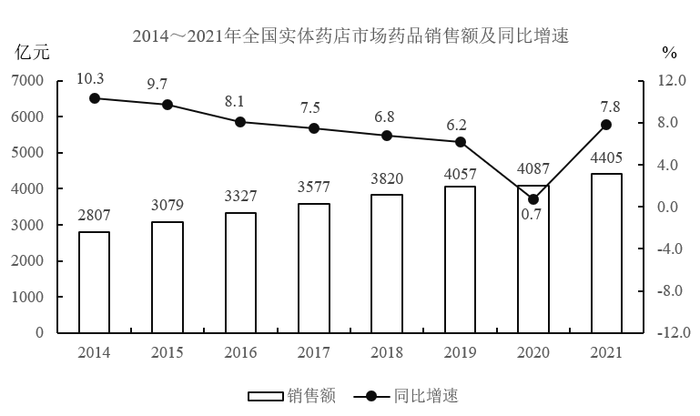

# 2023年浙江省公务员录用考试《行测》题（C类）（网友回忆版）

> 资料分析 · 15 题 · 浙江 2023

## 材料 1

### 第 1 题　qid 5430259 · 增长

我国规模以上文化及相关产业企业中，2019年、2020年营业收入均同比增长的行业类别有几个？

- **A**. 3　✅
- **B**. 4
- **C**. 5
- **D**. 6

**答案**：A

**官方解析**

定位表格材料可得2018~2020年我国规模以上文化及相关产业企业中各行业类别的营业收入。2019年、2020年营业收入均同比增长，即2020年营业收入大于2019年，且2019年营业收入大于2018年。观察可知，只有内容创作生产、创意设计服务、文化消费终端生产这3个行业类别满足条件。
故正确答案为A。

---

### 第 2 题　qid 5430288 · 比重

2020年，我国规模以上文化服务业企业营业收入占我国规模以上文化及相关产业企业营业收入的比重比2018年：

- **A**. 下降了不到5个百分点
- **B**. 下降了5个百分点以上
- **C**. 上升了不到5个百分点
- **D**. 上升了5个百分点以上　✅

**答案**：D

**官方解析**

根据题干“2020年······占······比重比2018年”，结合选项为 “上升/下降+百分点”，可判定本题为两期比重问题。定位表格材料可得：2020年、2018年我国规模以上文化服务业企业营业收入分别为45964亿元、34454亿元，2020年、2018年我国规模以上文化及相关产业企业营业收入分别为98514亿元、89257亿元。根据公式：比重，则所求两期比重差，即约上升了7.7个百分点，在D项范围内。

故正确答案为D。

---

### 第 3 题　qid 5430291 · 综合

2018~2020年，我国中部地区规模以上文化及相关产业企业累计营业收入约比西部地区高多少万亿元？

- **A**. 1.0
- **B**. 1.5　✅
- **C**. 2.0
- **D**. 2.5

**答案**：B

**官方解析**

定位表格材料可得2018~2020年我国中部地区和西部地区规模以上文化及相关产业企业营业收入。则2018~2020年，我国中部地区规模以上文化及相关产业企业累计营业收入比西部地区高亿元万亿元，与B项最接近。

故正确答案为B。

---

### 第 4 题　qid 5430293 · 比重

如不同区域规模以上文化及相关产业企业营业收入中，各产业类型占比均与全国总体水平相同，则2020年东部地区规模以上文化制造业企业营业收入约为多少万亿元？

- **A**. 2.0
- **B**. 2.4
- **C**. 2.8　✅
- **D**. 3.2

**答案**：C

**官方解析**

根据题干“······各产业类型占比均与全国总体水平相同，则2020年······”，可判定本题为现期比重问题。由于不同区域规模以上文化及相关产业企业营业收入中，各产业类型占比均与全国总体水平相同，定位表格材料可得：2020年我国规模以上文化制造业企业营业收入为37378亿元，我国企业营业收入为98514亿元，东部地区企业营业收入为73943亿元，故2020年东部地区规模以上文化制造业企业营业收入亿元，与C项最接近。

故正确答案为C。

---

### 第 5 题　qid 5430296 · 综合

能够从上述资料中推出的是：

- **A**. 2018~2020年，西部地区营业收入占全国比重逐年递增
- **B**. 2018~2020年，文化制造业累计营业收入高于文化服务业
- **C**. 2020年，营业收入同比增速最快和收入金额最低的行业是同一个　✅
- **D**. 2018~2020年，新闻信息服务业营业收入都超过文化服务业的20%

**答案**：C

**官方解析**

A项：定位表格材料可得2018~2020年西部地区和全国的营业收入。根据公式：比重，可得：西部地区营业收入占全国比重，2018年，2019年，2020年。由于2020年西部地区营业收入占全国比重低于2019年，故2018~2020年，西部地区营业收入占全国比重并非逐年递增，错误；

B项：定位表格材料可得2018~2020年文化制造业和文化服务业每年的营业收入。则2018~2020年，文化制造业累计收入亿元，文化服务业累计收入亿元，由于112000亿元＜115500亿元，故2018~2020年，文化制造业累计营业收入低于文化服务业，错误；

C项：定位表格材料可得2019年和2020年各行业类别的营业收入。比较发现，2020年，营业收入金额最低的行业是文化投资运营业。根据公式：增长率，可得：2020年文化投资运营业营业收入的增长率。观察表中其他行业，2020年的数据都明显低于2019年的2倍，即2020年其他行业的增长率都不到100%，故2020年文化投资运营业营业收入同比增速最快，即2020年，营业收入同比增速最快和收入金额最低的行业是同一个，正确；

D项：定位表格材料可得2018~2020年新闻信息服务业和文化服务业每年的营业收入。由于2019年，即2019年新闻信息服务业营业收入低于文化服务业的20%，故2018~2020年，新闻信息服务业营业收入并非都超过文化服务业的20%，错误。

故正确答案为C。

---

## 材料 2

        2021年上半年，S市工业战略性新兴产业总产值7164.68亿元，比去年同期增长19.6%，两年平均增长12.3%。其中，新能源汽车、新能源和高端装备产值同比分别增长2.5倍、32.1%和24.5%。

        2021年上半年，全市第三产业增加值15080.35亿元，比去年同期增长11.3%。其中，信息传输、软件和信息技术服务业增加值1770.06亿元，比去年同期增加245.5亿元；批发和零售业增加值2428.92亿元，同比增长15.2%；金融业增加值3842.65亿元，比去年同期增加274.7亿元；房地产业增加值1812.18亿元，同比增长13.6%。

        2021年上半年，全市社会消费品零售总额9048.44亿元，比去年同期增加了2104.14亿元。分行业看，批发和零售业零售额8287.13亿元，同比增长28.4%；住宿和餐饮业零售额761.31亿元，同比增长54.0%。2021年上半年，全市网上商店零售额1485.72亿元，比去年同期增加259.92亿元。

        2021年上半年，全市新建商品房销售面积832.83万平方米，比去年同期增长29.2%。其中，新建商品住宅销售面积667.94万平方米，同比增长23.0%。

### 第 6 题　qid 5430273 · 增长

2020年上半年，S市工业战略性新兴产业总产值同比增长在以下哪个范围内？

- **A**. 不到7%　✅
- **B**. 7~10%
- **C**. 10~13%
- **D**. 超过13%

**答案**：A

**官方解析**

根据题干“2020年上半年······总产值同比增长······”，结合选项带百分号，且材料给出2021年S市工业战略性新兴产业总产值的上半年增速和两年平均增速，可判定本题为间隔增长率问题。定位文字材料第一段可得：2021年上半年，S市工业战略性新兴产业总产值比去年同期增长19.6%，两年平均增长12.3%。根据年均增长率公式：，且，可得，故。根据间隔增长率公式：，代入数据可得：，解得，故2020年上半年，S市工业战略性新兴产业总产值同比约增长5.4%，在A项范围内。

故正确答案为A。

---

### 第 7 题　qid 5430275 · 增长

将S市2021年上半年①信息传输、软件和信息技术服务业、②批发和零售业、③金融业、④房地产业按增加值同比增速从高到低排列，正确的是：

- **A**. ②④①③
- **B**. ②④③①
- **C**. ①③②④
- **D**. ①②④③　✅

**答案**：D

**官方解析**

根据题干“······同比增速以高到低······”，可判定本题为一般增长率比较问题。定位文字材料第二段可得：2021年上半年，S市信息传输、软件和信息技术服务业增加值1770.06亿元，比去年同期增加245.5亿元；批发和零售业增加值2428.92亿元，同比增长15.2%；金融业增加值3842.65亿元，比去年同期增加274.7亿元；房地产业增加值1812.18亿元，同比增长13.6%。根据公式：增长率，则2021年上半年，信息传输、软件和信息技术服务业增加值同比增速为；金融业增加值同比增速为。16.1%＞15.2%＞13.6%＞7.7%，即同比增速以高到低排列为：①②④③。

故正确答案为D。

---

### 第 8 题　qid 5430278 · 增长

2021年上半年，S市批发和零售业零售额同比增量约是住宿和餐饮业的多少倍？

- **A**. 3
- **B**. 5
- **C**. 7　✅
- **D**. 9

**答案**：C

**官方解析**

根据题干“2021年上半年······约是······的多少倍”，可判定本题为现期倍数问题。定位文字材料第三段可得：2021年上半年，批发和零售业零售额8287.13亿元，同比增长28.4%；住宿和餐饮业零售额761.31亿元，同比增长54.0%。根据公式：增长量，可得2021年上半年，批发和零售业零售额的同比增长量为亿元，住宿和餐饮业零售额的同比增长量为亿元，则所求倍数为倍。

故正确答案为C。

---

### 第 9 题　qid 5430280 · 综合

2020年上半年，S市新建非住宅类商品房销售面积约占新建商品房销售面积的：

- **A**. 16%　✅
- **B**. 20%
- **C**. 24%
- **D**. 28%

**答案**：A

**官方解析**

根据题干“2020年上半年······占······”，结合材料时间为2021年上半年，可判定本题为基期比重问题。定位文字材料第四段可得：2021年上半年，全市新建商品房销售面积832.83万平方米（B），比去年同期增长29.2%（b）。其中，新建商品住宅销售面积667.94万平方米（A），同比增长23.0%（a）。根据公式：基期比重，则2020年上半年，S市新建住宅类商品房销售面积占新建商品房销售面积的比重，根据“新建商品房销售面积=新建住宅类商品房销售面积+新建非住宅类商品房销售面积”，故所求比重为1-84%=16%。

故正确答案为A。

---

### 第 10 题　qid 5430282 · 综合

能够从上述资料中推出的是：

- **A**. 2021年上半年，S市网上商店零售额同比增速低于20%
- **B**. 2020年上半年，S市批发和零售业增加值超过2000亿元　✅
- **C**. 2021年上半年，S市月均新建商品房销售面积不到80万平方米
- **D**. 2021年上半年，S市高端装备产值占工业战略性新兴产业总产值的比重低于上年同期水平

**答案**：B

**官方解析**

A项：定位文字材料第三段可得：2021年上半年，全市网上商店零售额1485.72亿元，比去年同期增加259.92亿元。根据公式：增长率，则2021年上半年，S市网上商店零售额同比增速，错误；

B项：定位文字材料第二段可得：2021年上半年，全市批发和零售业增加值2428.92亿元，同比增长15.2%。根据公式：基期量，则2020年上半年，S市批发和零售业增加值亿元，正确；

C项：定位文字材料第四段可得：2021年上半年，全市新建商品房销售面积832.83万平方米，则2021年上半年，S市月均新建商品房销售面积万平方米，错误；

D项：定位文字材料第一段可得：2021年上半年，S市工业战略性新兴产业总产值比去年同期增长19.6%，其中，高端装备产值同比增长24.5%。根据两期比重比较结论：当部分增长率（a）＞整体增长率（b）时，比重上升；当部分增长率（a）＜整体增长率（b）时，比重下降。高端装备产值同比增速24.5%（a）＞工业战略性新兴产业总产值同比增速19.6%（b），故所求比重上升，错误。

故正确答案为B。

---

## 材料 3

        零售药店终端包含实体药店和网上药店两大市场。2021年，全国零售药店终端药品销售额4774亿元，同比增长10.3%。其中，实体药店市场药品销售额4405亿元，同比增长7.8%；网上药店市场药品销售额368亿元，同比增长51.5%。

### 第 11 题　qid 5430314 · 综合

2016～2020年，全国零售药店终端药品销售总额在以下哪个范围内？

- **A**. 小于1.9万亿元
- **B**. 1.9～2万亿元　✅
- **C**. 2～2.1万亿元
- **D**. 大于2.1万亿元

**答案**：B

**官方解析**

定位统计图1可得2016～2020年各年份的全国零售药店终端药品销售额，则2016～2020年全国零售药店终端药品销售总额=3375+3647+3919+4196+4330=19467亿元=1.9467万亿元，在B项范围内。
故正确答案为B。

---

### 第 12 题　qid 5430316 · 增长

2014～2021年间，全国实体药店市场药品年均销售额增长约为多少亿元？

- **A**. 228　✅
- **B**. 233
- **C**. 238
- **D**. 244

**答案**：A

**官方解析**

根据题干“2014～2021年间······年均销售额增长······亿元”，可判定本题为年均增长量问题。定位统计图2可得：2014年、2021年全国实体药店市场药品销售额分别为2807亿元、4405亿元。根据公式：年均增长量，则2014～2021年间，全国实体药店市场药品年均销售额增长亿元。

故正确答案为A。

---

### 第 13 题　qid 5430323 · 综合

2021年，全国零售药店终端药品销售额约为2013年的多少倍？

- **A**. 1.3
- **B**. 1.5
- **C**. 1.7
- **D**. 1.9　✅

**答案**：D

**官方解析**

根据题干“2021年······约为2013年的多少倍”，可判定本题为基期倍数问题。定位统计图1可得：2021年，全国零售药店终端药品销售额为4774亿元；2014年，全国零售药店终端药品销售额为2828亿元，同比增长10.6%。根据公式：基期量，可得2013年，全国零售药店终端药品销售额为亿元。故2021年，全国零售药店终端药品销售额为2013年的倍。

故正确答案为D。

---

### 第 14 题　qid 5430327 · 增长

2017～2021年，全国网上药店市场药品销售额同比增速最快的年份是：

- **A**. 2018年
- **B**. 2019年
- **C**. 2020年　✅
- **D**. 2021年

**答案**：C

**官方解析**

根据题干“2017～2021年，全国网上药店市场药品销售额同比增速······”，可判定本题为一般增长率比较问题。定位文字材料可得：2021年，全国网上药店市场药品销售额同比增长51.5%。定位统计图1可得2017～2020年全国零售药店终端药品销售额。定位统计图2可得2017～2020年全国实体药店市场药品销售额。则2017～2020年全国网上药店市场药品销售额分别为3647-3577=70亿元、3919-3820=99亿元、4196-4057=139亿元、4330-4087=243亿元。根据公式：增长率，可得2018-2020年全国网上药店市场药品销售额同比增速分别为：

2018年，；

2019年，；

2020年，。

综上，2020年全国网上药店市场药品销售额同比增速最快。

故正确答案为C。

---

### 第 15 题　qid 5430330 · 综合

能够从上述资料中推出的是：

- **A**. 2021年全国网上药店市场药品销售额是2019年的3倍多
- **B**. 2014～2021年有4年全国网上药店市场药品销售额超过100亿元
- **C**. 2015年，全国实体药店市场药品销售额是网上药店市场药品销售额的100倍以上
- **D**. 2014～2021年，全国零售药店终端药品销售额同比增量最高的年份，实体药店市场药品同比增量也最高　✅

**答案**：D

**官方解析**

A项：定位图1可知：2019年和2021年全国零售药店终端药品销售额分别为4196亿元和4774亿元；定位图2可知：2019年和2021年全国实体药店市场药品销售额分别为4057亿元和4405亿元。因为全国零售药店终端药品销售额=全国实体药店市场药品销售额+全国网上药店市场药品销售额，则2019年和2021年全国网上药店市场药品销售额分别为4196-4057=139亿元和4774-4405=369亿元。故所求倍数为倍，错误；

B项：定位图1和图2可知：2014～2021年每一年的全国零售药店终端药品销售额和全国实体药店市场药品销售额。因为全国零售药店终端药品销售额=全国实体药店市场药品销售额+全国网上药店市场药品销售额，则2014～2021年每一年的全国网上药店市场药品销售额分别为：

2014年：2828-2807=21亿元；

2015年：3111-3079=32亿元；

2016年：3375-3327=48亿元；

2017年：3647-3577=70亿元；

2018年：3919-3820=99亿元；

2019年：4196-4057=139亿元；

2020年：4330-4087=243亿元；

2021年：4774-4405=369亿元。

故2014～2021年全国网上药店市场药品销售额超过100亿元的有2019年、2020年、2021年，共3年，错误；

C项：定位图1可知：2015年全国零售药店终端药品销售额3111亿元；定位图2可知：2015年全国实体药店市场药品销售额3079亿元。因为全国零售药店终端药品销售额=全国实体药店市场药品销售额+全国网上药店市场药品销售额，则2015年全国网上药店市场药品销售额为3111-3079=32亿元。故所求倍数为倍，错误；

D项：定位图1可知2014～2021年，每一年的全国零售药店终端药品销售额以及2014年同比增速10.6%。根据公式：增长量，则2014年全国零售药店终端药品销售额同比增量为亿元；根据公式：增长量=现期量-基期量，则2015～2021年同比增量分别为3111-2828=283亿元、3375-3111=264亿元、3647-3375=272亿元、3919-3647=272亿元、4196-3919=277亿元、4330-4196=134亿元、4774-4330=444亿元，故2014～2021年，全国零售药店终端药品销售额同比增量最高的年份为2021年；

定位图2可知2014～2021年，每一年的全国实体药店市场药品销售额以及2014年同比增速10.3%。根据公式：增长量，则2014年全国实体药店市场药品销售额同比增量为亿元；根据公式：增长量=现期量-基期量，则2015～2021年同比增量分别为3079-2807=272亿元、3327-3079=248亿元、3577-3327=250亿元、3820-3577=243亿元、4057-3820=237亿元、4087-4057=30亿元、4405-4087=318亿元，故2014～2021年，全国实体药店市场药品销售额同比增量最高的年份也为2021年，正确。

故正确答案为D。

备注：A、B两项，如果看文字材料，网上药店市场药品销售额368亿元，与统计图数据4774-4405=369亿元不符，但不影响判定本题正误。

---
