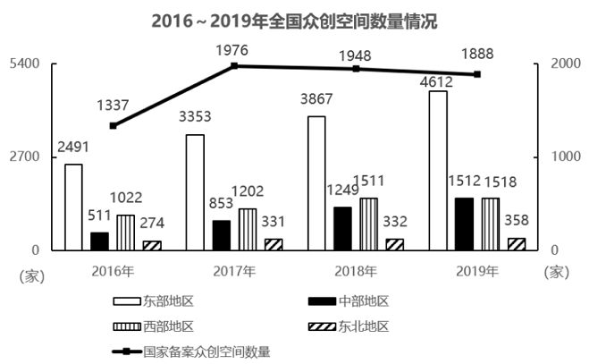
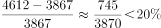
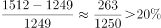
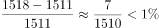
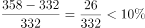
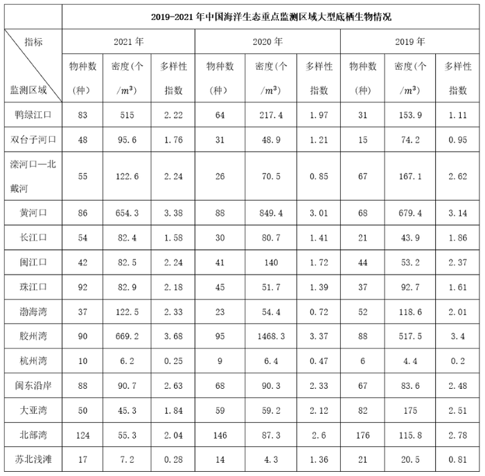
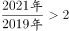
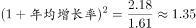
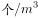

# 2023年深圳市考公务员录用考试《行测》试题（网友回忆版）

> 资料分析 · 15 题 · 深圳市考 2023

## 材料 1

        2021年1-2月，全国房地产开发投资13986亿元，同比增长3873亿元，房屋施工面积770629万平方米，同比增长11.0%。其中，住宅542503万平方米，增长11.2%；办公楼31802万平方米，增长7.3%；商业营业用房76346万平方米，增长2.5%；其他类型119978万平方米。房屋新开工面积17037万平方米，增长64.3%，其中，住宅12736万平方米，增长68.5%。商品房销售面积17363万平方米，同比增长1.05倍，比2019年1-2月增长23.3%，商品房销售额19151亿元，同比增长1.33倍，比2019年同期增长49.6%。

        2月末，商品房待售面积比上年末增加2575万平方米，其中，住宅增加2314万平方米，办公楼和商业营业用房分别减少24万平方米和269万平方米。

        2021年1-2月，分地区看，东部地区房地产开发投资8353亿元，同比增长32.4%；中部地区2640亿元，增长52.5%；西部地区2834亿元，增长45.1%；东北地区158亿元，增长28.6%。

        东部地区商品房销售面积7565万平方米，同比增长113.9%；销售额11891亿元，增长148.1%，中部地区商品房销售面积4369万平方米，增长104.3%；销售额3280亿元，增长130.2%，西部地区商品房销售面积5004万平方米，增长95.1%；销售额3620亿元，增长103.6%，东北地区商品房销售面积425万平方米，增长82.0%；销售额359亿元，增长72.7%。

### 第 1 题　qid 5521201 · 增长

2020年1-2月，全国商品房销售面积同比增长（    ）。

- **A**. -40.0%　✅
- **B**. -32.5%
- **C**. 40.0%
- **D**. 17.2%

**答案**：A

**官方解析**

根据题干“2020年1-2月······同比增长”，结合选项为百分数，且材料给出2021年1-2月全国商品房销售面积的同比增长率及比2019年1-2月的增长率，可判定本题为间隔增长率问题。定位文字材料第一段可得，2021年1-2月全国商品房销售面积同比增长1.05倍（即），比2019年1-2月增长23.3%（）。代入间隔增长率公式：，则可得：，解得，与A项最接近。

故正确答案为A。

---

### 第 2 题　qid 5521208 · 增长

2021年1-2月，对房屋施工面积同比增长贡献率最低的房屋类型是（    ）。

- **A**. 住宅
- **B**. 办公楼
- **C**. 商业营业用房　✅
- **D**. 其他类型

**答案**：C

**官方解析**

根据题干“2021年1-2月······同比增长贡献率最低······”，可知本题比较增长贡献率的大小，可判定本题为现期比重问题。根据公式：增长贡献率，因为整体的增长量相同，则只需要选择部分增长量最小的即可。定位文字材料第一段可得：2021年1-2月，全国房屋施工面积770629万平方米，同比增长11.0%。其中，住宅542503万平方米，增长11.2%；办公楼31802万平方米，增长7.3%；商业营业用房76346万平方米，增长2.5%。根据公式：增长量，则全国房屋施工面积同比增长量万平方米；住宅施工面积同比增长量万平方米；办公楼施工面积同比增长量万平方米；商业营业用房施工面积同比增长量万平方米；其他类型施工面积同比增长量＝全国房屋施工面积同比增长量-住宅施工面积同比增长量-办公楼施工面积同比增长量-商业营业用房施工面积同比增长量＝77062.9-54250.3-2120.1-1862.1=18830.4万平方米。

综上所述，商业营业用房施工面积同比增长量最小，则其对房屋施工面积同比增长贡献率最低。

故正确答案为C。

---

### 第 3 题　qid 5521212 · 增长

2021年1-2月，各地区按商品房销售额同比增量从大到小排列，正确的是（    ）。

- **A**. 中部地区＞东部地区＞东北地区＞西部地区
- **B**. 东部地区＞西部地区＞中部地区＞东北地区
- **C**. 中部地区＞西部地区＞东北地区＞东部地区
- **D**. 东部地区＞中部地区＞西部地区＞东北地区　✅

**答案**：D

**官方解析**

根据题干“2021年1-2月······同比增量从大到小排列······”，可判定本题为增长量比较问题。定位文字材料第四段可得∶2021年1-2月，东部地区商品房销售额11891亿元，增长148.1%；中部地区商品房销售额3280亿元，增长130.2%；西部地区商品房销售额3620亿元，增长103.6%；东北地区商品房销售额359亿元，增长72.7%。根据增长量比较口诀“大大则大”，各地区中东部地区商品房销售额及其同比增速均为最大，则其同比增量也为最大，排除A、C两项。根据公式：增长量，可得中部地区商品房销售额同比增量亿元；西部地区商品房销售额同比增量亿元，故中部地区＞西部地区，只有D项符合。 

故正确答案为D。

---

### 第 4 题　qid 5521215 · 增长

分地区看，2021年1-2月房地产开发投资占全国比重同比提高的地区有（    ）个。

- **A**. 1
- **B**. 2　✅
- **C**. 3
- **D**. 4

**答案**：B

**官方解析**

根据题干“分地区看，2021年1-2月······占······比重同比提高的地区有······个”，可判定本题为两期比重问题。定位材料第一段可得：2021年1-2月，全国房地产开发投资13986亿元，同比增长3873亿元；定位材料第三段可得：2021年1-2月，分地区看，东部地区房地产开发投资同比增长32.4%；中部地区增长52.5%；西部地区增长45.1%；东北地区增长28.6%。根据公式：增长率，则2021年1-2月，全国房地产开发投资同比增长率。根据两期比重比较结论“若部分增长率大于整体增长率，则比重上升”，比较可知：分地区看，2021年1-2月房地产开发投资同比增长率只有中部地区（52.5%）和西部地区（45.1%）大于全国（38.3%），比重上升。因此，分地区看，2021年1-2月房地产开发投资占全国比重同比提高的地区有2个。

故正确答案为B。

---

### 第 5 题　qid 5521217 · 综合

根据上文，下列说法正确的是（    ）。

- **A**. 2021年1-2月，全国房屋新开工面积同比增加超6800万平方米
- **B**. 2021年2月末，商业营业用房待售面积同比减少量比办公楼多245万平方米
- **C**. 2020年1-2月，房地产开发投资最低的地区，其投资额与最高的地区相差55倍
- **D**. 2021年1-2月，分地区看，东北地区的商品房销售均价同比增长最小　✅

**答案**：D

**官方解析**

A项：定位文字资料第一段可知，2021年1-2月，全国房屋新开工面积17037万平方米，增长64.3%。根据公式：增长量，则2021年1-2月，全国房屋新开工面积同比增量万平方米＜6800万平方米，错误；

B项：定位文字资料第二段可知，仅给出2021年2月末，商业营业用房和办公楼待售面积相比于2020年末的减少量，而未给出2021年2月末，商业营业用房和办公楼待售面积相比于2020年2月末的减少量，故无法推出同比减少量的差值，错误；

C项：定位文字资料第三段可知，2021年1-2月，各地区房地产开发投资额及其同比增速。根据公式：基期量，则2020年1-2月，各地区房地产开发投资额分别为：东部地区亿元；中部地区亿元；西部地区亿元；东北地区亿元，则投资最低的地区，其投资额与最高的地区相差倍＜55倍，错误；

D项：定位文字资料第四段可知，2021年1-2月，各地区商品房销售面积及其同比增速、销售额及其同比增速。根据公式：销售均价，平均数的增长量，则各地区商品房销售均价同比增量分别为：东部地区；中部地区；西部地区；东北地区。比较可知，东北地区的商品房销售均价同比增长最小，正确。

故正确答案为D。

---

## 材料 2

### 第 6 题　qid 5521194 · 比重

2019年，东部地区众创空间数量占全国比重是（    ）。

- **A**. 59.4%
- **B**. 58.5%
- **C**. 57.7%　✅
- **D**. 55.6%

**答案**：C

**官方解析**

根据题干“2019年，东部地区众创空间数量占全国比重是”，可判定本题为现期比重问题。定位统计图可知：2019年东部地区、中部地区、西部地区和东北地区众创空间数量分别为4612家、1512家、1518家和358家。根据公式：比重，则东部地区众创空间数量占全国比重是。

故正确答案为C。

---

### 第 7 题　qid 5521207 · 增长

下图为表示2017~2019年某地区众创空间数量同比增长率变化的折线图，最有可能对应的地区是（    ）。

- **A**. 东部地区
- **B**. 中部地区
- **C**. 西部地区　✅
- **D**. 东北地区

**答案**：C

**官方解析**

根据题干“······2017~2019年······同比增长率······”，可判定本题为一般增长率问题。定位统计图可知2016~2019年全国东部、中部、西部、东北地区众创空间数量。根据公式：增长率，可得2017~2019年各地区众创空间数量同比增长率分别为：

东部地区：2017年，；2018年，。第二个点应低于第一个点，与题干折线图不符，排除；

中部地区：2017年，；2018年，。第二个点应低于第一个点，与题干折线图不符，排除；

西部地区：2017年，；2018年，；2019年，。第二个点最高，第三个点最低，与题干折线图相符，当选；

东北地区：2017年，；2018年，。第二个点应低于第一个点，与题干折线图不符，排除。

综上，题干折线图最有可能对应的地区是西部地区。

故正确答案为C。

---

### 第 8 题　qid 5521211 · 比重

下列年份中，国家备案众创空间数量占全国众创空间数量的比重最高的是（    ）。

- **A**. 2016年
- **B**. 2017年　✅
- **C**. 2018年
- **D**. 2019年

**答案**：B

**官方解析**

根据题干“下列年份中······占······比重最高的是”，可判定本题为现期比重问题。定位统计图可得：2016-2019年国家备案众创空间数量及对应年份的东部地区、中部地区、西部地区、东北地区众创空间数量。根据公式：比重，可得对应年份的国家备案众创空间数量占全国众创空间数量的比重如下：

2016年：；

2017年：；

2018年：；

2019年：。

比较可知，2017年国家备案众创空间数量占全国众创空间数量的比重最高。

故正确答案为B。

---

### 第 9 题　qid 5521214 · 增长

下列地区中，2019年众创空间数量同比增长率最高的是（    ）。

- **A**. 东部地区
- **B**. 中部地区　✅
- **C**. 西部地区
- **D**. 东北地区

**答案**：B

**官方解析**

根据题干“······2019年······同比增长率最高的是”，可判定本题为一般增长率问题。定位统计图可得：2019年和2018年东部地区、中部地区、西部地区和东北地区众创空间的数量。根据公式：增长率，则2019年四个地区众创空间数量同比增长率分别为：

东部地区：；

中部地区：；

西部地区：；

东北地区：。

比较可知，2019年众创空间数量同比增长率最高的是中部地区。

故正确答案为B。

---

### 第 10 题　qid 5521216 · 综合

根据上图，下列说法不正确的是（    ）。

- **A**. 2016~2019年，东北地区众创空间数量占全国比重呈先升后降的趋势　✅
- **B**. 2019年国家备案众创空间数量是2016年的1.4倍多
- **C**. 2017~2019年，全国众创空间数量同比增量逐年下降
- **D**. 2017~2019年，东部地区众创空间数量同比增长最慢的年份是2018年

**答案**：A

**官方解析**

A项：定位统计图可知2016~2019年东北地区众创空间数量情况。根据公式：比重，则2016~2019年东北地区众创空间数量占全国比重分别为：2016年，；2017年，；2018年，；2019年，，比重呈持续下降趋势，错误；

B项：定位统计图可知，2016年、2019年国家备案众创空间数量分别为1337家、1888家。则2019年国家备案众创空间数量是2016年的倍，正确；

C项：根据A项计算结果可知2016~2019年全国众创空间数量：2016年4298家；2017年5739家；2018年6959家；2019年8000家。根据公式：增长量=现期量-基期量，则2017~2019年全国众创空间数量同比增量分别为：2017年，5739-4298=1441家；2018年， 6959-5739=1220家；2019年，8000-6959=1041家，比较可知，同比增量逐年下降，正确；

D项：定位统计图可知，2016~2019年东部地区众创空间数量分别为2491家、3353家、3867家、4612家。根据公式：增长率，则2017~2019年东部地区众创空间数量同比增长率分别为：2017年，；2018年，；2019年，，同比增长最慢的年份是2018年，正确。

本题为选非题，故正确答案为A。

---

## 材料 3

### 第 11 题　qid 5521188 · 增长

与2019年相比，2021年大型底栖生物物种数增加超出一倍的有（    ）个。

- **A**. 8
- **B**. 6
- **C**. 4　✅
- **D**. 2

**答案**：C

**官方解析**

根据题干“与2019年相比，2021年······增加超出一倍的有······”，可判定本题为现期倍数问题。定位统计表可知，2019年、2021年各重点监测区域大型底栖生物物种数。与2019年相比，2021年······增加超出一倍即，满足条件的有：

鸭绿江口，；

双台子河口，；

长江口，；

珠江口，。

综上可得，与2019年相比，2021年大型底栖生物物种数增加超出一倍的有4个。

故正确答案为C。

---

### 第 12 题　qid 5521195 · 增长

2020年，以下重点监测区域中，大型底栖生物密度同比增幅最大的是（    ）。

- **A**. 鸭绿江口
- **B**. 闽江口
- **C**. 渤海湾
- **D**. 胶州湾　✅

**答案**：D

**官方解析**

根据题干“2020年······大型底栖生物密度同比增幅最大的是”，可判定本题为一般增长率比较问题。定位统计表可知，2020年及2019年鸭绿江口、闽江口、渤海湾、胶州湾大型底栖生物的密度。增长率，可直接比较。鸭绿江口：，闽江口：，渤海湾：，胶州湾：，即胶州湾2020年大型底栖生物密度同比增幅最大。

故正确答案为D。

---

### 第 13 题　qid 5521199 · 增长

2019-2021年，珠江口大型底栖生物多样性指数年均增长（    ）。

- **A**. 16.4%　✅
- **B**. 17.7%
- **C**. 18.1%
- **D**. 35.3%

**答案**：A

**官方解析**

根据题干“2019-2021年，······年均增长”，可判定本题为年均增长率问题。定位统计表可得：2021、2019年珠江口大型底栖生物多样性指数分别为2.18、1.61。根据公式：，可得。采用代入排除法，代入B项，，故年均增长率＜17.7%，仅有A项符合。

故正确答案为A。

---

### 第 14 题　qid 5521202 · 综合

2019年，大型底栖生物物种数达到中位数以上的重点监测区域中，其大型底栖生物密度最低的是（    ）。

- **A**. 北部湾
- **B**. 闽东沿岸　✅
- **C**. 渤海湾
- **D**. 闽江口

**答案**：B

**官方解析**

定位统计表可知，2019年中国海洋生态重点监测区域共14个，各监测区域大型底栖生物物种数按从小到大排列，第7、8位分别为闽江口44种、渤海湾52种，则中位数为，闽江口物种数低于中位数，排除D项。北部湾、闽东沿岸、渤海湾大型底栖生物密度分别为115.8、83.6、118.6，最低的是闽东沿岸。

故正确答案为B。

备注：中位数是指按顺序排列的一组数据中居于中间位置的数，若数据有偶数个，通常取最中间的两个数值的平均数作为中位数。

---

### 第 15 题　qid 5521205 · 综合

根据上表，下列说法错误的是（    ）。

- **A**. 2020-2021年，大型底栖生物多样性指数连续两年同比下降的重点监测区域有2个
- **B**. 2019-2021年，黄河口与长江口大型底栖生物多样性指数的差距逐年增大
- **C**. 2019-2022年，杭州湾大型底栖生物物种数、密度、多样性指数均居末位　✅
- **D**. 2021年，大型底栖生物密度同比增加的重点监测区域有8个

**答案**：C

**官方解析**

A项：定位统计表可得，2020-2021年，大型底栖生物多样性指数连续两年同比下降（即2021年＜2020年＜2019年）的重点监测区域有：大亚湾（1.84＜2.12＜2.51）、北部湾（2.04＜2.6＜2.78），共2个，正确；
B项：定位统计表可得，2019-2021年黄河口大型底栖生物多样性指数分别为3.14、3.01、3.38；长江口大型底栖生物多样性指数分别为1.86、1.41、1.58。则两者2019年的差距为3.14-1.86=1.28，2020年的差距为3.01-1.41=1.6，2021的差距为3.38-1.58=1.8，差距逐年增大，正确；
C项：材料中没有给出2022年杭州湾大型底栖生物情况的相关数据，故无法推出，错误；
D项：定位统计表可得，2020年、2021年中国海洋各个生态重点监测区域大型底栖生物密度。观察可知，2021年大型底栖生物密度同比增加（即2021年＞2020年）的重点监测区域有：鸭绿江口（515＞217.4）、双台子河口（95.6＞48.9）、滦河口—北戴河（122.6＞70.5）、长江口（82.4＞80.7）、珠江口（82.9＞51.7）、渤海湾（122.5＞54.4）、闽东沿岸（90.7＞90.3）、苏北浅滩（7.2＞4.3），共8个，正确。
本题为选非题，故正确答案为C。

---
