# 2023年湖北省选调生招录考试综合知识和行政职业能力测验试卷（网友回忆版）

> 资料分析 · 10 题 · 湖北 2023

## 材料 1

        2021年12月，我国原煤产量3.8亿吨，同比增长7.2%；原油产量1647万吨，同比增长1.7%；天然气产量192亿立方米，同比增长2.3%；发电量7234亿千瓦时，同比下降2.1%。

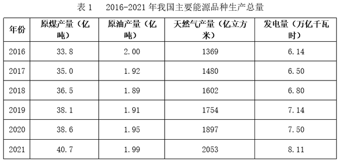

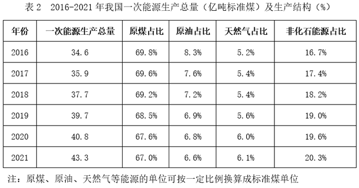

### 第 1 题　qid 5494774 · 综合

2021年12月，我国日均原煤产量是日均原油产量的多少倍？

- **A**. 18
- **B**. 21
- **C**. 23　✅
- **D**. 25

**答案**：C

**官方解析**

根据题干“2021年12月······是······的多少倍”，可判定本题为现期倍数问题。定位文字材料可得：2021年12月，我国原煤产量3.8亿吨；原油产量1647万吨。则2021年12月，我国日均原煤产量是日均原油产量的倍。

故正确答案为C。

---

### 第 2 题　qid 5494775 · 综合

2020年12月，我国原煤产量约占当年原煤总产量的：

- **A**. 9%　✅
- **B**. 11%
- **C**. 12%
- **D**. 13%

**答案**：A

**官方解析**

根据题干“2020年12月······约占······”，结合材料时间为2021年12月，可判定本题为基期比重问题。定位文字材料可得：2021年12月，我国原煤产量3.8亿吨，同比增长7.2%；定位表1可得：2020年，我国原煤产量38.6亿吨。根据公式：基期量，则2020年12月我国原煤产量亿吨；根据公式：比重，则所求比重，与A项最接近。

故正确答案为A。

---

### 第 3 题　qid 5494777 · 增长

将我国主要能源按2021年产量的同比增速从高到低排列，正确的是：

- **A**. 电>天然气>原煤>原油
- **B**. 天然气>电>原煤>原油　✅
- **C**. 电>原油>天然气>原煤
- **D**. 天然气>原油>电>原煤

**答案**：B

**官方解析**

根据题干“······同比增速从高到低······”，可判定本题为一般增长率问题。定位表1可得：2020年与2021年原煤产量、原油产量、天然气产量、发电量。根据公式：增长率，则2021年四种主要能源产量的同比增速分别为：

原煤：；

原油：；

天然气：；

发电量：。

则从高到低排列正确的是：天然气＞电＞原煤＞原油，B项符合。

故正确答案为B。

---

### 第 4 题　qid 5494779 · 增长

2016～2021年，我国一次能源生产总量中，非化石能源产量年均增长约多少亿吨标准煤？

- **A**. 0.50
- **B**. 0.60　✅
- **C**. 0.63
- **D**. 0.71

**答案**：B

**官方解析**

根据题干“2016～2021年······年均增长约多少亿吨标准煤”，可判定本题为年均增长量问题。定位表2可得：2016年，我国一次能源生产总量34.6亿吨标准煤，非化石能源占比16.7%；2021年分别为43.3亿吨标准煤，20.3%。根据公式：年均增长量，则题干所求亿吨标准煤，与B项最接近。

故正确答案为B。

---

### 第 5 题　qid 5494780 · 综合

根据所给资料，下列说法错误的是：

- **A**. 2018-2021年我国年均一次能源产量超40亿吨标准煤
- **B**. 2021年，我国发电量增速比上年提高约3个百分点
- **C**. 2021年我国非化石能源产量约为原煤产量的三成
- **D**. 2021年12月，我国发电量低于当年月均发电量　✅

**答案**：D

**官方解析**

A项：定位表2可得，2018-2021年我国一次能源产量分别为37.7亿吨标准煤、39.7亿吨标准煤、40.8亿吨标准煤、43.3亿吨标准煤。则2018-2021年我国年均一次能源产量为亿吨标准煤，正确；

B项：定位表1可得，2019-2021年我国发电量分别为7.14万亿千瓦时、7.50万亿千瓦时、8.11万亿千瓦时。根据公式：增长率，则所求为，提高约3个百分点，正确；

C项：定位表2可得，2021年我国一次能源生产总量中，原煤占比67.0%，非化石能源占比20.3%。则所求，故2021年我国非化石能源产量约为原煤产量的三成，正确；

D项：定位文字材料和表1可得：2021年12月，我国发电量为7234亿千瓦时；2021年，我国发电量为8.11万亿千瓦时。则2021年我国月均发电量为，即2021年12月我国发电量高于当年月均发电量，错误。

本题为选非题，故正确答案为D。

---

## 材料 2

        2021年末，全国共有公共图书馆3215个，比上年末增加3个；从业人员59301人，增加1321人；其中具有高级职称人员7413人，占12.5%；具有中级职称人员18979人，占32.0%。

        全年公共图书馆实际持证读者10313.93万人，比上年增长0.6%；总流通人次74613.69万，增长37.8%；书刊文献外借58730.15万册次，增长39.5%；外借人次23809.24万，增长36.3%。全年共为读者举办各种活动202568次，比上年增长34.4%；参加人次11892.49万，增长28.2%。

        2021年末，全国共有群众文化机构43531个，比上年末减少156个。其中乡镇综合文化站32524个，减少301个。年末全国群众文化机构从业人员190007人，比上年末增加4931人。其中具有高级职称的人员7531人，占4.0%；具有中级职称人员17947人，占9.4%。

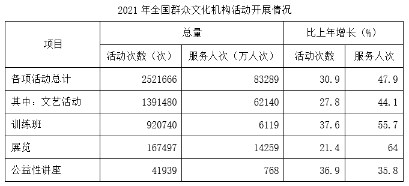

### 第 6 题　qid 5494782 · 综合

2021年末，全国公共图书馆具有中、高级职称的从业人数比全国群众文化机构具有中、高级职称的从业人数：

- **A**. 多852人
- **B**. 多914人　✅
- **C**. 少852人
- **D**. 少914人

**答案**：B

**官方解析**

定位文字材料第一段可得：2021年末，全国共有公共图书馆从业人员59301人，其中具有高级职称人员7413人，具有中级职称人员18979人；定位文字材料第三段可得：2021年末，全国群众文化机构从业人员190007人，其中具有高级职称人员7531人，具有中级职称人员17947人。则所求为7413+18979-7531-17947=914人，即多914人。
故正确答案为B。

---

### 第 7 题　qid 5494783 · 平均数

2021年，全国公共图书馆平均每名实际持证读者外借书刊文献多少次？平均每次外借多少册？

- **A**. 2.3；2.5　✅
- **B**. 2.3；2.6
- **C**. 2.4；2.5
- **D**. 2.4；2.6

**答案**：A

**官方解析**

根据题干“2021年······平均每名实际持证读者外借书刊文献多少次？平均每次外借多少册”，可判定本题为现期平均数问题。定位文字材料第二段可得：2021年公共图书馆实际持证读者10313.93万人；书刊文献外借58730.15万册次；外借人次23809.24万。根据公式：平均数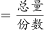，则2021年平均每名实际持证读者外借书刊文献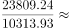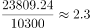次，平均每次外借书刊文献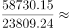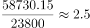册。

故正确答案为A。

---

### 第 8 题　qid 5494785 · 平均数

2020年，全国公共图书馆为读者举办各种活动约多少万次？平均每次有多少人参加？

- **A**. 15；少于600
- **B**. 15；多于600　✅
- **C**. 16；少于600
- **D**. 16；多于600

**答案**：B

**官方解析**

根据题干“2020年，全国公共图书馆为读者举办各种活动约多少万次？平均每次有多少人参加”，结合材料时间为2021年，可判定本题为基期计算和基期平均数问题。定位文字材料第二段可得：2021年全国公共图书馆共为读者举办各种活动202568次（B），比上年增长34.4%（b）；参加人次11892.49万（A），增长28.2%（a）。根据公式：基期量，可得2020年全国公共图书馆为读者举办各种活动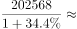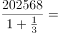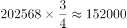次万次；根据公式：基期平均数，可得平均每次参加的人数为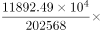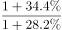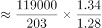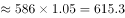人人。

故正确答案为B。

---

### 第 9 题　qid 5494787 · 平均数

2021年，平均每座公共图书馆的从业人数，与平均每个群众文化机构的从业人数之比在以下哪个范围内：

- **A**. 3.0-3.5
- **B**. 3.5-4.0
- **C**. 4.0-4.5　✅
- **D**. 4.5-5.0

**答案**：C

**官方解析**

根据题干“2021年······与······之比在以下哪个范围内”，可判定本题为比值计算问题。定位文字材料第一段可得，2021年末，全国共有公共图书馆3215个，从业人员59301人；定位文字材料第三段可得，2021年末，全国共有群众文化机构43531个，全国群众文化机构从业人员190007人。根据公式：平均数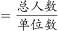，则2021年平均每座公共图书馆的从业人数与平均每个群众文化机构的从业人数之比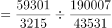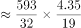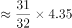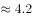，在C项范围内。

故正确答案为C。

---

### 第 10 题　qid 5494789 · 综合

关于全国群众文化机构相关情况，不能从上述资料中推出的是：

- **A**. 2020年，训练班服务人次总量超过3500万
- **B**. 2020年，开展公益性讲座活动次数超过3万
- **C**. 2021年，四项活动中平均每次活动服务人数最多的是训练班　✅
- **D**. 2021年，乡镇综合文化站占全国群众文化机构的比例比2020年低

**答案**：C

**官方解析**

A项：定位统计表可得，2021年训练班服务人次6119万人次，同比增长55.7%。根据公式：基期量，则2020年训练班服务人次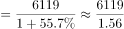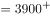万人次，超过3500万，正确；

B项：定位统计表可得，2021年开展公益性讲座41939次，同比增长36.9%。根据公式：基期量，则2020年开展公益性讲座活动次数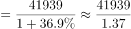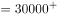次，超过3万，正确；

C项：定位统计表可得2021年四项活动开展的次数及服务人次，根据公式：平均数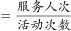，则四项活动平均每次活动服务人数分别为，文艺活动：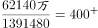人次；训练班：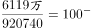人次；展览：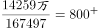人次；公益性讲座：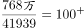人次。平均每次活动服务人数最多的是展览，并非训练班，错误；

D项：定位文字材料第三段可得，2021年末，全国共有群众文化机构43531个，比上年末减少156个。其中乡镇综合文化站32524个，减少301个。根据公式：增长率，则2021年乡镇综合文化站增长率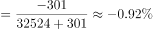（a），全国群众文化机构增长率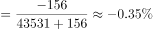（b）。根据两期比重比较结论：当部分增长率（a）＜整体增长率（b）时，比重下降。因-0.92%（a）＜-0.35%（b），故2021年，乡镇综合文化站占全国群众文化机构的比例比2020年低，正确。

此题为选非题，故正确答案为C。

---
