# 2023年辽宁省公务员录用考试《行测》题（网友回忆版）

> 资料分析 · 20 题 · 辽宁 2023

## 材料 1

        据国家统计局数据显示，2021年我国研究与试验发展（R&amp;D）经费支出27864亿元，同比增长14.2%，占国内生产总值之比为2.44%，其中基础研究经费1696亿元。国家自然科学基金共资助4.87万个项目。2021年全年授予专利权460.1万件，同比增长26.4%；PCT专利申请受理量7.3万件。截至2021年末，有效专利1542.1万件，其中境内有效发明专利270.4万件。每万人口高价值发明专利拥有量7.5件。全年商标注册773.9万件，同比增长34.3%。全年共签订技术合同67万项，技术合同成交金额37294亿元，同比增长32.0%。

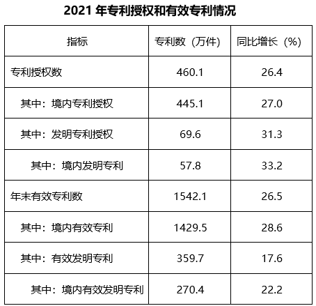

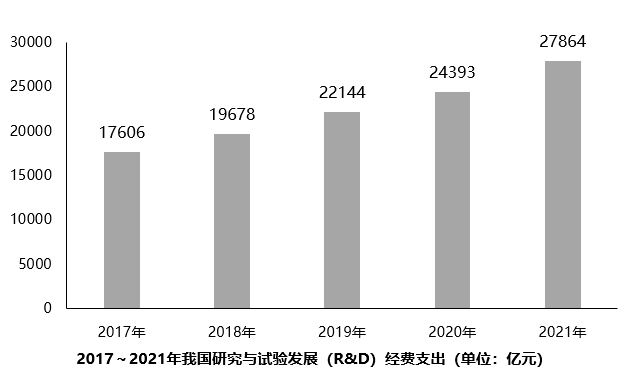

### 第 1 题　qid 5509880 · 增长

2021年，我国境内专利授权数比上一年增加：

- **A**. 120万件
- **B**. 95万件　✅
- **C**. 85万件
- **D**. 80万件

**答案**：B

**官方解析**

根据题干“······比上一年增加”，结合选项单位为“万件”，可判定本题为增长量计算问题。定位统计表可得：2021年境内专利授权数为445.1万件，同比增长27.0%。根据公式：增长量，则所求增长量万件，与B项最接近。

故正确答案为B。

---

### 第 2 题　qid 5509885 · 比重

2020年，境内发明专利占专利授权数的比重为：

- **A**. 11.9%　✅
- **B**. 12.6%
- **C**. 13.5%
- **D**. 14.3%

**答案**：A

**官方解析**

根据题干“2020年······占······比重为”，结合材料时间为2021年，可判定本题为基期比重问题。定位统计表可得：2021年境内发明专利数为57.8万件（A），同比增长33.2%（a）；专利授权数为460.1万件（B），同比增长26.4%（b）。根据公式：基期比重，则所求比重，仅A项满足。

故正确答案为A。

---

### 第 3 题　qid 5509889 · 增长

2018~2021年间，我国研究与试验发展经费支出同比增速最高的年份是：

- **A**. 2018年
- **B**. 2019年
- **C**. 2020年
- **D**. 2021年　✅

**答案**：D

**官方解析**

根据题干“······同比增速最高的年份”，可判定本题为一般增长率问题。定位统计图可得：2017~2021年我国研究与试验发展（R&amp;D）经费支出数据，根据公式：增长率，可得2018年我国研究与试验发展经费支出同比增速；2019年同比增速；2020年同比增速；2021年同比增速。比较可得，2018~2021年间，我国研究与试验发展经费支出同比增速最高的年份是2021年。

故正确答案为D。

---

### 第 4 题　qid 5509892 · 平均数

2017~2021年，我国研究与试验发展经费支出超过年平均值的年份的个数是：

- **A**. 1个
- **B**. 2个　✅
- **C**. 3个
- **D**. 4个

**答案**：B

**官方解析**

根据题干“2017~2021年······年平均值······”，可判定本题为现期平均数问题。定位统计图可得：2017~2021年我国研究与试验发展经费支出分别为17606亿元、19678亿元、22144亿元、24393亿元、27864亿元。根据公式：平均数，可得2017~2021年的年平均值为亿元，则超过年平均值的年份有2020年、2021年，共2个。

故正确答案为B。

---

### 第 5 题　qid 5509897 · 综合

下列说法正确的是：

- **A**. 
2021年，我国基础研究经费占经费的比重不到5%

- **B**. 
2021年，全国有效专利中有效发明专利不到20%

- **C**. 
2021年，专利授权数比上一年增加不超过100万件
　✅
- **D**. 
2021年，我国技术合同成交金额比上一年增加超过万亿元

**答案**：C

**官方解析**

A项：定位文字材料可得，2021年我国研究与试验发展（R&amp;D）经费支出27864亿元，其中基础研究经费1696亿元。则基础研究经费占R&amp;D经费的比重，错误；

B项：定位统计表可得，2021年有效专利数为1542.1万件，其中有效发明专利数为359.7万件。则全国有效发明专利数占有效专利数的比重，错误；

C项：定位文字材料可得，2021年全年授予专利权460.1万件，同比增长26.4%。根据公式：增长量，则专利授权数同比增量万件，正确；

D项：定位文字材料可得，2021年技术合同成交金额37294亿元，同比增长32.0%。根据公式：增长量，则我国技术合同成交金额同比增量亿元，错误。

故正确答案为C。

---

## 材料 2

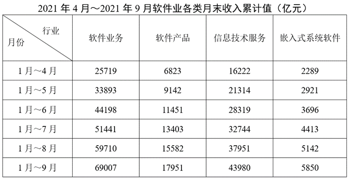

### 第 6 题　qid 5509883 · 综合

下图能正确反映2021年5月至9月软件产品收入（亿元）的是：

- **A**. 
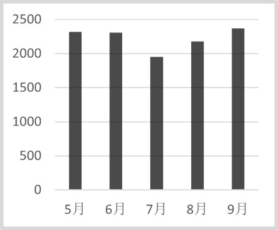
　✅
- **B**. 
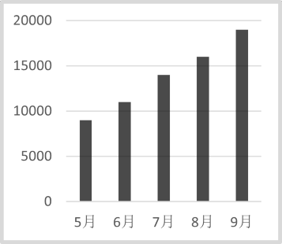

- **C**. 
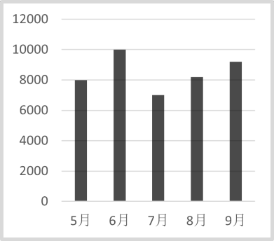

- **D**. 
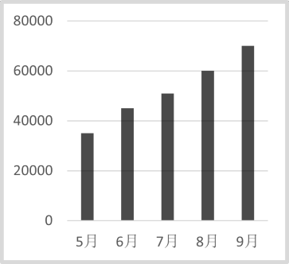

**答案**：A

**官方解析**

软件产品收入：5月=1月~5月-1月~4月=9142-6823=亿元；6月=1月~6月-1月~5月=11451-9142亿元；7月=1月~7月-1月~6月=13403-11451=1952亿元；8月=1月~8月-1月~7月=15582-13403亿元；9月=1月~9月-1月~8月=17951-15582亿元。只有A项满足。

故正确答案为A。

---

### 第 7 题　qid 5509886 · 综合

2021年5月至8月，信息技术服务收入最高的月份是：

- **A**. 5月
- **B**. 6月　✅
- **C**. 7月
- **D**. 8月

**答案**：B

**官方解析**

信息技术服务收入：5月=1月~5月-1月~4月=21314-16222亿元，6月=1月~6月-1月~5月=28319-21314亿元，7月=1月~7月-1月~6月=32744-28319亿元，8月=1月~8月-1月~7月=37951-32744亿元，故信息技术服务收入最高的月份是6月。

故正确答案为B。

---

### 第 8 题　qid 5509890 · 综合

2021年第三季度，信息技术服务收入约是嵌入式系统软件收入的：

- **A**. 7.3倍　✅
- **B**. 7.5倍
- **C**. 7.7倍
- **D**. 7.9倍

**答案**：A

**官方解析**

根据题干“2021年第三季度······是······的”，结合材料时间为2021年，可判定本题为现期倍数问题。定位表格材料，信息技术服务第三季度收入=1月~9月收入-1月~6月收入=43980-28319=15661亿元，嵌入式系统软件第三季度收入=1月~9收入-1月~6月收入=5850-3696=2154亿元，则所求倍数。

故正确答案为A。

---

### 第 9 题　qid 5509891 · 增长

2021年7月至9月软件业务收入最高的月份，嵌入式系统软件收入环比增速约为：

- **A**. -1%
- **B**. -3%　✅
- **C**. 1%
- **D**. 3%

**答案**：B

**官方解析**

根据题干“······环比增速······”，可判定本题为一般增长率计算问题。软件业务收入：7月=1月～7月-1月～6月=51441-44198亿元；8月=1月～8月-1月～7月=59710-51441亿元；9月=1月～9月-1月～8月=69007-59710亿元，故9月软件业务收入最高。嵌入式系统软件收入：9月=1月～9月-1月～8月=5850-5142=708亿元；8月=1月～8月-1月～7月=5142-4413=729亿元，根据公式：增长率，则9月嵌入式系统软件收入环比增速，与B项最接近。

故正确答案为B。

---

### 第 10 题　qid 5509894 · 综合

能够从上述材料中得出的是：

- **A**. 2021年9月，四类业务中信息技术服务收入占比最高
- **B**. 2021年8月，软件业务收入是信息技术服务收入的2倍
- **C**. 2021年6月，四类收入总计超过2万亿元　✅
- **D**. 2021年上半年，四类业务收入超过10万亿元

**答案**：C

**官方解析**

A项：定位表格材料可得2021年9月收入分别为：软件业务收入=69007-59710亿元；软件产品收入=17951-15582亿元；信息技术服务收入=43980-37951亿元；嵌入式系统软件收入=5850-5142亿元。根据公式： 比重，整体相同，信息技术服务收入并非最高，故其占比并非最高，错误；

B项：定位表格材料可得2021年8月：软件业务收入=59710-51441=8269亿元、信息技术服务收入=37951-32744=5207亿元，，两者并非2倍关系，错误；

C项：定位表格材料可得2021年6月软件业各类收入：软件业务收入=44198-33893=10305亿元；软件产品收入=11451-9142=2309亿元；信息技术服务收入=28319-21314=7005亿元；嵌入式系统软件收入=3696-2921=775亿元。四类收入总计亿元，超过2万亿元，正确；

D项：定位表格材料可得2021年上半年软件业各类收入，四类业务收入总计44198+11451+28319+3696＜45000+12000+29000+4000=90000亿元，不足10万亿元，错误。

故正确答案为C。

---

## 材料 3

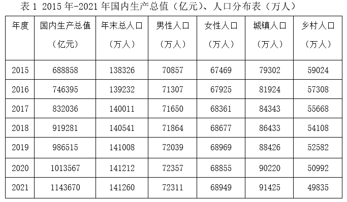

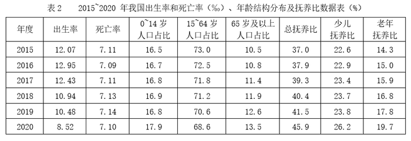

### 第 11 题　qid 5509926 · 综合

2020年，0～14岁的人口数约为：

- **A**. 19064万人
- **B**. 23877万人
- **C**. 25277万人　✅
- **D**. 26064万人

**答案**：C

**官方解析**

根据题干“2020年，0～14岁的人口数约为”，结合材料中有2020年总人口和0～14岁人口占比的数据，可判定本题为现期比重问题。定位表1可知，2020年总人口为141212万人；定位表2可知，2020年0～14岁人口占比为17.9%。因此2020年0～14岁的人口数为万人，与C项最接近。

故正确答案为C。

---

### 第 12 题　qid 5509927 · 综合

2019～2021年，我国人口男女性别比按降序排列正确的是：

- **A**. 2019年>2020年>2021年
- **B**. 2021年>2020年>2019年
- **C**. 2020年>2019年>2021年
- **D**. 2020年>2021年>2019年　✅

**答案**：D

**官方解析**

根据题干“2019～2021年，我国人口男女性别比按降序排列正确的是”，可判定本题为比值比较问题。定位表1可得：2019～2021年我国男性人口分别为72039万人、72357万人、72311万人；女性人口分别为68969万人、68855万人、68949万人。则2019～2021年，我国人口男女性别比分别为：2019年；2020年；2021年，观察可知， 2020年分子最大、分母最小，故其分数值最大，排除A、B两项；与2019年相比，2021年分子大、分母小，故其分数值更大，排除C项。

故正确答案为D。

---

### 第 13 题　qid 5509928 · 增长

“十三五”期间（2016-2020年），人口自然增长率最高的年份是：

- **A**. 2016年　✅
- **B**. 2017年
- **C**. 2018年
- **D**. 2019年

**答案**：A

**官方解析**

根据公式：人口自然增长率=人口出生率-人口死亡率，定位表2可知2016-2019年我国每年的出生率和死亡率，可得2016年人口自然增长率=12.95‰-7.09‰=5.86‰，2017年人口自然增长率=12.43‰-7.11‰=5.32‰，2018年人口自然增长率=10.94‰-7.13‰=3.81‰，2019年人口自然增长率=10.48‰-7.14‰=3.34‰，故2016年人口自然增长率最高。
故正确答案为A。

---

### 第 14 题　qid 5509929 · 综合

“十三五”期间，人口城镇化率超过60%的年份共有：

- **A**. 2个
- **B**. 3个
- **C**. 4个　✅
- **D**. 5个

**答案**：C

**官方解析**

根据题干“‘十三五’期间，人口城镇化率超过60%······”，结合材料给出各年份相应数据，可判定本题为现期比重问题。定位表1可得：“十三五（2016-2020年）”各年份总人口和城镇人口，根据公式：人口城镇化率 ，可知2016-2020年的人口城镇化率分别为：2016年人口城镇化率，2017年人口城镇化率，2018年人口城镇化率，2019年人口城镇化率，2020年人口城镇化率。超过60%的有2017年、2018年、2019年和2020年，共4个年份。 

故正确答案为C。

---

### 第 15 题　qid 5509930 · 综合

下列关于“十三五”期间我国人口发展状况，说法错误的是：

- **A**. 我国人口自然增长率表现向下的态势
- **B**. 我国少儿抚养比表现出持续上升的态势
- **C**. 每年都需要两个多劳动人口（15-64岁）负担一个被抚养人口
- **D**. 老年抚养比表现出持续下降的态势　✅

**答案**：D

**官方解析**

A项：定位表2可得2016-2020年我国人口出生率及死亡率。根据公式：人口自然增长率=出生率-死亡率，则“十三五”（2016-2020年）期间，我国人口自然增长率分别为：

2016年：12.95‰-7.09‰=5.86‰；2017年：12.43‰-7.11‰=5.32‰；2018年：10.94‰-7.13‰=3.81‰；2019年：10.48‰-7.14‰=3.34‰；2020年：8.52‰-7.10‰=1.42‰。比较可知，“十三五”期间，我国人口自然增长率表现向下的态势。正确；

B项：定位表2可得：2016-2020年我国少儿抚养比分别为：22.9%、23.4%、23.7%、23.8%、26.2%。比较可知，“十三五”期间，我国少儿抚养比表现出持续上升的态势。正确；

C项：定位表2可得2016-2020年我国15~64岁人口占比。两个多劳动人口（15~64岁）负担一个被抚养人口，需满足，即，化简可得：（66.7%）&lt;15~64岁人口占比&lt;（75%），观察发现，2016-2020年我国15~64岁人口占比均在此范围内。因此，“十三五”期间，我国每年都需要两个多劳动人口（15~64岁）负担一个被抚养人口。正确；

D项：定位表2可得：2016-2020年我国老年抚养比分别为：15.0%、15.9%、16.8%、17.8%、19.7%。比较可知，“十三五”期间，我国老年抚养比表现出持续上升的态势，并非下降。错误。

本题为选非题，故正确答案为D。

---

## 材料 4

        据对全国6.4万家规模以上文化及相关产业企业调查，2021年前三季度，上述企业实现营业收入84205亿元，按可比口径计算，同比增长21.8%；两年平均增长10.0%。

        分业态营业收入情况：文化新业态特征较为明显的16个行业小类28322亿元，同比增长26.1%；两年平均增长24.0%，高于全部规模以上文化及相关产业企业14.0个百分点。

        分行业类别营业收入情况：新闻信息服务9847亿元，同比增长22.1%；内容创作生产17693亿元，同比增长18.6%；创意设计服务13787亿元，同比增长24.0%；文化传播渠道9309亿元，同比增长30.1%；文化投资运营359亿元，同比增长13.8％；文化娱乐休闲服务916亿元，同比增长35.3％；文化辅助生产和中介服务11441亿元，同比增长18.3％；文化装备生产4880亿元，同比增长17.8％；文化消费终端生产15974亿元，同比增长22.0％。

        分产业类型营业收入情况：文化制造业30950亿元，同比增长17.7％；文化批发和零售业13561亿元，同比增长26.0％；文化服务业39693亿元，同比增长23.7％。

        分领域营业收入情况：文化核心领域51911亿元，同比增长22.9％；文化相关领域32294亿元，同比增长20.0％。

        分区域营业收入情况：东部地区64715亿元，同比增长22.5％；中部地区11417亿元，同比增长19.7％；西部地区7329亿元，同比增长19.0％；东北地区744亿元，同比增长20.2％。

### 第 16 题　qid 5509913 · 综合

2020年前三季度，文化新业态特征较为明显的16个行业小类营业收入约占6.4万家规模以上文化及相关产业营业收入的：

- **A**. 32%　✅
- **B**. 40%
- **C**. 45%
- **D**. 49%

**答案**：A

**官方解析**

根据题干“2020年前三季度······占······”，结合材料时间为2021年前三季度，可判定本题为基期比重问题。定位文字材料第一段可知：据对全国6.4万家规模以上文化及相关产业企业调查，2021年前三季度，上述企业实现营业收入84205亿元（B），按可比口径计算，同比增长21.8%（b）。定位文字材料第二段可知：文化新业态特征较为明显的16个行业小类28322亿元（A），同比增长26.1%（a）。根据公式：基期比重，故所求，只有A项在范围内。

故正确答案为A。

---

### 第 17 题　qid 5509915 · 增长

2021年前三季度，分行业类别中，同比增速最高行业营业收入是同比增速最低行业营业收入的：

- **A**. 2倍多　✅
- **B**. 3倍多
- **C**. 20多倍
- **D**. 30多倍

**答案**：A

**官方解析**

根据题干“2021年前三季度······是······的”，结合选项为倍数，可判定本题为现期倍数问题。定位文字材料第三段可得：2021年前三季度，分行业类别中，文化投资运营营业收入359亿元，同比增长13.8％（同比增速最低）；文化娱乐休闲服务营业收入916亿元，同比增长35.3％（同比增速最高）。则题干所求倍数，即2倍多。

故正确答案为A。

---

### 第 18 题　qid 5509916 · 比重

与上一年相比，2021年前三季度分行业类别中，占全国6.4万家规模以上文化及相关产业企业营业总收入比重增加的行业个数是：

- **A**. 3个
- **B**. 4个
- **C**. 5个　✅
- **D**. 6个

**答案**：C

**官方解析**

根据题干“与上一年相比，2021年前三季度······占全国······比重增加的行业个数是”，可判定本题为两期比重问题。定位文字材料第一段可得，据对全国6.4万家规模以上文化及相关产业······2021年前三季度，上述企业实现营业收入······同比增长21.8%（b）；定位文字材料第三段可得，分行业类别营业收入同比增速情况：新闻信息服务22.1%（）；内容创作生产18.6%（）；创意设计服务24.0%（）；文化传播渠道30.1%（）；文化投资运营13.8%（）；文化娱乐休闲服务35.3%（）；文化辅助生产和中介服务18.3%（）；文化装备生产17.8%（）；文化消费终端生产22.0%（）。根据两期比重比较结论：当部分增长率（a）＞总体增长率（b）时，比重上升。则满足a＞b的有：新闻信息服务22.1%，创意设计服务24.0%，文化传播渠道30.1%，文化娱乐休闲服务35.3%，文化消费终端生产22.0%，共5个。

故正确答案为C。

---

### 第 19 题　qid 5509917 · 综合

2020年前三季度，分产业类型营业收入的结构正确的是：

- **A**. 
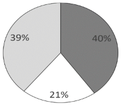

- **B**. 
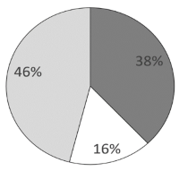
　✅
- **C**. 
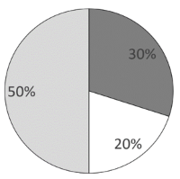

- **D**. 
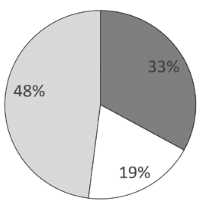

**答案**：B

**官方解析**

根据题干“2020年前三季度······营业收入的结构······”，结合材料时间为2021年前三季度，可判定本题为基期比重问题。定位文字材料第一段可得，2021年前三季度，全国6.4万家规模以上文化及相关产业企业实现营业收入84205亿元，同比增长21.8%；定位文字材料第四段可得，分产业类型营业收入情况：文化制造业30950亿元，同比增长17.7％；文化批发和零售业13561亿元，同比增长26.0％；文化服务业39693亿元，同比增长23.7％。

方法一：根据公式：基期量，则2020年前三季度文化制造业营业收入为亿元；文化批发和零售业营业收入为亿元；文化服务业营业收入为亿元。由于总量一定，各部分所占比重大小关系应与部分量大小关系一致，其中文化服务业营业收入（32000亿元）约为文化批发和零售业营业收入（11000亿元）的3倍，只有B项符合。

方法二：根据公式：基期比重，则2020年前三季度文化制造业营业收入占全国6.4万家规模以上文化及相关产业企业实现营业收入的比重。

故正确答案为B。

---

### 第 20 题　qid 5509918 · 综合

关于2020年前三季度，以下说法正确的是：

- **A**. 文化新业态特征较为明显的16个行业小类营业收入同比增速高于2021年同期
- **B**. 内容创作生产营业收入超过15000亿元
- **C**. 文化核心领域收入超过文化相关领域收入2倍
- **D**. 东部地区与中部地区营业收入之比低于2021年同期　✅

**答案**：D

**官方解析**

A项：定位文字材料第二段可得：（2021年前三季度）文化新业态特征较为明显的16个行业小类（实现营业收入）28322亿元，同比增长26.1%（）；两年平均增长24.0%。根据公式：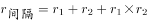，则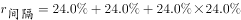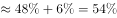，则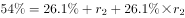，解得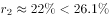，即2020年前三季度，文化新业态特征较为明显的16个行业小类营业收入同比增速低于2021年同期。此项也可以这样理解，2021年前三季度增长率为26.1%，两年平均增长率为24.0%，则2020年前三季度增长率必然小于26.1%（否则两年平均增长率要大于26.1%，不可能为24.0%），错误；

B项：定位文字材料第三段可得：（2021年前三季度）内容创作生产（实现营业收入）17693亿元，同比增长18.6%。根据公式：基期量，则2020年前三季度内容创作生产营业收入为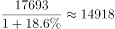亿元＜15000亿元，错误；

C项：定位文字材料第五段可得：（2021年前三季度）分领域营业收入情况：文化核心领域51911亿元（A），同比增长22.9％（a）；文化相关领域32294亿元（B），同比增长20.0％（b）。代入基期倍数公式：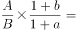，并非超过2倍，错误；

D项：定位文字材料第六段可得：（2021年前三季度）分区域营业收入情况：东部地区64715亿元，同比增长22.5％（a）；中部地区11417亿元，同比增长19.7％（b）。根据两期比例比较结论：分子增长率（a）＞分母增长率（b），比例上升。22.5%（a）＞19.7%（b），则2021年前三季度，东部地区与中部地区营业收入之比上升，即2020年前三季度，东部地区与中部地区营业收入之比低于2021年同期，正确。

故正确答案为D。

---
