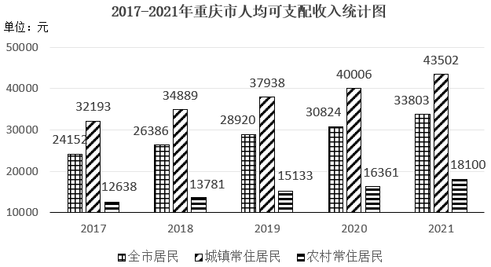
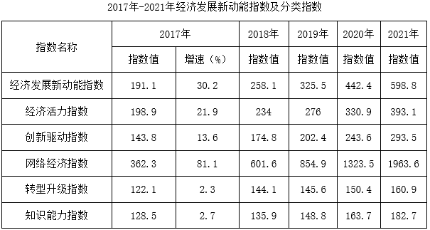

# 2023年重庆市选调优秀大学生到基层工作考试《行测》题

> 资料分析 · 10 题 · 选调 2023

## 材料 1

        2021年重庆市全市居民人均消费支出24598元，比上年增长13.5%。按常住地分，城镇常住居民人均消费支出29850元，同比增长12.8%；农村常住居民人均消费支出16096元，同比增长13.8%。

### 第 1 题　qid 13255448 · 平均数

2017-2021五年间重庆市城镇常住居民人均可支配收入与农村常住居民人均可支配收入之比最小的是（    ）。

- **A**. 2018年
- **B**. 2019年
- **C**. 2020年
- **D**. 2021年　✅

**答案**：D

**官方解析**

根据题干“2017-2021五年间······之比最小的是”，可判定本题为比值比较问题。定位统计图可得2017-2021年重庆市城镇常住居民人均可支配收入与农村常住居民人均可支配收入。则选项各年份重庆市城镇常住居民人均可支配收入与农村常住居民人均可支配收入之比分别为：

A项：2018年，；

B项：2019年，；

C项：2020年，；

D项：2021年，。

比较可知，2017-2021五年间重庆市城镇常住居民人均可支配收入与农村常住居民人均可支配收入之比最小的是2021年。

故正确答案为D。

---

### 第 2 题　qid 13255449 · 综合

2020年重庆市农村常住居民经营性收入比城镇常住居民经营性收入大约（    ）。

- **A**. 多1083元　✅
- **B**. 少1083元
- **C**. 多1216元
- **D**. 少1216元

**答案**：A

**官方解析**

根据题干“2020年······比······”，结合选项为多/少+具体单位，结合材料时间为2021年，可判定本题为基期和差问题。定位统计表可得：2021年重庆市农村常住居民经营性收入为6110元，比上年增长9.8%；城镇常住居民经营性收入为4894元，比上年增长9.2%。根据公式：基期量，可得所求元，即约多1060元，与A项最接近。

故正确答案为A。

---

### 第 3 题　qid 13255451 · 平均数

2020年重庆市城镇常住居民人均消费支出与可支配收入之比大约是（    ）。

- **A**. 58.2%
- **B**. 66.1%　✅
- **C**. 69.6%
- **D**. 72.3%

**答案**：B

**官方解析**

根据题干“2020年······之比大约是”，可判定本题为比值计算问题。定位文字材料可得：2021年重庆市城镇常住居民人均消费支出29850元，同比增长12.8%。定位统计图可得：2020年重庆市城镇常住居民人均可支配收入为40006元。根据公式：基期量，可得2020年重庆市城镇常住居民人均消费支出。则所求之比，与B项最接近。

故正确答案为B。

---

### 第 4 题　qid 13255454 · 增长

2017年-2021年期间，重庆市城镇常住居民人均可支配收入平均增长率比农村常住居民人均可支配收入平均增长率约（    ）。

- **A**. 高8.09%
- **B**. 低8.09%
- **C**. 高1.57%
- **D**. 低1.57%　✅

**答案**：D

**官方解析**

根据题干“2017年-2021年期间······平均增长率约”，可判定本题为年均增长率问题。定位统计图可得：2017年重庆市城镇和农村常住居民人均可支配收入分别为32193元、12638元；2021年重庆市城镇和农村常住居民人均可支配收入分别为43502元、18100元。根据公式：（n为年份差），可得2017年-2021年期间，重庆市城镇常住居民人均可支配收入平均增长率：，解得：；重庆市农村常住居民人均可支配收入平均增长率：，解得：；则所求=7.7%-9.5%=-1.8%，即重庆市城镇常住居民人均可支配收入平均增长率比农村常住居民人均可支配收入平均增长率约低1.8%，与D项最接近。

故正确答案为D。

---

### 第 5 题　qid 13255455 · 综合

能够从上述资料中推出的是（    ）。

- **A**. 2020年城镇常住居民工资性收入低于2020年全市居民人均消费支出
- **B**. 2021年城镇常住居民财产性收入增长率高于农村常住居民财产性收入增长率
- **C**. 2019年农村常住居民人均可支配收入增长率高于城镇常住居民人均可支配收入增长率　✅
- **D**. 2021年城镇居民人均可支配收入增长率高于农村居民人均可支配收入增长率

**答案**：C

**官方解析**

A项：定位统计表可得，2021年重庆市城镇常住居民工资性收入为25396元，同比增长8.7%；定位文字材料可得，2021年重庆市全市居民人均消费支出24598元，比上年增长13.5%。根据公式：基期量，可得2020年重庆市城镇常住居民工资性收入为；2021年重庆市全市居民人均消费支出为。因的分子大且分母小，根据“分子分母一大一小，分子大的分数大”，故&gt;，即2020年城镇常住居民工资性收入高于2020年全市居民人均消费支出，错误；

B项：定位统计表可得，2021年城镇常住居民财产性收入同比增长8.6%，农村常住居民财产性收入同比增长9.9%，8.6%&lt;9.9%，错误；

C项：定位统计图可得，2019年农村常住居民人均可支配收入和城镇常住居民人均可支配收入分别为15133元和37938元，2018年分别为13781元和34889元。根据公式：增长率，可得：2019年农村常住居民人均可支配收入增长率；城镇常住居民人均可支配收入增长率，即2019年农村常住居民人均可支配收入增长率高于城镇常住居民人均可支配收入增长率，正确；

D项：定位统计图可得，2021年城镇常住居民人均可支配收入和农村常住居民人均可支配收入分别为43502元和18100元，2020年分别为40006元和16361元。根据公式：增长率，可得：2021年城镇常住居民人均可支配收入增长率；农村常住居民人均可支配收入增长率，即2021年城镇常住居民人均可支配收入增长率低于农村常住居民人均可支配收入增长率，错误。

故正确答案为C。

---

## 材料 2

        2021年，我国经济发展新动能指数为598.8，比上年增长35.4%。2021年，各项分类指数与上年相比均有提升，其中，网络经济指数增长最快，对总指数增长的贡献率为81.9%。

附：1.分类指数对总指数增长贡献率公式：

2.各分类指数占总指数的权重均为0.2

### 第 6 题　qid 13255481 · 综合

2016年分类指数值中最大与最小之差约为（    ）。

- **A**. 45
- **B**. 61
- **C**. 75
- **D**. 81　✅

**答案**：D

**官方解析**

根据题干“2016 年分类指数值中······之差约为”，结合材料时间为2017年，可判定本题为基期和差问题。定位表格材料可得2017年各分类指数值及增速。根据公式：，可得2016年各分类指数分别为：

经济活力指数：；

创新驱动指数：；

网络经济指数：；

转型升级指数：；

知识能力指数：。

综上可知，2016年网络经济指数最大，转型升级指数最小，则所求差值=200-120=80，与D项最接近。

故正确答案为D。

---

### 第 7 题　qid 13255485 · 综合

2017年-2021年，与经济发展新动能指数值同向变化的分类指数有多少?

- **A**. 2
- **B**. 3
- **C**. 4
- **D**. 5　✅

**答案**：D

**官方解析**

定位表格材料可得2017年-2021年经济发展新动能指数值及各分类指数值。观察发现，2017年-2021年经济发展新动能指数值逐年上升，经济活力指数、创新驱动指数、网络经济指数、转型升级指数、知识能力指数均逐年上升，则与经济发展新动能指数值同向变化的分类指数有5个。
故正确答案为D。

---

### 第 8 题　qid 13255486 · 增长

2017年-2021年，各分类指数对经济发展新动能指数增长的贡献中，贡献最大与贡献最小之间相差最悬殊的是哪一年?

- **A**. 2018
- **B**. 2019
- **C**. 2020
- **D**. 2021　✅

**答案**：D

**官方解析**

根据题干“2017年-2021年，各分类指数对经济发展新动能指数增长的贡献中······”，可判定本题为现期比重问题。定位表格材料可得2017年-2021年经济发展新动能指数及各分类指数值。根据公式：贡献率，由于相同年份计算贡献率时（报告期总指数值-上年总指数值）、各分类指数占总指数的权重均相同，则各分类指数之间（报告期分类指数值-上年分类指数值）差距越大，贡献率之间的差距越悬殊。

2018年各分类指数（报告期分类指数值-上年分类指数值）分别为：经济活力指数：234-198.9=35.1，创新驱动指数：174.8-143.8=31，网络经济指数：601.6-362.3=239.3，转型升级指数：144.1-122.1=22，知识能力指数：135.9-128.5=7.4，则贡献率悬殊最大的为网络经济指数与知识能力指数，差值为；

2019年各分类指数（报告期分类指数值-上年分类指数值）分别为：经济活力指数：276-234=42，创新驱动指数：202.4-174.8=27.6，网络经济指数：854.9-601.6=253.3，转型升级指数：145.6-144.1=1.5，知识能力指数：148.8-135.9=12.9，则贡献率悬殊最大的为网络经济指数与转型升级指数，差值为；

2020年各分类指数（报告期分类指数值-上年分类指数值）分别为：经济活力指数：330.9-276=54.9，创新驱动指数：243.6-202.4=41.2，网络经济指数：1323.5-854.9=468.6，转型升级指数：150.4-145.6=4.8，知识能力指数：163.7-148.8=14.9，则贡献率悬殊最大的为网络经济指数与转型升级指数，差值为；

2021年各分类指数（报告期分类指数值-上年分类指数值）分别为：经济活力指数：393.1-330.9=62.2，创新驱动指数：293.5-243.6=49.9，网络经济指数：1963.6-1323.5=640.1，转型升级指数：160.9-150.4=10.5，知识能力指数：182.7-163.7=19，则贡献率悬殊最大的为网络经济指数与转型升级指数，差值为。

综上可知，所求各分类指数对经济发展新动能指数增长的贡献中，贡献最大与贡献最小之间相差最悬殊的是2021年。

故正确答案为D。

---

### 第 9 题　qid 13255487 · 增长

2016年-2021年，网络经济指数相邻两年同比增速变化幅度的绝对值最大约为（    ）。

- **A**. 13%
- **B**. 15%
- **C**. 20%
- **D**. 24%　✅

**答案**：D

**官方解析**

根据题干“2016年-2021年······同比增速变化幅度······”，可判定本题为一般增长率问题。定位表格材料可得2017年-2021年网络经济指数值，以及2017年网络经济指数的同比增速为81.1%。根据公式：增长率，则2018年网络经济指数同比增速为，与上年同比增速相差约81.1%-66.5%=14.6%，即相差约14.6个百分点；2019年同比增速为，与上年相差约66.5%-42.2%=24.3%，即相差约24.3个百分点。因选项最大值为24%，故其他年份无需验证，D项当选。

故正确答案为D。

---

### 第 10 题　qid 13255492 · 综合

不能从上述资料中推出的是（    ）。

- **A**. 2017年-2021年，知识能力指数同比增速逐年提高
- **B**. 2018年-2021年，创新驱动指数同比增速均高于经济活力指数同比增速　✅
- **C**. 2018年-2021年，创新驱动指数对经济发展新动能指数增长的贡献逐年下降
- **D**. 2018年-2021年，网络经济指数对经济发展新动能指数增长的贡献越来越大

**答案**：B

**官方解析**

A项：定位表格材料可得2017年-2021年知识能力指数值，以及2017年知识能力指数同比增速为2.7%。根据公式：增长率，则2018年知识能力指数同比增速为，2019年的同比增速为，2020年的同比增速为，2021年的同比增速为，同比增速逐年提高，正确；

B项：定位表格材料可得2017年-2021年创新驱动指数值及经济活力指数值。根据公式：增长率，则2018年创新驱动指数同比增速为，经济活力指数同比增速为；2019年创新驱动指数同比增速为，经济活力指数同比增速为，创新驱动指数同比增速低于经济活力指数同比增速，错误；

C项：定位表格材料可得2017年-2021年创新驱动指数值及经济发展新动能指数值。根据材料附加公式：贡献率（各分类指数占总指数的权重均为0.2），则2018年创新驱动指数贡献率，2019年的贡献率，2020年的贡献率，2021年的贡献率，贡献逐年下降，正确；

D项：定位表格材料可得2017年-2021年网络经济指数值及经济发展新动能指数值。根据材料附加公式：贡献率（各分类指数占总指数的权重均为0.2），则2018年网络经济指数贡献率，2019年的贡献率，2020年的贡献率，2021年的贡献率，贡献逐年上升，正确。

本题为选非题，故正确答案为B。

---
