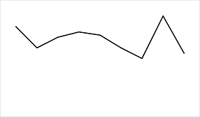
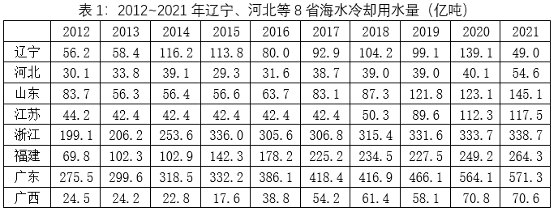
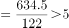
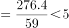
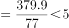
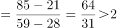
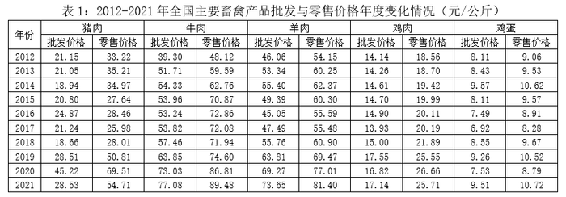
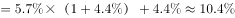
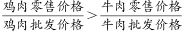

# 2023年陕西省公务员录用考试《行测》题（网友回忆版）

> 资料分析 · 20 题 · 陕西 2023

## 材料 1

        2021年，全国城市供水总量673.34亿立方米，同比增长6.96%；城市供水管道长度105.99万公里，同比增长5.26%；人均日生活用水量185.03升；供水普及率99.38%，比上年增加0.39个百分点。天津、河北、上海、江苏、浙江和广东6个省（市）城市供水普及率达到100%；福建、山东、湖北、广西、安徽、辽宁、宁夏、新疆、内蒙古、山西、甘肃、河南、黑龙江、江西、云南和湖南16个省（区）超过99%（含）；西藏、青海、北京、四川、贵州和陕西6个省（区、市）超过98%；重庆、吉林、海南3个省（市）和新疆建设兵团超过95%。

### 第 1 题　qid 5510181 · 综合

2020年，全国城市供水总量约为：

- **A**. 600亿立方米
- **B**. 620亿立方米
- **C**. 630亿立方米　✅
- **D**. 724亿立方米

**答案**：C

**官方解析**

根据题干“2020年，全国城市供水总量约为”，结合材料时间为2021年，可判定本题为基期计算问题。定位文字材料第一段可得：2021年，全国城市供水总量673.34亿立方米，同比增长6.96%。根据公式：基期量，则所求亿立方米，与C项最接近。

故正确答案为C。

---

### 第 2 题　qid 5509972 · 增长

2021年全国城市供水管道长度比2020年增长约：

- **A**. 5万公里
- **B**. 5.3万公里　✅
- **C**. 5.6万公里
- **D**. 6万公里

**答案**：B

**官方解析**

根据题干“2021年······比2020年增长约”，结合选项带单位，可判定本题为增长量计算问题。定位文字材料可得：2021年，城市供水管道长度105.99万公里，同比增长5.26%。根据公式：增长量，则2021年全国城市供水管道长度比2020年增长万公里。

故正确答案为B。

---

### 第 3 题　qid 5509989 · 增长

下列折线图中，最能准确反映2013~2021年全国城市人均日生活用水量同比增长率变化情况的是：

- **A**. 

　✅
- **B**. 

- **C**. 

- **D**. 

**答案**：A

**官方解析**

根据题干“······同比增长率变化情况的是”，可判定本题为一般增长率问题。定位图1可得2013-2021年全国城市人均日生活用水量的数据。根据公式：增长率，可得2013年全国城市人均日生活用水量同比增长率；2014年同比增长率，通过分子大、分母小可知，2013年的同比增长率＞2014年的同比年增长率，排除C项。2020年人均日生活用水量＜2019年人均日生活用水量，则2020年的同比增长率＜0，其余年份同比增长率均大于0，故2020年同比增长率应为最小，排除B项。2016年的同比增长率，2021年的同比增长率，故2021年的同比增长率＞2016年的同比增长率，排除D项。

故正确答案为A。

注：排除C项后，2016-2020年的同比增长量变化不大，2021年的增长量5.63（185.03-179.40）最大，是其他年份的数倍，且基期量差别不大，所以2016-2021年这几年里2021年对应的增长率也最大，故正确答案为A。

---

### 第 4 题　qid 5509992 · 平均数

图2中，城市人均日生活用水量最高的省份是用水量中位数省份的约：

- **A**. 1.78倍
- **B**. 1.88倍　✅
- **C**. 1.95倍
- **D**. 2.03倍

**答案**：B

**官方解析**

根据题干“图2中······是······”，结合选项求倍数，可判定本题为现期倍数问题。定位图2可知，城市人均日生活用水量最高的省份是海南，用水量为315升；城市人均日生活用水量中位数省份，即排名第8的省份为宁夏，用水量为168升。故城市人均日生活用水量最高的省份是用水量中位数省份的倍数为倍，与B项最接近。

故正确答案为B。

---

### 第 5 题　qid 5509996 · 综合

能够从上述资料推出的是：

- **A**. 2012～2021年，全国城市供水普及率逐年增长
- **B**. 2021年，浙江和广东的供水普及率低于新疆建设兵团
- **C**. 2012～2021年，全国城市人均日生活用水量平均值不超过176升
- **D**. 图2中，用水量排名前三名的省（区、市）城市人均日生活用水量之和是排名后三位的约2.13倍　✅

**答案**：D

**官方解析**

A项：定位文字材料可得2020年、2021年全国城市供水普及率，但未给出其余年份的全国城市供水普及率，无法推出，错误；

B项：定位文字材料可得，2021年浙江和广东城市供水普及率达到100%，新疆建设兵团超过95%。比较可知2021年浙江和广东的供水普及率高于新疆建设兵团，错误；

C项：定位图1可得2012-2021年全国城市人均日生活用水量。则所求平均值升＞176升，错误；

D项：定位图2可得用水量排名前三名的省（区、市）城市人均日生活用水量分别为海南315升、西藏256升、广东251升；用水量排名后三位分别为天津123升、吉林125升、山西138升。则所求倍数倍，正确。

故正确答案为D。

---

## 材料 2

        2012~2021的10年间，辽宁、天津、河北、山东、江苏、上海、浙江、福建、广东、广西、海南11个沿海省市的核电、火电、钢铁、石化等行业的海水冷却用水量稳步增长（图1），其中浙江、福建、广东3省海水冷却用水量相对较高（表1）。截至2021年底，11个沿海省市共建有海水冷却工程22个，2021年全国11个沿海省市海水冷却工程年总循环量为169.5亿吨。

### 第 6 题　qid 5510158 · 综合

图1中相较于2012年，11个沿海省市海水冷却用水量实现翻一番的年份首次出现在：

- **A**. 2018年
- **B**. 2019年
- **C**. 2020年　✅
- **D**. 2021年

**答案**：C

**官方解析**

根据题干“图1中相较于2012年······实现翻一番的年份首次出现在”，根据“翻一番即变为原来的2倍”，可判定本题为现期倍数问题。定位图1可得，2012年全国11个沿海省市海水冷却用水量为841.0亿吨。在2012年基础上翻一番后用水量为841.0×2=1682亿吨，结合图1可知，相较于2012年，2020年海水冷却用水量首次实现翻一番（1698.1亿吨&gt;1682亿吨）。
故正确答案为C。

---

### 第 7 题　qid 5510116 · 增长

图1中2012～2021年期间海水冷却用水量年增量高于2012～2021年期间全国海水冷却用水量年平均增长量的年份共有几个？

- **A**. 2
- **B**. 3
- **C**. 4　✅
- **D**. 5

**答案**：C

**官方解析**

根据题干“······2012～2021年期间全国海水冷却用水量年平均增长量······”，可判定本题为年均增长量问题。定位图形材料可得2012～2021年全国11个沿海省市海水冷却用水量。根据公式：年均增长量，可得2012～2021年期间全国海水冷却用水量年平均增长量亿吨；根据公式：增长量=现期量-基期量，可得2013～2021年海水冷却用水量年增量分别为：

2013年=883.0-841.0&lt;100亿吨&lt;103.8亿吨；

2014年=1009.0-883.0&gt;120亿吨&gt;103.8亿吨；

2015年=1125.7-1009.0&gt;110亿吨&gt;103.8亿吨；

2016年=1201.4-1125.7&lt;100亿吨&lt;103.8亿吨；

2017年=1344.9-1201.4&gt;140亿吨&gt;103.8亿吨；

2018年=1391.6-1344.9&lt;100亿吨&lt;103.8亿吨；

2019年=1486.1-1391.6&lt;100亿吨&lt;103.8亿吨；

2020年=1698.1-1486.1&gt;200亿吨&gt;103.8亿吨；

2021年=1775.1-1698.1&lt;100亿吨&lt;103.8亿吨。

综上，年增量高于2012～2021年期间全国海水冷却用水量年平均增长量的年份有2014年、2015年、2017年、2020年，共4个年份。

故正确答案为C。

---

### 第 8 题　qid 5510163 · 综合

表1中，2021年除浙江、福建、广东外的5个沿海省市海水冷却用水量占全国11个沿海省市的：

- **A**. 24.6%　✅
- **B**. 33.8%
- **C**. 47.6%
- **D**. 66.2%

**答案**：A

**官方解析**

根据题干“表1中，2021年······占······的”，结合选项为百分数，可判定本题为现期比重问题。定位图1可得：2021年全国11个沿海省市的海水冷却用水量为1775.1亿吨；定位表1可得：2021年除浙江、福建、广东外的5个沿海省市海水冷却用水量分别为49.0亿吨、54.6亿吨、145.1亿吨、117.5亿吨、70.6亿吨。根据公式：比重，题目所求，与A项最接近。

故正确答案为A。

---

### 第 9 题　qid 5510164 · 综合

2021年海水冷却用水量低于海水冷却工程年总循环量的沿海省市共有几个：

- **A**. 5个
- **B**. 6个
- **C**. 7个
- **D**. 8个　✅

**答案**：D

**官方解析**

定位文字材料可得，2021年全国11个沿海省市海水冷却工程年总循环量为169.5亿吨。结合表格比较可得，8个沿海省中，海水冷却用水量低于海水冷却工程年总循环量的省份共有5个，分别为辽宁（49.0亿吨）、河北（54.6亿吨）、山东（145.1亿吨）、江苏（117.5亿吨）、广西（70.6亿吨）。

除表中8省外，剩余3个沿海省市海水冷却用水量之和亿吨。因3个省市的海水冷却用水量之和（163.1亿吨）低于海水冷却工程年总循环量（169.5亿吨），则每个省市的海水冷却用水量均应低于海水冷却工程年总循环量。

故满足要求的沿海省市共5+3=8个。

故正确答案为D。

---

### 第 10 题　qid 5510165 · 综合

可以从上述资料推出的是：

- **A**. 2021年全国11个沿海省份海水冷却用水量前4名依次为：广东、浙江、福建、江苏
- **B**. 2012~2021年浙江、广东年海水冷却用水量之和均超过全国同期的60%
- **C**. 2012~2021年表1的8个省市中福建的海水冷却用水量年平均增速最快　✅
- **D**. 2012~2021年间，广东的海水冷却用水量均为辽宁同期的3倍以上

**答案**：C

**官方解析**

A项：定位表1，2021年辽宁、河北等8省海水冷却用水量前4名依次为：广东（571.3亿吨）、浙江（338.7亿吨）、福建（264.3亿吨）、山东（145.1亿吨），江苏省在此表中排名为第5，故一定无法排到全国11个沿海省份海水冷却用水量的前4名，错误；

B项：定位图1可知2012～2021年全国11个沿海省市的海水冷却用水量，定位表1可知2012～2021年浙江、广东年海水冷却用水量。2012年浙江、广东年海水冷却用水量之和占全国11个沿海省市的海水冷却用水量的比重为，并非均超过全国同期的60%，错误；

C项：定位表1可知2012年、2021年辽宁、河北等8省海水冷却用水量。根据年均增长率公式：（n为年份差），当年份差相同时，直接比较即可。表1的8个省份分别为：辽宁，；河北，；山东，；江苏，；浙江，；福建，；广东，；广西，，比较可知8个省份中福建的海水冷却用水量年平均增速最快，正确；

D项：定位表1可知2012～2021年间，广东、辽宁的海水冷却用水量。2014年广东的海水冷却用水量为辽宁同期的倍倍，并非均为3倍以上，错误。

故正确答案为C。

---

## 材料 3

        2021年中国雨季特征为华南前汛期于4月26日开始，7月2日结束，雨季长度为67天，总雨量494.6毫米。与正常年份相比，开始偏晚20天，结束偏早4天，雨季长度偏短24天，雨量偏少31%。

        西南雨季于6月4日开始，10月4日结束，雨季长度为122天，总雨量634.5毫米。与正常年份相比，开始偏晚9天，结束偏早10天，雨季长度偏短19天，雨量偏少15%。

        华北雨季于7月12日开始，9月9日结束，雨季长度为59天，总雨量276.4毫米。与正常年份相比，开始偏早6天，结束偏晚22天，雨季长度偏长28天，为1961年以来第二长；雨量偏多103%，为1961年以来第三多。

        东北雨季于6月5日开始，8月29日结束，雨季长度为85天，总雨量364.3毫米。与正常年份相比，开始偏早17天，结束偏晚4天，雨季长度偏长21天，雨量偏多23%。

        华西秋雨于8月23日开始，雨季长度为77天，总雨量379.9毫米。与正常年份相比，开始偏早8天，结束偏晚7天，雨季长度偏长15天，雨量偏多87%，为1961年以来最多。

        梅雨于6月9日开始，7月11日出梅，梅雨期32天，梅雨量267.2毫米；与正常年份相比，入梅时间偏晚1天，出梅时间偏早7天，梅雨期偏短8天，梅雨量偏少22%，与2020年梅雨量780.9毫米相比差距明显。江南入梅时间偏晚1天，出梅偏晚3天，雨量偏少15%；长江中下游入梅偏早4天，出梅偏早2天，雨量偏少8%；江淮区入梅时间偏早8天，出梅时间偏早4天，梅雨量偏少14%。

### 第 11 题　qid 5509984 · 综合

2021年雨季开始时间最迟的两个地区在雨季开始时间上相差了：

- **A**. 34天
- **B**. 35天
- **C**. 41天
- **D**. 42天　✅

**答案**：D

**官方解析**

定位文字材料可知：2021年雨季开始时间最迟的两个地区分别为华北（7月12日）、华西（8月23日），故时间上相差了31-12+23=42天（7月共有31天）。
故正确答案为D。

---

### 第 12 题　qid 5510133 · 综合

华西秋雨正常年份结束的时间是：

- **A**. 11月8日
- **B**. 11月6日
- **C**. 11月1日　✅
- **D**. 10月30日

**答案**：C

**官方解析**

定位文字材料第五段可得，（2021年）华西秋雨于8月23日开始，雨季长度为77天。与正常年份相比，开始偏早8天，结束偏晚7天。则2021年华西秋雨持续了8月9天、9月30天、10月31天、11月7天，共计77天，于11月8日结束。比正常年份结束偏晚7天，则正常年份结束时间应为11月1日。
故正确答案为C。

---

### 第 13 题　qid 5509985 · 平均数

下列地区中2021年雨季期平均每天降雨量最大的地区是：

- **A**. 西南　✅
- **B**. 华北
- **C**. 东北
- **D**. 华西

**答案**：A

**官方解析**

根据题干“下列地区中2021年雨季期平均每天降雨量最大的地区是”，可判定本题为现期平均数问题。定位文字材料第二段至第五段可得：2021年西南雨季长度为122天，总雨量634.5毫米；华北雨季长度为59天，总雨量276.4毫米；东北雨季长度为85天，总雨量364.3毫米；华西雨季长度为77天，总雨量379.9毫米。根据公式：雨季期平均每天降雨量，则各地区平均每天降雨量分别为：

西南毫米/天；

华北毫米/天；

东北毫米/天；

华西毫米/天。

比较可知，2021年雨季期平均每天降雨量最大的是西南地区。

故正确答案为A。

---

### 第 14 题　qid 5509986 · 增长

华西2021年雨季降水量与正常年份雨季降水量相比增加了约：

- **A**. 153.4毫米
- **B**. 176.7毫米　✅
- **C**. 203.2毫米
- **D**. 232.5毫米

**答案**：B

**官方解析**

根据题干“华西2021年······与······相比增加了约”，结合选项带单位，可判定本题为增长量计算问题。定位文字材料第五段可知：2021年，华西秋雨于8月23日开始，总雨量379.9毫米。与正常年份相比，雨量偏多87%。根据公式：增长量，则所求为毫米，与B项最接近。

故正确答案为B。

---

### 第 15 题　qid 5509987 · 综合

能够从上述资料推出的是：

- **A**. 2021年10月7日属于西南雨季期内
- **B**. 2020年梅雨量高出正常年份的227.9%
- **C**. 2020年华西雨季总雨量超过379.9毫米
- **D**. 东北正常年份雨季长度为华北正常年份雨季长度的2倍多　✅

**答案**：D

**官方解析**

A项：定位文字材料第二段，（2021年）西南雨季于6月4日开始，10月4日结束。则2021年10月7日不属于西南雨季期内，错误；

B项：定位文字材料第六段，（2021年）梅雨量267.2毫米；与正常年份相比······梅雨量偏少22%，与2020年梅雨量780.9毫米相比差距明显。根据公式：基期量，可得正常年份梅雨量毫米，2020年梅雨量高出正常年份，错误；

C项：材料中没有给出2021年华西雨季总雨量与2020年相比的相关数据，故无法推出，错误；

D项：定位文字材料第三段、第四段，（2021年）华北雨季长度为59天······与正常年份相比······雨季长度偏长28天；（2021年）东北雨季长度为85天······与正常年份相比······雨季长度偏长21天。则题干所求倍，正确。

故正确答案为D。

---

## 材料 4

### 第 16 题　qid 5509993 · 增长

2021年，全国羊肉产量同比增长率约为：

- **A**. 2.4%
- **B**. 3.4%
- **C**. 4.4%　✅
- **D**. 5.4%

**答案**：C

**官方解析**

根据题干“2021年，全国羊肉产量同比增长率约为”，可判定本题为一般增长率问题。定位图1可知2020年、2021年全国羊肉产量分别为492.3万吨、514.1万吨。根据公式：增长率，则2021年全国羊肉产量同比增长率为。

故正确答案为C。

---

### 第 17 题　qid 5509997 · 综合

2020年，表1所列的主要畜禽产品中，零售价格与批发价格差距最大的是：

- **A**. 猪肉　✅
- **B**. 牛肉
- **C**. 羊肉
- **D**. 鸡肉

**答案**：A

**官方解析**

定位表1可得，2020年，零售价格与批发价格差距分别为：猪肉元/公斤；牛肉元/公斤；羊肉元/公斤；鸡肉元/公斤。故2020年，表1所列的主要畜禽产品中，零售价格与批发价格差距最大的是猪肉。

故正确答案为A。

---

### 第 18 题　qid 5510138 · 增长

表1所列的主要畜禽产品中，相较于2012年，2021年零售价格增长幅度超过50%的是：

- **A**. 猪肉、牛肉、羊肉　✅
- **B**. 猪肉、羊肉、鸡肉
- **C**. 牛肉、羊肉、鸡肉
- **D**. 羊肉、鸡肉、鸡蛋

**答案**：A

**官方解析**

根据题干“······增长幅度超过50%······”，可判定本题为一般增长率问题。定位表1可得2012年和2021年全国主要畜禽产品零售价格。根据公式：增长率，可得猪肉零售价格增长率，牛肉零售价格增长率，羊肉零售价格增长率，鸡肉零售价格增长率，鸡蛋零售价格增长率，故相较于2012年，2021年零售价格增长幅度超过50%的有猪肉、牛肉、羊肉。

故正确答案为A。

---

### 第 19 题　qid 5509998 · 增长

假设羊肉每年以零售价格全部售罄，那么，2021年羊肉销售收入同比增长约：

- **A**. 5.2%
- **B**. 10.4%　✅
- **C**. 17.6%
- **D**. 22.7%

**答案**：B

**官方解析**

方法一：根据题干“2021年······同比增长约”，结合选项为百分数，可判定本题为一般增长率问题。定位图表可得：2021年、2020年羊肉产量分别为514.1万吨、492.3万吨，2021年、2020年羊肉零售价格分别为81.40元/公斤、77.01元/公斤。因题目假设羊肉每年以零售价格全部售罄，故羊肉销售收入=产量×零售价格，则2021年羊肉销售收入=514.1万吨×81.40元/公斤51亿公斤×81元/公斤=4131亿元；2020年羊肉销售收入=492.3万吨×77.01元/公斤49亿公斤×77元/公斤=3773亿元。根据公式：增长率，则2021年羊肉销售收入同比增长，与B项最接近。

方法二：根据题干“2021年······同比增长约”，结合选项为百分数，且题目假设羊肉每年以零售价格全部售罄，故羊肉零售价格，可判定本题为平均数的增长率问题。定位图表可得：2021年、2020年羊肉产量分别为514.1万吨、492.3万吨，2021年、2020年羊肉零售价格分别为81.40元/公斤、77.01元/公斤。根据公式：增长率，则2021年羊肉产量同比增长率为（b）（也可根据第一小题答案直接使用），2021年羊肉零售价格同比增长率为（r）。根据平均数的增长率公式：r，设2021年羊肉销售收入同比增长率为a，代入公式得：，则a。

故正确答案为B。

---

### 第 20 题　qid 5509999 · 综合

不能从上述资料推出的是：

- **A**. 2012～2021年，全国羊肉产量逐年增长
- **B**. 2020年，牛肉批发价格不足零售价格的90%
- **C**. 2020年，鸡肉零售价格与批发价格之比大于牛肉
- **D**. 2012～2021年，鸡蛋批发价格同比增速最快的年份是2018年　✅

**答案**：D

**官方解析**

A项：定位统计图可知，2012～2021年，全国羊肉产量一年比一年变大，即逐年增长，正确；

B项：定位统计表可知，2020年牛肉批发价格为73.03元/公斤，零售价格为86.81元/公斤，元/公斤，2020年牛肉批发价格73.03元/公斤＜78.1元/公斤，即2020年，牛肉批发价格不足零售价格的90%，正确；

C项：定位统计表可知，2020年鸡肉零售价格为26.66元/公斤，批发价格为16.82元/公斤；牛肉零售价格为86.81元/公斤，批发价格为73.03元/公斤；2020年，，，，正确；

D项：定位统计表可知，可得2012～2021年鸡蛋批发价格。根据公式：增长率，2018年鸡蛋批发价格同比增速为；而2021年鸡蛋批发价格同比增速为，即2012～2021年，鸡蛋批发价格同比增速最快的年份并不是2018年，错误。

本题为选非题，故正确答案为D。

---
