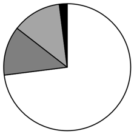
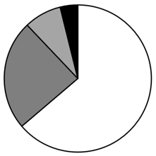
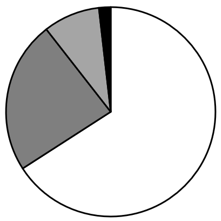
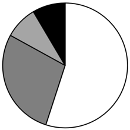
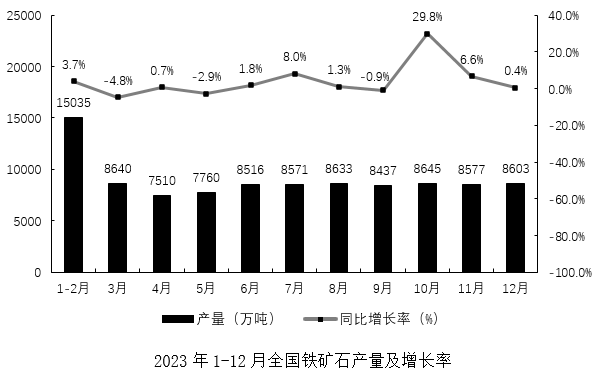
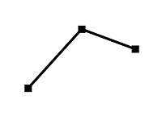
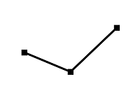
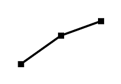
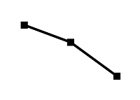

# 2024年吉林省公务员录用考试《行测》题（网友回忆版）

> 资料分析 · 10 题 · 吉林 2024

## 材料 1

        2023年，全国软件和信息技术服务业规模以上企业超3.8万家，累计完成软件业务收入123258亿元，同比增长13.4%，较上年同期增长2.2个百分点。

        四个领域分别由软件产品、信息技术服务、信息安全产品和服务、嵌入式系统软件组成。软件产品实现收入29030亿元，同比增长11.1%，较上年同期增长1.2个百分点。其中，工业软件产品实现收入2824亿元，同比增长12.3%。

        信息技术服务收入81226亿元，同比增长14.7%，其中云服务、大数据服务共实现收入12470亿元，同比增长15.4%；集成电路设计收入3069亿元，同比增长6.4%；电子商务平台技术服务收入11789亿元，同比增长9.6%。

        信息安全产品实现收入2232亿元，同比增长12.4%，较上年同期增长2.0个百分点。

        嵌入式系统软件产品实现收入10770亿元，同比增长10.6%，较上年同期下降0.7个百分点。

### 第 1 题　qid 19181368 · 综合

2021年，全国软件和信息技术服务业规模以上企业的软件业务收入约为：

- **A**. 不到9万亿元
- **B**. 9万亿~10万亿元　✅
- **C**. 10万亿~11万亿元
- **D**. 11万亿元以上

**答案**：B

**官方解析**

根据题干“2021年······软件业务收入约为”，结合材料时间为2023年，可判定本题为间隔基期问题。定位文字材料第一段可得：2023年，全国软件和信息技术服务业规模以上企业累计完成软件业务收入123258亿元，同比增长13.4%（），较上年同期增长2.2个百分点。则2022年，全国软件和信息技术服务业规模以上企业软件业务收入同比增速=13.4%-2.2%=11.2%（）。根据间隔增长率公式：，则2023年全国软件和信息技术服务业规模以上企业软件业务收入比2021年增长了（）。根据公式：间隔基期量，则题目所求万亿元，在B项范围内。

故正确答案为B。

---

### 第 2 题　qid 19181369 · 比重

2023年工业软件产品实现收入占软件产品收入的比重比上一年：

- **A**. 上升不到0.12个百分点　✅
- **B**. 上升0.12个百分点以上
- **C**. 下降不到0.12个百分点
- **D**. 下降0.12个百分点以上

**答案**：A

**官方解析**

根据题干“2023年······占······的比重比上一年”，结合选项为“上升/下降+百分点”，可判定本题为两期比重问题。定位文字材料第二段可得：2023年，软件产品实现收入29030亿元（B），同比增长11.1%（b）。其中，工业软件产品实现收入2824亿元（A），同比增长12.3%（a）。根据公式：两期比重差，则题目所求，即上升不到0.12个百分点。

故正确答案为A。

---

### 第 3 题　qid 19181372 · 比重

以下饼图中能准确反映2023年软件业务四个领域收入占比情况的是：

- **A**. 

- **B**. 

- **C**. 

　✅
- **D**. 

**答案**：C

**官方解析**

根据题干“······能准确反映2023年······占比情况的是”，结合材料时间为2023年，可判定本题为现期比重问题。定位文字材料第一至五段可得：2023年，全国软件和信息技术服务业规模以上企业累计完成软件业务收入123258亿元。其中，软件产品实现收入29030亿元，信息技术服务收入81226亿元，信息安全产品实现收入2232亿元，嵌入式系统软件产品实现收入10770亿元。根据公式：比重，则2023年软件产品收入占比为，即占比排名第二的领域所占比重约为，排除A、D两项；倍，即占比排名第三的领域约是排名第四的5倍，排除B项，C项当选。

故正确答案为C。

注：一般情况下，饼图的作图顺序为从12点钟按照顺时针方向排列。本题为非常规考查，按占比从大到小排列，但解题的思路不变。

---

### 第 4 题　qid 19181374 · 综合

2022年，云服务、大数据服务共实现收入是集成电路设计收入的：

- **A**. 不到3倍
- **B**. 3～3.5倍
- **C**. 3.5～4倍　✅
- **D**. 4倍以上

**答案**：C

**官方解析**

根据题干“2022年······是······的”，结合材料时间为2023年，且选项均为倍数，可判定本题为基期倍数问题。定位文字材料第三段可得：2023年，云服务、大数据服务共实现收入12470亿元（A），同比增长15.4%（a）；集成电路设计收入3069亿元（B），同比增长6.4%（b）。根据公式：基期倍数，则题目所求倍，在C项范围内。

故正确答案为C。

---

### 第 5 题　qid 19181378 · 增长

以下信息，可以推出的是：
①2022年，信息技术服务收入同比增长11.2%以上
②2023年，电子商务平台技术服务收入同比增长1200亿元以上
③2023年，嵌入式系统软件产品实现收入同比增量大于2022年水平

- **A**. 0项
- **B**. 1项
- **C**. 2项　✅
- **D**. 3项

**答案**：C

**官方解析**

①：定位文字材料第一至五段可得：2023年，全国软件和信息技术服务业规模以上企业累计完成软件业务收入同比增长13.4%，较上年同期增长2.2个百分点。其中，软件产品实现收入29030亿元，同比增长11.1%，较上年同期增长1.2个百分点；信息技术服务收入81226亿元，同比增长14.7%；信息安全产品实现收入2232亿元，同比增长12.4%，较上年同期增长2.0个百分点；嵌入式系统软件产品实现收入10770亿元，同比增长10.6%，较上年同期下降0.7个百分点。则2022年，全国软件和信息技术服务业规模以上企业累计完成软件业务收入同比增长13.4%-2.2%=11.2%；软件产品实现收入同比增长11.1%-1.2%=9.9%；信息安全产品实现收入同比增长12.4%-2.0%=10.4%；嵌入式系统软件产品实现收入同比增长10.6%+0.7%=11.3%。根据混合增长率口诀“混合居中但不正中，偏向基期量较大的一方（一般用现期量代替基期量近似计算）”可知，软件产品和嵌入式系统软件产品实现收入同比增速小于；软件产品、嵌入式系统软件产品和信息安全产品实现收入同比增速介于10.4%和10.6%之间（小于整体增速11.2%），因此，2022年信息技术服务收入同比增长大于整体增速11.2%，正确；

②：定位文字材料第三段可得：2023年，电子商务平台技术服务收入11789亿元，同比增长9.6%。根据公式：增长量，则2023年电子商务平台技术服务收入同比增量亿元&lt;1200亿元，即不到1200亿元，错误；

③：定位文字材料第五段可得：2023年，嵌入式系统软件产品实现收入10770亿元，同比增长10.6%，较上年同期下降0.7个百分点。则2022年嵌入式系统软件产品实现收入同比增速=10.6%+0.7%=11.3%。根据公式：增长量，基期量=现期量-增长量，则2023年嵌入式系统软件产品实现收入同比增量亿元，2022年同比增量亿元，前者大于后者，正确。

综上，说法正确的有①③，共2项。

故正确答案为C。

---

## 材料 2

### 第 6 题　qid 19181370 · 平均数

2023年，平均每个月铁矿石产量约为：

- **A**. 7600万吨以下
- **B**. 7600万～8000万吨
- **C**. 8000万～8400万吨　✅
- **D**. 8400万吨以上

**答案**：C

**官方解析**

根据题干“2023年，平均每个月铁矿石产量约为”，结合材料时间为2023年1-12月，可判定本题为现期平均数问题。定位统计图可得：2023年1-2月和3-12月全国铁矿石产量分别为15035万吨、8640万吨、7510万吨、7760万吨、8516万吨、8571万吨、8633万吨、8437万吨、8645万吨、8577万吨、8603万吨。则所求平均数为万吨，在C项范围内。

故正确答案为C。

---

### 第 7 题　qid 19181371 · 综合

2022年4月，全国铁矿石产量比上月减少：

- **A**. 500万吨以下
- **B**. 500万～1000万吨
- **C**. 1000万～1500万吨
- **D**. 1500万吨以上　✅

**答案**：D

**官方解析**

根据题干“2022年4月，全国铁矿石产量比上月减少”，结合选项带具体单位，材料分别给出2023年3月、4月全国铁矿石产量及同比增速，可判定本题为基期和差问题。定位统计图可得：2023年3月全国铁矿石产量为8640万吨，同比增长-4.8%；4月为7510万吨，同比增长0.7%。根据公式：基期量，则所求万吨，即减少1500万吨以上。

故正确答案为D。

---

### 第 8 题　qid 19181373 · 增长

以下折线图中，能准确反映2022年第四季度各月全国铁矿石的环比增长率变化趋势的是：

- **A**. 

　✅
- **B**. 

- **C**. 

- **D**. 

**答案**：A

**官方解析**

方法一：根据题干“······2022年第四季度······环比增长率变化趋势的是”，可判定本题为一般增长率问题。定位统计图可得2023年9-12月各月全国铁矿石的产量及其同比增长率。根据公式：基期量，可得2022年9-12月各月全国铁矿石的产量分别为：9月万吨、10月万吨、11月万吨、12月万吨。根据公式：增长率，可得2022年第四季度各月全国铁矿石的环比增长率分别为：10月、11月、12月。 因10月的环比增长率为负数，11月和12月均为正数，则10月的环比增长率最小，排除B、D两项；化简后11月的环比增长率，12月的环比增长率，根据“分子倍数大，分子大的分数大”，可以判定11月的环比增长率大，排除C项，A项当选。

方法二：根据增长率比较技巧：若大，则增长率大。题目所需比较2022年第四季度各月全国铁矿石的环比增长率，故只需比较即可。结合材料所给时间为2023年，可判定本题为基期倍数问题。定位统计图可得2023年9-12月各月全国铁矿石的产量及其同比增长率。根据公式：基期倍数，可得2022年第四季度各月环比倍数分别为：

10月；

11月；

12月；

则2022年第四季度各月全国铁矿石的环比增长率呈先上升后下降的趋势，只有A项满足。

故正确答案为A。

---

### 第 9 题　qid 19181375 · 综合

2022年下半年，全国铁矿石产量超过8000万吨的月份有：

- **A**. 3个
- **B**. 4个　✅
- **C**. 5个
- **D**. 6个

**答案**：B

**官方解析**

根据题干“2022年下半年······产量······”，结合材料时间为2023年，可判定本题为基期计算问题。定位统计图可得2023年7-12月各月全国铁矿石产量及其同比增长率。根据公式：基期量，结合题干所求应满足：，即：现期量&gt;8000×（1+增长率）=8000+8000×增长率。

7月：8571&lt;8000+8000×8.0%=8640，不满足；

8月：8633&gt;8000+8000×1.3%=8104，满足；

9月：8437&gt;8000+8000×（-0.9%）=7928，满足；

10月：8645&lt;8000+8000×29.8%=10384，不满足；

11月：8577&gt;8000+8000×6.6%=8528，满足；

12月：8603&gt;8000+8000×0.4%=8032，满足。

即满足条件的有8月、9月、11月、12月，共4个月份。

故正确答案为B。

---

### 第 10 题　qid 19181377 · 综合

从上述材料不能推出的是：

- **A**. 2022年第二季度，全国铁矿石月产量呈上升趋势
- **B**. 2023年至少有8个月的铁矿石数量较上一年呈正增长
- **C**. 2023年7月，全国铁矿石产量环比增长率较上年同期有所下降　✅
- **D**. 2023年四个季度中，第一季度全国铁矿石产量最低，第四季度最高

**答案**：C

**官方解析**

A项：定位统计图可得2023年第二季度各月全国铁矿石产量及增长率。根据公式：基期量，可得2022年第二季度各月全国铁矿石产量分别为：4月万吨、5月万吨、6月万吨。4月&lt;5月&lt;6月，正确；

B项：定位统计图可得，2023年3-12月全国铁矿石产量同比增长率为正数的有4月、6月、7月、8月、10月、11月、12月，共7个月份。因1-2月整体的同比增长率为3.7%，根据“混合后居中”可以判定1月与2月中必有一个月份不低于3.7%，故2023年至少有8个月的铁矿石数量较上一年呈正增长，正确；

C项：定位统计图可得，2023年6月和7月全国铁矿石产量同比增长率分别为1.8%（b）、8.0%（a）。根据增长率比较技巧：若大，则增长率大。故比较2023年7月与上年同期产量环比增长率，只需比较2023年和2022年的，即两期比例比较。根据两期比例比较结论：若分子增长率a&gt;分母增长率b，则比值上升；若分子增长率a&lt;分母增长率b，则比值下降。则由2023年7月同比增长率a（8.0%）&gt;2023年6月同比增长率b（1.8%），可判定2023年比值高于上年，则2023年7月，全国铁矿石产量环比增长率较上年同期有所提高，错误；

D项：定位统计图可得2023年各月全国铁矿石产量。则各季度产量分别为：第一季度=15035+8640=23675万吨、第二季度=7510+7760+8516=23786万吨、第三季度=8571+8633+8437=25641万吨、第四季度=8645+8577+8603=25825万吨。第一季度产量最低，第四季度最高，正确。

本题为选非题，故正确答案为C。

---
