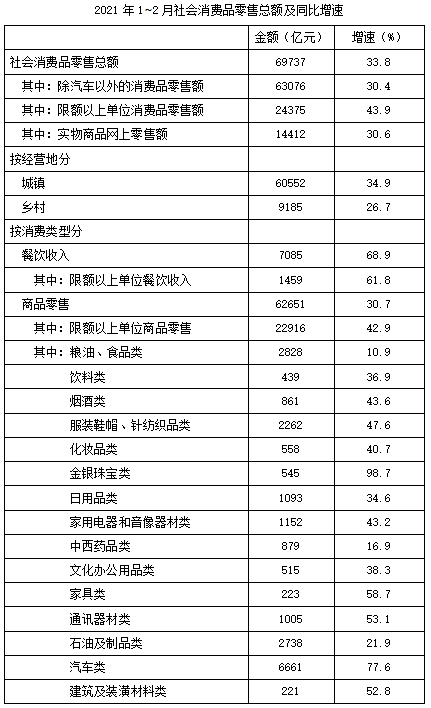
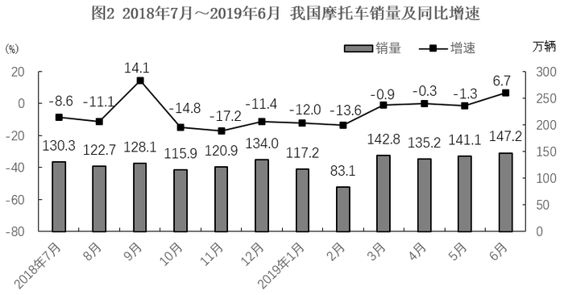

# 2024年四川省公务员录用考试《行测》试题（网友回忆版）

> 资料分析 · 15 题 · 四川 2024

## 材料 1

        2022年，全国软件和信息技术服务业规模以上企业超3.5万家，累计完成软件业务收入108126亿元，同比增长11.2%，增速较上年同期回落6.5个百分点。

        2022年，全国软件业利润总额12648亿元，同比增长5.7%，增速较上年同期回落1.9个百分点。软件业务出口额524.1亿美元，同比增长3.0%，增速较上年同期回落5.8个百分点。其中，软件外包服务出口额同比增长9.2%。

        2022年，东部、中部、西部和东北地区分别完成软件业务收入88663亿元、5390亿元、11574亿元和2499亿元，分别同比增长10.6%、16.9%、14.3%和8.7%。软件业务收入居前5名的北京、广东、江苏、山东、浙江共完成收入74537亿元，占比较上年同期提高2.9个百分点。

        2022年，全国15个副省级中心城市实现软件业务收入53419亿元，同比增长10.0%，增速较上年同期回落6.3个百分点；实现利润总额6924亿元，同比增长2.4%，增速较上年同期回落2.1个百分点。

### 第 1 题　qid 12536395 · 增长

2022年，全国软件和信息技术服务业规模以上企业累计完成软件业务收入约比2020年增长了：

- **A**. 16%
- **B**. 23%
- **C**. 29%
- **D**. 31%　✅

**答案**：D

**官方解析**

根据题干“2022年······约比2020年增长了”，结合选项为百分数，可判定本题为间隔增长率问题。定位文字材料第一段可得：2022年，全国软件和信息技术服务业规模以上企业累计完成软件业务收入同比增长11.2%（），增速较上年同期回落6.5个百分点。则2021年，全国软件和信息技术服务业规模以上企业累计完成软件业务收入同比增长11.2%+6.5%=17.7%（）。根据间隔增长率公式：，则所求，与D项最接近。

故正确答案为D。

---

### 第 2 题　qid 12536398 · 增长

2021年，全国软件业利润总额同比增速比软件业务出口额同比增速：

- **A**. 低1.2个百分点　✅
- **B**. 低2.7个百分点
- **C**. 高1.2个百分点
- **D**. 高2.7个百分点

**答案**：A

**官方解析**

定位文字材料第二段可得：2022年，全国软件业利润总额同比增长5.7%，增速较上年同期回落1.9个百分点；软件业务出口额同比增长3.0%，增速较上年同期回落5.8个百分点。则2021年全国软件业利润总额同比增速为5.7%+1.9%=7.6%，2021年全国软件业务出口额同比增速为3.0%+5.8%=8.8%，故所求=7.6%-8.8%=-1.2%，即2021年全国软件业利润总额同比增速比软件业务出口额同比增速低1.2个百分点。
故正确答案为A。

---

### 第 3 题　qid 12536399 · 增长

2022年，东部地区软件业务收入同比增量约是西部地区的多少倍？

- **A**. 3
- **B**. 4
- **C**. 5
- **D**. 6　✅

**答案**：D

**官方解析**

根据题干“2022年······约是······的多少倍”，可判定本题为现期倍数问题。定位文字材料第三段可得：2022年，东部、中部、西部和东北地区分别完成软件业务收入88663亿元、5390亿元、11574亿元和2499亿元，分别同比增长10.6%、16.9%、14.3%和8.7%。根据公式：增长量，则所求倍，与D项最接近。

故正确答案为D。

---

### 第 4 题　qid 12536401 · 比重

2020-2022年，全国15个副省级中心城市软件业利润总额占全国软件业利润总额的比重呈现何种变化趋势？

- **A**. 持续上升
- **B**. 持续下降　✅
- **C**. 先升后降
- **D**. 先降后升

**答案**：B

**官方解析**

根据题干“2020-2022年······占······的比重呈现何种变化趋势”，可判定本题为两期比重问题。定位文字材料第二、四段可得：2022年，全国软件业利润总额12648亿元，同比增长5.7%（），增速较上年同期回落1.9个百分点；全国15个副省级中心城市实现软件业务利润总额6924亿元，同比增长2.4%（），增速较上年同期回落2.1个百分点。则2021年，全国软件业利润总额同比增长5.7%+1.9%=7.6%（），全国15个副省级中心城市实现软件业务利润总额同比增长2.4%+2.1%=4.5%（）。根据两期比重比较结论“若部分增长率大于整体增长率，则比重上升，反之则下降”，比较可知：2022年比2021年，（2.4%）&lt;（5.7%），比重下降；2021年比2020年，（4.5%）&lt;（7.6%），比重下降。则2022年比重&lt;2021年比重&lt;2020年比重，比重持续下降。

故正确答案为B。

---

### 第 5 题　qid 12536407 · 平均数

以下信息中，能够从上述资料中推出的有几项？
①2020年平均每个副省级中心城市软件业务收入
②2021年北京、广东、江苏、山东、浙江软件业务收入之和
③2022年软件外包服务出口额占软件业务出口额比重

- **A**. 0
- **B**. 1
- **C**. 2　✅
- **D**. 3

**答案**：C

**官方解析**

①定位文字材料第四段可得：2022年，全国15个副省级中心城市实现软件业务收入53419 亿元，同比增长10.0%（），增速较上年同期回落6.3个百分点。则2021年全国15个副省级中心城市实现软件业务收入同比增速为10%+6.3%=16.3%（），2022年全国15个副省级中心城市实现软件业务收入相较于2020年的增速。故所求，可以推出；

②定位文字材料第一段可得：2022年，全国软件和信息技术服务业······累计完成软件业务收入108126亿元，同比增长11.2%。定位文字材料第三段可得：2022年······软件业务收入居前5名的北京、广东、江苏、山东、浙江共完成收入74537亿元，占比较上年同期提高2.9个百分点。则2021年全国软件业务收入，北京、广东、江苏、山东、浙江软件业务收入之和占比为，故所求，可以推出；

③定位文字材料第二段可得：2022年······软件业务出口额524.1亿美元······其中，软件外包服务出口额同比增长9.2%。材料只给出2022年软件业务出口额和软件外包服务出口额同比增长率，无法求出软件外包服务出口额及其所占比重，无法推出。

综上可知，只有①②可以推出，共2项。

故正确答案为C。

---

## 材料 2

        2021年1~2月，全国网上零售额17587亿元，同比增长32.5%，两年平均增长13.3%。其中，实物商品网上零售额14412亿元，同比增长30.6%，两年平均增长16.0%，占社会消费品零售总额的比重为20.7%；在实物商品网上零售额中，吃类、穿类和用类商品分别增长41.6%、44.3%和25.1%，两年平均分别增长33.8%、8.7%和16.0%。

### 第 6 题　qid 12536403 · 综合

在2020年1~2月①全国网上零售额和②实物商品网上零售额中：

- **A**. 仅①同比正增长
- **B**. 仅②同比正增长　✅
- **C**. ①和②均同比正增长
- **D**. ①和②均未同比正增长

**答案**：B

**官方解析**

根据题干“在2020年1~2月①全国网上零售额和②实物商品网上零售额中”，结合选项为“······正增长”，且材料给出二者的两年平均增长率，可判定本题为间隔增长率问题。定位文字材料可得：2021年1~2月，全国网上零售额17587亿元，同比增长32.5%，两年平均增长13.3%。其中，实物商品网上零售额14412亿元，同比增长30.6%，两年平均增长16.0%。根据n=2时的年均增长率公式：，和间隔增长率公式：，且，可得。设2020年1~2月全国网上零售额同比增长率为a，可列式，可化简得，即2020年1~2月全国网上零售额同比负增长；设2020年1~2月实物商品网上零售额同比增长率为b，同理可列式，可化简得，即2020年1~2月实物商品网上零售额同比正增长。 故正确答案为B。

---

### 第 7 题　qid 12536408 · 增长

2021年1~2月，以下各类社会消费品零售总额中同比增量最大的是：

- **A**. 烟酒类
- **B**. 化妆品类
- **C**. 金银珠宝类　✅
- **D**. 文化办公用品类

**答案**：C

**官方解析**

根据题干“2021年1~2月······同比增量最大的是”，可判定本题为增长量比较问题。定位表格材料可得：2021年1~2月，烟酒类社会消费品零售总额为861亿元，同比增长43.6%；化妆品类为558亿元，同比增长40.7%；金银珠宝类为545亿元，同比增长98.7%；文化办公用品类为515亿元，同比增长38.3%。根据增长量比较口诀“大大则大”可知，烟酒类社会消费品零售总额和同比增速均大于化妆品类和文化办公用品类，因此烟酒类的同比增长量大于化妆品类和文化办公用品类；根据公式：增长量，则烟酒类社会消费品零售总额同比增量为亿元；金银珠宝类为亿元。故同比增量最大的是金银珠宝类。 故正确答案为C。

---

### 第 8 题　qid 12536411 · 增长

2021年1~2月，限额以下单位餐饮收入同比约增长了：

- **A**. 67%
- **B**. 71%　✅
- **C**. 76%
- **D**. 83%

**答案**：B

**官方解析**

根据题干“2021年1~2月······同比约增长了”，结合材料给出了2021年1~2月餐饮收入和限额以上单位餐饮收入及其同比增速，可判定本题为混合增长率问题。定位表格材料可得：2021年1~2月，我国餐饮收入为7085亿元，同比增长68.9%；其中限额以上单位餐饮收入为1459亿元，同比增长61.8%。则我国限额以下单位餐饮收入为7085-1459=5626亿元。 根据混合增长率口诀“混合居中不正中，偏向基期量大的一方（一般用现期量代替基期量）”可知，，且，即，排除A、C、D三项，只有B项符合。 故正确答案为B。

---

### 第 9 题　qid 12536415 · 增长

2020年1~2月，将吃类、穿类和用类商品的实物商品网上零售额同比增速从高到低排列，下列排序正确的是：

- **A**. 吃类、用类、穿类　✅
- **B**. 吃类、穿类、用类
- **C**. 穿类、吃类、用类
- **D**. 穿类、用类、吃类

**答案**：A

**官方解析**

根据题干“2020年1~2月，······同比增速从高到低排列······”，且材料给出2021年1~2月，吃类、穿类和用类商品的实物商品网上零售额同比增速和两年平均增速，可判定本题为间隔增长率问题。根据文字材料可得：2021年1~2月，在实物商品网上零售额中，吃类、穿类和用类商品分别增长41.6%、44.3%和25.1%，两年平均分别增长33.8%、8.7%和16.0%。设2020年1~2月，吃类、穿类和用类商品的实物商品网上零售额同比增速分别为、、。根据n=2时的年均增长率公式：，和间隔增长率公式：，且，可得。代入吃类、穿类和用类商品的实物商品网上零售额同比增速的数据：，解得；同理，，解得；，解得。比较可得，2020年1~2月，所求同比增速从高到低排列正确的是吃类、用类、穿类。

故正确答案为A。

---

### 第 10 题　qid 12536418 · 综合

能够从上述资料中推出的是：

- **A**. 2020年1~2月，实物商品网上零售额不到1万亿元
- **B**. 2021年1~2月，日用品类商品零售额同比增长了400亿元以上
- **C**. 2021年1~2月，城乡社会消费品零售额之差大于上年同期水平　✅
- **D**. 2021年1~2月，商品零售额占社会消费品零售总额比重高于上年水平

**答案**：C

**官方解析**

A项：定位文字材料可得，2021年1~2月，实物商品网上零售额14412亿元，同比增长30.6%。根据公式：基期量，则2020年1~2月，实物商品网上零售额亿元，即超过1万亿元，错误； B项：定位表格材料可得，2021年1~2月，日用品类商品零售额1093亿元，同比增长34.6%。根据公式：增长量，则2021年1~2月，日用品类商品零售额同比增长量亿元，错误； C项：定位表格材料可得，2021年1~2月，城镇社会消费品零售额60552亿元，同比增长34.9%；乡村社会消费品零售额9185亿元，同比增长26.7%。可知2021年1~2月，城乡社会消费品零售额之差为60552-9185=51367亿元。根据公式：基期量，则2020年1~2月，城乡社会消费品零售额之差为亿元，即2021年1~2月，城乡社会消费品零售额之差大于上年同期水平，正确； 

D项：定位表格材料可得，2021年1~2月，社会消费品零售总额同比增长33.8%（b），商品零售额同比增长30.7%（a）。根据两期比重比较结论：部分增长率（a）&gt;整体增长率（b），比重上升；部分增长率（a）&lt;整体增长率（b），比重下降。由于30.7%（a）&lt;33.8%（b），则2021年1~2月，商品零售额占社会消费品零售总额比重低于上年水平，错误。

故正确答案为C。

---

## 材料 3

### 第 11 题　qid 12536429 · 综合

2018年7月~2019年6月，我国摩托车产量与销量相差不超过0.5万辆的月份有多少个?

- **A**. 4
- **B**. 5　✅
- **C**. 6
- **D**. 7

**答案**：B

**官方解析**

定位统计图1、图2，可知2018年7月~2019年6月我国摩托车产量及销量，则2018年7月~2019年6月我国摩托车产量与销量分别相差：

2018月7月：130.3-129.3=1万辆；

2018年8月：122.7-122.4=0.3万辆；

2018年9月：128.1-127.7=0.4万辆；

2018年10月：115.9-115.8=0.1万辆；

2018年11月：122.3-120.9=1.4万辆；

2018年12月：135.7-134.0=1.7万辆；

2019年1月：117.2-115.5=1.7万辆；

2019年2月：83.1-82.2=0.9万辆；

2019年3月：142.8-142.7=0.1万辆；

2019年4月：139.9-135.2=4.7万辆；

2019年5月：143.6-141.1=2.5万辆；

2019年6月：147.7-147.2=0.5万辆。

相差不超过0.5万辆（万辆）的月份为2018年8月（0.3万辆）、2018年9月（0.4万辆）、2018年10月（0.1万辆）、2019年3月（0.1万辆）、2019年6月（0.5万辆），共5个。

故正确答案为B。

---

### 第 12 题　qid 12536430 · 综合

2018年1月，我国摩托车产量比销量：

- **A**. 少10万辆以内
- **B**. 少10万辆以上
- **C**. 多10万辆以内
- **D**. 多10万辆以上　✅

**答案**：D

**官方解析**

根据题干“2018年1月······比······”，结合材料时间为2019年1月，且选项为“多/少+单位”，可判定本题为基期和差问题。定位统计图1、图2可得： 2019年1月，我国摩托车产量为115.5万辆，同比下降22.7%；销量为117.2万辆，同比下降12.0%。根据公式：基期量，则所求为万辆，即多10万辆以上。

故正确答案为D。

---

### 第 13 题　qid 12536432 · 增长

2018年7月，我国摩托车销量约比上月下降了：

- **A**. 18%
- **B**. 12%
- **C**. 6%　✅
- **D**. 1%

**答案**：C

**官方解析**

根据题干“2018年7月······约比上月下降了”，结合选项为百分数，可判定本题为一般增长率问题。定位统计图2可得：2018年7月，我国摩托车销量为130.3万辆 ；2019年6月，我国摩托车销量为147.2万辆，同比增长6.7%。根据公式：基期量，可得2018年6月我国摩托车销量为万辆；根据公式：增长率，可得所求增长率为，即约比上月下降了5.5%，与C项最接近。

故正确答案为C。

---

### 第 14 题　qid 12536434 · 综合

将①2018年第三季度②2018年第四季度③2019年第一季度④2019年第二季度，我国摩托车产量从低到高排列，下列排序正确的是：

- **A**. ③<②<①<④　✅
- **B**. ③<①<②<④
- **C**. ③<④<②<①
- **D**. ③<①<④<②

**答案**：A

**官方解析**

根据题干“······产量从低到高排列，下列排序正确的是”，可判定本题为排序类问题。定位统计图1可知2018年7月-2019年6月我国摩托车产量。则①2018年第三季度我国摩托车产量=129.3+122.4+127.7=379.4万辆；②2018年第四季度我国摩托车产量=115.8+122.3+135.7=373.8万辆；③2019年第一季度我国摩托车产量=115.5+82.2+142.7=340.4万辆；④2019年第二季度我国摩托车产量=139.9+143.6+147.7=431.2辆。比较可知，我国摩托车产量从低到高排序为③&lt;②&lt;①&lt;④。
故正确答案为A。

---

### 第 15 题　qid 12536436 · 综合

能够从上述资料中推出的是：

- **A**. 2018年7月~2019年6月，我国摩托车产销量都同比下降的月份有10个
- **B**. 2018年7月~2019年6月，我国摩托车销量高于上月水平的月份有6个　✅
- **C**. 2018年9月，我国摩托车销量同比增量少于2019年6月
- **D**. 2018年下半年，我国摩托车产量比2019年上半年多

**答案**：B

**官方解析**

A项：定位统计图1可得2018年7月~2019年6月，我国摩托车产量同比增速分别为：-10.3%、-10.4%、-12.9%、-13.6%、-19.2%、-12.3%、-22.7%、-10.6%、-0.3%、1.1%、-0.6%、8.1%；定位统计图2可得2018年7月~2019年6月，我国摩托车销量同比增速分别为：-8.6%、-11.1%、14.1%、-14.8%、-17.2%、-11.4%、-12.0%、-13.6%、-0.9%、-0.3%、-1.3%、6.7%。产销量都同比下降（即同比增速&lt;0）的月份有：2018年7月、8月、10月、11月、12月，2019年1月、2月、3月、5月，共9个，错误；

B项：定位统计图2可得2018年7月~2019年6月，我国摩托车销量分别为：130.3万辆、122.7万辆、128.1万辆、115.9万辆、120.9万辆、134.0万辆、117.2万辆、83.1万辆、142.8万辆、135.2万辆、141.1万辆、147.2万辆；2019年6月，我国摩托车销量同比增速为6.7%。根据公式：基期量，可知2018年6月，我国摩托车销量为万辆。则2018年7月~2019年6月，我国摩托车销量高于上月水平的月份有2018年9月（128.1万辆&gt;122.7万辆）、2018年11月（120.9万辆&gt;115.9万辆）、2018年12月（134.0万辆&gt;120.9万辆）、2019年3月（142.8万辆&gt;83.1万辆）、2019年5月（141.1万辆&gt;135.2万辆）、2019年6月（147.2万辆&gt;141.1万辆），共6个，正确；

C项：定位统计图2可得2018年9月，我国摩托车销量为128.1万辆，同比增速为14.1%；2019年6月，我国摩托车销量为147.2万辆，同比增速为6.7%。根据公式：增长量，可知2018年9月，我国摩托车销量同比增量为万辆；2019年6月，我国摩托车销量同比增量为万辆。则2018年9月，我国摩托车销量同比增量多于2019年6月，错误；

D项：定位统计图1可得2018年7月~2019年6月我国摩托车产量。可知2018年下半年，我国摩托车产量为万辆；2019年上半年，我国摩托车产量为万辆。则2018年下半年，我国摩托车产量比2019年上半年少，错误。

故正确答案为B。

---
