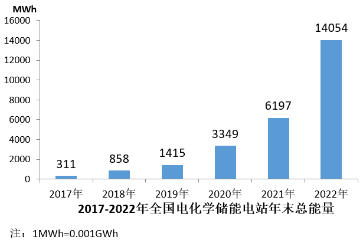

# 2024年国家公务员录用考试《行测》题（副省级网友回忆版）

> 资料分析 · 20 题 · 国考 2024

## 材料 1

### 第 1 题　qid 5893721 · 综合

2022年，中型灌区改善灌溉面积与新增恢复灌溉面积比值最大的中部省份是：

- **A**. 山西
- **B**. 湖北
- **C**. 河南　✅
- **D**. 江西

**答案**：C

**官方解析**

根据题干“2022年······比值最大的······”，可以判定本题为比值比较问题。定位表格材料可得，2022年山西、湖北、河南、江西中型灌区改善灌溉面积分别为25.2万亩、70.1万亩、53.2万亩、40.5万亩，山西、湖北、河南、江西中型灌区新增恢复灌溉面积分别为6.3万亩、26.2万亩、11.5万亩、15.0万亩。则四个省份中型灌区改善灌溉面积与新增恢复灌溉面积的比值分别为：山西，；湖北，；河南，；江西，。比较可知，中型灌区改善灌溉面积与新增恢复灌溉面积的比值最大的中部省份为河南。

故正确答案为C。

---

### 第 2 题　qid 5893720 · 综合

2022年，中部六省中型灌区新增节水能力占全国中型灌区的：

- **A**. 不到三成
- **B**. 一半以上
- **C**. 三成多　✅
- **D**. 四成多

**答案**：C

**官方解析**

根据题干“2022年······占······”，结合材料时间为2022年，可判定本题为现期比重问题。定位表格材料可得：2022年全国中型灌区新增节水能力为121283.6万立方米，中部六省中型灌区新增节水能力分别为安徽6499.5万立方米、江西6997.1万立方米、河南3291.5万立方米、湖北10254.1万立方米、湖南10055.2万立方米、山西1020.6万立方米。根据公式：比重，可得所求比重为，即三成多。

故正确答案为C。

---

### 第 3 题　qid 5893719 · 综合

2022年，中部六省中型灌区新增恢复灌溉面积是东北三省的：

- **A**. 4.5~5倍之间　✅
- **B**. 4~4.5倍之间
- **C**. 不到4倍
- **D**. 5倍以上

**答案**：A

**官方解析**

根据题干“2022年······是······的”，结合选项为倍数，可判定本题为现期倍数问题。定位表格材料可得∶2022年，东北三省中型灌区新增恢复灌溉面积分别为：辽宁1.8万亩、吉林9.4万亩、黑龙江13.4万亩；中部六省中型灌区新增恢复灌溉面积分别为：安徽27.6万亩、江西15.0万亩、河南11.5万亩、湖北26.2万亩、湖南27.0万亩、山西6.3万亩。则所求倍，在A项范围内。

故正确答案为A。

---

### 第 4 题　qid 5893722 · 增长

2022年全国粮食产量同比增加368万吨。如全国中型灌区新增粮食生产能力均得到充分利用，则中部六省中型灌区新增粮食生产能力对全国粮食增产的贡献占比为：

- **A**. 不到2%
- **B**. 超过9%　✅
- **C**. 2%~5%之间
- **D**. 5%~9%之间

**答案**：B

**官方解析**

根据题干“2022年······贡献占比为”，可判定本题为现期比重问题。定位表格材料可得：2022年中部六省中型灌区新增粮食生产能力分别为：安徽5422.5万公斤、江西7469.1万公斤、河南4320.2万公斤、湖北5039.3万公斤、湖南10885.0万公斤、山西3785.6万公斤；根据题干可知“2022年全国粮食产量同比增加368万吨”。根据公式：增长贡献率，结合1吨=1000公斤，则题干所求为，在B项范围内。

故正确答案为B。

---

### 第 5 题　qid 5893723 · 比重

在资料所给中型灌区续建配套与节水改造项目成效的4个指标中，东北三省占全国比重超过10%的指标有几个？

- **A**. 1
- **B**. 2　✅
- **C**. 3
- **D**. 4

**答案**：B

**官方解析**

根据题干“······占全国比重超过10%的指标有几个“，可判定本题为现期比重问题。根据表格数据可知：2022年东北三省新增恢复灌溉面积万亩&lt;264.8万亩×10%；东北三省改善灌溉面积万亩&lt;1168.4万亩×10%；东北三省新增粮食生产能力万公斤&gt;121918.9万公斤×10%；东北三省新增节水能力万立方米&gt;121283.6万立方米×10%。因此，资料所给的4个指标中，东北三省占全国比重超过10%的指标有新增粮食生产能力和新增节水能力，共2个。

故正确答案为B。

---

## 材料 2

### 第 6 题　qid 5893791 · 综合

2017~2022年我国马铃薯出口量最高的年份，当年出口额在这6年中排名（    ）。

- **A**. 第一
- **B**. 第二
- **C**. 第三　✅
- **D**. 第四

**答案**：C

**官方解析**

定位图2，可知2017~2022年我国马铃薯出口额及出口量。出口量最高的年份为2017年（50.95万吨），当年对应的出口额（2.81亿美元）排名第三。
故正确答案为C。

---

### 第 7 题　qid 5893792 · 综合

2016~2020年，我国马铃薯总产量在以下哪个范围内？

- **A**. 不到0.9亿吨　✅
- **B**. 0.9亿~0.92亿吨之间
- **C**. 0.92亿~0.94亿吨之间
- **D**. 超过0.94亿吨

**答案**：A

**官方解析**

定位图1可得：2016~2020年，我国马铃薯产量分别为1699万吨、1770万吨、1798万吨、1778万吨、1798万吨。则2016~2020年我国马铃薯总产量为万吨=0.89亿吨，即不到0.9亿吨。

故正确答案为A。

---

### 第 8 题　qid 5893793 · 增长

2018~2022年，我国马铃薯单位面积产量同比增长的年份有几个？

- **A**. 2
- **B**. 3
- **C**. 4
- **D**. 5　✅

**答案**：D

**官方解析**

根据题干“2018~2022年······单位面积产量同比增长的年份有几个”，结合材料给出了2017~2022年我国马铃薯的播种面积和产量，可判定本题为两期平均数比较问题。定位图1可得：2017~2022年我国马铃薯的播种面积和产量。单位面积产量，根据两期平均数比较结论“当分子增速（a）大于分母增速（b）时，平均数上升”，观察发现，2018、2020、2021、2022年我国马铃薯产量的同比增长率均大于0，面积的同比增长率均小于0，则这4个年份我国马铃薯单位面积产量为同比增长。只需再判断2019年我国马铃薯单位面积产量是否同比增长即可。

方法一：2018年我国马铃薯单位面积产量为，2019年为，则2019年我国马铃薯单位面积产量同比增长。

方法二：根据公式：增长率，可得2019年我国马铃薯产量的同比增长率（a）为，面积的同比增长率（b）为。a＞b，可判断平均数上升，即2019年我国马铃薯单位面积产量同比增长。

综上分析，2018~2022年我国马铃薯单位面积产量同比增长的年份有5个。

故正确答案为D。

---

### 第 9 题　qid 5893794 · 比重

2020~2022年，我国马铃薯出口量占产量的比重呈现何种变化趋势？

- **A**. 持续上升
- **B**. 持续下降
- **C**. 先降后升　✅
- **D**. 先升后降

**答案**：C

**官方解析**

根据题干“2020~2022年，······比重呈现何种变化趋势”，可判定本题为现期比重问题。定位图1可得2020~2022年我国马铃薯产量；定位图2可得2020~2022年我国马铃薯出口量。根据公式：比重，则2020年我国马铃薯出口量占产量的比重，2021年的比重，2022年的比重。故2020~2022年，我国马铃薯出口量占产量的比重呈现先降后升的变化趋势。

故正确答案为C。

---

### 第 10 题　qid 5893795 · 增长

以下折线图反映了2019~2022年我国马铃薯哪一产销数据的同比增量变化趋势？

- **A**. 出口额
- **B**. 出口量
- **C**. 播种面积
- **D**. 产量　✅

**答案**：D

**官方解析**

根据题干“以下折线图反映了2019~2022年······同比增量变化趋势”，可判定本题为增长量比较问题。定位图1可得2018~2022年我国马铃薯播种面积及产量；定位图2可得2018~2022年我国马铃薯出口额及出口量。根据公式：增长量=现期量-基期量，可得：
A项：2019年出口额同比上升（3.98亿美元&gt;2.61亿美元），增长量&gt;0；2020年出口额同比下降（2.90亿美元&lt;3.98亿美元），增长量&lt;0。则第二个点应低于第一个点，不符合折线图趋势，排除；
B项：2019年出口量同比上升（50.33万吨&gt;44.81万吨），增长量&gt;0；2020年出口量同比下降（44.19万吨&lt;50.33万吨），增长量&lt;0。则第二个点应低于第一个点，不符合折线图趋势，排除；
C项：2020年播种面积同比增量为466-467=-1万公顷；2021年同比增量为461-466=-5万公顷。则第三个点应低于第二个点，不符合折线图趋势，排除；
D项：2019年产量同比增量为1778-1798=-20万吨；2020年同比增量为1798-1778=20万吨；2021年同比增量为1831-1798=33万吨；2022年同比增量为1852-1831=21万吨，符合折线图趋势，当选。
故正确答案为D。

---

## 材料 3

        截至2022年末，全国累计投运各类电化学储能电站（包括大、中、小型电站）472座，总能量14.05GWh。其中大型电站26座，总能量5.99GWh；中型电站275座，总能量7.23GWh。2022年新增投运电化学储能电站194座，总能量达7.86GWh。其中大型电站19座，总能量4.64GWh；中型电站114座，总能量2.92GWh。

        2022年末累计投运的各类电化学储能电站中，锂离子电池电站435座，总能量占比达到89.2%（磷酸铁锂电池占88.7%，三元锂电池和钛酸锂电池分别占0.3%和0.2%），铅酸/铅碳电池总能量占比4.0%，液流电池总能量占比3.7%。在新增投运的电化学储能电站中，锂离子电池总能量占比达到86.5%，全部为磷酸铁锂电池。此外，铅酸/铅碳电池总能量占2.7%，液流电池总能量占5.6%。

### 第 11 题　qid 5893726 · 比重

截至2021年末全国累计投运的各类电化学储能电站总数中，小型电站数量占比约为：

- **A**. 30%
- **B**. 35%
- **C**. 40%　✅
- **D**. 45%

**答案**：C

**官方解析**

根据题干“截至2021年末······总数中，小型电站数量占比约为”，结合选项为百分号，且材料时间为截至2022年末，可判定本题为基期比重问题。定位文字材料第一段可得：截至2022年末，全国累计投运各类电化学储能电站（包括大、中、小型电站）472座，其中大型电站26座，中型电站275座；2022年新增投运各类电化学储能电站194座，其中大型电站19座，中型电站114座。根据公式：基期量=现期量-增长量，则截至2021年末全国累计投运各类电化学储能电站为472-194=278座，大型电站为26-19=7座，中型电站为275-114=161座，则小型电站为278-7-161=110座。根据公式：基期比重，则截至2021年末小型电站数量占比。

故正确答案为C。

---

### 第 12 题　qid 5893729 · 增长

2018-2022年，全国电化学储能电站年末总能量同比增长100%以上的年份有几个？

- **A**. 1
- **B**. 2
- **C**. 3　✅
- **D**. 4

**答案**：C

**官方解析**

根据题干“······同比增长100%以上的年份有几个”，可判定本题为一般增长率问题。定位统计图可得：2017-2022年全国电化学储能电站年末总能量。根据公式：增长率，所求为，化简得：现期量&gt;基期量×2。代入数据可得：2018年（858&gt;311×2），符合；2019年（1415&lt;858×2），不符合；2020年（3349&gt;1415×2），符合；2021年（6197&lt;3349×2），不符合；2022年（14054&gt;6197×2），符合。综上，2018-2022年，全国电化学储能电站年末总能量同比增长100%以上的年份有2018年、2020年、2022年，共3年。

故正确答案为C。

---

### 第 13 题　qid 5893731 · 平均数

2022年新增投运的电化学储能电站中，平均每个大型电站的能量约是中型电站的多少倍？

- **A**. 4
- **B**. 6
- **C**. 8
- **D**. 10　✅

**答案**：D

**官方解析**

根据题干“2022年，······约是······的多少倍”，可判定本题为现期倍数问题。定位文字资料第一段可得：2022年新增投运电化学储能电站194座，其中大型电站19座，总能量4.64Gwh；中型电站114座，总能量2.92Gwh。根据公式：平均数，则平均每个大型电站的能量，平均每个中型电站的能量。前者约是后者的倍。

故正确答案为D。

---

### 第 14 题　qid 5893732 · 比重

在①磷酸铁锂电池、②三元锂电池、③铅酸/铅碳电池和④液流电池四类应用不同技术的电化学储能电站中，2022年末累计投运电站总能量占各类电化学储能电站总能量比重高于2021年末水平的是：

- **A**. 仅①
- **B**. 仅④　✅
- **C**. ①②
- **D**. ③④

**答案**：B

**官方解析**

根据题干“······比重高于2021年末水平的是”，结合文字材料第二段给出2022年末累计投运的各类电化学储能电站总能量占比情况，以及2022年新增投运的各类电化学储能电站总能量占比情况，由于2022年末累计总能量=2021年末累计总能量+2022年新增总能量，可判定本题为混合比重问题。根据混合比重口诀“混合后总体比重居中”，结合题目要求“2022年末比重高于2021年末比重”可得：2021年末比重＜2022年末比重＜2022年新增比重，则找出2022年末比重＜2022年新增比重即可。根据文字材料第二段可知，仅④液流电池满足，2022年末累计投运的电化学储能电站占比（3.7%）＜2022年新增投运的电化学储能电站占比（5.6%）。
故正确答案为B。

---

### 第 15 题　qid 5893733 · 综合

关于全国各类电化学储能电站状况，能够从上述资料中推出的是：

- **A**. 2022年末，平均每个累计投运的大型电站能量同比上升　✅
- **B**. 截至2022年末，累计投运的小型电站总能量超过1Gwh
- **C**. 2022年末，平均每个累计投运的锂离子电池电站能量高于总体平均水平
- **D**. 2022年新增电站中，锂离子、铅酸/铅碳和液流电池以外的类型能量占总能量的比重不到5%

**答案**：A

**官方解析**

A项：定位文字材料第一段可得：截至2022年末，全国累计投运各类电化学储能电站（包括大、中、小型电站）472座，其中大型电站26座，总能量5.99Gwh；2022年新增投运电化学储能电站194座，其中大型电站19座，总能量4.64Gwh。则截至2021年末，全国累计投运大型电化学储能电站26-19=7座，总能量5.99-4.64=1.35Gwh。根据公式：平均每个累计投运的大型电站能量，故2022年末，平均每个累计投运的大型电站能量为Gwh，2021年末为Gwh，同比上升，正确；

B项：定位文字材料第一段可得：截至2022年末，全国累计投运各类电化学储能电站（包括大、中、小型电站）472座，总能量14.05Gwh，其中大型电站总能量5.99Gwh，中型电站总能量7.23Gwh。则截至2022年末，小型电站总能量为14.05-5.99-7.23=0.83Gwh，未超过1Gwh，错误；

C项：定位文字材料第一、二段可得：截至2022年末，全国累计投运各类电化学储能电站（包括大、中、小型电站）472座，总能量14.05Gwh；2022年末累计投运的各类电化学储能电站中，锂离子电池电站435座，总能量占比达到89.2%。则2022年末，平均每个累计投运的锂离子电池电站能量为Gwh，电站平均水平为Gwh，故平均每个累计投运的锂离子电池电站能量低于总体平均水平，错误；

D项：定位文字材料第二段可得：2022年末在新增投运的电化学储能电站中，锂离子电池总能量占比达到86.5%，全部为磷酸铁锂电池，此外，铅酸/铅碳电池总能量占2.7%，液流电池总能量占5.6%。则2022年新增电站中，锂离子、铅酸/铅碳和液流电池以外的类型能量占总能量的比重为1-86.5%-2.7%-5.6%=5.2%，超过5%，错误。

故正确答案为A。

---

## 材料 4

        2022年，京津冀地区生产总值合计10.0万亿元，是2013年的1.8倍。其中，北京、河北跨越4万亿元量级，均为4.2万亿元，分别是2013年的2.0倍和1.7倍；天津1.6万亿元，是2013年的1.6倍。京津冀第一产业、第二产业、第三产业增加值占生产总值比重构成由2013年的6.2：35.7：58.1变化为2022年的4.8：29.6：65.6。京津冀三地第三产业增加值占生产总值比重分别为83.8%、61.3％和49.4%，较2013年分别提高4.3、7.2和8.4个百分点。

        2013—2022年，京津冀地区城镇累计分别新增就业288.1万、405.5万和748.4万人。2021年，北京法人单位从业人员中，第三产业比重为84.4%，较2013年提高6.2个百分点，其中信息服务业和商务服务业占比达25.5%，较2013年提高6.2个百分点；天津和河北第三产业就业人员占比为60.5％和46.6%，较2013年提高10.9和15.1个百分点。

        2022年，京津冀三地全体居民人均可支配收入分别为77415元、48976元和30867元，与2013年相比，年均分别增长7.4%、7.1％和8.2%。其中，城镇居民人均可支配收入分别增长7.3%、6.9％和7.1%，农村居民人均可支配收入分别增长8.2%、7.3％和8.6%。

### 第 16 题　qid 5893772 · 增长

以2013年为基期，则2013-2022年京津冀地区生产总值年均约增加多少万亿元？

- **A**. 1.1
- **B**. 0.9
- **C**. 0.7
- **D**. 0.5　✅

**答案**：D

**官方解析**

根据题干“······年均约增加多少万亿元”，可判定本题为年均增长量问题。定位文字材料第一段可得：2022年，京津冀地区生产总值合计10.0万亿元，是2013年的1.8倍。则2013年，京津冀地区生产总值合计万亿元。根据公式：年均增长量，则2013-2022年京津冀地区生产总值年均增加万亿元。

故正确答案为D。

---

### 第 17 题　qid 5893773 · 比重

2013年，北京第三产业增加值占其生产总值比重比天津高多少个百分点？

- **A**. 25.4　✅
- **B**. 22.5
- **C**. 19.6
- **D**. 16.7

**答案**：A

**官方解析**

定位文字材料第一段可知，2022年京津冀三地第三产业增加值占生产总值比重分别为83.8%、61.3％和49.4%，较2013年分别提高4.3、7.2和8.4个百分点。则2013年北京第三产业增加值占其生产总值比重=83.8%-4.3%=79.5%，2013年天津第三产业增加值占其生产总值比重=61.3％-7.2%=54.1%，故题干所求=79.5%-54.1%=25.4%，即2013年北京第三产业增加值占其生产总值比重比天津高25.4个百分点。
故正确答案为A。

---

### 第 18 题　qid 5893776 · 综合

2013—2022年，北京城镇累计新增就业人数约占同期京津冀地区城镇累计新增就业总人数的：

- **A**. 30%
- **B**. 35%
- **C**. 20%　✅
- **D**. 25%

**答案**：C

**官方解析**

根据题干“2013—2022年······占······”，可判定本题为现期比重问题。定位文字材料第二段可得：2013—2022年，京津冀地区城镇累计分别新增就业288.1万、405.5万和748.4万人。根据公式：比重，则题干所求比重为。

故正确答案为C。

---

### 第 19 题　qid 5893777 · 增长

将京、津、冀按2013—2022年居民人均可支配收入年均增速的城乡差值的绝对值从大到小排列，以下正确的是：

- **A**. 京、冀、津
- **B**. 冀、京、津　✅
- **C**. 京、津、冀
- **D**. 冀、津、京

**答案**：B

**官方解析**

定位文字材料第三段可知，2022年与2013年相比，京津冀三地城镇和农村居民人均可支配收入年均增速。三地居民城乡人均可支配收入年均增速差值的绝对值分别为：京，津，冀，故从大到小排列为：冀、京、津。

故正确答案为B。

---

### 第 20 题　qid 5893779 · 增长

在以下信息中，能够从上述资料中推出的有几项？
①2013—2022年京津冀第一产业增加值年均增量（以2013年为基期）
②2013年天津第一产业、第二产业增加值之和
③2013—2022年河北城镇新增就业人员中第三产业就业人员人数

- **A**. 0项
- **B**. 1项
- **C**. 2项　✅
- **D**. 3项

**答案**：C

**官方解析**

①定位文字材料第一段可得，2022年，京津冀地区生产总值合计10.0万亿元，是2013年的1.8倍。京津冀第一产业占生产总值比重构成由2013年的6.2：35.7：58.1变化为2022年的4.8：29.6：65.6。则所求年均增量，可以推出；

②定位文字材料第一段可得，2022年······天津1.6万亿元，是2013年的1.6倍。京津冀三地第三产业增加值占生产总值的比重分别为83.8%、61.3%和49.4%，较2013年分别提高4.3、7.2和8.4个百分点。则2013年天津地区生产总值为万亿元，2013年天津第三产业增加值占比为61.3%-7.2%=54.1%。则所求=2013年天津总产值×（1-第三产业增加值占比）万亿元，可以推出；

③定位文字材料第二段可知，材料只给出2022年河北城镇累计新增就业人数和2021年、2013年河北第三产业就业人员占比，2013—2022年河北城镇新增就业人员中第三产业就业人员人数均无法推出。

综上可知，只有①②可以推出，共2项。

故正确答案为C。

---
