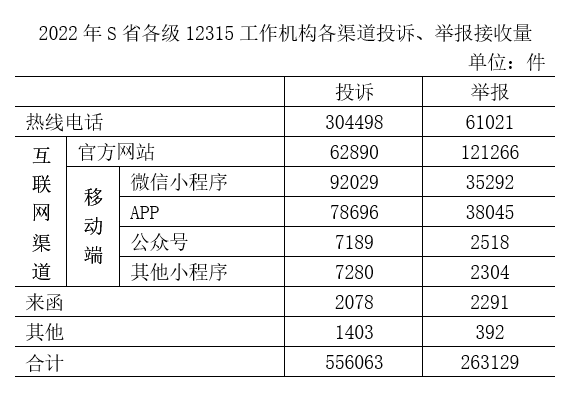
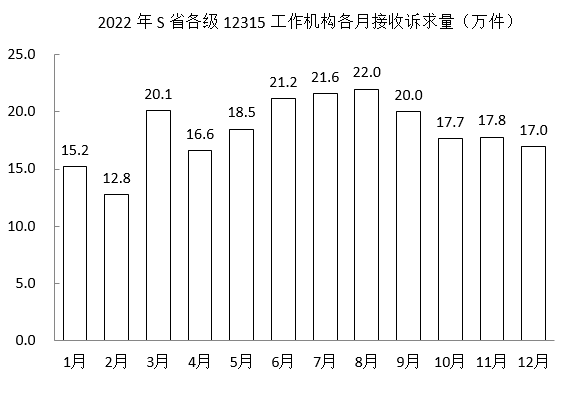
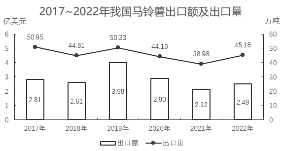
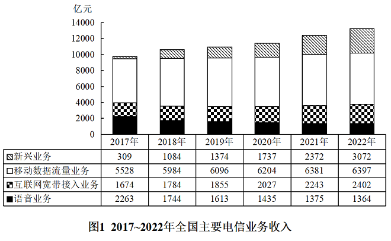
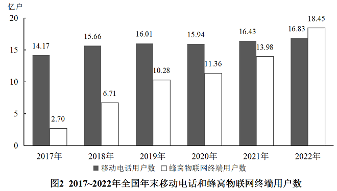

# 2024年国家公务员录用考试《行测》题（地市级网友回忆版）

> 资料分析 · 21 题 · 国考 2024

## 材料 1

        2022年，S省各级12315工作机构共接收诉求220.4万件，同比增长21.41%。其中，投诉55.6万件、举报26.3万件、咨询138.5万件，比上一年分别增加14.0万件、8.9万件、16.0万件。

### 第 1 题　qid 5893728 · 增长

将S省各级12315工作机构接收的投诉、举报和咨询三类诉求量按2022年同比增速从高到低排序，以下正确的是：

- **A**. 投诉量、举报量、咨询量
- **B**. 咨询量、投诉量、举报量
- **C**. 举报量、咨询量、投诉量
- **D**. 举报量、投诉量、咨询量　✅

**答案**：D

**官方解析**

根据题干“······按2022年同比增速从高到低排序······”，可判定本题为一般增长率比较问题。定位文字材料可知：2022年S省各级12315工作机构接收的诉求中：投诉55.6万件、举报26.3万件、咨询138.5万件，比上一年分别增加14.0万件、8.9万件、16.0万件。根据公式：增长率，则2022年三类诉求量的同比增速分别为：投诉量；举报量；咨询量。故同比增速从高到低排序为：举报量、投诉量、咨询量。

故正确答案为D。

---

### 第 2 题　qid 5893730 · 比重

2022年，S省各级12315工作机构热线电话投诉接收件数占投诉总件数的比重比热线电话举报接收件数占举报总件数的比重：

- **A**. 高20个百分点以上　✅
- **B**. 低20个百分点以上
- **C**. 高不到20个百分点
- **D**. 低不到20个百分点

**答案**：A

**官方解析**

根据题干“2022年······占······的比重比······占······的比重”，可判定本题为现期比重问题。定位文字材料可得：2022年S省各级12315工作机构共接收投诉55.6万件、举报26.3万件。定位统计表可得：2022年S省各级12315工作机构热线电话共接收投诉304498件、举报61021件。根据公式：比重，则所求，即高20个百分点以上。

故正确答案为A。

---

### 第 3 题　qid 5893735 · 综合

以下折线图反映了2022年哪一时间段内S省各级12315工作机构的接收诉求量环比增量的变化趋势？

- **A**. 2~5月
- **B**. 3~6月　✅
- **C**. 5~8月
- **D**. 8~11月

**答案**：B

**官方解析**

根据题干“······环比增量的变化趋势”，可判定本题为增长量比较问题。定位柱状图可得2022年S省各级12315工作机构各月接收诉求量。
A项：2月接收诉求量环比增量=现期量-基期量=12.8-15.2&lt;0；3月环比增量=20.1-12.8&gt;0，即折线图中第1个点应低于第2个点，与题干折线图矛盾，排除；
B项：3月环比增量=20.1-12.8=7.3万件，4月环比增量=16.6-20.1=-3.5万件，5月环比增量=18.5-16.6=1.9万件，6月环比增量=21.2-18.5=2.7万件，满足题干折线图趋势，当选；
C项：5月环比增量（1.9万件）&lt;6月环比增量（2.7万件），即折线图中第1个点应低于第2个点，与题干折线图矛盾，排除；
D项：8月环比增量=22.0-21.6=0.4万件，9月环比增量=20.0-22.0=-2万件，10月环比增量=17.7-20.0=-2.3万件，即折线图中第2个点应略高于第3个点，与题干折线图矛盾，排除。
故正确答案为B。

---

### 第 4 题　qid 5893734 · 综合

2022年，S省各级12315工作机构接收诉求量最少的季度是：

- **A**. 第一季度　✅
- **B**. 第二季度
- **C**. 第三季度
- **D**. 第四季度

**答案**：A

**官方解析**

定位柱状图可得2022年S省各级12315工作机构各月接收诉求量。观察可知，1~3月的接收诉求量均分别低于4~6月，故第一季度接收诉求量低于第二季度；10~12月的接收诉求量均分别低于7~9月，故第四季度接收诉求量低于第三季度，故比较第一季度和第四季度即可。第一季度接收诉求量=15.2+12.8+20.1=48.1万件；第四季度接收诉求量=17.7+17.8+17&gt;17×3=51万件，则接收诉求量最少的是第一季度。
故正确答案为A。

---

### 第 5 题　qid 5893736 · 综合

关于2022年S省各级12315工作机构接收诉求状况，不能从上述资料中推出的是：

- **A**. 2~12月间，接收诉求件数环比增量最大的是3月
- **B**. 全年接收诉求件数最多月份的诉求件数是最少月份的1.5倍以上
- **C**. 全年举报接收量占本渠道投诉、举报接收量比重最高的渠道是来函　✅
- **D**. 全年互联网渠道投诉、举报接收件数超过40万件

**答案**：C

**官方解析**

A项：定位统计图可得2022年S省各级12315工作机构各月接收诉求量。观察可知2、4、9、10、12月的柱状图均低于上月，即环比增量为负数，剩余3、5、6、7、8、11月份中，3月的柱状图与2月的柱状图高度差最大，故3月环比增量最大，正确；

B项：定位统计图可得2022年全年接收诉求件数最多的月份是8月，共接收诉求件数22.0万件；接收诉求件数最少的月份是2月，共接收诉求件数12.8万件。则所求倍数，正确；

C项：定位统计表可得2022年S省各级12315工作机构各渠道投诉、举报接收量。根据公式：比重，可知所求比重，则来函渠道比重，但通过观察数据可知，官方网站渠道比重，所占比重大于来函，错误；

D项：定位统计表可得2022年互联网渠道中各渠道的投诉、举报接收量。则全年接收件数件&gt;40万件，正确。

本题为选非题，故正确答案为C。

---

## 材料 2

        2022年，京津冀地区生产总值合计10.0万亿元，是2013年的1.8倍。其中，北京、河北跨越4万亿元量级，均为4.2万亿元，分别是2013年的2.0倍和1.7倍；天津1.6万亿元，是2013年的1.6倍。京津冀第一产业、第二产业、第三产业增加值占生产总值比重构成由2013年的6.2：35.7：58.1变化为2022年的4.8：29.6：65.6。京津冀三地第三产业增加值占生产总值比重分别为83.8%、61.3％和49.4%，较2013年分别提高4.3、7.2和8.4个百分点。

        2013—2022年，京津冀地区城镇累计分别新增就业288.1万、405.5万和748.4万人。2021年，北京法人单位从业人员中，第三产业比重为84.4%，较2013年提高6.2个百分点，其中信息服务业和商务服务业占比达25.5%，较2013年提高6.2个百分点；天津和河北第三产业就业人员占比为60.5％和46.6%，较2013年提高10.9和15.1个百分点。

        2022年，京津冀三地全体居民人均可支配收入分别为77415元、48976元和30867元，与2013年相比，年均分别增长7.4%、7.1％和8.2%。其中，城镇居民人均可支配收入分别增长7.3%、6.9％和7.1%，农村居民人均可支配收入分别增长8.2%、7.3％和8.6%。

### 第 6 题　qid 5893772 · 增长

以2013年为基期，则2013-2022年京津冀地区生产总值年均约增加多少万亿元？

- **A**. 1.1
- **B**. 0.9
- **C**. 0.7
- **D**. 0.5　✅

**答案**：D

**官方解析**

根据题干“······年均约增加多少万亿元”，可判定本题为年均增长量问题。定位文字材料第一段可得：2022年，京津冀地区生产总值合计10.0万亿元，是2013年的1.8倍。则2013年，京津冀地区生产总值合计万亿元。根据公式：年均增长量，则2013-2022年京津冀地区生产总值年均增加万亿元。

故正确答案为D。

---

### 第 7 题　qid 5893773 · 比重

2013年，北京第三产业增加值占其生产总值比重比天津高多少个百分点？

- **A**. 25.4　✅
- **B**. 22.5
- **C**. 19.6
- **D**. 16.7

**答案**：A

**官方解析**

定位文字材料第一段可知，2022年京津冀三地第三产业增加值占生产总值比重分别为83.8%、61.3％和49.4%，较2013年分别提高4.3、7.2和8.4个百分点。则2013年北京第三产业增加值占其生产总值比重=83.8%-4.3%=79.5%，2013年天津第三产业增加值占其生产总值比重=61.3％-7.2%=54.1%，故题干所求=79.5%-54.1%=25.4%，即2013年北京第三产业增加值占其生产总值比重比天津高25.4个百分点。
故正确答案为A。

---

### 第 8 题　qid 5893776 · 综合

2013—2022年，北京城镇累计新增就业人数约占同期京津冀地区城镇累计新增就业总人数的：

- **A**. 30%
- **B**. 35%
- **C**. 20%　✅
- **D**. 25%

**答案**：C

**官方解析**

根据题干“2013—2022年······占······”，可判定本题为现期比重问题。定位文字材料第二段可得：2013—2022年，京津冀地区城镇累计分别新增就业288.1万、405.5万和748.4万人。根据公式：比重，则题干所求比重为。

故正确答案为C。

---

### 第 9 题　qid 5893777 · 增长

将京、津、冀按2013—2022年居民人均可支配收入年均增速的城乡差值的绝对值从大到小排列，以下正确的是：

- **A**. 京、冀、津
- **B**. 冀、京、津　✅
- **C**. 京、津、冀
- **D**. 冀、津、京

**答案**：B

**官方解析**

定位文字材料第三段可知，2022年与2013年相比，京津冀三地城镇和农村居民人均可支配收入年均增速。三地居民城乡人均可支配收入年均增速差值的绝对值分别为：京，津，冀，故从大到小排列为：冀、京、津。

故正确答案为B。

---

### 第 10 题　qid 5893779 · 增长

在以下信息中，能够从上述资料中推出的有几项？
①2013—2022年京津冀第一产业增加值年均增量（以2013年为基期）
②2013年天津第一产业、第二产业增加值之和
③2013—2022年河北城镇新增就业人员中第三产业就业人员人数

- **A**. 0项
- **B**. 1项
- **C**. 2项　✅
- **D**. 3项

**答案**：C

**官方解析**

①定位文字材料第一段可得，2022年，京津冀地区生产总值合计10.0万亿元，是2013年的1.8倍。京津冀第一产业占生产总值比重构成由2013年的6.2：35.7：58.1变化为2022年的4.8：29.6：65.6。则所求年均增量，可以推出；

②定位文字材料第一段可得，2022年······天津1.6万亿元，是2013年的1.6倍。京津冀三地第三产业增加值占生产总值的比重分别为83.8%、61.3%和49.4%，较2013年分别提高4.3、7.2和8.4个百分点。则2013年天津地区生产总值为万亿元，2013年天津第三产业增加值占比为61.3%-7.2%=54.1%。则所求=2013年天津总产值×（1-第三产业增加值占比）万亿元，可以推出；

③定位文字材料第二段可知，材料只给出2022年河北城镇累计新增就业人数和2021年、2013年河北第三产业就业人员占比，2013—2022年河北城镇新增就业人员中第三产业就业人员人数均无法推出。

综上可知，只有①②可以推出，共2项。

故正确答案为C。

---

## 材料 3

### 第 11 题　qid 5893792 · 综合

2016~2020年，我国马铃薯总产量在以下哪个范围内？

- **A**. 不到0.9亿吨　✅
- **B**. 0.9亿~0.92亿吨之间
- **C**. 0.92亿~0.94亿吨之间
- **D**. 超过0.94亿吨

**答案**：A

**官方解析**

定位图1可得：2016~2020年，我国马铃薯产量分别为1699万吨、1770万吨、1798万吨、1778万吨、1798万吨。则2016~2020年我国马铃薯总产量为万吨=0.89亿吨，即不到0.9亿吨。

故正确答案为A。

---

### 第 12 题　qid 5893793 · 增长

2018~2022年，我国马铃薯单位面积产量同比增长的年份有几个？

- **A**. 2
- **B**. 3
- **C**. 4
- **D**. 5　✅

**答案**：D

**官方解析**

根据题干“2018~2022年······单位面积产量同比增长的年份有几个”，结合材料给出了2017~2022年我国马铃薯的播种面积和产量，可判定本题为两期平均数比较问题。定位图1可得：2017~2022年我国马铃薯的播种面积和产量。单位面积产量，根据两期平均数比较结论“当分子增速（a）大于分母增速（b）时，平均数上升”，观察发现，2018、2020、2021、2022年我国马铃薯产量的同比增长率均大于0，面积的同比增长率均小于0，则这4个年份我国马铃薯单位面积产量为同比增长。只需再判断2019年我国马铃薯单位面积产量是否同比增长即可。

方法一：2018年我国马铃薯单位面积产量为，2019年为，则2019年我国马铃薯单位面积产量同比增长。

方法二：根据公式：增长率，可得2019年我国马铃薯产量的同比增长率（a）为，面积的同比增长率（b）为。a＞b，可判断平均数上升，即2019年我国马铃薯单位面积产量同比增长。

综上分析，2018~2022年我国马铃薯单位面积产量同比增长的年份有5个。

故正确答案为D。

---

### 第 13 题　qid 5893791 · 综合

2017~2022年我国马铃薯出口量最高的年份，当年出口额在这6年中排名（    ）。

- **A**. 第一
- **B**. 第二
- **C**. 第三　✅
- **D**. 第四

**答案**：C

**官方解析**

定位图2，可知2017~2022年我国马铃薯出口额及出口量。出口量最高的年份为2017年（50.95万吨），当年对应的出口额（2.81亿美元）排名第三。
故正确答案为C。

---

### 第 14 题　qid 5893794 · 比重

2020~2022年，我国马铃薯出口量占产量的比重呈现何种变化趋势？

- **A**. 持续上升
- **B**. 持续下降
- **C**. 先降后升　✅
- **D**. 先升后降

**答案**：C

**官方解析**

根据题干“2020~2022年，······比重呈现何种变化趋势”，可判定本题为现期比重问题。定位图1可得2020~2022年我国马铃薯产量；定位图2可得2020~2022年我国马铃薯出口量。根据公式：比重，则2020年我国马铃薯出口量占产量的比重，2021年的比重，2022年的比重。故2020~2022年，我国马铃薯出口量占产量的比重呈现先降后升的变化趋势。

故正确答案为C。

---

### 第 15 题　qid 5893795 · 增长

以下折线图反映了2019~2022年我国马铃薯哪一产销数据的同比增量变化趋势？

- **A**. 出口额
- **B**. 出口量
- **C**. 播种面积
- **D**. 产量　✅

**答案**：D

**官方解析**

根据题干“以下折线图反映了2019~2022年······同比增量变化趋势”，可判定本题为增长量比较问题。定位图1可得2018~2022年我国马铃薯播种面积及产量；定位图2可得2018~2022年我国马铃薯出口额及出口量。根据公式：增长量=现期量-基期量，可得：
A项：2019年出口额同比上升（3.98亿美元&gt;2.61亿美元），增长量&gt;0；2020年出口额同比下降（2.90亿美元&lt;3.98亿美元），增长量&lt;0。则第二个点应低于第一个点，不符合折线图趋势，排除；
B项：2019年出口量同比上升（50.33万吨&gt;44.81万吨），增长量&gt;0；2020年出口量同比下降（44.19万吨&lt;50.33万吨），增长量&lt;0。则第二个点应低于第一个点，不符合折线图趋势，排除；
C项：2020年播种面积同比增量为466-467=-1万公顷；2021年同比增量为461-466=-5万公顷。则第三个点应低于第二个点，不符合折线图趋势，排除；
D项：2019年产量同比增量为1778-1798=-20万吨；2020年同比增量为1798-1778=20万吨；2021年同比增量为1831-1798=33万吨；2022年同比增量为1852-1831=21万吨，符合折线图趋势，当选。
故正确答案为D。

---

## 材料 4

### 第 16 题　qid 5894965 · 综合

2017~2022年，全国移动数据流量业务收入总额在以下哪个范围内？

- **A**. 不到3.4万亿元
- **B**. 超过3.6万亿元　✅
- **C**. 3.4万亿—3.5万亿元之间
- **D**. 3.5万亿—3.6万亿元之间

**答案**：B

**官方解析**

定位图1可知2017~2022年每年全国移动数据流量业务收入。则题干所求亿元=3.66万亿元，在B项范围内。

故正确答案为B。

---

### 第 17 题　qid 5894966 · 增长

2019年，蜂窝物联网终端用户数同比增量约是移动电话用户数同比增量的多少倍？

- **A**. 7
- **B**. 10　✅
- **C**. 13
- **D**. 16

**答案**：B

**官方解析**

根据题干“2019年······约是······的多少倍”，可判定本题为现期倍数问题。定位图2可得：2019年蜂窝物联网终端用户数10.28亿户，移动电话用户数16.01亿户；2018年蜂窝物联网终端用户数6.71亿户，移动电话用户数15.66亿户。根据公式：增长量=现期量-基期量，则题干所求倍。

故正确答案为B。

---

### 第 18 题　qid 5894968 · 增长

以下年份中，全国电信新兴业务收入同比增速最快的是：

- **A**. 2019年
- **B**. 2020年
- **C**. 2021年　✅
- **D**. 2022年

**答案**：C

**官方解析**

根据题干“以下年份中······同比增速最快的是”，可判定本题为一般增长率比较问题。定位图1可得：2018~2022年全国电信新兴业务收入分别为1084亿元、1374亿元、1737亿元、2372亿元、3072亿元。根据公式：增长率，可得2019~2022年各年全国电信新兴业务收入同比增速分别为：

A项：2019年，；

B项：2020年，；

C项：2021年，；

D项：2022年，。

比较可知，全国电信新兴业务收入同比增速最快的是2021年。

故正确答案为C。

---

### 第 19 题　qid 5894969 · 综合

如2022年内每个月移动电话用户数增量和蜂窝物联网终端用户数增量均为固定值，则2022年蜂窝物联网终端用户数第一次超过移动电话用户数是在哪个季度？

- **A**. 第一季度
- **B**. 第二季度
- **C**. 第三季度　✅
- **D**. 第四季度

**答案**：C

**官方解析**

根据题干“······2022年······第一次超过······是在哪个季度”，可判定本题为现期追赶问题。定位图2可得：2021~2022年，蜂窝物联网终端用户数分别为13.98亿户、18.45亿户，移动电话用户数分别为16.43亿户、16.83亿户。根据公式：月均增长量，则2022年蜂窝物联网终端用户数的月均增长量为亿户，2022年移动电话用户数的月均增长量为亿户。根据公式：现期量=基期量+增长量×n，可列式：，解得，则n至少为第8个月，8月在三季度，即2022年蜂窝物联网终端用户数第一次超过移动电话用户数是在第三季度。

故正确答案为C。

---

### 第 20 题　qid 5894970 · 增长

以下折线图反映了2019~2022年全国哪一类电信业务收入同比增量的变化趋势？

- **A**. 新兴业务
- **B**. 移动数据流量业务
- **C**. 互联网宽带接入业务
- **D**. 语音业务　✅

**答案**：D

**官方解析**

根据题干“······2019~2022年······同比增量的变化趋势”，可判定本题为增长量比较问题。定位图1可知2018~2022年全国主要电信业务收入。根据公式：增长量=现期量-基期量，可得2019~2022年全国主要电信业务收入的同比增量：

A项：2019年，亿元；2020年，亿元。不符合折线图中第二个点低于第一个点的趋势，排除；

B项：2021年，亿元；2022年，亿元。不符合折线图中第四个点高于第三个点的趋势，排除；

C项：2019年，亿元；2020年，亿元。不符合折线图中第二个点低于第一个点的趋势，排除；

D项：2019年，1613-1744=-131亿元；2020年，1435-1613=-178亿元；2021年，1375-1435=-60亿元；2022年，1364-1375=-11亿元。完全符合折线图的变化趋势，当选。

故正确答案为D。

---

### 第 21 题　qid 5893530 · 综合

某地为工业企业提供相当于营业额2%的税收优惠，当地的A工厂原本预计当年会产生相当于营业额0.8%的亏损，在享受优惠政策后预计可以盈利300万元。问A工厂当年的预计营业额为多少亿元？

- **A**. 4
- **B**. 3.6
- **C**. 3
- **D**. 2.5　✅

**答案**：D

**官方解析**

设A工厂当年的预计营业额为x亿元，则A工厂原本预计会产生的亏损为0.8%x亿元，在享受税收优惠后盈利为2%x-0.8%x=1.2%x=300万元=0.03亿元，解得x=2.5。
故正确答案为D。

---
