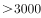
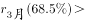
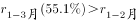

# 2024年国家公务员录用考试《行测》题（行政执法卷网友回忆版）

> 资料分析 · 21 题 · 国考 2024

## 材料 1

        2022年，S省各级12315工作机构共接收诉求220.4万件，同比增长21.41%。其中，投诉55.6万件、举报26.3万件、咨询138.5万件，比上一年分别增加14.0万件、8.9万件、16.0万件。

### 第 1 题　qid 5893728 · 增长

将S省各级12315工作机构接收的投诉、举报和咨询三类诉求量按2022年同比增速从高到低排序，以下正确的是：

- **A**. 投诉量、举报量、咨询量
- **B**. 咨询量、投诉量、举报量
- **C**. 举报量、咨询量、投诉量
- **D**. 举报量、投诉量、咨询量　✅

**答案**：D

**官方解析**

根据题干“······按2022年同比增速从高到低排序······”，可判定本题为一般增长率比较问题。定位文字材料可知：2022年S省各级12315工作机构接收的诉求中：投诉55.6万件、举报26.3万件、咨询138.5万件，比上一年分别增加14.0万件、8.9万件、16.0万件。根据公式：增长率，则2022年三类诉求量的同比增速分别为：投诉量；举报量；咨询量。故同比增速从高到低排序为：举报量、投诉量、咨询量。

故正确答案为D。

---

### 第 2 题　qid 5893730 · 比重

2022年，S省各级12315工作机构热线电话投诉接收件数占投诉总件数的比重比热线电话举报接收件数占举报总件数的比重：

- **A**. 高20个百分点以上　✅
- **B**. 低20个百分点以上
- **C**. 高不到20个百分点
- **D**. 低不到20个百分点

**答案**：A

**官方解析**

根据题干“2022年······占······的比重比······占······的比重”，可判定本题为现期比重问题。定位文字材料可得：2022年S省各级12315工作机构共接收投诉55.6万件、举报26.3万件。定位统计表可得：2022年S省各级12315工作机构热线电话共接收投诉304498件、举报61021件。根据公式：比重，则所求，即高20个百分点以上。

故正确答案为A。

---

### 第 3 题　qid 5893734 · 综合

2022年，S省各级12315工作机构接收诉求量最少的季度是：

- **A**. 第一季度　✅
- **B**. 第二季度
- **C**. 第三季度
- **D**. 第四季度

**答案**：A

**官方解析**

定位柱状图可得2022年S省各级12315工作机构各月接收诉求量。观察可知，1~3月的接收诉求量均分别低于4~6月，故第一季度接收诉求量低于第二季度；10~12月的接收诉求量均分别低于7~9月，故第四季度接收诉求量低于第三季度，故比较第一季度和第四季度即可。第一季度接收诉求量=15.2+12.8+20.1=48.1万件；第四季度接收诉求量=17.7+17.8+17&gt;17×3=51万件，则接收诉求量最少的是第一季度。
故正确答案为A。

---

### 第 4 题　qid 5893735 · 综合

以下折线图反映了2022年哪一时间段内S省各级12315工作机构的接收诉求量环比增量的变化趋势？

- **A**. 2~5月
- **B**. 3~6月　✅
- **C**. 5~8月
- **D**. 8~11月

**答案**：B

**官方解析**

根据题干“······环比增量的变化趋势”，可判定本题为增长量比较问题。定位柱状图可得2022年S省各级12315工作机构各月接收诉求量。
A项：2月接收诉求量环比增量=现期量-基期量=12.8-15.2&lt;0；3月环比增量=20.1-12.8&gt;0，即折线图中第1个点应低于第2个点，与题干折线图矛盾，排除；
B项：3月环比增量=20.1-12.8=7.3万件，4月环比增量=16.6-20.1=-3.5万件，5月环比增量=18.5-16.6=1.9万件，6月环比增量=21.2-18.5=2.7万件，满足题干折线图趋势，当选；
C项：5月环比增量（1.9万件）&lt;6月环比增量（2.7万件），即折线图中第1个点应低于第2个点，与题干折线图矛盾，排除；
D项：8月环比增量=22.0-21.6=0.4万件，9月环比增量=20.0-22.0=-2万件，10月环比增量=17.7-20.0=-2.3万件，即折线图中第2个点应略高于第3个点，与题干折线图矛盾，排除。
故正确答案为B。

---

### 第 5 题　qid 5893736 · 综合

关于2022年S省各级12315工作机构接收诉求状况，不能从上述资料中推出的是：

- **A**. 2~12月间，接收诉求件数环比增量最大的是3月
- **B**. 全年接收诉求件数最多月份的诉求件数是最少月份的1.5倍以上
- **C**. 全年举报接收量占本渠道投诉、举报接收量比重最高的渠道是来函　✅
- **D**. 全年互联网渠道投诉、举报接收件数超过40万件

**答案**：C

**官方解析**

A项：定位统计图可得2022年S省各级12315工作机构各月接收诉求量。观察可知2、4、9、10、12月的柱状图均低于上月，即环比增量为负数，剩余3、5、6、7、8、11月份中，3月的柱状图与2月的柱状图高度差最大，故3月环比增量最大，正确；

B项：定位统计图可得2022年全年接收诉求件数最多的月份是8月，共接收诉求件数22.0万件；接收诉求件数最少的月份是2月，共接收诉求件数12.8万件。则所求倍数，正确；

C项：定位统计表可得2022年S省各级12315工作机构各渠道投诉、举报接收量。根据公式：比重，可知所求比重，则来函渠道比重，但通过观察数据可知，官方网站渠道比重，所占比重大于来函，错误；

D项：定位统计表可得2022年互联网渠道中各渠道的投诉、举报接收量。则全年接收件数件&gt;40万件，正确。

本题为选非题，故正确答案为C。

---

## 材料 2

### 第 6 题　qid 5893719 · 综合

2022年，中部六省中型灌区新增恢复灌溉面积是东北三省的：

- **A**. 4.5~5倍之间　✅
- **B**. 4~4.5倍之间
- **C**. 不到4倍
- **D**. 5倍以上

**答案**：A

**官方解析**

根据题干“2022年······是······的”，结合选项为倍数，可判定本题为现期倍数问题。定位表格材料可得∶2022年，东北三省中型灌区新增恢复灌溉面积分别为：辽宁1.8万亩、吉林9.4万亩、黑龙江13.4万亩；中部六省中型灌区新增恢复灌溉面积分别为：安徽27.6万亩、江西15.0万亩、河南11.5万亩、湖北26.2万亩、湖南27.0万亩、山西6.3万亩。则所求倍，在A项范围内。

故正确答案为A。

---

### 第 7 题　qid 5893720 · 综合

2022年，中部六省中型灌区新增节水能力占全国中型灌区的：

- **A**. 不到三成
- **B**. 一半以上
- **C**. 三成多　✅
- **D**. 四成多

**答案**：C

**官方解析**

根据题干“2022年······占······”，结合材料时间为2022年，可判定本题为现期比重问题。定位表格材料可得：2022年全国中型灌区新增节水能力为121283.6万立方米，中部六省中型灌区新增节水能力分别为安徽6499.5万立方米、江西6997.1万立方米、河南3291.5万立方米、湖北10254.1万立方米、湖南10055.2万立方米、山西1020.6万立方米。根据公式：比重，可得所求比重为，即三成多。

故正确答案为C。

---

### 第 8 题　qid 5893721 · 综合

2022年，中型灌区改善灌溉面积与新增恢复灌溉面积比值最大的中部省份是：

- **A**. 山西
- **B**. 湖北
- **C**. 河南　✅
- **D**. 江西

**答案**：C

**官方解析**

根据题干“2022年······比值最大的······”，可以判定本题为比值比较问题。定位表格材料可得，2022年山西、湖北、河南、江西中型灌区改善灌溉面积分别为25.2万亩、70.1万亩、53.2万亩、40.5万亩，山西、湖北、河南、江西中型灌区新增恢复灌溉面积分别为6.3万亩、26.2万亩、11.5万亩、15.0万亩。则四个省份中型灌区改善灌溉面积与新增恢复灌溉面积的比值分别为：山西，；湖北，；河南，；江西，。比较可知，中型灌区改善灌溉面积与新增恢复灌溉面积的比值最大的中部省份为河南。

故正确答案为C。

---

### 第 9 题　qid 5893722 · 增长

2022年全国粮食产量同比增加368万吨。如全国中型灌区新增粮食生产能力均得到充分利用，则中部六省中型灌区新增粮食生产能力对全国粮食增产的贡献占比为：

- **A**. 不到2%
- **B**. 超过9%　✅
- **C**. 2%~5%之间
- **D**. 5%~9%之间

**答案**：B

**官方解析**

根据题干“2022年······贡献占比为”，可判定本题为现期比重问题。定位表格材料可得：2022年中部六省中型灌区新增粮食生产能力分别为：安徽5422.5万公斤、江西7469.1万公斤、河南4320.2万公斤、湖北5039.3万公斤、湖南10885.0万公斤、山西3785.6万公斤；根据题干可知“2022年全国粮食产量同比增加368万吨”。根据公式：增长贡献率，结合1吨=1000公斤，则题干所求为，在B项范围内。

故正确答案为B。

---

### 第 10 题　qid 5893723 · 比重

在资料所给中型灌区续建配套与节水改造项目成效的4个指标中，东北三省占全国比重超过10%的指标有几个？

- **A**. 1
- **B**. 2　✅
- **C**. 3
- **D**. 4

**答案**：B

**官方解析**

根据题干“······占全国比重超过10%的指标有几个“，可判定本题为现期比重问题。根据表格数据可知：2022年东北三省新增恢复灌溉面积万亩&lt;264.8万亩×10%；东北三省改善灌溉面积万亩&lt;1168.4万亩×10%；东北三省新增粮食生产能力万公斤&gt;121918.9万公斤×10%；东北三省新增节水能力万立方米&gt;121283.6万立方米×10%。因此，资料所给的4个指标中，东北三省占全国比重超过10%的指标有新增粮食生产能力和新增节水能力，共2个。

故正确答案为B。

---

## 材料 3

        截至2022年末，全国累计投运各类电化学储能电站（包括大、中、小型电站）472座，总能量14.05GWh。其中大型电站26座，总能量5.99GWh；中型电站275座，总能量7.23GWh。2022年新增投运电化学储能电站194座，总能量达7.86GWh。其中大型电站19座，总能量4.64GWh；中型电站114座，总能量2.92GWh。

        2022年末累计投运的各类电化学储能电站中，锂离子电池电站435座，总能量占比达到89.2%（磷酸铁锂电池占88.7%，三元锂电池和钛酸锂电池分别占0.3%和0.2%），铅酸/铅碳电池总能量占比4.0%，液流电池总能量占比3.7%。在新增投运的电化学储能电站中，锂离子电池总能量占比达到86.5%，全部为磷酸铁锂电池。此外，铅酸/铅碳电池总能量占2.7%，液流电池总能量占5.6%。

### 第 11 题　qid 5893726 · 比重

截至2021年末全国累计投运的各类电化学储能电站总数中，小型电站数量占比约为：

- **A**. 30%
- **B**. 35%
- **C**. 40%　✅
- **D**. 45%

**答案**：C

**官方解析**

根据题干“截至2021年末······总数中，小型电站数量占比约为”，结合选项为百分号，且材料时间为截至2022年末，可判定本题为基期比重问题。定位文字材料第一段可得：截至2022年末，全国累计投运各类电化学储能电站（包括大、中、小型电站）472座，其中大型电站26座，中型电站275座；2022年新增投运各类电化学储能电站194座，其中大型电站19座，中型电站114座。根据公式：基期量=现期量-增长量，则截至2021年末全国累计投运各类电化学储能电站为472-194=278座，大型电站为26-19=7座，中型电站为275-114=161座，则小型电站为278-7-161=110座。根据公式：基期比重，则截至2021年末小型电站数量占比。

故正确答案为C。

---

### 第 12 题　qid 5893729 · 增长

2018-2022年，全国电化学储能电站年末总能量同比增长100%以上的年份有几个？

- **A**. 1
- **B**. 2
- **C**. 3　✅
- **D**. 4

**答案**：C

**官方解析**

根据题干“······同比增长100%以上的年份有几个”，可判定本题为一般增长率问题。定位统计图可得：2017-2022年全国电化学储能电站年末总能量。根据公式：增长率，所求为，化简得：现期量&gt;基期量×2。代入数据可得：2018年（858&gt;311×2），符合；2019年（1415&lt;858×2），不符合；2020年（3349&gt;1415×2），符合；2021年（6197&lt;3349×2），不符合；2022年（14054&gt;6197×2），符合。综上，2018-2022年，全国电化学储能电站年末总能量同比增长100%以上的年份有2018年、2020年、2022年，共3年。

故正确答案为C。

---

### 第 13 题　qid 5893731 · 平均数

2022年新增投运的电化学储能电站中，平均每个大型电站的能量约是中型电站的多少倍？

- **A**. 4
- **B**. 6
- **C**. 8
- **D**. 10　✅

**答案**：D

**官方解析**

根据题干“2022年，······约是······的多少倍”，可判定本题为现期倍数问题。定位文字资料第一段可得：2022年新增投运电化学储能电站194座，其中大型电站19座，总能量4.64Gwh；中型电站114座，总能量2.92Gwh。根据公式：平均数，则平均每个大型电站的能量，平均每个中型电站的能量。前者约是后者的倍。

故正确答案为D。

---

### 第 14 题　qid 5893732 · 比重

在①磷酸铁锂电池、②三元锂电池、③铅酸/铅碳电池和④液流电池四类应用不同技术的电化学储能电站中，2022年末累计投运电站总能量占各类电化学储能电站总能量比重高于2021年末水平的是：

- **A**. 仅①
- **B**. 仅④　✅
- **C**. ①②
- **D**. ③④

**答案**：B

**官方解析**

根据题干“······比重高于2021年末水平的是”，结合文字材料第二段给出2022年末累计投运的各类电化学储能电站总能量占比情况，以及2022年新增投运的各类电化学储能电站总能量占比情况，由于2022年末累计总能量=2021年末累计总能量+2022年新增总能量，可判定本题为混合比重问题。根据混合比重口诀“混合后总体比重居中”，结合题目要求“2022年末比重高于2021年末比重”可得：2021年末比重＜2022年末比重＜2022年新增比重，则找出2022年末比重＜2022年新增比重即可。根据文字材料第二段可知，仅④液流电池满足，2022年末累计投运的电化学储能电站占比（3.7%）＜2022年新增投运的电化学储能电站占比（5.6%）。
故正确答案为B。

---

### 第 15 题　qid 5893733 · 综合

关于全国各类电化学储能电站状况，能够从上述资料中推出的是：

- **A**. 2022年末，平均每个累计投运的大型电站能量同比上升　✅
- **B**. 截至2022年末，累计投运的小型电站总能量超过1Gwh
- **C**. 2022年末，平均每个累计投运的锂离子电池电站能量高于总体平均水平
- **D**. 2022年新增电站中，锂离子、铅酸/铅碳和液流电池以外的类型能量占总能量的比重不到5%

**答案**：A

**官方解析**

A项：定位文字材料第一段可得：截至2022年末，全国累计投运各类电化学储能电站（包括大、中、小型电站）472座，其中大型电站26座，总能量5.99Gwh；2022年新增投运电化学储能电站194座，其中大型电站19座，总能量4.64Gwh。则截至2021年末，全国累计投运大型电化学储能电站26-19=7座，总能量5.99-4.64=1.35Gwh。根据公式：平均每个累计投运的大型电站能量，故2022年末，平均每个累计投运的大型电站能量为Gwh，2021年末为Gwh，同比上升，正确；

B项：定位文字材料第一段可得：截至2022年末，全国累计投运各类电化学储能电站（包括大、中、小型电站）472座，总能量14.05Gwh，其中大型电站总能量5.99Gwh，中型电站总能量7.23Gwh。则截至2022年末，小型电站总能量为14.05-5.99-7.23=0.83Gwh，未超过1Gwh，错误；

C项：定位文字材料第一、二段可得：截至2022年末，全国累计投运各类电化学储能电站（包括大、中、小型电站）472座，总能量14.05Gwh；2022年末累计投运的各类电化学储能电站中，锂离子电池电站435座，总能量占比达到89.2%。则2022年末，平均每个累计投运的锂离子电池电站能量为Gwh，电站平均水平为Gwh，故平均每个累计投运的锂离子电池电站能量低于总体平均水平，错误；

D项：定位文字材料第二段可得：2022年末在新增投运的电化学储能电站中，锂离子电池总能量占比达到86.5%，全部为磷酸铁锂电池，此外，铅酸/铅碳电池总能量占2.7%，液流电池总能量占5.6%。则2022年新增电站中，锂离子、铅酸/铅碳和液流电池以外的类型能量占总能量的比重为1-86.5%-2.7%-5.6%=5.2%，超过5%，错误。

故正确答案为A。

---

## 材料 4

        2023年3月，全国规模以上工业企业的工业机器人完成产量4.4万套，服务机器人完成产量70万套。2023年1~3月全国规模以上工业企业的工业机器人累计完成产量10.4万套，服务机器人累计完成产量145万套。

        2023年3月，我国机器人设备出口金额0.7亿美元，较上年增长110.3%，进口金额2.4亿美元，较上年增长68.5%。2023年1~3月我国机器人设备累计出口金额1.9亿美元，较上年增长62.1%，累计进口金额6.9亿美元，较上年增长55.1%。

        2022年12月，全国规模以上工业企业的工业机器人完成产量4万套，服务机器人完成产量49.1万套。2022年1~12月全国规模以上工业企业的工业机器人累计完成产量44.3万套，服务机器人累计完成产量645.8万套。

        2022年12月，我国工业机器人设备出口金额0.5亿美元，进口金额1.8亿美元。2022年1~12月我国工业机器人设备累计出口金额6.1亿美元，累计进口金额20亿美元。

### 第 16 题　qid 5893711 · 综合

2023年1~2月，全国规模以上工业企业的服务机器人完成产量约是工业机器人完成产量的多少倍？

- **A**. 12.5　✅
- **B**. 14.0
- **C**. 15.9
- **D**. 18.1

**答案**：A

**官方解析**

根据题干“······约是······的多少倍”，可判定本题为现期倍数问题。定位文字材料第一段可得：2023年3月，全国规模以上工业企业的工业机器人完成产量4.4万套，服务机器人完成产量70万套。2023年1~3月全国规模以上工业企业的工业机器人累计完成产量10.4万套，服务机器人累计完成产量145万套。则2023年1~2月，全国规模以上工业企业的服务机器人完成产量=145-70=75万套，工业机器人完成产量=10.4-4.4=6万套，所求倍。

故正确答案为A。

---

### 第 17 题　qid 5893712 · 增长

2023年一季度，我国机器人设备进出口贸易逆差比上年同期：

- **A**. 下降了不到30%
- **B**. 下降了30%以上
- **C**. 上升了不到30%
- **D**. 上升了30%以上　✅

**答案**：D

**官方解析**

方法一：根据题干“2023年一季度······进出口贸易逆差比上年同期······”，结合选项为百分数，可判定本题为一般增长率问题。定位文字材料第二段可知：2023年1~3月，我国机器人设备累计出口金额1.9亿美元，较上年增长62.1%，累计进口金额6.9亿美元，较上年增长55.1%。根据公式：贸易逆差=进口额-出口额，则2023年1-3月，我国机器人设备进出口贸易逆差为6.9-1.9=5亿美元；根据公式：基期量，则2022年1-3月，我国机器人设备进出口贸易逆差为亿美元。根据公式：增长率，故贸易逆差的增长率为，即上升了30%以上。

方法二：根据公式：贸易逆差=进口额-出口额，则进口额=贸易逆差+出口额，结合材料中给出了进口额与出口额的增长率，可判定本题为混合增长率问题。根据混合增长率口诀“混合居中”，则有出口额同比增长率（62.1%）＞进口额同比增长率（55.1%）＞贸易逆差同比增长率（r）。2023年1-3月，我国机器人设备进出口贸易逆差为6.9-1.9=5亿美元，出口额为1.9亿美元，根据“混合增长率偏向基期量大的（一般用现期量代替基期量近似计算）”，故进口额同比增长率更靠近贸易逆差的同比增长率，则有55.1%-r＜62.1%-55.1%，解得r＞48.1%，即上升了30%以上。

故正确答案为D。

---

### 第 18 题　qid 5893714 · 综合

2022年12月，全国规模以上工业企业的①工业机器人完成产量和②服务机器人完成产量：

- **A**. 均高于1~11月的月均水平
- **B**. 均低于1~11月的月均水平
- **C**. 仅①高于1~11月的月均水平　✅
- **D**. 仅②高于1~11月的月均水平

**答案**：C

**官方解析**

根据题干“2022年12月······产量”，结合选项为“高于/低于1~11月的月均水平”，可判定本题为现期平均数问题。定位文字材料第三段可得：2022年12月，全国规模以上工业企业的工业机器人完成产量4万套，服务机器人完成产量49.1万套。2022年1~12月全国规模以上工业企业的工业机器人累计完成产量44.3万套，服务机器人累计完成产量645.8万套。则2022年1~11月全国规模以上工业企业的工业机器人月均完成产量万套＜4万套（2022年12月产量）；服务机器人月均完成产量万套＞49.1万套（2022年12月产量），即①工业机器人12月完成产量高于1~11月的月均水平，②服务机器人12月完成产量低于1~11月的月均水平。

故正确答案为C。

---

### 第 19 题　qid 5893715 · 综合

已知2022年1~11月我国高新技术产品进出口总额约为14544亿美元，则同期我国工业机器人设备累计进出口总额约占高新技术产品累计进出口总额的：

- **A**. 0.2%　✅
- **B**. 0.5%
- **C**. 1.0%
- **D**. 1.6%

**答案**：A

**官方解析**

根据题干“已知2022年1~11月······占······”，可判定本题为现期比重问题。定位文字材料第四段可得：2022年12月，我国工业机器人设备出口金额0.5亿美元，进口金额1.8亿美元；2022年1~12月我国工业机器人设备累计出口金额6.1亿美元，累计进口金额20亿美元。则2022年1~11月我国工业机器人设备累计进出口总额为（6.1+20）-（0.5+1.8）=23.8亿美元，根据公式：比重，则2022年1~11月我国工业机器人设备累计进出口总额占高新技术产品累计进出口总额的比重，与A项最接近。

故正确答案为A。

---

### 第 20 题　qid 5893724 · 综合

能够从上述资料中推出的是：

- **A**. 2022年3月，我国机器人设备出口金额不到3000万美元
- **B**. 2023年3月，我国机器人设备进口金额同比增速快于1~2月同比增速　✅
- **C**. 2023年一季度，全国规模以上工业企业的服务机器人完成产量高于上年各季度均值
- **D**. 2022年1~11月，全国规模以上工业企业的工业和服务机器人完成产量之和超过650万套

**答案**：B

**官方解析**

A项：定位文字材料第二段可知，2023年3月，我国机器人设备出口金额0.7亿美元，较上年增长110.3%。根据公式：基期量，可得所求万美元万美元，错误；

B项：定位文字材料第二段可知，2023年3月，我国机器人设备进口金额2.4亿美元，较上年增长68.5%；2023年1~3月我国机器人设备累计进口金额6.9亿美元，较上年增长55.1%。根据混合增长率口诀“混合居中”可知，，即2023年3月，我国机器人设备进口金额同比增速快于1~2月同比增速，正确；

C项：定位文字材料第一段可知，2023年1~3月全国规模以上工业企业的服务机器人累计完成产量145万套；定位文字材料第三段可知，2022年1~12月全国规模以上工业企业的服务机器人累计完成产量645.8万套。则2022年各季度均值万套。故2023年一季度产量（145万套）低于2022年各季度均值（万套），错误；

D项：定位文字材料第三段可知，2022年12月，全国规模以上工业企业的工业机器人完成产量4万套，服务机器人完成产量49.1万套。2022年1~12月全国规模以上工业企业的工业机器人累计完成产量44.3万套，服务机器人累计完成产量645.8万套。则2022年1~11月工业和服务机器人完成产量之和=2022年1~12月产量之和-2022年12月产量之和=（44.3+645.8）-（4+49.1）=645.8+（44.3-49.1）-4＜645.8万套＜650万套，错误。

故正确答案为B。

---

### 第 21 题　qid 5893530 · 综合

某地为工业企业提供相当于营业额2%的税收优惠，当地的A工厂原本预计当年会产生相当于营业额0.8%的亏损，在享受优惠政策后预计可以盈利300万元。问A工厂当年的预计营业额为多少亿元？

- **A**. 4
- **B**. 3.6
- **C**. 3
- **D**. 2.5　✅

**答案**：D

**官方解析**

设A工厂当年的预计营业额为x亿元，则A工厂原本预计会产生的亏损为0.8%x亿元，在享受税收优惠后盈利为2%x-0.8%x=1.2%x=300万元=0.03亿元，解得x=2.5。
故正确答案为D。

---
