# 2024年宁夏公务员录用考试《行测》题（网友回忆版）

> 资料分析 · 20 题 · 宁夏 2024

## 材料 1

        2023年前5个月，天津口岸出口汽车约17.2万辆，同比增长29.5%，总价值约100.1亿元人民币，同比增长40.2%。

        2023年前5个月，汽车出口带动天津口岸整体出口同比增加。汽车出口占同期天津口岸出口商品总值的2.2%，较上年同期提升0.3个百分点。1~5月民营企业出口活力明显，民营企业出口约10.6万辆，同比增长64.3%，占同期天津口岸汽车出口总量的61.6%，占比较上年同期提升13个百分点。新能源汽车出口成为新的增长点，出口约11万辆，同比增长50.2%。

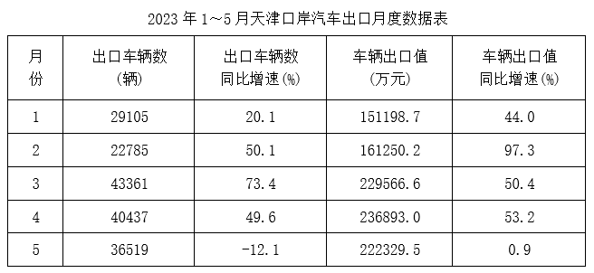

### 第 1 题　qid 10204497 · 增长

2023年1-5月，天津口岸出口汽车均价同比上涨为：

- **A**. 8%　✅
- **B**. 12%
- **C**. 16%
- **D**. 20%

**答案**：A

**官方解析**

根据题干“2023年1-5月······均价同比上涨为”，结合选项为百分数，可判定本题为平均数的增长率问题。定位文字材料第一段可得：2023年前5个月，天津口岸出口汽车约17.2万辆，同比增长29.5%（b），总价值约100.1亿元人民币，同比增长40.2%（a）。根据公式：平均数的增长率，则2023年1-5月，天津口岸出口汽车均价同比上涨，结合选项，只有A项满足。

故正确答案为A。

---

### 第 2 题　qid 16593081 · 增长

2023年1~5月，民营企业出口汽车同比约增加了多少万辆？

- **A**. 3
- **B**. 4　✅
- **C**. 5
- **D**. 6

**答案**：B

**官方解析**

根据题干“······同比约增加了多少万辆”，可判定本题为增长量计算问题。定位文字材料第二段可得：2023年1~5月，民营企业出口汽车约10.6万辆，同比增长64.3%。根据公式：增长量，则题干所求万辆。

故正确答案为B。

---

### 第 3 题　qid 16593082 · 综合

2022年1~5月，天津口岸出口新能源汽车约占天津口岸出口汽车的：

- **A**. 46%
- **B**. 50%
- **C**. 55%　✅
- **D**. 64%

**答案**：C

**官方解析**

根据题干“2022年1~5月······占······”，结合材料时间为2023年前5个月，可判定本题为基期比重问题。定位文字材料第一段可知：2023年前5个月，天津口岸出口汽车约17.2万辆（B），同比增长29.5%（b）。定位文字材料第二段可知：2023年前5个月，天津口岸出口新能源汽车约11万辆（A），同比增长50.2%（a）。根据公式：基期比重，则所求比重。

故正确答案为C。

---

### 第 4 题　qid 16593083 · 增长

2023年1~5月，天津口岸出口汽车平均单价同比增长率最大的月份是：

- **A**. 1月
- **B**. 2月　✅
- **C**. 4月
- **D**. 5月

**答案**：B

**官方解析**

根据题干“······平均单价同比增长率最大······”，可以判定本题为平均数的增长率问题。定位表格可得2023年1~5月天津口岸汽车出口值的同比增速（a）和出口车辆数的同比增速（b），根据公式：平均数的增长率，则2023年1~5月天津口岸出口汽车平均单价同比增长率分别为：1月，；2月，； 4月，；5月，。比较可知，2023年1~5月天津口岸出口汽车平均单价同比增长率最大的月份是2月。

故正确答案为B。

---

### 第 5 题　qid 16593084 · 平均数

在以下信息中，能够从上述资料中推出的有几项？
①2022年1~5月，天津口岸汽车出口量最大的是3月
②2023年1~5月，民营企业月均通过天津口岸出口汽车2万辆以上
③2023年2月，天津口岸出口汽车平均单价高于1月水平
④2022年1~5月，汽车出口总价值占天津口岸出口商品总值的2%以下

- **A**. 1
- **B**. 2
- **C**. 3　✅
- **D**. 4

**答案**：C

**官方解析**

①：定位统计表可知2023年1~5月各月天津口岸出口车辆数及其同比增速。根据公式：基期量，则：

2022年1月天津口岸出口车辆数辆；

2022年2月天津口岸出口车辆数辆；

2022年3月天津口岸出口车辆数辆；

2022年4月天津口岸出口车辆数辆；

2022年5月天津口岸出口车辆数辆。

比较发现2022年1~5月，天津口岸汽车出口量最大的是5月，错误；

②：定位文字材料第二段可知，2023年前5个月······民营企业出口约10.6万辆。根据月均，则2023年1~5月，民营企业月均通过天津口岸出口汽车数量万辆，正确；

③：定位统计表可知，2023年1月天津口岸出口车辆29105辆，车辆出口值151198.7万元；2月天津口岸出口车辆22785辆，车辆出口值161250.2万元。根据公式：平均单价，则1月出口单价，2月出口单价，由于前者的分子小且分母大，因此分数较小，即2023年2月，天津口岸出口汽车平均单价高于1月水平，正确；

④：定位文字材料第二段可知，2023年前5个月······汽车出口占同期天津口岸出口商品总值的2.2%，较上年同期提升0.3个百分点。则2022年1~5月，汽车出口总价值占天津口岸出口商品总值的2.2%-0.3%=1.9%&lt;2%，正确。

综上所述，能够从上述资料中推出的有②③④，共3项。

故正确答案为C。

---

## 材料 2

        截止2022年12月，我国网民规模约为10.67亿，较2021年12月新增网民约3549万，互联网普及率达75.6%，较2021年12月提升2.6个百分点。我国网民使用手机上网的比例达99.8%，较2021年12月增加0.1个百分点；使用电视上网的比例为25.9%；使用台式电脑、笔记本电脑、平板电脑上网的比例分别为34.2%、32.8%和28.5%。我国城镇网民规模约为7.59亿，占网民整体的71.1%，农村网民规模约为3.08亿，较2021年12月增长约2371万，占网民整体的28.9%。

        2022年12月，20-29岁、30-39岁、40-49岁网民占比分别为14.2%、19.6%和16.7%；50岁及以上网民群体占比由2021年12月的26.8%提升至30.8%，互联网进一步向中老年群体渗透。

        2022年12月，线上办公用户规模约达5.4亿，较2021年12月增加7078万户，占整体网民的50.6%。互联网医疗用户规模约达3.63亿，较2021年12月增加约6466万，占网民整体的34%。农村地区在线教育和互联网医疗用户分别占农村网民整体的31%和21.5%，较上年分别增加2.7%和4.1%。

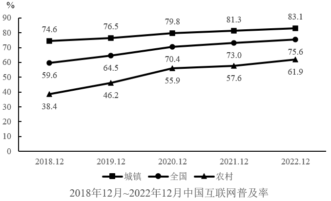

### 第 6 题　qid 16593068 · 增长

以下柱状图中，最能准确反映2019年12月-2022年12月全国互联网普及率同比增量变化趋势的是（横轴位置代表增量为0）：

- **A**. 
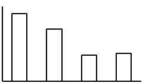

- **B**. 
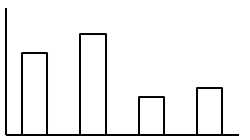

- **C**. 

　✅
- **D**. 
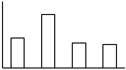

**答案**：C

**官方解析**

根据题干“······最能准确反映2019年12月-2022年12月全国互联网普及率同比增量变化趋势的是······”，可判定本题为增长量比较问题。定位统计图可知2018年12月-2022年12月全国互联网普及率。根据公式：增长量=现期量-基期量，则2019年12月-2022年12月全国互联网普及率同比增量分别为：
2019年12月：64.5%-59.6%=4.9%，即同比增长4.9个百分点；
2020年12月：70.4%-64.5%=5.9%，即同比增长5.9个百分点；
2021年12月：73.0%-70.4%=2.6%，即同比增长2.6个百分点；
2022年12月：75.6%-73.0%=2.6%，即同比增长2.6个百分点。
观察可知，同比增量呈先上升再下降最后相等的趋势，且2020年12月与2019年12月同比增量仅相差1个百分点，与C项变化趋势一致。
故正确答案为C。

---

### 第 7 题　qid 10204490 · 综合

根据上述材料，截止2022年12月我国网民使用上网前3位的设备是：

- **A**. 手机、台式电脑、笔记本电脑　✅
- **B**. 手机、笔记本电脑、平板电脑
- **C**. 手机、电视、台式电脑
- **D**. 电视、台式电脑、平板电脑

**答案**：A

**官方解析**

定位文字材料第一段可知：截止2022年12月，我国网民使用手机上网的比例达99.8%，使用电视上网的比例为25.9%，使用台式电脑、笔记本电脑、平板电脑上网的比例分别为34.2%、32.8%和28.5%。故截止2022年12月我国网民使用上网前3位的设备是：手机（99.8%）、台式电脑（34.2%）、笔记本电脑（32.8%）。
故正确答案为A。

---

### 第 8 题　qid 16593065 · 综合

截至2022年12月，我国20岁以上网民人数是20岁以下网民人数的：

- **A**. 不到3倍
- **B**. 3-4倍之间
- **C**. 4-5倍之间　✅
- **D**. 5倍以上

**答案**：C

**官方解析**

根据题干“截至2022年12月······是······的”，结合材料时间为2022年12月，且选项为倍数，可判定本题为现期倍数问题。定位文字材料第二段可得：2022年12月，我国20-29岁、30-39岁、40-49岁网民占比分别为14.2%、19.6%和16.7%；50岁及以上网民群体占比由2021年12月的26.8%提升至30.8%。则截至2022年12月，我国20岁以上网民人数占比=14.2%+19.6%+16.7%+30.8%=81.3%，20岁以下网民人数占比=1-81.3%=18.7%，则题干所求，在C项范围内。 

故正确答案为C。 

---

### 第 9 题　qid 16593067 · 增长

2019-2022年，当年12月我国城镇与农村互联网普及率同比增量相差在1个百分点以内的年份有几个？

- **A**. 1　✅
- **B**. 2
- **C**. 3
- **D**. 4

**答案**：A

**官方解析**

根据题干“2019-2022年，当年12月······同比增量······”，可判定本题为增长量计算问题。定位统计图可知2018年12月-2022年12月我国城镇与农村互联网的普及率。根据公式：增长量=现期量-基期量，则2019-2022年，当年12月我国城镇与农村互联网普及率同比增量差值分别为：

2019年：，不满足；

2020年：，不满足；

2021年：，满足；

2022年：，不满足。

综上可知，2019-2022年，当年12月我国城镇与农村互联网普及率同比增量相差在1个百分点以内的年份仅有1个（2021年）。

故正确答案为A。

---

### 第 10 题　qid 16593069 · 增长

以下信息中，能够从上述资料中推出的有几项？
①2022年12月我国手机网民人数同比增量
②2021年12月我国线上办公用户占网民整体的比重
③2022年12月我国城镇地区互联网医疗用户规模

- **A**. 0
- **B**. 1
- **C**. 2
- **D**. 3　✅

**答案**：D

**官方解析**

①定位文字材料第一段可得：截止2022年12月，我国网民规模约为10.67亿，较2021年12月新增网民约3549万；我国网民使用手机上网的比例达99.8%，较2021年12月增加0.1个百分点。根据公式：部分量=整体量×比重，增长量=现期量-基期量，可得题干所求=[10.67×99.8%-（10.67-0.3549）×（99.8%-0.1%）]亿，可以推出；

②定位文字材料第一段可得：截止2022年12月，我国网民规模约为10.67亿，较2021年12月新增网民约3549万；定位文字材料第三段可得：2022年12月，线上办公用户规模约达5.4亿，较2021年12月增加7078万户。根据公式：比重，可得题干所求，可以推出；

③定位文字材料第一段可得：截止2022年12月，我国农村网民规模约为3.08亿；定位文字材料第三段可得：2022年12月，互联网医疗用户规模约达3.63亿，农村地区互联网医疗用户占农村网民整体的21.5%。根据公式：部分量=整体量×比重，可得农村地区互联网医疗用户规模=（3.08×21.5%）亿，则题干所求=（3.63-3.08×21.5%）亿，可以推出。

综上可知，能够推出的有3项。

故正确答案为D。

---

## 材料 3

        2022年中国锂电池出货量658GWh，同比增长101.1%。2022年中国动力锂电池装车量达294.6GWh，同比增长90.7%，高于全球同比增速18.9个百分点，占全球动力锂电池装车量的56.9%。

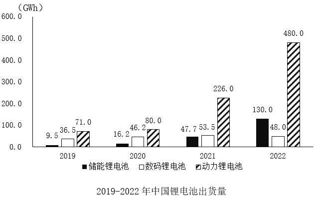

### 第 11 题　qid 16593070 · 综合

2019-2022年，中国数码锂电池年均出货量在以下哪个范围内？

- **A**. 不到45GWh
- **B**. 45-47GWh之间　✅
- **C**. 47-49GWh之间
- **D**. 49GWh以上

**答案**：B

**官方解析**

根据题干“2019-2022年······年均······在以下哪个范围内”，结合材料时间为2019-2022年，可判定本题为现期平均数问题。定位统计图可得：2019-2022年中国数码锂电池出货量分别为：36.5GWh、46.2GWh、53.5GWh、48.0GWh。则2019-2022年中国数码锂电池年均出货量为GWh，在B项范围内。

故正确答案为B。

---

### 第 12 题　qid 16593071 · 综合

2019-2022年，中国锂电池年出货量超过全球锂电池年出货量一半的年份有几个？

- **A**. 1
- **B**. 2
- **C**. 3　✅
- **D**. 4

**答案**：C

**官方解析**

定位统计表和统计图可知：2019-2022年全球锂电池出货量和中国各类型锂电池出货量。故各年份中国锂电池出货量分别为：2019年，9.5+36.5+71.0=117.0GWh；2020年，16.2+46.2+80.0=142.4GWh；2021年47.7+53.5+226.0=327.2GWh。定位文字材料第一段可知：2022年中国锂电池出货量658GWh。若想找出中国锂电池年出货量的年份，则需找出中国锂电池年出货量×2&gt;全球锂电池年出货量的年份。比较可知：2019年，117.0×2=234GWh&gt;218GWh；2020年，142.4×2=284.8GWh&lt;294.5GWh；2021年，327.2×2=654.4GWh&gt;562.4GWh；2022年，658×2=1316GWh&gt;957.7GWh。满足题意的有：2019年、2021年、2022年，共3个年份。

故正确答案为C。

---

### 第 13 题　qid 10204493 · 增长

以下锂电池出货量指标中同比增速最快的是：

- **A**. 2021年储能锂电池出货量　✅
- **B**. 2021年动力锂电池出货量
- **C**. 2022年储能锂电池出货量
- **D**. 2022年动力锂电池出货量

**答案**：A

**官方解析**

根据题干“······同比增速最快的是”，可判定本题为一般增长率问题。定位图形材料可得，2020-2022年储能锂电池出货量分别为16.2GWh、47.7GWh、130GWh，2020-2022年动力锂电池出货量分别为80GWh、226GWh、480GWh。根据公式：增长率，则各选项同比增长率分别为：

2021年储能锂电池出货量：；

2021年动力锂电池出货量：；

2022年储能锂电池出货量：；

2022年动力锂电池出货量：；

观察发现，2021年储能锂电池出货量同比增速最快。

故正确答案为A。

---

### 第 14 题　qid 16593077 · 增长

在以下信息中，能够从上述资料中推出的有几项？
①2019-2022年，中国储能锂电池出货量年均增速为3类锂电池中最快
②2019-2022年，中国锂电池出货量逐年增加
③2019-2022年，中国数码锂电池年出货量同比增速逐年下降
④2022年，中国新能源汽车产量同比增速慢于2021年水平

- **A**. 1
- **B**. 2
- **C**. 3　✅
- **D**. 4

**答案**：C

**官方解析**

①定位统计图可得，2019年中国储能锂电池、数码锂电池、动力锂电池出货量分别为9.5GWh、36.5GWh、71.0GWh；2022年三者出货量分别为130.0GWh、48.0GWh、480.0GWh。根据年均增长率公式：，当年份差n相同时，直接比较即可。储能锂电池：；数码锂电池：；动力锂电池：，比较可得储能锂电池出货量年均增速最快，正确；

②定位文字材料可得，2022年中国锂电池出货量658GWh；定位统计图可得2019-2021年中国锂电池出货量。2019-2022年中国锂电池出货量分别为：9.5+36.5+71.0=117GWh、16.2+46.2+80.0=142.4GWh、47.7+53.5+226.0=327.2GWh、658GWh。比较可得2019-2022年，中国锂电池出货量逐年增加，正确；

③定位统计图可得2019-2022年中国数码锂电池年出货量，但材料未给出2018年相关数据，无法计算2019年同比增速，故无法判断2020年的增速是否较2019年下降，错误；

④定位统计表可得，2020-2022年中国新能源汽车产量分别为146万辆、368万辆、722万辆。比较增速大小时，当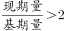，可直接比较，则2021年：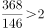；2022年：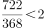。即2022年中国新能源汽车产量同比增速慢于2021年水平，正确。

综上所述，说法正确的有3个。

故正确答案为C。

---

### 第 15 题　qid 16593075 · 比重

以下饼图中，最能准确反映2022年中国锂电池出货量中，储能锂电池、数码锂电池和动力锂电池占比关系的是：
（黑色：储能锂电池  白色：数码锂电池  斜杠：动力锂电池）

- **A**. 

- **B**. 
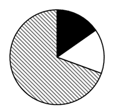

- **C**. 
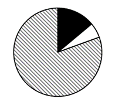

- **D**. 

　✅

**答案**：D

**官方解析**

根据题干“······最能准确反映2022年······占比关系的是”，结合材料时间为2022年，可判定本题为现期比重问题。定位统计图可得：2022年中国储能锂电池出货量为130.0GWh，数码锂电池出货量为48.0GWh，动力锂电池出货量为480.0GWh；定位文字材料可得：2022年中国锂电池出货量658GWh。根据公式：比重，则在2022年中国锂电池出货量中，动力锂电池出货量占比，A项中动力锂电池出货量占比为75%，C项中超过75%，排除A、C两项；储能锂电池出货量（130.0GWh）是数码锂电池出货量（48.0GWh）的2倍多，B项两部分占比相近，排除B项，D项当选。

故正确答案为D。

---

## 材料 4

        2023年一季度，新疆外贸进出口总值680.7亿元，同比增长80.3%。其中，出口584.7亿元，同比增长86.9%。3月当月，新疆外贸进出口总值236.9亿元，同比增长70%。其中，出口203.4亿元，同比增长78.9%；进口33.5亿元，同比增长30.8%。

        2023年一季度，新疆15个地州市中，乌鲁木齐、喀什、伊犁州、博州和塔城外贸规模居前五，贸易值分别是176.0亿元、142.1亿元、121.9亿元、94.9亿元、33.5亿元，伊犁州、塔城、哈密、克拉玛依、博州增速居前五，同比增速分别为198.4%、183.6%、179.4%、163.3%、150.6%。

        2023年一季度，新疆实有备案外贸企业15486家，同比增长6.5%；一季度，新疆有进出口实绩的外贸企业1535家，同比增长12%。新疆民营企业进出口650.1亿元，同比增长94.2%。一季度，新疆国有企业进出口25.7亿元；外商投资企业进出口4.9亿元。

        2023年一季度，新疆金属矿及矿砂、未锻轧铜及铜材、煤炭分别进口35.5亿元、11.4亿元、3.7亿元，同比分别增长134.1%、65.3%、79.6%，进口量同比分别增长102.5%、69.4%、78.8%。同期，进口农产品15.2亿元，同比增长20.5%。

### 第 16 题　qid 16593086 · 综合

2022年3月，新疆外贸出口值约为：

- **A**. 126亿元
- **B**. 114亿元　✅
- **C**. 139亿元
- **D**. 160亿元

**答案**：B

**官方解析**

根据题干“2022年3月······出口值约为”，结合材料时间为2023年3月，可判定本题为基期计算问题。定位文字材料第一段可得：2023年3月当月，新疆外贸出口203.4亿元，同比增长78.9%。根据公式：基期量，则2022年3月，新疆外贸出口值亿元，对应B项。 

故正确答案为B。

---

### 第 17 题　qid 16593087 · 增长

2023年一季度，新疆外贸规模与增速均居前五的地州市有：

- **A**. 喀什、博州和塔城
- **B**. 伊犁州、博州和塔城　✅
- **C**. 哈密、克拉玛依和博州
- **D**. 伊犁州、博州和乌鲁木齐

**答案**：B

**官方解析**

定位文字材料第二段可得：2023年一季度，新疆15个地州市中，乌鲁木齐、喀什、伊犁州、博州和塔城外贸规模居前五；伊犁州、塔城、哈密、克拉玛依、博州增速居前五。故2023年一季度，新疆外贸规模与增速均居前五的地州市有伊犁州、博州和塔城。
故正确答案为B。

---

### 第 18 题　qid 16593089 · 增长

2023年一季度，新疆有进出口实绩的外贸企业平均每家进出口值同比增长约：

- **A**. 61%　✅
- **B**. 73%
- **C**. 78%
- **D**. 81%

**答案**：A

**官方解析**

根据题干 “2023年一季度······平均每家······同比增长约”，可判定本题为平均数的增长率问题。定位文字材料第一、三段可得：2023年一季度，新疆外贸进出口总值680.7亿元人民币，同比增长80.3%（a）；新疆有进出口实绩的外贸企业1535家，同比增长12%（b）。根据公式：平均数的增长率，则题目所求为。

故正确答案为A。

---

### 第 19 题　qid 16593090 · 综合

2023年一季度，新疆进口的金属矿及矿砂、未锻轧铜及铜材、煤炭合计约占新疆外贸进口值的：

- **A**. 8.6%
- **B**. 16%
- **C**. 43%
- **D**. 53%　✅

**答案**：D

**官方解析**

根据题干“2023年一季度······占新疆外贸进口值的”，结合材料时间为2023年一季度，可判定本题为现期比重问题。定位文字材料第一、四段可得：2023年一季度，新疆外贸进出口总值680.7亿元人民币······其中，出口584.7亿元；新疆金属矿及矿砂、未锻轧铜及铜材、煤炭分别进口35.5亿元、11.4亿元、3.7亿元。则2023年一季度新疆外贸进口值为680.7-584.7=96亿元。根据公式：比重，则题干所求为。

故正确答案为D。

---

### 第 20 题　qid 16593091 · 综合

不能从上述资料中推出的是：

- **A**. 2022年一季度，新疆进口农产品总值超过12亿元
- **B**. 2023年一季度，新疆煤炭进口单价高于上年同期水平
- **C**. 2023年一季度，外贸规模前五的地州市贸易值之和，占新疆外贸进出口总值的比重高于75%
- **D**. 2023年一季度，新疆民营企业进出口总值占新疆外贸进出口总值比重低于上年同期水平　✅

**答案**：D

**官方解析**

A项：定位文字材料第四段可得，2023年一季度，新疆······进口农产品15.2亿元，同比增长20.5%。根据公式：基期量，可得2022年一季度新疆进口农产品总值亿元&gt;12亿元，正确；

B项：定位文字材料第四段可得，2023年一季度，新疆煤炭进口3.7亿元，同比增长79.6%（a），进口量同比增长78.8%（b）。根据进口单价，及两期平均数比较结论：当a&gt;b时，平均数上升，可知新疆煤炭进口单价高于上年同期水平，正确；

C项：定位文字材料第一段可得，2023年一季度，新疆外贸进出口总值680.7亿元人民币；定位文字材料第二段可得，2023年一季度······乌鲁木齐、喀什、伊犁州、博州和塔城外贸规模居前五，贸易值分别是176.0亿元、142.1亿元、121.9亿元、94.9亿元、33.5亿元。根据公式：比重，则所求，正确；

D项：定位文字材料第一段可得，2023年一季度，新疆外贸进出口总值······同比增长80.3%（b）；定位文字材料第三段可得，2023年一季度······新疆民营企业进出口650.1亿元，同比增长94.2%（a）。根据两期比重比较结论：当部分增长率（a）&gt;总体增长率（b）时，比重上升。则新疆民营企业进出口总值所占比重高于上年同期水平，并非低于，错误。

本题为选非题，故正确答案为D。

---
