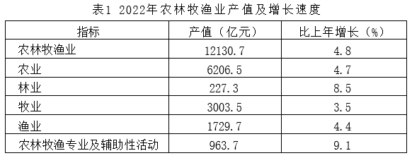
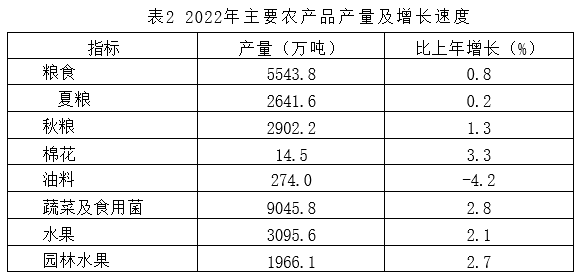
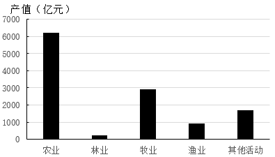
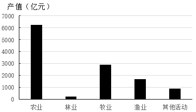
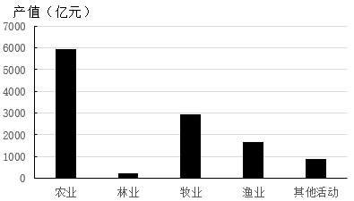
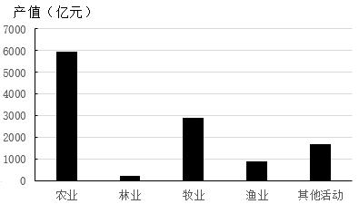
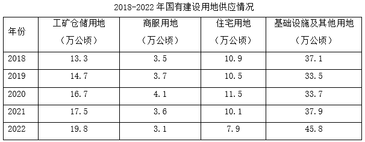
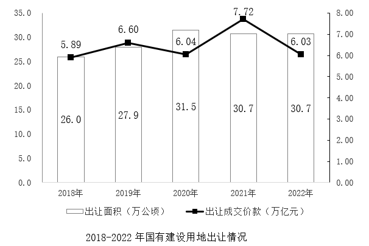
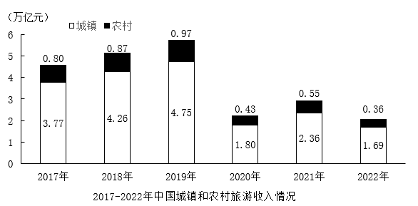

# 2024年山东省公务员录用考试《行测》试题（网友回忆版）

> 资料分析 · 20 题 · 山东 2024

## 材料 1

        2022年全省实现地区生产总值87435.1亿元，按不变价格计算，比上年增长3.9%。分产业看，第一产业增加值6298.6亿元，增长4.3%，三次产业结构为7.2：40.0：52.8。

        农林牧渔业产值12130.7亿元，按可比价格计算，比上年增长4.8%。猪牛羊禽肉产量838.4万吨，比上年增长2.9%；禽蛋产量（不含小品种)）438.1万吨，下降3.8%；牛奶产量304.4万吨，增长5.6%。水产品总产量（不含远洋渔业产量）843.9万吨，增长2.8%。其中，海水产品产量724.9万吨，增长2.6%；淡水产品产量119.0万吨，增长4.3%。

### 第 1 题　qid 10942271 · 增长

2022年，第三产业增加值比第二产业增加值大约高：

- **A**. 39870.4亿元
- **B**. 28678.7亿元
- **C**. 12130.7亿元
- **D**. 11191.7亿元　✅

**答案**：D

**官方解析**

根据题干“2022年······比······大约高”，结合材料给出2022年全省实现地区生产总值以及三次产业结构，可判定本题为现期比重问题。定位文字材料第一段可得：2022年全省实现地区生产总值87435.1亿元，三次产业结构为7.2：40.0：52.8。则2022年第二产业增加值所占比重为40.0%，第三产业增加值所占比重为52.8%。根据公式：部分=整体×比重，则2022年第三产业增加值比第二产业增加值高亿元，与D项最接近。

故正确答案为D。

---

### 第 2 题　qid 10942277 · 增长

将2022年第一产业各类产品的同比增速由高到低进行排序，以下正确的是：

- **A**. 棉花>猪牛羊禽肉>园林水果>淡水产品
- **B**. 猪牛羊禽肉>淡水产品>园林水果>棉花
- **C**. 淡水产品>猪牛羊禽肉>棉花>园林水果
- **D**. 淡水产品>棉花>猪牛羊禽肉>园林水果　✅

**答案**：D

**官方解析**

定位文字材料第二段可得：猪牛羊禽肉产量比上年增长2.9%；淡水产品产量增长4.3%；定位表2可得：棉花产量同比增长3.3%；园林水果产量同比增长2.7%。则2022年第一产业各类产品的同比增速由高到低排序为：淡水产品（4.3%）&gt;棉花（3.3%）&gt;猪牛羊禽肉（2.9%）&gt;园林水果（2.7%），对应D项。
故正确答案为D。

---

### 第 3 题　qid 10942279 · 比重

2022年，渔业占第一产业产值的比重较上年：

- **A**. 下降不足1个百分点　✅
- **B**. 上升不足1个百分点
- **C**. 下降约5个百分点
- **D**. 上升约5个百分点

**答案**：A

**官方解析**

根据题干“2022年······占······的比重较上年”，可判定本题为两期比重问题。定位文字材料第二段可得：（2022年）农林牧渔业产值12130.7亿元（B），按可比价格计算，比上年增长4.8%（b）。定位表1可得：2022年渔业产值1729.7亿元（A），比上年增长4.4%（a）。根据两期比重比较结论“当部分增长率（a）＜整体增长率（b）时，比重下降”，由于a（4.4%）＜b（4.8%），则渔业占第一产业产值的比重较上年下降，排除B、D两项。根据公式：两期比重差，则2022年，渔业占第一产业产值的比重较上年变化为，即下降不足1个百分点。

故正确答案为A。

备注：1.本题中第一产业产值理论上指农业、林业、牧业、渔业这四业的产值，而表中农林牧渔业产值包括农业、林业、牧业、渔业及农林牧渔专业及辅助性活动这五业的产值，其中农林牧渔专业及辅助性活动产值属于第三产业产值范畴，故第一产业产值应为表中农林牧渔业总产值减去农林牧渔专业及辅助性活动产值，但是这样算出的第一产业产值同比增长率约为4.4%（b），与渔业产值同比增长率4.4%（a）相等，即比重与上年保持不变，这样会没有答案。故推测命题人把农林牧渔业总产值看成了第一产业产值进行计算。2.本题不能通过第一产业增加值来替代第一产业产值进行计算。

---

### 第 4 题　qid 10942301 · 综合

下列各图符合2021年农林牧渔业各组成部分产值数量关系的是：

- **A**. 

- **B**. 

- **C**. 

　✅
- **D**. 

**答案**：C

**官方解析**

根据题干“······2021年······各组成部分产值数量关系的是”，结合材料时间为2022年，可判定本题为基期计算问题。定位表1可得2022年农林牧渔业各组成部分产值及增长速度。根据公式：基期量，则2021年农业产值亿元，排除A、B两项；渔业产值亿元，排除D项。

故正确答案为C。

---

### 第 5 题　qid 10942304 · 综合

能够从上述资料中推出的是：

- **A**. 2022年，林业平均亩产值约为650元
- **B**. 2022年，粮食产量较上年约增加8.8亿斤　✅
- **C**. 2022年，第一产业增加值比重较上年约下降1个百分点
- **D**. 2022年，油料作物下降速度比禽蛋产量的慢0.4个百分点

**答案**：B

**官方解析**

A项：定位表1可得：2022年，林业产值227.3亿元。材料中并未给出2022年林业种植面积的相关数据，即不能推出林业平均亩产值，错误；

B项：定位表2可得：2022年，粮食产量5543.8万吨，比上年增长0.8%。根据公式：增长量，则2022年，粮食产量较上年增加万吨。由于1吨=2000斤，则2022年，粮食产量较上年约增加44万吨×2000=88000万斤=8.8亿斤，正确；

C项：定位文字材料第一段可得：2022年全省实现地区生产总值87435.1亿元，按不变价格计算，比上年增长3.9%（b）。分产业看，第一产业增加值6298.6亿元，增长4.3%（a）。根据两期比重比较结论“当部分增长率（a）&gt;整体增长率（b）时，比重上升”，由于a（4.3%）&gt;b（3.9%），则2022年，第一产业增加值比重较上年上升，错误；

D项：定位文字材料第二段可得：2022年，禽蛋产量(不含小品种)下降3.8%。定位表2可得：2022年，油料产量比上年增长-4.2%。由于4.2%-3.8%=0.4%，即2022年，油料作物下降速度比禽蛋产量的快0.4个百分点，错误。

故正确答案为B。

---

## 材料 2

        2022年，我国全年国有建设用地供应76.6万公顷（1公顷=15亩）。其中，工矿仓储用地、商服用地、住宅用地、基础设施及其他用地供应面积分别为19.8万公顷、3.1万公顷、7.9万公顷和45.8万公顷。全年出让国有建设用地30.7万公顷，出让成交价款6.03万亿元。

### 第 6 题　qid 16437523 · 增长

2019-2022年，工矿仓储用地供应面积同比增速最快的年份是：

- **A**. 2020年　✅
- **B**. 2022年
- **C**. 2021年
- **D**. 2019年

**答案**：A

**官方解析**

根据题干“······同比增速最快的年份是”，可判定本题为一般增长率问题。定位统计表可得2018-2022年我国工矿仓储用地供应面积。根据公式：增长率，则2019-2022年工矿仓储用地供应面积同比增速分别为：

2019年，；

2020年，；

2021年，；

2022年，。

比较可知，2020年工矿仓储用地供应面积同比增速最快。

故正确答案为A。

---

### 第 7 题　qid 16437524 · 综合

2018-2022年，国有建设用地出让成交单价高于150万元/亩的年份有几个？

- **A**. 4
- **B**. 1
- **C**. 2
- **D**. 3　✅

**答案**：D

**官方解析**

根据题干“2018-2022年······出让成交单价高于······的年份有几个”，结合出让成交单价，且材料给出2018-2022年国有建设用地出让面积和出让成交价款，可判定本题为现期平均数问题。定位统计图可得2018-2022年国有建设用地出让面积和出让成交价款。题干要求，即，则只需找到满足的年份即可。2018-2022年国有建设用地分别为：

2018年，，符合；

2019年，，符合；

2020年，，不符合；

2021年，，符合；

2022年，，不符合。

则有2018年、2019年、2021年3个年份国有建设用地出让成交单价高于150万元/亩。

故正确答案为D。

---

### 第 8 题　qid 16437525 · 综合

若国有建设用地出让率=出让面积÷供应总面积×100%，则2018-2022年，国有建设用地出让率最高和最低大约相差：

- **A**. 7.6个百分点　✅
- **B**. 5.7个百分点
- **C**. 4.5个百分点
- **D**. 2.3个百分点

**答案**：A

**官方解析**

根据题干“若国有建设用地出让率=出让面积÷供应总面积×100%······国有建设用地出让率······”，可判定本题为现期比重问题。定位文字材料可得：2022年，我国全年国有建设用地供应76.6万公顷；定位统计表可得2018-2022年国有建设用地各类用地供应情况；定位统计图可得2018-2022年国有建设用地出让面积。根据公式：国有建设用地出让率=出让面积÷供应总面积×100%，则2018-2022年国有建设用地出让率分别为：

2018年，；

2019年，；

2020年，；

2021年，；

2022年，。

比较可知，出让率最低的是40.1%，出让率最高的是47.7%，故相差47.7%-40.1%=7.6%，即7.6个百分点。

故正确答案为A。

---

### 第 9 题　qid 16437526 · 比重

2018-2022年，国有建设用地供应中各类用地占比变动程度最小的是：

- **A**. 工矿仓储用地
- **B**. 商服用地　✅
- **C**. 住宅用地
- **D**. 基础设施及其他用地

**答案**：B

**官方解析**

根据题干“2018-2022年······占比变动程度最小的是”，可判定本题为两期比重比较问题。定位文字材料可得：2022年我国国有建设用地供应面积为76.6万公顷；定位统计表可得2018年和2022年我国国有建设用地供应中各类用地面积，2018年我国国有建设用地供应面积=13.3+3.5+10.9+37.1=64.8万公顷。则2018-2022年，四类用地面积占比变动程度分别为：

工矿仓储用地：2018年占比，2022年占比，变动程度=25.8%-20.5%=5.3%，即变化了5.3个百分点；

商服用地：2018年占比，2022年占比，变动程度=5.4%-4.0%=1.4%，即变化了1.4个百分点；

住宅用地：2018年占比，2022年占比，变动程度=16.8%-10.3%=6.5%，即变化了6.5个百分点；

基础设施及其他用地：2018年占比，2022年占比，变动程度=59.8%-57.3%=2.5%，即变化了2.5个百分点。

比较可知，商服用地占比变动程度最小。

故正确答案为B。

---

### 第 10 题　qid 16437527 · 综合

能够从上述材料推出的是：

- **A**. 2018-2022年，住宅用地年均供应面积比商服用地约多3倍
- **B**. 2018-2022年，国有建设用地出让面积与成交单价变动趋势相同
- **C**. 2018-2022年，住宅用地占国有建设用地供应总面积的比重逐年递减
- **D**. 2018-2022年，基础设施及其他用地占供应总面积比重最高的是2022年　✅

**答案**：D

**官方解析**

A项：定位统计表可得2018-2022年商服用地和住宅用地供应面积。根据公式：平均数，则2018-2022年商服用地年均供应面积万公顷；2018-2022年住宅用地年均供应面积万公顷，所求倍数倍，错误；

B项：定位统计图可得2018-2022年国有建设用地出让面积和出让成交价款。2020年出让成交单价，2019年出让成交单价，前者分子小分母大，则分数值小，故2020年出让成交单价小于2019年；而2020年出让面积（31.5万公顷）大于2019年（27.9万公顷），变化趋势不一致，错误；

C项：定位统计表可得2018-2022年我国国有建设用地供应中各类用地面积。根据公式：比重，则2019年所求占比；2020年所求占比，2020年比重高于2019年，并非逐年递减，错误；

D项：定位文字材料可得，2022年我国国有建设用地供应面积为76.6万公顷，定位统计表可得2018-2022年我国国有建设用地供应中各类用地面积。根据公式：比重，则2018-2022年基础设施及其他用地供应面积占比分别为：2018年，；2019年，；2020年，；2021年，；2022年，，比较可知，2022年占比最高，正确。

故正确答案为D。

---

## 材料 3

        2022年，中国国内旅游总人次达25.30亿。其中，城镇居民国内旅游人次19.28亿，同比下降17.7%；农村居民国内旅游人次6.02亿，同比下降33.5%。2022年，中国国内旅游收入（旅游总消费）2.05万亿元，为2019年的35.8%。

        2023年春节假期，全国国内旅游人次3.08亿，实现国内旅游收入3758.43亿元，分别恢复至2019年同期的88.6%和73.1%。

### 第 11 题　qid 16437528 · 增长

2022年，中国国内旅游总人次同比约下降：

- **A**. 17%
- **B**. 19%
- **C**. 20%
- **D**. 22%　✅

**答案**：D

**官方解析**

方法一：根据题干“2022年······同比约下降”，结合选项为百分数，可判定本题为一般增长率问题。定位文字材料第一段可得：2022年，中国国内旅游总人次达25.30亿；城镇居民国内旅游人次19.28亿，同比下降17.7%；农村居民国内旅游人次6.02亿，同比下降33.5%。由于国内旅游总人次=城镇居民国内旅游人次+农村居民国内旅游人次，根据公式：基期量，可得2021年中国国内旅游总人次为亿。根据公式：增长率，则题干所求为，即约下降22%。

方法二：根据题干“2022年······同比约下降”，结合选项为百分数，且材料给出2022年中国城镇居民国内旅游人次和农村居民国内旅游人次数和同比增速，可判定本题为混合增长率问题。定位文字材料第一段可得：2022年，中国城镇居民国内旅游人次19.28亿，同比下降17.7%；农村居民国内旅游人次6.02亿，同比下降33.5%。设所求增速为x，根据线段法口诀“距离与量成反比（一般用现期量代替基期量估算）”，可得：，化简为，解得，即约下降21.46%，与D项最接近。

故正确答案为D。

---

### 第 12 题　qid 16437529 · 增长

2018-2022年，中国国内旅游收入同比增速最大的年份是：

- **A**. 2021年　✅
- **B**. 2019年
- **C**. 2022年
- **D**. 2018年

**答案**：A

**官方解析**

根据题干“······同比增速最大的年份是”，可判定本题为一般增长率问题。定位统计图可得2017-2022年中国城镇和农村旅游收入情况，由于中国国内旅游收入=中国城镇旅游收入+中国农村旅游收入，则2017-2022年中国国内旅游收入分别为：3.77+0.8=4.57万亿元、4.26+0.87=5.13万亿元、4.75+0.97=5.72万亿元、1.80+0.43=2.23万亿元、2.36+0.55=2.91万亿元、1.69+0.36=2.05万亿元。根据公式：增长率，可得选项中各年中国国内旅游收入同比增速分别为：

A项：2021年，；

B项：2019年，；

C项：2022年，；

D项：2018年，。

比较可知，中国国内旅游收入同比增速最大的年份是2021年。

故正确答案为A。

---

### 第 13 题　qid 16437531 · 比重

2019年春节假期，中国国内旅游收入占全年全国国内旅游收入的比重约为：

- **A**. 9%　✅
- **B**. 8%
- **C**. 7%
- **D**. 6%

**答案**：A

**官方解析**

根据题干“2019年······占······比重约为”，结合材料时间为2023年，可判定本题为基期比重问题。定位文字材料第二段可得：2023年春节假期，实现国内旅游收入3758.43亿元，恢复至2019年同期的73.1%；定位统计图可得：2019年中国城镇和农村旅游收入分别为4.75万亿元和0.97万亿元，则2019年中国国内旅游收入为4.75+0.97=5.72万亿元=57200亿元。根据公式：比重，则题干所求为。

故正确答案为A。

---

### 第 14 题　qid 16437533 · 平均数

2022年，中国国内平均每人次旅游消费较2021年约减少：

- **A**. 76元
- **B**. 86元　✅
- **C**. 96元
- **D**. 106元

**答案**：B

**官方解析**

根据题干“2022年······平均每······较2021年约减少”，结合选项带单位，可判定本题为平均数的增长量问题。定位文字材料第一段可得：2022年，中国国内旅游总人次达25.30亿（B），2022年，中国国内旅游收入（旅游总消费）2.05万亿元（A）。定位统计图可得：2021年中国城镇和农村旅游收入分别为2.36万亿元、0.55万亿元，则2021年中国国内旅游收入（旅游总消费）=2.36+0.55=2.91万亿元。根据公式：增长率，则2022年中国国内旅游收入（旅游总消费）同比增长率（a）。根据本篇材料第一题结果可得，2022年中国国内旅游总人次同比增长率（b）为-22.0%。根据公式：平均数的增长量，故所求元，即平均每人次旅游消费较2021年约减少89元，与B项最接近。

故正确答案为B。

---

### 第 15 题　qid 18697341 · 综合

能够从上述资料中推出的是：

- **A**. 2022年，城镇居民的国内旅游人次同比净减少数少于农村居民
- **B**. 2023年春节假期，全国国内旅游消费恢复程度强于旅游人次
- **C**. 2017-2022年，城镇和农村旅游收入之差最大年份约为最小年份的2.8倍　✅
- **D**. 2019年春节假期，全国国内平均每人次旅游消费不到1300元

**答案**：C

**官方解析**

A项，定位文字材料第一段可得，2022年，城镇居民国内旅游人次19.28亿，同比下降17.7%；农村居民国内旅游人次6.02亿，同比下降33.5%。根据公式：增长量，则2022年城镇居民国内旅游人次同比增长量亿，故其同比净减少数约为3.9亿；农村居民国内旅游人次同比增长量亿，故其同比净减少数约为3.0亿。因此，城镇居民的国内旅游人次同比净减少数多于农村居民，并非少于，错误；

B项，定位文字材料第二段可得，2023年春节假期，全国国内旅游人次、实现国内旅游收入（旅游总消费）分别恢复至2019年同期的88.6%和73.1%，则2023年春节假期，全国国内旅游消费恢复程度（73.1%）低于旅游人次（88.6%），并非强于，错误；

C项，定位统计图可得2017-2022年中国城镇和农村各年份旅游收入，则2017-2022年城镇和农村旅游收入之差分别为3.77-0.8=2.97万亿元、4.26-0.87=3.39万亿元、4.75-0.97=3.78万亿元、1.80-0.43=1.37万亿元、2.36-0.55=1.81万亿元、1.69-0.36=1.33万亿元。其中差值最大的为2019年（3.78万亿元），最小的为2022年（1.33万亿元），则前者是后者的倍数为，正确；

D项，定位文字材料第二段可得，2023年春节假期，全国国内旅游人次3.08亿，实现国内旅游收入（旅游总消费）3758.43亿元，分别恢复至2019年同期的88.6%和73.1%。则2019年春节期间，全国国内旅游人次亿，实现国内旅游收入（旅游总消费）亿元。根据公式：全国国内平均每人次旅游消费，故所求 元，并非不到1300元，错误。

故正确答案为C。

注：B项没有明确说明是相比哪一时期的恢复程度，故也可认为是没有数据，无法推出。

---

## 材料 4

        2022年，我国风电、光伏发电新增装机达到1.25亿千瓦，再创历史新高。全年可再生能源新增装机1.52亿千瓦，占全国新增发电装机的76.2%，其中风电新增3763万千瓦，太阳能发电新增8741万千瓦，生物质发电新增334万千瓦，常规水电新增1507万千瓦，抽水蓄能新增880万千瓦。截至2022年年底，可再生能源装机达到12.13亿千瓦，占全国发电总装机的47.3%，较2021年提高2.5个百分点。其中风电3.65亿千瓦，太阳能发电3.93亿千瓦，生物质发电0.41亿千瓦，常规水电3.68亿千瓦，抽水蓄能0.45亿千瓦。

        2022年，风电、光伏年发电量首次突破1万亿千瓦时，达到1.19万亿千瓦时，较2021年增加2073亿千瓦时，同比增长21%，占全社会用电量的13.8%，同比提高2个百分点，接近全国城乡居民用电量。2022年，可再生能源发电量达到2.72万亿千瓦时，占全社会用电量的比重为31.6%，较2021年提高1.7个百分点，可再生能源在保障能源供应方面发挥的作用越来越明显。

### 第 16 题　qid 18697345 · 综合

2022年，我国新增发电装机约为：

- **A**. 1.25亿千瓦
- **B**. 15.2亿千瓦
- **C**. 1.99亿千瓦　✅
- **D**. 2.33亿千瓦

**答案**：C

**官方解析**

根据题干“2022年，我国新增发电装机约为”，结合材料给出2022年我国可再生能源新增装机以及占全国新增发电装机的比重，可判定本题为现期比重问题。定位文字材料第一段可得：2022年，我国可再生能源新增装机1.52亿千瓦，占全国新增发电装机的76.2%。根据公式：整体，可得2022年我国新增发电装机为亿千瓦，与C项最接近。

故正确答案为C。

---

### 第 17 题　qid 18697346 · 综合

2022年，可再生能源新增装机规模从大到小排序正确的是：

- **A**. 风电>太阳能>抽水蓄能
- **B**. 太阳能>常规水电>生物质　✅
- **C**. 抽水蓄能>风电>生物质
- **D**. 常规水电>生物质>抽水蓄能

**答案**：B

**官方解析**

定位文字材料第一段可得：2022年我国风电新增装机3763万千瓦，太阳能发电新增8741万千瓦，生物质发电新增334万千瓦，常规水电新增1507万千瓦，抽水蓄能新增880万千瓦。比较可知，可再生能源新增装机规模从大到小正确排序为：太阳能（8741万千瓦）&gt;风电（3763万千瓦）&gt;常规水电（1507万千瓦）&gt;抽水蓄能（880万千瓦）&gt;生物质（334万千瓦）。
故正确答案为B。

---

### 第 18 题　qid 18697347 · 比重

截至2022年年底，各类可再生能源发电装机中占比最大与最小的大约相差：

- **A**. 27个百分点
- **B**. 29个百分点　✅
- **C**. 36个百分点
- **D**. 55个百分点

**答案**：B

**官方解析**

根据题干“截至2022年年底······占比······”，结合材料给出2022年的相关数据，可以判定本题为现期比重问题。定位文字材料第一段可得：截至2022年年底，可再生能源装机达到12.13亿千瓦，其中风电3.65亿千瓦，太阳能发电3.93亿千瓦，生物质发电0.41亿千瓦，常规水电3.68亿千瓦，抽水蓄能0.45亿千瓦。比较可知，占比最大的为太阳能发电（3.93亿千瓦），占比最小的为生物质发电（0.41亿千瓦）。根据公式：比重，可得所求为，即截至2022年年底，各类可再生能源发电装机中占比最大与最小的大约相差29个百分点。

故正确答案为B。

---

### 第 19 题　qid 18697348 · 比重

2021年，除风电、光伏发电外的可再生能源发电量及其占全社会用电量的比重约为：

- **A**. 1.36万亿千瓦时，18.1%
- **B**. 1.36万亿千瓦时，14.2%
- **C**. 1.51万亿千瓦时，18.1%　✅
- **D**. 1.51万亿千瓦时，14.2%

**答案**：C

**官方解析**

根据题干“2021年······发电量及其占······比重约为”，结合材料时间为2022年，可判定本题为基期计算与基期比重问题。定位文字材料第二段可知，2022年，风电、光伏年发电量达到1.19万亿千瓦时，较2021年增加2073亿千瓦时，占全社会用电量的13.8%，同比提高2个百分点，可再生能源发电量占全社会用电量的比重为31.6%，较2021年提高1.7个百分点。可得2021年风电、光伏发电量占全社会用电量的比重为13.8%-2%=11.8%，可再生能源发电量占全社会用电量的比重为31.6%-1.7%=29.9%，则2021年除风电、光伏发电外的可再生能源发电量占全社会用电量的比重为29.9%-11.8%=18.1%，排除B、D两项。

根据公式：基期量=现期量-增长量，可得2021年风电、光伏发电量为1.19万亿千瓦时-2073亿千瓦时=1.19万亿千瓦时-0.2073万亿千瓦时万亿千瓦时。根据公式：部分=整体×比重、整体，则2021年除风电、光伏发电外的可再生能源发电量=2021年全社会用电量×18.1%万亿千瓦时，与C项最接近。

故正确答案为C。

---

### 第 20 题　qid 18697349 · 综合

不能从上述资料中推出的是：

- **A**. 2021年，可再生能源发电量占全社会用电量的比重为11.8%　✅
- **B**. 2022年，生物质发电装机规模同比增长约8.87%
- **C**. 截至2022年年底，非可再生能源装机超过12.13亿千瓦
- **D**. 2022年，风电、光伏发电量基本可以满足全国城乡居民生活用电需求

**答案**：A

**官方解析**

A项：定位文字材料第二段可知，2022年，可再生能源发电量占全社会用电量的比重为31.6%，较2021年提高1.7个百分点。则2021年，可再生能源发电量占全社会用电量的比重为31.6%-1.7%=29.9%，错误；

B项：定位文字材料第一段可知，2022年，生物质发电新增334万千瓦，截至2022年年底，生物质发电装机0.41亿千瓦。根据公式：，则2022年，生物质发电装机规模同比增长率，正确；

C项：定位文字材料第一段可知，截至2022年年底，可再生能源装机达到12.13亿千瓦，占全国发电总装机的47.3%。截至2022年年底，非可再生能源装机占全国发电总装机的比重=1-47.3%=52.7%&gt;47.3%，则非可再生能源装机&gt;可再生能源装机（12.13亿千瓦），正确；

D项：定位文字材料第二段可知，2022年，风电、光伏年发电量接近全国城乡居民用电量，说明风电、光伏发电量基本可以满足全国城乡居民生活用电需求，正确。

本题为选非题，故正确答案为A。

---
