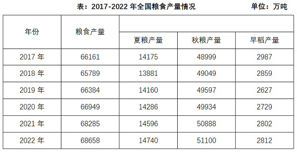
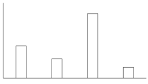

# 2024年山西省县级纪委监委公务员录用考试《行测》题（网友回忆版）

> 资料分析 · 15 题 · 山西 2024

## 材料 1

        2024年1-4月份，A省全省规模以上工业原煤产量4.25亿吨，位居全国首位，同比增长3.5%，增速较一季度加快0.6个百分点，其中，4月份产量1.01亿吨，同比增长5.6%。

        1-4月份，A省东陵市原煤产量2.9亿吨，同比增长3.6%，拉动全省原煤产量增长2.4个百分点；西陵市原煤产量4703.9万吨，同比增长7.4%，较一季度加快1.7个百分点，拉动全省原煤产量增长0.8个百分点。

        1-4月份，全省规模以上工业发电量2582.0亿千瓦时，位居全国首位，同比增长12.2%。其中，4月份发电量605.0亿千瓦时，同比增长7.1%。

        1-4月份，规模以上工业新能源发电量609.0亿千瓦时，同比增长16.1%，占全省全部发电量比重较上年末提高3.5个百分点。其中，风力发电量524.1亿千瓦时，同比增长14.5%；太阳能发电量79.1亿千瓦时，增长29.6%。

### 第 1 题　qid 17097803 · 综合

2023年一季度，A省规模以上工业原煤产量约为（    ）亿吨。

- **A**. 4.05
- **B**. 3.46
- **C**. 3.24
- **D**. 3.15　✅

**答案**：D

**官方解析**

根据题干“2023年一季度······约为（    ）亿吨”，结合材料时间为2024年1-4月和4月，可判定本题为基期和差问题。定位文字材料第一段可得：2024年1-4月份，A省全省规模以上工业原煤产量4.25亿吨，同比增长3.5%，其中，4月份产量1.01亿吨，同比增长5.6%。根据公式：基期量，则所求亿吨，与D项最接近。

故正确答案为D。

---

### 第 2 题　qid 17097806 · 综合

2024年1-4月，东陵市月均原煤产量约为（    ）亿吨。

- **A**. 0.705
- **B**. 0.725　✅
- **C**. 7.05
- **D**. 7.25

**答案**：B

**官方解析**

根据题干“2024年1-4月······月均······约为（    ）亿吨”，结合材料时间为2024年1-4月，可判定本题为现期平均数问题。定位文字材料第二段可得：2024年1-4月份，A省东陵市原煤产量2.9亿吨。根据公式：月均产量，则所求亿吨。

故正确答案为B。

---

### 第 3 题　qid 17097809 · 比重

2023年1-4月，规模以上工业新能源发电量占全省规模以上工业发电量的比重约为：

- **A**. 24.5%
- **B**. 23.9%
- **C**. 23.6%
- **D**. 22.8%　✅

**答案**：D

**官方解析**

根据题干“2023年1-4月······占······的比重约为”，结合材料时间为2024年1-4月，可判定本题为基期比重问题。定位文字材料第三、第四段可得：2024年1-4月份，全省规模以上工业发电量2582.0亿千瓦时（B），同比增长12.2%（b）；1-4月份，规模以上工业新能源发电量609.0亿千瓦时（A），同比增长16.1%（a）。根据公式：基期比重，则所求，只有D项符合。

故正确答案为D。

---

### 第 4 题　qid 17097812 · 综合

2023年1-4月，风力发电量和太阳能发电量相差约为（    ）亿千瓦时。

- **A**. 445
- **B**. 397　✅
- **C**. 355
- **D**. 317

**答案**：B

**官方解析**

根据题干“2023年1-4月······和······相差约为（    ）亿千瓦时”，结合材料时间为2024年1-4月，可判定本题为基期和差问题。定位文字材料第四段可得：2024年1-4月份，风力发电量524.1亿千瓦时，同比增长14.5%；太阳能发电量79.1亿千瓦时，增长29.6%。根据公式：基期量，则所求亿千瓦时，与B项最接近。

故正确答案为B。

---

### 第 5 题　qid 17097816 · 综合

根据A省2024年前4个月的资料，无法推出：

- **A**. 原煤产量增速加快
- **B**. 东陵市原煤产量同比增幅超过3%
- **C**. 规模以上工业主要能源产品生产保持稳定增长
- **D**. 规模以上工业太阳能发电量同比增加了29.6亿千瓦时　✅

**答案**：D

**官方解析**

A项：定位文字材料第一段可得：2024年1-4月份，A省全省规模以上工业原煤产量4.25亿吨，位居全国首位，同比增长3.5%，增速较一季度加快0.6个百分点。可推断原煤产量增速加快，正确；

B项：定位文字材料第二段可得：2024年1-4月份，A省东陵市原煤产量2.9亿吨，同比增长3.6%。即2024年1-4月东陵市原煤产量同比增幅超过3%，正确；

C项：定位文字材料第一、三段可得：2024年1-4月份，A省全省规模以上工业原煤产量4.25亿吨，位居全国首位，同比增长3.5%；1-4月份，全省规模以上工业发电量2582.0亿千瓦时，位居全国首位，同比增长12.2%。可推断2024年1-4月规模以上工业主要能源产品生产保持稳定增长，正确；

D项：定位文字材料第四段可得：2024年1-4月份，规模以上工业太阳能发电量79.1亿千瓦时，增长29.6%。根据公式：增长量，则2024年1-4月规模以上工业太阳能发电量同比增加亿千瓦时，错误。

本题为选非题，故正确答案为D。

备注：1.本道题目题干表述不明确，采取优中选优的方式选择，D项必错，在考场上其余选项不确定是否必错的情况下可做跳过处理。

2.对于本题A项“原煤产量增速加快”，虽然没有说是和去年相比还是一季度相比较，但结合D项表述为明显错误，判定A项表述正确。同理对于本题C项，规模以上工业主要能源产品包括原煤、原油、天然气、电力等，虽然材料中仅给出了原煤及发电量的数据及增速，而未给出其他规模以上主要能源产品的情况，但结合D项表述为明显错误，判定C项表述正确。

---

## 材料 2

### 第 6 题　qid 17097811 · 增长

2020-2022年，全国每年粮食产量的同比增速：

- **A**. 持续上升
- **B**. 持续下降
- **C**. 先升后降　✅
- **D**. 先降后升

**答案**：C

**官方解析**

根据题干“2020-2022年······同比增速”，可判定本题为一般增长率问题。定位统计表可得：2019-2022年全国粮食产量分别为66384万吨、66949万吨、68285万吨、68658万吨。根据公式：增长率，则2020-2022年全国粮食产量的同比增速分别为：

2020年，；

2021年，；

2022年，。

综上所述，2020-2022年，全国每年粮食产量的同比增速先升后降。

故正确答案为C。

---

### 第 7 题　qid 17097813 · 比重

2022年全国秋粮产量占全国粮食产量的比重较2019年：

- **A**. 上升了2个百分点以上
- **B**. 下降了2个百分点以上
- **C**. 上升了不到2个百分点
- **D**. 下降了不到2个百分点　✅

**答案**：D

**官方解析**

根据题干“2022年······占······比重较2019年”，结合选项为上升了/下降了+百分点，可判定本题为两期比重问题。定位统计表可得：2019年全国粮食产量及秋粮产量分别为66384万吨、49597万吨；2022年全国粮食产量及秋粮产量分别为68658万吨、51100万吨。根据公式：比重，则所求比重差，即约下降了0.3个百分点，在D项范围内。

故正确答案为D。

---

### 第 8 题　qid 17097815 · 增长

以下年份中，全国早稻产量同比增速最快的年份是：

- **A**. 2018年
- **B**. 2019年
- **C**. 2021年　✅
- **D**. 2022年

**答案**：C

**官方解析**

根据题干“······同比增速最快的年份是”，可判定本题为一般增长率问题。定位统计表可得：2017-2022年全国早稻产量分别为2987万吨、2859万吨、2627万吨、2729万吨、2802万吨、2812万吨。根据公式：增长率，则下列年份的全国早稻产量同比增速分别为：

2018年，；

2019年，；

2021年，；

2022年，。

综上所述，以上年份中，全国早稻产量同比增速最快的年份是2021年。

故正确答案为C。

---

### 第 9 题　qid 17097818 · 比重

2018年，全国夏粮产量占全国粮食产量的比重较早稻高：

- **A**. 不到15个百分点
- **B**. 15-20个百分点之间　✅
- **C**. 20-25个百分点之间
- **D**. 超过25个百分点

**答案**：B

**官方解析**

根据题干“2018年······占······比重较早稻高”，结合材料时间给出2018年，可判定本题为现期比重问题。定位统计表可知：2018年，全国粮食产量为65789万吨，夏粮产量为13881万吨，早稻产量为2859万吨。根据公式：比重，可得2018年全国夏粮产量占全国粮食产量的比重较早稻高，在B项范围内。

故正确答案为B。

---

### 第 10 题　qid 17097822 · 增长

以下柱状图中，最能准确反映2018-2021年全国夏粮产量同比增量变化趋势的是（横轴位置代表增量为0）：

- **A**. 

- **B**. 

- **C**. 

　✅
- **D**. 

**答案**：C

**官方解析**

根据题干“······反映2018-2021年······同比增量变化趋势的是······”，可判定本题为增长量比较问题。定位统计表可知：2017-2021年，全国夏粮产量分别为14175万吨、13881万吨、14160万吨、14286万吨、14596万吨。根据公式：增长量=现期量-基期量，可得2018年同比增长量=13881-14175=-294万吨，2019年同比增长量=14160-13881=279万吨，2020年同比增长量=14286-14160=126万吨，2021年同比增长量=14596-14286=310万吨。可知2018年同比增长量为负数，且2020年同比增长量小于2019年和2021年，只有C项符合。
故正确答案为C。

---

## 材料 3

        2023年S省全省生产总值为82553亿元，比上年约增长6.0%。分产业看，第一、二、三产业增加值分别为2332亿元、33953亿元和46268亿元，分别增长4.2%、5.0%和6.7%，三次产业增加值比约为2.8：41.1：56.1。

        2023年年末全省常住人口6627万人，比上年末增加50万人。其中，男性人口3459万人，女性人口3168万人。全年出生人口38.3万人，出生率为；死亡人口44.0万人，死亡率为；自然增长率为。城镇化率为74.2%。

### 第 11 题　qid 19797282 · 综合

2019-2023年，S省年均生产总值约为（    ）亿元。

- **A**. 73361.2
- **B**. 73367.2
- **C**. 72367.2
- **D**. 72361.2　✅

**答案**：D

**官方解析**

根据题干“2019-2023年······年均生产总值······亿元”，结合材料时间为2013-2023年，可判定本题为现期平均数问题。定位统计图可得：2019-2023年，S省全省生产总值分别为：62462亿元、64689亿元、74041亿元、78061亿元、82553亿元。则所求平均数为亿元。

故正确答案为D。

---

### 第 12 题　qid 19797283 · 综合

2013-2023年，S省生产总值：

- **A**. 增加了45218亿元　✅
- **B**. 最大年增速为8.3%
- **C**. 增长了6.0%
- **D**. 在2022年呈现出较大下降

**答案**：A

**官方解析**

A项：定位统计图可得，2013年、2023年，S省生产总值分别为37335亿元、82553亿元。根据公式：增长量=现期量-基期量，则2023年S省生产总值较2013年增长82553-37335=45218亿元，正确；

B项：定位统计图可得，2013-2023年，S省生产总值同比增速最大的年份为2021年（8.7%），错误；

C项：定位统计图可得，2013年、2023年，S省生产总值分别为37335亿元、82553亿元。根据公式：增长率，则2023年S省生产总值较2013年增长，错误；

D项：定位统计图可得，2022年，S省生产总值同比增速为3.2%，较上年增长，错误。

故正确答案为A。

---

### 第 13 题　qid 19797284 · 平均数

按年末常住人口计算，2022年S省人均地区生产总值最接近：

- **A**. 125123元
- **B**. 125043元
- **C**. 124571元
- **D**. 118687元　✅

**答案**：D

**官方解析**

根据题干“······2022年S省人均······”，结合材料时间为2023年，可判定本题为基期平均数问题。定位文字材料第二段可得：2023年年末全省常住人口6627万人，比上年末增加50万人；定位统计图可得：2022年S省全省生产总值为78061亿元。根据“人均地区生产总值”，可得所求元，与D项最接近。

故正确答案为D。

---

### 第 14 题　qid 19797285 · 比重

2023年第二产业增加值占S省全省生产总值比重约为：

- **A**. 35%
- **B**. 37%
- **C**. 41%　✅
- **D**. 48%

**答案**：C

**官方解析**

定位文字材料第一段可得：2023年······第一、二、三产业增加值比约为2.8：41.1：56.1。则2023年第二产业增加值占S省全省生产总值比重，与C项最接近。

故正确答案为C。

---

### 第 15 题　qid 19797286 · 综合

根据S省的资料，不能推出：

- **A**. 2023年，男女两性常住人口占比相差超过6个百分点　✅
- **B**. 2023年，全年出生人口占新增常住人口的比重超过70%
- **C**. 2013-2023年，S省生产总值最大年增速差值约为5.5个百分点
- **D**. 2013-2023年，S省生产总值比上年增加值最多的年份是2021年

**答案**：A

**官方解析**

A项：定位文字材料第二段可得，2023年年末全省常住人口6627万人。其中，男性人口3459万人，女性人口3168万人。根据公式：比重，则所求，未超过6个百分点，错误；

B项：定位文字材料第二段可得，2023年年末全省常住人口······比上年末增加50万人。全年出生人口38.3万人。根据公式：比重，则所求比重，正确；

C项：定位统计图可得，2013-2023年，S省生产总值年增速最大为8.7%（2021年），最小为3.2%（2022年）。则所求=8.7%-3.2%=5.5%，即最大年增速差值约为5.5个百分点，正确；

D项：定位统计图可得，2013-2023年，S省生产总值以及2013年S省生产总值比上年增速。根据公式：增长量。则2013-2023年，S省生产总值比上年增加值分别为：

2013年，亿元；

2014年，亿元；

2015年，亿元；

2016年，亿元；

2017年，亿元；

2018年，亿元；

2019年，亿元；

2020年，亿元；

2021年，亿元；

2022年，亿元；

2023年，亿元。

比较可知，比上年增加值最多的年份是2021年，正确。

本题为选非题，故正确答案为A。

---
