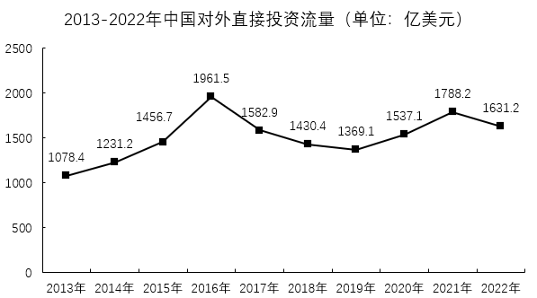
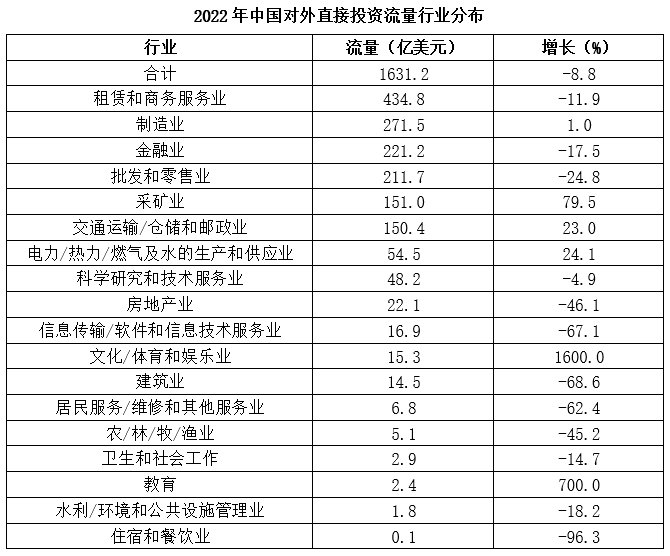
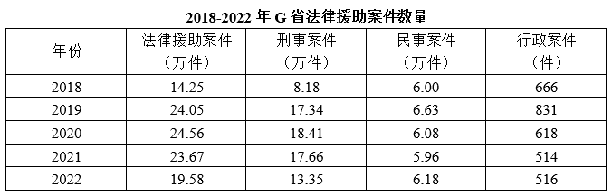
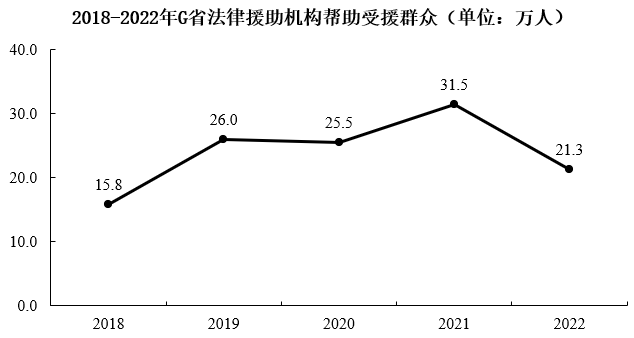
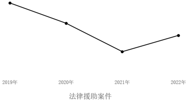
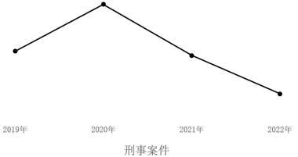
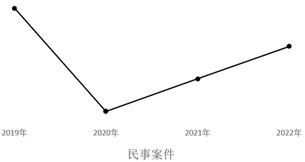
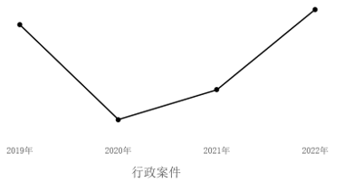
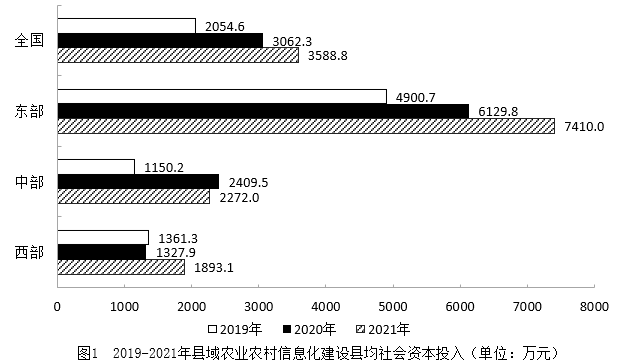
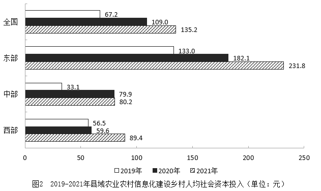

# 2024年广东省公务员录用考试《行测》题（网友回忆版）

> 资料分析 · 20 题 · 广东 2024

## 材料 1

        党的二十大报告强调，教育、科技、人才是全面建设社会主义现代化国家的基础性、战略性支撑。近年来，广东紧紧围绕制造业当家、聚焦高质量发展，大力实施制造业当家技能人才支撑工程，加快建设一支规模宏大的知识型、技能型、创新型技能人才队伍。2023年，全省技能人才总量达1934万人，其中高技能人才657万人。

        为推动广东技工与广东制造共同成长，近年来，广东紧紧围绕壮大20个战略性产业集群，紧密对接产业升级和技术变革趋势，开展新产业工人职业技能提升工程，培育掌握新技术的产业新工匠。广东充分发挥经济大省、制造业大省的优势，将产教融合、校企合作融入技能人才培养全过程，打造了全国最大的技工教育体系。

        2023年，广东共有技工院校148所，实现21个地级以上市技师学院全覆盖；在校生65万人，占全国的七分之一；面向先进制造业、战略性新兴产业、现代服务业建设233个省级重点专业和50个特色专业；与100多家世界500强企业及国内800多家大型企业开展深度合作，实现教学与企业岗位无缝对接，精准培养产业急需人才。技工院校招生人数、教研成果、技能竞赛、就业率等九项主要指标均居全国第一。

        2022年世界技能大赛，广东共有11位选手代表国家参赛，获7金、1银、1铜和2个优胜奖，金牌数占全国三分之一，金牌数及奖牌数连续4届位居全国第一，展现了广东技能人才的精湛技能和职业风采。

### 第 1 题　qid 16593267 · 综合

2023年广东高技能人才是全省技能人才总量的（    ）。

- **A**. 12%
- **B**. 23%
- **C**. 34%　✅
- **D**. 45%

**答案**：C

**官方解析**

根据题干“2023年······是······总量的”，结合选项为百分数，可判定本题为现期比重问题。定位文字材料第一段可知“2023年，全省技能人才总量达1934万人，其中高技能人才657万人”。根据公式：比重，可得所求比重为，只有C项符合。

故正确答案为C。

---

### 第 2 题　qid 16593269 · 综合

2023年，全国技工院校在校生人数（    ）。

- **A**. 小于400万
- **B**. 在400万到500万之间　✅
- **C**. 在500万到600万之间
- **D**. 大于600万

**答案**：B

**官方解析**

根据题干“2023年，全国······”，结合材料时间为2023年，且材料给出广东省数据和所占比重，可判定本题为现期比重问题。定位文字材料第三段可得：2023年广东技工院校在校生65万，占全国的七分之一。根据公式：整体，可得2023年全国技工院校在校生人数万，在B项范围内。

故正确答案为B。

---

### 第 3 题　qid 16593272 · 综合

关于广东技能人才培养，以下表述不准确的是（    ）。

- **A**. 注重产教融合、校企合作
- **B**. 实现教学与企业岗位无缝对接
- **C**. 精准培养产业急需人才
- **D**. 强调提升全体学生技能竞赛成绩　✅

**答案**：D

**官方解析**

A项：定位文字材料第二段可得：广东充分发挥经济大省、制造业大省的优势，将产教融合、校企合作融入技能人才培养全过程，打造了全国最大的技工教育体系。说明广东技能人才培养“注重产教融合、校企合作”，正确；
B、C两项：定位文字材料第三段可得：2023年，广东与100多家世界500强企业及国内800多家大型企业开展深度合作，实现教学与企业岗位无缝对接，精准培养产业急需人才。说明广东技能人才培养“实现教学与企业岗位无缝对接”，“精准培养产业急需人才”，均正确；
D项：材料仅在第三段给出：技工院校招生人数、教研成果、技能竞赛、就业率等九项主要指标均居全国第一。无法推出广东技能人才培养“强调提升全体学生技能竞赛成绩”，错误。
本题为选非题，故正确答案为D。

---

### 第 4 题　qid 16593273 · 综合

以下不属于广东建设省级重点专业和特色专业所面向产业的是（    ）。

- **A**. 传统手工业　✅
- **B**. 先进制造业
- **C**. 战略性新兴产业
- **D**. 现代服务业

**答案**：A

**官方解析**

定位文字材料第三段可得“2023年，广东面向先进制造业、战略性新兴产业、现代服务业建设233个省级重点专业和50个特色专业”，属于广东建设省级重点专业和特色专业所面向产业的有先进制造业（B项）、战略性新兴产业（C项）和现代服务业（D项）。
本题为选非题，故正确答案为A。

---

### 第 5 题　qid 16593274 · 综合

关于广东技工，以下说法有误的是（    ）。

- **A**. 2023年，广东有全国最大的技工教育体系
- **B**. 2023年，广东技工院校教研成果居全国第一
- **C**. 2023年，广东技工院校与233家世界500强企业开展合作　✅
- **D**. 2022年世界技能大赛，广东金牌数位居全国第一

**答案**：C

**官方解析**

A项：定位文字材料第二段可得，近年来，广东打造了全国最大的技工教育体系，正确；
B项：定位文字材料第三段可得，2023年，广东技工院校招生人数、教研成果、技能竞赛、就业率等九项主要指标均居全国第一，正确；
C项：定位文字材料第三段可得，2023年，广东技工院校与100多个世界500强企业开展深度合作，并非233家，错误；
D项：定位文字材料第四段可得，2022年世界技能大赛，广东金牌数及奖牌数连续4届位居全国第一，正确。
本题为选非题，故正确答案为C。

---

## 材料 2

        2022年，全球对外直接投资流量1.5万亿美元，比上年下降14%。其中发达经济体对外直接投资1.03万亿美元，比上年下降17.2%；发展中经济体对外直接投资4589亿美元，比上年下降5.4%。

        2022年，中国对外直接投资流量1631.2亿美元，与上年历史次高值相比，下降8.8%，占全球份额的10.9%。

        2022年，中国对外直接投资涵盖了国民经济的18个行业大类，其中流向租赁和商务服务、制造、金融、批发和零售、采矿、交通运输/仓储和邮政业的投资均超过百亿美元，租赁和商务服务业保持首位，制造业由上年第三位上升至第二位。

### 第 6 题　qid 10204443 · 增长

2013-2022年，中国对外直接投资流量年均增加约（    ）亿美元。

- **A**. 55.3
- **B**. 61.4　✅
- **C**. 67.5
- **D**. 73.6

**答案**：B

**官方解析**

根据题干“2013-2022年······年均增加约······”，可判定本题为年均增长量问题。定位统计图可知2013和2022年中国对外直接投资流量分别为1078.4亿美元、1631.2亿美元。根据公式：年均增长量，则所求。

故正确答案为B。

---

### 第 7 题　qid 10204445 · 比重

与2021年相比，2022年中国对外直接投资流量在全球中的占比（    ）。

- **A**. 增加了不到3个百分点　✅
- **B**. 增加了超过3个百分点
- **C**. 减少了不到3个百分点
- **D**. 减少了超过3个百分点

**答案**：A

**官方解析**

根据题干“与2021年相比，2022年······在······的占比”，结合选项为“增加/减少+百分点”，可判定本题为两期比重问题。定位文字材料第一、二段可得：2022年，全球对外直接投资流量1.5万亿美元（B），比上年下降14%（b）；中国对外直接投资流量1631.2亿美元（A），下降8.8%（a），占全球份额的10.9%（）。根据公式：两期比重，则题目所求为，即增加了不到3个百分点。

故正确答案为A。

---

### 第 8 题　qid 10204446 · 增长

2022年，中国国民经济的18个行业大类中有（    ）个行业的对外直接投资流量同比有所增加。

- **A**. 4
- **B**. 5
- **C**. 6　✅
- **D**. 7

**答案**：C

**官方解析**

定位统计表可得，2022年中国对外直接投资流量18个行业的同比增长率。对外直接投资流量同比有所增加，即同比增长率大于0%的行业有：制造业（1.0%）、采矿业（79.5%）、交通运输/仓储和邮政业（23.0%）、电力/热力/燃气及水的生产和供应业（24.1%）、文化/体育和娱乐业（1600.0%）、教育（700.0%），共6个。
故正确答案为C。

---

### 第 9 题　qid 10204447 · 综合

2021年，中国下列行业的对外直接投资流量，从大到小排序正确的是（    ）。

- **A**. 金融业>租赁和商务服务业>批发和零售业>制造业
- **B**. 金融业>租赁和商务服务业>制造业>批发和零售业
- **C**. 租赁和商务服务业>制造业>批发和零售业>金融业
- **D**. 租赁和商务服务业>批发和零售业>制造业>金融业　✅

**答案**：D

**官方解析**

根据题干“2021年······从大到小排序正确的是”，结合材料时间为2022年，可判定本题为基期比较问题。定位统计表可得2022年中国租赁和商务服务业、制造业、金融业、批发和零售业对外直接投资流量及增长率。根据公式：基期量，则2021年这四个行业对外直接投资流量分别为：

租赁和商务服务业：亿美元；

制造业：亿美元；

金融业：亿美元；

批发和零售业：亿美元。

对比可得，四个行业中，租赁和商务服务业对外直接投资流量最大，排除A、B两项；其次为批发和零售业，排除C项。

故正确答案为D。

---

### 第 10 题　qid 10204448 · 综合

根据资料，下列说法正确的是（    ）。

- **A**. 截至2022年，中国对外直接投资流量最高的年份是2016年　✅
- **B**. 2022年，发展中经济体对外直接投资流量在全球的占比同比有所下降
- **C**. 2018-2022年，中国对外直接投资流量累计超过了8000亿美元
- **D**. 2021年，科学研究和技术服务业在中国对外直接投资流量中的占比超过4%

**答案**：A

**官方解析**

A项：定位文字材料第二段可得：2022年中国对外直接投资流量1631.2亿美元，与上年历史次高值相比，下降8.8%。则2021年中国对外直接投资流量为次高，即第二大。观察统计图可知2016年（1961.5亿美元）高于2021年（1788.2亿美元），即截至2022年，中国对外直接投资流量最高的年份是2016年，正确；

B项：定位文字材料第一段可得：2022年，全球对外直接投资流量比上年下降14%（b），其中发展中经济体对外直接投资比上年下降5.4%（a）。根据两期比重比较结论：当部分增长率（a）&gt;整体增长率（b）时，比重上升。由于-5.4%&gt;-14%，则2022年，发展中经济体对外直接投资流量在全球的占比同比上升，错误；

C项：定位统计图可得：2018-2022年中国对外直接投资流量分别为1430.4亿美元、1369.1亿美元、1537.1亿美元、1788.2亿美元、1631.2亿美元。则2018-2022年，中国对外直接投资流量累计为1430.4+1369.1+1537.1+1788.2+1631.2&lt;1500+1400+1600+1800+1700=8000亿美元，错误；

D项：定位统计图可得：2021年中国对外直接投资流量为1788.2亿美元；定位统计表可得：2022年科学研究和技术服务业对外直接投资流量为48.2亿美元，同比下降4.9%。根据公式：基期量，可知2021年科学研究和技术服务业对外直接投资流量为亿美元。根据公式：比重，可知2021年，科学研究和技术服务业在中国对外直接投资流量中的占比为，错误。

故正确答案为A。

---

## 材料 3

        自2022年1月1日《中华人民共和国法律援助法》施行以来，我国法律援助覆盖面不断扩大、服务水平显著提升。据统计，2022年全国法律援助机构共组织办理法律援助案件137万余件，值班律师提供法律帮助95万余件，为1980万余人次提供法律咨询，提供法律咨询人次同比增加约5%。

        2022年，G省法律援助机构共组织办理法律援助案件（以下简称G省法律援助案件）195779件，较2021年减少40937件，同比下降17.29%，其中刑事案件133509件（含值班律师法律帮助案件65647件），民事案件61754件，行政案件516件。帮助受援群众212993人。

### 第 11 题　qid 10204437 · 综合

2022年，G省法律援助案件数量约占全国的（    ）。

- **A**. 9.2%
- **B**. 14.3%　✅
- **C**. 19.4%
- **D**. 24.5%

**答案**：B

**官方解析**

根据题干“2022年，······占······”，结合材料时间为2022年，可判定本题为现期比重问题。定位文字材料第一、二段可得：2022年，全国法律援助案件数量为137万余件，G省法律援助案件数量为195779件。根据公式：比重，则2022年G省法律援助案件数量约占全国的，与B项最接近。

故正确答案为B。

---

### 第 12 题　qid 10204438 · 平均数

2022年，G省平均每件法律援助案件帮助受援群众（    ）。

- **A**. 小于1.1人　✅
- **B**. 在1.1到1.2人之间
- **C**. 在1.2到1.3人之间
- **D**. 大于1.3人

**答案**：A

**官方解析**

根据题干“2022年······平均每······”，结合材料时间为2022年，可判定本题为现期平均数问题。定位文字材料第二段可得∶2022年，G省法律援助机构共组织办理法律援助案件（以下简称G省法律援助案件）195779件，帮助受援群众212993人。根据平均每件法律援助案件帮助受援群众人数，则题干所求人，在A项范围内。

故正确答案为A。

---

### 第 13 题　qid 10204439 · 比重

2018-2022年，行政案件在G省法律援助案件中占比最高的年份是（    ）。

- **A**. 2018年　✅
- **B**. 2019年
- **C**. 2020年
- **D**. 2021年

**答案**：A

**官方解析**

根据题干“2018-2022年······占比最高······”，且材料中包含2018-2022年相关数据，可判定本题为现期比重问题。定位统计表可得，2018-2021年G省行政案件分别为666件、831件、618件、514件，法律援助案件分别为14.25万件、24.05万件、24.56万件、23.67万件。根据公式：比重，则2018-2021年，行政案件在G省法律援助案件中占比分别为、、、，观察发现2018年分子比2020、2021年大，分母比2020、2021年小，故2018年占比大于2020、2021年，排除C、D两项。比较2018、2019年占比可得：2018年，，2019年，，故2018年行政案件在G省法律援助案件中占比最高。

故正确答案为A。

注：由于本题选项只有2018-2021年，故无需考虑2022年。

---

### 第 14 题　qid 10204440 · 增长

下列选项最有可能准确反映了2018-2022年间G省法律援助机构办理的相关案件的同比增长率的是（    ）。

- **A**. 

- **B**. 

- **C**. 

　✅
- **D**. 

**答案**：C

**官方解析**

根据题干“下列选项最有可能准确反映了······2018-2022年间······同比增长率的是”，可判定本题为一般增长率问题。定位统计表可得：2018-2022年G省法律援助案件数量。根据公式：增长率，则2019-2022年，G省法律援助机构办理的相关案件的同比增长率分别为：

A项：2019年为，2020年为，2021年为，2022年为。其中2022年的同比增长率最小，应处在最低点，排除；

B项：2019年为，2020年为，2021年为，2022年为。其中2019年的同比增长率最大，应处在最高点，排除；

C项：2019年为，2020年为，2021年为，2022年为。其中2019年的同比增长率最大，2020年的同比增长率最小，且2019-2022年的同比增长率的变化趋势为先下降再上升，当选；

D项：2019年为，2020年为，2021年为，2022年为。其中2019年的同比增长率最大，应处在最高点，排除。

故正确答案为C。

---

### 第 15 题　qid 10204441 · 综合

根据资料，下列说法正确的是（    ）。

- **A**. 2021年，全国法律援助机构提供法律咨询超1900万人次
- **B**. 2022年，值班律师法律帮助案件在G省法律援助刑事案件中的占比超50%
- **C**. 2022年，全国法律援助机构值班律师提供法律帮助超100万件
- **D**. 2018-2022年，G省法律援助机构累计帮助受援群众超110万人　✅

**答案**：D

**官方解析**

A项：定位文字材料第一段可得：2022年全国法律援助机构为1980万余人次提供法律咨询，提供法律咨询人次同比增加约5%。根据公式：基期量，则2021年全国法律援助机构提供法律咨询为万人次，未超过1900万人次，错误；

B项：定位文字材料第二段可得：2022年，G省法律援助机构共组织办理刑事案件133509件（含值班律师法律帮助案件65647件）。根据公式：比重，则2022年值班律师法律帮助案件在G省法律援助刑事案件中的占比为，错误；

C项：定位文字材料第一段可得：2022年全国法律援助机构共组织办理法律援助案件137万余件，值班律师提供法律帮助95万余件。则2022年全国法律援助机构值班律师提供法律帮助未超过100万件，错误；

D项：定位折线图可得：2018-2022年，G省法律援助机构帮助受援群众分别为15.8万人、26.0万人、25.5万人、31.5万人、21.3万人。则2018-2022年G省法律援助机构累计帮助受援群众=15.8+26.0+25.5+31.5+21.3=120.1&gt;110万人，正确。

故正确答案为D。

---

## 材料 4

        2021年，各地区各部门全面落实党中央、国务院关于实现数字乡村发展战略的决策部署，积极引入社会资本投资建数字乡村。2021年全国用于县域农业农村信息化建设的社会资本投入为954.6亿元，县均社会资本投入3588.8万元、乡村人均社会资本投入135.2元，分别比上年增长17.2%和24.0%。分区域看，东部地区社会资本投入562.4亿元，占全国社会资本投入58.9%；中部地区社会资本投入193.8亿元；西部地区社会资本投入198.4亿元。

### 第 16 题　qid 10204449 · 综合

2019-2021年，全国县域农业农村信息化建设县均社会资本投入的年均增率约为（    ）。

- **A**. 10%
- **B**. 21%
- **C**. 32%　✅
- **D**. 43%

**答案**：C

**官方解析**

根据题干“2019-2021年，······年均增率约为”，可判定本题为年均增长率问题。定位图1可得：2019年全国县域工业农村信息化建设县均社会资本投入为2054.6万元，2021年为3588.8万元。根据公式：，则，解得。

故正确答案为C。

---

### 第 17 题　qid 10204450 · 综合

2020年，全国用于县域农业农村信息化建设的社会资本投入（    ）（假设2020年县的数量与2021年相同）。

- **A**. 不到800亿元
- **B**. 在800亿元到850亿元之间　✅
- **C**. 在850亿元到900亿元之间
- **D**. 超过900亿元

**答案**：B

**官方解析**

根据题干“2020年······社会资本投入······”，结合材料给出2021年县域农业农村信息化建设的社会资本投入和2021年与2020年县均社会资本投入，可判定本题为现期平均数问题。定位文字材料可得：2021年全国用于县域农业农村信息化建设的社会资本投入为954.6亿元；县均社会资本投入3588.8万元，比上年增长17.2%。定位图1可得：2020年全国县域农业农村信息化建设县均社会资本投入为3062.3万元。根据题干可知：2020年县的数量与2021年相同，结合公式：总数=份数×平均数，则所求2020年全国用于县域农业农村信息化建设的社会资本投入=2020年县的数量×2020年县均社会资本投入=2021年县的数量×2020年县均社会资本投入。

方法一：根据公式：份数，2021年县的数量。则所求亿元，在B项范围内。

方法二：根据公式：基期量，2020年县均社会资本投入。则所求亿元，在B项范围内。

故正确答案为B。

---

### 第 18 题　qid 10204451 · 综合

2021年，东部地区县域农业农村信息化建设社会资本投入约是中、西部地区之和的（    ）倍。

- **A**. 1.43　✅
- **B**. 1.64
- **C**. 1.80
- **D**. 1.95

**答案**：A

**官方解析**

根据“2021年······是······倍”，可判定本题为现期倍数问题。定位文字材料第一段可得：（2021年）分区域看，东部地区社会资本投入562.4亿元，占全国社会资本投入的58.9%；中部地区社会资本投入193.8亿元；西部地区社会资本投入198.4亿元。

方法一：根据公式：倍数，则所求倍，只有A项符合。

方法二：根据公式：部分=整体×比重，且全国社会资本投入=东部+中部+西部，则所求倍数倍，只有A项符合。

故正确答案为A。

---

### 第 19 题　qid 10204452 · 增长

2021年，关于县域农业农村信息化建设，下列数据同比增长率最大的是（    ）。

- **A**. 东部地区县均社会资本投入
- **B**. 东部地区乡村人均社会资本投入
- **C**. 西部地区县均社会资本投入
- **D**. 西部地区乡村人均社会资本投入　✅

**答案**：D

**官方解析**

根据题干“2021年······同比增长率最大的是”，可判定本题为一般增长率问题。定位图1可得2020、2021年东部、西部地区的县均社会资本投入。定位图2可得2020、2021年东部、西部地区的乡村人均社会资本投入。根据公式：增长率，则各选项2021年同比增长率分别为：

东部地区县均社会资本投入；

东部地区乡村人均社会资本投入；

西部地区县均社会资本投入；

西部地区乡村人均社会资本投入。

综上，同比增长率最大的是2021年西部地区乡村人均社会资本投入。

故正确答案为D。

---

### 第 20 题　qid 10204453 · 综合

根据资料，关于县域农业农村信息化建设，以下说法正确的是（    ）。

- **A**. 2019年，西部地区乡村人均社会资本投入低于中部地区
- **B**. 2020年，东部地区县均社会资本投入同比增量高于中部地区
- **C**. 2019~2021年，东部地区乡村人均社会资本投入年均增长率高于中部和西部地区
- **D**. 2019~2021年，中部地区县均社会资本投入增速高于全国县均社会资本投入增速　✅

**答案**：D

**官方解析**

A项：定位图二可得，2019年西部地区乡村人均社会资本投入为56.5元，中部地区乡村人均社会资本投入为33.1元。西部地区高于中部地区，错误。

B项：定位图一可得东部地区和中部地区2020年和2019年的县均社会资本投入，根据公式：增长量=现期量-基期量，可得：2020年东部地区县均社会资本投入同比增量为6129.8-4900.7=1229.1万元；2020年中部地区县均社会资本投入同比增量为2409.5-1150.2=1259.3万元。东部地区同比增量低于中部地区同比增量，错误。

C项：定位图二可得2019年-2021年东部、中部和西部地区的乡村人均社会资本投入。根据年均增长率公式：，因比较的都为2019-2021年，年份差n相同，故仅比较的大小即可。则各地区分别为：东部地区；中部地区：；西部地区。东部地区年均增长率低于中部地区年均增长率，错误。

D项：定位图一可得2019年-2021年全国和中部地区的县均社会资本投入。根据公式：增长率，可知2019年-2021年县均社会资本投入增速分别为：中部地区；全国，中部地区增速高于全国增速，正确。

故正确答案为D。

---
