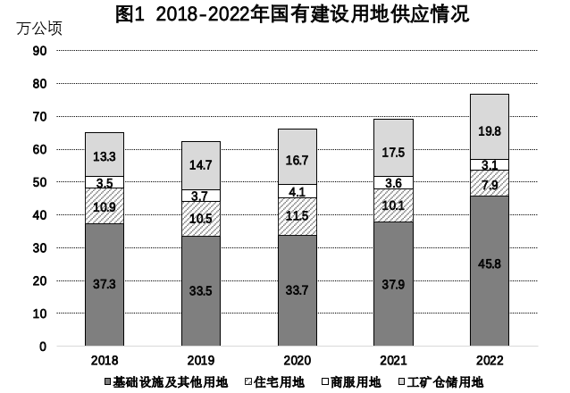
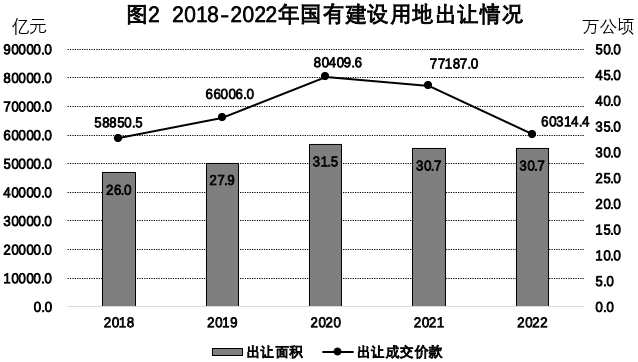
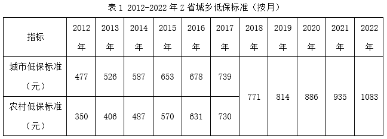
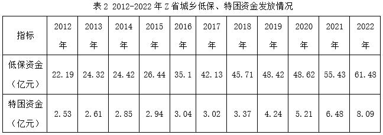
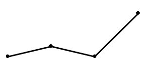
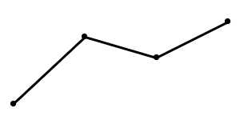
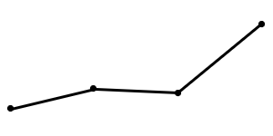
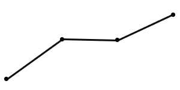

# 2024年度浙江省党政机关选调应届优秀大学毕业生《行测》题（网友回忆版）

> 资料分析 · 10 题 · 浙江 2024

## 材料 1

        2022年，全年国有建设用地供应76.6万公顷，同比增长10.9%。其中，工矿仓储用地、商服用地、住宅用地、基础设施及其他用地供应面积分别为19.8万公顷、3.1万公顷、7.9万公顷和45.8万公顷，占土地供应总量的比重分别为25.9%、4.0%、10.3%、59.8%。全年出让国有建设用地30.7万公顷，与去年基本持平；出让成交价款约为6.0万亿元，同比下降21.9%。

### 第 1 题　qid 18385420 · 增长

2022年，国有建设用地供应中，供应面积同比增长最快的是：

- **A**. 基础设施及其他用地　✅
- **B**. 住宅用地
- **C**. 商服用地
- **D**. 工矿仓储用地

**答案**：A

**官方解析**

根据题干“2022年······同比增长最快的是”，可判定本题为一般增长率问题。定位图1可得：2021年基础设施及其他用地、住宅用地、商服用地和工矿仓储用地供应面积分别为37.9万公顷、10.1万公顷、3.6万公顷、17.5万公顷，2022年分别为45.8万公顷、7.9万公顷、3.1万公顷、19.8万公顷。其中2022年住宅用地和商服用地供应面积均较2021年减少，同比增长率为负数，排除B、C两项。根据公式：增长率，则基础设施及其他用地同比增长率；工矿仓储用地同比增长率，故2022年国有建设用地供应中，供应面积同比增长最快的是基础设施及其他用地。

故正确答案为A。

---

### 第 2 题　qid 18385424 · 综合

2019-2022年，国有建设用地出让均价最高的是哪一年？

- **A**. 2019
- **B**. 2020　✅
- **C**. 2021
- **D**. 2022

**答案**：B

**官方解析**

根据题干“2019-2022年······均价最高的是哪一年”，结合材料时间为2018-2022年，可判定本题为现期平均数问题。定位图2可得：2019-2022年，国有建设用地出让成交价款分别为66006.0亿元、80409.6亿元、77187.0亿元、60314.4亿元；出让面积分别为27.9万公顷、31.5万公顷、30.7万公顷、30.7万公顷。其中2022年与2021年相比，出让面积相同，但出让成交价款小于2021年，故出让均价小于2021年，排除D项。根据公式：现期平均数，可得：2019年出让均价亿元/万公顷、2020年出让均价亿元/万公顷、2021年出让均价亿元/万公顷，故2020年的出让均价最高。

故正确答案为B。

---

### 第 3 题　qid 18385427 · 比重

2018-2022年，国有建设用地出让面积占国有建设用地供应面积的比重最高的年份其占比在以下哪个区间？

- **A**. 40%以下
- **B**. 40%-45%
- **C**. 45%-50%　✅
- **D**. 50%以上

**答案**：C

**官方解析**

根据题干“2018-2022年······占比在以下哪个区间”，结合材料时间为2018-2022年，可判定本题为现期比重问题。定位图1可得2018-2022年国有建设用地供应面积；定位图2可得：2018-2022年国有建设用地出让面积分别为26.0万公顷、27.9万公顷、31.5万公顷、30.7万公顷、30.7万公顷。根据公式：比重，且结合柱状图可知，2018年与2019年相比，国有建设用地供应面积较大，国有建设用地出让面积较小，故2018年所占比重小于2019年，排除2018年；同理可排除2021年与2022年，故只需比较2019年与2020年即可。2019年所占比重；2020年所占比重，可知2020年所占比重较高，在C项范围内。

故正确答案为C。

---

### 第 4 题　qid 18385431 · 增长

下列折线图中，能准确反映2019-2022年住宅用地供应面积增速的是：

- **A**. 

- **B**. 

- **C**. 

- **D**. 

　✅

**答案**：D

**官方解析**

根据题干“······2019-2022年······增速的是”，可判定本题为一般增长率问题。定位图1可得：2018-2022年住宅用地供应面积分别为10.9万公顷、10.5万公顷、11.5万公顷、10.1万公顷、7.9万公顷。根据公式：增长率，可得2019-2022年住宅用地供应面积增速分别为：

2019年，；

2020年，；

2021年，；

2022年，。

综上可知，2019-2022年住宅用地供应面积增速中，只有2020年增速为正，即在折线图中2020年所对应的点最高，排除A、C两项；且2021年与2020年增速相差个百分点，2022年与2021年增速相差个百分点，2020年与2021年高度差约为2021与2022年高度差的2倍，只有D项满足。

故正确答案为D。

---

### 第 5 题　qid 18385434 · 综合

能够从上述资料中推出的是：

- **A**. 2018-2022年，国有建设用地供应量逐年上升
- **B**. 2018-2022年，住宅用地出让面积占供应面积的比重高于其他类别
- **C**. 2019-2022年，国有建设用地供应中，各类用地供应面积均有升有降
- **D**. 2018-2022年，国有建设用地供应中，商服用地供应总面积超过17.5万公顷　✅

**答案**：D

**官方解析**

A项：定位图1可得，2019年国有建设用地供应量少于2018年，并非逐年上升，错误；
B项：材料中并未给出住宅用地出让面积的相关数据，故无法得出2018-2022年住宅用地出让面积占供应面积的比重，错误；
C项：定位图1可得，2018-2022年，工矿仓储用地供应面积分别为13.3万公顷、14.7万公顷、16.7万公顷、17.5万公顷、19.8万公顷，即2019-2022年工矿仓储用地供应面积逐年增加，并非有升有降，错误；
D项：定位图1可得，2018-2022年，商服用地供应面积分别为3.5万公顷、3.7万公顷、4.1万公顷、3.6万公顷、3.1万公顷，则2018-2022年商服用地供应总面积为3.5+3.7+4.1+3.6+3.1=18万公顷&gt;17.5万公顷，正确。
故正确答案为D。

---

## 材料 2

        截止2022年底，Z省人均城乡低保标准全部达到12996元/年，各个地市低保年标准全部达到12420元以上，并实现市城同标，全省特困供养标准第一年实现城乡统筹，人均年标准达到21072元。全年开展临时救助9.06万人次。全省累计发放最低生活保障资金61.48亿元，特困资金8.09亿元，临时救助资金2.56亿元。

### 第 6 题　qid 14355345 · 增长

2013~2022年，Z省城市低保标准每月增幅超过50元的年份有几个？

- **A**. 3
- **B**. 4
- **C**. 5　✅
- **D**. 6

**答案**：C

**官方解析**

根据题干“2013~2022年······增幅超过50元的年份有几个”，可判定本题为增长量计算问题。定位表1可知2012~2022年Z省城市低保标准（按月）数据，根据公式：增长量=现期量-基期量，则2013~2022年Z省城市低保标准每月增长量分别为：
2013年，526-477=49元&lt;50元；
2014年，587-526=61元&gt;50元；
2015年，653-587=66元&gt;50元；
2016年，678-653=25元&lt;50元；
2017年，739-678=61元&gt;50元；
2018年，771-739=32元&lt;50元；
2019年，814-771=43元&lt;50元；
2020年，886-814=72元&gt;50元；
2021年，935-886=49元&lt;50元；
2022年，1083-935=148元&gt;50元。
综上，Z省城市低保标准每月增幅超过50元的年份有2014、2015、2017、2020、2022年，共计5个。
故正确答案为C。
注：本题题干不够严谨，增幅指增长率，但本题要求增幅超过50元，故只能按增长量计算。

---

### 第 7 题　qid 14355346 · 增长

2022年Z省特困资金发放额比2015年增长了约（    ）。

- **A**. 233%
- **B**. 175%　✅
- **C**. 157%
- **D**. 82%

**答案**：B

**官方解析**

根据题干“2022年······增长了约”，结合选项为百分数，可判定本题为一般增长率问题。定位表2可得：2015年和2022年Z省特困资金发放额分别为2.94亿元和8.09亿元。根据公式：增长率，则2022年Z省特困资金发放额比2015年增长了，与B项最接近。

故正确答案为B。

---

### 第 8 题　qid 14355347 · 综合

下列折线图中，能准确反映Z省2015-2018年特困资金发放金额变化的是（    ）。

- **A**. 

- **B**. 

- **C**. 

　✅
- **D**. 

**答案**：C

**官方解析**

定位表2可得：Z省2015-2018年特困资金发放金额分别为2.94亿元、3.04亿元、3.02亿元、3.37亿元。观察发现，从2015年（2.94亿元）到2016年（3.04亿元）缓慢上升，从2016年（3.04亿元）到2017年（3.02亿元）略微下降、基本持平，从2017年（3.02亿元）到2018年（3.37亿元）迅速上升，则能准确反映此变化趋势的为C项。
故正确答案为C。

---

### 第 9 题　qid 14355348 · 综合

2022年，Z省特困对象与低保对象人数之比约为（    ）。

- **A**. 1：6
- **B**. 1：8
- **C**. 1：10
- **D**. 1：12　✅

**答案**：D

**官方解析**

根据题干“2022年······与······之比约为”，可判定本题为比值计算问题。定位文字材料可得：截止2022年底，Z省人均城乡低保标准全部达到12996元/年，全省特困供养人均年标准达到21072元。全省累计发放最低生活保障资金61.48亿元，特困资金8.09亿元。根据公式：人数，则2022年Z省低保对象人数：特困对象人数，即特困对象人数：低保对象人数。

故正确答案为D。

---

### 第 10 题　qid 14355349 · 综合

不能从上述资料中推出的是（    ）。

- **A**. 2016年，Z省低保资金发放金额同比涨幅大于特困资金
- **B**. 2013-2017年，Z省农村低保标准同比增幅均大于城市
- **C**. 2022年，Z省临时救助资金发放金额每人次约为2800元
- **D**. 2013-2022年，Z省农村低保标准同比增长最快的是2017年　✅

**答案**：D

**官方解析**

A项：定位表2可得，2015年、2016年Z省低保资金发放金额分别为26.44亿元、35.1亿元，特困资金发放金额分别为2.94亿元、3.04亿元。根据公式：，则2016年Z省低保资金发放金额同比增长率，特困资金发放金额同比增长率，前者大于后者，正确；

B项：定位表1可得2012-2017年Z省城市和农村低保标准。根据公式：，则2013-2017年，Z省农村低保标准同比增长率、城市低保标准同比增长率分别为：

2013年，农村低保标准同比增长率，城市低保标准同比增长率，前者分子大分母小，则农村&gt;城市，满足；

2014年，农村低保标准同比增长率，城市低保标准同比增长率，前者分子大分母小，则农村&gt;城市，满足；

2015年，农村低保标准同比增长率，城市低保标准同比增长率，前者分子大分母小，则农村&gt;城市，满足；

2016年，农村低保标准同比增长率，城市低保标准同比增长率，前者分子大分母小，则农村&gt;城市，满足；

2017年，农村低保标准同比增长率，城市低保标准同比增长率，前者分子大分母小，则农村&gt;城市，满足。综上，2013-2017年，Z省农村低保标准同比增幅均大于城市，正确；

C项：定位文字材料可得，2022年Z省开展临时救助9.06万人次，累计发放临时救助资金2.56亿元。则2022年Z省临时救助资金每人次发放金额元，正确；

D项：定位表1可得2012-2022年Z省农村低保标准。根据公式：，可得2017年农村低保标准同比增长率，2013年农村低保标准同比增长率，即2017年同比增长率&lt;2013年同比增长率，则2013-2022年，Z省农村低保标准同比增长最快的不是2017年，错误。

本题为选非题，故正确答案为D。

---
