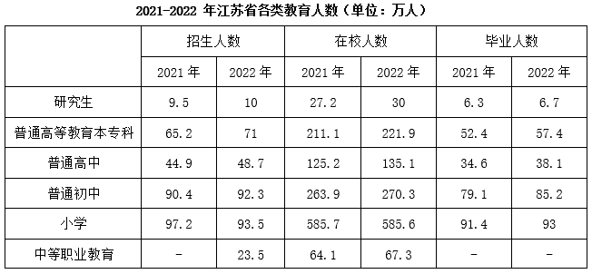
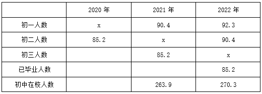

# 2024年江苏名校优生选调素质测试（网友回忆版）

> 资料分析 · 8 题 · 选调 2024

## 材料 1

        数据显示，2023年1-7月，中国光伏产品出口额达320亿美元，同比增长约6%，再创历史新高。受东南亚、欧美、拉美等地区对光伏装机量需求加大，企业海外布局进程加快，N型电池供不应求以及国际能源署对全球光伏装机量预期的大幅上调等因素的影响，2023年全年中国光伏产品出口额有望接近600亿美元，同比增长20%左右。

        今年以来，中国硅片出口额实现稳定增长。数据显示，1-7月，中国光伏硅片出口额达到30.74亿美元，同比增长15.04%。从出口市场来看，中国硅片出口市场主要集中在东南亚国家。其中，越南位列中国硅片出口市场的第一位，1-7月，中国硅片出口越南的金额为7.81亿美元，同比增长16.15%；泰国位列中国硅片出口市场的第二位，1-7月，中国硅片出口泰国的金额为7.80亿美元，同比增长79.25%；马来西亚位列中国硅片出口市场的第三位，1-7月，中国硅片出口马来西亚的金额为7亿美元，同比下降1.97%。

        中国电池片出口保持增长。数据显示，1-7月，中国电池片出口额为27.26亿美元，同比增长35.42%，出口量为22.65GW，同比增长80.86%。目前，土耳其、印度和柬埔寨成为中国电池片的前三大出口市场。数据显示，1-7月，中国电池片对土耳其出口额为9.04亿美元，同比增长107.74%；对印度出口额为5.81亿美元，同比增长40.13%；对柬埔寨出口额为4.22亿美元，同比增长132.99%。

        中国光伏组件出口增速减缓。数据显示，1-7月，中国光伏组件出口额为261.2亿美元，同比增长2.1%；出口量为123GW，同比增长30.4%。荷兰、巴西、西班牙成为中国光伏组件的前三大出口市场。数据显示，1-7月，中国光伏组件对荷兰出口额为72.13亿美元，同比上涨5.08%；对巴西出口额为22.80亿美元，同比下降22.15%；对西班牙出口额为15.39亿美元，同比下降18.18%。

        中国逆变器出口额保持高速增长。数据显示，1-7月，中国逆变器出口额为69.17亿美元，同比增长71.51%。荷兰、德国、南非成为中国逆变器的前三大出口市场。数据显示，1-7月，中国逆变器对荷兰出口额为22.78亿美元，同比增长126.98%；对德国出口额为6.86亿美元，同比增长181.06%；对南非出口额为4.5亿美元，同比增长453.22%。

### 第 1 题　qid 19591643 · 综合

2022年1-7月，中国对荷兰逆变器出口额为：

- **A**. 22.78
- **B**. 17.94
- **C**. 10.04　✅
- **D**. 40.33

**答案**：C

**官方解析**

根据题干“2022年1-7月······出口额为”，结合材料时间为2023年1-7月，可判定本题为基期计算问题。定位文字材料第五段可得：2023年1-7月，中国逆变器对荷兰出口额为22.78亿美元，同比增长126.98%。根据公式：基期量，则2022年1-7月中国对荷兰逆变器出口额亿美元，只有C项符合。

故正确答案为C。

---

### 第 2 题　qid 19591644 · 倍数

2022年1-7月，光伏组件出口量是光伏电池片的几倍?

- **A**. 5.43
- **B**. 3.91
- **C**. 9.58
- **D**. 7.52　✅

**答案**：D

**官方解析**

根据题干“2022年1-7月······是······的几倍”，结合材料时间为2023年1-7月，可判定本题为基期倍数问题。定位文字材料第三、四段可知：2023年1-7月，中国电池片出口量为22.65GW（B），同比增长80.86%（b）；中国光伏组件出口量为123GW（A），同比增长30.4%（a）。根据公式：基期倍数，则所求倍数为，与D项最接近。

故正确答案为D。

---

### 第 3 题　qid 19591645 · 综合

2023年1-7月，中国光伏产品出口额最高的国家是：

- **A**. 越南
- **B**. 巴西
- **C**. 德国
- **D**. 荷兰　✅

**答案**：D

**官方解析**

定位文字材料第一段可得，2023年1-7月，中国光伏产品出口额达320亿美元。通过第二至五段数据分析，硅片、电池片、光伏组件三类产品1-7月的出口额=30.74+27.26+261.2=319.2亿美元，故可推知此处光伏产品应包括硅片、电池片、光伏组件三类产品。

定位文字材料第二段可得，2023年1-7月，越南、泰国、马来西亚是是中国硅片的前三大出口市场，其中对越南出口7.81亿美元，对泰国出口7.80亿美元，对马来西亚出口7亿美元；定位文字材料第三段可得，土耳其、印度、柬埔寨是中国电池片的前三大出口市场，其中对土耳其出口9.04亿美元，对印度出口5.81亿美元，对柬埔寨出口额4.22亿美元；定位文字材料第四段可得，荷兰、巴西、西班牙是中国光伏组件的前三大出口市场，其中对荷兰出口72.13亿美元，对巴西出口22.80亿美元，对西班牙出口15.39亿美元。故2023年1-7月，中国光伏产品对越南、巴西、德国、荷兰的出口情况分析如下：

越南：亿美元；

巴西：亿美元；

德国：亿美元；

荷兰：中国光伏组件对荷兰的出口额为72.13亿美元，则中国光伏产品对其出口额亿美元。

综上可得，2023年1-7月，中国光伏产品出口额最高的国家是荷兰。

故正确答案为D。

---

### 第 4 题　qid 19591646 · 增长

2023年1-7月，中国光伏组件平均出口价格同比下降约：（单位：万美元/GW）

- **A**. 5886　✅
- **B**. 271.2
- **C**. 212.4
- **D**. 1022.2

**答案**：A

**官方解析**

根据题干“2023年1-7月······平均出口价格同比下降约：（单位：万美元/GW）”，可判定本题为平均数的增长量问题。定位文字材料第四段可得：2023年1-7月，中国光伏组件出口额为261.2亿美元（A），同比增长2.1%（a）；出口量为123GW（B），同比增长30.4%（b）。根据公式：平均数的增长量，则题干所求为万美元/GW，即同比下降约6067万美元/GW，与A项最接近。

故正确答案为A。

---

## 材料 2

        2022年我省教育事业稳步推进。年末全省共有普通高等学校168所（含独立学院）。普通高等教育本专科招生数71.0万人，在校生数221.9万人，毕业生数57.4万人；研究生招生数10.0万人，在校生数30.0万人，毕业生数6.7万人。中等职业教育（不含技工学校）招生数23.5万人，在校生数67.3万人。全省共有幼儿园8143所，比上年增加27所；在园幼儿237.1万人，比上年减少15.4万人。

### 第 5 题　qid 19591658 · 增长

2022年江苏省各阶段教育学生情况增速最快的是：

- **A**. 本专科招生数
- **B**. 研究生在校生数　✅
- **C**. 本专科毕业生数
- **D**. 普通高中毕业生数

**答案**：B

**官方解析**

根据题干“······增速最快的是”，可判定本题为一般增长率问题。定位统计表可知2021-2022年江苏省本专科招生人数、研究生在校人数、本专科毕业人数、普通高中毕业人数。根据公式：增长率，可得：2022年江苏省本专科招生数的增长率，研究生在校生数的增长率，本专科毕业生数的增长率，普通高中毕业生数的增长率。比较可知，2022年江苏省各阶段教育学生情况增速最快的是研究生在校生数。

故正确答案为B。

---

### 第 6 题　qid 19591659 · 综合

2020年初中教育招生数为x（单位：万人），则x的取值在哪个范围？

- **A**. 

　✅
- **B**. 

- **C**. 

- **D**. 

**答案**：A

**官方解析**

由于9月至次年7月为一个完整学年，所以招生时间在学年初（9月），毕业时间在学年末（7月），且根据文字材料“年末全省共有普通高等学校168所”，可以判断材料中的数据均为年末数据。定位表格材料可知，2021-2022年江苏省初中招生人数分别为90.4万人、92.3万人，2021-2022年江苏省初中在校人数分别为263.9万人、270.3万人，2022年江苏省初中毕业人数为85.2万人。

如下表所示，若2020年初中教育招生数为x万人（此时为初一新生），则2021年这批学生上初二，2022年上初三；2021年初中招生人数为90.4万人（此时为初一新生），则2022年这批学生上初二；2022年初中招生人数为92.3万人（此时为初一新生）。同理，2022年初中毕业人数为85.2万人，逆推可得：则2021年这批学生上初三，2020年这批学生上初二。

由于初中在校人数=初一人数+初二人数+初三人数，则2021年初中在校人数=90.4+x+85.2=263.9，解得x=88.3；2022年初中在校人数=92.3+90.4+x=270.3，解得x=87.6。综上，x的取值范围应该为，在A项范围内。

故正确答案为A。

备注：如果不考虑转学等情况，根据2022年初中在校人数解得x=87.6，正确答案的取值范围一定包含87.6，只有A项符合，在考场上直接选择A项即可，不必考虑其他条件。若根据2021年初中在校人数解得x=88.3，则说明结果应该为，结合选项，只能选择A项。实际情况中，可能会有转学等情况出现，如果转入和转出的学生数量不同，则结果可能会比该范围更大或更小，此时则没有正确答案。

---

### 第 7 题　qid 19591660 · 比重

2022年江苏省研究生非正常离校占在校生比例为：

- **A**. 1.3%
- **B**. 1.5%
- **C**. 1.7%　✅
- **D**. 1.9%

**答案**：C

**官方解析**

根据题干“2022年······占······”，结合材料时间为2022年，可判定本题为现期比重问题。定位统计表可得：2021年江苏省研究生在校人数为27.2万人，2022年在校人数为30万人，招生人数为10万人，毕业人数为6.7万人。根据2022年在校人数=2021年在校人数+2022年招生人数-2022年实际离校人数，可得2022年实际离校人数=2021年在校人数+2022年招生人数-2022年在校人数，则2022年实际离校人数为27.2+10-30=7.2万人。由于实际离校人数=毕业人数+非正常离校人数，可得非正常离校人数=实际离校人数-毕业人数，则2022年江苏省研究生非正常离校人数为7.2-6.7=0.5万人。根据公式：比重，则所求为。

故正确答案为C。

---

### 第 8 题　qid 19591661 · 平均数

2021年，我省平均每所幼儿园的在园幼儿数约为：

- **A**. 311人　✅
- **B**. 334人
- **C**. 291人
- **D**. 273人

**答案**：A

**官方解析**

根据题干“2021年······平均每所······”，结合材料时间为2022年，可判定本题为基期平均数问题。定位文字材料可得：2022年全省共有幼儿园8143所，比上年增加27所；在园幼儿237.1万人，比上年减少15.4万人。根据公式：基期量=现期量-增长量，可得2021年全省幼儿园数量为8143-27=8116所，在园幼儿人数为237.1+15.4=252.5万人，根据公式：平均每所幼儿园的在园幼儿数，则所求为人。

故正确答案为A。

---
