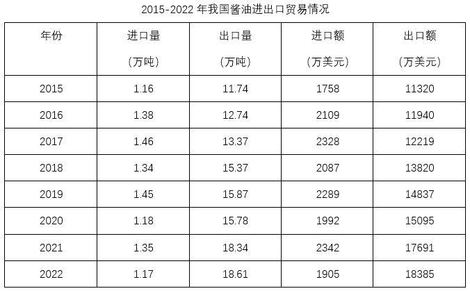
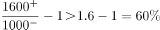
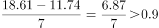
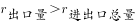
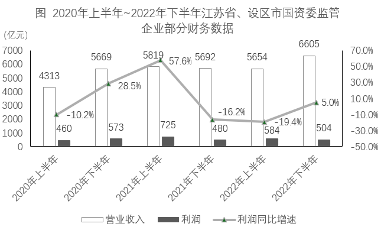
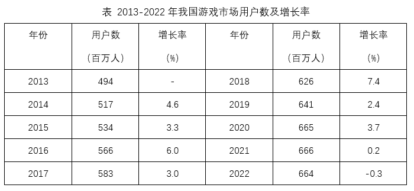
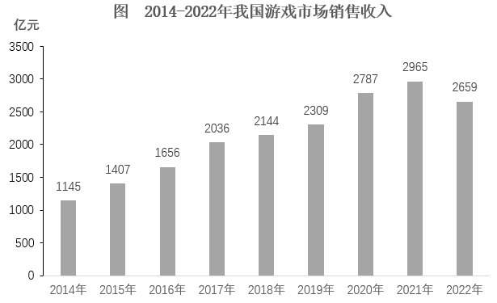

# 2024年江苏省公务员录用考试《行测》题（B类）（网友回忆版）

> 资料分析 · 20 题 · 江苏 2024

## 材料 1

        2023年第二季度末，全国跨省联网定点医疗机构54.3万家。其中，住院费用跨省联网定点医疗机构7.4万家，环比增长10.2%；普通门诊费用跨省联网定点医疗机构15.1万家，环比增长28.9%；门诊慢特病相关治疗费用跨省联网定点医疗机构3.9万家，环比增长75.9%；跨省联网定点零售药店27.9万家，环比增长12.8%。

        2023年第二季度，全国跨省联网异地就医费用直接结算2854.1万人次，减少个人垫付394.1亿元，环比分别增长46.0%和32.6%。其中，住院费用跨省联网直接结算282.6万人次，减少个人垫付354.3亿元，环比分别增长32.9%和31.8%；门诊费用跨省联网直接结算2571.6万人次，减少个人垫付39.8亿元，环比分别增长47.6%和40.1%。

        2023年第二季度，全国门诊费用跨省联网直接结算中，普通门诊费用跨省联网直接结算1886.7万人次，减少个人垫付26.5亿元，环比分别增长49.6%和36.8%。门诊慢特病相关治疗费用跨省联网直接结算59.7万人次，减少个人垫付5.5亿元，环比分别增长89.5%和97.9%。跨省联网定点零售药店直接结算625.2万人次，减少个人垫付7.8亿元，环比分别增长39.0%和24.6%。通过国家统一线上备案渠道成功办理备案177.0万人次，环比增长3.5%。

### 第 1 题　qid 5919124 · 增长

2023年第二季度末，全国跨省联网定点零售药店环比增加：

- **A**. 3.2万家　✅
- **B**. 3.4万家
- **C**. 3.6万家
- **D**. 3.8万家

**答案**：A

**官方解析**

根据题干“2023年第二季度末······环比增加”，结合选项带单位，可判定本题为增长量计算问题。定位文字资料第一段可知，2023年第二季度末全国跨省联网定点零售药店为27.9万家，环比增长12.8%。根据公式：增长量，则2023年第二季度末全国跨省联网定点零售药店环比增长量为万家，与A项最接近。

故正确答案为A。

---

### 第 2 题　qid 5919125 · 平均数

2023年第二季度，全国住院费用跨省联网直接结算人均减少个人垫付：

- **A**. 1.15万元
- **B**. 1.20万元
- **C**. 1.25万元　✅
- **D**. 1.30万元

**答案**：C

**官方解析**

根据题干“2023年第二季度······人均减少个人垫付”，结合资料时间为2023年第二季度，可判定本题为现期平均数问题。定位文字资料第二段可知，2023年第二季度全国住院费用跨省联网直接结算282.6万人次，减少个人垫付354.3亿元。则题干所求万元。

故正确答案为C。

---

### 第 3 题　qid 5919126 · 比重

2023年第二季度，全国跨省联网异地就医费用直接结算人次占上半年的比重为：

- **A**. 57.1%
- **B**. 59.3%　✅
- **C**. 60.4%
- **D**. 61.2%

**答案**：B

**官方解析**

根据题干“2023年第二季度······占······的比重为”，结合资料时间为2023年第二季度，可判定本题为现期比重问题。定位文字资料第二段可知，2023年第二季度全国跨省联网异地就医费用直接结算2854.1万人次，环比增长46.0%。已知上半年=第一季度+第二季度，根据公式：基期量、比重，则2023年第二季度全国跨省联网异地就医费用直接结算人次占上半年的比重为。

故正确答案为B。

---

### 第 4 题　qid 5919129 · 平均数

2023年第二季度，全国跨省联网异地就医费用直接结算减少个人垫付人均金额环比有所增加的是：

- **A**. 门诊费用跨省联网直接结算
- **B**. 普通门诊费用跨省联网直接结算
- **C**. 跨省联网定点零售药店直接结算
- **D**. 门诊慢特病相关治疗费用跨省联网直接结算　✅

**答案**：D

**官方解析**

根据题干“2023年第二季度······人均金额环比有所增加的是”，可判定本题为两期平均数比较问题。已知直接结算减少个人垫付人均金额。定位文字资料第二段和第三段可知2023年第二季度全国门诊费用跨省联网、普通门诊费用跨省联网、门诊慢特病相关治疗费用跨省联网以及跨省联网定点零售药店直接结算人次数与减少个人垫付总金额的环比增速。根据两期平均数比较结论“当分子的增长率大于分母的增长率时，平均数上升”。比较可知：门诊费用跨省联网直接结算，40.1%&lt;47.6%；普通门诊费用跨省联网直接结算，36.8%&lt;49.6%；跨省联网定点零售药店直接结算，24.6%&lt;39.0%；门诊慢特病相关治疗费用跨省联网直接结算，97.9%&gt;89.5%。则2023年第二季度，只有门诊慢特病相关治疗费用跨省联网直接结算减少个人垫付人均金额环比有所增加，对应D项。

故正确答案为D。

---

### 第 5 题　qid 5919131 · 综合

能够从上述资料中推出的是：

- **A**. 2023年第二季度末，全国住院费用跨省联网定点医疗机构同比增加0.6万家
- **B**. 2023年第二季度，全国门诊费用跨省联网直接结算的人次比住院费用跨省联网直接结算的人次多8.1倍　✅
- **C**. 2023年第二季度，通过国家统一线上备案渠道成功办理备案的患者都享受了全国跨省联网异地就医费用直接结算的服务
- **D**. 2023年第二季度末，全国门诊慢特病相关治疗费用跨省联网定点医疗机构数的环比增量不少于普通门诊费用跨省联网定点医疗机构数的环比增量

**答案**：B

**官方解析**

A项：定位文字资料第一段可知，2023年第二季度末全国住院费用跨省联网定点医疗机构7.4万家，环比增长10.2%。但材料中没有给出同比相关数据，无法推出，错误；

B项：定位文字资料第二段可知，2023年第二季度全国住院费用跨省联网直接结算282.6万人次，门诊费用跨省联网直接结算2571.6万人次。则2023年第二季度全国门诊费用跨省联网直接结算的人次比住院费用跨省联网直接结算的人次多倍，正确；

C项：定位文字资料第二段可知，2023年第二季度全国跨省联网异地就医费用直接结算2854.1万人次；定位文字资料第三段可知，2023年第二季度通过国家统一线上备案渠道成功办理备案177.0万人次。材料中没有涉及两者关系的相关叙述，无法推出，错误；

D项：定位文字资料第一段可知，2023年第二季度末全国普通门诊费用跨省联网定点医疗机构15.1万家，环比增长28.9%；门诊慢特病相关治疗费用跨省联网定点医疗机构3.9万家，环比增长75.9%。根据公式：增长量，则2023年第二季度末，全国普通门诊费用跨省联网定点医疗机构数的环比增长量万家，全国门诊慢特病相关治疗费用跨省联网定点医疗机构数的环比增长量万家&lt;3.5万家，错误。

故正确答案为B。

---

## 材料 2

### 第 6 题　qid 15121341 · 综合

2022年我国酱油进口量与“十三五”时期（2016-2020年）的年均进口量相差：

- **A**. 0.19万吨　✅
- **B**. 0.21万吨
- **C**. 0.23万吨
- **D**. 0.25万吨

**答案**：A

**官方解析**

根据题干“······‘十三五’时期（2016-2020年）的年均进口量······”，可判定本题为现期平均数问题。定位表格可知2016-2020年、2022年我国酱油进口量。根据公式：平均数，则“十三五”时期（2016-2020年）的年均进口量万吨，故2022年我国酱油进口量与“十三五”时期（2016-2020年）的年均进口量相差1.36-1.17=0.19万吨。

故正确答案为A。

---

### 第 7 题　qid 15121354 · 增长

2016-2022年我国酱油进出口总额比上年减少的年份是：

- **A**. 2016年
- **B**. 2018年
- **C**. 2020年　✅
- **D**. 2022年

**答案**：C

**官方解析**

根据题干“2016-2022年······比上年减少的年份是”，可判定本题为增长量计算问题。定位表格可知2015-2022年我国酱油进口额与出口额。根据公式：增长量=现期量-基期量，选项中2016年、2018年、2020年、2022年进出口总额同比增量分别为：

2016年，（2109+11940）-（1758+11320）&gt;0，不符合题意；

2018年，，不符合题意；

2020年，，符合题意；

2022年，，不符合题意。

故正确答案为C。

---

### 第 8 题　qid 15121362 · 增长

2016-2022年我国酱油进口量、出口量、进口额、出口额4个指标中年均增速最快的是：

- **A**. 进口量
- **B**. 出口量
- **C**. 进口额
- **D**. 出口额　✅

**答案**：D

**官方解析**

根据题干“2016-2022年······年均增速最快的是”，可判定本题为年均增长率问题。定位表格可知2015年、2022年我国酱油进口量、出口量、进口额、出口额。根据公式：，年份差相同时，比较即可。进口量，；出口量，；进口额，；出口额，。比较可知，2016-2022年我国酱油出口额年均增速最快。

故正确答案为D。

---

### 第 9 题　qid 15121371 · 比重

2022年我国酱油进口额占进出口总额的比重是：

- **A**. 8.2%
- **B**. 9.4%　✅
- **C**. 10.1%
- **D**. 10.7%

**答案**：B

**官方解析**

根据题干“2022年······占······的比重是”，结合材料给出2022年的数据，可判定本题为现期比重问题。定位表格可得：2022年我国酱油进口额为1905万美元，出口额为18385万美元。根据公式：比重，则2022年我国酱油进口额占进出口总额的比重是。

故正确答案为B。

---

### 第 10 题　qid 15121390 · 综合

从上述材料中不能推出的是：

- **A**. 2022年我国酱油进口均价比出口均价高50%以上
- **B**. 2016-2022年我国酱油出口量年均增加超过0.9万吨
- **C**. 2022年我国酱油出口量占进出口总量的比重比上年有所提高
- **D**. 2016-2022年我国酱油进口量和进口额均比上年增加的年份有5个　✅

**答案**：D

**官方解析**

A项：定位表格可知2022年我国酱油进、出口量及进、出口额。根据公式：均价，则2022年我国酱油进口均价为美元/吨，出口均价为美元/吨，前者比后者高，正确；

B项：定位表格可得：2015年与2022年我国酱油的出口量分别为11.74万吨和18.61万吨。根据公式：年均增长量，则2016-2022年我国酱油出口量年均增加万吨，正确；

C项：定位表格可知2021年与2022年我国酱油出口量与进口量。方法一：根据公式：比重，则2022年出口量占进出口总量的比重为，2021年的比重为，前者大于后者，即2022年我国酱油出口量占进出口总量的比重比上年有所提高，正确；

方法二：出口量+进口量=进出口总量，且2022年出口量同比增速为正（18.61＞18.34），进口量同比增速为负（1.17＜1.35），根据混合增长率口诀“混合后居中”，则。又根据两期比重比较结论“部分增长率＞整体增长率，则比重上升”，，则2022年我国酱油出口量占进出口总量的比重比上年有所提高，正确；

D项：定位表格可知2015-2022年各年我国酱油进口量和进口额。进口量和进口额均比上年增加的年份有2016年、2017年、2019年和2021年，共4个年份，错误。

本题为选非题，故正确答案为D。

---

## 材料 3

        2023年上半年，江苏省、设区市国资委监管企业实现营业收入、利润分别为6121亿元、678亿元，同比分别增长8.3%、16.1%，其中，省国资委监管企业实现营业收入、利润分别为2091亿元、306亿元，分别增长4%、30.4%。

        2023年6月末，江苏省、设区市国资委监管企业资产总额89864亿元，同比增长7.7%；资产负债率63.6%，较上年末上升0.8个百分点。其中省国资委监管企业资产总额24049亿元，增长6.7%，资产负债率64.8%，下降0.1个百分点。

### 第 11 题　qid 15121225 · 增长

2023年上半年，江苏省国资委监管企业实现营业收入约同比增加：

- **A**. 61亿元
- **B**. 80亿元　✅
- **C**. 84亿元
- **D**. 100亿元

**答案**：B

**官方解析**

根据题干“2023年上半年······同比增加”，结合选项带单位，可判定本题为增长量计算问题。定位文字材料第一段可得：2023年上半年，江苏省国资委监管企业实现营业收入2091亿元，增长4%。根据公式：增长量，则所求为亿元。

故正确答案为B。

---

### 第 12 题　qid 15121239 · 综合

2022年末，江苏省国资委监管企业的资产负债率比省、设区市国资委监管企业高：

- **A**. 1.2个百分点
- **B**. 1.8个百分点
- **C**. 2.1个百分点　✅
- **D**. 2.4个百分点

**答案**：C

**官方解析**

定位文字材料第二段可得：2023年6月末，江苏省、设区市国资委监管企业资产负债率63.6%，较上年末上升0.8个百分点。其中省国资委监管企业资产负债率64.8%，下降0.1个百分点。则2022年末，江苏省国资委监管企业的资产负债率为64.8%+0.1%=64.9%，江苏省、设区市国资委监管企业的资产负债率为63.6%-0.8%=62.8%，故所求为64.9%-62.8%=2.1%，即高2.1个百分点。
故正确答案为C。

---

### 第 13 题　qid 15121249 · 增长

2020年下半年~2023年上半年，江苏省、设区市国资委监管企业利润环比增加最多的半年是：

- **A**. 2020年下半年
- **B**. 2021年上半年
- **C**. 2022年上半年
- **D**. 2023年上半年　✅

**答案**：D

**官方解析**

根据题干“2020年下半年~2023年上半年······环比增加最多的半年是”，可判定本题为增长量比较问题。定位统计图可得：2020年上半年~2022年下半年，江苏省、设区市国资委监管企业利润分别为460亿元、573亿元、725亿元、480亿元、584亿元、504亿元；定位文字材料第一段可得：2023年上半年，江苏省、设区市国资委监管企业利润为678亿元。根据公式：增长量=现期量-基期量，可得2020年下半年的环比增量为573-460=113亿元，2021年上半年的环比增量为725-573=152亿元，2022年上半年的环比增量为584-480=104亿元，2023年上半年的环比增量为678-504=174亿元。比较可知，2023年上半年江苏省、设区市国资委监管企业利润环比增加最多。
故正确答案为D。

---

### 第 14 题　qid 15121370 · 增长

2023年6月末，江苏设区市国资委监管企业资产总额同比增速的计算式可表示为（    ）。

- **A**. 

　✅
- **B**. 

- **C**. 

- **D**. 

**答案**：A

**官方解析**

根据题干“2023年6月末······同比增速的计算式可表示为”，可判定本题为一般增长率问题。定位文字材料第二段可得：2023年6月末，江苏省、设区市国资委监管企业资产总额89864亿元，同比增长7.7%；其中省国资委监管企业资产总额24049亿元，增长6.7%。则2023年6月末，江苏设区市国资委监管企业资产总额为89864-24049=65815亿元；根据公式：基期量，可得2022年6月末，江苏设区市国资委监管企业资产总额为亿元；根据公式：增长率，可得所求增长率为。

故正确答案为A。

---

### 第 15 题　qid 15121381 · 综合

从上述材料中不能推出的是：

- **A**. 2023年上半年，江苏省国资委监管企业营业收入利润率同比有所提高
- **B**. 2023年上半年，江苏省、设区市国资委监管企业利润环比增速比上年同期快
- **C**. 2023年上半年，江苏省国资委监管企业利润占江苏省、设区市国资委监管企业利润的比重同比有所提高
- **D**. 2020年下半年~2023年上半年，江苏省、设区市国资委监管企业半年营业收入同比与环比增速具有相同的变动趋势　✅

**答案**：D

**官方解析**

A项：定位文字材料第一段可得：2023年上半年，江苏省国资委监管企业实现营业收入、利润分别增长4%、30.4%。根据公式：利润率及两期比重比较结论“若部分增长率（a）&gt;整体增长率（b），则比重上升，反之比重下降”，可知a（30.4%）&gt;b（4%），比重上升，即2023年上半年，江苏省国资委监管企业营业收入利润率同比有所提高，正确；

B项：定位文字材料第一段可得：2023年上半年，江苏省、设区市国资委监管企业利润为678亿元；定位统计图可得：2021年下半年~2022年下半年，江苏省、设区市国资委监管企业利润分别为480亿元、584亿元、504亿元。根据公式：增长率，则2023年上半年，江苏省、设区市国资委监管企业利润环比增速，2022年上半年环比增速，即2023年上半年环比增速比上年同期快，正确；

C项：定位文字材料第一段可得：2023年上半年，江苏省、设区市国资委监管企业利润同比增长16.1%，其中，省国资委监管企业利润增长30.4%。根据两期比重比较结论“若部分增长率（a）&gt;整体增长率（b），则比重上升，反之比重下降”，可知a（30.4%）&gt;b（16.1%），则比重上升，正确；

D项：定位文字材料第一段可得：2023年上半年，江苏省、设区市国资委监管企业营业收入为6121亿元；定位统计图可得2020年上半年~2022年下半年江苏省、设区市国资委监管企业营业收入。但由于材料中无2019年下半年营业收入的数据，无法计算出2020年下半年同比增速，故无法判定同比与环比增速的变化趋势是否相同，错误。

本题为选非题，故正确答案为D。

---

## 材料 4

### 第 16 题　qid 15121335 · 增长

2015-2022年我国游戏市场用户数增加最多的年份是：

- **A**. 2016年
- **B**. 2018年　✅
- **C**. 2019年
- **D**. 2020年

**答案**：B

**官方解析**

根据题干“······增加最多······”，可以判定本题为增长量比较问题。定位表格材料可得，2015-2020年我国游戏市场用户数分别为534、566、583、626、641、665百万人。根据公式：增长量=现期量-基期量，可得选项中各年份我国游戏市场用户数增长量如下：
2016年，566-534=32百万人；
2018年，626-583=43百万人；
2019年，641-626=15百万人；
2020年，665-641=24百万人。
比较可知，2018年我国游戏市场用户数增加最多。
故正确答案为B。

---

### 第 17 题　qid 15121343 · 综合

2015-2022年我国游戏市场销售收入和用户数量变动趋势相同的年份有：

- **A**. 4个
- **B**. 5个
- **C**. 7个
- **D**. 8个　✅

**答案**：D

**官方解析**

定位表格材料可得2014-2022年我国游戏市场用户数量，定位图形材料可得2014-2022年我国游戏市场销售收入。经比较可知，2015-2021年我国游戏市场销售收入和用户数量每年均递增，2022年我国游戏市场销售收入和用户数量均下降，所以2015-2022年我国游戏市场销售收入和用户数量变动趋势每年都相同，共有8个年份。
故正确答案为D。

---

### 第 18 题　qid 15121349 · 增长

2022年我国游戏市场销售收入比2014年增长：

- **A**. 1.3倍　✅
- **B**. 1.8倍
- **C**. 2.3倍
- **D**. 2.8倍

**答案**：A

**官方解析**

根据题干“2022年······比2014年增长”，结合选项为倍数，可判定本题为一般增长率问题。定位图形材料可得，2022年和2014年我国游戏市场销售收入分别为2659亿元和1145亿元。根据公式：增长率，则2022年我国游戏市场销售收入比2014年增长，即增长1.38倍，与A项最接近。

故正确答案为A。

---

### 第 19 题　qid 15121365 · 增长

若2023-2025年我国游戏市场销售收入每年按2020-2022年的年均增速增长，则2025年我国游戏市场销售收入将达到：

- **A**. 2648亿元
- **B**. 2834亿元
- **C**. 3062亿元　✅
- **D**. 3286亿元

**答案**：C

**官方解析**

根据题干“若2023-2025年······每年按2020-2022年的年均增速增长，则2025年我国游戏市场销售收入将达到”，可判定本题为现期计算问题。定位图形材料可得，2022年和2019年我国游戏市场销售收入分别为2659和2309亿元，设2020-2022年的年均增速为r，则，因此。若2023-2025年与2020-2022年保持相同的年均增速，则2025年我国游戏市场销售收入亿元，与C项最接近。

故正确答案为C。

---

### 第 20 题　qid 15121378 · 增长

2022年我国游戏市场销售收入增长率与2021年相差：

- **A**. 3.9个百分点
- **B**. 8.4个百分点
- **C**. 12.7个百分点
- **D**. 16.7个百分点　✅

**答案**：D

**官方解析**

根据题干“2022年······增长率与2021年相差”，结合选项为“百分点”，可判定本题为一般增长率问题。定位图形材料可得，2022-2020年我国游戏市场销售收入分别为2659、2965、2787亿元。根据公式：增长率，则2022年我国游戏市场销售收入增长率，2021年增长率。故2022年我国游戏市场销售收入增长率与2021年相差6.4%-（-10.2%）=16.6%，即16.6个百分点，与D项最接近。

故正确答案为D。

---
