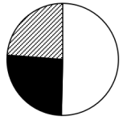
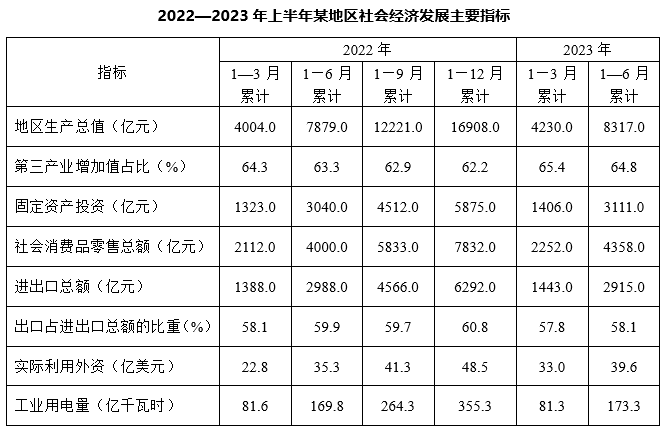

# 2024年江苏省公务员录用考试《行测》题（C类）（网友回忆版）

> 资料分析 · 20 题 · 江苏 2024

## 材料 1

        2022年，我国网络购物用户8.5亿人，使用率为79.2%；网络直播用户7.5亿人，比上年增长6.8%，占网民总数的70.3%；直播电商行业交易额为3.5万亿元，较2017年增长178倍，直播电商行业渗透率（直播电商行业渗透率）为25.3%；重点监测电商平台直播场次超1.2亿场，较2020年增长5倍；直播电商行业三大平台交易额分别为1.5万亿元、0.9万亿元和0.8万亿元。

### 第 1 题　qid 17900916 · 综合

2022年我国网络零售交易额为：

- **A**. 0.9万亿元
- **B**. 8.5万亿元
- **C**. 13.8万亿元　✅
- **D**. 15.3万亿元

**答案**：C

**官方解析**

根据题干“2022年我国网络零售交易额为”，结合资料时间为2022年及资料给出直播电商行业渗透率，可判定本题为现期比重问题。定位文字资料可知，2022年我国直播电商行业交易额为3.5万亿元，直播电商行业渗透率为25.3%。根据公式：整体，可得题干所求万亿元，与C项最接近。

故正确答案为C。

---

### 第 2 题　qid 17900920 · 综合

2022年与2021年我国直播电商行业交易额之比为：

- **A**. 5：3
- **B**. 6：5
- **C**. 7：3
- **D**. 7：4　✅

**答案**：D

**官方解析**

根据题干“2022年与2021年······之比为”，可判定本题为比值计算问题。定位文字资料可知，2022年我国直播电商行业交易额为3.5万亿元；定位表格资料可知，2021年我国直播电商行业用户数为4.3亿人，人均年消费额为4640元。则2021年我国直播电商行业交易额万亿元，故题干所求比值约为3.5：2=7：4。

故正确答案为D。

---

### 第 3 题　qid 17900939 · 增长

若2019-2022年我国直播电商行业企业数、用户数、人均年消费额的年均增速分别用、、表示。则下列关系式正确的是：

- **A**. 

- **B**. 

　✅
- **C**. 

- **D**. 

**答案**：B

**官方解析**

根据题干“······年均增速······下列关系式正确的是”，可判定本题为年均增长率问题。定位表格资料可知2018-2022年我国直播电商行业企业数、用户数及人均年消费额。根据年均增长率公式：（n为年份差），当年份差相同时，直接比较即可。则2019-2022年我国直播电商行业企业数、用户数、人均年消费额的分别为：企业数，；用户数，；人均年消费额，。则年均增速由低到高排序为。

故正确答案为B。

---

### 第 4 题　qid 17900953 · 比重

下列能够表示2022年我国直播电商行业三大平台交易额比例关系的示意图是：

- **A**. 

　✅
- **B**. 

- **C**. 

- **D**. 

**答案**：A

**官方解析**

根据题干“······2022年······比例关系的示意图是”，结合资料时间为2022年，可判定本题为现期比重问题。定位文字资料可知，2022年我国直播电商行业三大平台交易额分别为1.5万亿元、0.9万亿元和0.8万亿元。因为1.5&lt;0.9+0.8，所以1.5万亿元未占到三大平台交易额的一半，排除B、D两项；又因为1.5万亿元明显大于0.9万亿元，所以排除C项。
故正确答案为A。

---

### 第 5 题　qid 17900955 · 综合

能够从上述资料中推出的是：

- **A**. 2017年我国直播电商行业交易额超过250亿元
- **B**. 2020年我国直播电商行业直播场次超过2000万场　✅
- **C**. 2019—2022年，我国直播电商行业企业数增速逐年加快
- **D**. 2019—2022年，我国直播电商行业用户数增加最多的是2022年

**答案**：B

**官方解析**

A项：定位文字资料可知，2022年我国直播电商行业交易额为3.5万亿元，较2017年增长178倍。根据公式：基期量，可得2017年我国直播电商行业交易额亿元，未超过250亿元，错误。 

B项：定位文字资料可知，2022年我国重点监测电商平台直播场次超1.2亿场，较2020年增长5倍。根据公式：基期量，可得2020年我国重点监测电商平台直播场次超过亿场=2000万场，2020年我国直播电商行业直播场次必然多于重点监测电商平台直播场次，即超过2000万场，正确。

C项：定位表格资料可知2018—2022年我国直播电商行业企业数。根据公式：增长率，可得2021年直播电商行业企业数同比增速，2022年直播电商行业企业数同比增速，则2021年同比增速&gt;2022年同比增速，并非逐年加快，错误。

D项：定位表格资料可知2018—2022年我国直播电商行业用户数。根据公式：增长量=现期量-基期量，可得2019—2022年我国直播电商行业用户数同比增长量分别为：2019年，2.5-2.2=0.3亿人；2020年，3.7-2.5=1.2亿人；2021年，4.3-3.7=0.6亿人；2022年，4.7-4.3=0.4亿人。因此2019—2022年我国直播电商行业用户数增加最多的是2020年，错误。

故正确答案为B。

---

## 材料 2

### 第 6 题　qid 17900761 · 增长

2023年第二季度，该市工业用电量同比增加：

- **A**. 4.5亿千瓦时
- **B**. 3.8亿千瓦时　✅
- **C**. 11.7亿千瓦时
- **D**. 3.0亿千瓦时

**答案**：B

**官方解析**

根据题干“2023年第二季度，该市工业用电量同比增加”，结合选项带单位，可判定本题为增长量计算问题。定位表格资料可知，2022年1—3月该市累计工业用电量为81.6亿千瓦时，1—6月累计为169.8亿千瓦时；2023年1—3月该市累计工业用电量为81.3亿千瓦时，1—6月累计为173.3亿千瓦时。则所求增长量=2023年第二季度工业用电量-2022年第二季度工业用电量=（173.3-81.3）-（169.8-81.6）=92-88.2=3.8亿千瓦时。
故正确答案为B。

---

### 第 7 题　qid 17900762 · 综合

2022年第一季度—2023年第二季度，该市进出口总额最多的季度是：

- **A**. 2022年第二季度
- **B**. 2022年第三季度
- **C**. 2022年第四季度　✅
- **D**. 2023年第二季度

**答案**：C

**官方解析**

定位表格资料可知，该市2022年1—3月累计进出口总额为1388.0亿元，1—6月累计进出口总额为2988.0亿元，1—9月累计进出口总额为4566.0亿元，1—12月累计进出口总额为6292.0亿元；2023年1—3月累计进出口总额为1443.0亿元，1—6月累计进出口总额为2915.0亿元。则该市各季度进出口总额分别为：2022年第二季度=2988.0-1388.0=1600亿元；2022年第三季度=4566.0-2988.0=亿元；2022年第四季度=6292.0-4566.0=亿元；2023年第二季度=2915.0-1443.0=亿元。比较可得，2022年第四季度该市进出口总额最多。

故正确答案为C。

---

### 第 8 题　qid 17900763 · 增长

2023年第二季度，该市第三产业增加值是：

- **A**. 2623亿元　✅
- **B**. 2766亿元
- **C**. 3262亿元
- **D**. 4087亿元

**答案**：A

**官方解析**

根据题干“2023年第二季度，该市第三产业增加值是”，结合资料给出该市2023年1—3月、1—6月的地区生产总值和第三产业增加值占比，可判定本题为现期比重计算问题。定位表格资料可知，该市2023年1—3月、1—6月累计地区生产总值分别为4230.0亿元、8317.0亿元，第三产业增加值占比分别为65.4%、64.8%。根据公式：部分=整体×比重，可得2023年第二季度该市第三产业增加值=2023年1—6月第三产业增加值-2023年1—3月第三产业增加值=8317.0×64.8%-4230.0×65.4%&lt;8317×65%-4230×65%=（8317-4230）×65%=4087×65%&lt;4100×65%=2665亿元，只有A项符合。
故正确答案为A。

---

### 第 9 题　qid 17900764 · 增长

2023年上半年，该市地区生产总值、社会消费品零售总额、实际利用外资、工业用电量四个指标中同比增速最快的是：

- **A**. 地区生产总值
- **B**. 社会消费品零售总额
- **C**. 实际利用外资　✅
- **D**. 工业用电量

**答案**：C

**官方解析**

根据题干“2023年上半年······同比增速最快的是”，可判定本题为一般增长率问题。定位表格资料可知，2022年1—6月该市累计地区生产总值为7879.0亿元，社会消费品零售总额为4000.0亿元，实际利用外资为35.3亿美元，工业用电量为169.8亿千瓦时；2023年1—6月该市累计地区生产总值为8317.0亿元，社会消费品零售总额为4358.0亿元，实际利用外资为39.6亿美元，工业用电量为173.3亿千瓦时。根据公式：增长率，可得各选项的增速分别为：地区生产总值，；社会消费品零售总额，；实际利用外资，；工业用电量，。比较可知，2023年上半年，四个指标中实际利用外资的同比增速最快。

故正确答案为C。

---

### 第 10 题　qid 17900765 · 综合

能够从上述资料中推出的是：

- **A**. 2023年1—6月，该市进口额没有超过1100亿元
- **B**. 2023年第二季度，该市出口额环比增速高于进出口总额环比增速　✅
- **C**. 2022年第二季度—2023年第二季度，该市季度固定资产投资最大值是1705亿元
- **D**. 2022年1月—2023年6月，该市月平均社会消费品零售总额超过700亿元

**答案**：B

**官方解析**

A项：定位表格资料可知，该市2023年1—6月累计进出口总额为2915.0亿元，出口占进出口总额的比重为58.1%。根据公式：部分=整体×比重，则2023年1—6月该市进口额=2915.0×（1-58.1%）=2915×41.9%&gt;2900×40%=1160亿元，即超过了1100亿元，错误；

B项：定位表格资料可知，该市2023年1—3月累计、1—6月累计出口占进出口总额的比重分别为57.8%、58.1%。1—6月累计=第一季度（1—3月累计）+第二季度，根据混合比重结论“混合后居中”可得，第一季度出口额占比（57.8%）&lt;1—6月累计出口额占比（58.1%）&lt;第二季度出口额占比，可知第二季度出口额占比环比上升。根据两期比重比较结论“当a（部分增长率）&gt;b（整体增长率）时，比重上升”，反之，当比重上升时，a&gt;b，故2023年第二季度出口额环比增速（a）&gt;进出口总额环比增速（b），正确；

C项：定位表格资料可知该市2022—2023年上半年固定资产投资额。则2022年第二季度固定资产投资=3040.0-1323.0=1717亿元&gt;1705亿元，错误；

D项：定位表格资料可知，该市2022年1—12月累计社会消费品零售总额为7832.0亿元，2023年1—6月累计社会消费品零售总额为4358.0亿元。则2022年1月—2023年6月该市月平均社会消费品零售总额亿元&lt;700亿元，错误。

故正确答案为B。

---

## 材料 3

### 第 11 题　qid 15121341 · 综合

2022年我国酱油进口量与“十三五”时期（2016-2020年）的年均进口量相差：

- **A**. 0.19万吨　✅
- **B**. 0.21万吨
- **C**. 0.23万吨
- **D**. 0.25万吨

**答案**：A

**官方解析**

根据题干“······‘十三五’时期（2016-2020年）的年均进口量······”，可判定本题为现期平均数问题。定位表格可知2016-2020年、2022年我国酱油进口量。根据公式：平均数，则“十三五”时期（2016-2020年）的年均进口量万吨，故2022年我国酱油进口量与“十三五”时期（2016-2020年）的年均进口量相差1.36-1.17=0.19万吨。

故正确答案为A。

---

### 第 12 题　qid 15121354 · 增长

2016-2022年我国酱油进出口总额比上年减少的年份是：

- **A**. 2016年
- **B**. 2018年
- **C**. 2020年　✅
- **D**. 2022年

**答案**：C

**官方解析**

根据题干“2016-2022年······比上年减少的年份是”，可判定本题为增长量计算问题。定位表格可知2015-2022年我国酱油进口额与出口额。根据公式：增长量=现期量-基期量，选项中2016年、2018年、2020年、2022年进出口总额同比增量分别为：

2016年，（2109+11940）-（1758+11320）&gt;0，不符合题意；

2018年，，不符合题意；

2020年，，符合题意；

2022年，，不符合题意。

故正确答案为C。

---

### 第 13 题　qid 15121362 · 增长

2016-2022年我国酱油进口量、出口量、进口额、出口额4个指标中年均增速最快的是：

- **A**. 进口量
- **B**. 出口量
- **C**. 进口额
- **D**. 出口额　✅

**答案**：D

**官方解析**

根据题干“2016-2022年······年均增速最快的是”，可判定本题为年均增长率问题。定位表格可知2015年、2022年我国酱油进口量、出口量、进口额、出口额。根据公式：，年份差相同时，比较即可。进口量，；出口量，；进口额，；出口额，。比较可知，2016-2022年我国酱油出口额年均增速最快。

故正确答案为D。

---

### 第 14 题　qid 15121371 · 比重

2022年我国酱油进口额占进出口总额的比重是：

- **A**. 8.2%
- **B**. 9.4%　✅
- **C**. 10.1%
- **D**. 10.7%

**答案**：B

**官方解析**

根据题干“2022年······占······的比重是”，结合材料给出2022年的数据，可判定本题为现期比重问题。定位表格可得：2022年我国酱油进口额为1905万美元，出口额为18385万美元。根据公式：比重，则2022年我国酱油进口额占进出口总额的比重是。

故正确答案为B。

---

### 第 15 题　qid 15121390 · 综合

从上述材料中不能推出的是：

- **A**. 2022年我国酱油进口均价比出口均价高50%以上
- **B**. 2016-2022年我国酱油出口量年均增加超过0.9万吨
- **C**. 2022年我国酱油出口量占进出口总量的比重比上年有所提高
- **D**. 2016-2022年我国酱油进口量和进口额均比上年增加的年份有5个　✅

**答案**：D

**官方解析**

A项：定位表格可知2022年我国酱油进、出口量及进、出口额。根据公式：均价，则2022年我国酱油进口均价为美元/吨，出口均价为美元/吨，前者比后者高，正确；

B项：定位表格可得：2015年与2022年我国酱油的出口量分别为11.74万吨和18.61万吨。根据公式：年均增长量，则2016-2022年我国酱油出口量年均增加万吨，正确；

C项：定位表格可知2021年与2022年我国酱油出口量与进口量。方法一：根据公式：比重，则2022年出口量占进出口总量的比重为，2021年的比重为，前者大于后者，即2022年我国酱油出口量占进出口总量的比重比上年有所提高，正确；

方法二：出口量+进口量=进出口总量，且2022年出口量同比增速为正（18.61＞18.34），进口量同比增速为负（1.17＜1.35），根据混合增长率口诀“混合后居中”，则。又根据两期比重比较结论“部分增长率＞整体增长率，则比重上升”，，则2022年我国酱油出口量占进出口总量的比重比上年有所提高，正确；

D项：定位表格可知2015-2022年各年我国酱油进口量和进口额。进口量和进口额均比上年增加的年份有2016年、2017年、2019年和2021年，共4个年份，错误。

本题为选非题，故正确答案为D。

---

## 材料 4

### 第 16 题　qid 15121335 · 增长

2015-2022年我国游戏市场用户数增加最多的年份是：

- **A**. 2016年
- **B**. 2018年　✅
- **C**. 2019年
- **D**. 2020年

**答案**：B

**官方解析**

根据题干“······增加最多······”，可以判定本题为增长量比较问题。定位表格材料可得，2015-2020年我国游戏市场用户数分别为534、566、583、626、641、665百万人。根据公式：增长量=现期量-基期量，可得选项中各年份我国游戏市场用户数增长量如下：
2016年，566-534=32百万人；
2018年，626-583=43百万人；
2019年，641-626=15百万人；
2020年，665-641=24百万人。
比较可知，2018年我国游戏市场用户数增加最多。
故正确答案为B。

---

### 第 17 题　qid 15121343 · 综合

2015-2022年我国游戏市场销售收入和用户数量变动趋势相同的年份有：

- **A**. 4个
- **B**. 5个
- **C**. 7个
- **D**. 8个　✅

**答案**：D

**官方解析**

定位表格材料可得2014-2022年我国游戏市场用户数量，定位图形材料可得2014-2022年我国游戏市场销售收入。经比较可知，2015-2021年我国游戏市场销售收入和用户数量每年均递增，2022年我国游戏市场销售收入和用户数量均下降，所以2015-2022年我国游戏市场销售收入和用户数量变动趋势每年都相同，共有8个年份。
故正确答案为D。

---

### 第 18 题　qid 15121349 · 增长

2022年我国游戏市场销售收入比2014年增长：

- **A**. 1.3倍　✅
- **B**. 1.8倍
- **C**. 2.3倍
- **D**. 2.8倍

**答案**：A

**官方解析**

根据题干“2022年······比2014年增长”，结合选项为倍数，可判定本题为一般增长率问题。定位图形材料可得，2022年和2014年我国游戏市场销售收入分别为2659亿元和1145亿元。根据公式：增长率，则2022年我国游戏市场销售收入比2014年增长，即增长1.38倍，与A项最接近。

故正确答案为A。

---

### 第 19 题　qid 15121365 · 增长

若2023-2025年我国游戏市场销售收入每年按2020-2022年的年均增速增长，则2025年我国游戏市场销售收入将达到：

- **A**. 2648亿元
- **B**. 2834亿元
- **C**. 3062亿元　✅
- **D**. 3286亿元

**答案**：C

**官方解析**

根据题干“若2023-2025年······每年按2020-2022年的年均增速增长，则2025年我国游戏市场销售收入将达到”，可判定本题为现期计算问题。定位图形材料可得，2022年和2019年我国游戏市场销售收入分别为2659和2309亿元，设2020-2022年的年均增速为r，则，因此。若2023-2025年与2020-2022年保持相同的年均增速，则2025年我国游戏市场销售收入亿元，与C项最接近。

故正确答案为C。

---

### 第 20 题　qid 15121378 · 增长

2022年我国游戏市场销售收入增长率与2021年相差：

- **A**. 3.9个百分点
- **B**. 8.4个百分点
- **C**. 12.7个百分点
- **D**. 16.7个百分点　✅

**答案**：D

**官方解析**

根据题干“2022年······增长率与2021年相差”，结合选项为“百分点”，可判定本题为一般增长率问题。定位图形材料可得，2022-2020年我国游戏市场销售收入分别为2659、2965、2787亿元。根据公式：增长率，则2022年我国游戏市场销售收入增长率，2021年增长率。故2022年我国游戏市场销售收入增长率与2021年相差6.4%-（-10.2%）=16.6%，即16.6个百分点，与D项最接近。

故正确答案为D。

---
