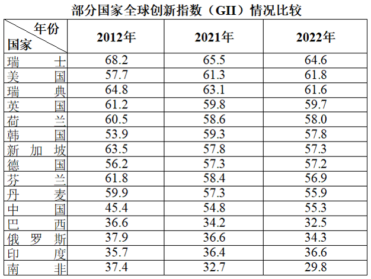
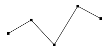
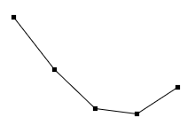
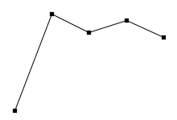

# 2024年河北省公务员录用考试《行测》题（网友回忆版）

> 资料分析 · 20 题 · 河北 2024

## 材料 1

### 第 1 题　qid 10204652 · 综合

2019-2022年全国体育场地数量年均增量约为：

- **A**. 17.1万个
- **B**. 22.7万个　✅
- **C**. 26.6万个
- **D**. 29.4万个

**答案**：B

**官方解析**

根据题干“2019-2022年······年均增量约为”，可判定本题为年均增长量问题。定位柱状图可得：2019年和2022年全国体育场地数量分别为354.44万个和422.68万个。根据公式：年均增长量，则所求万个，与B项最接近。

故正确答案为B。

---

### 第 2 题　qid 16592945 · 综合

2022年，按运动项目划分场地数量之和最接近全国体育场地数量25%的是：

- **A**. 游泳场地+全民健身路径
- **B**. 健身步道+全民健身路径
- **C**. 篮球场地+滑雪场地
- **D**. 排球场地+乒乓球场地　✅

**答案**：D

**官方解析**

根据题干“2022年······之和最接近全国体育场地数量25%的是”，可判定本题为现期比重问题。定位统计图可知2022年全国体育场地数量为422.68万个；定位表格可知按运动项目划分场地数量。根据公式：部分=整体×比重，全国体育场地数量的25%为422.68×25%万个。各选项场地数量之和为：A项，3.60万个+98.02万个万个；B项，12.78万个+98.02万个=110.8万个；C项，110.28万个+876个万个；D项，10.12万个+93.53万个万个。分析可得，103.7万个与105.7万个差值最小，即排球场地与乒乓球场地数量之和最接近全国体育场地数量的25%。

故正确答案为D。

---

### 第 3 题　qid 16592944 · 综合

2022年，按体育场地类型的数量，从大到小排位第二的约占全国体育场地数量的：

- **A**. 5.4%
- **B**. 23.2%
- **C**. 29.6%　✅
- **D**. 62.1%

**答案**：C

**官方解析**

根据题干“2022年······约占······的”，结合材料时间为2022年，可判定本题为现期比重问题。定位统计图可得：2022年全国体育场地数量为422.68万个；定位表格可得2022年全国主要分项体育场地数量。则2022年各体育场地类型的数量分别为：

基础大项场地，万个；

球类运动场地，万个；

冰雪运动场地，1576+876=2452个；

体育健身场地，万个。

因此，按体育场地类型的数量从大到小排位第二的是体育健身场地。根据公式：比重，则题干所求比重为，与C项最接近。

故正确答案为C。

---

### 第 4 题　qid 10204589 · 增长

2019~2022年全国体育场地面积增长最快的年份是：

- **A**. 2019年　✅
- **B**. 2020年
- **C**. 2021年
- **D**. 2022年

**答案**：A

**官方解析**

根据题干“2019~2022年······增长最快的年份是”，可判定本题为一般增长率问题。定位统计图可知2018~2022年全国体育场地面积。根据公式：增长率，则2019~2022年全国体育场地面积同比增长率分别为：

2019年：；

2020年：；

2021年：；

2022年：。

比较发现，2019~2022年全国体育场地面积增长最快的年份是2019年。

故正确答案为A。

---

### 第 5 题　qid 16592947 · 综合

能够从上述资料推出的是：

- **A**. 2022年全国每个体育场地平均面积大于900平方米
- **B**. 2022年足球、篮球、排球场地数量之和少于体育健身场地数量
- **C**. 2022年全国体育场地数量同比增速比2021年提高了2个百分点
- **D**. 2022年全国主要分项体育场地数量占全国体育场地数量的95%以上　✅

**答案**：D

**官方解析**

A项：定位统计图可得，2022年全国体育场地数量为422.68万个，全国体育场地面积37.02亿平方米。则2022年全国每个体育场地平均面积万平方米平方米＜900平方米，错误；

B项：定位统计表可得，2022年全国足球场地13.59万个，篮球场地110.28万个，排球场地10.12万个；体育健身场地中，全民健身路径98.02万个，健身房14.29万个，健身步道12.78万个。则2022年足球、篮球、排球场地数量之和=13.59+110.28+10.12=133.99万个，体育健身场地数量=98.02+14.29+12.78=125.09万个，即足球、篮球、排球场地数量之和多于体育健身场地数量，错误；

C项：定位统计图可得，2020-2022年全国体育场地数量分别为371.34万个、397.14万个、422.68万个。根据公式：增长率，则2022年全国体育场地数量同比增速，2021年全国体育场地数量同比增速，后者分子大分母小，则2022年同比增速&lt;2021年同比增速，即2022年全国体育场地数量同比增速较2021年有所下降，错误；

D项：定位统计图可得，2022年全国体育场地数量为422.68万个；定位统计表可得2022年全国主要分项体育场地数量。则2022年全国主要分项体育场地数量=19.74+3.60+13.59+110.28+10.12+93.53+24.61+10.53+0.1576+0.0876+98.02+14.29+12.7820+4+14+110+10+94+25+11+98+14+13=413万个。根据公式：比重，可得2022年全国主要分项体育场地数量占全国体育场地数量的比重，正确。

故正确答案为D。

---

## 材料 2

### 第 6 题　qid 16592975 · 增长

表格所列国家中，相较于2012年，2022年全球创新指数增长最快的国家是：

- **A**. 美国
- **B**. 中国　✅
- **C**. 英国
- **D**. 印度

**答案**：B

**官方解析**

根据题干“······相较于2012年，2022年······增长最快的国家是”，可判定本题为一般增长率比较问题。定位统计表可得：2012年美国全球创新指数为57.7，2022年为61.8；2012年中国全球创新指数为45.4，2022年为55.3；2012年英国全球创新指数为61.2，2022年为59.7；2012年印度全球创新指数为35.7，2022年为36.6。根据公式：增长率，则相较于2012年，2022年选项中国家全球创新指数同比增速分别为：

美国：；

中国：；

英国：；

印度：。

综上，表格所列国家中，相较于2012年，2022年全球创新指数增长最快的国家是中国。

故正确答案为B。

---

### 第 7 题　qid 16592984 · 综合

关于2021年，下列国家全球创新指数大小比较，错误的是：

- **A**. 瑞士>瑞典>美国
- **B**. 英国>韩国>荷兰
- **C**. 芬兰>新加坡>丹麦
- **D**. 俄罗斯>巴西>印度　✅

**答案**：D

**官方解析**

定位统计表可知2021年部分国家全球创新指数。代入选项验证：
A项：瑞士（65.5）&gt;瑞典（63.1）&gt;美国（61.3），正确；
B项：英国（59.8）&gt;韩国（59.3）&gt;荷兰（58.6），正确；
C项：芬兰（58.4）&gt;新加坡（57.8）&gt;丹麦（57.3），正确；
D项：俄罗斯（36.6）&gt;巴西（34.2）&lt;印度（36.4），错误。
本题为选非题，故正确答案为D。

---

### 第 8 题　qid 16592980 · 平均数

表格所列国家中，2022年全球创新指数排名前五位国家的平均创新指数是：

- **A**. 58.54
- **B**. 59.74
- **C**. 60.84
- **D**. 61.14　✅

**答案**：D

**官方解析**

根据题干“······2022年······平均创新指数是”，可判定本题为现期平均数问题。定位统计表可得：2022年全球创新指数排名前五位的国家分别是瑞士（64.6）、美国（61.8）、瑞典（61.6）、英国（59.7）、荷兰（58.0）。利用“削峰填谷”，以60为基准，分别作差得：4.6、1.8、1.6、-0.3、-2，，则排名前五位国家的平均创新指数=60+1.14=61.14。

故正确答案为D。

---

### 第 9 题　qid 16592986 · 增长

2022年，中国、巴西、俄罗斯、印度、南非五国创新指数之和同比：

- **A**. 增长约3.2%
- **B**. 增长约4.8%
- **C**. 下降约3.2%　✅
- **D**. 下降约4.8%

**答案**：C

**官方解析**

根据题干“2022年······创新指数之和同比”，结合选项为“增长/下降+百分数”，可判定本题为一般增长率问题。定位统计表可知2021年及2022年中国、巴西、俄罗斯、印度、南非五国创新指数。则2021年中国、巴西、俄罗斯、印度、南非五国创新指数之和为，2022年五国创新指数之和为。根据公式：增长率，则题干所求为，与C项最接近。

故正确答案为C。

---

### 第 10 题　qid 16592988 · 综合

能够从上述资料推出的是：

- **A**. 2022年，韩国创新指数同比下降幅度超过丹麦　✅
- **B**. 2022年，中国创新指数在全球的排名比2012年上升20位
- **C**. 表格所列年份中，全球创新指数均在58及以上的国家有5个
- **D**. 2022年，表格所列全球创新指数同比增长的国家中，其创新指数同比增量均不少于0.5

**答案**：A

**官方解析**

A项：定位统计表可得，2021年、2022年韩国创新指数分别为59.3、57.8，丹麦分别为57.3、55.9。根据公式：增长率，可得2022年韩国创新指数同比增速，即降幅为2.5%；丹麦创新指数同比增速，即降幅为2.4%。则2022年韩国创新指数同比下降幅度超过丹麦，正确；

B项：材料只给出部分国家创新指数的数据，无法得出2012年、2022年中国在全球的排名，错误；

C项：定位统计表可得，2012年、2021年、2022年全球创新指数均在58及以上的国家分别为瑞士（68.2、65.5、64.6）、瑞典（64.8、63.1、61.6）、英国（61.2、59.8、59.7）、荷兰（60.5、58.6、58.0），共4个国家，并非5个国家，错误；

D项：定位统计表可得，2021年、2022年印度创新指数分别为36.4、36.6。2022年印度创新指数同比增量=现期量-基期量=36.6-36.4=0.2&lt;0.5，并非均不少于0.5，错误。

故正确答案为A。

---

## 材料 3

        2022年，我国废钢铁、废有色金属等十个品种（详见表格）再生资源回收总重量约为37067.7万吨，同比下降2.62%，回收总金额约为13140.6亿元，同比下降4.05%。2022年废有色金属中废铅回收重量同比增长5.56%。2022年我国报废机动车回收数量399.1万辆，同比增长32.9%，回收数量占我国机动车保有量的。

### 第 11 题　qid 16592983 · 平均数

相比2021年，2022年我国废纸平均回收价格（平均回收价格）：

- **A**. 下调约170元/吨　✅
- **B**. 下调约347元/吨
- **C**. 上调约170元/吨
- **D**. 上调约347元/吨

**答案**：A

**官方解析**

根据题干“相比2021年，2022年······平均回收价格······”，结合选项为上调/下调约+单位，可判定本题为平均数的增长量问题。定位统计表可知：2021年和2022年我国废纸回收重量分别为6491.0万吨和6585.0万吨；2021年和2022年我国废纸回收金额分别为1493.0亿元和1402.6亿元。根据平均回收价格，可知题干所求元/吨，与A项最为接近。

故正确答案为A。

---

### 第 12 题　qid 16592982 · 综合

相比2021年，2022年我国十个品种再生资源回收重量降幅超过10%的有：

- **A**. 2个
- **B**. 3个　✅
- **C**. 4个
- **D**. 5个

**答案**：B

**官方解析**

根据题干“相比2021年······降幅超过10%······”，可判定本题为一般增长率问题。定位统计表可知2021-2022年我国十个品种再生资源回收重量。根据公式：增长率，则相比2021年，我国十个品种再生资源回收重量同比增速分别为：

废钢铁：；

废有色金属：；

废塑料：；

废纸：；

废轮胎：；

废弃电器电子产品：，即降幅超过10%；

报废机动车：；

废旧纺织品：，即降幅超过10%；

废玻璃：，即降幅超过10%；

废电池（铅酸电池除外）：；

综上可知，相比2021年，我国十个品种再生资源回收重量降幅超过10%的有废弃电器电子产品、废旧纺织品、废玻璃，共3个。

故正确答案为B。

---

### 第 13 题　qid 16592987 · 增长

按2022年我国十个品种再生资源回收重量从大到小进行排序，以下哪个折线图能准确反映排名前5位再生资源同比增量的变化趋势？

- **A**. 

- **B**. 

- **C**. 

- **D**. 

　✅

**答案**：D

**官方解析**

根据题干“······同比增量的变化趋势”，可判定本题为增长量比较问题。定位统计表可得2021年和2022年我国十个品种再生资源回收重量，其中2022年再生资源回收重量从大到小排名前5位的为废钢铁（24081.0万吨）、废纸（6585.0万吨）、废塑料（1800.0万吨）、废有色金属（1375.0万吨）、废玻璃（850.0万吨）。根据公式：增长量=现期量-基期量，可得2022年排名前5位再生资源的同比增量分别为：
废钢铁：24081.0-25021.0=-940万吨；
废纸：6585.0-6491.0=94万吨；
废塑料：1800.0-1900.0=-100万吨；
废有色金属：1375.0-1348.0=27万吨；
废玻璃：850.0-1005.0=-155万吨。
综上可知，废钢铁的同比增量最小，应处于折线图最低点，A、B、C三项中排名第一的废钢铁的同比增量均不在最低点位置，排除。
故正确答案为D。

---

### 第 14 题　qid 16592990 · 综合

2022年我国废有色金属中废铅回收重量约为：

- **A**. 261万吨
- **B**. 275万吨
- **C**. 285万吨　✅
- **D**. 291万吨

**答案**：C

**官方解析**

根据题干“2022年我国废有色金属中废铅······”，结合材料时间为2022年，可判定本题为现期计算问题。定位统计表可得，2021年我国废有色金属回收重量为1348.0万吨；定位饼状图可得，2021年废有色金属中废铅回收重量占比=1-51.93%-17.88%-10.16%=20.03%；定位文字材料可得，2022年废有色金属中废铅回收重量同比增长5.56%。根据公式：部分=整体×比重，现期量=基期量×（1+增长率），则所求万吨。

故正确答案为C。

---

### 第 15 题　qid 16592992 · 综合

能够从上述资料中推出的是：

- **A**. 截止2022年底，我国机动车保有量约为4170万辆
- **B**. 2022年我国十个品种再生资源平均回收价格最高的是废有色金属
- **C**. 2021年回收金额排前两名的再生资源回收金额之和的比值超过75%　✅
- **D**. 2022年除废铅以外的废有色金属回收重量总和比2021年的有所下降

**答案**：C

**官方解析**

A项：定位文字材料可得：2022年我国报废机动车回收数量399.1万辆，回收数量占我国机动车保有量的。根据公式：整体，可知截止2022年底，我国机动车保有量为万辆，错误；

B项：定位统计表可知2022年我国十个品种再生资源的回收重量以及回收金额。根据公式：平均回收价格，可得2022年废有色金属的平均回收价格为万元/吨；废电池（铅酸电池除外）的平均回收价格为万元/吨，可知废有色金属的平均回收价格低于废电池（铅酸电池除外），则2022年我国十个品种再生资源平均回收价格最高的并非废有色金属，错误；

C项：定位文字材料可得：2022年，我国废钢铁、废有色金属等十个品种再生资源回收总金额约为13140.6亿元，同比下降4.05%。定位统计表可知2021年我国十个品种再生资源的回收金额。观察可知：2021年回收金额排前两名的再生资源分别为废钢铁（7523.6亿元）、废有色金属（2878.5亿元），根据公式：基期量，则所求为，正确；

D项：定位文字材料可得：2022年废有色金属中废铅回收重量同比增长5.56%。定位统计表可得：2021年、2022年废有色金属的回收重量分别为1348.0万吨、1375.0万吨。定位统计图可知2021年废有色金属中除废铅以外的各类废金属回收重量的占比情况。

方法一：定位统计图可知，2021年废有色金属中废铅回收重量的占比为1-（51.93%+17.88%+10.16%）=1-79.97%=20.03%。根据公式：部分=整体×比重，可知2021年废有色金属中废铅回收重量为万吨，则2021年废有色金属中除废铅以外的各类废金属回收重量约为1348.0-270=1078万吨。根据公式：现期量=基期量×（1+增长率），可知2022年废有色金属中废铅回收重量为万吨，则2022年废有色金属中除废铅以外的各类废金属回收重量为1375.0-285=1090万吨&gt;1078万吨，即2022年除废铅以外的废有色金属回收重量总和比2021年的有所上升，错误。

方法二：2021年废有色金属中除废铅以外的废有色金属回收重量的占比为51.93%+17.88%+10.16%=79.97%，则2021年废有色金属中废铅回收重量的占比为1-79.97%=20.03%。根据公式：增长率，可知2022年废有色金属的回收重量同比增长率为，设2022年除废铅以外的废有色金属回收重量总和的同比增长率为r，根据线段法“距离与基期量成反比”，可知：，解得：，即2022年除废铅以外的废有色金属回收重量总和比2021年的有所上升，错误。

故正确答案为C。

---

## 材料 4

        2022年，全国共有260家银行机构和29家理财公司累计新发理财产品2.94万只，同比下降38.23%，降幅比上年同期扩大7.22个百分点；累计募集资金89.62万亿元，同比减少32.57万亿元。

        截至2022年底，全国共有278家银行机构和29家理财公司有存续的理财产品，共存续产品3.47万只，同比下降4.41%；存续规模27.65万亿元，同比下降4.66%。分机构类型来看，理财公司存续产品13947只，存续规模22.24万亿元，同比增长29.36%。银行机构中，城商行存续产品9064只，存续规模2.45万亿元，同比下降32.34%；农村金融机构存续产品7808只，存续规模1.09万亿元，同比下降2.63%；股份制银行存续产品1208只，存续规模0.88万亿元，同比下降82.99%；大型银行存续产品668只，存续规模0.92万亿元，同比下降49.26%；其他机构存续产品1980只，存续规模0.07万亿元，同比下降13.42%。

        截至2022年底，持有理财产品的投资者数量为9671.27万个，较年初增长18.96%，其中机构投资者数量为95.95万个，数量占比同比提升了0.22个百分点；在持有理财产品的个人投资者中，数量最多的是风险偏好为二级（稳健型）的投资者，占比35.44%。

### 第 16 题　qid 16592960 · 综合

2022年全国银行机构和理财公司累计新发理财产品只数与2020年相比约：

- **A**. 下降45%
- **B**. 下降57%　✅
- **C**. 下降66%
- **D**. 下降69%

**答案**：B

**官方解析**

根据题干“2022年······与2020年相比约”，结合选项均为“下降+百分数”，可判定本题为间隔增长率问题。定位文字材料第一段可得：2022年，全国银行机构和理财公司累计新发理财产品2.94万只，同比下降38.23%（），降幅比上年同期扩大7.22个百分点。则2021年全国银行机构和理财公司累计新发理财产品只数的同比增速。根据间隔增长率公式：，则题干所求，即约下降57%。

故正确答案为B。

---

### 第 17 题　qid 10204588 · 综合

2021年银行机构存续的理财产品存续规模约为多少万亿元？

- **A**. 5.4
- **B**. 6.7
- **C**. 10.5
- **D**. 11.8　✅

**答案**：D

**官方解析**

根据题干“2021年银行机构存续的理财产品存续规模约为······万亿元”，结合材料所给的是2022年银行机构和理财公司存续的理财产品总存续规模及理财公司的存续规模，可以判定本题为基期和差问题。定位文字材料第二段可得：2022年全国银行机构和理财公司存续的理财产品总存续规模27.65万亿元，同比下降4.66%；理财公司存续的理财产品存续规模22.24万亿元，同比增长29.36%。根据公式：基期量，则2021年银行机构存续的理财产品存续规模为万亿元，与D项最接近。

故正确答案为D。

---

### 第 18 题　qid 16592962 · 综合

按存续产品只数、存续规模分别对2022年6类机构（理财公司、大型银行、股份制银行、城商行、农村金融机构、其他机构）从大到小进行排列，两种排列中位次不一致的机构数量有：

- **A**. 1个
- **B**. 2个　✅
- **C**. 3个
- **D**. 4个

**答案**：B

**官方解析**

定位文字材料第二段可得，2022年理财公司、大型银行、股份制银行、城商行、农村金融机构、其他机构存续产品只数从大到小进行排列为：理财公司（13947只）&gt;城商行（9064只）&gt;农村金融机构（7808只）&gt;其他机构（1980只）&gt;股份制银行（1208只）&gt;大型银行（668只）；存续规模从大到小进行排列为：理财公司（22.24万亿元）&gt;城商行（2.45万亿元）&gt;农村金融机构（1.09万亿元）&gt;大型银行（0.92万亿元）&gt;股份制银行（0.88万亿元）&gt;其他机构（0.07万亿元）。两种排列中位次不一致的机构有大型银行、其他机构，共2个。
故正确答案为B。

---

### 第 19 题　qid 16592961 · 平均数

2022年不同机构每只存续理财产品平均存续金额从大到小排前三名的是：

- **A**. 大型银行、理财公司、城商行
- **B**. 理财公司、大型银行、城商行
- **C**. 大型银行、理财公司、股份制银行
- **D**. 理财公司、大型银行、股份制银行　✅

**答案**：D

**官方解析**

根据题干“2022年······每只存续理财产品平均存续金额······”，结合材料时间为2022年，可判定本题为现期平均数问题。定位文字材料第二段可得∶截至2022年底，理财公司存续产品13947只，存续规模22.24万亿元；城商行存续产品9064只，存续规模2.45万亿元；股份制银行存续产品1208只，存续规模0.88万亿元；大型银行存续产品668只，存续规模0.92万亿元。根据每只存续理财产品平均存续金额，则2022年下列机构每只存续理财产品平均存续金额分别为：理财公司，亿元/只；城商行，亿元/只；股份制银行，亿元/只；大型银行，亿元/只。比较可知，2022年不同机构每只存续理财产品平均存续金额从大到小排前三名的是理财公司、大型银行、股份制银行。

故正确答案为D。

---

### 第 20 题　qid 16592967 · 综合

能够从上述资料中推出的是：

- **A**. 2021年持有理财产品的个人投资者数量占比为98.88%
- **B**. 2022年新发理财产品中平均每只产品募集资金低于2021年
- **C**. 2022年城商行存续产品存续金额在银行机构存续产品中比例为8.85%
- **D**. 2022年持有理财产品的个人投资者中风险偏好为二级的数量约为3393万个　✅

**答案**：D

**官方解析**

A项：定位文字材料第三段可得：截至2022年底，持有理财产品的投资者数量为9671.27万个，其中机构投资者数量为95.95万个，数量占比同比提升了0.22个百分点。根据公式：比重，则2021年机构投资者数量占持有理财产品的投资者数量的比重为，故2021年持有理财产品的个人投资者数量占比&gt;1-0.78%=99.22%，不可能为98.88%，错误；

B项：定位文字材料第一段可得：2022年，全国共有260家银行机构和29家理财公司累计新发理财产品2.94万只，同比下降38.23%（b）；累计募集资金89.62万亿元，同比减少32.57万亿元。根据公式：增长率，则累计募集资金同比增速。根据两期平均数比较结论：当a&gt;b时，平均数上升，-26.7%&gt;-38.23%，则2022年新发理财产品中平均每只产品募集资金高于2021年，错误；

C项：定位文字材料第二段可得：截至2022年底，全国共有278家银行机构和29家理财公司有存续的理财产品，共存续产品3.47万只，存续规模27.65万亿元。分机构类型来看，理财公司存续产品13947只，存续规模22.24万亿元。银行机构中，城商行存续产品9064只，存续规模2.45万亿元。根据公式：比重，则2022年城商行存续产品存续金额在银行机构存续产品中比例，远高于8.85%，错误；

D项：定位文字材料第三段可得：截至2022年底，持有理财产品的投资者数量为9671.27万个，其中机构投资者数量为95.95万个，在持有理财产品的个人投资者中，数量最多的是风险偏好为二级（稳健型）的投资者，占比35.44%。根据公式：部分=整体×比重，则2022年持有理财产品的个人投资者中风险偏好为二级的数量万个，非常接近于3393万个，正确。

故正确答案为D。

---
