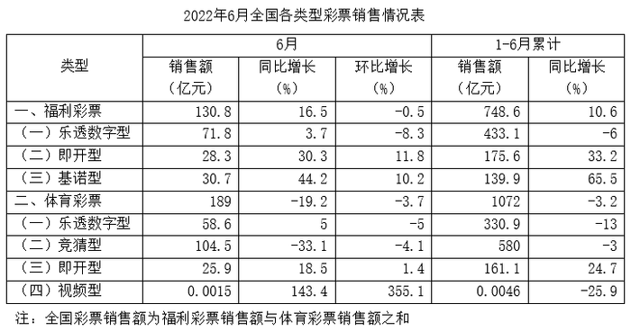
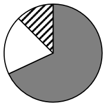
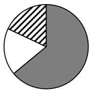
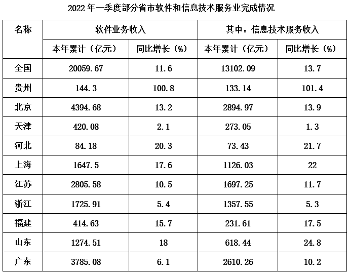
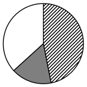
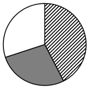
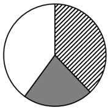
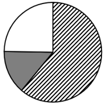

# 2024年浙江省公务员录用考试《行测》题（A类）（网友回忆版）

> 资料分析 · 15 题 · 浙江 2024

## 材料 1

### 第 1 题　qid 5911236 · 综合

2021年上半年，全国彩票销售额约为多少亿元？

- **A**. 1780　✅
- **B**. 1810
- **C**. 1840
- **D**. 1880

**答案**：A

**官方解析**

根据题干“2021年上半年，全国彩票销售额约为多少亿元”，结合材料时间为2022年1-6月，且全国彩票销售额为福利彩票销售额与体育彩票销售额之和，可判定本题为基期和差问题。定位表格材料可得：2022年1-6月累计福利彩票销售额748.6亿元，同比增长10.6%；体育彩票销售额1072亿元，同比增长-3.2%。根据公式：基期量，则2021年上半年全国彩票销售额=2021年上半年福利彩票销售额+2021年上半年体育彩票销售额亿元。

故正确答案为A。

---

### 第 2 题　qid 5911239 · 平均数

2022年1-4月，福利彩票平均每月销售额约为多少亿元？

- **A**. 110
- **B**. 115
- **C**. 120　✅
- **D**. 125

**答案**：C

**官方解析**

根据题干“2022年1-4月······平均每月······亿元”，可判定本题为现期平均数问题。定位表格材料可得：2022年6月福利彩票销售额130.8亿元，环比增长-0.5%；2022年1-6月累计福利彩票销售额748.6亿元。由于1-4月=1-6月-6月-5月，根据公式：基期量，则2022年1-4月福利彩票销售额亿元。根据公式：平均每月销售额，则2022年1-4月福利彩票平均每月销售额亿元，与C项最接近。

故正确答案为C。

---

### 第 3 题　qid 5911246 · 比重

2022年6月，福利彩票中乐透数字型销售额占比比体育彩票中乐透数字型销售额占比：

- **A**. 低不到20个百分点
- **B**. 高不到20个百分点
- **C**. 低20个百分点以上
- **D**. 高20个百分点以上　✅

**答案**：D

**官方解析**

根据题干“2022年6月······占比······”，可判定本题为现期比重问题。定位表格材料可得：2022年6月福利彩票销售额130.8亿元，其中乐透数字型销售额71.8亿元；体育彩票销售额189亿元，其中乐透数字型销售额58.6亿元。根据公式：比重，则所求，即高20个百分点以上。

故正确答案为D。

---

### 第 4 题　qid 5911257 · 比重

下列饼图中，最能体现2021年上半年福利彩票中乐透数字型（灰色）、即开型（白色）、基诺型（斜线）占比的是：

- **A**. 

- **B**. 

　✅
- **C**. 

- **D**. 

**答案**：B

**官方解析**

根据题干“······2021年上半年福利彩票中······占比的是”，结合材料时间为2022年1-6月，可判定本题为基期比重问题。定位表格材料可得：2022年1-6月累计福利彩票销售额748.6亿元（B），同比增长10.6%（b），其中乐透数字型销售额433.1亿元（A），同比增长-6%（a）；即开型销售额175.6亿元，同比增长33.2%；基诺型销售额139.9亿元，同比增长65.5%。根据公式：基期量，可得2021年上半年即开型销售额为亿元，基诺型销售额为亿元，前者分子大分母小，其分数值大，则即开型占比（白色部分）＞基诺型占比（斜线部分），排除C、D两项。根据公式：基期比重，可得2021年上半年乐透数字型销售额占福利彩票销售额的比重为，排除A项，B项当选。

故正确答案为B。

---

### 第 5 题　qid 5911261 · 综合

能够从上述资料中推出的是：

- **A**. 2022年上半年，视频型体育彩票销售额同比减少超过15万元　✅
- **B**. 2021年上半年，全国体育彩票销售额占全国彩票销售额的70%以上
- **C**. 四类体育彩票2022年6月的销售额均超过上半年每月的平均销售额
- **D**. 2022年6月，福利彩票中基诺型销售额同比增量是即开型的1.5倍以上

**答案**：A

**官方解析**

A项：定位表格材料可得，2022年1-6月累计视频型体育彩票销售额0.0046亿元，同比增长-25.9%。根据公式：增长量，可得2022年上半年，视频型体育彩票销售额同比增量万元，即同比减少超过15万元，正确；

B项：定位表格材料可得，2022年1-6月累计全国福利彩票销售额748.6亿元，同比增长10.6%；体育彩票销售额1072亿元，同比增长-3.2%。根据公式：基期量，可得2021年上半年，全国福利彩票销售额为亿元，体育彩票销售额为亿元。根据公式：比重，则2021年上半年，全国体育彩票销售额占全国彩票销售额的比重，错误；

C项：定位表格材料可得，2022年6月及1-6月累计全国体育彩票中，乐透数字型销售额分别为58.6亿元、330.9亿元；竞猜型销售额分别为104.5亿元、580亿元；即开型销售额分别为25.9亿元、161.1亿元；视频型销售额分别为0.0015亿元、0.0046亿元。则四类体育彩票2022年上半年每月的平均销售额分别为：乐透数字型，亿元&lt;6月销售额58.6亿元；竞猜型，亿元&lt;6月销售额104.5亿元；即开型，亿元&gt;6月销售额25.9亿元；视频型，亿元&lt;6月销售额0.0015亿元。综上，四类体育彩票中，即开型2022年6月的销售额未超过上半年每月的平均销售额，错误；

D项：定位表格材料可得，2022年6月全国福利彩票中，即开型销售额28.3亿元，同比增长30.3%；基诺型销售额30.7亿元，同比增长44.2%。根据公式：增长量，可得2022年6月，即开型福利彩票销售额同比增量亿元，基诺型福利彩票销售额同比增量亿元，则福利彩票中基诺型销售额同比增量是即开型的倍，错误。

故正确答案为A。

---

## 材料 2

### 第 6 题　qid 5911366 · 综合

2021年一季度，浙江软件业务收入累计值约为多少亿元？

- **A**. 1600
- **B**. 1640　✅
- **C**. 1680
- **D**. 1800

**答案**：B

**官方解析**

根据题干“2021年一季度······多少亿元”，结合材料时间为2022年一季度，可判定本题为基期计算问题。定位表格材料可得，2022年一季度浙江软件业务收入累计值为1725.91亿元，同比增长5.4%。根据公式：基期量，则所求为亿元。

故正确答案为B。

---

### 第 7 题　qid 5911367 · 综合

2022年一季度，表中信息技术服务收入累计值排名前三的省市，其信息技术服务收入累计值之和约占全国累计值的多少？

- **A**. 51%
- **B**. 53%
- **C**. 55%　✅
- **D**. 57%

**答案**：C

**官方解析**

根据题干“2022年一季度······占······”，结合材料时间为2022年一季度，可判定本题为现期比重问题。定位表格材料可得，2022年一季度信息技术服务收入累计值排名前三的省市为北京、广东、江苏，数值分别为2894.97、2610.26、1697.25亿元，全国累计值为13102.09亿元。根据公式：比重，则所求为。

故正确答案为C。

---

### 第 8 题　qid 5911368 · 增长

2022年一季度，表中信息技术服务收入累计值同比增速快于软件业务收入累计值同比增速的省市有几个？

- **A**. 2
- **B**. 6
- **C**. 8　✅
- **D**. 9

**答案**：C

**官方解析**

根据题干“2022年一季度······同比增速······”，可判定本题为一般增长率问题。定位表格材料可得，2022年一季度各省市信息技术服务收入累计值同比增速和软件业务收入累计值同比增速。经比较，符合题意的有贵州（101.4%＞100.8%）、北京（13.9%＞13.2%）、河北（21.7%＞20.3%）、上海（22%＞17.6%）、江苏（11.7%＞10.5%）、福建（17.5%＞15.7%）、山东（24.8%＞18%）、广东（10.2%＞6.1%），共8个。
故正确答案为C。

---

### 第 9 题　qid 5911369 · 增长

2022年一季度，表中软件业务收入累计值同比增量最大的省市的软件业务收入累计值约是同比增量最小的省市的多少倍?

- **A**. 7
- **B**. 8
- **C**. 9
- **D**. 10　✅

**答案**：D

**官方解析**

根据题干“2022年一季度······约是······倍”，结合材料时间为2022年一季度，可判定本题为现期倍数问题。定位表格材料可知2022年一季度各省市软件业务收入及其同比增长率。根据公式：增长量，则表中各个省市软件业务收入累计值增长量分别为：

贵州：亿元；

北京：亿元；

天津：亿元；

河北：亿元；

上海：亿元；

江苏：亿元；

浙江：亿元；

福建：亿元；

山东：亿元；

广东：亿元。

综上，软件业务收入累计值同比增量最大和最小的省市分别为北京（亿元）和天津（亿元）。则2022年一季度，北京软件业务收入累计值是天津的倍。

故正确答案为D。

---

### 第 10 题　qid 5911370 · 比重

下列饼图中，最能准确反映2022年一季度北京（斜线）、上海（灰色）、广东（白色）软件业务收入中除信息技术服务收入以外收入累计值所占比例的是：

- **A**. 

　✅
- **B**. 

- **C**. 

- **D**. 

**答案**：A

**官方解析**

根据题干“2022年一季度······所占比例······”，结合材料时间为2022年一季度，可判定本题为现期比重问题。定位表格材料可得，2022年一季度北京、上海、广东软件业务收入分别为4394.68、1647.5、3785.08亿元，其中信息技术服务收入分别为2894.97、1126.03、2610.26亿元，则这三个省市的软件业务收入中除信息技术服务收入以外收入分别为亿元、亿元、亿元。观察可知北京（斜线）是上海（灰色）的倍，且广东（白色）是上海（灰色）的倍多，只有A项符合。

故正确答案为A。

---

## 材料 3

        2023年第14周，H市流感哨点监测医院（哨点医院）共报告流感样病例5187例，本周监测门诊就诊病人总数86749例，比上周增加5.76%，流感样病例的就诊比例（ILI%）为5.98%。

（一）哨点医院ILI%监测情况

        本周哨点医院共报告流感样病例总数为5187例，比上周增加4.49%，比去年同期减少56.16%，其中国家级哨点医院455例，比上周减少6.57%，比去年同期减少55.04%。城区哨点医院1899例，比上周减少19.40%，比去年同期减少55.46%；郊区、县（市）哨点医院3288例，比上周增加26.07%，比去年同期减少56.55%。本周全市哨点医院ILI%为5.98%，比上周低0.07个百分点，其中国家级哨点医院ILI%为2.12%，比上周高0.23个百分点。城区哨点医院ILI%为4.45%，比上周低0.56个百分点；郊区、县（市）哨点医院ILI%为7.46%，比上周高0.01个百分点。

（二）哨点医院ILI%纵向比较

        2023年第14周全市哨点医院ILI%为5.98%，比2022年同期低7.56个百分点，比2021年同期低0.66个百分点，其中国家级哨点医院ILI%为2.12%，比2022年同期低3.36个百分点，比2021年同期低4.67个百分点。城区哨点医院ILI%为4.45%，比2022年同期低6.81个百分点，比2021年同期低2.08个百分点；郊区、县（市）哨点医院ILI%为7.46%，比2022年同期低7.82个百分点，比2021年同期高0.54个百分点。

（三）各年龄组流感样病例构成情况

        2023年第14周各年龄组报告的流感样病例构成情况为：0~4岁组1472例，5~14岁组1103例，15~24岁组406例，25~59岁组1266例，60岁以上组940例。

### 第 11 题　qid 5911371 · 比重

H市2023年第14周哨点医院报告流感样病例中，0~4岁组占比比25~59岁组高约多少个百分点？

- **A**. 2
- **B**. 4　✅
- **C**. 6
- **D**. 8

**答案**：B

**官方解析**

根据题干“······2023年第14周······中，······占比比······高约多少个百分点”，可判定本题为现期比重问题。定位材料第一段和最后一段可得：2023年第14周，H市流感哨点监测医院（哨点医院）共报告流感样病例5187例，其中，0~4岁组1472例，25~59岁组1266例。根据公式：比重，则题干所求，即高约4个百分点。

故正确答案为B。

---

### 第 12 题　qid 5911372 · 综合

2023年第13周，H市郊区、县（市）哨点医院报告流感样病例约是城区的多少倍？

- **A**. 1.7
- **B**. 1.5
- **C**. 1.3
- **D**. 1.1　✅

**答案**：D

**官方解析**

根据题干“2023年第13周······约是······的多少倍”，结合材料时间为2023年第14周，可判定本题为基期倍数问题。定位材料第二段可得：（2023年第14周）本周哨点医院共报告流感样病例总数为5187例，城区哨点医院1899例（B），比上周减少19.40%（b），郊区、县（市）哨点医院3288例（A），比上周增加26.07%（a）。根据公式：基期倍数，则题干所求，与D项最接近。

故正确答案为D。

---

### 第 13 题　qid 5911373 · 综合

2021年第14周，H市全市哨点医院ILI%、国家级哨点医院ILI%、城区哨点医院ILI%和郊区、县（市）哨点医院ILI%从大到小排序为：

- **A**. 城区>全市>国家级>郊区、县（市）
- **B**. 郊区、县（市）>城区>全市>国家级
- **C**. 郊区、县（市）>国家级>全市>城区　✅
- **D**. 城区>国家级>全市>郊区、县（市）

**答案**：C

**官方解析**

定位材料第三段可得：2023年第14周全市哨点医院ILI%为5.98%，比2021年同期低0.66个百分点；国家级哨点医院ILI%为2.12%，比2021年同期低4.67个百分点；城区哨点医院ILI%为4.45%，比2021年同期低2.08个百分点；郊区、县（市）哨点医院ILI%为7.46%，比2021年同期高0.54个百分点。则2021年第14周H市城区哨点医院ILI%为，国家级哨点医院ILI%为，即国家级＞城区，排除A、B、D三项，C项当选。

故正确答案为C。

---

### 第 14 题　qid 5911374 · 综合

2022年第14周，H市哨点医院监测门诊就诊病人总数约多少例？

- **A**. 87000　✅
- **B**. 89000
- **C**. 91000
- **D**. 93000

**答案**：A

**官方解析**

根据题干“2022年第14周······约多少例”，结合材料时间为2023年第14周，且材料中给出了2023年第14周H市哨点医院共报告流感样病例总数和流感样病例的就诊比例（ILI%）及其同比变化情况，可判定本题为基期比重问题。定位材料第二段可得：（2023年第14周，H市）哨点医院共报告流感样病例总数为5187例，比去年同期减少56.16%。根据公式：基期量，则2022年第14周，H市哨点医院共报告流感样病例总数例；定位材料第三段可得：2023年第14周全市哨点医院ILI%（流感样病例的就诊比例）为5.98%，比2022年同期低7.56个百分点。则2022年第14周全市哨点医院ILI%（流感样病例的就诊比例）=5.98%+7.56%=13.54%。根据公式：整体，则题干所求例，对应A项。

故正确答案为A。

---

### 第 15 题　qid 5911375 · 综合

能够从上述材料中推出的是：

- **A**. 从2021年到2023年，H市第14周哨点医院ILI%逐年上升
- **B**. 2023年第14周，H市哨点医院报告流感样病例同比减少超过6000例　✅
- **C**. 2023年第13周，H市国家级哨点医院报告流感样病例占全市比例超过10%
- **D**. 2023年第14周H市哨点医院报告流感样病例中，占比低于20%的年龄组有3个

**答案**：B

**官方解析**

A项：定位材料第三段可得：2023年第14周H市哨点医院ILI%为5.98%，比2022年同期低7.56个百分点，比2021年同期低0.66个百分点。因2023年第14周H市哨点医院ILI%比2022年同期低，故并非逐年上升，错误；

B项：定位材料第二段可得：2023年第14周H市哨点医院共报告流感样病例总数为5187例，比去年同期减少56.16%。根据公式：增长量，则2023年第14周，H市哨点医院报告流感样病例同比减少量例，即减少超过6000例，正确；

C项：定位材料第二段可得：2023年第14周H市哨点医院共报告流感样病例总数为5187例（B），比上周增加4.49%（b），其中国家级哨点医院455例（A），比上周减少6.57%（a）。根据公式：基期比重，则2023年第13周，H市国家级哨点医院报告流感样病例占全市比例＜10%，错误；

D项：定位材料第二、四段可得：2023年第14周H市哨点医院共报告流感样病例总数为5187例；各年龄组报告的流感样病例构成情况为：0~4岁组1472例，5~14岁组1103例，15~24岁组406例，25~59岁组1266例，60岁以上组940例。根据公式：部分=整体×比重，5187×20%=1037.4例，则2023年第14周H市哨点医院报告流感样病例中，占比低于20%的年龄组即流感样病例低于1037.4例的年龄组有15~24岁组（406例）、60岁以上组（940例），共2个，错误。

故正确答案为B。

---
