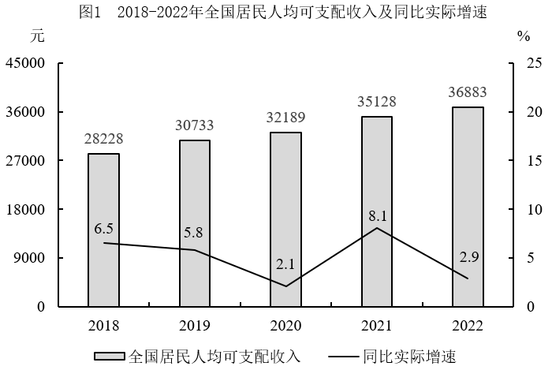
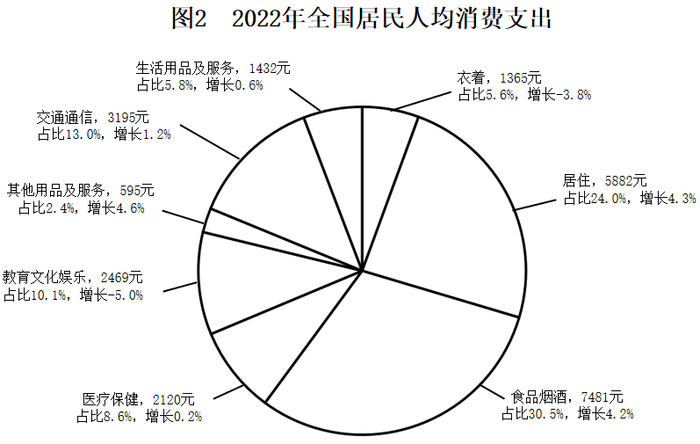
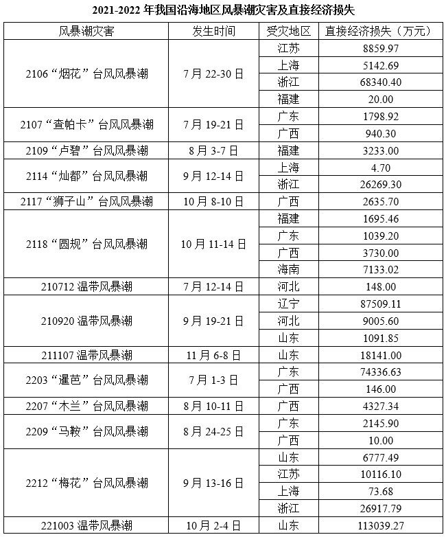
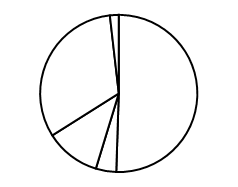
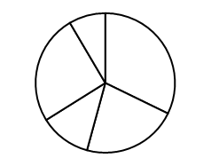
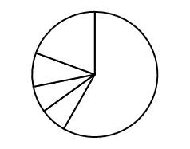
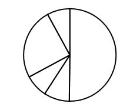

# 2024年深圳市考公务员录用考试《行测》试题（网友回忆版）

> 资料分析 · 15 题 · 深圳市考 2024

## 材料 1

        2022年，深圳全市绿化覆盖总面积达到101385.6公顷，比上年增长513.4公顷；其中建成区绿化覆盖面积41457.5公顷，比上年增长345.2公顷；建成区绿化覆盖率43.09%，比上年增长0.09个百分点；全市绿地面积98270.2公顷，比上年增长1.45%；其中建成区绿地面积36613.1公顷，比上年增长3.30%；建成区绿地率比上年增长0.98个百分点；全市公园绿地面积22219.0公顷，比上年增长222.5公顷，按常住人口计算人均公园绿地面积比上年增长1.13%。

        2022年全市公园已达到1260个，公园总面积38209.9公顷，分别是2003年的8.6倍和5.6倍；全市公园中，有自然公园37个，比上年增加4个；城市公园191个，比上年增加4个；社区公园1032个，比上年增加14个。三级公园体系的建成，基本实现了市民出门500米可达社区公园，2公里可达城市综合圈，5公里可达自然公园的目标。全市公园绿化活动场地服务半径覆盖的居住用地面积达到21018.2公顷，较上年增长280.8公顷，公园绿化活动场地服务半径覆盖率达到90.87%，与上年持平。

        2022年，全市绿道长度3119公里，比上年增长9.70%，增速较上年收窄5.78个百分点，万人拥有绿道长度1.77公里，比上年增长9.94%；绿道密度（全市绿道长度与全市面积之比）1.56公里/平方公里，居广东省首位。深圳市建成区绿化覆盖率、公园绿化活动场地服务半径覆盖率、万人拥有绿道长度3项指标已达到国家生态园林城市标准。

### 第 1 题　qid 10718163 · 综合

2022年，深圳市建成区面积约为（    ）万公顷。

- **A**. 9.6　✅
- **B**. 9.8
- **C**. 9.9
- **D**. 10.0

**答案**：A

**官方解析**

根据题干“2022年，深圳市建成区面积约为······万公顷”，结合材料给出2022年深圳市建成区绿化覆盖面积及绿化覆盖率，可判定本题为现期比重问题。定位文字材料第一段可得：2022年深圳市建成区绿化覆盖面积41457.5公顷，建成区绿化覆盖率43.09%。根据绿化覆盖率，则2022年深圳市建成区面积万公顷，对应A项。

故正确答案为A。 

---

### 第 2 题　qid 10718165 · 综合

2022年，深圳市每万人拥有公园绿地面积约为（    ）公顷。

- **A**. 11.6
- **B**. 12.1
- **C**. 12.6　✅
- **D**. 无法判断

**答案**：C

**官方解析**

根据题干“2022年······每万人拥有······约为（    ）公顷”，结合材料时间为2022年，可判定本题为现期平均数问题。定位材料第一段和第三段可得：2022年，全市公园绿地面积22219.0公顷；全市绿道长度3119公里，万人拥有绿道长度1.77公里。则深圳市人口数万人。根据公式：每万人拥有公园绿地面积，故所求为公顷/万人，对应C项。

故正确答案为C。

---

### 第 3 题　qid 10718166 · 增长

下列统计指标中，其2022年同比增长率最高的是（    ）。

- **A**. 全市绿化覆盖总面积
- **B**. 全市公园绿地面积
- **C**. 全市公园总数　✅
- **D**. 全市居住用地面积

**答案**：C

**官方解析**

根据题干“······2022年同比增长率最高的是”，可判定本题为一般增长率问题。定位材料第一、二段可得：2022年，深圳全市绿化覆盖总面积达到101385.6公顷，比上年增长513.4公顷。全市公园绿地面积22219.0公顷，比上年增长222.5公顷。2022年全市公园已达到1260个。全市公园中，有自然公园37个，比上年增加4个；城市公园191个，比上年增加4个；社区公园1032个，比上年增加14个。全市公园绿化活动场地服务半径覆盖的居住用地面积达到21018.2公顷，较上年增长280.8公顷。根据公式：增长率，则各选项2022年同比增长率分别为：

全市绿化覆盖总面积：；

全市公园绿地面积：；

全市公园总数：；

全市居住用地面积：。

观察发现，2022年全市公园总数同比增长率最高。

故正确答案为C。

---

### 第 4 题　qid 10718169 · 综合

根据上文，下列指标不能计算求得数值的是（    ）。

- **A**. 2003年深圳市公园总面积（公顷）
- **B**. 2020年全市万人拥有绿道长度（公里）　✅
- **C**. 2022年深圳全市面积（平方公里）
- **D**. 2021年深圳市常住人口数（万人）

**答案**：B

**官方解析**

A项：定位文字材料第二段，2022年全市公园总面积38209.9公顷，是2003年的5.6倍。则2003年深圳市公园总面积公顷，可以计算求得数值；

B项：定位文字材料第三段，2022年全市万人拥有绿道长度1.77公里，比上年增长9.94%。材料未给出2020年相关的数据，故无法计算求得2020年全市万人拥有绿道长度；

C项：定位文字材料第三段，2022年全市绿道长度3119公里；绿道密度（全市绿道长度与全市面积之比）1.56公里/平方公里。则2022年深圳全市面积平方公里，可以计算求得数值；

D项：定位文字材料第三段，2022年全市绿道长度3119公里，比上年增长9.70%；万人拥有绿道长度1.77公里，比上年增长9.94%。根据公式：基期量，可得2021年全市绿道长度公里，2021年万人拥有绿道长度公里，则2021年深圳市常住人口数万人，可以计算求得数值。

本题为选非题，故正确答案为B。

---

### 第 5 题　qid 10718170 · 综合

根据上文，下列说法错误的是（    ）。

- **A**. 2021年，深圳市建成区绿地率约为38.2%　✅
- **B**. 2022年，深圳市自然公园和城市公园数量占公园总数的比重同比均有所提高
- **C**. 2003-2022年，深圳市公园总面积年均增加约1652公顷
- **D**. 2020年，深圳全市绿道长度不足2500公里

**答案**：A

**官方解析**

A项：定位文字材料第一段，2022年，全市建成区绿化覆盖面积41457.5公顷，建成区绿化覆盖率43.09%；建成区绿地面积36613.1公顷；建成区绿地率比上年增长0.98个百分点。根据公式：建成区面积，绿地率，则2022年深圳市建成区绿地率，则2021年深圳市建成区绿地率=38.1%-0.98%&lt;38%，错误；

B项：定位文字材料第二段，2022年全市公园已达到1260个；全市公园中，有自然公园37个，比上年增加4个；城市公园191个，比上年增加4个；社区公园1032个，比上年增加14个。根据37+191+1032=1260，可知2022年全市公园比上年增长4+4+14=22个，根据公式：增长率，则2022年深圳市公园总数同比增速；自然公园同比增速；城市公园同比增速。根据两期比重比较结论：部分增长率&gt;整体增长率，比重上升，则深圳市自然公园、城市公园同比增速均大于全市公园总数同比增速，故两者的比重同比均有所提高，正确；

C项：定位文字材料第二段，可知2022年全市公园总面积38209.9公顷，是2003年的5.6倍。则2003年全市公园总面积公顷，根据公式：年均增长量，则2003-2022年，深圳市公园总面积年均增长量公顷，正确；

D项：定位文字材料第三段，2022年，全市绿道长度3119公里，比上年增长9.70%，增速较上年收窄5.78个百分点。则2021年全市绿道长度同比增速为9.70%+5.78%=15.48%，根据公式：，则2022年全市绿道长度较2020年同比增速，根据公式：基期量，则2020年深圳全市绿道长度公里&lt;2500公里，正确。

本题为选非题，故正确答案为A。

---

## 材料 2

### 第 6 题　qid 10718183 · 增长

2022年，全国居民人均可支配收入的同比名义增速与实际增速相差（    ）个百分点。

- **A**. 2.1　✅
- **B**. 2.9
- **C**. 4.9
- **D**. 5.0

**答案**：A

**官方解析**

根据题干“2022年······增速······”，可判定本题为一般增长率问题。定位图1可得：2021和2022年，全国居民人均可支配收入分别为35128元、36883元；2022年，全国居民人均可支配收入同比实际增速为2.9%。根据公式：增长率，可得2022年全国居民人均可支配收入同比名义增速，其与实际增速相差5%-2.9%=2.1%，即2.1个百分点。

故正确答案为A。

---

### 第 7 题　qid 10718184 · 增长

2019-2022年，全国居民人均可支配收入的年均名义增长率为（    ）。

- **A**. 4.7%
- **B**. 5.1%
- **C**. 6.3%　✅
- **D**. 6.9%

**答案**：C

**官方解析**

根据题干“2019-2022年······年均名义增长率为”，可判定本题为年均增长率问题。定位图1可得：2019、2022年全国居民人均可支配收入分别为30733元、36883元。根据公式：，可得。结合选项增长率数值较小，根据进行估算，则有1+3r&lt;1.2，解得r&lt;6.7%，只有C项略小于6.7%。

故正确答案为C。

---

### 第 8 题　qid 10718185 · 平均数

2022年，全国居民人均消费支出的构成项目中，与2021年相比金额变化最大的是（    ）。

- **A**. 食品烟酒　✅
- **B**. 衣着
- **C**. 居住
- **D**. 交通通信

**答案**：A

**官方解析**

根据题干“2022年······与2021年相比金额变化最大的是”，可判定本题为增长量比较问题。定位图2可知2022年全国居民人均食品烟酒、衣着、居住、交通通信消费支出及其同比增速。因2022年全国居民人均食品烟酒消费支出的现期量和同比增速均大于交通通信，根据增长量比较口诀“大大则大”，可得前者变化量大于后者，排除D项。因食品烟酒和居住的人均消费支出的同比增速相近，前者现期量大于后者，可得前者变化量大于后者，排除C项。根据公式：增长量，可得人均食品烟酒消费支出同比变化量，人均衣着消费支出同比变化量，，则同比变化最大的是食品烟酒。 故正确答案为A。 

---

### 第 9 题　qid 10718186 · 平均数

2022年，全国居民人均消费支出约占全国居民人均可支配收入的（    ）。

- **A**. 50%
- **B**. 55%
- **C**. 60%
- **D**. 67%　✅

**答案**：D

**官方解析**

根据题干“2022年······占······的”，结合材料时间为2022年，可判定本题为现期比重问题。定位图1可得：2022年全国居民人均可支配收入为36883元；定位图2可得：2022年全国居民人均教育文化娱乐消费支出为2469元，占比10.1%。根据公式：整体，则2022年全国居民人均消费支出元；根据公式：比重，则所求比重，对应D项。 故正确答案为D。 

---

### 第 10 题　qid 10718189 · 综合

根据上图，以下正确的是（    ）。

- **A**. 2022年，全国居民人均消费支出构成占比按从大到小排序，前四的项目分别是食、住、衣、行
- **B**. 2018-2022年，全国居民人均可支配收入的五年均值大于这五年的中位数　✅
- **C**. 2019-2022年，全国居民人均可支配收入同比名义增速与实际增速的差值逐年收窄
- **D**. 2022年，全国居民人均教育文化娱乐支出占人均消费支出的比重同比略有上升

**答案**：B

**官方解析**

A项：定位图2可知2022年全国居民人均消费支出构成占比。观察发现，全国居民人均消费支出构成占比按从大到小排序，前四的项目分别是食品烟酒（30.5%）、居住（24.0%）、交通通信（13.0%）、教育文化娱乐（10.1%），并非食、住、衣、行，错误；

B项：定位图1可知2018-2022年全国居民人均可支配收入。则2018-2022年全国居民人均可支配收入的均值为元，2018-2022年全国居民人均可支配收入的中位数为32189元，前者大于后者，正确；

C项：定位图1可知2018-2022年全国居民人均可支配收入及其同比实际增速。根据公式：增长率，则2022年全国居民人均可支配收入名义增速为，与实际增速的差值为5%-2.9%=2.1%，即2.1个百分点；2021年全国居民人均可支配收入名义增速为，与实际增速的差值为，即不到1.9个百分点。则2022年差值（2.1个百分点）&gt;2021年差值（不到1.9个百分点），并非逐年收窄，错误；

D项：定位图2可知2022年全国居民人均消费支出构成部分的同比增速。观察发现，2022年全国居民人均教育文化娱乐支出同比增速为最低（-5.0%），根据“混合增长率居中”可知，2022年全国居民人均消费支出同比增速大于-5.0%。根据两期比重比较结论：若部分增长率小于整体增长率，则比重下降，由于2022年全国居民人均教育文化娱乐支出同比增速小于全国居民人均消费支出同比增速，则比重下降，错误。

故正确答案为B。

---

## 材料 3

注：风暴潮编号的前2个数字表示年份。

### 第 11 题　qid 10718174 · 综合

2022年，台风风暴潮灾害造成的直接经济损失约占当年风暴潮灾害总直接经济损失的（    ）。

- **A**. 47%
- **B**. 52%　✅
- **C**. 57%
- **D**. 63%

**答案**：B

**官方解析**

根据题干“2022年······占······”，可判定本题为现期比重问题。定位表格材料可得2022年我国沿海地区风暴潮灾害造成的直接经济损失。根据公式：比重，故所求，即2022年台风风暴潮灾害造成的直接经济损失约占当年风暴潮灾害总直接经济损失的52.5%，与B项最接近。

故正确答案为B。

---

### 第 12 题　qid 10718175 · 综合

以下月份中，（    ）风暴潮灾害造成的直接经济损失最为严重。

- **A**. 2021年7月
- **B**. 2021年9月　✅
- **C**. 2022年8月
- **D**. 2022年10月

**答案**：B

**官方解析**

定位统计表可知2021年7月、2021年9月、2022年8月、2022年10月我国沿海地区风暴潮灾害造成的直接经济损失。则2021年7月直接经济损失为万元；2021年9月直接经济损失为万元；2022年8月直接经济损失为万元；2022年10月直接经济损失为113039.27万元。比较可知，2021年9月风暴潮灾害造成的直接经济损失最为严重。

故正确答案为B。

---

### 第 13 题　qid 10718176 · 综合

2021-2022年，遭受风暴潮灾害次数最多的地区是（    ）。

- **A**. 广西　✅
- **B**. 广东
- **C**. 浙江
- **D**. 福建

**答案**：A

**官方解析**

定位统计表可知2021-2022年我国沿海地区风暴潮灾害受灾的情况。其中广西遭受的风暴潮灾害为：2107“查帕卡”台风风暴潮、2117“狮子山”台风风暴潮、2118“圆规”台风风暴潮、2203“暹芭”台风风暴潮、2207“木兰”台风风暴潮、2209“马鞍”台风风暴潮，共6次；广东遭受的风暴潮灾害为：2107“查帕卡”台风风暴潮、2118“圆规”台风风暴潮、2203“暹芭”台风风暴潮、2209“马鞍”台风风暴潮，共4次；浙江遭受的风暴潮灾害为：2106“烟花”台风风暴潮、2114“灿都”台风风暴潮、2212“梅花”台风风暴潮，共3次；福建遭受的风暴潮灾害为：2106“烟花”台风风暴潮、2109“卢碧”台风风暴潮、2118“圆规”台风风暴潮，共3次。比较可知，广西遭受的风暴潮灾害次数最多。
故正确答案为A。

---

### 第 14 题　qid 10718177 · 比重

下列饼图中，最有可能反映2022年我国沿海地区不同省份风暴潮灾害直接经济损失比重的是（    ）。

- **A**. 

　✅
- **B**. 

- **C**. 

- **D**. 

**答案**：A

**官方解析**

根据题干“下列饼图中，最有可能反映2022年······直接经济损失比重的是”，可判定本题为现期比重问题。定位统计表可知2022年广东、广西、山东、江苏、浙江五个省份的风暴潮灾害直接经济损失数据。广东风暴潮灾害直接经济损失为万元，广西风暴潮灾害直接经济损失为万元，山东风暴潮灾害直接经济损失为万元，江苏风暴潮灾害直接经济损失为万元，浙江风暴潮灾害直接经济损失为万元，五个省份的共同风暴潮灾害直接经济损失为万元。山东风暴潮灾害直接经济损失是占比最大的省份，比重为，约为饼状图的一半，结合选项，可排除B、C两项；直接经济损失次小的江苏（10100万元）明显是损失最小的广西（4480万元）2倍以上，结合选项，可排除D项。

故正确答案为A。

---

### 第 15 题　qid 10718179 · 综合

根据上表，以下说法错误的是（    ）。

- **A**. 2022年，风暴潮灾害的次数和直接经济损失同比均有所降低
- **B**. 2021-2022年，造成直接经济损失最小的台风风暴潮灾害是2209“马鞍”
- **C**. 2021-2022年，广东因遭受风暴潮灾害造成的直接经济损失为79320.65万元
- **D**. 2022年，我国沿海遭受风暴潮灾害的地区比上年少3个　✅

**答案**：D

**官方解析**

A项：定位统计表可知，2022年我国沿海地区风暴潮灾害的次数为5，2021年次数为9，5&lt;9，即2022年风暴潮灾害的次数同比有所降低；2022年我国沿海地区风暴潮灾害造成的直接经济损失约为74000+0+4000+2000+0+7000+10000+0+27000+113000=237000万元，2021年我国沿海地区风暴潮灾害造成的直接经济损失约为9000+5000+68000+0+2000+1000+3000+0+26000+3000+2000+1000+4000+7000+0+88000+9000+1000+18000=247000万元&gt;237000万元，即2022年风暴潮灾害的直接经济损失同比有所降低，正确；
B项：定位统计表可知，2209“马鞍”台风风暴潮灾害造成的直接经济损失为2145.90+10.00=2155.90万元，而2021-2022年，其他台风风暴潮灾害造成直接经济损失明显均超过2155.90万元，则造成直接经济损失最小的台风风暴潮灾害是2209“马鞍”，正确；
C项：定位统计表可知，2021-2022年，广东遭受风暴潮灾害造成的直接经济损失为1798.92+1039.20+74336.63+2145.90=79320.65万元，正确；
D项：定位统计表可知，2022年我国沿海遭受风暴潮灾害的地区比上年少4个（福建、海南、河北、辽宁），错误。
本题为选非题，故正确答案为D。

---
