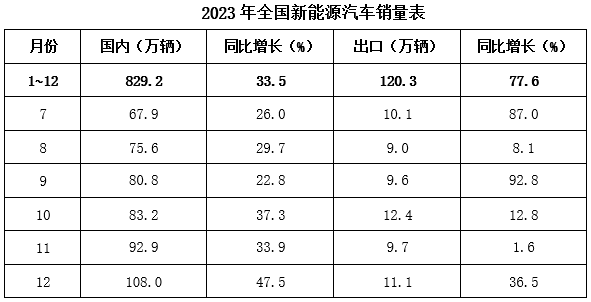
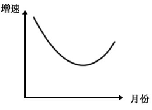
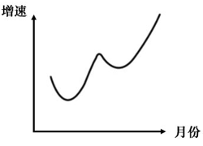
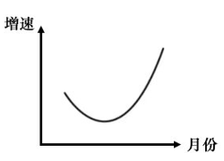
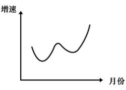
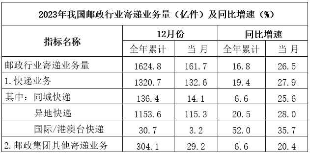

# 2024年湖北省选调生招录考试综合知识和行政职业能力测验试卷（网友回忆版）

> 资料分析 · 15 题 · 湖北 2024

## 材料 1

        根据中国汽车工业协会统计，2023年我国新能源汽车保持快速增长，产销量再创历史新高。新能源汽车产销分别完成958.7万辆和949.5万辆，同比分别增长35.8%和37.9%，市场占有率达到31.6%。

### 第 1 题　qid 17764855 · 综合

2023年上半年新能源汽车国内销量约为多少万辆？

- **A**. 197
- **B**. 321　✅
- **C**. 441
- **D**. 508

**答案**：B

**官方解析**

定位表格可知2023年全年及下半年各月新能源汽车的国内销量。则2023年上半年新能源汽车国内销量=2023年1~12月新能源汽车国内销量-2023年下半年新能源汽车国内销量万辆，与B项最接近。

故正确答案为B。

---

### 第 2 题　qid 17764857 · 综合

2022年我国新能源汽车国内销量是出口销量的约多少倍？

- **A**. 7
- **B**. 8
- **C**. 9　✅
- **D**. 10

**答案**：C

**官方解析**

根据题干“2022年······是······的约多少倍”，结合材料时间为2023年，可判定本题为基期倍数问题。定位表格可得：2023年，我国新能源汽车国内销量为829.2万辆（A），同比增长33.5%（a）；出口销量为120.3万辆（B），同比增长77.6%（b）。根据公式：基期倍数，则题干所求倍，与C项最接近。

故正确答案为C。

---

### 第 3 题　qid 17764858 · 增长

2023年8~12月，我国新能源汽车国内销量和出口销量环比均增长的月份有几个？

- **A**. 2
- **B**. 3　✅
- **C**. 4
- **D**. 5

**答案**：B

**官方解析**

定位表格可知2023年7~12月各月我国新能源汽车的国内销量与出口销量。观察发现，2023年8~12月我国新能源汽车国内销量环比增长的月份有：8月、9月、10月、11月、12月；出口销量环比增长的月份有：9月、10月、12月。因此，2023年8~12月我国新能源汽车国内销量和出口销量环比均增长的月份有：9月、10月、12月，共3个。
故正确答案为B。

---

### 第 4 题　qid 17764865 · 增长

以下哪张曲线图能准确反映2023年8~12月新能源汽车国内销量环比增速变化情况？

- **A**. 

- **B**. 

- **C**. 

　✅
- **D**. 

**答案**：C

**官方解析**

根据题干“······2023年8~12月······环比增速变化情况”，可判定本题为一般增长率问题。定位表格可知2023年7~12月各月我国新能源汽车的国内销量。根据公式：增长率，则2023年8~12月各月我国新能源汽车国内销量环比增速分别为：

8月，；

9月，；

10月，；

11月，；

12月，。

比较可知，2023年8~12月环比增速呈先下降后上升的趋势，排除B、D两项；由于8月环比增速＜12月环比增速，即曲线图的起点应低于终点，排除A项。

故正确答案为C。

---

### 第 5 题　qid 17764866 · 综合

能够从上述资料中推出的是：

- **A**. 2023年我国新能源汽车产量与销量之差小于2022年　✅
- **B**. 2023年8~12月我国新能源汽车出口销量环比增速逐渐增大
- **C**. 2023年7~12月我国新能源汽车国内销量与出口销量之比逐渐增大
- **D**. 2022年和2023年我国新能源汽车销量（国内销量+出口销量）均超过700万辆

**答案**：A

**官方解析**

A项：定位文字材料可得：2023年我国新能源汽车产销分别完成958.7万辆和949.5万辆，同比分别增长35.8%和37.9%。2023年我国新能源汽车产销量之差=958.7-949.5=9.2万辆，根据公式：基期量，则2022年我国新能源汽车产销量之差万辆，故2023年产销量之差&lt;2022年产销量之差，正确；

B项：定位表格可知2023年7~12月各月我国新能源汽车的出口销量。根据公式：增长率，则2023年10月我国新能源汽车出口销量环比增速，11月环比增速。比较可知，10月环比增速&gt;11月环比增速，则环比增速并非逐渐增大，错误；

C项：定位表格可知2023年7~12月我国新能源汽车国内销量与出口销量。则2023年9月我国新能源汽车国内销量与出口销量之比，10月国内销量与出口销量之比。比较可知，9月国内销量与出口销量之比&gt;10月国内销量与出口销量之比，则销量之比并非逐渐增大，错误；

D项：定位文字材料可得：2023年我国新能源汽车销量949.5万辆，同比增长37.9%。根据公式：基期量，则2022年我国新能源汽车销量万辆&lt;700万辆，错误。

故正确答案为A。

---

## 材料 2

        2024年春节假期（2月10~17日），全社会跨区域人员流动量累计达22.93亿人次，其中：铁路客运量9946万人次，公路人员流动量21.67亿人次，水路客运量941万人次，民航客运量1799万人次。

        2024年春节假期，全国边检机关共保障1351.7万人次中外人员出入境，日均169万人次，较2023年春节同期增长2.8倍，恢复至2019年春节同期的近九成，其中单日最高客流量出现在2月12日（正月初三），达185.7万人次。珠海拱北、深圳罗湖、深圳福田等口岸春节假期日均客流量分别达26万、18.7万、15.8万人次；上海浦东、广州白云、北京首都机场日均客流量分别达8.8万、3.7万、3.4万人次，较2023年春节假期分别增长4.9倍、6.2倍、7.5倍。

        2024年春节假期，全国民航累计运输旅客1799.2万人次，日均运输旅客224.9万人次创历史新高。全国共保障航班13.7万班，日均17117班，较2019年增长4.9%，较2023年增长33.2%。其中国内客运日均14138班，较2019年增长17.7%，较2023年增长23.5%。航班正常率92.7%，较2019年提高9.2个百分点，较2023年下降5.5个百分点。

### 第 6 题　qid 17764864 · 比重

2024年春节假期，公路人员流动量占全社会跨区域人员流动量的比重约为：

- **A**. 86.3%
- **B**. 89.9%
- **C**. 94.5%　✅
- **D**. 97.7%

**答案**：C

**官方解析**

根据题干“2024年春节假期······占······的比重约为”，结合材料时间为2024年春节假期，可判定本题为现期比重问题。定位材料第一段可知：2024年春节假期（2月10~17日），全社会跨区域人员流动量累计达22.93亿人次，其中：公路人员流动量21.67亿人次。根据公式：比重，则所求比重，与C项最接近。

故正确答案为C。

---

### 第 7 题　qid 17764867 · 比重

2023年春节假期中外人员日均出入境人次占2019年同期的比例最接近以下哪个数值？

- **A**. 

- **B**. 

- **C**. 

　✅
- **D**. 

**答案**：C

**官方解析**

根据题干“2023年春节假期······占2019年同期的比例最接近以下哪个数值”，可判定本题为比值计算问题。定位材料第二段可知：2024年春节假期······中外人员出入境，日均169万人次，较2023年春节同期增长2.8倍，恢复至2019年春节同期的近九成。根据公式：基期量，则2023年春节假期中外人员日均出入境人次；2019年春节假期中外人员日均出入境人次接近，故所求比例接近。

故正确答案为C。

---

### 第 8 题　qid 17764868 · 综合

2023年春节假期，上海浦东、广州白云、北京首都机场日均客流量由高到低排名正确的是：

- **A**. 上海浦东、北京首都、广州白云
- **B**. 上海浦东、广州白云、北京首都　✅
- **C**. 广州白云、上海浦东、北京首都
- **D**. 广州白云、北京首都、上海浦东

**答案**：B

**官方解析**

根据题干“2023年春节假期······日均客流量由高到低排名正确的是”，结合材料时间为2024年，可判定本题为基期比较问题。定位材料第二段可得：2024年春节假期，上海浦东、广州白云、北京首都机场日均客流量分别达8.8万、3.7万、3.4万人次，较2023年春节假期分别增长4.9倍、6.2倍、7.5倍。根据公式：基期量，则2023年春节假期上海浦东机场日均客流量为万人次，广州白云机场为万人次，北京首都机场为万人次。故2023年春节假期，三大机场日均客流量由高到低排名依次是上海浦东、广州白云、北京首都。

故正确答案为B。

---

### 第 9 题　qid 17764870 · 平均数

下列关于民航运输情况说法正确的有几项?
①2024年春节假期，平均每个航班运输旅客超过130人次
②2024年春节假期，国内客运日均航班数比2023年多2千多班
③2023年春节假期，航班正常率比2019年高14.7个百分点

- **A**. 0
- **B**. 1
- **C**. 2
- **D**. 3　✅

**答案**：D

**官方解析**

①定位材料第三段可得：2024年春节假期，全国民航累计运输旅客1799.2万人次，共保障航班13.7万班。根据公式：平均数，则平均每个航班运输旅客人次，超过130人次，正确；

②定位材料第三段可得：2024年春节假期，国内客运日均航班14138班，较2023年增长23.5%。根据公式：增长量，则所求增长量班，正确；

③定位材料第三段可得：2024年春节假期，航班正常率92.7%，较2019年提高9.2个百分点，较2023年下降5.5个百分点。则2023年春节假期航班正常率比2019年高（92.7%+5.5%）-（92.7%-9.2%）=5.5%+9.2%=14.7%，即高14.7个百分点，正确。

综上所述，说法正确的有3项。

故正确答案为D。

---

### 第 10 题　qid 17764872 · 综合

不能从上述资料中推出的是：

- **A**. 
2024年春节假期，水路客运量不到铁路的10%

- **B**. 
2024年春节假期，深圳罗湖日均客流量超过深圳福田15%以上

- **C**. 
2024年，2月12日出入境人次占春节假期出入境人次的比例超过
　✅
- **D**. 
2024年春节假期，民航国内客运日均班数占民航日均班数比重超过8成

**答案**：C

**官方解析**

A项：定位材料第一段可得：2024年春节假期，铁路客运量9946万人次，水路客运量941万人次。&lt;10%，即水路客运量不到铁路的10%，正确；

B项：定位材料第二段可得：2024年春节假期，深圳罗湖、深圳福田口岸日均客流量分别达18.7万、15.8万人次。则题干所求为&gt;15%，即深圳罗湖日均客流量超过深圳福田15%以上，正确；

C项：定位材料第二段可得：2024年春节假期，全国边检机关共保障1351.7万人次中外人员出入境，其中单日最高客流量出现在2月12日，达185.7万人次。根据公式：比重，则题干所求为，即2月12日出入境人次占春节假期出入境人次的比例未超过，错误；

D项：定位材料第三段可得：2024年春节假期，全国民航日均17117班，其中国内客运日均14138班。根据公式：比重，则题干所求为，即民航国内客运日均班数占民航日均班数比重超过8成，正确。

本题为选非题，故正确答案为C。

---

## 材料 3

        2023年，我国邮政行业业务收入（不含邮储银行直接营业收入）累计完成15293亿元，同比增长13.2%，其中快递业务收入累计完成12074亿元，同比增长14.3%。

        2023年，快递业务收入中，同城、异地、国际/港澳台快递及其他快递收入的比重分别为5.9%、49.7%、11.6%和32.8%，比重同比分别上升-1.3、0.8、0.5和0个百分点。东、中、西部地区快递业务量的比重分别为75.2%、16.7%和8.1%，业务收入比重分别为76.2%、14.1%和9.7%。与2022年相比，东部地区快递业务量比重下降1.6个百分点，快递业务收入比重下降1.4个百分点；中部地区快递业务量比重上升1.0个百分点，快递业务收入比重上升0.7个百分点；西部地区快递业务量比重上升0.6个百分点，快递业务收入比重上升0.7个百分点。

        2023年，我国快递业务量排名前五的城市分别是金华市、广州市、深圳市、揭阳市和杭州市，业务量分别为136.9亿件、114.5亿件、63.7亿件、40.7亿件和40.1亿件；快递业务收入排名前五的城市分别是上海市、广州市、深圳市、金华市和杭州市，快递业务收入分别为2089.4亿元、892.2亿元、668.4亿元、372.3亿元和366.7亿元。

### 第 11 题　qid 17764929 · 比重

2023年，我国邮政行业业务收入（不含邮储银行直接营业收入）中，快递业务收入占比最接近几成？

- **A**. 九成
- **B**. 八成　✅
- **C**. 七成
- **D**. 六成

**答案**：B

**官方解析**

根据题干“2023年······占比······”，结合材料时间为2023年，可判定本题为现期比重问题。定位文字材料第一段可得：2023年，我国邮政行业业务收入（不含邮储银行直接营业收入）累计完成15293亿元，其中快递业务收入累计完成12074亿元。根据公式：比重，则题干所求，即2023年我国邮政行业业务收入（不含邮储银行直接营业收入）中，快递业务收入占比最接近八成。

故正确答案为B。

---

### 第 12 题　qid 17764930 · 平均数

2023年，我国平均每件同城快递实现业务收入约多少元？

- **A**. 4.6
- **B**. 4.8
- **C**. 5.2　✅
- **D**. 5.6

**答案**：C

**官方解析**

根据题干“2023年······平均每件······”，结合材料时间为2023年，可判断本题为现期平均数问题。定位文字材料第一、二段可得：2023年，我国快递业务收入累计完成12074亿元，其中同城快递收入的比重为5.9%。定位表格材料可得：2023年，我国同城快递业务量为136.4亿件。根据公式：部分=整体×比重，则2023年我国同城快递收入亿元。根据公式：平均每件同城快递实现业务收入，则2023年我国平均每件同城快递实现业务收入元。

故正确答案为C。

---

### 第 13 题　qid 17764932 · 综合

以下四个城市中，2023年单件快递实现的业务收入最高的城市是：

- **A**. 上海　✅
- **B**. 广州
- **C**. 深圳
- **D**. 杭州

**答案**：A

**官方解析**

根据题干“······2023年单件快递实现的业务收入······”，结合材料时间为2023年，可判定本题为现期平均数问题。定位文字材料第三段可得：2023年，我国快递业务量排名前五的城市分别是金华市、广州市、深圳市、揭阳市和杭州市，业务量分别为136.9亿件、114.5亿件、63.7亿件、40.7亿件和40.1亿件；快递业务收入排名前五的城市分别是上海市、广州市、深圳市、金华市和杭州市，快递业务收入分别为2089.4亿元、892.2亿元、668.4亿元、372.3亿元和366.7亿元。根据公式：单件快递实现的业务收入，由于上海快递业务量不在全国快递业务量前五名，可得上海快递业务量低于40.1亿件（排名第5的杭州快递业务量），则其单件快递实现的业务收入高于元，其余三个城市单件快递实现的业务收入分别为：广州，元；深圳，元；杭州，元。故上述四个城市中，2023年单件快递实现的业务收入最高的城市是上海。 

故正确答案为A。

---

### 第 14 题　qid 17764933 · 综合

2022年，我国东部地区快递业务量约为多少亿件？

- **A**. 732
- **B**. 849　✅
- **C**. 1086
- **D**. 1103

**答案**：B

**官方解析**

根据题干“2022年······约为多少亿件”，结合材料时间为2023年，可判定本题为基期计算问题。定位统计表可知：2023年我国快递业务量为1320.7亿件，同比增速为19.4%。根据公式：基期量，可得2022年我国快递业务量为亿件。定位文字材料第二段可知：2023年东部地区快递业务量的比重为75.2%，与2022年相比，东部地区快递业务量比重下降1.6个百分点。可得2022年东部地区快递业务量的比重为75.2%+1.6%=76.8%，根据公式：部分=整体×比重，可得2022年我国东部地区快递业务量为亿件，与B项最接近。

故正确答案为B。

---

### 第 15 题　qid 17764936 · 综合

根据所给材料，下列表述错误的是：

- **A**. 我国2023年12月的异地快递业务量约占全年异地快递业务量的10%
- **B**. 我国2023年12月的邮政集团其他寄递业务量大于同年1-11月的月均值
- **C**. 2023年，我国中部地区实现的快递业务量是西部地区的2倍以上
- **D**. 2022~2023年，我国国际/港澳台年均快递业务量超过27亿件　✅

**答案**：D

**官方解析**

A项：定位统计表可得：2023年全年累计和12月我国异地快递业务量分别为1153.6亿件和115.3亿件。根据公式：比重，则我国2023年12月的异地快递业务量占全年异地快递业务量的比重，正确；

B项：定位统计表可得：2023年全年累计和12月邮政集团其他寄递业务量分别为304.1亿件和29.2亿件。则1~11月邮政集团其他寄递业务量=全年邮政集团其他寄递业务量-12月邮政集团其他寄递业务量=304.1-29.2=274.9亿件。根据公式：月均值，则2023年1-11月邮政集团其他寄递业务量月均值亿件&lt;29.2亿件，即我国2023年12月的邮政集团其他寄递业务量大于同年1-11月的月均值，正确；

C项：定位文字材料第二段可得：2023年我国中、西部地区快递业务量的比重分别为16.7%和8.1%。根据公式：部分=整体×比重，则倍，即2倍以上，正确；

D项：定位统计表可得：2023年国际/港澳台快递业务量30.7亿件，同比增速52.0%。根据公式：基期量，则2022年国际/港澳台快递业务量亿件。根据公式：年均快递业务量，则2022~2023年我国国际/港澳台年均快递业务量亿件&lt;27亿件，错误。

本题为选非题，故正确答案为D。

---
