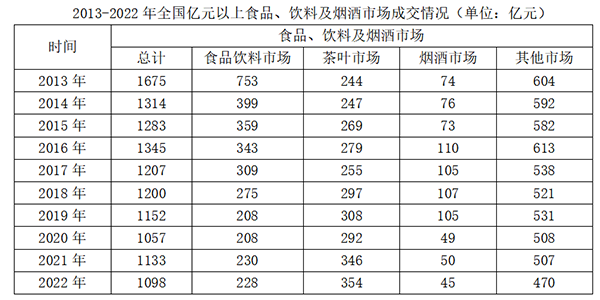
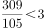
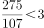
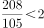
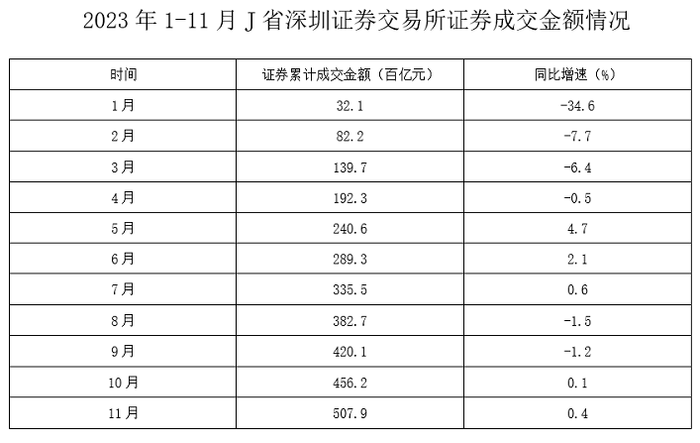
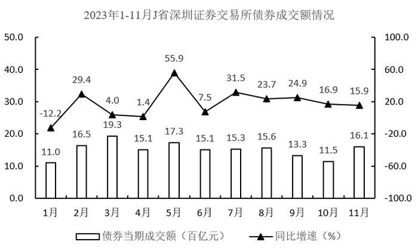
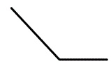

# 2024年辽宁省公务员录用考试《行测》题（网友回忆版）

> 资料分析 · 20 题 · 辽宁 2024

## 材料 1

        2023年前三季度，规模以上文化及相关产业企业（简称文化企业）实现营业收入91619亿元，同比增长7.7%。其中，文化新业态特征较为明显的16个行业小类实现营业收入36870亿元，同比增长15.2%。

        分产业类型看，文化制造业实现营业收入29007亿元，同比下降1.0%；文化批发和零售业15024亿元，同比增长5.3%；文化服务业47588亿元，同比增长14.6%。

        分领域看，文化核心领域实现营业收入59507亿元，同比增长12.4%；文化相关领域32112亿元，同比下降0.1%。

        分行业类别看，新闻信息服务实现营业收入12203亿元，同比增长14.9%；内容创作生产19857亿元，同比增长10.3%；创意设计服务14973亿元，同比增长9.6%；文化传播渠道10712亿元，同比增长12.4%；文化投资运营473亿元，同比增长27.7%；文化娱乐休闲服务1289亿元，同比增长67.2%；文化生产和中介服务10894亿元，同比下降1.5%；文化装备生产4443亿元，同比下降4.3%；文化消费终端生产16775亿元，同比增长2.1%。

        分区域看，东部地区实现营业收入71959亿元，同比增长8.1%；中部地区10600亿元，同比增长1.9%；西部地区8196亿元，同比增长12.2%；东北地区864亿元，同比增长7.0%。前三季度，文化企业实现利润总额7508亿元，同比增长31.4%。前三季度末，文化企业资产总计192849亿元，同比增长6.7%。

### 第 1 题　qid 10204591 · 综合

2022年前三季度，文化服务业实现营业收入约是文化批发和零售业营业收入的：

- **A**. 不到2.5倍
- **B**. 2.5~3倍　✅
- **C**. 3~3.5倍
- **D**. 3.5倍以上

**答案**：B

**官方解析**

根据题干“2022年前三季度······是······”，结合材料时间为2023年前三季度，且选项单位为“倍”，可判定本题为基期倍数问题。定位文字材料第二段：2023年前三季度，文化批发和零售业15024亿元（B），同比增长5.3%（b）；文化服务业47588亿元（A），同比增长14.6%（a）。根据公式：基期倍数，可得2022年前三季度，文化服务业实现营业收入是文化批发和零售业营业收入的倍，在B项范围内。

故正确答案为B。

---

### 第 2 题　qid 10204595 · 增长

2023年前三季度，营业收入超过1.2万亿元的行业，按同比增速由大到小排序正确的是：

- **A**. 内容创作生产、文化消费终端生产、创意设计服务、新闻信息服务
- **B**. 创意设计服务、文化消费终端生产、文化传播渠道、内容创作生产
- **C**. 新闻信息服务、内容创作生产、创意设计服务、文化消费终端生产　✅
- **D**. 创意设计服务、新闻信息服务，文化消费终端生产、内容创作生产

**答案**：C

**官方解析**

定位文字材料第四段可知，2023年前三季度各行业类别营业收入及同比增速。其中，营业收入超过1.2万亿元的行业有新闻信息服务、内容创作生产、创意设计服务、文化消费终端生产共4个，营业收入同比增速依次为14.9%、10.3%、9.6%、2.1%。因此按照同比增速由大到小排序为新闻信息服务、内容创作生产、创意设计服务、文化消费终端生产。
故正确答案为C。

---

### 第 3 题　qid 10204593 · 综合

2023年前三季度，实现营业收入最高的文化行业，其2022年前三季度的营业收入大约是：

- **A**. 不到1.4万亿元
- **B**. 1.4~1.8万亿元
- **C**. 1.8~2.2万亿元　✅
- **D**. 超过2.2万亿元

**答案**：C

**官方解析**

根据题干“······2022年前三季度的营业收入大约是”，结合材料时间为2023年前三季度，可判定本题为基期计算问题。定位文字材料第四段可知2023年前三季度分行业类别看各行业营业收入和同比增速。比较可得，内容创作生产实现营业收入（19857亿元）最高，同比增长10.3%。根据公式：基期量，则2022年前三季度内容创作生产实现营业收入万亿元，在C项范围内。

故正确答案为C。

---

### 第 4 题　qid 10204616 · 综合

2023年前三季度，文化企业利润总额与营业收入的比值约比上一年：

- **A**. 降低了1.8个百分点
- **B**. 降低了1.5个百分点
- **C**. 提高了1.8个百分点
- **D**. 提高了1.5个百分点　✅

**答案**：D

**官方解析**

根据题干“2023年前三季度······的比值约比上一年”，结合选项为提高了/降低了+百分点，可判定本题为两期比重问题。定位文字材料第一段可得，2023年前三季度，规模以上文化企业（简称文化企业）实现营业收入91619亿元（B），同比增长7.7%（b）；定位文字材料最后一段可得，前三季度，文化企业实现利润总额7508亿元（A），同比增长31.4%（a）。根据公式：两期比重差，则所求两期比重差，即约提高了1.5个百分点。

故正确答案为D。

---

### 第 5 题　qid 10204618 · 综合

下列说法错误的是：

- **A**. 2022年前三季度，文化新业态特征较为明显的16个行业小类的营业收入占文化企业营业收入比重超过40%　✅
- **B**. 2023年前三季度，文化核心领域实现营业收入同比增量超过文化企业实现营业收入同比增量
- **C**. 2022年前三季度，中部地区文化企业实现营业收入比西部地区多3000亿元以上
- **D**. 2023年前三季度，每百元资产实现营业收入比上一年高

**答案**：A

**官方解析**

A项：定位文字材料第一段可得，2023年前三季度，规模以上文化企业（简称文化企业）实现营业收入91619亿元（B），同比增长7.7%（b），其中，文化新业态特征较为明显的16个行业小类实现营业收入36870亿元（A），同比增长15.2%（a）。根据公式：基期比重，则所求比重，错误；

B项：定位文字材料第一段和第三段可得，2023年前三季度，规模以上文化企业（简称文化企业）实现营业收入91619亿元，同比增长7.7%，文化核心领域实现营业收入59507亿元，同比增长12.4%。根据公式：增长量，则2023年前三季度文化核心领域实现营业收入同比增量亿元，文化企业实现营业收入同比增量亿元，文化核心领域实现营业收入同比增量（6610亿元）&gt;文化企业实现营业收入同比增量（6540亿元），正确；

C项：定位文字材料最后一段可得，2023年前三季度中部地区文化企业实现营业收入10600亿元，同比增长1.9%；西部地区文化企业实现营业收入8196亿元，同比增长12.2%。根据公式：基期量，则2022年前三季度中部地区文化企业实现营业收入比西部地区多亿元亿元，即多3000亿元以上，正确；

D项：定位文字材料第一段和最后一段可得，2023年前三季度，规模以上文化企业（简称文化企业）实现营业收入91619亿元（A），同比增长7.7%（a）；文化企业资产总计192849亿元（B），同比增长6.7%（b）。根据公式：每百元资产实现营业收入，结合两期平均数比较结论：当a&gt;b时，平均数上升，则2023年前三季度每百元资产实现营业收入比上一年高，正确。

本题为选非题，故正确答案为A。

---

## 材料 2

### 第 6 题　qid 10204596 · 综合

2013-2022年，中国与共建国家进出口总额合计约为：

- **A**. 至少20万亿美元
- **B**. 在17-20万亿美元之间　✅
- **C**. 在14-17万亿美元之间
- **D**. 至多14万亿美元

**答案**：B

**官方解析**

定位统计图可知2013-2022年中国与共建国家每年的进出口总额。则题目所求=1.63+1.74+1.54+1.42+1.63+1.88+1.94+1.93+2.53+2.84=19.08万亿美元，在B项范围内。
故正确答案为B。

---

### 第 7 题　qid 10204598 · 增长

2013-2022年，中国与共建国家进出口总额最低的年份，中国外贸总值比上年同期：

- **A**. 下降了10%以上
- **B**. 下降了不到10%　✅
- **C**. 上升了10%以上
- **D**. 上升了不到10%

**答案**：B

**官方解析**

根据题干“2013-2022年······比上年同期”，结合选项为上升/下降+百分数，可判定本题为一般增长率问题。定位统计图可得2013-2022年，中国与共建国家进出口总额及其占中国外贸总值比重。观察可得，2013-2022年，中国与共建国家进出口总额最低的年份为2016年（1.42万亿美元）。根据公式：整体、增长率，则所求为，即下降了不到10%。

故正确答案为B。

---

### 第 8 题　qid 10204599 · 增长

2014-2022年，中国与共建国家进出口总额同比增长率为正值的年份有：

- **A**. 3个
- **B**. 4个
- **C**. 5个
- **D**. 6个　✅

**答案**：D

**官方解析**

定位统计图可得：2013-2022年中国与共建国家进出口总额分别为1.63万亿美元、1.74万亿美元、1.54万亿美元、1.42万亿美元、1.63万亿美元、1.88万亿美元、1.94万亿美元、1.93万亿美元、2.53万亿美元、2.84万亿美元。比较可知，2014-2022年，中国与共建国家进出口总额同比增长率为正值（即现期量&gt;基期量）的年份有2014年（1.74万亿美元&gt;1.63万亿美元）、2017年（1.63万亿美元&gt;1.42万亿美元）、2018年（1.88万亿美元&gt;1.63万亿美元）、2019年（1.94万亿美元&gt;1.88万亿美元）、2021年（2.53万亿美元&gt;1.93万亿美元）、2022年（2.84万亿美元&gt;2.53万亿美元），共6个。
故正确答案为D。

---

### 第 9 题　qid 10204601 · 综合

2021年，中国外贸总值比2013年多：

- **A**. 不到2.1万亿美元　✅
- **B**. 2.1-2.3万亿美元
- **C**. 2.3-2.5万亿美元
- **D**. 超过2.5万亿美元

**答案**：A

**官方解析**

根据题干“2021年，中国外贸总值比2013年多”，结合选项均带单位，且材料给出2021年、2013年中国与共建国家进出口总额及其占中国外贸总值比重，可判定本题为现期比重问题。定位统计图可得：2021年，中国与共建国家进出口总额为2.53万亿美元，占中国外贸总值的比重为42.2%；2013年，中国与共建国家进出口总额为1.63万亿美元，占中国外贸总值的比重为39.2%。根据公式：整体，则2021年中国外贸总值比2013年多万亿美元，不到2.1万亿美元。

故正确答案为A。

---

### 第 10 题　qid 10204602 · 综合

下列说法错误的是：

- **A**. 2021年，中国外贸总值首次超过5万亿美元
- **B**. 2015-2017年，中国外贸总值的年平均值不超过4万亿美元
- **C**. 2021年，中国与共建国家进出口总额增长率低于2022年　✅
- **D**. 2022年，中国与共建国家进出口总额比2013年增长了约74%

**答案**：C

**官方解析**

A项：定位统计图可得2013-2021年中国与共建国家进出口总额及其占中国外贸总值比重。根据公式：整体，则2013-2021年，中国外贸总值分别为：2013年，万亿美元；2014年，万亿美元；2015年，万亿美元；2016年，万亿美元；2017年，万亿美元；2018年，万亿美元；2019年，万亿美元；2020年，万亿美元；2021年，万亿美元，则2021年中国外贸总值首次超过5万亿美元，正确；

B项：定位统计图可得，2015-2017年，中国与共建国家进出口总额分别为1.54万亿美元、1.42万亿美元、1.63万亿美元，其占中国外贸总值比重分别为38.9%、38.6%、39.6%。根据公式：整体，则2015-2017年，中国外贸总值的年平均值万亿美元，正确；

C项：定位统计图可得，2020-2022年，中国与共建国家进出口总额分别为1.93万亿美元、2.53万亿美元、2.84万亿美元。根据公式：增长率，则2021年中国与共建国家进出口总额增长率，2022年增长率，由于前者的分子大且分母小，则前者分数较大，即2021年中国与共建国家进出口总额增长率高于2022年，错误；

D项：定位统计图可得，2013年、2022年中国与共建国家进出口总额分别为1.63万亿美元、2.84万亿美元。根据公式：增长率，则2022年，中国与共建国家进出口总额较2013年的增长率，正确。

本题为选非题，故正确答案为C。

备注：对于本题A项，根据材料数据无法计算2012年及以前的中国外贸总值，因此无法比较2012年及以前的中国外贸总值是否超过5万亿美元。但结合其他选项有明显错误，粉笔择优选择C项为正确答案。

---

## 材料 3

### 第 11 题　qid 10204578 · 综合

2013-2022年，全国亿元以上食品、饮料及烟酒市场成交额为：

- **A**. 不到1.2万亿元
- **B**. 1.2-1.3万亿元　✅
- **C**. 1.3-1.4万亿元
- **D**. 超过1.4万亿元

**答案**：B

**官方解析**

定位统计表可知2013-2022年各年全国亿元以上食品、饮料及烟酒市场成交额。则总成交额亿元=1.25万亿元，在B项范围内。

故正确答案为B。

---

### 第 12 题　qid 10204579 · 增长

2014-2022年，全国亿元以上食品、饮料及烟酒市场成交额同比增量最高的年份，其茶叶市场成交额同比增速为：

- **A**. 不到10%
- **B**. 10%-15%
- **C**. 15%-20%　✅
- **D**. 超过20%

**答案**：C

**官方解析**

根据题干“······同比增速为”，可判定本题为一般增长率问题。定位统计表可得：2014-2022年，全国亿元以上食品、饮料及烟酒市场成交额。观察发现，只有2016年、2021年的成交额同比增加。根据公式：增长量=现期量-基期量，则2016年成交额同比增量=1345-1283=62亿元，2021年成交额同比增量=1133-1057=76亿元，可知成交额同比增量最高的年份为2021年。根据公式：增长率，则2021年茶叶市场成交额同比增速，在C项范围内。

故正确答案为C。

---

### 第 13 题　qid 10204580 · 综合

2013-2022年，全国亿元以上食品饮料市场成交额超过烟酒市场3倍以上的年份有：

- **A**. 6个
- **B**. 7个　✅
- **C**. 8个
- **D**. 9个

**答案**：B

**官方解析**

根据题干“2013-2022年······超过······3倍以上的年份有”，结合材料时间为2013-2022年，可判定本题为现期倍数问题。定位统计表可得2013-2022年全国亿元以上食品饮料市场成交额及烟酒市场成交额。分别计算各年的倍数关系：

2013：；2014：；2015：；2016：；2017：；2018：；2019：；2020：；2021：；2022：。

其中食品饮料市场成交额超过烟酒市场3倍以上的年份有2013年、2014年、2015年、2016年、2020年、2021年、2022年，共7个。

故正确答案为B。

---

### 第 14 题　qid 10204581 · 比重

2016-2018年，全国亿元以上茶叶市场成交总额占食品、饮料及烟酒市场成交总额的比重为：

- **A**. 不到15%
- **B**. 15%-20%
- **C**. 20%-25%　✅
- **D**. 超过25%

**答案**：C

**官方解析**

根据题干“2016-2018年······占······的比重为”，结合材料给出2016-2018年具体值，可判定本题为现期比重问题。定位统计表可得，2016-2018年全国亿元以上茶叶市场成交总额分别为279、255、297亿元，亿元以上食品、饮料及烟酒市场成交总额分别为1345、1207、1200亿元。根据公式：比重，则所求比重，在C项范围内。

故正确答案为C。

---

### 第 15 题　qid 10204582 · 增长

2017年，食品饮料市场、茶叶市场、烟酒市场和其他市场成交额同比增速由大到小排序正确的是：

- **A**. 茶叶市场、食品饮料市场、其他市场、烟酒市场
- **B**. 其他市场、食品饮料市场、茶叶市场、烟酒市场
- **C**. 烟酒市场、食品饮料市场、茶叶市场、其他市场
- **D**. 烟酒市场、茶叶市场、食品饮料市场、其他市场　✅

**答案**：D

**官方解析**

根据题干“2017年······同比增速由大到小排序正确的是”，可判定本题为一般增长率比较问题。定位统计表可得2016年、2017年食品饮料市场、茶叶市场、烟酒市场和其他市场成交额。根据公式：增长率，可得2017年各市场同比增速分别为：

食品饮料市场，；

茶叶市场，；

烟酒市场，；

其他市场，。

因此，2017年同比增速由大到小排序为烟酒市场、茶叶市场、食品饮料市场、其他市场。

故正确答案为D。

---

## 材料 4

### 第 16 题　qid 10204605 · 增长

2023年11月J省深圳证券交易所债券当期成交额同比增量为：

- **A**. 不到2百亿元
- **B**. 2-2.5百亿元　✅
- **C**. 2.5-3百亿元
- **D**. 超过3百亿元

**答案**：B

**官方解析**

根据题干“2023年11月······同比增量为”，可判定本题为增长量计算问题。定位统计图可得：2023年11月J省深圳证券交易所债券当期成交额为16.1百亿元，同比增长了15.9%。根据公式：增长量百亿元，在B项范围内。

故正确答案为B。

---

### 第 17 题　qid 10204606 · 平均数

2023年上半年J省深圳证券交易所债券平均成交额为：

- **A**. 不到15百亿元
- **B**. 15-16百亿元　✅
- **C**. 16-17百亿元
- **D**. 超过17百亿元

**答案**：B

**官方解析**

根据题干“2023年上半年······平均成交额为”，可判定本题为现期平均数问题。定位统计图可得：2023年上半年（1-6月）J省深圳证券交易所债券当期成交额分别为11.0百亿元、16.5百亿元、19.3百亿元、15.1百亿元、17.3百亿元、15.1百亿元。则所求平均数百亿元，在B项范围内。

故正确答案为B。

---

### 第 18 题　qid 10204607 · 比重

2023年1-11月J省深圳证券交易所债券当期成交额占证券当期成交金额的比重超过的月份有：

- **A**. 3个
- **B**. 4个　✅
- **C**. 5个
- **D**. 6个

**答案**：B

**官方解析**

根据题干“2023年1-11月······占······的比重······”，结合材料时间为2023年1-11月，可判定本题为现期比重问题。定位统计表和统计图可知：2023年1-11月J省深圳证券交易所证券累计成交金额和债券当期成交额。2023年1-11月J省深圳证券交易所证券当期成交金额及债券当期成交额占证券当期成交金额的比重分别为：

1月证券当期成交金额为：32.1百亿元，所求比重为：，满足；

2月证券当期成交金额为：82.2-32.1=50.1百亿元，所求比重为：，不满足；

3月证券当期成交金额为：139.7-82.2=57.5百亿元，所求比重为：，满足；

4月证券当期成交金额为：192.3-139.7=52.6百亿元，所求比重为：，不满足；

5月证券当期成交金额为：240.6-192.3=48.3百亿元，所求比重为：，满足；

6月证券当期成交金额为：289.3-240.6=48.7百亿元，所求比重为：，不满足；

7月证券当期成交金额：335.5-289.3=46.2百亿元，所求比重为：，不满足；

8月证券当期成交金额：382.7-335.5=47.2百亿元，所求比重为：，不满足；

9月证券当期成交金额：420.1-382.7=37.4百亿元，所求比重为：，满足；

10月证券当期成交金额：456.2-420.1=36.1百亿元，所求比重为：，不满足；

11月证券当期成交金额：507.9-456.2=51.7百亿元，所求比重为：，不满足。

综上可知，1月、3月、5月和9月满足题意，共4个月份。

故正确答案为B。

---

### 第 19 题　qid 10204608 · 比重

2023年6月J省深圳证券交易所证券当期成交金额占上半年的比重为：

- **A**. 不到15%
- **B**. 15%-20%　✅
- **C**. 20%-25%
- **D**. 超过25%

**答案**：B

**官方解析**

根据题干“2023年6月······占······比重为”，结合材料时间为2023年，可判定本题为现期比重问题。定位统计表可得：2023年5月、6月J省深圳证券交易所证券累计成交金额分别为240.6百亿元、289.3百亿元。则2023年6月J省深圳证券交易所证券当期成交金额为289.3-240.6=48.7百亿元。根据公式：比重，则题干所求，在B项范围内。

故正确答案为B。

---

### 第 20 题　qid 10204609 · 增长

下面能够反映2023年J省深圳证券交易所第三季度各月证券当期成交金额环比增速的折线图是：

- **A**. 

- **B**. 

- **C**. 

　✅
- **D**. 

**答案**：C

**官方解析**

根据题干“下面能够反映2023年······第三季度各月······环比增速的折线图是”，可判定本题为一般增长率比较问题。定位统计表可得：2023年5-9月各月J省深圳证券交易所证券累计成交金额分别为240.6百亿元、289.3百亿元、335.5百亿元、382.7百亿元、420.1百亿元。故2023年6-9月各月证券当期成交金额分别为：6月，289.3-240.6=48.7百亿元；7月，335.5-289.3=46.2百亿元；8月，382.7-335.5=47.2百亿元；9月，420.1-382.7=37.4百亿元。根据公式：增长率，则2023年J省深圳证券交易所第三季度各月证券当期成交金额环比增速分别为：7月，；8月，；9月，。比较可知，第三季度环比增速的变化为先上升，后下降，锁定C项。

故正确答案为C。

---
