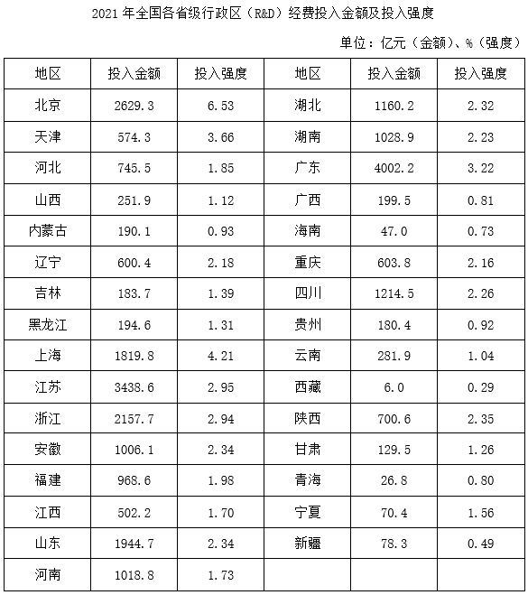
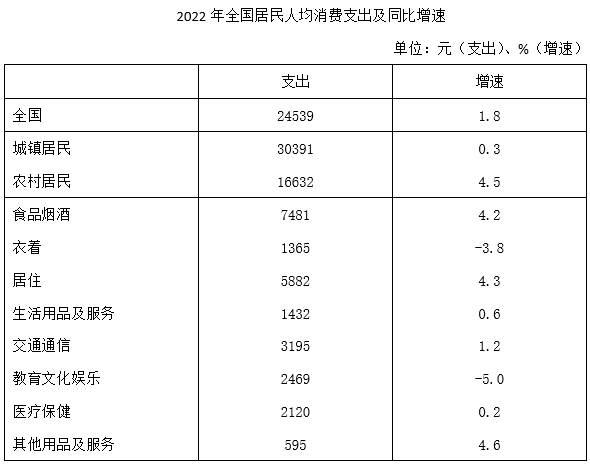
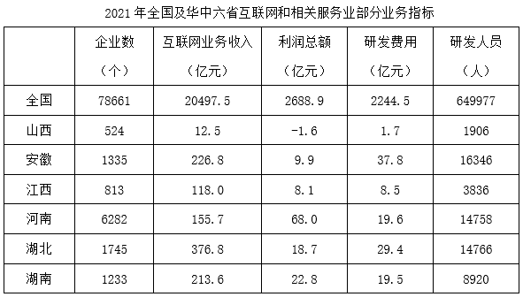

# 2024年重庆市定向选调优秀大学生到基层工作考试《行测》题

> 资料分析 · 15 题 · 选调 2024

## 材料 1

        2021年，全国共投入研究与试验发展（R&amp;D）经费27956.3亿元，同比增长14.6%，增速比上年加快4.4个百分点；研究与试验发展（R&amp;D）经费投入强度（与GDP之比）为2.44%，比上年提高0.03个百分点。

        分活动类型看，基础研究经费所占比重为6.50%，比上年提升0.49个百分点；应用研究和试验发展经费所占比重分别为11.3%和82.2%；应用研究经费同比增长14.1%；试验发展经费同比增长14.0%。

### 第 1 题　qid 14993564 · 增长

2021年，全国研究与试验发展（R&D）经费约比2019年增长了（    ）。

- **A**. 22.1%
- **B**. 24.8%
- **C**. 26.3%　✅
- **D**. 31.3%

**答案**：C

**官方解析**

根据题干“2021年······约比2019年增长了”，结合选项为百分数，可判定本题为间隔增长率问题。定位文字材料第一段可得：2021年，全国投入研究与试验发展（R&amp;D）经费同比增长14.6%（），增速比上年加快4.4个百分点。则2020年，全国投入研究与试验发展（R&amp;D）经费同比增长14.6%-4.4%=10.2%（）。根据公式：，可得所求。

故正确答案为C。

---

### 第 2 题　qid 14993567 · 比重

关于2021年全国①基础研究经费和②试验发展经费占研究与试验发展（R&D）经费的比重与上年相比的情况，以下描述正确的是（    ）。

- **A**. 仅①高于上年水平　✅
- **B**. 仅②高于上年水平
- **C**. ①和②均高于上年水平
- **D**. ①和②均低于上年水平

**答案**：A

**官方解析**

根据题干“关于2021年······占······比重与上年相比······”，可判定本题为两期比重问题。定位文字材料第一段可得：2021年，全国共投入研究与试验发展（R&D）经费同比增长14.6%；定位文字材料第二段可得：（2021年）基础研究经费所占比重为6.50%，比上年提升0.49个百分点；试验发展经费同比增长14.0%。则2021年全国基础研究经费占研究与试验发展（R&D）经费的比重与上年相比上升。根据两期比重比较结论：部分增长率&lt;总体增长率，则比重下降，14.0%&lt;14.6%，即2021年全国试验发展经费占研究与试验发展（R&D）经费的比重与上年相比下降。综上可知，2021年仅①基础研究经费的占比高于上年。
故正确答案为A。

---

### 第 3 题　qid 14993571 · 综合

2021年，研究与试验发展（R&D）经费投入强度高于全国总体水平的省级行政区有几个?

- **A**. 3
- **B**. 4
- **C**. 5
- **D**. 6　✅

**答案**：D

**官方解析**

定位文字材料第一段可得：2021年，全国研究与试验发展（R&D）经费投入强度（与GDP之比）为2.44%；定位统计表可得：2021年，研究与试验发展（R&D）经费投入强度高于全国总体水平（2.44%）的省级行政区有北京（6.53%）、天津（3.66%）、上海（4.21%）、江苏（2.95%）、浙江（2.94%）、广东（3.22%），共6个。
故正确答案为D。

---

### 第 4 题　qid 14993575 · 综合

2021年，安徽GDP约是宁夏的多少倍？

- **A**. 10　✅
- **B**. 15
- **C**. 21
- **D**. 26

**答案**：A

**官方解析**

根据题干“2021年······是······多少倍”，结合材料时间为2021年，可判定本题为现期倍数问题。定位统计表可得：（2021年）安徽共投入研究与试验发展（R&amp;D）经费1006.1亿元，投入强度（与GDP之比）为2.34%；宁夏共投入研究与试验发展（R&amp;D）经费70.4亿元，投入强度（与GDP之比）为1.56%。根据公式：整体，可得所求倍数倍。

故正确答案为A。

---

### 第 5 题　qid 14993577 · 比重

下列饼图反映了哪三个同一区域内的省级行政区2021年研究与试验发展（R&amp;D）经费的占比关系？

- **A**. 北京、天津、河北
- **B**. 陕西、甘肃、宁夏
- **C**. 黑龙江、吉林、辽宁
- **D**. 江苏、浙江、上海　✅

**答案**：D

**官方解析**

根据题干“······2021年······占比关系”，结合材料时间为2021年，可判定本题为现期比重问题。定位统计表可得2021年全国各省级行政区研究与试验发展（R&D）经费投入金额。结合饼图可知，三个省级行政区中，投入最高地区的经费金额小于其他两个区域之和，则各选项中大小关系分别为：
A项，北京的经费投入金额为2629.3亿元、天津的经费投入金额为574.3亿元、河北的经费投入金额为745.5亿元，2629.3&gt;574.3+745.5，不满足题意，排除；
B项，陕西的经费投入金额为700.6亿元、甘肃的经费投入金额为129.5亿元、宁夏的经费投入金额为70.4亿元，700.6&gt;129.5+70.4，不满足题意，排除；
C项，黑龙江的经费投入金额为194.6亿元、吉林的经费投入金额为183.7亿元、辽宁的经费投入金额为600.4亿元，600.4&gt;194.6+183.7，不满足题意，排除；
D项，江苏的经费投入金额为3438.6亿元、浙江的经费投入金额为2157.7亿元、上海的经费投入金额为1819.8亿元，3438.6&lt;2157.7+1819.8，满足题意，当选。
故正确答案为D。

---

## 材料 2

        2022年，全国居民人均可支配收入36883元，同比增长5.0%。分城乡看，城镇居民人均可支配收入49283元，同比增长3.9%；农村居民人均可支配收入20133元，同比增长6.3%。

        按收入来源分，2022年，全国居民人均工资性收入同比增长4.9%，占可支配收入的比重为55.8%；人均经营净收入同比增长4.8%，占可支配收入的比重为16.7%；人均财产净收入同比增长4.9%，占可支配收入的比重为8.8%；人均转移净收人同比增长5.5%，占可支配收入的比重为18.7%。

### 第 6 题　qid 14993578 · 增长

2022年，全国居民人均工资性收入同比增加了（    ）。

- **A**. 不到800元
- **B**. 800~1200元之间　✅
- **C**. 1200~1600元之间
- **D**. 1600元以上

**答案**：B

**官方解析**

根据题干“2022年······同比增加了”，结合选项为具体单位，可判定本题为增长量计算问题。定位文字材料第一段可得：2022年，全国居民人均可支配收入36883元；定位文字材料第二段可得：2022年，全国居民人均工资性收入同比增长4.9%，占可支配收入的比重为55.8%。根据公式：部分=整体×比重，增长量，则题干所求为元，在B项范围内。

故正确答案为B。

---

### 第 7 题　qid 14993579 · 综合

2022年在全国①城镇居民收支差（收入-支出）和②农村居民收支差中，高于2021年水平的有哪些项？（    ）

- **A**. 仅①高于2021年水平
- **B**. 仅②高于2021年水平
- **C**. ①和②均高于2021年水平　✅
- **D**. ①和②均不高于2021年水平

**答案**：C

**官方解析**

根据题干“2022年······收支差（收入-支出）······高于2021年水平······”，即需要2022年收支差&gt;2021年收支差，可转化为2022年收支差同比增长率&gt;0。因收支差=收入-支出，则收入=支出+收支差。结合材料给出收入与支出的同比增速，可判定本题为混合增长率问题。

定位文字材料第一段可得：2022年，全国城镇居民人均可支配收入同比增长3.9%；农村居民人均可支配收入同比增长6.3%。定位统计表可得：2022年，全国城镇居民人均消费支出同比增长0.3%；农村居民人均消费支出同比增长4.5%。根据混合增长率口诀“混合后居中”可知，；。

则2022年在全国①城镇居民收支差（收入-支出）和②农村居民收支差中，高于2021年水平的有①和②。

故正确答案为C。

---

### 第 8 题　qid 14993581 · 平均数

2022年全国居民8类人均消费支出中，人均支出额超过人均总支出额10%的有几类？（    ）

- **A**. 2
- **B**. 3
- **C**. 4　✅
- **D**. 5

**答案**：C

**官方解析**

根据题干“2022年······人均支出额超过人均总支出额10%······”，结合材料时间为2022年，可判定本题为现期比重问题。定位统计表可得：2022年，全国居民人均消费支出24539元。根据公式：部分=整体×比重，则2022年全国居民人均消费总支出的10%=24539×10%=2453.9元。故2022年全国居民8类人均消费支出中，人均支出额超过人均总支出额10%的有：食品烟酒（7481元），居住（5882元），交通通信（3195元），教育文化娱乐（2469元），共4类。
故正确答案为C。

---

### 第 9 题　qid 14993582 · 平均数

假设城镇居民和农村居民各类人均消费支出占其总体人均消费支出的比重是相同的，则2022年全国农村居民人均衣着、食品烟酒和居住类支出之和约为多少万元?（    ）

- **A**. 0.6
- **B**. 0.8
- **C**. 1.0　✅
- **D**. 1.3

**答案**：C

**官方解析**

根据题干“······占······比重······则2022年······支出之和约为多少万元，结合材料时间为2022年，可判定本题为现期比重问题。定位统计表可得：2022年，全国居民人均消费支出24539元，农村居民16632元，食品烟酒7481元，衣着1365元，居住5882元。

根据题干“城镇居民和农村居民各类人均消费支出占其总体人均消费支出的比重是相同的”与混合比重思维可知，。根据公式：部分=整体×比重，比重，可知题干所求元=1.0万元。

故正确答案为C。

---

### 第 10 题　qid 14993583 · 平均数

以下饼图中，能够准确反映2022年全国居民人均消费支出总额中，人均食品烟酒支出（灰色）、人均居住支出（黑色）以及剩余各项人均支出之和（白色）占比关系的是（    ）。

- **A**. 

- **B**. 

- **C**. 

- **D**. 

　✅

**答案**：D

**官方解析**

根据题干“以下饼图中······2022年全国居民人均消费支出总额中······占比关系的是”，可判定本题为现期比重问题。定位统计表可得：2022年，全国居民人均消费支出24539元，食品烟酒7481元，居住5882元。通过观察可知，人均食品烟酒支出7481元（灰色)&gt;人均居住支出5882元（黑色），排除A、C两项；根据公式：比重，则，即人均食品烟酒支出（灰色）和人均居住支出（黑色）之和占比超过一半，排除B项。

故正确答案为D。

---

## 材料 3

### 第 11 题　qid 14993594 · 综合

2021年，华中六省共有互联网和相关服务业企业多少家？

- **A**. 不到1.15万家
- **B**. 1.15万-1.2万家之间　✅
- **C**. 1.2万-1.25万家之间
- **D**. 超过1.25万家

**答案**：B

**官方解析**

定位表格材料可得：2021年华中六省互联网和相关服务业企业数分别为524个、1335个、813个、6282个、1745个、1233个。则所求万家，在B项范围内。

故正确答案为B。

---

### 第 12 题　qid 14993599 · 综合

华中六省中，2021年互联网和相关服务业研发费用超过互联网业务收入10%的有几个?

- **A**. 2
- **B**. 3　✅
- **C**. 4
- **D**. 5

**答案**：B

**官方解析**

根据题干“······2021年······超过互联网业务收入10%的有几个”，结合材料时间为2021年，可判定本题为现期比重问题。定位表格材料可得2021年华中六省互联网和相关服务业的互联网业务收入和研发费用。根据公式：部分=整体×比重，要求研发费用超过互联网业务收入10%，则所求需满足：研发费用&gt;互联网业务收入×10%，验证如下：
山西，1.7亿元&gt;12.5×10%=1.25亿元，符合；
安徽，37.8亿元&gt;226.8×10%=22.68亿元，符合；
江西，8.5亿元&lt;118.0×10%=11.8亿元，不符合；
河南，19.6亿元&gt;155.7×10%=15.57亿元，符合；
湖北，29.4亿元&lt;376.8×10%=37.68亿元，不符合；
湖南，19.5亿元&lt;213.6×10%=21.36亿元，不符合。
综上可知，华中六省中，2021年互联网和相关服务业研发费用超过互联网业务收入10%的有3个。
故正确答案为B。

---

### 第 13 题　qid 14993607 · 平均数

2021年华中六省互联网和相关服务业利润率（）最高的省份，其利润率约比全国平均水平高多少个百分点？

- **A**. 16
- **B**. 21
- **C**. 26
- **D**. 31　✅

**答案**：D

**官方解析**

根据题干“2021年······利润率（）最高的省份，其利润率约比全国平均水平高多少个百分点”，结合材料时间为2021年，可判定本题为现期比重问题。定位表格材料可得2021年全国及华中六省互联网和相关服务业的互联网业务收入和利润总额。根据利润率，则华中六省利润率分别为：山西，；安徽，；江西，；河南，；湖北，；湖南，，比较可知，2021年华中六省互联网和相关服务业利润率最高的省份为河南，其利润率约比全国平均水平高，即约高31个百分点。

故正确答案为D。

---

### 第 14 题　qid 14993616 · 平均数

2021年华中六省互联网和相关服务业平均每个企业研发人员最多的省份，其平均每名研发人员分配到的研发费用在华中六省中排名第几？

- **A**. 1　✅
- **B**. 2
- **C**. 3
- **D**. 4

**答案**：A

**官方解析**

根据题干“2021年······平均每个企业研发人员最多的省份，其平均每名研发人员分配到的研发费用······”，结合材料时间为2021年，可判定本题为现期平均数问题。定位表格材料可得2021年华中六省互联网和相关服务业的企业数、研发费用、研发人员数量。根据平均每个企业研发人员数量，则华中六省互联网和相关服务业平均每个企业研发人员分别为：山西，；安徽，；江西，；河南，；湖北，；湖南，，则2021年华中六省互联网和相关服务业平均每个企业研发人员最多的省份为安徽。

根据平均每名研发人员分配到的研发费用，则华中六省平均每名研发人员分配到的研发费用分别为：

山西，万；

安徽，万；

江西，万；

河南，万；

湖北，万；

湖南，万。

比较可知，安徽平均每名研发人员分配到的研发费用在华中六省中排名第1。

故正确答案为A。

---

### 第 15 题　qid 14993621 · 综合

关于2021年全国和华中六省互联网和相关服务业发展状况，能够从上述资料中推出的是（    ）。

- **A**. 华中六省利润总额占全国比重超过一成
- **B**. 全国平均每个企业的研发费用超过300万元
- **C**. 华中六省研发费用超过利润总额的省份仅有3个
- **D**. 安徽、湖北研发人员数量超过华中六省总数量的一半　✅

**答案**：D

**官方解析**

A项：定位表格材料可得，2021年全国及华中六省互联网和相关服务业的利润总额。则2021年华中六省利润总额=（-1.6）+9.9+8.1+68.0+18.7+22.8=125.9亿元。根据公式：比重，则华中六省利润总额占全国比重为，即不到一成，错误；

B项：定位表格材料可得，2021年全国互联网和相关服务业的企业数为78661个，研发费用为2244.5亿元。根据平均每个企业的研发费用，则所求亿=290万元&lt;300万元，错误；

C项：定位表格材料可得，2021年华中六省互联网和相关服务业的利润总额和研发费用。比较可知，华中六省研发费用超过利润总额的省份为山西（1.7亿元&gt;-1.6亿元）、安徽（37.8亿元&gt;9.9亿元）、江西（8.5亿元&gt;8.1亿元）、湖北（29.4亿元&gt;18.7亿元），共4个省份，错误；

D项：定位表格材料可得，2021年华中六省互联网和相关服务业的研发人员数量。则华中六省研发人员总数量人，根据公式：部分=整体×比重，则华中六省研发人员总数量的一半为60500×50%=30250人，安徽、湖北研发人员数量为人&gt;30250人，正确。

故正确答案为D。

---
