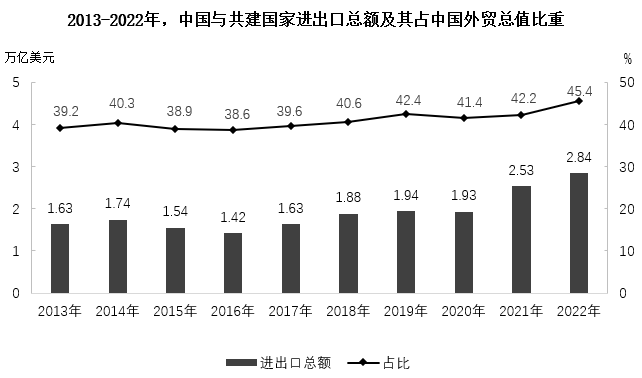
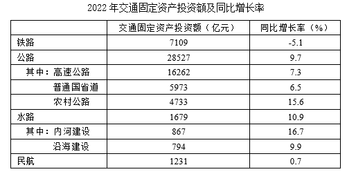
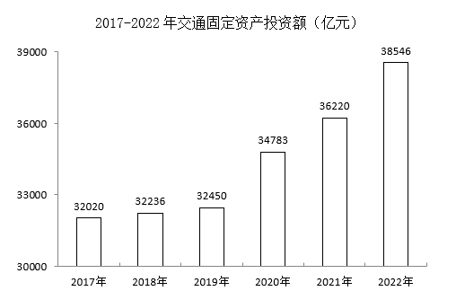

# 2024年黑龙江省公务员录用考试《行测》题（网友回忆版）

> 资料分析 · 15 题 · 黑龙江 2024

## 材料 1

### 第 1 题　qid 10204596 · 综合

2013-2022年，中国与共建国家进出口总额合计约为：

- **A**. 至少20万亿美元
- **B**. 在17-20万亿美元之间　✅
- **C**. 在14-17万亿美元之间
- **D**. 至多14万亿美元

**答案**：B

**官方解析**

定位统计图可知2013-2022年中国与共建国家每年的进出口总额。则题目所求=1.63+1.74+1.54+1.42+1.63+1.88+1.94+1.93+2.53+2.84=19.08万亿美元，在B项范围内。
故正确答案为B。

---

### 第 2 题　qid 10204598 · 增长

2013-2022年，中国与共建国家进出口总额最低的年份，中国外贸总值比上年同期：

- **A**. 下降了10%以上
- **B**. 下降了不到10%　✅
- **C**. 上升了10%以上
- **D**. 上升了不到10%

**答案**：B

**官方解析**

根据题干“2013-2022年······比上年同期”，结合选项为上升/下降+百分数，可判定本题为一般增长率问题。定位统计图可得2013-2022年，中国与共建国家进出口总额及其占中国外贸总值比重。观察可得，2013-2022年，中国与共建国家进出口总额最低的年份为2016年（1.42万亿美元）。根据公式：整体、增长率，则所求为，即下降了不到10%。

故正确答案为B。

---

### 第 3 题　qid 10204599 · 增长

2014-2022年，中国与共建国家进出口总额同比增长率为正值的年份有：

- **A**. 3个
- **B**. 4个
- **C**. 5个
- **D**. 6个　✅

**答案**：D

**官方解析**

定位统计图可得：2013-2022年中国与共建国家进出口总额分别为1.63万亿美元、1.74万亿美元、1.54万亿美元、1.42万亿美元、1.63万亿美元、1.88万亿美元、1.94万亿美元、1.93万亿美元、2.53万亿美元、2.84万亿美元。比较可知，2014-2022年，中国与共建国家进出口总额同比增长率为正值（即现期量&gt;基期量）的年份有2014年（1.74万亿美元&gt;1.63万亿美元）、2017年（1.63万亿美元&gt;1.42万亿美元）、2018年（1.88万亿美元&gt;1.63万亿美元）、2019年（1.94万亿美元&gt;1.88万亿美元）、2021年（2.53万亿美元&gt;1.93万亿美元）、2022年（2.84万亿美元&gt;2.53万亿美元），共6个。
故正确答案为D。

---

### 第 4 题　qid 10204601 · 综合

2021年，中国外贸总值比2013年多：

- **A**. 不到2.1万亿美元　✅
- **B**. 2.1-2.3万亿美元
- **C**. 2.3-2.5万亿美元
- **D**. 超过2.5万亿美元

**答案**：A

**官方解析**

根据题干“2021年，中国外贸总值比2013年多”，结合选项均带单位，且材料给出2021年、2013年中国与共建国家进出口总额及其占中国外贸总值比重，可判定本题为现期比重问题。定位统计图可得：2021年，中国与共建国家进出口总额为2.53万亿美元，占中国外贸总值的比重为42.2%；2013年，中国与共建国家进出口总额为1.63万亿美元，占中国外贸总值的比重为39.2%。根据公式：整体，则2021年中国外贸总值比2013年多万亿美元，不到2.1万亿美元。

故正确答案为A。

---

### 第 5 题　qid 10204602 · 综合

下列说法错误的是：

- **A**. 2021年，中国外贸总值首次超过5万亿美元
- **B**. 2015-2017年，中国外贸总值的年平均值不超过4万亿美元
- **C**. 2021年，中国与共建国家进出口总额增长率低于2022年　✅
- **D**. 2022年，中国与共建国家进出口总额比2013年增长了约74%

**答案**：C

**官方解析**

A项：定位统计图可得2013-2021年中国与共建国家进出口总额及其占中国外贸总值比重。根据公式：整体，则2013-2021年，中国外贸总值分别为：2013年，万亿美元；2014年，万亿美元；2015年，万亿美元；2016年，万亿美元；2017年，万亿美元；2018年，万亿美元；2019年，万亿美元；2020年，万亿美元；2021年，万亿美元，则2021年中国外贸总值首次超过5万亿美元，正确；

B项：定位统计图可得，2015-2017年，中国与共建国家进出口总额分别为1.54万亿美元、1.42万亿美元、1.63万亿美元，其占中国外贸总值比重分别为38.9%、38.6%、39.6%。根据公式：整体，则2015-2017年，中国外贸总值的年平均值万亿美元，正确；

C项：定位统计图可得，2020-2022年，中国与共建国家进出口总额分别为1.93万亿美元、2.53万亿美元、2.84万亿美元。根据公式：增长率，则2021年中国与共建国家进出口总额增长率，2022年增长率，由于前者的分子大且分母小，则前者分数较大，即2021年中国与共建国家进出口总额增长率高于2022年，错误；

D项：定位统计图可得，2013年、2022年中国与共建国家进出口总额分别为1.63万亿美元、2.84万亿美元。根据公式：增长率，则2022年，中国与共建国家进出口总额较2013年的增长率，正确。

本题为选非题，故正确答案为C。

备注：对于本题A项，根据材料数据无法计算2012年及以前的中国外贸总值，因此无法比较2012年及以前的中国外贸总值是否超过5万亿美元。但结合其他选项有明显错误，粉笔择优选择C项为正确答案。

---

## 材料 2

        2023年前三季度，规模以上文化及相关产业企业（简称文化企业）实现营业收入91619亿元，同比增长7.7%。其中，文化新业态特征较为明显的16个行业小类实现营业收入36870亿元，同比增长15.2%。

        分产业类型看，文化制造业实现营业收入29007亿元，同比下降1.0%；文化批发和零售业15024亿元，同比增长5.3%；文化服务业47588亿元，同比增长14.6%。

        分领域看，文化核心领域实现营业收入59507亿元，同比增长12.4%；文化相关领域32112亿元，同比下降0.1%。

        分行业类别看，新闻信息服务实现营业收入12203亿元，同比增长14.9%；内容创作生产19857亿元，同比增长10.3%；创意设计服务14973亿元，同比增长9.6%；文化传播渠道10712亿元，同比增长12.4%；文化投资运营473亿元，同比增长27.7%；文化娱乐休闲服务1289亿元，同比增长67.2%；文化生产和中介服务10894亿元，同比下降1.5%；文化装备生产4443亿元，同比下降4.3%；文化消费终端生产16775亿元，同比增长2.1%。

        分区域看，东部地区实现营业收入71959亿元，同比增长8.1%；中部地区10600亿元，同比增长1.9%；西部地区8196亿元，同比增长12.2%；东北地区864亿元，同比增长7.0%。前三季度，文化企业实现利润总额7508亿元，同比增长31.4%。前三季度末，文化企业资产总计192849亿元，同比增长6.7%。

### 第 6 题　qid 10204591 · 综合

2022年前三季度，文化服务业实现营业收入约是文化批发和零售业营业收入的：

- **A**. 不到2.5倍
- **B**. 2.5~3倍　✅
- **C**. 3~3.5倍
- **D**. 3.5倍以上

**答案**：B

**官方解析**

根据题干“2022年前三季度······是······”，结合材料时间为2023年前三季度，且选项单位为“倍”，可判定本题为基期倍数问题。定位文字材料第二段：2023年前三季度，文化批发和零售业15024亿元（B），同比增长5.3%（b）；文化服务业47588亿元（A），同比增长14.6%（a）。根据公式：基期倍数，可得2022年前三季度，文化服务业实现营业收入是文化批发和零售业营业收入的倍，在B项范围内。

故正确答案为B。

---

### 第 7 题　qid 10204595 · 增长

2023年前三季度，营业收入超过1.2万亿元的行业，按同比增速由大到小排序正确的是：

- **A**. 内容创作生产、文化消费终端生产、创意设计服务、新闻信息服务
- **B**. 创意设计服务、文化消费终端生产、文化传播渠道、内容创作生产
- **C**. 新闻信息服务、内容创作生产、创意设计服务、文化消费终端生产　✅
- **D**. 创意设计服务、新闻信息服务，文化消费终端生产、内容创作生产

**答案**：C

**官方解析**

定位文字材料第四段可知，2023年前三季度各行业类别营业收入及同比增速。其中，营业收入超过1.2万亿元的行业有新闻信息服务、内容创作生产、创意设计服务、文化消费终端生产共4个，营业收入同比增速依次为14.9%、10.3%、9.6%、2.1%。因此按照同比增速由大到小排序为新闻信息服务、内容创作生产、创意设计服务、文化消费终端生产。
故正确答案为C。

---

### 第 8 题　qid 10204593 · 综合

2023年前三季度，实现营业收入最高的文化行业，其2022年前三季度的营业收入大约是：

- **A**. 不到1.4万亿元
- **B**. 1.4~1.8万亿元
- **C**. 1.8~2.2万亿元　✅
- **D**. 超过2.2万亿元

**答案**：C

**官方解析**

根据题干“······2022年前三季度的营业收入大约是”，结合材料时间为2023年前三季度，可判定本题为基期计算问题。定位文字材料第四段可知2023年前三季度分行业类别看各行业营业收入和同比增速。比较可得，内容创作生产实现营业收入（19857亿元）最高，同比增长10.3%。根据公式：基期量，则2022年前三季度内容创作生产实现营业收入万亿元，在C项范围内。

故正确答案为C。

---

### 第 9 题　qid 10204616 · 综合

2023年前三季度，文化企业利润总额与营业收入的比值约比上一年：

- **A**. 降低了1.8个百分点
- **B**. 降低了1.5个百分点
- **C**. 提高了1.8个百分点
- **D**. 提高了1.5个百分点　✅

**答案**：D

**官方解析**

根据题干“2023年前三季度······的比值约比上一年”，结合选项为提高了/降低了+百分点，可判定本题为两期比重问题。定位文字材料第一段可得，2023年前三季度，规模以上文化企业（简称文化企业）实现营业收入91619亿元（B），同比增长7.7%（b）；定位文字材料最后一段可得，前三季度，文化企业实现利润总额7508亿元（A），同比增长31.4%（a）。根据公式：两期比重差，则所求两期比重差，即约提高了1.5个百分点。

故正确答案为D。

---

### 第 10 题　qid 10204618 · 综合

下列说法错误的是：

- **A**. 2022年前三季度，文化新业态特征较为明显的16个行业小类的营业收入占文化企业营业收入比重超过40%　✅
- **B**. 2023年前三季度，文化核心领域实现营业收入同比增量超过文化企业实现营业收入同比增量
- **C**. 2022年前三季度，中部地区文化企业实现营业收入比西部地区多3000亿元以上
- **D**. 2023年前三季度，每百元资产实现营业收入比上一年高

**答案**：A

**官方解析**

A项：定位文字材料第一段可得，2023年前三季度，规模以上文化企业（简称文化企业）实现营业收入91619亿元（B），同比增长7.7%（b），其中，文化新业态特征较为明显的16个行业小类实现营业收入36870亿元（A），同比增长15.2%（a）。根据公式：基期比重，则所求比重，错误；

B项：定位文字材料第一段和第三段可得，2023年前三季度，规模以上文化企业（简称文化企业）实现营业收入91619亿元，同比增长7.7%，文化核心领域实现营业收入59507亿元，同比增长12.4%。根据公式：增长量，则2023年前三季度文化核心领域实现营业收入同比增量亿元，文化企业实现营业收入同比增量亿元，文化核心领域实现营业收入同比增量（6610亿元）&gt;文化企业实现营业收入同比增量（6540亿元），正确；

C项：定位文字材料最后一段可得，2023年前三季度中部地区文化企业实现营业收入10600亿元，同比增长1.9%；西部地区文化企业实现营业收入8196亿元，同比增长12.2%。根据公式：基期量，则2022年前三季度中部地区文化企业实现营业收入比西部地区多亿元亿元，即多3000亿元以上，正确；

D项：定位文字材料第一段和最后一段可得，2023年前三季度，规模以上文化企业（简称文化企业）实现营业收入91619亿元（A），同比增长7.7%（a）；文化企业资产总计192849亿元（B），同比增长6.7%（b）。根据公式：每百元资产实现营业收入，结合两期平均数比较结论：当a&gt;b时，平均数上升，则2023年前三季度每百元资产实现营业收入比上一年高，正确。

本题为选非题，故正确答案为A。

---

## 材料 3

### 第 11 题　qid 11881046 · 综合

2021年公路交通固定资产投资额与水路交通固定资产投资额共（    ）。

- **A**. 不到2万亿元
- **B**. 2~3万亿元　✅
- **C**. 3~4万亿元
- **D**. 超过4万亿元

**答案**：B

**官方解析**

根据题干“2021年公路交通固定资产投资额与水路交通固定资产投资额共”，结合材料时间为2022年，可判定本题为基期和差问题。定位表格材料可得∶2022年，公路交通固定资产投资额为28527亿元，同比增长率为9.7%；水路交通固定资产投资额为1679亿元，同比增长率为10.9%。根据公式：基期量，则所求亿元，在B项范围内。

故正确答案为B。

---

### 第 12 题　qid 11881049 · 比重

2021年农村公路交通固定资产投资额占公路交通固定资产投资额的比重为（    ）。

- **A**. 15.7%　✅
- **B**. 16.5%
- **C**. 17.4%
- **D**. 19.5%

**答案**：A

**官方解析**

根据题干“2021年······占······的比重为”，结合材料时间为2022年，可判定本题为基期比重问题。定位表格材料可得：2022年农村公路交通固定资产投资额为4733亿元（A），同比增长15.6%（a）；公路交通固定资产投资额为28527亿元（B），同比增长9.7%（b）。根据公式：基期比重，则所求比重，与A项最接近。

故正确答案为A。

---

### 第 13 题　qid 11881050 · 综合

2021年铁路交通固定资产投资额是民航交通固定资产投资额的（    ）。

- **A**. 5.1倍
- **B**. 5.5倍
- **C**. 6.1倍　✅
- **D**. 7.2倍

**答案**：C

**官方解析**

根据题干“2021年······是······”，结合选项为倍数和材料时间为2022年，可判定本题为基期倍数问题。定位表格材料可得：2022年铁路交通固定资产投资额为7109亿元（A），同比增长率为-5.1%（a）；民航交通固定资产投资额为1231亿元（B），同比增长率为0.7%（b）。根据公式：基期倍数，则所求倍数倍。

故正确答案为C。

---

### 第 14 题　qid 11881051 · 平均数

2017-2022年，交通固定资产年平均投资额为（    ）。

- **A**. 不到3.3万亿元
- **B**. 3.3~3.5万亿元　✅
- **C**. 3.5~3.7万亿元
- **D**. 3.7万亿元以上

**答案**：B

**官方解析**

根据题干“2017-2022年······年平均投资额为”，可判定本题为现期平均数问题。定位统计图可知2017-2022年交通固定资产投资额。根据公式：平均数，则题干所求年平均投资额为亿元，即约为3.4万亿元，在B项范围内。

故正确答案为B。

---

### 第 15 题　qid 11881053 · 增长

根据上述材料，下列正确的有（    ）。
①2017-2022年，交通固定资产投资额同比增长率最大的一年是2022年
②2021年，内河建设交通固定资产投资额超过沿海建设交通固定资产投资额70亿元
③2022年，陆路交通固定资产投资额占交通固定资产投资额的90%以上

- **A**. 0项
- **B**. 1项　✅
- **C**. 2项
- **D**. 3项

**答案**：B

**官方解析**

①定位统计图可知2017-2022年交通固定资产投资额，根据公式：增长率，则2020年交通固定资产投资额同比增长率，2022年交通固定资产投资额同比增长率，前者分子大分母小，分子大的分数大，故2020年交通固定资产投资额同比增长率大于2022年的，即同比增长率最大的一年并非2022年，错误；

②定位表格材料可得，2022年内河建设和沿海建设交通固定资产投资额分别为867亿元和794亿元；同比增长率分别为16.7%和9.9%。根据公式：基期量，则2021年内河建设和沿海建设交通固定资产投资额的差值亿元，错误；

③定位表格材料可得，2022年铁路、公路交通固定资产投资额分别为7109亿元、28527亿元；定位统计图可得，2022年交通固定资产投资额为38546亿元。则陆路交通固定资产投资额占交通固定资产投资额的比重，正确。

综上可知，只有③正确，共1项。

故正确答案为B。

---
