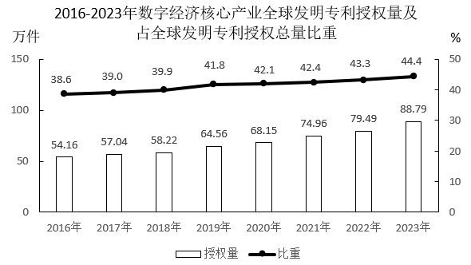
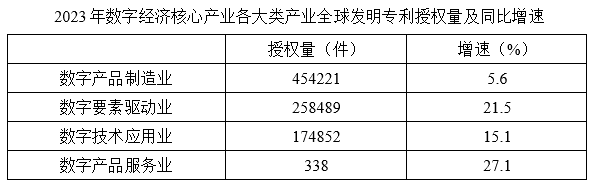
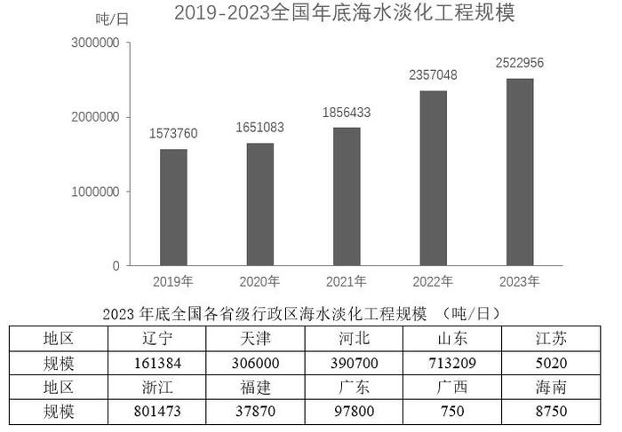
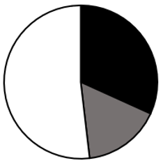
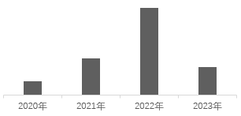
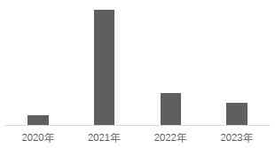
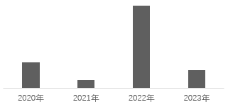
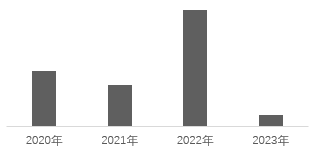
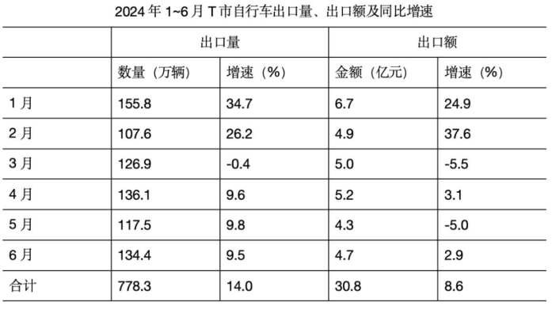

# 2025年云南省公务员录用考试《行测》题（网友回忆版）

> 资料分析 · 15 题 · 云南 2025

## 材料 1

### 第 1 题　qid 13504270 · 综合

2023年全球发明专利授权量约为多少万件？

- **A**. 200　✅
- **B**. 184
- **C**. 39
- **D**. 20

**答案**：A

**官方解析**

根据题干“2023年全球发明专利······多少万件”，结合材料给出2023年数字经济核心产业全球发明专利授权量及占全球发明专利授权总量比重，可判定本题为现期比重问题。定位统计图可得：2023年数字经济核心产业全球发明专利授权量为88.79万件，占全球发明专利授权总量比重为44.4%。 根据公式：整体，可得所求万件。

故正确答案为A。

---

### 第 2 题　qid 13504272 · 增长

2017-2023年间，数字经济核心产业全球发明专利授权量同比增速不到5%的年份有几个？

- **A**. 0
- **B**. 1　✅
- **C**. 2
- **D**. 3

**答案**：B

**官方解析**

根据题干“2017-2023年······同比增速不到5%的年份有几个”，可判定本题为一般增长率问题。定位统计图可得2016-2023年每年数字经济核心产业全球发明专利授权量。根据公式：增长率，则2017-2023年，每年数字经济核心产业全球发明专利授权量的同比增速分别为：

2017年：，不符合；

2018年：，符合；

2019年：，不符合；

2020年：，不符合；

2021年：，不符合；

2022年：，不符合；

2023年：，不符合。

综上，2017-2023年间，数字经济核心产业全球发明专利授权量同比增速不到5%的年份有2018年，共1个。

故正确答案为B。

---

### 第 3 题　qid 13504274 · 比重

2023年数字产品制造业全球发明专利授权量占该年全球发明专利授权量的比重约为：

- **A**. 51.2%
- **B**. 44.4%
- **C**. 31.6%
- **D**. 22.7%　✅

**答案**：D

**官方解析**

根据题干“2023年······占该年······的比重约为”，结合材料时间为2023年，可判定本题为现期比重问题。定位统计图可知：2023年数字经济核心产业全球发明专利授权量为88.79万件，占全球发明专利授权总量比重为44.4%；定位统计表可知：2023年数字产品制造业全球发明专利授权量为454221件。根据公式：比重，可得题干所求比重为，与D项最接近。

故正确答案为D。

---

### 第 4 题　qid 13504407 · 综合

2022年，数字要素驱动业全球发明专利授权量约比数字技术应用业全球发明专利授权量多多少万件？

- **A**. 21.7
- **B**. 19.5
- **C**. 8.4
- **D**. 6.1　✅

**答案**：D

**官方解析**

根据题干“2022年······比······多多少万件”，结合材料时间为2023年，可判定本题为基期和差问题。定位表格材料可得：2023年数字要素驱动业全球发明专利授权量为258489件，同比增长21.5%；数字技术应用业全球发明专利授权量为174852件，同比增长15.1%。根据公式：基期量，则所求为万件，与D项最接近。

故正确答案为D。

---

### 第 5 题　qid 13504277 · 增长

以下折线图反映了哪一时间段内，数字经济核心产业全球发明专利授权量同比增速的变化趋势？

- **A**. 2016-2018年
- **B**. 2017-2019年　✅
- **C**. 2018-2020年
- **D**. 2020-2022年

**答案**：B

**官方解析**

根据题干“······同比增速的变化趋势”，可判定本题为一般增长率问题。定位统计图可知2016-2022年数字经济核心产业全球发明专利授权量。由于材料未给出2015年相关数据，故2016年数字经济核心产业全球发明专利授权量同比增速无法计算，排除A项。根据公式：，则2017-2022年数字经济核心产业全球发明专利授权量同比增速分别为：

2017年：；

2018年：；

2019年：；

2020年：；

2021年：；

2022年：。

观察发现，折线图先下降再上升，且第3个点高于第1个点，只有2017-2019年满足该变化趋势。

故正确答案为B。

---

## 材料 2

        截至2023年底，全国现有海水淡化工程156个，同比增加了6个。其中，万吨级及以上海水淡化工程55个，工程规模2300723吨/日，千吨及以上万吨级以下海水淡化工程51个，工程规模208266吨/日，千吨级以下海水淡化工程50个，全国海水淡化工程分布点10个省级行政区。

### 第 6 题　qid 13504524 · 增长

2020-2023年间，全国年底海水淡化工程规模同比增速最快的年份是：

- **A**. 2020年
- **B**. 2021年
- **C**. 2022年　✅
- **D**. 2023年

**答案**：C

**官方解析**

根据题干“······同比增速最快的年份是”，可判定本题为一般增长率问题。定位统计图可知2019-2023年每年全国年底海水淡化工程规模。根据公式：增长率，可得2020-2023年间，全国年底海水淡化工程规模同比增速依次为：

2020年；

2021年；

2022年；

2023年。

比较可得，2022年同比增速最快。

故正确答案为C。

---

### 第 7 题　qid 13504525 · 平均数

2022年底，我国平均每个海水淡化工程规模约在以下哪个范围内？

- **A**. 不到1.5万吨/日
- **B**. 1.5-1.6万吨/日之间　✅
- **C**. 1.6-1.7万吨/日之间
- **D**. 超过1.7万吨/日

**答案**：B

**官方解析**

根据题干“2022年底······平均每个·····”，结合材料时间为2023年，可判定本题为基期平均数问题。定位文字材料可得，2023年底全国现有海水淡化工程156个，同比增加了6个；定位统计图可得，2022年底全国海水淡化工程规模为2357048吨/日。则所求平均数吨/日=1.57万吨/日，在B项范围内。

故正确答案为B。

---

### 第 8 题　qid 12882043 · 平均数

2023年底，我国平均每个千吨级以下海水淡化工程规模约为多少吨/日？

- **A**. 279　✅
- **B**. 285
- **C**. 296
- **D**. 324

**答案**：A

**官方解析**

根据题干“2023年底······平均每个······”，结合材料时间为2023年底，可判定本题为现期平均数问题。定位文字材料可得：截至2023年底，全国万吨级及以上海水淡化工程规模为2300723吨每日，千吨及以上万吨级以下海水淡化工程规模为208266吨/日，千吨级以下海水淡化工程50个；定位统计图可得：2023年底全国海水淡化工程规模为2522956吨/日。2023年底，千吨级以下海水淡化工程规模=全国海水淡化工程规模-万吨级及以上海水淡化工程规模-千吨及以上万吨级以下海水淡化工程规模=2522956-2300723-208266=13967吨/日，则所求平均数吨/日。

故正确答案为A。

---

### 第 9 题　qid 13504526 · 比重

以下饼图中，最能准确反应2023年底浙江（黑色），山东（灰色）和其他省级行政区（白色）海水淡化工程规模占全国比重的是：

- **A**. 

- **B**. 

- **C**. 

- **D**. 

　✅

**答案**：D

**官方解析**

根据题干“以下饼图中，最能准确反应2023年底······占全国比重的是”，结合材料时间为2023年底，可判定本题为现期比重问题。定位统计图可得：2023年底全国海水淡化工程规模2522956吨/日；定位统计表可得：2023年底浙江、山东海水淡化工程规模分别为801473吨/日、713209吨/日，则，即黑色区域约是灰色区域的1.1倍，排除A、B两项。根据公式：比重，则2023年浙江、山东海水淡化工程规模之和占全国比重，即黑色区域和灰色区域占比之和超过，排除C项。

故正确答案为D。

---

### 第 10 题　qid 13504528 · 增长

以下柱状图中，最能准确反映2020~2023年间，全国年底海水淡化工程规模同比增量变化趋势的是（横轴位置代表增量为0）：

- **A**. 

　✅
- **B**. 

- **C**. 

- **D**. 

**答案**：A

**官方解析**

根据题干“······最能准确反映······同比增量变化趋势的是”，可判定本题为增长量比较问题。定位统计图可知2019-2023年每年全国年底海水淡化工程规模。根据公式：增长量=现期量-基期量，可得2020-2023年间，全国年底海水淡化工程规模同比增量依次为：

2020年吨/日；

2021年吨/日；

2022年吨/日；

2023年吨/日。

比较可知，2020年同比增量最小，排除C、D两项；2022年同比增量最大，排除B项。只有A项符合。

故正确答案为A。

---

## 材料 3

        2024年1-6月，T市出口自行车占同期全国自行车出口比重为33.6%，位居全国首位。其中，民营企业出口414.9万辆，同比增加27.8%；国有企业出口351.8万辆，同比增加6.9%；其他企业出口11.6万辆。对东盟、日本分别出口213.4万辆、176.6万辆，同比分别增加4.9%、5.3%；对美国出口115.3万辆，同比增加10.1%。

### 第 11 题　qid 13504302 · 综合

2024年1-6月，我国自行车出口量在以下哪个范围内？

- **A**. 不到0.18亿辆
- **B**. 0.18-0.20亿辆
- **C**. 0.20-0.22亿辆
- **D**. 0.22亿辆以上　✅

**答案**：D

**官方解析**

根据题干“2024年1-6月，我国自行车出口量在以下哪个范围内”，结合材料给出2024年1-6月T市自行车出口相关数据及占同期全国自行车出口比重，可判定本题为现期比重问题。定位文字材料可得：2024年1-6月，T市出口自行车占同期全国自行车出口比重为33.6%。定位统计表可得，2024年1-6月，T市自行车出口量778.3万辆。根据公式：整体，则2024年1-6月我国自行车出口量万辆亿辆，在D项范围内。

故正确答案为D。

---

### 第 12 题　qid 13504303 · 综合

2024年1-6月T市国有企业自行车出口增量约占同期T市自行车出口增量的：

- **A**. 58%
- **B**. 46%
- **C**. 32%
- **D**. 24%　✅

**答案**：D

**官方解析**

根据题干“2024年1-6月······占······”，结合材料时间为2024年1-6月，可判定本题为现期比重问题。定位文字材料可得：2024年1-6月，T市国有企业自行车出口351.8万辆，同比增加6.9%。定位统计表可得：2024年1-6月，T市自行车出口778.3万辆，同比增长14.0%。根据公式：增长量，比重，可得2024年1-6月T市国有企业自行车出口增量为万辆；T市自行车出口增量为万辆。则所求为，与D项最接近。

故正确答案为D。

---

### 第 13 题　qid 13504410 · 增长

2024年1~6月T市民营企业自行车出口量占同期T市自行车出口总量比上年同期约：

- **A**. 提升了5.8个百分点　✅
- **B**. 下降了5.8个百分点
- **C**. 提升了9.6个百分点
- **D**. 下降了9.6个百分点

**答案**：A

**官方解析**

根据题干“2024年1~6月······占······总量比上年同期约”，结合选项为提升了/下降了+百分点，可判定本题为两期比重问题。定位文字材料可得：2024年1-6月，T市民营企业自行车出口量为414.9万辆（A），同比增加27.8%（a）。定位表格材料可得：2024年1-6月，T市自行车出口总量为778.3万辆（B），同比增长14.0%（b）。根据公式：两期比重差，则所求比重差为，即提升了约5.74个百分点，与A项最接近。

故正确答案为A。

---

### 第 14 题　qid 13504305 · 增长

2024年1-6月，T市自行车出口均价同比下降的月份有几个？

- **A**. 3
- **B**. 4
- **C**. 5　✅
- **D**. 6

**答案**：C

**官方解析**

根据题干“2024年1-6月······出口均价同比下降的月份有几个”，结合公式：出口均价，可判定本题为两期平均数比较问题。定位统计表可得2024年1-6月T市自行车出口金额、出口数量及同比增长率。根据两期平均数比较结论，当分子增长率（a）&lt;分母增长率（b）时，平均数下降。观察表格，满足a&lt;b的有：1月（24.9%&lt;34.7%），3月（-5.5%&lt;-0.4%），4月（3.1%&lt;9.6%），5月（-5.0%&lt;9.8%），6月（2.9%&lt;9.5%），共5个月份。

故正确答案为C。

---

### 第 15 题　qid 13504306 · 综合

以下柱状图反映了2024年哪一时间段内，T市自行车出口哪一指标环比增量变化情况？（横轴位置代表增量为0）

- **A**. 2-5月出口量
- **B**. 3-6月出口量
- **C**. 2-5月出口额
- **D**. 3-6月出口额　✅

**答案**：D

**官方解析**

根据题干“······环比增量变化情况······”，可判定本题为增长量比较问题。定位统计表，可知2024年1-6月各月T市自行车出口量和出口额。根据公式：增长量=现期量-基期量，可得选项中各指标环比增长量如下：
A项，2-5月出口量：4月，136.1-126.9＞0，而柱状图2024年4月出口量的环比增长量&lt;0，不符合柱状图变化趋势，排除；
B项，3-6月出口量：3月，126.9-107.6=19.3万辆；4月，136.1-126.9=9.2万辆，可知2024年3月出口量环比增量&gt;2024年4月出口量环比增量，不符合柱状图变化趋势，排除；
C项，2-5月出口额：4月，5.2-5.0&gt;0，而柱状图2024年4月出口额的环比增长量&lt;0，不符合柱状图变化趋势，排除；
D项，3-6月出口额：3月，5.0-4.9=0.1亿元；4月，5.2-5.0=0.2亿元；5月，4.3-5.2=-0.9亿元；6月，4.7-4.3=0.4亿元。符合柱状图变化趋势，当选。
故正确答案为D。

---
