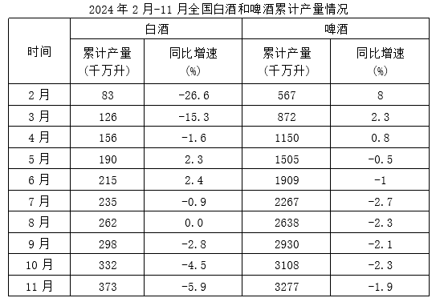
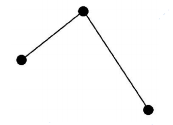

# 2025年内蒙古公务员录用考试《行测》题（网友回忆版）

> 资料分析 · 15 题 · 内蒙古 2025

## 材料 1

### 第 1 题　qid 12882026 · 综合

2023上半年，全国白酒产量为多少（    ）。

- **A**. 不到150千万升
- **B**. 180～200千万升
- **C**. 200～220千万升　✅
- **D**. 220千万升以上

**答案**：C

**官方解析**

根据题干求“2023上半年，全国白酒产量”和表格材料中2024年现期量和增长率，可判定本题为基期计算问题。定位材料表格可得：2024年6月全国白酒累计产量215千万升，同比增长2.4%。根据公式：基期量，则2023上半年，全国白酒产量千万升，在C项范围内。

故正确答案为C。

---

### 第 2 题　qid 12882027 · 增长

2024年3-11月，全国啤酒当期产量增长率高于累计增长率的有几个？

- **A**. 3　✅
- **B**. 4
- **C**. 5
- **D**. 6

**答案**：A

**官方解析**

根据题干“2024年3-11月······当期产量增长率高于累计增长率······”，结合材料给出2024年2-11月各月累计增长率且当期累计产量=上期累计产量+当期产量，可判定本题为混合增长率问题。定位统计表可知2024年2-11月各月全国啤酒累计产量的同比增速。根据混合增长率口诀“混合后居中”，结合题干需满足，则找到满足的月份即可。观察统计表，满足条件的有：，，。

综上可知，满足条件的月份有8月、9月、11月，共3个。

故正确答案为A。

---

### 第 3 题　qid 12882028 · 倍数

2023年一季度全国啤酒累计产量是白酒产量的几倍？

- **A**. 不到5倍
- **B**. 5～6倍　✅
- **C**. 6～7倍
- **D**. 7倍以上

**答案**：B

**官方解析**

根据题干“2023年一季度······是······的几倍”，结合材料给出的2024年3月累计产量，即2024年一季度数据，可判定本题为基期倍数问题。定位统计表可得：2024年3月全国啤酒累计产量872千万升（A），同比增长2.3%（a）；白酒累计产量126千万升（B），同比增长-15.3%（b）。根据公式：基期倍数，可得所求为倍，在B项范围内。

故正确答案为B。

---

### 第 4 题　qid 12882029 · 综合

2023年三季度全国白酒当季度产量为多少?

- **A**. 不到80千万升
- **B**. 80~120千万升　✅
- **C**. 120到160千万升
- **D**. 160到180千万升

**答案**：B

**官方解析**

根据题干“2023年三季度······当季度产量为多少”，结合材料时间为2024年2月-11月累计产量情况，即材料给出的是1-2月，······，1-11月的产量数据，可判定本题为基期和差问题。定位统计表可得：2024年6月全国白酒累计产量为215千万升，同比增速为2.4%；2024年9月全国白酒累计产量为298千万升，同比增速为-2.8%。根据公式：基期量，则2023年三季度全国白酒当季度产量为千万升，在B项范围内。

故正确答案为B。

---

### 第 5 题　qid 12882030 · 增长

下图为2024年全国白酒或啤酒哪个季度各月当期环比增长率的变化趋势？

- **A**. 白酒、第二季度
- **B**. 白酒、第三季度
- **C**. 啤酒、第二季度
- **D**. 啤酒、第三季度　✅

**答案**：D

**官方解析**

根据题干“······2024年······哪个季度各月当期环比增长率的变化趋势”，可判定本题为一般增长率问题。定位表格材料可得2024年2-9月白酒和啤酒累计产量。根据当月产量=当月累计产量-上月累计产量，可得2024年3-9月，白酒各月产量依次为43千万升、30千万升、34千万升、25千万升、20千万升、27千万升、36千万升；啤酒各月产量依次为305千万升、278千万升、355千万升、404千万升、358千万升、371千万升、292千万升。根据公式：，可得选项中各指标环比增长率如下：

A项，白酒、第二季度：4月，；5月，；6月，，则第一个点低于第三个点，不符合折线图的变化趋势，排除；

B项，白酒、第三季度：7月，；8月，；9月，，则第一个点低于第三个点，不符合折线图的变化趋势，排除；

C项，啤酒、第二季度：4月，；5月，；6月，，则第一个点低于第三个点，不符合折线图的变化趋势，排除；

D项，啤酒、第三季度：7月，；8月，；9月，，符合折线图的变化趋势，当选。

故正确答案为D。

---

## 材料 2

        2024年7月，规模以上工业发电量8831亿千瓦时，同比增长2.5％，增速比6月加快0.2个百分点；规模以上工业日均发电量284.9亿千瓦时。

        2024年1~7月，规模以上工业发电量53239亿千瓦时，同比增长4.8％。分品种看，2024年7月，规模以上工业火电发电量同比下降4.9％，规模以上工业水电发电量同比增长36.2％，规模以上工业核电发电量同比增长4.3％，规模以上工业风电发电量同比增长0.9％，规模以上工业太阳能发电量同比增长16.4％。

### 第 6 题　qid 13504653 · 综合

2023年上半年规模以上工业发电量约为：

- **A**. 3.9万亿千瓦时
- **B**. 4.2万亿千瓦时　✅
- **C**. 4.5万亿千瓦时
- **D**. 5.1万亿千瓦时

**答案**：B

**官方解析**

根据题干“2023年上半年······约为”，结合材料时间为2024年1-7月和7月，可判定本题为基期和差问题。定位文字资料第一段可得：2024年7月，规模以上工业发电量8831亿千瓦时，同比增长2.5%；定位文字资料第二段可得：2024年1-7月，规模以上工业发电量53239亿千瓦时，同比增长4.8%。根据公式：基期量，则题干所求亿千瓦时=4.213万亿千瓦时，与B项最接近。

故正确答案为B。

---

### 第 7 题　qid 13504654 · 比重

2024年7月，规模以上工业五种发电形式的发电量分别占规模以上工业总发电量的比重较2023年7月下降的品种共有：

- **A**. 1种
- **B**. 2种　✅
- **C**. 3种
- **D**. 4种

**答案**：B

**官方解析**

根据题干“2024年7月······占······的比重较2023年7月下降的品种共有”，可判定本题为两期比重问题。定位文字材料第一段可得：2024年7月，规模以上工业发电量同比增长2.5％（b）；定位文字材料第二段可得2024年7月规模以上工业五种发电形式的发电量同比增速，分别为：火电-4.9%（），水电36.2%（），核电4.3%（），风电0.9%（），太阳能16.4%（）。根据两期比重比较的结论：当部分增长率（a）&lt;整体增长率（b）时，比重下降。则满足a&lt;b的有：火电-4.9%（），风电0.9%（），共有2种。

故正确答案为B。

---

### 第 8 题　qid 13504655 · 综合

2023年第三季度，规模以上工业发电量约为：

- **A**. 不到2.3万亿千瓦时
- **B**. 2.3~2.4万亿千瓦时
- **C**. 2.4~2.5万亿千瓦时　✅
- **D**. 2.5万亿千瓦时以上

**答案**：C

**官方解析**

根据题干“2023年第三季度······约为”，结合材料给出2023年7-9月各月规模以上工业日均发电量，可判定本题为现期平均数问题。定位统计图可得：2023年7-9月规模以上工业日均发电量分别为278.0亿千瓦时、272.6亿千瓦时、248.5亿千瓦时。根据公式：总数=平均数×天数，则2023年第三季度规模以上工业发电量亿千瓦时万亿千瓦时，在C项范围内。

故正确答案为C。

---

### 第 9 题　qid 13504656 · 综合

2023年第二季度，规模以上工业日均发电量由大到小排序正确的是：

- **A**. 4月、5月、6月
- **B**. 5月、6月、4月
- **C**. 6月、4月、5月
- **D**. 6月、5月、4月　✅

**答案**：D

**官方解析**

根据题干“2023年第二季度······发电量由大到小排序正确的是”，结合材料给出2024年4-6月相关数据，可判定本题为基期比较问题。定位统计图可知2024年4-6月规模以上工业日均发电量及其同比增速。根据公式：基期量，则2023年4-6月，规模以上工业日均发电量分别为：4月，亿千瓦时；5月，亿千瓦时；6月，亿千瓦时。

在三个分数中，4月对应分数的分子最小，分母最大，则4月对应分数值最小，可排除A、C两项；其余两个分数分母相同，分子大的分数值大，则6月分数值最大，5月分数值次大。因此，2023年第二季度，规模以上工业日均发电量由大到小排序为：6月、5月、4月。

故正确答案为D。

---

### 第 10 题　qid 13504657 · 增长

以下折线图中，能正确反映2022年第四季度各月日均发电量的环比增长率变化的是：

- **A**. 

　✅
- **B**. 

- **C**. 

- **D**. 

**答案**：A

**官方解析**

方法一：根据题干“······能正确反映2022年第四季度各月日均发电量的环比增长率变化的是”，可判定本题为一般增长率比较问题。定位统计图可得2023年9-12月日均发电量及其同比增速。根据公式：基期量，可得2022年9-12月各月日均发电量分别为：9月，亿千瓦时；10月，亿千瓦时；11月，亿千瓦时；12月，亿千瓦时。根据公式：增长率，可得2022年第四季度各月日均发电量的环比增长率分别为：10月，；11月，；12月，，比较可知，12月最大，10月最小，只有A项符合。

方法二：根据增长率比较技巧：若大，则增长率大。题目所需比较的2022年第四季度各月日均发电量的环比增长率，故只需比较即可。结合材料时间为2023年，可判定本题为基期倍数问题。定位统计图可得2023年9-12月日均发电量及其同比增速。根据公式：基期倍数，可得2022年第四季度各月环比倍数分别为：

10月，；

11月，；

12月，。

比较可知12月&gt;10月，排除C、D两项；12月&gt;11月，排除B项。

故正确答案为A。

---

## 材料 3

        2023年末，全国群众文化机构的实际使用房屋建筑面积5631.6万平方米，同比增长7.8%，全国平均每万人群众文化设施建筑面积399.5平方米，同比增长6.5%。

### 第 11 题　qid 13504658 · 综合

2022年末，全国群众文化机构实际使用房屋建筑面积约为：

- **A**. 不到5100万平方米
- **B**. 5100~5200万平方米
- **C**. 5200~5300万平方米　✅
- **D**. 5300万平方米以上

**答案**：C

**官方解析**

根据题干“2022年末······面积约为”，结合材料时间为2023年末，可判定本题为基期计算问题。定位文字材料可得：2023年末，全国群众文化机构的实际使用房屋建筑面积5631.6万平方米，同比增长7.8%。根据公式：基期量，可得所求万平方米。

故正确答案为C。

---

### 第 12 题　qid 13504659 · 比重

2023年，展览活动的服务人次占各项活动总服务人次的比重较2022年：

- **A**. 增加不到5个百分点
- **B**. 增加至少5个百分点
- **C**. 下降不到5个百分点　✅
- **D**. 下降至少5个百分点

**答案**：C

**官方解析**

根据题干“2023年······占······的比重较2022年”，结合选项为增加/下降+百分点，可判定本题为两期比重问题。定位表格资料可知，2023年全国各项活动的总计服务人次为183537万人次（B），同比增长91.6%（b）；展览活动的服务人次为32673万人次（A），同比增长64.5%（a）。根据两期比重差公式：，则所求比重差，约下降3个百分点，即下降不到5个百分点。

故正确答案为C。

---

### 第 13 题　qid 13504660 · 增长

2014~2023年，全国平均每万人群众文化设施建筑面积的同比增量超过20平方米的年份有：

- **A**. 3年
- **B**. 4年　✅
- **C**. 5年
- **D**. 6年

**答案**：B

**官方解析**

根据“2014~2023年······同比增量超过20平方米······”，可判定本题为增长量计算问题。定位统计图可得：2013-2023年全国平均每万人群众文化设施建筑面积。根据公式：增长量=现期量-基期量，可得2014-2023年，全国平均每万人群众文化设施建筑面积同比增量分别为：
2014年同比增量=269.2-249.1=20.1平方米；
2015年同比增量=280.0-269.2=10.8平方米；
2016年同比增量=288.6-280.0=8.6平方米；
2017年同比增量=295.4-288.6=6.8平方米；
2018年同比增量=307.0-295.4=11.6平方米；
2019年同比增量=322.7-307.0=15.7平方米；
2020年同比增量=331.3-322.7=8.6平方米；
2021年同比增量=352.1-331.3=20.8平方米；
2022年同比增量=375.2-352.1=23.1平方米；
2023年同比增量=399.5-375.2=24.3平方米。
则2014~2023年，全国平均每万人群众文化设施建筑面积的同比增量超过20平方米的年份有2014年、2021年、2022年和2023年，共4个年份。
故正确答案为B。

---

### 第 14 题　qid 13504661 · 平均数

2022年文艺活动平均每场次活动服务的人次约为：

- **A**. 不到400人次
- **B**. 400～450人次　✅
- **C**. 450～500人次
- **D**. 500人次以上

**答案**：B

**官方解析**

根据题干“2022年······平均每场次活动服务的人次约为”，结合材料时间为2023年，可判定本题为基期平均数问题。定位统计表可知，2023年全国文艺活动为246万场次（B），同比增长54.0%（b）；服务人次为139298万人次（A），同比增长103.7%（a）。根据公式：基期平均数，则2022年文艺活动平均每场次活动服务的人次为人次，在B项范围内。

故正确答案为B。

---

### 第 15 题　qid 13504662 · 增长

以下折线图中，能准确反映2019~2021年全国平均每万人群众文化设施建筑面积同比增长率变化趋势的是：

- **A**. 

　✅
- **B**. 

- **C**. 

- **D**. 

**答案**：A

**官方解析**

根据题干“······能准确反映2019~2021年······同比增长率变化趋势的是”，可判定本题为一般增长率问题。定位统计图可知：2018~2021年全国平均每万人群众文化设施建筑面积分别为307.0平方米、322.7平方米、331.3平方米、352.1平方米。根据公式：增长率，可得2019~2021年全国平均每万人群众文化设施建筑面积同比增长率分别为：

2019年，；

2020年，；

2021年，。

比较可知，2021年同比增长率最大、2020年同比增长率最小，只有A项符合。

故正确答案为A。

---
